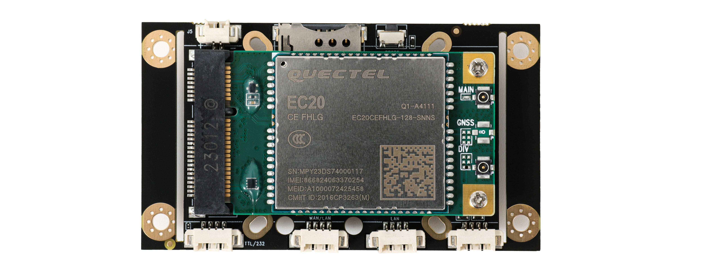
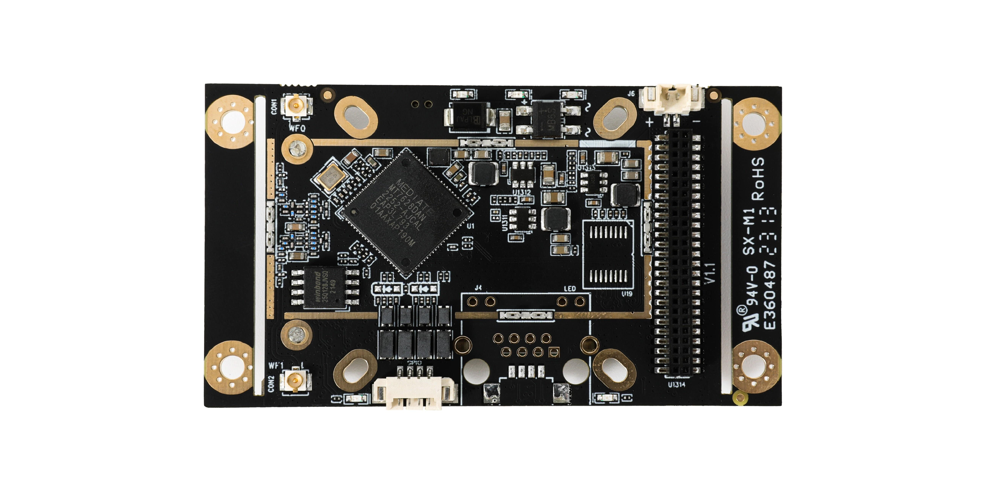
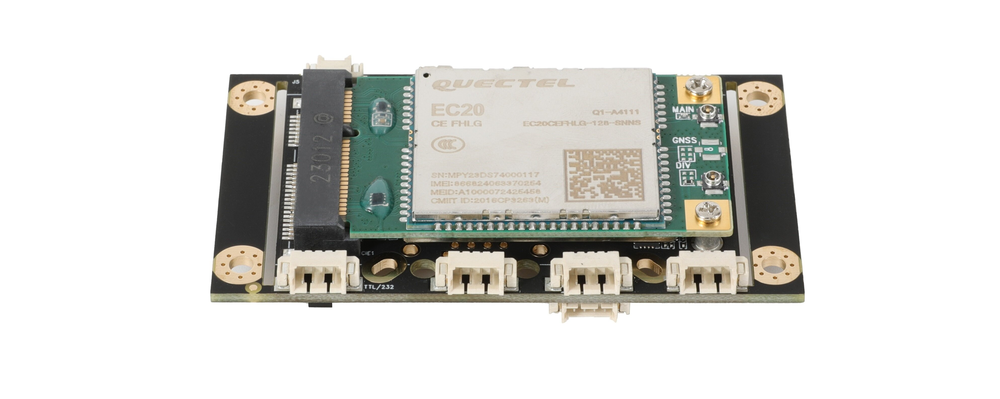
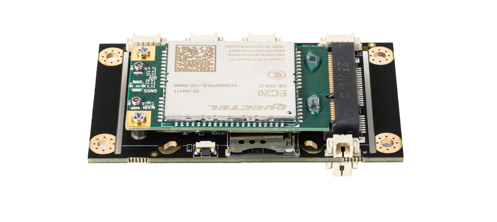
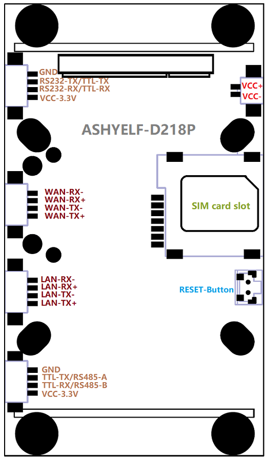
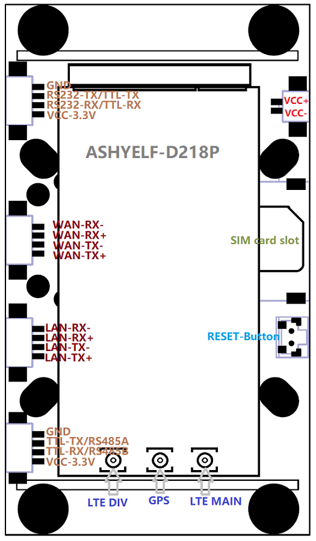
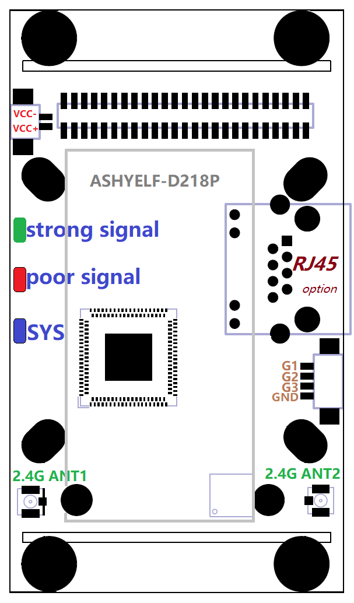
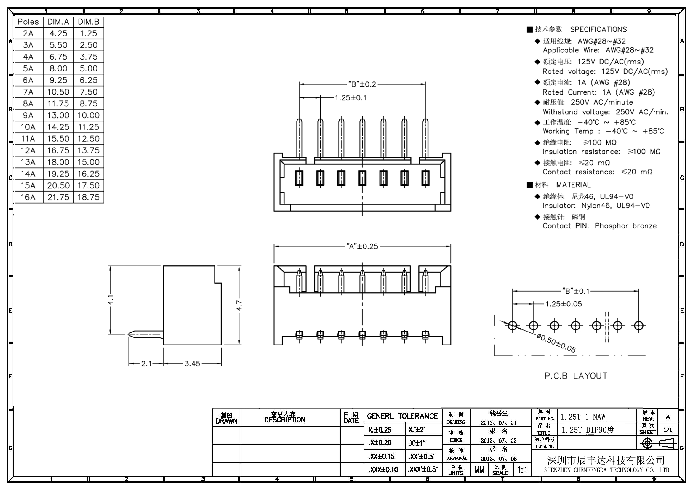

## 简介

###### D218为工业用LTE/NR网关模块
 - **3G/4G/5G全网通频段接入**
 - **双百兆以太网口**
 - **双串口**, 串口1为TTL(可定制为RS232), 串口2为RS485(可切换为TTL)
 - **无线WIFI(2.4G)双天线**, 802.11bgn, 300Mbit/s, 可做热点也可连接其它热点
 - **3路IO口(3.3V)**, 可配置输入输出, 可配置为I2C总线外接电量计或显示屏等
 - **支持PIN针母座**, 可转接5个网口、两个串口、SIM卡槽、复位按键、指示灯及IO口接口
 - **GPS及北斗定位功能**, 串口外接或使用3G/4G/5G模块自带GPS模块
 - **短信功能**, 支持短信管理网关
 - **PPTP, L2TP, IPSEC, GRE, OPENVPN, WireGuard等常用VPN功能**
 - **云平台管理, 自组网, 内网穿透功能**, 远程管理网关模块, 登陆网关模块下的设备, 查看网关模块摄象头, 控制接入网关模块的传感器
 - **支持常用的摄象头视频流字符叠加**, 可将网络信号，GPS信息，传感器数据叠加到摄象头视频流中

###### 为支持工业级应用环境带有
 - **宽温支持**, 支持低温-40度冷启动, 高温70度长期工作
 - **硬件狗**
 - **防静电保护**

###### 多种方式接入互联网
 - **3G/4G/5G接入互联网**, 支持3G/4G/5G透传模式(Modem)
 - **有线WAN口接入互联网**, 支持配置多个WAN口
 - **无线WIFI(2.4G)无线接入互联网**, 2.4G无线中继桥接, 指定连接多个热点
 - **3G/4G/5G, 有线WAN口, 2.4G无线接入同时工作**, 负载均衡, 冷备份, 热备份(可指定各连接的优先级)

###### 串口支持多种模式： 透传/Modbus/MQTT/指令模式/接GPS北斗定位模块/HTTP POST/自定义协议转换
 - **Modbus TCP/MQTT协议**, 可为PLC设备及实时物联网设备接入网络
 - **串口透传** 支持自定义注册包/激活包/保活包, 自定义包前后缀, 服务器与客户端同时工作及多服务器, 流量统计
 - **串口GPS数据上报**, 串口支持外接GPS, 可解析其数据并上报
 - **HTTP POST协议**, 可将串口数据通过HTTP POST传送到指定的服务器
 - **支持串口指令模式**, 可通过串口指令管理控制网关
 - **通过云平台将串口映射为TCP/UDP端口**, 网关模块接入云平台后可通过云平台访问其串口
 - **定制串口协议**, 开放SDK编程环境, 可为客户定制串口转换协议

###### IO口支持实时控制及监控
 - **提供MQTT协议管理IO口**, 自动订阅主题及IO变化时发布主题等功能实现远程操作及监控网关IO口电平变化
 - **提供短信管理IO口**, IO口电平变化触发短信, 短信控制IO口电平
 - **提供自定义远程管理IO口协议**, 允许远程服务器实时操作网关的IO口, 配置IO口模式, 输入模式下IO口电平发生变化时实时通知远程服务器
 - **通过平台接口管理IO口**, 网关模块接入云平台后可通过云平台API或界面管理IO口
 - **定制各种IO控制协议**, 开放SDK编程环境提供示例及标准接口可客户自定制更多IO管理口协议
 - IO口可配置为**I2C引脚实现外接I2C设备**, 如外接I2C显示屏,电池电量计等功能

###### GPS多种类数据采集上报
 - **GPS或北斗**
 - **NMEA原始数据上报**, 可指定报头及指定上报间隔
 - **MQTT数据上报**
 - **HTTP JSON数据上报**
 - **通过云平台获取定位信息**, 网关模块接入云平台后可通过云平台获取其定位

###### 多种管理协议支持, 允许用户通过协议实现本地或远程全方位管理控制网关模块
 - **本地TCP协议控制**
 - **本地HTTP协议状态查询**
 - **本地网络广播搜寻网关**
 - **本地管理工具包及编程API**, 提供Linux环境下的管理工具包, 实现在本地管理网关/OTA升级, 并开放管理工具包编程API及示例, 快速帮助客户实现对网关的管理
 - **短信管理**, 支持通过短信重启重置网关， 查询网关状态，修改网关配置等
 - **远程HTTP协议状态上报**(网关信息/终端信息/GPS信息), **远程HTTP协议控制**, **MQTT状态上报告警及MQTT网关管理等功能**
 - **远程管理云服务器SDK**, 提供Linux环境下的云管理服务器, 实现远程管理网关/OTA升级, 并开放管理工具包编程API及示例, 快速帮助客户实现对网关的远程管理

###### 为支持多功能应用及定制化开发使用了专为网关行业开发的Skin嵌入式系统
 - **完备的开发环境及开发文档免费下载**, 提供文件指导用户开发定制化的功能
 - **可跟据客户需求开发**

## 模块实物图

    

## 硬件规格
|  参数   | 规格  |
| :-----:| :---- |
| **尺寸(mm)** | 带定位板尺寸: 42mm X 73.4mm X 12.9mm, 拆除定位板尺寸：42mm X 58mm X 12.9mm |
| **4G参数(LTE)**  | 默认使用**移远EC20**双天线全网通模块, 也可搭配客户指定的其它模块或专网模块 **4G频段**: FDD LTE: B1/B3/B8 TDD LTE: B38/B39/B40/B41 **3G频段**: TDSCDMA: B34/B39  WCDMA: B1/B8 **2G频段**: CDMA 1x/EVDO: BC0  GSM: 900/1800 **带宽**: 1.4/3/5/10/15/20MHz LTE-FDD: Max 150Mbps (DL) Max 50Mbps (UL) LTE-TDD: Max 130Mbps (DL) Max 35Mbps (UL) **灵敏度** FDD B1: -97dBm (10M) FDD B3: -95dBm (10M) FDD B8: -94dBm (10M) TDD B38: -97dBm (10M) TDD B39: -97dBm (10M) TDD B40: -97dBm (10M) TDD B41: -96dBm (10M) WCDMA B1: -111dBm WCDMA B8: -110dBm TDSCDMA B34: -109dBm TDSCDMA B39: -109dBm CDMA BC0: -109dBm GSM 900: -109dBm GSM 1800: -109dBm **输出功率** Class 3 (23dBm±2dB) for LTE FDD Class 3 (23dBm±2dB) for LTE TDD Class 2 (24dBm +1/-3dB) for TD-SCDMA Class 3 (24dBm +1/-3dB) for WCDMA Class 3 (24dBm±1dB) for CDMA BC0 Class E2 (27dBm ±3dB) for EDGE 900MHz Class E2 (26dBm ±3dB) for EDGE 1800MHz Class 4 (33dBm ±2dB) for GSM 900MHz Class 1 (30dBm ±2dB) for GSM 1800MHz |
| **2.4G参数(WIFI)**   | **标准**：IEEE802.11bgn 300Mbps(2T2R) **发射功率** 11n HT40 MCS7: 15dBm 11b CCK: 18dBm 11G OFDM: 15dBm **接收灵敏度** 300Mbps: -65dBm 54Mbps: -73dBm 11Mbps: -86dBm|
| **WAN口** | 4PIN(1.25mm间距)WAN接口(10/100Mbps自适应), 网关模式及混合模式为**WAN接口**, 其它模式下为**LAN接口**, 自带LINK指定灯  |
| **LAN口** | 4PIN(1.25mm间距)LAN接口(10/100Mbps自适应), 自带LINK指定灯  |
| **串口1** | 4PIN(1.25mm间距)串口接口, *默认**TTL电平**, 可选配置为**IO接口**, 并定制提供RS232电平串口*  |
| **串口2** | 4PIN(1.25mm间距)串口接口, *默认**RS485串口**, 可切换为TTL电平串口*   |
| **IO口(3个)** | 4PIN(1.25mm间距)式IO接口, *默认3路IO口, 可选配置为**I2C接口**加1路IO口*  |
| **电源供电口(2个)** | **立式**及**卧式**的2PIN(1.25mm间距)式供电接口(7-15V/2-3A)各一个(*可选支持5V*)，建议使用12V1A给其中之一供电即可  |
| **定位孔** | 8个定位孔, 分4个内定位孔(34mm*34mm)及4个外定位孔, *4个外定位孔所在的定位板可拆除*  |
| **WIFI天线接口(2个)** | WIFI2.4G IPEX-1天线接口*2  |
| **3G/4G天线接口(2个)** | 默认提供**2个4G IPEX-1接口**, *可选提供2个4G IPEX-1接口和GPS IPEX-1接口* |
| **SIM卡槽** | Micro SIM卡槽， **缺口向外触面向PCB板插入, 不支持热插拔** |
| **按键(1个)** | 复位按键 |
| **指示灯(3个)** | **系统灯(蓝)**:刚上电时常亮，启动后但未连接慢闪，正在拨号时快闪， 连接网络成功后常亮 **信号灯(红)**: 4G信号弱时亮 **信号灯(绿)**: 4G信号强时亮 |
| **PIN针母座(50PIN)** | **双排（1.0mm间距）50PIN母座, 可向外提供以下接口转接** 2个带变压器网口 3个无变压器网口 两个串口 4路供电口 SIM卡接线 按键及指示灯 IO接口  |
| **功耗（满负荷时）** | 小于3W, 基于无线环境与网络负载不同瞬间峰值可能会高于3W， 建议提供5W功率 |
| **温度** | 工作温度： -40℃ ~ +75℃ |

## 硬件配置表
|  接口  | D218标准版  | D218-232  | D218-GPS  | D218核心版  |
|:-----:|:----:|:----:|:----:|:----:|
| 串口1-TTL| V |  | V | V |
| 串口1-RS232|  | V |  |  |
| 串口2-RS485/TTL软件可配置| V | V | V | V |
| LTE全网通基带| V | V | V | V |
| GPS定位 |  |  | V |  |
|MiniPCI-E插槽-自配LTE模块|  |  |  | V |

***如需更多其它配置请联系销售***

## 软件功能表
|  功能   | 描述  |
| :-----:| :---- |
| **联网方式** | **单连接上网**： 3G/4G/5G上网，有线上网，无线上网，桥接，中继，无线互联网, 3G/4G/5G透传(Modem)模式 **混合(多WAN)上网**： 3G/4G/5G与以太网有线上网同时工作, 备份及负载均衡带宽叠加 3G/4G/5G与无线WIFI上网同时工作, 备份及负载均衡带宽叠加 无线WIFI上网与以太网有线上网同时工作, 备份及负载均衡带宽叠加 **组合上网模式**: 3G/4G/5G上网+桥接， 3G/4G/5G上网+有线接内网, 3G/4G/5G上网+无线接内网, 其它复杂定制组合 |
| **LTE/NR网络**| 3G/4G/5G支持 **多种拨号模式** (如点对点, 网卡拨号等), *可选支持IPV6协议栈* 3G/4G/5G支持1000多个运营商， **自动匹配运营商** **APN支持自定义** 支持SIM卡 **PIN码** **短信管理(SMS)** **锁网络制式** **锁频段** **锁小区** **锁SIM卡** **锁3G/4G/5G模块** 自定义查询/设置AT指令 |
| **网络稳定性**| 多种网络保活机制, **ICMP检测**, **接收包计数检测** 连续失败恢复等功能, *并可配置相关细节及阀值*，确保数据终端永久在线 |
| **串口功能**| 串口支持 **透传** 模式, 支持指定帧长度帧间隔、流控、自定义注册包/保活包、自定义包前后缀、向串口发送自定义激活包、**多服务器与客户端同时工作**、**多协议同时工作**、**流量统计** 串口透传支持 **多数据中心** 功能 串口支持 **ModbusRTU** 协议(*将串口上的ModbusRTU转换成ModbusTCP*) 串口支持 **MQTT数据透传** (*并支持向串口发送自定义激活包*) 串口支持 **指令模式**, *支持专有HE指令用于控制及管理网关* 串口支持 **外置GPS及北斗模块** ，并可将GPS数据解析并上传或摄象头视频流字符叠加 串口支持**外接温感烟感**等多种传感器, 并可将数据解析并上传或摄象头视频流字符叠加 |
| **网关稳定性**| 工业级硬件看门狗 3路独立供电单元相互监控 低温自热机制 自动重启(*定时或定点及空闲时重启*) |
| **高可用性**| 多网关间相互备用, *高可用性HA(VRRP), 单台网关故障可切换到备用网关* |
| **虚拟专用网**| 支持L2TP客户端(*支持隧道密码*) PPTP客户端(*支持MPPE*) GRE隧道 OpenVPN客户端(*支持预共享密钥,证书*) IPSEC(*支持预共享密钥,证书*) WireGuard 自组网 内网穿透 |
| **GPS定位**| 支持 **NMEA协议TCP/UDP上报**(*可指定包头及上报间隔*) 支持 **TCP/UDP NMEA服务器** 功能(*允许其它客户端主动连接网关获到定位信息, 允许指定客户端数*) 支持 **MQTT协议**上报定位信息 支持 **HTTP JSON协议**上报定位信息 支持 **JT/T808协议**上传定位信息 |
| **网络应用**| 防火墙 端口映射(NAT)及DMZ主机 端口代理 域名劫持 应用层网关 静态路由表管理 **源地址路由**, **端口路由**等高级路由功能 DDNS(支持花生壳及多种国内外运营商) UPNP 域名重定向 IGMP正向/反向代理 动态路由协议（RIPv1、RIPv2、RIPng、OSPFv2、OSPFv3） SNMP(可自定义OID) |
| **网络监控**| 网络实时流量图， 终端实时流量及用量统计, 终端流量控制、访问控制、定时上网 终端远程唤醒(WOL) |
| **无线(WIFI)功能**| 2.4G无线热点 2.4G无线网卡 无线黑白名单 发射功率调整 Portal功能：自定义广告界面, *WIFIdog广告推送(需定制)*，*Coova Chilli广告推送(需定制)* |
| **时间管理**| 基站对时 NTP对时 支持 **局域网对其它设备授时**, *给某些专网用无RTC摄象头等设备提供正确的时间* |
| **开发接口**| 局域网搜索协议(发现网关), 局域网TCP/HTTP控制协议(控制网关) 局域网批量升级协议(批量升级网关固件) 远程HTTP控制协议(云平台管理) 网关信息(3G/4G/5G信号连接时长流量/网关基本信息等各种网关状态), GPS信息, 终端信息(终端MAC地址/连接时间及时长)等上报协议 网页接口获取网关信息API IO口远程控制协议 远程MQTT监控协议(告警云平台) 终端命令行(SSH/Telnet/串口)接口 在线开发脚本项目(开发shell脚本并注册为开机或关机或事件触发运行,并可在线开发管理界面), 在线将脚本项目打包用于安装于其它网关中 在线开发定时运行指定的脚本 短信(SMS)控制协议|
| **第三方开发支持**| SkinOS系统属于开放式Linux操作系统, 针对项目用户可提供完整的开发环境, 支持客户自已开发应用软件 系统为纯C语言开发的网关操作系统, 可运行于嵌入式芯片平台及X86工控机中, 性能高, 功耗低, 发热量小 提供组件式开发环境, 可基于系统现有的组件方便的开发客户应用软件包(FPK软件包)并可跨嵌入式平台应用 组件式开发环境提供统一的API及丰富的组件接口供客户调用 堆叠式的组件应用开发可快速开发客户定制项目, 并生成软件包, 客户定制项目可无修改跨平台移植到所有支持Skin系统的产品中|
| **远程管理** |批量查看网关状态及管理 批量重启及复位网关， 批量升级网关 远程登录网关管理界面 远程SSH/Telnet登录网关 远程登录网关下设备的管理界面 远程SSH/Telnet登录网关下设备 *备份网关配置到云平台/下发备份的配置到网关(开发中)* 远程管理服务器提供API接口及SDK,允许用户基于远程服务器实现更多功能|
| **内网穿透** |可将网关下设备的TCP/UDP端口映射到公网地址 可定制提前预建连接池实现快速反应|
| **异地组网** |网关间异地自由组网 多子网组网 使用SSLv3加密保证数据安全 多主干, 多终端, 终端与主干使用P2P通信(超低延迟不限流) |
| **网关管理**| 备份及导入配置，本地升级, 在线升级, 局域网批量升级 LOGO上传，WEB管理界面定制上传，定制默认配置，*恢复出厂也可保留* 英文切换, *恢复出厂也可保留* 可安装卸载FPK软件包, 可恢复原始固件状态 云平台远程管理 Telnet/SSH连入网关 串口命令行管理（CLI） 指示灯开关， IO口常用功能定义 本地及远程日志 **IO扩展（支持自定义输入及输出）用于工业控制, 通过自定义协议或MQTT协议远程实时控制** **升级失败可恢复**（不死Bootloader） 可定制普通用户及超级用户界面区分管理, **锁定指定配置**, **锁定升级**, **锁定重启**, **锁定恢复出厂及锁定配置导入导出**等功能 **提供x86/aarch64(arm)平台的网关管理工具包及OTA升级工具** 支持专有工具实现 **批量升级**, **批量测试** |
| **最大用户数**| 无线：20个， 有线：50个 |

## 模块正面接口图 

|  **未插LTE模块**   | **带LTE模块**  |
| :-----:| :----: |
|   |  | 

###### VCC+与VCC- : **卧式电源供电口, 2PIN座子(1.25mm), VCC+为正极, VCC-为负极** ***模块可选两个位置供电口之一***

###### SIM card slot: **SIM卡插槽, 可插入Micro SIM卡**
- SIM卡缺口向外接触面向PCB板插入

###### RESET-Button: **恢复出厂按键**
- 上电开机后按下5至8秒钟松开模块将恢复出厂并重启

###### 串口1: **由GND, RS232-TX/TTL-TX, RS232-RX/TTL-RX, VCC-3.3V组成**
- GND引脚为接地, VCC-3.3V引脚输出3.3V供电
- 串口1默认为TTL模式, RS232-TX/TTL-TX为发送, RS232-RX/TTL-RX为接收, 可定制为RS232模式

###### 串口2: **由GND, TTL-TX/RS485-A, TTL-RX/RS485-B, VCC-3.3V组成**
- GND引脚为接地, VCC-3.3V引脚输出3.3V供电
- 串口2有两种模式可配置, 默认RS485模式, 为RS485模式时, TTL-TX/RS485-A为RS485的A, TTL-RX/RS485-B为RS485的B
- 串口2也可配置为TTL模式, 为TTL模式时, TTL-TX/RS485-A为TTL的发送, TTL-RX/RS485-B为TTL的接收

###### WAN口: **由WAN-RX-, WAN-RX+, WAN-TX-, WAN-TX+组成, 为有线网口**
- 在默认配置下WAN口即为LAN口, 用于连接其它有线设备, 为其提供上网服务
- 而将模块的工作模式配置为有线宽带或混合模式时, WAN口即为WAN口, 用于连接其它的路由器实现接入互联网
    > WAN-TX- 与 网线序号1 相连
    > WAN-TX+ 与 网线序号2 相连
    > WAN-RX- 与 网线序号3 相连
    > WAN-RX+ 与 网线序号6 相连
    > ***网口具有自适应功能， 即WAN-TX-/WAN-TX+可与网线1/2随意置换， WAN-RX-/WAN-RX+可与网线3/6随意置换, WAN-TX-/WAN-TX+这也可与网线3/6接而WAN-RX-/WAN-RX+可与网络1/2接***

###### LAN口: **由LAN-RX-, LAN-RX+, LAN-TX-, LAN-TX+组成, 为有线网口**
- 用于连接其它有线设备, 为其提供上网服务
    > LAN-TX- 与 网线序号1 相连
    > LAN-TX+ 与 网线序号2 相连
    > LAN-RX- 与 网线序号3 相连
    > LAN-RX+ 与 网线序号6 相连
    > ***网口具有自适应功能， 即LAN-TX-/LAN-TX+可与网线1/2随意置换， LAN-RX-/LAN-RX+可与网线3/6随意置换, LAN-TX-/LAN-TX+这也可与网线3/6接而LAN-RX-/LAN-RX+可与网络1/2接***

###### LTE天线: **由LTE MAIN, GPS, LTE DIV组成, 为IPEX-1的天线接头, 用于连接对应的天线**
- LTE MAIN为LTE的主天线接口, 用于接LTE天线, 在使用4G上网功能时必须要接
- GPS用于接GPS天线, 默认没有此天线接口, 而在特定的型号中会带有此天线接口, 带有此天线接口的模块表示外接GPS天线后即拥有GPS定位功能
- LTE DIV为LTE的分集天线接口, 在使用4G上网功能时在此接口上接LTE天线将会提高信号质量及带宽

## 模块背面接口图

 

###### VCC+与VCC- : **立式电源供电口, 2PIN座子(1.25mm), VCC+为正极, VCC-为负极** ***模块可选两个位置供电口之一***

###### SYS: **蓝色系统指示灯**
- 刚上电时常亮
    > 上电后不亮表示通电不正常或模块可能损坏
- 启动后自检时慢闪
    > 自检失败将一直保持慢闪
    > 慢闪时一直保持亮与灭时长相同表示未识别到LTE模块
    > 慢闪时一直保持灭比亮时长表示未识别到SIM卡
- 正在拨号时快闪
    > 模块升级时也会快闪
- 连接网络成功后常亮

###### poor signal: **红色信号强度指示灯, LTE信号弱时亮**
- LTE信号弱时长亮
- LTE信号非常弱时闪

###### strong signal： **绿色信号强度指示灯, LTE信号强时亮**
- LTE信号非常强时长亮
- LTE信号良好时闪

###### 2.4G ANT1: **2.4G的WIFI天线1, 用于接IPEX-1头的2.4G WIFI天线**

###### 2.4G ANT2: **2.4G的WIFI天线2, 用于接IPEX-1头的2.4G WIFI天线**

###### G1/G2/G3/GND: **IO口, 3个IO口都可支持输入及输出**
- G1为IO口1, 当配置为I2C时, 此引脚为I2C的SCL, *即串行时钟线*
- G2为IO口2, 当配置为I2C时, 此引脚为I2C的SD, *即串行数据线*
- G3为IO口3
- GND为接地
    > 使用IO口可以从模块的其它任意接口中取GND或VCC-3.3V

## 尺寸图(具体以dxf文件为准)

 

## WAN, LAN, 串口, IO及电源供电接口规格

 

## 其它资料

[快速安装说明](./setup.md)

[底座接口说明](./spec_misc.md)

----

