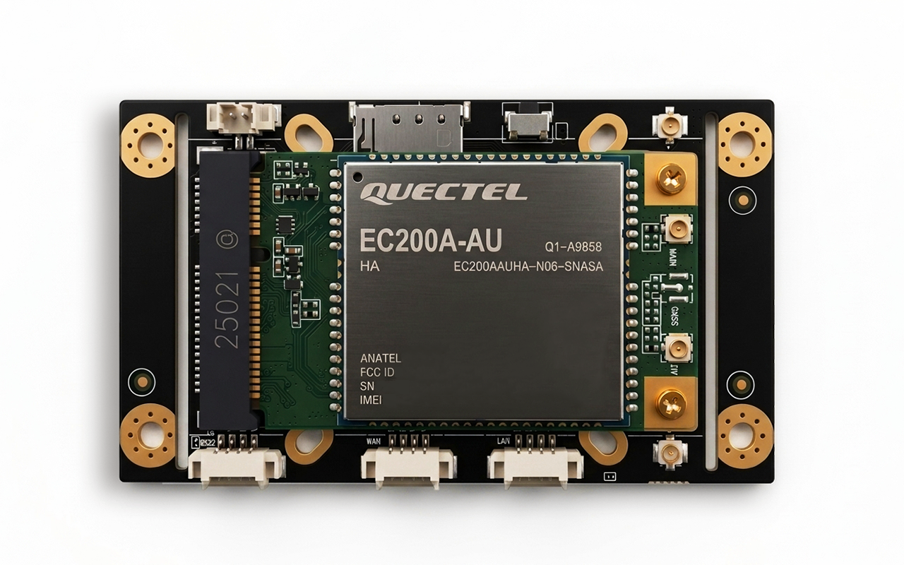
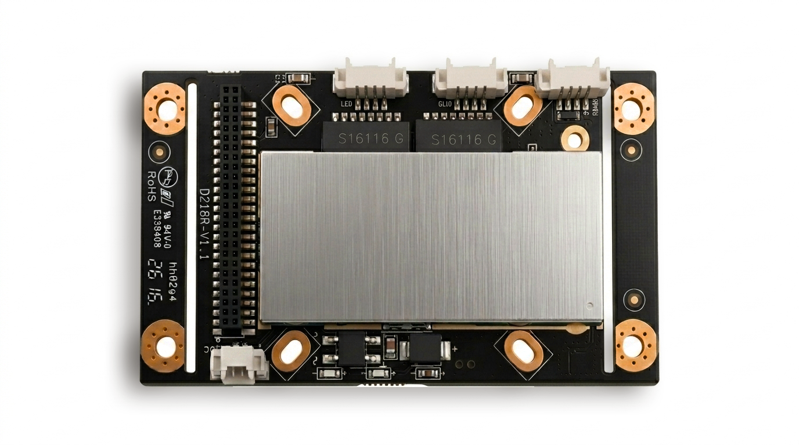
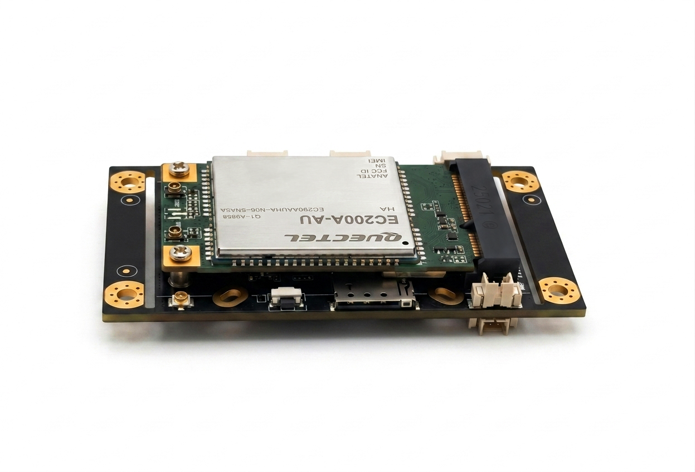
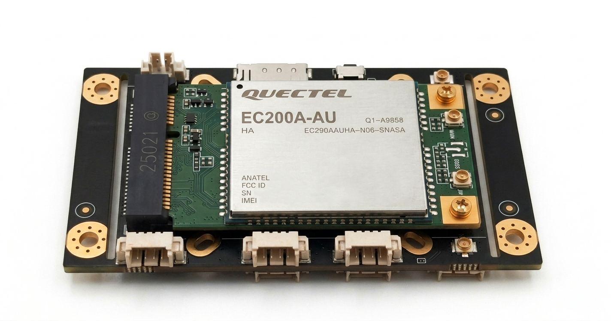
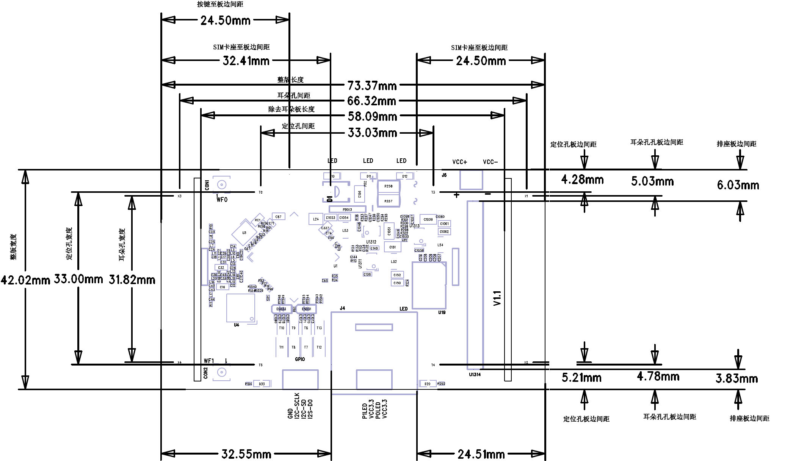
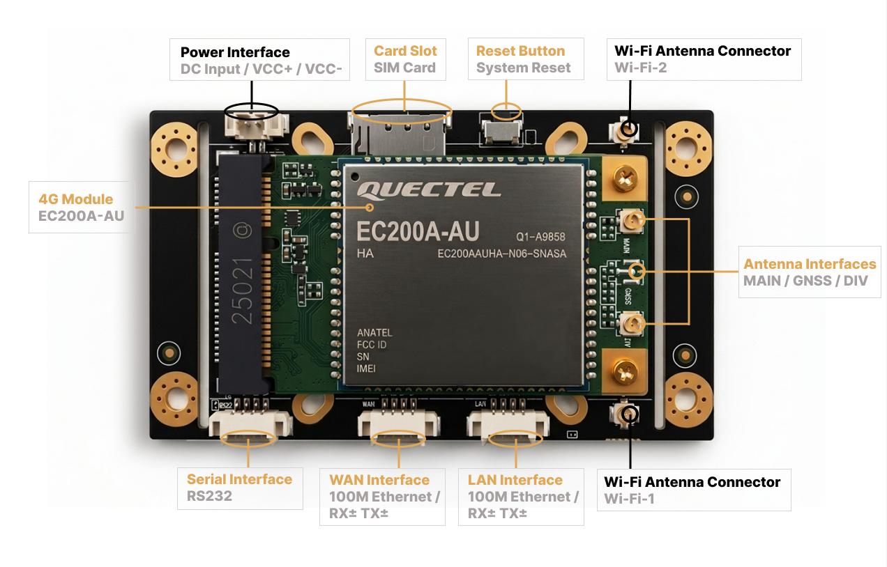
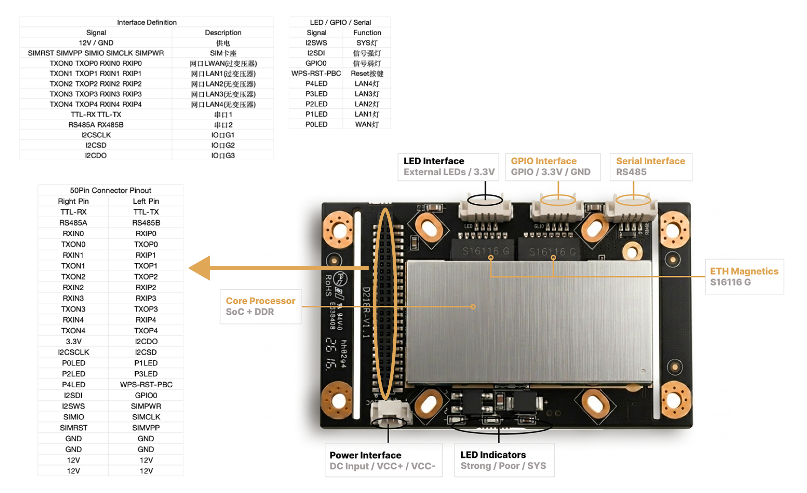
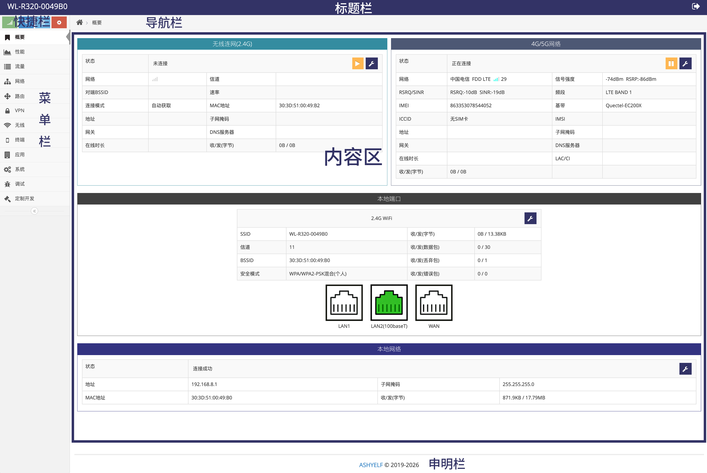

# D218R 产品规格书

Rev. 1.0 | 客户评审版

D218R 是一款面向 OEM 设备、工业联网、远程设备访问、串口数据应用和紧凑型嵌入式路由部署的工业 LTE 网关模块。模块提供蜂窝网络接入、双 10/100 Mbps 以太网接口、双串口、2.4 GHz Wi-Fi、可配置 IO、可选定位、短信管理、VPN 功能以及远程管理平台支持。蜂窝模块型号和支持制式可根据目标区域、运营商和项目配置确认。

表 0-1. 文档信息

| 文档字段 | 内容 |
| --- | --- |
| 产品 | D218R 工业 LTE 路由模块 |
| 文档版本 | Rev. 1.0 |
| 文档状态 | 客户评审版 |
| 保密级别 | 客户保密资料 |
| 适用范围 | 工程评审、OEM 集成、样品评估和项目沟通 |
| 文档日期 | 2026-05-27 |

# 1. 产品概述

D218R 采用板级模块形态，适用于需要将蜂窝路由、以太网、Wi-Fi、串口、IO 和远程管理能力集成到客户设备中的项目。模块可作为紧凑型工业网关独立使用，也可通过 50Pin 板对板连接器扩展更多接口资源，便于 OEM 设备、工业现场设备和远程运维系统集成。

该模块面向嵌入式集成场景，最终外壳、天线布局、供电方式、接口引出和安装结构应结合客户项目进行评审确认。

## 1.1 主要能力

- 根据所选蜂窝模块和区域项目配置，支持蜂窝网络接入，具体网络制式、频段和运营商适配能力取决于所选蜂窝模块、固件版本和项目配置。
- 双 10/100 Mbps 以太网接口，WAN/LAN 角色随工作模式变化。
- 两个串口：UART1 默认 TTL，可按项目定制 RS232；UART2 默认 RS485，并可通过软件选择 TTL 模式。
- 2.4 GHz 802.11 b/g/n Wi-Fi，2T2R 天线设计，支持 AP、客户端/中继等使用场景。
- 三路 3.3 V IO，可按项目定义配置为输入/输出或类 I2C 扩展用途。
- 50Pin 连接器用于扩展以太网、串口、SIM、复位、指示灯、IO 和电源接口。
- 支持 PPTP、L2TP、IPsec、GRE、OpenVPN、WireGuard、远程组网、NAT 穿透等 VPN 和专网功能。
- 支持远程平台管理，包括设备状态、远程访问、Web UI 入口、终端访问、OTA 流程和项目集成。
- 基于 Skin 嵌入式系统平台，支持组件化开发和项目级定制。
## 1.2 目标应用

表 1-1. D218R 典型应用场景

| 应用场景 | 典型用途 |
| --- | --- |
| 工业网关 | 通过蜂窝网络、以太网、Wi-Fi、串口或 IO 连接 PLC、传感器、控制器或现场设备 |
| OEM 嵌入式路由器 | 将蜂窝路由和远程访问能力集成到客户外壳或设备平台中 |
| 远程监测 | 向远程服务器或平台上报设备状态、串口数据、IO 状态、定位数据或摄像机叠加信息 |
| 移动与现场设备 | 为分布式资产提供蜂窝接入、Wi-Fi 热点、远程诊断和 VPN 连接能力 |
| 定制协议网关 | 通过 SDK 和组件开发实现客户专属串口、IO 或远程管理协议 |

## 1.3 系统平台

- D218R 使用 Skin 嵌入式系统平台。Skin 是基于嵌入式 Linux 的网关系统，面向模块化开发、远程管理、协议转换、软件包部署和现场定制。项目用户可根据项目范围申请开发文档、SDK 支持、管理工具、OTA 工具或定制组件开发。
# 2. 外观与结构信息

## 2.1 模块视图

下图展示 D218R 模块的外观形态，用于产品识别、结构评估和安装空间规划。

图2-1. D218R 模块正面视图

图2-2. D218R 模块背面视图

图2-3. D218R 模块侧面视图

图2-4. D218R 模块斜面视图

## 2.2 尺寸与安装

表 2-1. D218R 结构尺寸与安装信息

| 项目 | 规格/说明 |
| --- | --- |
| 带定位板整体尺寸 | 42 mm × 73.4 mm × 12.9 mm |
| 去除定位板后尺寸 | 42 mm × 58 mm × 12.9 mm |
| 安装孔 | 8 个定位孔：4 个内部安装孔，间距 34 mm × 34 mm；可拆定位板上另有 4 个外部定位孔 |

图2-5. D218R 机械尺寸图

## 2.3 操作与 ESD 注意事项

- D218R 以 PCBA 模块形式供货。操作时应避免直接接触裸露元器件和连接器针脚。
- 装配、检查和现场更换时，应使用防静电工作台、接地腕带和合适的防静电包装。
- 除非项目设计明确支持，否则模块上电时不得插拔 SIM 卡。
- 部署前应评审最终外壳、天线走线、接地、散热设计和安装方式。
# 3.硬件规格

D218R 的主要硬件规格如下，具体配置可能因蜂窝模块、区域认证、硬件版本和项目需求调整。

表 3-1. D218R 硬件规格总表

| 参数 | 规格/说明 |
| --- | --- |
| 蜂窝模块 | 标准参考配置为 Quectel EC20 全网通 LTE 模块；具体模块型号可根据目标区域、认证、运营商和供货要求调整 |
| 蜂窝接入 | 根据安装的蜂窝模块、固件支持、运营商要求和区域认证范围，支持蜂窝网络接入，具体制式以所选模块和项目配置为准 |
| 以太网 | 板载两个 4Pin 1.25 mm 10/100 Mbps 以太网接口：WAN 和 LAN；接口角色取决于工作模式 |
| Wi-Fi | 2.4 GHz 802.11 b/g/n，2T2R，理论 PHY 速率最高 300 Mbps；支持 AP 和客户端/中继等固件配置 |
| 串口 1 | 4Pin 1.25 mm 串口连接器；默认 TTL 电平；可按项目提供 RS232 定制 |
| 串口 2 | 4Pin 1.25 mm 串口连接器；默认 RS485，可根据项目配置支持 TTL 模式 |
| IO | 三路 3.3 V IO，可配置输入/输出；可按项目配置将部分 IO 用作类 I2C 功能 |
| 电源输入 | 两个 2Pin 1.25 mm 电源连接器位置：立式和卧式。除项目设计另有说明外，任选一个电源输入位置使用 |
| 输入电压 | 7-15 V，推荐供电 12 V / 1 A；是否支持 5 V 输入需根据项目配置确认 |
| 功耗 | 满载功耗 < 3 W；瞬时峰值功耗可能随无线环境、网络状态和业务负载变化；建议预留不少于 5 W 的电源功率预算 |
| SIM | Micro SIM 卡槽，SIM 卡插入时缺口朝外，金属触点朝向 PCB；设备上电状态下禁止插拔 SIM 卡 |
| 天线 | 2 × 2.4 GHz Wi-Fi IPEX-1；默认 2 × LTE IPEX-1；可选 GPS IPEX-1 取决于型号/项目配置 |
| 按键 | 1 个复位按键 |
| 指示灯 | 系统指示灯、弱信号指示灯、强信号指示灯，用于显示系统运行状态、蜂窝网络连接过程及信号强度状态；具体灯态定义以固件版本和项目配置为准 |
| 50Pin 连接器 | 双排 1.0 mm 间距 50Pin 连接器，用于扩展以太网、串口、SIM、复位、LED、IO 和电源接口 |
| 工作温度 | 支持 -40 °C 冷启动并可长期工作至 +70 °C |
| 防护与可靠性 | 支持硬件看门狗、链路保活、异常恢复和定时/空闲重启等可靠性机制；具体功能以固件版本和项目配置为准 |

## 3.1 蜂窝通信参考

下表蜂窝通信参数以 Quectel EC20 LTE 模块为参考。不同目标区域的模块选型、频段、认证、天线配置、产品标签和运营商准入要求，应在项目阶段确认。

表 3-2. 蜂窝通信参考参数

| 项目 | 参考规格 |
| --- | --- |
| 参考 LTE 模块 | Quectel EC20 LTE 模块 |
| LTE FDD 频段 | B1 / B3 / B8 |
| LTE TDD 频段 | B38 / B39 / B40 / B41 |
| 3G 频段 | TD-SCDMA B34 / B39; WCDMA B1 / B8 |
| 2G 频段 | CDMA 1x/EVDO BC0; GSM 900 / 1800 |
| LTE 带宽 | 1.4 / 3 / 5 / 10 / 15 / 20 MHz |
| LTE FDD 吞吐率 | 最大 150 Mbps 下行 / 最大 50 Mbps 上行 |
| LTE TDD 吞吐率 | 最大 130 Mbps 下行 / 最大 35 Mbps 上行 |
| 输出功率 | 以所选蜂窝模块的数据手册为准 |

## 3.2 Wi-Fi 通信参考

表 3-3. Wi-Fi 通信参考参数

| 项目 | 参考规格 |
| --- | --- |
| 标准 | IEEE 802.11 b/g/n, 2.4 GHz |
| MIMO | 2T2R |
| 理论 PHY 速率 | 最高 300 Mbps |
| 发射功率参考 | 11n HT40 MCS7: 15 dBm; 11b CCK: 18 dBm; 11g OFDM: 15 dBm |
| 接收灵敏度参考 | 300 Mbps: -65 dBm; 54 Mbps: -73 dBm; 11 Mbps: -86 dBm |

# 4. 接口资源与电气定义

本章用于说明 D218R 的主要接口位置、电气定义和扩展接口资源。接口标注图用于快速识别器件和连接器位置，具体信号定义、接线方式和项目配置要求以对应表格为准。

## 4.1 正面接口布局

D218R 正面集成蜂窝模块、SIM 卡槽、复位按键、WAN/LAN、串口、电源和天线接口。下图用于快速识别正面主要接口和器件位置。

图4-1. D218R 正面接口与主要器件布局

表 4-1. 正面接口定义

| 接口 | 定义/说明 |
| --- | --- |
| 卧式电源输入 | VCC+ 和 VCC-，2Pin 1.25 mm 连接器；VCC+ 为正极，VCC- 为地/负极。使用任一可用电源输入位置 |
| SIM 卡槽 | Micro SIM 卡槽；插入时缺口朝外、触点面朝 PCB |
| 复位按键 | 系统启动后长按约 5-8 秒后松开，可恢复出厂设置并重启 |
| 串口 1 | GND、RS232-TX / TTL-TX、RS232-RX / TTL-RX、VCC-3.3V。默认 TTL；可提供 RS232 定制 |
| 串口 2 | GND、TTL-TX / RS485-A、TTL-RX / RS485-B、VCC-3.3V。默认 RS485；可配置为 TTL 模式 |
| WAN | WAN-RX-、WAN-RX+、WAN-TX-、WAN-TX+；10/100 Mbps 以太网接口，角色取决于工作模式 |
| LAN | LAN-RX-、LAN-RX+、LAN-TX-、LAN-TX+；10/100 Mbps 以太网接口，用于本地有线设备接入 |
| LTE 天线 | LTE MAIN 和 LTE DIV IPEX-1 连接器；LTE MAIN 为蜂窝接入必需接口；LTE DIV 可改善信号质量和吞吐表现 |
| GPS 天线 | 所选型号/配置支持时，可提供 GPS 天线接口 |

### 4.1.1 WAN/LAN 接线参考

D218R 的 WAN/LAN 接口为 10/100 Mbps 以太网差分信号。进行线束或转接板设计时，可按下表进行 RJ45 线序参考；实际设计应结合以太网变压器、ESD 防护、线缆长度和项目结构要求确认。

表 4-2. WAN/LAN 接线参考

| 接口信号 | RJ45 参考线序 | 说明 |
| --- | --- | --- |
| WAN-TX- / LAN-TX- | 1 | 发送差分负信号 |
| WAN-TX+ / LAN-TX+ | 2 | 发送差分正信号 |
| WAN-RX- / LAN-RX- | 3 | 接收差分负信号 |
| WAN-RX+ / LAN-RX+ | 6 | 接收差分正信号 |
| 自适应说明 | - | 以太网接口支持自适应，TX/RX 差分对可根据实际网络设备自动协商；转接设计仍建议按标准线序和阻抗要求布线 |

## 4.2 背面接口布局

D218R 背面包含 50Pin 扩展连接器、LED/GPIO/RS485 接口、电源接口、以太网磁性器件和电源管理单元。下图用于快速识别背面主要接口和功能区域。

图4-2. D218R 背面接口与功能区域布局

表 4-3. 背面接口定义

| 接口 | 定义/说明 |
| --- | --- |
| 立式电源输入 | VCC+ 和 VCC-，2Pin 1.25 mm 连接器；除非另有定义，使用一个电源输入位置即可 |
| SYS 指示灯 | 蓝色系统指示灯；上电早期常亮，启动/自检时慢闪，拨号或升级时快闪，联网成功后常亮 |
| 弱信号指示灯 | 红色信号指示灯；常亮或闪烁行为按固件定义表示蜂窝信号较弱 |
| 强信号指示灯 | 绿色信号指示灯；常亮或闪烁行为按固件定义表示蜂窝信号较强/良好 |
| 2.4G ANT1 / ANT2 | 2.4 GHz Wi-Fi IPEX-1 天线连接器 |
| G1 / G2 / G3 / GND | 三路 IO 和地；配置为类 I2C 用途时，G1/G2 可作为 I2C SCL/SDA；G3 默认作为 IO 使用，具体功能以项目配置为准 |

### 4.2.1 指示灯状态说明

指示灯状态可用于现场安装、调试和故障排查。不同固件版本可能存在细节差异，最终灯态定义以项目固件为准。

表 4-4. 指示灯状态说明

| 指示灯 | 状态 | 含义 |
| --- | --- | --- |
| SYS 系统指示灯 | 上电早期常亮 | 模块已上电，系统处于启动初期 |
| SYS 系统指示灯 | 启动/自检慢闪 | 系统启动或自检中；如长时间保持异常慢闪，应检查蜂窝模块、SIM 卡和固件状态 |
| SYS 系统指示灯 | 拨号或升级快闪 | 蜂窝网络拨号中，或系统正在执行升级相关操作 |
| SYS 系统指示灯 | 联网成功后常亮 | 系统已完成启动并成功连接网络 |
| 弱信号指示灯 | 常亮或闪烁 | 表示蜂窝信号较弱或网络环境不稳定，建议检查天线连接、安装位置和运营商网络覆盖 |
| 强信号指示灯 | 常亮或闪烁 | 表示蜂窝信号良好或较强，具体闪烁规则以固件定义为准 |

## 4.3 50Pin 连接器扩展

50Pin 连接器用于扩展以太网、SIM、串口、IO、指示灯、复位和电源等接口。各引脚组功能说明如下。

图4-3. D218R 背面 50Pin 连接器布局

表 4-5. 50Pin 连接器引脚组功能说明

| 引脚组 | 功能/说明 |
| --- | --- |
| 12V / GND | 电源与地接口。通过 50Pin 连接器供电时，建议至少使用两组电源/地引脚；如条件允许，优先使用四组以提升供电可靠性 |
| SIMRST / SIMVPP / SIMIO / SIMCLK / SIMPWR | 外部 SIM 卡接口信号。除非项目设计明确支持，外部 SIM 卡座与板载 SIM 卡座不应同时使用 |
| TXON0 / TXOP0 / RXIN0 / RXIP0 | LWAN 以太网差分信号，与板载 WAN 接口共用 |
| TXON1 / TXOP1 / RXIN1 / RXIP1 | LAN1 以太网差分信号，与板载 LAN 接口共用 |
| TXON2 / TXOP2 / RXIN2 / RXIP2 | LAN2 以太网差分信号；外接 RJ45 接口前需配置以太网变压器 |
| TXON3 / TXOP3 / RXIN3 / RXIP3 | LAN3 以太网差分信号；外接 RJ45 接口前需配置以太网变压器 |
| TXON4 / TXOP4 / RXIN4 / RXIP4 | LAN4 以太网差分信号；外接 RJ45 接口前需配置以太网变压器 |
| TTL-RX / TTL-TX | 串口 1 TTL 信号，与板载串口 1 接口共用 |
| RS485A / RS485B | 串口 2 RS485 信号，与板载串口 2 接口共用 |
| I2CSCLK / I2CSD / I2CDO | IO 扩展信号，可根据项目配置用于 G1/G2/G3 或类 I2C 扩展功能 |
| I2SWS / I2SDI / GPIO0 | 系统指示灯、强信号指示灯、弱信号指示灯相关信号。具体灯态定义以固件版本和项目配置为准 |
| WPS-RST-PBC | 复位按键信号 |
| P0LED-P4LED | LWAN 及 LAN1-LAN4 以太网链路指示灯信号 |

结构设计和项目导入阶段，应同步确认 50Pin 连接器型号、焊盘布局、主体高度、插拔方向和配套连接器。

表 4-6. 50Pin 连接器结构与项目确认项

| 项目 | 说明 |
| --- | --- |
| 连接器类型 | 50Pin 双排板对板连接器，具体型号以最终 BOM 和项目配置为准 |
| 适用功能 | 扩展以太网、SIM、串口、IO、指示灯、复位和电源等接口 |
| 结构确认 | 结构设计前应确认连接器间距、焊盘布局、主体高度、插拔方向、配套连接器和装配空间 |
| 电源使用 | 如通过 50Pin 连接器供电，建议至少使用两组电源/地引脚；如条件允许，优先使用四组 |
| 备注 | 最终尺寸、焊盘和机械配合要求以项目确认的连接器规格书、BOM 和结构文件为准 |

## 4.4 板载连接器结构与选型说明

表 4-7. 板载连接器结构与选型说明

| 项目 | 说明 |
| --- | --- |
| 连接器类型 | 1.25 mm 间距卧式/立式板端连接器，具体型号以最终 BOM 和项目配置为准 |
| 适用接口 | WAN、LAN、串口、IO、电源等板载接口 |
| 结构确认 | 结构定版前，应确认连接器间距、配套端子、主体高度、插拔方向、装配空间和线束出线方向 |
| 供货确认 | 量产前应确认连接器型号、配套端子、供应周期和生命周期供货状态 |

# 5. 联网与路由能力

## 5.1 互联网接入模式

- 支持蜂窝网络接入，并可根据固件和模块支持情况选择 Modem/透传模式。
- 通过可配置的以太网 WAN 行为实现有线 WAN 接入。
- 通过 2.4 GHz Wi-Fi 客户端/中继方式连接上级 Wi-Fi 网络。
- 支持蜂窝、有线 WAN 和 Wi-Fi 多路径组合的混合多 WAN 工作方式。
- 可按工作模式和项目策略配置备份、负载均衡和链路优先级。
## 5.2 蜂窝网络功能

- 支持多种拨号方式，包括点对点拨号和网卡式拨号等。
- 基于运营商配置数据库自动匹配运营商参数。
- 支持自定义 APN、SIM PIN、短信管理、制式锁定、频段锁定、小区锁定、SIM 锁、模块锁以及自定义 AT 查询/配置。
- 可按固件和项目配置支持 IPv6 协议栈。
## 5.3 网络可靠性

- 支持多种保活机制，包括 ICMP 检测和接收包计数检测。
- 支持可配置阈值和策略的故障恢复行为。
- 可支持硬件看门狗、独立电源单元监测、低温自加热机制以及定时/空闲重启功能，具体以固件版本和项目配置为准。
- 支持 HA/VRRP，用于网关冗余场景。
# 6. 服务协议与应用能力

## 6.1 串口协议能力

- 支持串口透明传输，可配置帧长度、帧间隔、流控、自定义注册包、保活包、自定义前后缀、自定义激活包、多服务器/客户端、多协议运行和流量统计。
- 支持 Modbus RTU 转 Modbus TCP，适用于 PLC 和工业实时设备。
- 支持 MQTT 串口数据透传和服务器下发激活包行为。
- 支持基于专有 HE 指令的命令模式，用于网关控制和管理。
- 支持通过串口解析和上报外部 GPS/北斗数据。
- 支持将串口数据通过 HTTP POST 上报到指定服务器。
- 支持通过 SDK 和组件开发实现自定义串口协议转换。
## 6.2 IO 与工业控制

- 支持基于 MQTT 的 IO 管理，包括主题订阅和 IO 状态变化事件发布。
- 支持短信方式的 IO 管理，包括 IO 触发短信和短信控制 IO。
- 支持自定义远程 IO 管理协议，用于服务器侧实时 IO 操作和状态通知。
- 网关接入远程平台后，可通过平台 API 或界面进行 IO 管理。
- 可按项目设计将 IO 引脚以类 I2C 方式用于外接显示屏、电量计等设备。
## 6.3 定位能力

D218R 可根据项目配置支持定位数据采集和多协议上报，具体能力如下。

表 6-1. 定位能力与数据上报方式

| 功能 | 说明 |
| --- | --- |
| 定位数据来源 | 支持外部串口定位模块或蜂窝模块定位能力，具体方式以项目配置为准 |
| NMEA 上报 | 支持 NMEA 原始数据上报，可配置包头和上报间隔 |
| MQTT 上报 | 支持通过 MQTT 上报定位数据 |
| HTTP 上报 | 支持通过 HTTP JSON 格式上报定位数据 |
| JT/T808 | 可按项目配置支持 JT/T808 定位数据上传，具体功能以固件版本和平台对接要求为准 |
| 平台访问 | 接入远程管理平台后，可通过平台查看和管理定位数据 |

## 6.4 网络应用能力

表 6-2. 网络应用功能列表

| 能力组 | 支持功能 |
| --- | --- |
| 防火墙与 NAT | 防火墙、端口转发、DMZ 主机、端口代理、ALG、静态路由、源地址路由、端口路由 |
| 动态服务 | DDNS、UPnP、域名重定向、域名劫持、IGMP 正向/反向代理 |
| 路由协议 | RIPv1、RIPv2、RIPng、OSPFv2、OSPFv3 |
| 监控 | 实时网络流量图、终端流量统计、终端流控、访问控制、定时访问、WOL |
| 无线服务 | 2.4 GHz AP、2.4 GHz 客户端、白名单/黑名单、发射功率调整、可选 Portal/广告推送定制 |
| 时间管理 | 基站授时、NTP、面向下游设备的 LAN 授时服务 |
| 视频叠加 | 在项目集成支持时，可将网络信号、GPS 信息和传感器数据叠加到支持的摄像机视频流中 |

## 6.5 VPN 与专网

- PPTP 客户端，支持 MPPE。
- L2TP 客户端，支持隧道密码。
- GRE 隧道。
- OpenVPN 客户端，支持预共享密钥或证书。
- IPsec，支持预共享密钥或证书。
- WireGuard。
- 远程组网、NAT 穿透和异地组网功能取决于平台配置。
## 6.6 内网穿透与异地组网

D218R 可按项目配置支持内网穿透和异地组网能力，用于远程访问现场设备、跨站点组网和远程运维场景。具体功能、组网规模、安全策略和平台依赖关系应在项目阶段确认。

表 6-3. 内网穿透与异地组网能力

| 功能 | 说明 |
| --- | --- |
| 内网穿透 | 可按项目配置将网关下游设备的 TCP/UDP 服务映射到远程访问入口，便于远程维护现场设备 |
| 远程访问 | 可用于访问网关 Web UI、下游设备管理页面、串口服务或其他项目指定服务 |
| 异地组网 | 可按项目配置支持多站点组网、远程子网互通和设备间安全访问 |
| 安全与权限 | 具体认证方式、访问权限、加密策略和平台配置以项目方案为准 |

# 7. 管理、运维与开放集成

## 7.1 本地与远程管理

- 支持本地 TCP 控制协议、本地 HTTP 状态查询和本地广播发现。
- 提供本地 Linux 管理工具包和编程 API，用于网关管理和 OTA 升级。
- 支持通过短信进行重启、复位、状态查询和配置变更。
- 支持远程 HTTP 状态上报，包括网关信息、终端信息、GPS 信息及其他运行状态。
- 支持远程 HTTP 控制、MQTT 状态上报、告警以及基于 MQTT 的网关管理。
- 提供远程管理服务器 SDK，用于基于 Linux 的云端管理、OTA、远程网关管理、API 集成和客户侧扩展。
## 7.2 远程运维能力

D218R 可配合远程管理平台实现设备状态查看、批量维护、远程登录和配置管理等运维能力。具体平台功能、权限范围和数据接口以项目配置为准。

表 7-1. 远程运维能力说明

| 能力 | 说明 |
| --- | --- |
| 批量状态查看 | 可查看网关在线状态、网络状态、蜂窝信号、终端信息、流量和运行状态等 |
| 批量维护 | 可按平台能力支持批量重启、批量复位、批量升级和维护任务下发 |
| 远程登录 | 可支持远程进入网关 Web UI、远程终端、SSH/Telnet 或串口 CLI，具体访问方式以项目配置为准 |
| 下游设备访问 | 可按项目配置访问网关下游设备的管理页面或服务端口，用于远程调试和维护 |
| 配置备份/下发 | 可按项目配置支持网关配置备份、配置下发和批量配置管理 |
| 平台接口 | 可提供远程管理 API 或 SDK，用于客户平台集成和二次开发 |

## 7.3 Web UI 与快速设置

图7-1. Web UI 登录界面

图7-2. Web UI 管理首页

表 7-2. Web UI 默认访问信息

| 项目 | 默认值/说明 |
| --- | --- |
| 默认管理 IP | 192.168.8.1 |
| 默认用户名 | admin |
| 默认密码 | admin |
| 默认 Wi-Fi SSID | 默认 SSID 由设备型号标识和 MAC 地址后六位组成，具体前缀可按项目配置 |
| 默认 Wi-Fi 密码 | 87654321 |
| 恢复出厂设置 | 启动后长按 RESET 约 5-8 秒后松开，模块将恢复出厂设置并重启 |

## 7.4 常见工作模式

表 7-3. 常见工作模式

| 模式 | 说明 |
| --- | --- |
| 蜂窝路由器 | 通过蜂窝网络接入互联网，并为连接的客户端提供蜂窝网络访问 |
| 宽带路由器 | 通过有线 WAN 接入互联网，并为下游客户端提供互联网访问 |
| 2.4 GHz / 5.8 GHz 无线客户端 | 连接上级 Wi-Fi，并在硬件和固件支持的前提下为下游客户端提供互联网访问 |
| 无线热点 | 作为无线接入点/类交换下游接入层工作 |
| 混合模式 | 组合蜂窝、有线 WAN 和 Wi-Fi 路径，用于备份或负载均衡 |

## 7.5 升级、定制与开发支持

D218R 基于 Skin 嵌入式系统平台，可按项目需求提供固件升级、配置管理、Web UI 定制、SDK/API、组件化软件包和脚本开发支持，用于客户协议适配、业务逻辑扩展、权限管理和批量部署。

表 7-4. 升级、定制与开发支持

| 项目 | 说明 |
| --- | --- |
| 配置管理 | 支持配置备份/导入、默认配置定制，以及在支持的场景下恢复出厂后保留指定设置 |
| 固件升级 | 支持本地升级、在线升级和 LAN 批量升级；可按项目提供 x86 和 aarch64/ARM 网关管理工具包及 OTA 升级工具 |
| Web UI 定制 | 支持 Logo 上传、Web UI 定制、语言配置、普通用户/超级用户界面区分和权限限制策略 |
| FPK 软件包 | 支持组件化软件包安装、卸载和恢复，用于项目功能扩展和定制功能交付 |
| 在线脚本 | 可按项目配置支持在线脚本开发、事件触发运行、定时运行和打包部署 |
| SDK/API 支持 | 可按项目提供本地管理 API、远程管理接口和客户平台集成支持 |
| 协议定制 | 可按项目需求定制串口、IO、远程管理或客户私有协议转换逻辑 |
| 运维限制策略 | 可按项目需求锁定配置、升级、重启、恢复出厂和配置导入/导出等操作 |

# 8. 型号配置

D218R 可根据串口电平、定位能力和蜂窝模块集成方式提供不同型号配置。下表用于说明常见型号差异，最终型号、蜂窝模块、接口配置和供货状态以项目确认为准。

表 8-1. D218R 型号配置说明

| 型号 | 主要差异 | 说明 |
| --- | --- | --- |
| D218R 标准版 | UART1 为 TTL，UART2 可配置为 RS485/TTL，内置 LTE 模块，具体模块型号按项目配置确认 | 适用于典型网关模块应用 |
| D218R-232 | UART1 为 RS232，UART2 可配置为 RS485/TTL，内置 LTE 模块，具体模块型号按项目配置确认 | 适用于串口 1 需要 RS232 电平的项目 |
| D218R-GPS | 在标准接口基础上增加 GPS 定位能力 | GPS 天线、接口及定位功能可用性应按最终配置确认 |
| D218R Core | 提供 MiniPCIe 插槽，用于客户自备 LTE 模块 | 使用前应确认模块兼容性、固件支持、天线走线、散热设计和认证范围 |

# 9. 订购与项目资料说明

表 9-1. 订购、交付与项目资料说明

| 项目 | 说明 |
| --- | --- |
| 评估样品 | 可按项目申请。建议提供目标区域、运营商要求、天线方案、接口需求、安装环境和预计应用场景 |
| OEM 配置 | 可按项目评估固件默认配置、远程平台设置、品牌化、协议行为、接口定义、IO 行为、外壳集成和测试要求 |
| 工程资料 | 可在项目评估阶段提供机械图纸、接口布局、连接器参考、pinout、电气说明、DXF/STEP 文件和工程评估资料包 |
| 交付周期 | 符合条件的标准配置参考交付周期可从 35 天起；最终时间取决于数量、蜂窝模块选项、认证要求、器件供应、测试安排和定制范围 |
| 最小起订量 | 样品和量产 MOQ 应按项目确认 |
| 项目确认 | 最终配置、频段、天线、标签、认证范围、软件功能和交付资料以项目确认版本为准 |

# 10. 认证、合规与交付说明

- 模块级器件上显示的认证标识仅适用于蜂窝模块本体，并不自动代表 D228R 板级产品或最终整机已取得相应认证。
- 客户最终产品，包括外壳、天线布置、电源设计、连接器/接口设计、安装方式、标签和最终集成，可能需要额外认证或工程评审。
- 蜂窝模块选型、支持频段、天线配置、产品标签、参考图片、运营商准入和交付时间可能随目标市场和项目配置变化。
- 规格可能因器件供应、固件版本、硬件版本、区域要求或项目定制而变化。
# 11. 联络及项目评审

如需获取评估样机、OEM 集成评审、机械结构文件、蜂窝模块选型建议或远程管理平台支持，请通过以下邮箱联系，并提供目标区域、运营商要求、预计数量、外壳方案、安装环境和所需接口等项目信息。

- 商务及项目联系邮箱：dimmalex@gmail.com

最终配置、交付周期、认证范围和工程文件可用性以项目确认为准。
