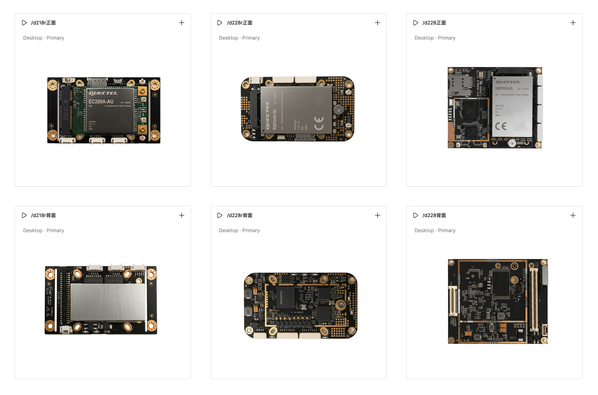
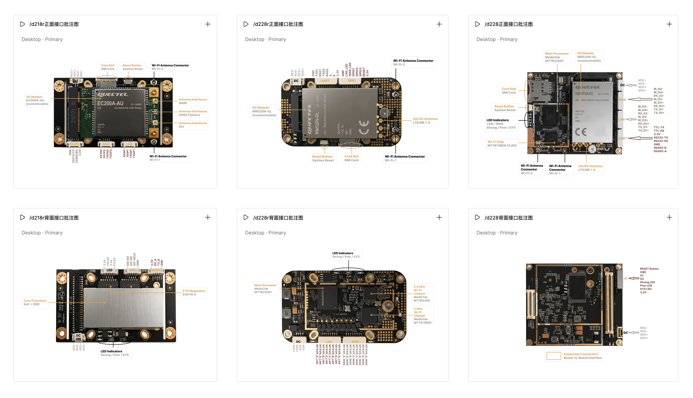
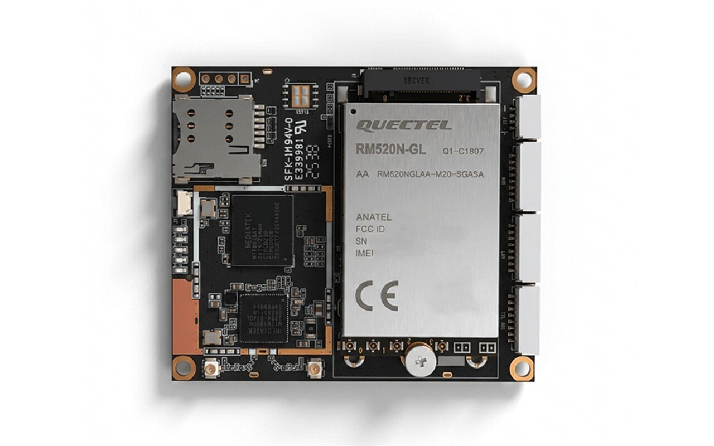
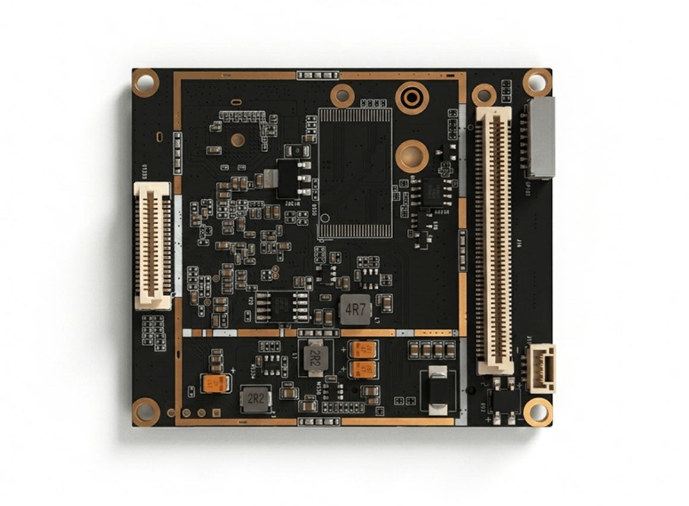
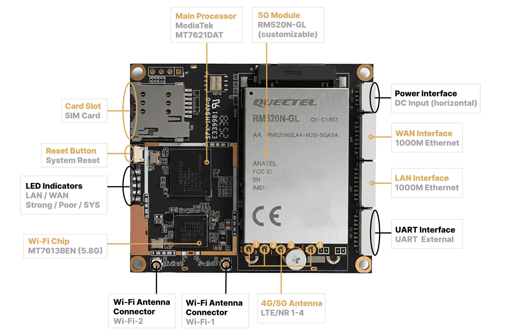
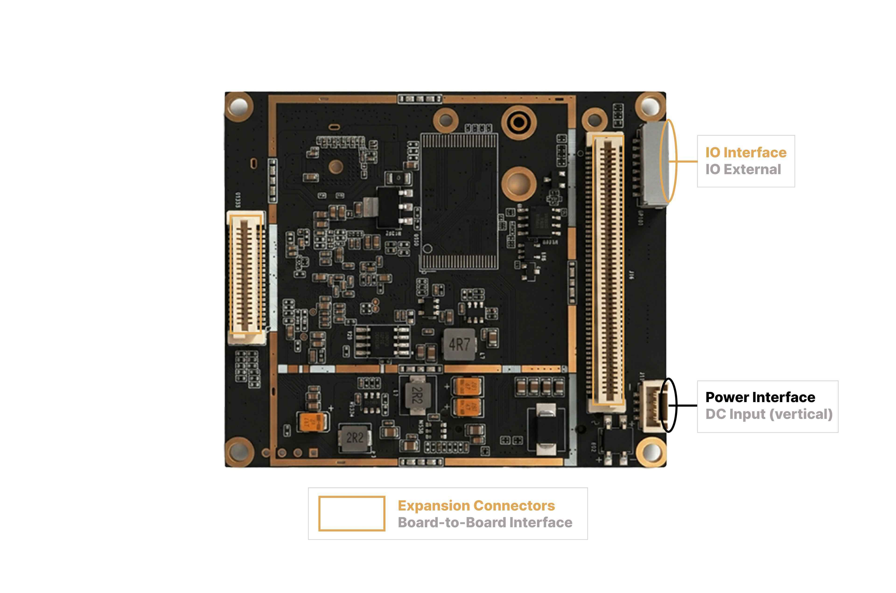
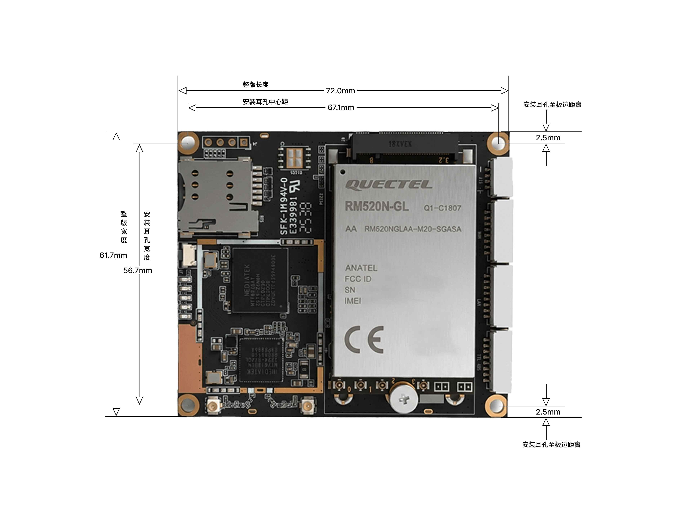
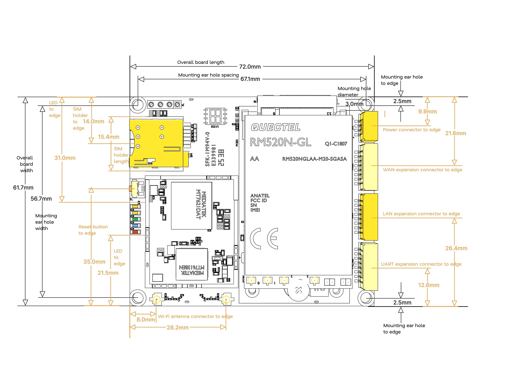
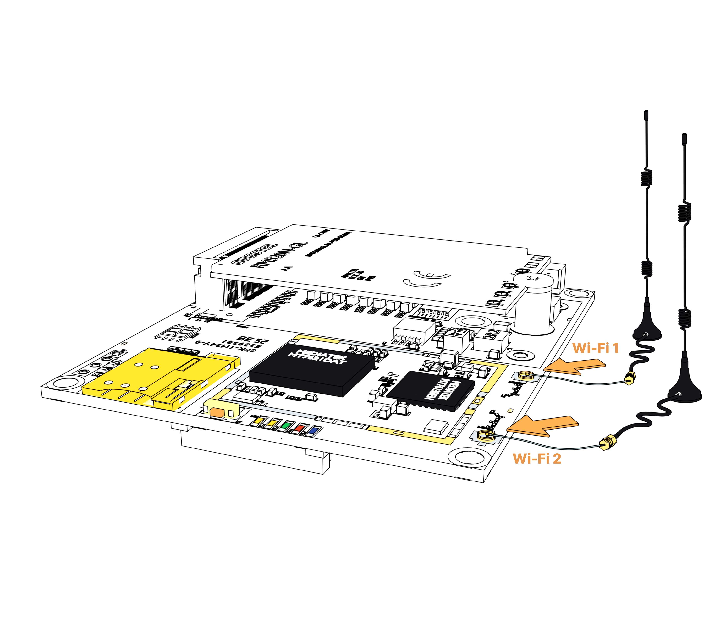

# D228 产品资料包

本文档为 **D228** 产品资料包内部入口页，用于快速查看：公开/详细规格书、快速入门指南、硬件设计指南、模块图、接口批注图、尺寸图（实物/线稿）、引脚图、DXF、GLB/3D 在线预览。

---

## 在线快速入口

| 入口 | 链接 | 说明 |
|---|---|---|
| 3D 在线查看（GLB） | <http://47.77.181.80/view3d/d228> | 模块三维预览，支持旋转/缩放；备案前使用 IP |
| 产品资料展示页 | <http://47.77.181.80/products/d228> | 官网产品页（备案前 IP 访问） |
| 本地 GLB 文件 | [D228建模文件](glb建模文件/d228.glb) | 无法开网页时将glb文件下载到本地，用 <https://glbviewer.net/> 打开 |

> 正式域名备案完成后，会将上表 IP 替换为正式域名。

---

## 快速查看

| 您想了解 | 可查看资料 | 资料说明 |
|---|---|---|
| 产品基本规格（对外） | [公开规格书](#公开规格书) | 产品定位、主要接口、尺寸参考、典型应用。 |
| 工程完整参数 | [详细规格书](#详细规格书) | 硬件接口、引脚、结构、软件能力、项目配置。 |
| 怎么接线开机 | [快速入门指南](#快速入门指南) | SIM、天线、电源、RESET、网线、串口、IO、指示灯。 |
| OEM 结构/电气集成 | [硬件设计指南](#硬件设计指南) | 机械、电源双线序、接口、天线、B2B 扩展、认证注意。 |
| 产品外观 | [模块图](#模块图) | 正/背/侧/斜视、透明底素材。 |
| 接口在哪 | [接口批注图](#接口批注图) | 正反面电源、网口、串口、SIM、天线、LED、扩展座。 |
| 结构尺寸 | [机械尺寸图](#机械尺寸图) | 公开版/完整版，实物标注与线稿，中英文。 |
| 引脚怎么定义 | [引脚与 Pin 图](#引脚与-pin-图) | UART / IO / 电源等引脚批注与 Excel。 |
| 场景接线图 | [接线场景图](#接线场景图) | SIM、电源、天线、网线、复位、GPIO、底座线序等。 |
| 外壳/底板设计 | [DXF 文件](#dxf-文件)、[3D 模型](#3d-模型与在线查看) | 开孔、安装孔、避位、空间预览。 |

---

## 产品定位（内部摘要）

| 项 | D228 |
|---|---|
| 形态 | 工业级 LTE/NR **路由模块（PCBA）** |
| 蜂窝 | 3G/4G/5G（参考 Quectel RM520N-GL，可按项目更换） |
| 主控 | MediaTek MT7621DAT |
| 以太网 | 板载 WAN + LAN，千兆 |
| 串口 | TTL / RS232 / RS485（UART External 8Pin） |
| Wi-Fi | 5.8 GHz 802.11a/an/ac，2T2R |
| IO | 2× 3.3 V，可配置 I²C |
| SIM | Micro-SIM，**缺口朝外**；禁热插拔 |
| 天线 | LTE/NR ×4 IPEX-4 · Wi-Fi ×2 IPEX-1 · 可选 GPS |
| 电源 | 7–15 VDC，推荐 12 V / 2 A；**卧式与立式线序不同** |
| 尺寸 | 约 72.0 × 61.7 × **15.0 mm**（参考最大高度） |
| 安装 | 4 孔，中心距约 67.1 × 56.7 mm |
| 扩展 | 20Pin / 50Pin 板对板（40+100 触点，双排 1.0 mm） |
| 系统 | Talonbox SkinOS |
| 软件资料 | 公开/详细规格书 + 快速入门 + 硬件设计指南 |

---

## 产品一览图

用于快速判断与 D228 相关的工业路由模块外观、接口方向与功能区域；再按需进入规格书、尺寸图、DXF 或 3D。

<p align="center">
  
</p>

<p align="center">
  工业路由模块全局概览图
</p>

<p align="center">
  
</p>

<p align="center">
  工业路由模块接口批注概览图
</p>

---

## 规格书文件

### 公开规格书

适合快速了解产品定位、主要规格、接口概览、机械尺寸参考与应用方向；可对客户公开。

| 版本 | 文件 |
|---|---|
| 中文公开规格书 | [D228中文公开规格书](产品规格书/D228_公开规格书_中文版.pdf) |
| 英文公开规格书 | [D228英文公开规格书](产品规格书/D228_公开规格书_英文版.pdf) |

### 详细规格书

含完整硬件接口、引脚、结构、扩展连接器、软件与项目集成说明；用于工程评估与 OEM 确认。

| 版本 | 文件 |
|---|---|
| 中文详细规格书 | [D228中文详细规格书](产品规格书/D228_详细规格书_中文版.pdf) |
| 英文详细规格书 | [D228英文详细规格书](产品规格书/D228_详细规格书_英文版.pdf) |

---

## 快速入门指南

面向现场接线与首次上电：SIM → 天线 → 接电源线（先不通电）→ 按住 RESET 再通电 → LAN/WAN → 串口（可选）→ GPIO（可选）→ 看指示灯 → 连管理页。

| 版本 | 文件 |
|---|---|
| 中文快速入门 | [D228快速入门指南](快速入门指南/D228_快速入门指南_中文版.pdf) |
| 英文快速入门 | [路径待填] |

要点：

- SIM：缺口朝外，触点朝 PCB；上电禁止插拔  
- 电源：卧式 Pin1–2 = VCC+，立式 Pin1–2 = VCC−，**两处线序不同**  
- RESET：先按住 → 再通电 → 约数秒后松开（以文档定稿为准）  
- WAN：可接卫星终端/工业上行；仅蜂窝时可暂不接 WAN  
- 默认管理地址：`192.168.8.1`（OEM 可改）  

---

## 硬件设计指南

面向 OEM 硬件/结构/射频：机械集成、电源设计、接口引脚、天线与 B2B 扩展、散热、ESD、认证责任。

| 版本 | 文件 |
|---|---|
| 中文硬件设计指南 | [D228硬件设计指南](硬件设计指南/D228_硬件设计指南_中文版.pdf) |
| 英文硬件设计指南 | [路径待填] |

结构资料：

- 现提供：机械图纸、**DXF**、**GLB**  
- **STEP**：可按项目申请  
- 结构设计以 DXF/机械图为准；GLB 仅供空间预览  

---

## 模块图

查看 D228 正反面器件、侧面高度观感与对外展示素材，涵盖实物图版本和线稿版本图。

| 图片 | 内容说明 |
|---|---|
| [实物正面视图](实物模块图/d228_模块正面视图.jpg)、[线稿正面视图](线稿模块图/d228_模块正面视图.jpg) | 模块正面 |
| [实物背面视图](实物模块图/d228_模块背面视图.jpg)、[线稿背面视图](线稿模块图/d228_模块背面视图.jpg) | 模块背面 |
| [实物侧面视图](实物模块图/d228_模块侧面视图.jpg)、[线稿侧面视图](线稿模块图/d228_模块侧面视图.jpg) | 侧面结构与高度观感 |
| [实物斜面视图](实物模块图/d228_模块斜面视图.jpg)、[线稿斜面视图](线稿模块图/d228_模块斜面视图.jpg) | 整体外观 |


<p align="center">
  
</p>

<p align="center">
  D228 模块正面视图
</p>

<p align="center">
  
</p>

<p align="center">
  D228 模块背面视图
</p>

---

## 接口批注图

用于确认正反面接口、器件与功能区域，判断出线方向与外壳开孔，涵盖实物图版本和线稿版本图。

| 图片 | 说明 |
|---|---|
| [正面接口批注_实物](实物接口批注图/d228_正面接口批注.jpg)、[正面接口批注_线稿](线稿接口批注图/d228_正面接口批注.jpg) | 电源、WAN/LAN、UART、SIM、RESET、LTE/Wi-Fi 天线、LED |
| [背面接口批注_实物](实物接口批注图/d228_背面接口批注.jpg)、[背面接口批注_线稿](线稿接口批注图/d228_背面接口批注.jpg) | 立式电源、IO External、20Pin/50Pin 扩展 |

<p align="center">
  
</p>

<p align="center">
  D228 正面接口与主要器件布局
</p>

<p align="center">
  
</p>

<p align="center">
  D228 背面接口与功能区域布局
</p>

---

## 机械尺寸图

D228 尺寸资料按「公开 / 完整」与「实物标注 / 线稿」分层使用，涵盖实物图版本和线稿版本图。

| 层级 | 用途 | 内容 |
|---|---|---|
| 公开版（Simple） | 项目早期、客户预览 | 板框 72.0×61.7、孔距 67.1×56.7、孔到边约 2.5 mm 等 |
| 完整版（Complex） | 结构集成 | 再加接口到板边、SIM/电源/网口/UART/天线/扩展座等位置 |
| 线稿版 | 硬件设计指南 / OEM | 3D 或工程线稿 + 尺寸批注，主设计依据仍以 DXF 为准 |

**参考尺寸：** 72.0 × 61.7 × 15.0 mm；安装孔中心距约 67.1 × 56.7 mm。

### 公开版机械尺寸图

| 版本 | 文件 |
|---|---|
| 中文正面公开版 | [D228_正面尺寸_中文完整版](实物尺寸图/d228_正面尺寸_中文简约版.jpg) |
| 中文背面公开版 | [D228_背面尺寸_中文完整版](实物尺寸图/d228_背面尺寸_中文简约版.jpg) |
| 英文正面公开版 | [D228_正面尺寸_英文完整版](实物尺寸图/d228_正面尺寸_英文简约版.jpg) |
| 英文背面公开版 | [D228_背面尺寸_英文完整版](实物尺寸图/d228_背面尺寸_英文简约版.jpg) |

<p align="center">
  
</p>

<p align="center">
  D228 正面公开版机械尺寸图
</p>

### 完整版机械尺寸图

| 版本 | 文件 |
|---|---|
| 中文正面完整版（实物标注） | [D228_正面尺寸_中文完整版](实物尺寸图/d228_正面尺寸_中文完整版.jpg) |
| 中文背面完整版（实物标注） | [D228_背面尺寸_中文完整版](实物尺寸图/d228_背面尺寸_中文完整版.jpg) |
| 英文正面完整版（实物标注） | [D228_正面尺寸_英文完整版](实物尺寸图/d228_正面尺寸_英文完整版.jpg) |
| 英文背面完整版（实物标注） | [D228_背面尺寸_英文完整版](实物尺寸图/d228_背面尺寸_英文完整版.jpg) |

### 线稿 / 工程风格尺寸图

| 图 | 文件 |
|---|---|
| 正面线稿尺寸图 | [D228_正面尺寸_线稿工程风格](线稿尺寸图/d228_正面尺寸图.jpg) |
| 背面线稿尺寸图 | [D228_背面尺寸_线稿工程风格](线稿尺寸图/d228_背面尺寸图.jpg) |
| 侧视高度图 | [D228_侧面尺寸_线稿工程风格](线稿尺寸图/d228_侧面尺寸图.jpg) |
| 3D 包络截图 | [D228建模文件](glb建模文件/d228.glb) 或 [在线 3D](http://43.110.166.216/view3d/d228) |

<p align="center">
  
</p>

<p align="center">
  D228 正面线稿尺寸图
</p>

---

## 引脚与 Pin 图

用于工程确认连接器针序，涵盖实物图版本和线稿版本图。**以正式发布引脚图 / 规格书为准**。

| 资料 | 说明 | 文件 |
|---|---|---|
| 引脚批注图（实物） | 正/背面相关接口针序批注 | [D228_正面接口引脚批注](实物接口引脚图/d228_正面接口引脚.jpg)、[D228_背面接口引脚批注](实物接口引脚图/d228_背面接口引脚.jpg) |
| 引脚批注图（线稿） | 正/背面相关接口针序批注 | [D228_正面接口引脚批注](线稿接口引脚图/d228_正面接口引脚.jpg)、[D228_背面接口引脚批注](线稿接口引脚图/d228_背面接口引脚.jpg) |
| Pin 表 Excel（50pin） | 50pin表 | [D228_50pin](实物pin批注图/d228_50pin.xlsx) |
| Pin 表 Excel（20pin） | 20pin表 | [D228_20pin](实物pin批注图/d228_20pin.xlsx) |

与规格书核对：

**卡扣（卡扣/锁扣）朝上为准，从左至右第 1 位为 Pin1**

| 接口 | 针序 |
|---|---|
| UART External | 1 RS485-A · 2 RS485-B · 3 GND · 4 RS232-RX · 5 RS232-TX · 6 3.3V · 7 TTL-RX · 8 TTL-TX |
| IO External | 1 3.3V · 2 SYS · 3 Poor · 4 Strong · 5 G2 · 6 G1 · 7 GND · 8 RESET |
| 电源正面卧式 | Pin1–2 VCC+ · Pin3–4 VCC− |
| 电源背面立式 | Pin1–2 VCC− · Pin3–4 VCC+ |

---

## 接线场景图

快速入门与市场资料用的场景图；仅表达「怎么接」，不替代规格书。

| 场景 | 文件 |
|---|---|
| SIM 卡插入方向 | [D228_插入SIM卡](场景接线图/d228_插入SIM卡.jpg) |
| Wi-Fi 天线 | [D228_接Wi-Fi天线](场景接线图/d228_接Wi-Fi天线.jpg) |
| 5G / LTE 天线 | [D228_接LTE/NR天线](场景接线图/d228_接LTE:NR天线.jpg) |
| 接电源线不通电（卧式） | [D228_卧式接电源线不通电](场景接线图/d228_卧式电源接电源线_不通电.jpg) |
| 接电源线不通电（立式） | [D228_立式接电源线不通电](场景接线图/d228_立式电源接电源线_不通电.jpg) |
| RESET 复位 | [D228_复位](场景接线图/d228_按住复位键.jpg) |
| 电源通电（卧式） | [D228_卧式电源通电](场景接线图/d228_卧式电源通电.jpg) |
| 电源通电（立式） | [D228_立式电源通电](场景接线图/d228_立式电源通电.jpg) |
| LAN 接电脑/设备 | [D228_接LAN](场景接线图/d228_lan口接电脑主机.jpg) |
| WAN 接卫星终端/工业上行 | [D228_接WAN](场景接线图/d228_wan口接星链终端.jpg) |
| RS485 / RS232 / TTL | [D228_RS485接法](场景接线图/d228_接串口rs485.jpg)、[D228_RS232接法](场景接线图/d228_接串口rs232.jpg)、[D228_TTL接法](场景接线图/d228_接串口ttl.jpg) | 
| GPIO 接 LED（G1/G2） | [D228_接GPIO](场景接线图/d228_io口接指示灯.jpg) |

<p align="center">
  
</p>

<p align="center">
  D228 接线场景示例
</p>

---

## DXF 文件

用于结构工程：外形、安装孔、固定位置、外壳开孔、连接器避让。

| 文件 | 说明 |
|---|---|
| [D228 DXF](dxf文件/D228.dxf) | 完整外形参考 |

> 最终孔径、孔距、禁布区、连接器间隙与开孔位置，应结合项目机械图、DXF 与样机确认。  
> STEP：可按项目申请，不默认随包提供。

---

## 3D 模型与在线查看

| 方式 | 入口 | 说明 |
|---|---|---|
| 网页 3D | <http://47.77.181.80/view3d/d228> | 客户预览首选（IP，备案前） |
| 产品页 | <http://47.77.181.80/products/d228> | 对外资料展示 |
| GLB 本地文件 | [D228建模文件](glb建模文件/d228.glb) | 官网摄影产品级效果展示 |
| STEP 文件 | [路径待填] | 待补充 |
| Blender 源文件 | [路径待填] | 维护用，不直接发客户 |

GLB/Blender 用于外观与空间参考；**结构设计以 DXF/机械图为准**。

---

## 项目评估阶段可补充资料

- 详细引脚定义与电气条件  
- 连接器型号、堆叠高度、器件高度  
- DXF/STEP  
- 连接器避让与禁布区  
- 接地/屏蔽/防护说明  
- 外壳集成与散热评估  
- 天线选型与射频档案（型号/增益）  
- 认证路径（按目标市场）  

如需 OEM 集成、外壳设计或样机评估，请提供：目标区域/市场、运营商、天线方案、电源架构、接口需求、结构限制与预计数量。

---

## 资料使用优先级

| 场景 | 优先使用 |
|---|---|
| 客户售前一页纸 | 公开规格书 + 产品页 + 模块图 |
| 报价/项目评估 | 公开 + 详细规格书 + 接口/尺寸图 |
| 现场安装 | 快速入门指南 + 接线场景图 |
| OEM 开壳/底板 | 硬件设计指南 + DXF + 完整尺寸图 + 引脚表 |
| 空间沟通/演示 | 在线 3D / GLB |
| 引脚争议 | **详细规格书 + 发布引脚图** |

---

## 资料包目录结构

```text
d228/
├── D228_产品资料包.md          ← 本文件
├── 产品规格书/
│   ├── d228_公开规格书_中文版.pdf
│   ├── d228_详细规格书_中文版.pdf
│   └── （英文版定稿后放入）
├── 快速入门指南/
│   ├── D228_快速入门指南_中文版.pdf
│   └── （英文版定稿后放入）
├── 硬件设计指南/
│   ├── D228_硬件设计指南_中文版.pdf
│   └── （英文版定稿后放入）
├── 模块图/
│   ├── 正面/背面/侧面/斜面（实物/线稿版本）
│   └── 透明 PNG
├── 接口批注图/
│   ├── 正面接口批注_实物/线稿批注
│   └── 背面接口批注_实物/线稿批注
├── 接口引脚图/
│   ├── 中英批注图_实物/线稿批注
│   └── pin_excel
├── 尺寸图/
│   ├── 公开版本_中英_实物批注
│   ├── 完整版本_中英_实物标注
│   ├── 完整版本_英文_线稿标注
├── 接线场景图/
│   ├── SIM_天线_电源_RESET
│   ├── LAN_WAN
│   ├── UART_GPIO
│   └── 灯态
├── dxf文件/
│   ├── D228.dxf
└── 建模文件/
    ├── d228.glb
    └── （blend 等源文件可放内部网盘，不进客户包）
```

---

## 维护说明

| 项 | 约定 |
|---|---|
| 本 md 性质 | **内部资料索引**，非客户交付物 |
| 路径 | 均为相对路径；跨机器拷贝时保持文件夹层级 |
| 在线链接 | 备案前 IP；备案后批量替换为正式域名 |
| 文档版本 | 与快速入门/硬件指南页脚 Rev 对齐 |
| 引脚/电源线序 | 规格书、指南、接线图三处必须一致 |
| 更新 | 新增图片/规格书后，在本页对应章节补链接即可 |

---

## 联系

如需评估样机、OEM 集成评审、机械文件包或项目配置确认：

- 邮箱：sales@talonbox.com  
- 请附：目标市场、应用场景、天线与电源方案、结构限制、预计数量  

> 规格可能因器件供应、固件/硬件版本、区域或项目配置调整；最终以项目确认资料包为准。
