# D228R 产品资料包

本文档为 D228R 产品资料包入口页，可用于快速查看产品规格书、产品视图、接口布局、机械尺寸、8Pin 接口资料、DXF 文件和 3D 模型文件。  
所有链接均为相对路径，打开本文件后可直接跳转到对应资料。

## 快速查看

| 您想了解 | 可查看资料 | 资料说明 |
|---|---|---|
| 产品基本规格 | [规格书文件](#规格书文件) | 查看 D228R 的产品定位、接口能力、结构尺寸、软件能力和项目配置说明。 |
| 产品外观 | [模块图](#模块图) | 查看模块正面、背面、侧面、斜面和透明背景产品图。 |
| 接口位置 | [接口批注图](#接口批注图) | 查看电源、网口、串口、SIM、天线座、指示灯和扩展接口等位置。 |
| 结构尺寸 | [机械尺寸图](#机械尺寸图) | 查看外形尺寸、安装孔中心距、定位孔中心距和主要结构参考。 |
| 8Pin 接口 | [8Pin 接口资料](#8pin-接口资料) | 查看 8Pin 连接器位置、引脚顺序和接口功能参考。 |
| 外壳/结构集成 | [DXF 文件](#dxf-文件)、[3D 模型文件](#3d-模型文件) | 用于结构评估、外壳开孔、固定位置、接口避让和空间预览。 |

## 产品一览图

产品一览图用于快速查看 D228R 及相关模块的正反面外观、主要接口和功能区域。客户可先概览所有模块图片，再根据需要打开后续规格书、机械尺寸图、DXF 文件或 8Pin 接口资料。

- [模块全局概览图](../产品一览图/modules_overview.png)
- [模块接口批注概览图](../产品一览图/modules_interface_overview.png)

<p align="center">
  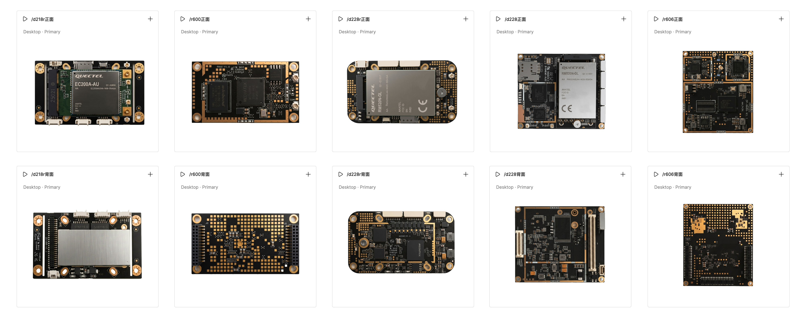
</p>

<p align="center">
  模块全局概览图
</p>

<p align="center">
  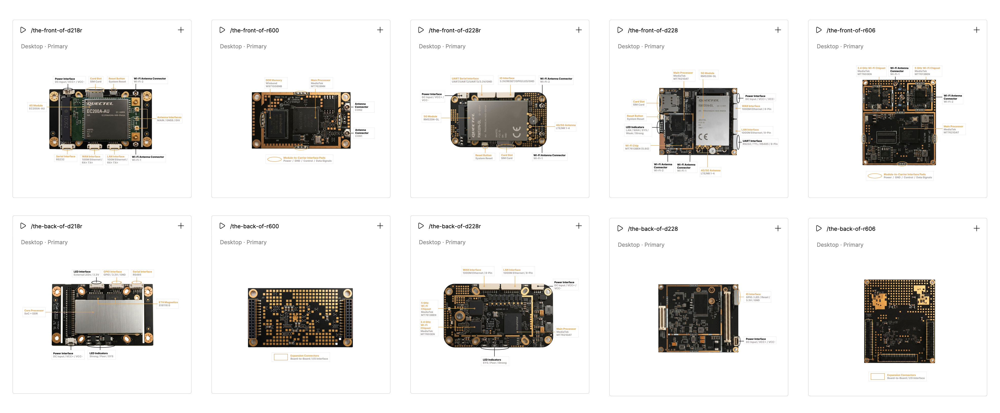
</p>

<p align="center">
  模块接口批注概览图
</p>

## 规格书文件

### 公开规格书

公开规格书适合快速了解 D228R 的产品定位、主要规格、接口概览、机械尺寸参考和典型应用方向。

- [中文公开规格书 PDF](规格书文件/cn_spec_pub公开规格书.pdf)
- [英文公开规格书 PDF](规格书文件/en_spec_pub公开规格书.pdf)

### 详细规格书

详细规格书用于进一步查看 D228R 的硬件接口、结构尺寸、8Pin 接口、软件能力和项目集成说明，适合项目评估和工程确认阶段使用。

- [中文详细规格书 PDF](规格书文件/cn_spec_pro详细规格书.pdf)
- [英文详细规格书 PDF](规格书文件/en_spec_pro详细规格书.pdf)

## 模块图

以下图片用于查看 D228R 模块外观、正反面器件分布和产品展示效果。

| 图片 | 内容说明 |
|---|---|
| [正面视图 PNG](模块图/d228r_模块正面视图.png) / [JPG](模块图/d228r_模块正面视图.jpg) | D228R 模块正面视图。 |
| [背面视图 PNG](模块图/d228r_模块背面视图.png) / [JPG](模块图/d228r_模块背面视图.jpg) | D228R 模块背面视图。 |
| [侧面视图 PNG](模块图/d228r_模块侧面视图.png) / [JPG](模块图/d228r_模块侧面视图.jpg) | 用于查看模块侧面结构和高度观感。 |
| [斜面视图 PNG](模块图/d228r_模块斜面视图.png) / [JPG](模块图/d228r_模块斜面视图.jpg) | 用于查看产品整体外观。 |
| [正面透明 PNG](模块图/d228r_模块正面透明.png) | 正面透明背景图片。 |
| [背面透明 PNG](模块图/d228r_模块背面透明.png) | 背面透明背景图片。 |

<p align="center">
  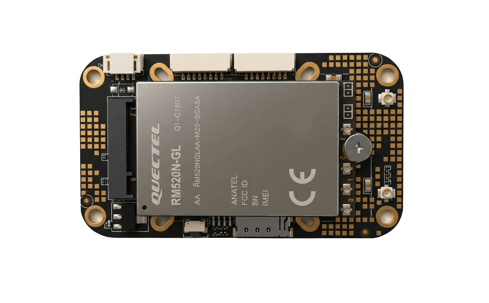
</p>

<p align="center">
  D228R 模块正面视图
</p>

<p align="center">
  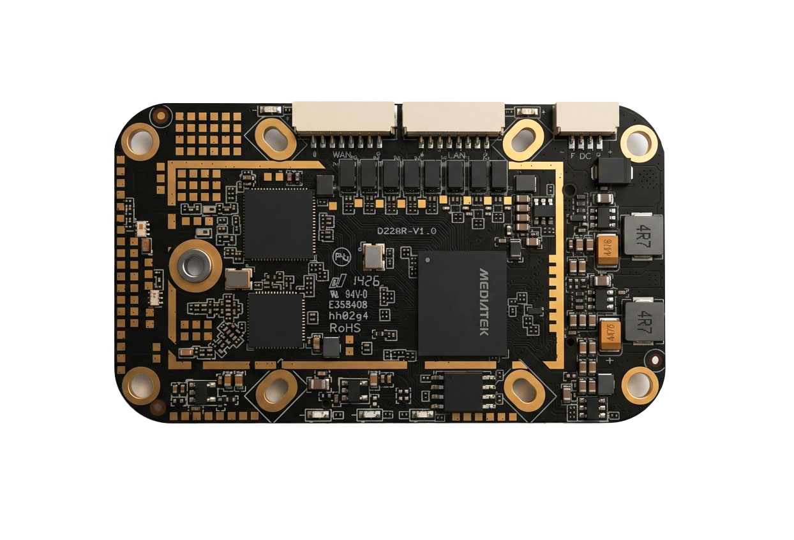
</p>

<p align="center">
  D228R 模块背面视图
</p>

## 接口批注图

接口批注图用于快速确认 D228R 正反面的主要接口、器件和功能区域。客户可通过这些图片初步判断接口出线方向、外壳开孔方向和安装空间。

- [正面接口与主要器件布局 PNG](实物图+接口批注图/正面接口与主要器件布局.png)
- [正面接口与主要器件布局 JPG](实物图+接口批注图/正面接口与主要器件布局.jpg)
- [背面接口与功能区域布局 PNG](实物图+接口批注图/背面接口与功能区域布局.png)
- [背面接口与功能区域布局 JPG](实物图+接口批注图/背面接口与功能区域布局.jpg)

<p align="center">
  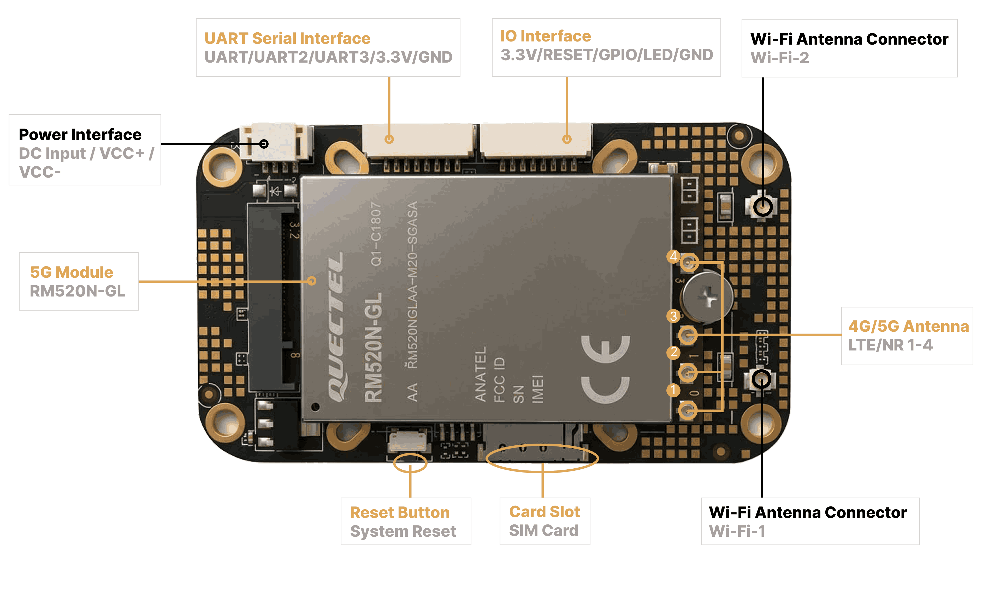
</p>

<p align="center">
  D228R 正面接口与主要器件布局
</p>

<p align="center">
  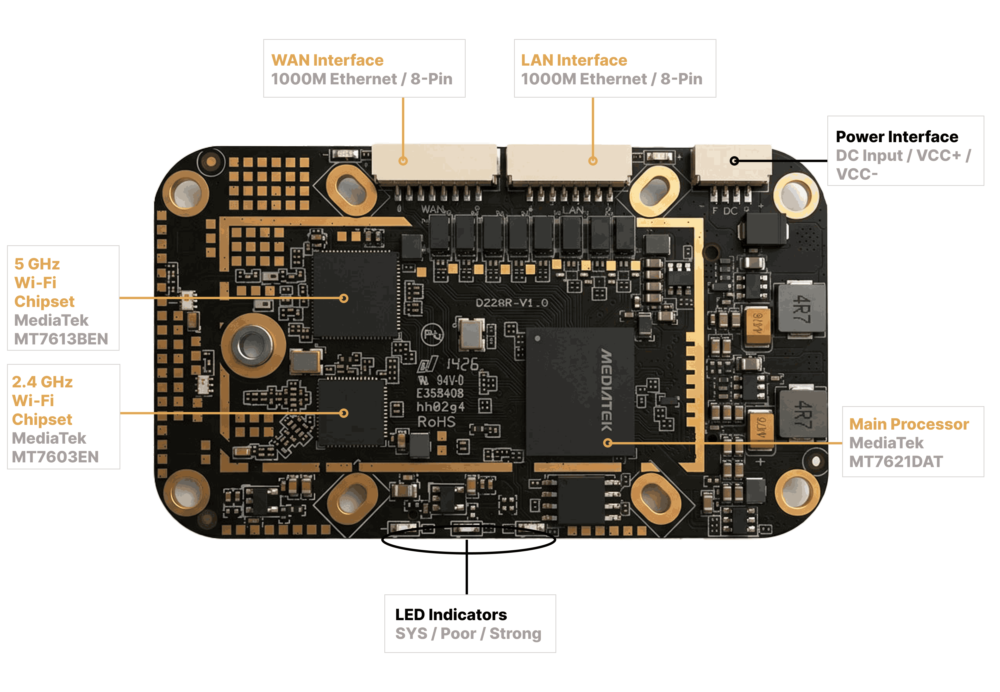
</p>

<p align="center">
  D228R 背面接口与功能区域布局
</p>

## 机械尺寸图

机械尺寸图用于查看模块外形、安装孔、定位孔和主要结构参考。公开版图片便于快速评估；完整版本提供更细的接口位置和板边距离参考。

### 公开版机械尺寸图

公开版机械尺寸图包含整体尺寸、安装耳孔中心距、内部定位孔中心距和关键安装参考，适合在项目早期进行结构空间判断。

- [中文正面公开版机械尺寸图 PNG](实物图+尺寸批注图/公开版本/cn_simple_machine_228r_positive.png)
- [中文正面公开版机械尺寸图 JPG](实物图+尺寸批注图/公开版本/cn_simple_machine_228r_positive.jpg)
- [中文背面公开版机械尺寸图 PNG](实物图+尺寸批注图/公开版本/cn_simple_machine_228r_negative.png)
- [中文背面公开版机械尺寸图 JPG](实物图+尺寸批注图/公开版本/cn_simple_machine_228r_negative.jpg)
- [英文正面公开版机械尺寸图 PNG](实物图+尺寸批注图/公开版本/en_simple_machine_228r_positive.png)
- [英文正面公开版机械尺寸图 JPG](实物图+尺寸批注图/公开版本/en_simple_machine_228r_positive.jpg)
- [英文背面公开版机械尺寸图 PNG](实物图+尺寸批注图/公开版本/en_simple_machine_228r_negative.png)
- [英文背面公开版机械尺寸图 JPG](实物图+尺寸批注图/公开版本/en_simple_machine_228r_negative.jpg)

<p align="center">
  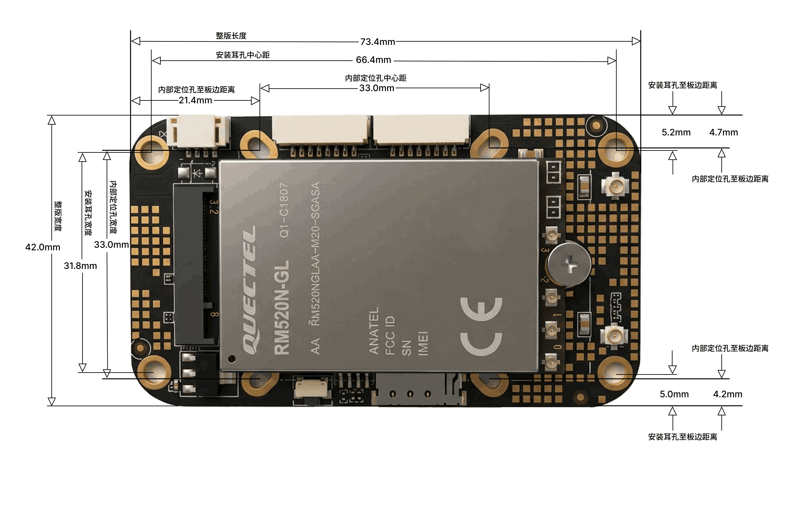
</p>

<p align="center">
  D228R 正面公开版机械尺寸图
</p>

<p align="center">
  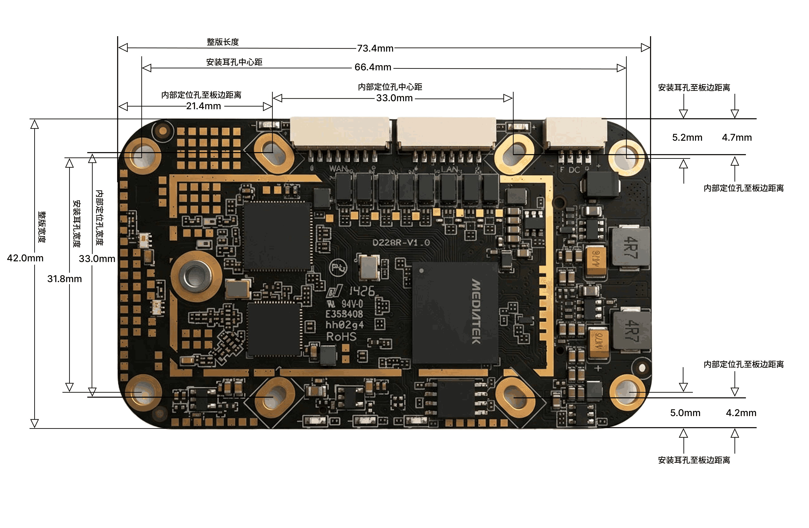
</p>

<p align="center">
  D228R 背面公开版机械尺寸图
</p>

### 完整机械尺寸图

完整机械尺寸图包含接口到板边距离、连接器位置、SIM 卡座、复位键、天线座、LED 指示灯和扩展接口位置参考，可用于结构集成、外壳开孔和安装空间评估。

- [中文正面完整机械尺寸图 PNG](实物图+尺寸批注图/完整版本/cn_模块正面尺寸批注图.png)
- [中文正面完整机械尺寸图 JPG](实物图+尺寸批注图/完整版本/cn_模块正面尺寸批注图.jpg)
- [中文背面完整机械尺寸图 PNG](实物图+尺寸批注图/完整版本/cn_模块背面尺寸批注图.png)
- [中文背面完整机械尺寸图 JPG](实物图+尺寸批注图/完整版本/cn_模块背面尺寸批注图.jpg)
- [英文正面完整机械尺寸图 PNG](实物图+尺寸批注图/完整版本/en_模块正面尺寸批注图.png)
- [英文正面完整机械尺寸图 JPG](实物图+尺寸批注图/完整版本/en_模块正面尺寸批注图.jpg)
- [英文背面完整机械尺寸图 PNG](实物图+尺寸批注图/完整版本/en_模块背面尺寸批注图.png)
- [英文背面完整机械尺寸图 JPG](实物图+尺寸批注图/完整版本/en_模块背面尺寸批注图.jpg)

<p align="center">
  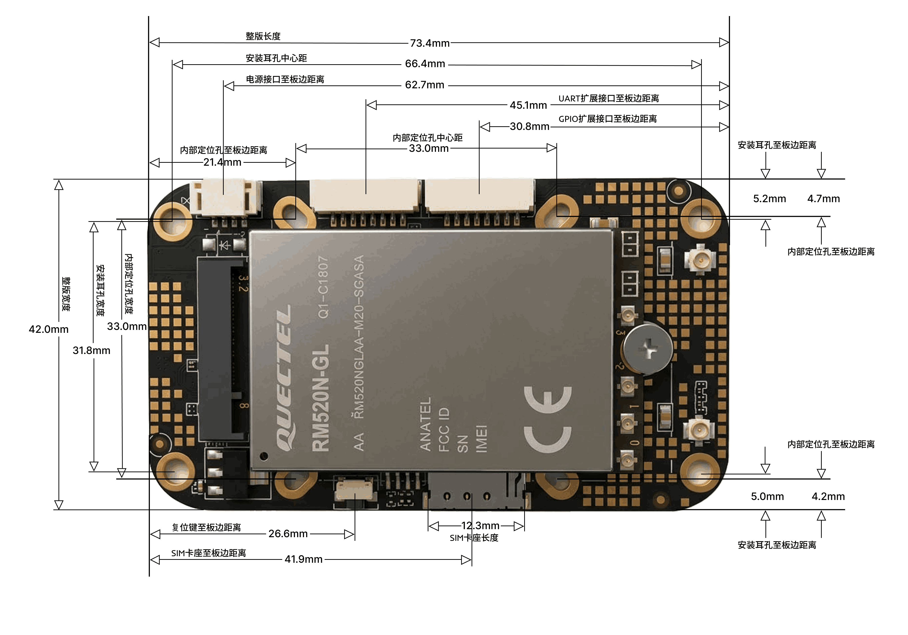
</p>

<p align="center">
  D228R 正面完整版机械尺寸图
</p>

<p align="center">
  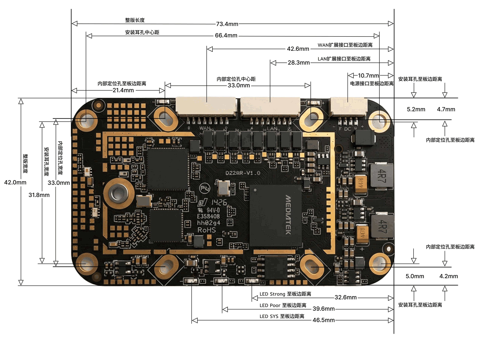
</p>

<p align="center">
  D228R 背面完整版机械尺寸图
</p>

## 8Pin 接口资料

8Pin 接口资料用于查看 D228R 模块 8Pin 连接器位置、引脚顺序和接口功能参考。客户可结合详细规格书进行外部连接和项目集成评估。

- [8Pin 正面批注图 PNG](实物图+8pin批注图/模块正面8pin批注图.png)
- [8Pin 背面批注图 PNG](实物图+8pin批注图/模块背面8pin批注图.png)

<p align="center">
  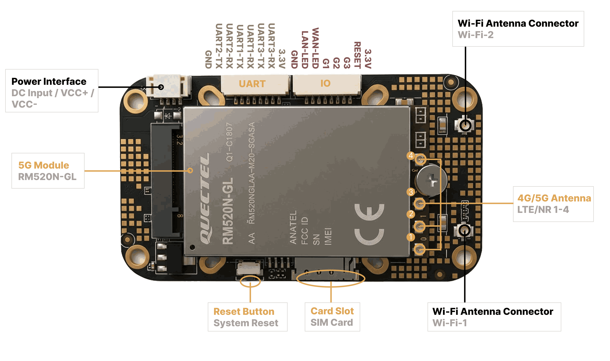
</p>

<p align="center">
  D228R 8Pin 正面批注图
</p>

<p align="center">
  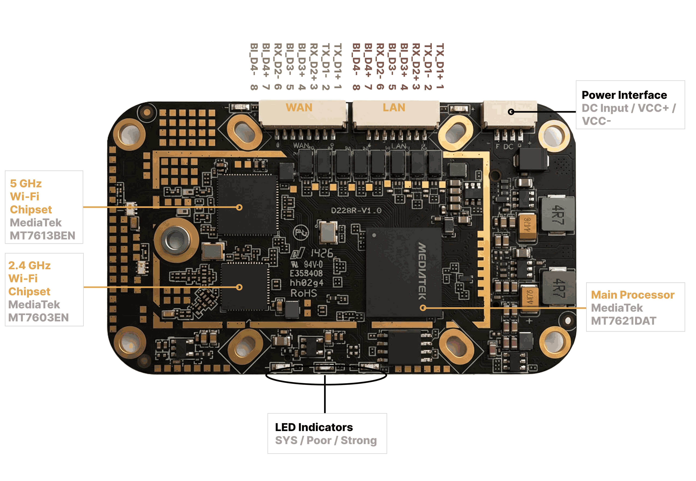
</p>

<p align="center">
  D228R 8Pin 背面批注图
</p>

## DXF 文件

DXF 文件用于结构工程评估，可用于确认模块外形、安装孔、固定位置、外壳开孔和连接器避让空间。

- [D228R V1.0 DXF 总文件](dxf文件/D228R_V1.0.dxf)
- [D228R V1.0 正面 DXF](dxf文件/D228R_V1.0_正面.dxf)
- [D228R V1.0 背面 DXF](dxf文件/D228R_V1.0_背面.dxf)

请注意：最终孔径、孔距、禁布/避让区域、连接器间隙和外壳开孔位置应结合项目机械图纸、DXF 文件和最终样机确认。

## 3D 模型文件

GLB 文件用于产品外观查看、空间预览和结构方案沟通。客户可通过支持 GLB 的 3D 查看器或网页工具打开。

- [D228R 无水印版本 GLB](建模文件/d228r无水印版本.glb)

3D 模型主要用于外观和空间参考；结构设计和开孔确认仍应以规格书、机械尺寸图、DXF 文件和最终样机为准。

## 项目评估资料说明

在项目评估阶段，可根据项目需求进一步确认或提供以下资料：

- 详细引脚定义
- 电气阈值和接口条件
- 连接器高度和器件高度
- DXF/STEP 参考文件
- 连接器避让区域
- 接地、屏蔽和防护设计说明
- 外壳集成和散热评估支持

如需进行 OEM 集成、外壳设计、样机评估或远程管理功能对接，请结合项目应用场景、目标区域、网络制式、接口需求和结构限制进行确认。

## 文件夹结构速览

```text
d228r
├── 规格书文件
│   ├── cn_spec_pub公开规格书.pdf
│   ├── en_spec_pub公开规格书.pdf
│   ├── cn_spec_pro详细规格书.pdf
│   └── en_spec_pro详细规格书.pdf
├── 模块图
│   ├── 正面/背面/侧面/斜面视图
│   └── 透明 PNG 素材
├── 实物图+接口批注图
│   ├── 正面接口与主要器件布局
│   └── 背面接口与功能区域布局
├── 实物图+尺寸批注图
│   ├── 公开版本
│   └── 完整版本
├── 实物图+8pin批注图
│   ├── 8Pin 正面批注图
│   ├── 8Pin 背面批注图
├── dxf文件
│   ├── D228R_V1.0.dxf
│   ├── D228R_V1.0_正面.dxf
│   └── D228R_V1.0_背面.dxf
└── 建模文件
    └── d228r无水印版本.glb
```
