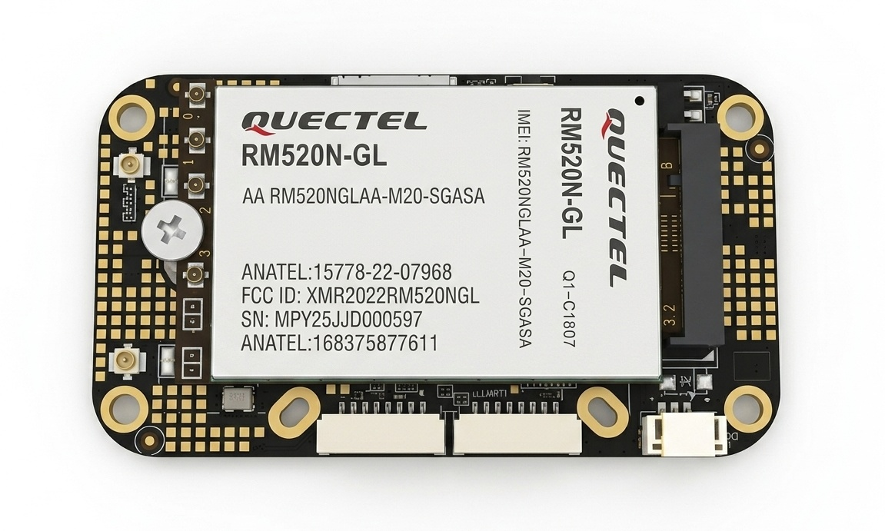
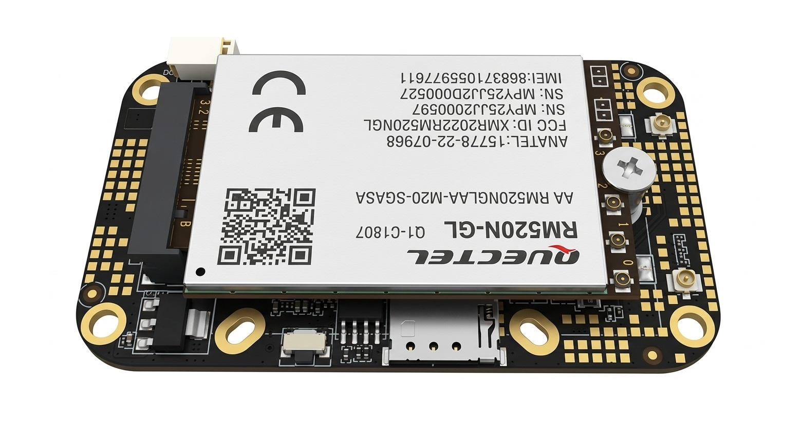
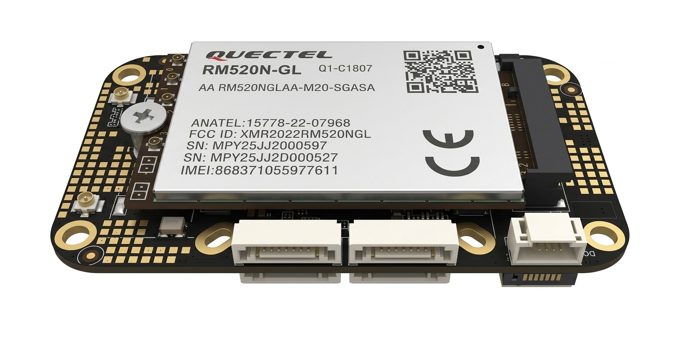
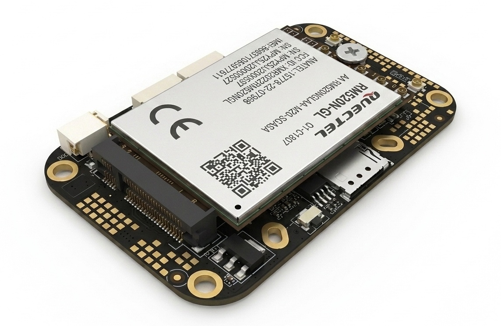
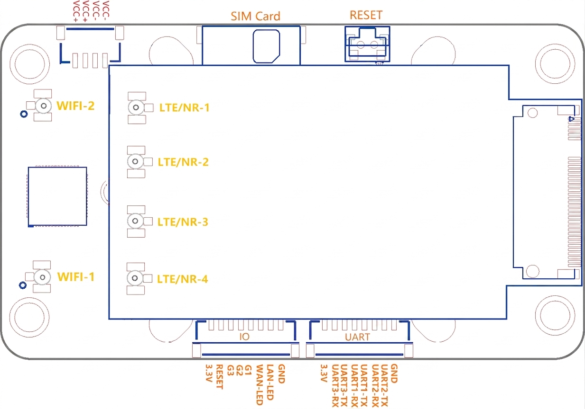
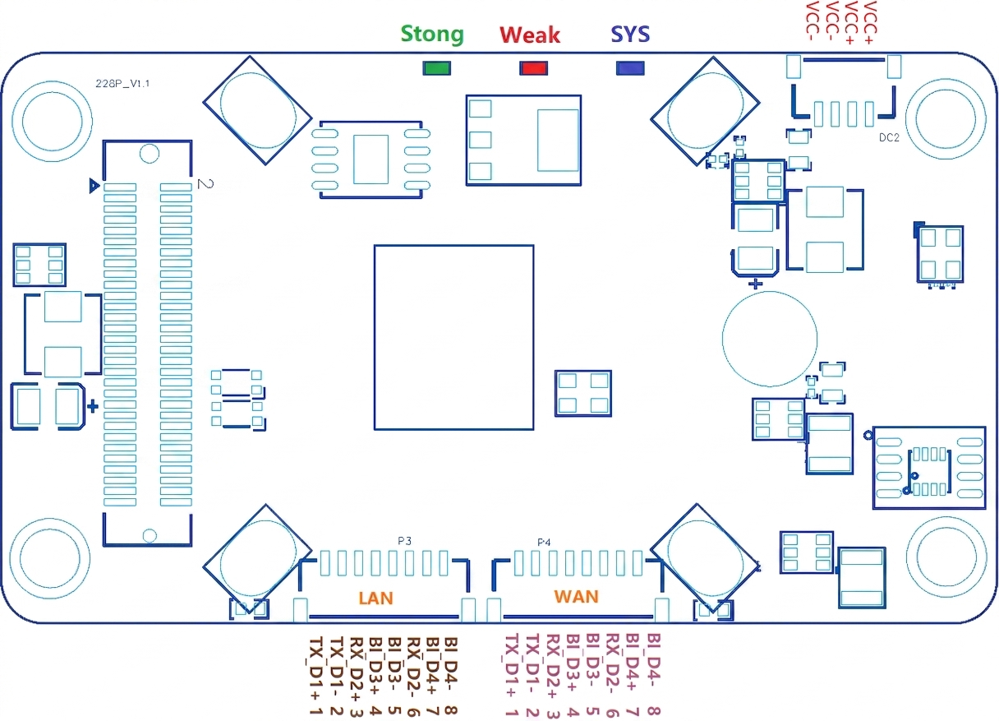
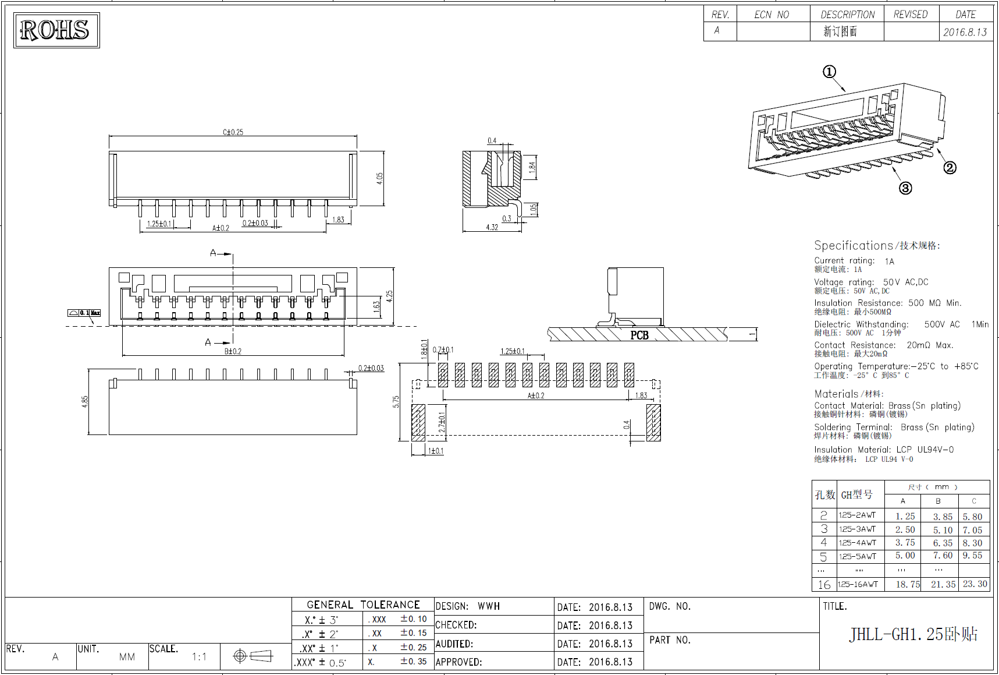
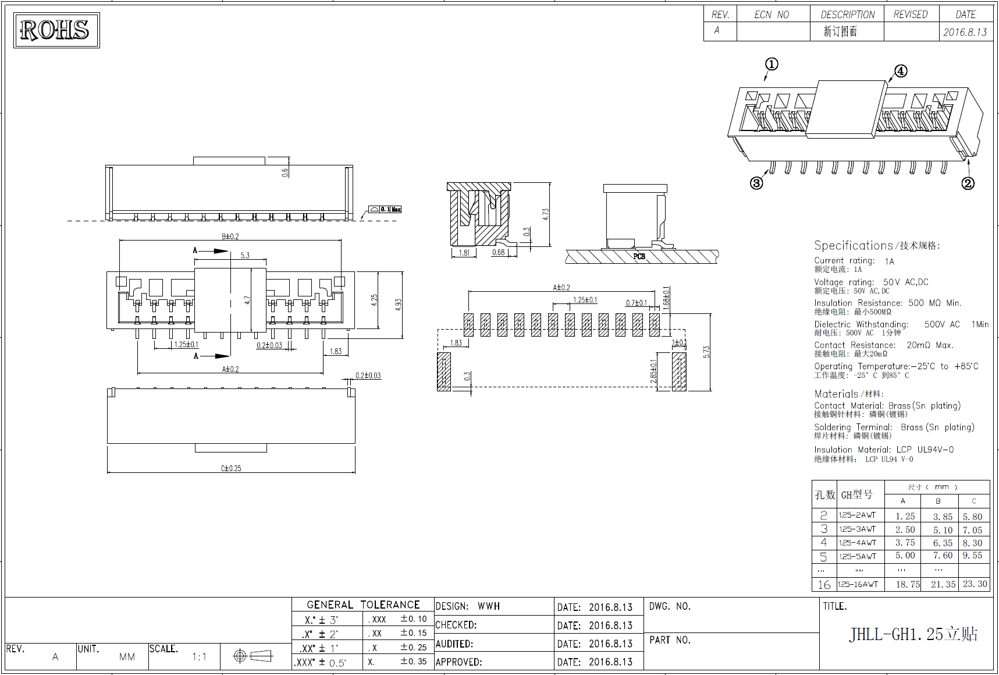

## D228R 产品规格书

## 1. 产品概述

D228R 是面向工业与车载场景的 NR/LTE 网关模块，集成蜂窝、双频 Wi-Fi 和双千兆以太网，支持多链路并发、备份与负载均衡，并提供串口/IO/I2C/GPS 边缘接入能力。

核心定位：

- 工业数据采集与远程管理网关
- 面向移动与复杂网络环境的视频传输网关
- 多链路冗余与高可用通信节点
- 支持二次开发与协议定制的开放平台

## 2. 外观与机械信息

### 2.1 模块图

    

### 2.2 外形与安装

- 尺寸：73.4 mm x 42 mm x 15 mm
- 定位孔：8 个
- 机械尺寸基准：以 DXF 文件为准

### 2.3 接口图

连接器规格图：

## 3. 硬件规格

| 项目 | 规格 |
| :-- | :-- |
| 蜂窝基带 | 默认 RM500U-CN（支持按项目替换） |
| 蜂窝制式 | 3G/4G/5G（LTE/NR） |
| 5G 频段 | NR NSA: n41/n78/n79；NR SA: n1/n28*/n41/n77/n78/n79 |
| 4G 频段 | FDD: B1/B2/B3/B5/B7/B8/B20/B28；TDD: B34/B38/B39/B40/B41 |
| 3G 频段 | WCDMA: B1/B2/B5/B8 |
| 5G 带宽能力 | SA: DL 2Gbps / UL 1Gbps；NSA: DL 2.2Gbps / UL 575Mbps |
| LTE 带宽能力 | DL 600Mbps / UL 150Mbps |
| Wi-Fi 2.4G | IEEE 802.11b/g/n，2T2R，300Mbps |
| Wi-Fi 5.8G | IEEE 802.11a/n/ac，2T2R，866Mbps |
| 以太网接口 | 2 x 100/1000Mbps（WAN/LAN） |
| 串口接口 | 3 x TTL 串口 |
| IO 接口 | 3 路 IO（可配置 I2C） |
| 天线接口 | 2 x IPEX-1（Wi-Fi 2.4/5.8G），4 x IPEX-4（LTE/NR） |
| SIM | Nano SIM（可选 eSIM） |
| 电源 | 7-15V，立式/卧式 4PIN 电源接口各 1 个 |
| 典型功耗 | 满负荷小于 5W（峰值与环境相关） |
| 工作温度 | -40℃ ~ +65℃ |
| 工业保护 | 硬件看门狗、防静电保护、多路独立电源监控 |

## 4. 接口资源与电气定义

### 4.1 网络与射频接口

- WAN：8PIN（1.25mm），100/1000Mbps 自适应
- LAN：8PIN（1.25mm），100/1000Mbps 自适应
- Wi-Fi 天线：WIFI-1/WIFI-2（IPEX-1）
- 蜂窝天线：LTE/NR-1~4（IPEX-4）

### 4.2 串口与 IO

- UART：3 路 TTL（UART1/UART2/UART3），支持并行工作
- IO：3 路可编程输入/输出，支持远程协议与 MQTT 控制
- I2C：IO 可复用为 I2C 引脚，用于外设扩展

### 4.3 供电、SIM、按键与指示灯

- 供电：VCC+/VCC-，支持立式与卧式 4PIN 供电接口
- SIM：Nano SIM 卡槽
- 按键：RESET（恢复出厂）
- 指示灯：
  - SYS（蓝）：上电、启动、拨号、联网状态
  - Weak（红）：蜂窝信号弱
  - Strong（绿）：蜂窝信号强

## 5. 联网与路由能力

### 5.1 单链路接入

- 3G/4G/5G 蜂窝接入
- 蜂窝 Modem 透传模式
- 有线 WAN 接入互联网
- 2.4G/5.8G 无线接入、桥接、中继、多 SSID 优先连接

### 5.2 多链路与策略路由

- 蜂窝 + 有线 WAN 同时工作（冷备份/热备份/负载均衡）
- 蜂窝 + 无线接入同时工作（冷备份/热备份/负载均衡）
- 无线 + 有线 WAN 同时工作（冷备份/热备份/负载均衡）
- 支持按客户端或应用强制指定出口链路
- 支持按场景策略扩展更复杂的接入编排

## 6. 业务协议与应用能力

### 6.0 视频传输定位与场景

- 核心定位：作为前端摄像设备到平台侧的稳定视频传输链路节点
- 典型场景：车载移动视频回传、无人值守点位视频上行、临时布控视频接入
- 价值重点：在蜂窝/有线/Wi-Fi 多网络间实现更稳定的视频上行与链路连续性

### 6.1 串口协议能力

- 透传：注册包/激活包/保活包、包前后缀、流量统计
- ModbusRTU 转 ModbusTCP
- MQTT 数据透传
- HTTP POST 数据上报
- 指令模式网关管理
- 支持串口外接 GPS/北斗及温感、烟感等传感器

### 6.2 IO 与工业控制

- IO 实时输入/输出切换
- IO 电平变化事件上报
- MQTT 订阅发布控制 IO
- 支持远程协议控制 IO 模式与状态
- 支持通过底座扩展更多 IO

### 6.3 定位能力

- GPS/北斗定位采集
- NMEA 原始数据上报（可配置报头与间隔）
- MQTT 上报定位信息
- HTTP JSON 上报定位信息
- JT/T808 上报定位信息

### 6.4 网络应用能力

- 防火墙、NAT/DMZ、端口代理
- 静态路由与高级路由（源地址/端口路由）
- DDNS、UPnP、域名重定向
- IGMP 正/反向代理
- 动态路由：RIPv1/RIPv2/RIPng/OSPFv2/OSPFv3
- SNMP（支持自定义 OID）
- 终端流量监控、访问控制、WOL

### 6.5 VPN 与专网

- PPTP、L2TP、IPSEC、GRE、OpenVPN、WireGuard
- 自组网与内网穿透
- 多网关 HA（VRRP）

## 7. 管理、运维与开放能力

### 7.1 本地与远程管理

- 本地 TCP 控制、本地 HTTP 状态查询、局域网广播发现
- 短信管理（重启/重置/查询/配置）
- 远程 HTTP 状态上报与控制
- 远程 MQTT 状态上报、告警与管理
- 云平台批量管理、远程登录、远程维护

### 7.2 升级与可靠性

- 支持本地升级、在线升级、局域网批量升级
- OTA 升级与升级失败恢复
- 定时/定点/空闲自动重启
- 多路供电单元互监控

### 7.3 开发与定制

- 提供本地管理工具包与编程 API
- 提供远程管理服务器 SDK
- 支持 x86/aarch64 平台管理工具与 OTA 工具
- 支持在线脚本开发、定时任务、事件触发脚本
- 支持协议组件定制与客户项目二次开发

## 8. 型号配置

| 配置项 | D228R 标准版 | D228R-GPS | D228R 核心版 |
| :-- | :--: | :--: | :--: |
| 4G/5G（LTE/NR）全网通基带 | V | V | - |
| GPS 定位 | - | V | - |
| M.2 座子（自配 5G 模块） | - | - | V |

## 9. 系统与交付说明

- 系统平台：Skin 嵌入式系统（支持组件化开发与接口扩展）
- 文档配套：接口图、规格图、DXF
- DXF 文件：`D228R_DXF.dxf`
- 备注：如需特殊频段、接口、电源或协议能力，可按项目定制
