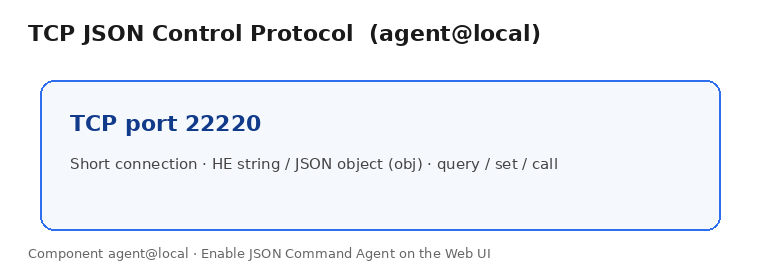
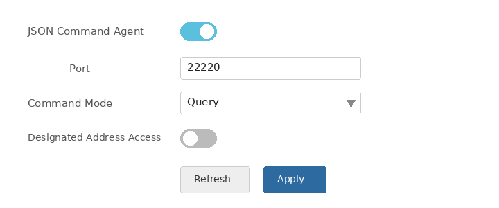
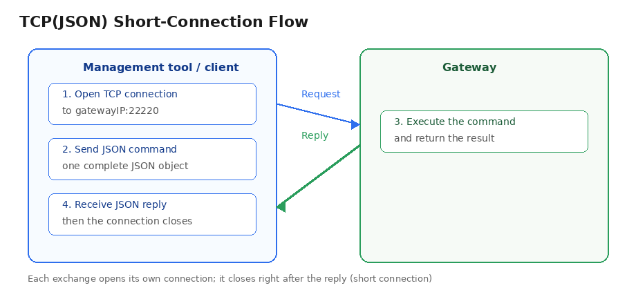
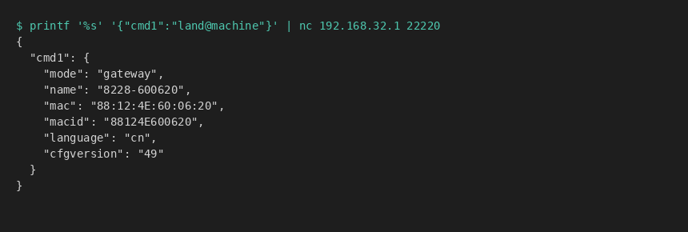
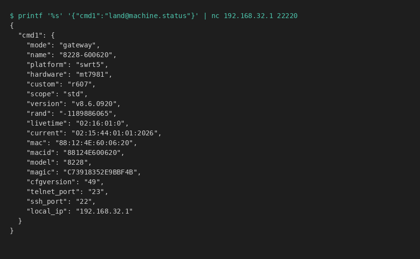

# Local Managed Protocol

The gateway accepts a **TCP JSON control protocol** from the LAN. Batch tools or other local devices can use it to query configuration, change settings, and call component APIs.

The protocol is implemented by **`agent@local`**. See [agent@local](../../com/agent/local.md) for configuration and permissions, and [he.md](../../com/land/he.md) for HE syntax.

---

## Protocol overview



| Protocol | Transport | Default port | Purpose |
|----------|-----------|--------------|---------|
| TCP JSON control | TCP | **22220** | Send JSON / HE commands to manage the gateway (short connection) |

---

## Enabling the protocol on the gateway

**JSON Command Agent** may be disabled by default. Once enabled, any host on the LAN can connect — make sure the network is trusted.

### Web UI steps

After logging into the gateway Web UI (English UI):

1. In the left sidebar, open **System**
2. Click **Agent Control**
3. On the page, select the **Local Control** tab (the same page also has **Agent Control** and **MQTT Control** — do not pick the wrong tab)
4. Find **JSON Command Agent** and turn the switch **on**
5. Keep **Port** at the default `22220` (usually no change needed)
6. Set **Command Mode**:
   - **Query**: read configuration only, plus calls whose method name contains `stat` / `list` / `info`
   - **ALL**: allow query, configuration changes, and other API calls (needed for set/restart, etc.)
7. Leave **Designated Address Access** off unless you want to allow only listed IP/MAC addresses
8. Click **Apply** at the bottom

For the Chinese Web UI labels and menu names, see [localport_protocol_cn.md](./localport_protocol_cn.md).

The figure below shows the **JSON Command Agent** block on the **Local Control** tab (steps 4–8; sidebar and other tabs omitted):



### Terminal steps (Telnet / SSH)

You can enable the same `agent@local` settings with HE from a command-line session. Useful for on-site debug, scripted setup, or when the Web UI is inconvenient.

#### 1. Connect to the device terminal

1. Telnet or SSH to the gateway management IP (Telnet is often port `23`, SSH `22`; you can also read `telnet_port` / `ssh_port` from `land@machine.status`)
2. Log in with the same admin user/password as the Web UI
3. You usually land in the **eline** shell with prompt `$ `  
   Type HE commands **directly** (no `he` prefix)

If you are already in BusyBox ash (prompt often `~ #`), use:

```shell
he 'agent@local:json=enable'
```

(In ash you must use `he 'one full HE line'`. See [eline.md](../../com/land/eline.md) / [he.md](../../com/land/he.md).)

#### 2. Check current local-agent settings

Confirm whether JSON agent is on, and the port / command mode:

```shell
$ agent@local
{
    "json":"disable",
    "json_port":"22220",
    "json_command":"query"
}
```

(There may also be broadcast-related fields; this protocol doc only cares about keys starting with `json`.)

#### 3. Enable JSON Command Agent

Equivalent to turning on the Web switch:

```shell
$ agent@local:json=enable
ttrue
```

Set the listen port (default is fine):

```shell
$ agent@local:json_port=22220
ttrue
```

Set command mode (same as the Web dropdown):

```shell
$ agent@local:json_command=query
ttrue
```

- `query`: query-only (read config; calls whose method contains `stat` / `list` / `info`)
- `all`: query, set configuration, and other APIs (required for set/restart)

For full control:

```shell
$ agent@local:json_command=all
ttrue
```

#### 4. Apply if needed

Changing config usually restarts the service automatically. If TCP `22220` still does not accept connections:

```shell
$ agent@local.setup
ttrue
```

#### 5. Self-check

From another terminal on your PC:

```bash
printf '%s' '{"cmd1":"land@machine.status"}' | nc <gatewayIP> 22220
```

If a device-status JSON comes back, the terminal-side enable succeeded.

---

# TCP JSON control protocol

Talk to the gateway on **TCP port 22220**.

## Exchange flow



From the caller’s point of view there are four steps:

1. The **management tool** opens a TCP connection to `gatewayIP:22220`
2. The **management tool** sends one complete JSON command
3. The **gateway** executes the command
4. The **gateway** returns a JSON result and closes the connection immediately (short connection; open a new connection for the next request)

Notes:

- Each top-level JSON property is a separate command; the name is arbitrary (`cmd1`, `a`, …) and the reply uses the same keys
- Two encodings per command: **HE string mode** (recommended, same as the terminal) and **JSON object mode** (`obj` / `ab` / `op` / `v` / `1`…)

> In object mode the component key is **`obj`** (not `com`). Do not include `//` comments in real payloads.

## JSON command — HE string mode

```json
{
    "cmd1":"HE command",
    "cmd2":"another HE command"
}
```

The value may be a JSON object, a string, or `"NULL"` when nothing exists.

```json
{ "cmd1":"land@machine.status" }
```

```json
{ "a":"land@machine:name", "b":"ifname@wan.status" }
```

## JSON command — JSON object mode

### Query configuration

HE form: `component[:attr/attr/...]`

```json
{ "cmd1": { "obj":"land@machine" } }
```

```json
{ "cmd1": { "obj":"land@machine", "ab":"name" } }
```

### Modify configuration

HE form: `component[:attr]=value` or `component|{...}` (needs `json_command=all`)

```json
{
    "cmd1":
    {
        "obj":"land@machine",
        "ab":"name",
        "op":"=",
        "v":"NewName"
    }
}
```

### Call an API

HE form: `component.method[args…]`

```json
{ "cmd1": { "obj":"land@machine", "op":"status" } }
```

With default **`query`** mode, only calls whose method name contains `stat` / `list` / `info` are executed.

---

# Examples

All examples assume JSON agent is enabled; send to `gatewayIP:22220`. On Linux you can use `nc` (netcat):

```bash
printf '%s' '{"cmd1":"land@machine.status"}' | nc <gatewayIP> 22220
```

Each gateway feature (device info, LTE, WAN, …) maps to a **component**. Fuller field descriptions live in that component’s interface doc. Each section below explains usage first, then points to **which document and which section** to open for details.

---

## 1. Device basic configuration and status

Hostname, working mode, firmware version, uptime, etc. come from `land@machine`.

### 1.1 Query basic configuration

Read saved configuration (name, mode, language, config version, …). Terminal HE: `land@machine`.

String mode (same as the terminal):

```json
{ "cmd1":"land@machine" }
```

Object mode:

```json
{ "cmd1": { "obj":"land@machine" } }
```

Linux terminal (`nc`):

```bash
printf '%s' '{"cmd1":"land@machine"}' | nc <gatewayIP> 22220
```



Example reply:

```json
{
    "cmd1":
    {
        "mode":"gateway",                 // working mode
        "name":"8228-600620",             // hostname
        "mac":"88:12:4E:60:06:20",        // MAC (read-only)
        "macid":"88124E600620",           // MAC ID (read-only)
        "language":"cn",                  // language
        "cfgversion":"48"                 // configuration version
    }
}
```

Common configuration fields:

| Field | Meaning |
|-------|---------|
| `name` | Hostname |
| `mode` | Working mode: `ap` / `wisp` / `nwisp` / `gateway` / `dgateway` / `misp` / `nmisp` / `dmisp` / `mwm` / `mix` / … |
| `language` | UI language |
| `cfgversion` | Configuration version |

**For full attribute details, see:** [land@machine](../../com/land/machine.md) → **Configuration reference** (including all `mode` values).

### 1.2 Query device status

Runtime status (platform, firmware, uptime, management ports, LAN IP, …). Terminal HE: `land@machine.status`.

```json
{ "cmd1":"land@machine.status" }
```

```json
{ "cmd1": { "obj":"land@machine", "op":"status" } }
```

Linux terminal (`nc`):

```bash
printf '%s' '{"cmd1":"land@machine.status"}' | nc <gatewayIP> 22220
```



Example reply:

```json
{
    "cmd1":
    {
        "mode":"gateway",
        "name":"8228-600620",
        "platform":"swrt5",
        "hardware":"mt7981",
        "custom":"r607",
        "scope":"std",
        "version":"v8.6.0920",           // firmware version
        "livetime":"01:23:53:0",         // uptime hour:minute:second:day
        "current":"01:23:36:01:01:2026", // current time
        "mac":"88:12:4E:60:06:20",
        "macid":"88124E600620",
        "model":"8228",
        "cfgversion":"48",
        "telnet_port":"23",
        "ssh_port":"22",
        "local_ip":"192.168.32.1"
    }
}
```

One field only, e.g. version:

```json
{ "cmd1":"land@machine.status:version" }
```

**For full attribute details, see:** [land@machine](../../com/land/machine.md) → **API Reference** → **`status[]`**.

---

## 2. LTE/NR status: `ifname@lte` / `ifname@lte2`

Cellular uplink status comes from `ifname@lte` (first modem). With dual modems, the second path is `ifname@lte2` (same APIs).

### When these objects exist

Whether LTE components exist depends on **working mode** (`land@machine` `mode`) and whether the board has the modem(s):

| Mode | ifname@lte | ifname@lte2 | Notes |
|------|-----------|------------|-------|
| `misp` | yes | usually no | Single 4G router |
| `nmisp` | yes | usually no | Single 4G/5G router |
| `dmisp` | yes | yes | Dual-modem router |
| `mwm` | yes (per topology) | yes (per topology) | Multi-modem + wireless mix |
| `mix` | yes if enabled | yes if enabled | Custom mix |
| `gateway` / `wisp` / `ap` / … | usually no | usually no | Call fails (e.g. `tpanic`) if LTE is not in the topology |

Check mode and existence first:

```json
{ "cmd1":"land@machine.status:mode", "cmd2":"?ifname@lte", "cmd3":"?ifname@lte2" }
```

### Query status

HE: `ifname@lte.status` / `ifname@lte2.status`.

```bash
printf '%s' '{"cmd1":"ifname@lte.status"}' | nc <gatewayIP> 22220
```

```json
{ "cmd1": { "obj":"ifname@lte", "op":"status" } }
```

```json
{ "cmd1": { "obj":"ifname@lte2", "op":"status" } }
```

Example reply (link up):

```json
{
    "cmd1":
    {
        "status":"up",                     // [ nodevice/reset/setup/register/idle/uping/block/up/failed/down ]
        "mode":"dhcpc",                    // IPv4: dhcpc / static / ppp
        "netdev":"usb1",
        "ifdev":"modem@lte",
        "ip":"10.84.136.245",
        "mask":"255.255.255.252",
        "gw":"10.84.136.246",
        "dns":"120.80.80.80",
        "livetime":"00:31:58:0",
        "imei":"868186042111714",
        "imsi":"460018708133639",
        "iccid":"8986012580155265717",     // or nosim / pin / puk
        "plmn":"46001",
        "operator":"China Unicom",
        "nettype":"FDD LTE",
        "signal":"4",                      // bars 0~4
        "rssi":"-66",
        "rsrp":"-97",
        "csq":"23",
        "band":"LTE BAND 1"
    }
}
```

On a `gateway` unit with no LTE topology, failure is expected.

**For full attribute details, see:** [ifname@lte](../../com/ifname/lte.md) → **API Reference** → **`status[]`** (same fields for `ifname@lte2`). Dial/APN settings: same doc → **Configuration reference**.

---

## 3. Wireless client (WISP) status: `ifname@wisp` / `ifname@wisp2`

When the gateway joins another Wi-Fi as a client, 2.4G is usually `ifname@wisp` and 5.8G is `ifname@wisp2`.

### When these objects exist

| Mode | ifname@wisp (2.4G) | ifname@wisp2 (5.8G) | Notes |
|------|--------------------|---------------------|-------|
| `wisp` | yes | usually no | 2.4G wireless client |
| `nwisp` | usually no | yes | 5.8G wireless client |
| `mwm` | yes (per topology) | yes (per topology) | Mixed with LTE, etc. |
| `mix` | yes if enabled | yes if enabled | Custom mix |
| `gateway` / `misp` / `ap` / … | usually no | usually no | Call fails if WISP is not mounted |

```json
{ "cmd1":"land@machine.status:mode", "cmd2":"?ifname@wisp", "cmd3":"?ifname@wisp2" }
```

### Query status

```bash
printf '%s' '{"cmd1":"ifname@wisp.status"}' | nc <gatewayIP> 22220
```

```json
{ "cmd1": { "obj":"ifname@wisp", "op":"status" } }
```

```json
{ "cmd1": { "obj":"ifname@wisp2", "op":"status" } }
```

Example reply (associated to an upstream AP):

```json
{
    "cmd1":
    {
        "status":"up",                     // [ uping/scanning/block/up/failed/down ]
        "mode":"dhcpc",
        "netdev":"ath11",
        "ip":"192.168.10.1",
        "mask":"255.255.255.0",
        "gw":"192.168.10.254",
        "dns":"114.114.114.114",
        "livetime":"01:15:50:0",
        "peer":"TP-link-2231",             // peer SSID
        "peermac":"70:3A:D8:54:BC:90",     // peer BSSID
        "channel":"10",
        "signal":"3",                      // 0~4
        "rssi":"-41",
        "rate":"270"
    }
}
```

**For full attribute details, see:** [ifname@wisp](../../com/ifname/wisp.md) → **API Reference** → **`status[]`** (same for `ifname@wisp2`). SSID/security: same doc → **Configuration reference**.

---

## 4. Wired WAN status: `ifname@wan`

Wired broadband uplink status comes from `ifname@wan` (multi-WAN may add `ifname@wan2`, …).

### When this object exists

| Mode | ifname@wan | Notes |
|------|------------|-------|
| `gateway` | yes | Single wired WAN (the live examples in this doc use this mode) |
| `dgateway` / `tgateway` / `qgateway` | yes (plus wan2/…) | Multi-WAN |
| `mwm` / `mix` | yes if wired WAN is in topology | Mix modes |
| `misp` / `wisp` / `ap` / … | usually absent or not default WAN | Depends on topology |

```json
{ "cmd1":"land@machine.status:mode", "cmd2":"?ifname@wan" }
```

### Query status

```bash
printf '%s' '{"cmd1":"ifname@wan.status"}' | nc <gatewayIP> 22220
```

```json
{ "cmd1": { "obj":"ifname@wan", "op":"status" } }
```

Live example reply (`gateway` mode):

```json
{
    "cmd1":
    {
        "status":"up",                     // [ nodevice/uping/block/up/failed/down ]
        "mode":"static",                   // dhcpc / static / pppoec
        "ifname":"ifname@wan",
        "ifdev":"ethernet@wan",
        "netdev":"lan1",
        "ip":"120.236.16.155",
        "mask":"255.255.255.248",
        "gw":"120.236.16.153",
        "dns":"120.196.165.24",
        "dns2":"8.8.8.8",
        "livetime":"01:23:29:0",
        "rx_bytes":"409506031",
        "tx_bytes":"144777676",
        "mac":"88:12:4E:60:06:20",
        "delay":"6"
    }
}
```

**For full attribute details, see:** [ifname@wan](../../com/ifname/wan.md) → **API Reference** → **`status[]`**. Static IP / PPPoE: same doc → **Configuration reference**.

---

## 5. Client list

List stations attached to the gateway (phones, PCs, …) via `client@station.list`. Usually available in any mode with a LAN.

```bash
printf '%s' '{"cmd1":"client@station.list"}' | nc <gatewayIP> 22220
```

```json
{ "cmd1": { "obj":"client@station", "op":"list" } }
```

Live example reply:

```json
{
    "cmd1":
    {
        "16:09:01:1B:F3:6F":
        {
            "ip":"192.168.32.231",
            "name":"nss",
            "ifname":"ifname@lan",
            "netdev":"lan",
            "uptime":"44",
            "livetime":"01:23:09:0",
            "bindip":"192.168.32.231",
            "arpbind":"disable"
        },
        "84:47:09:33:5C:8F":
        {
            "ip":"192.168.32.230",
            "name":"YFW",
            "ifname":"ifname@lan",
            "netdev":"lan",
            "livetime":"01:23:20:0"
        }
    }
}
```

Top-level keys are client MACs. Method name contains `list`, so it is allowed under `json_command=query`.

**For full attribute details, see:** [client@station](../../com/client/station.md) → **API Reference** → **`list[]`**.

---

## 6. Multi-uplink status: `network@connect`

When several WAN uplinks exist (e.g. LTE + wired WAN), `network@connect.status` shows which links are up and in use. Scheduling is started by the network framework; field docs live there.

### When status is meaningful

| Mode | Notes |
|------|-------|
| `mwm` / `mix` | Multiple uplinks, failover / load balance |
| `dmisp` / `dgateway` / … | Dual modem / dual WAN |
| Single uplink (e.g. pure `gateway` with one WAN) | Service may exist, but `status` is often empty / `NULL` |

```bash
printf '%s' '{"cmd1":"network@connect.status"}' | nc <gatewayIP> 22220
```

```json
{ "cmd1": { "obj":"network@connect", "op":"status" } }
```

Example shape when scheduling has results:

```json
{
    "cmd1":
    {
        "ifname@lte":
        {
            "status":"up",
            "inuse":"enable"
        },
        "ifname@lte2":
        {
            "status":"down",
            "inuse":"disable"
        },
        "ifname@wan":
        {
            "status":"up",
            "inuse":"disable"
        }
    }
}
```

- `status`: per-uplink state (`up` / `down` / `uping` / `failed` / …)
- `inuse`: whether it is the current default / in use
- `balance`: only under load-balance (dbdc)

If you get `"NULL"` or `{}`, check `land@machine.status:mode` for a multi-uplink mode.

**For full attribute details, see:** [network@frame](../../com/network/frame.md) → **API Reference** → **`status[]`** (extern connection status; `network@connect.status` matches this shape). Also see **`list[ extern ]`** for which WAN ifnames are registered.

---

## 7. Restart the gateway

Remote reboot uses `land@machine.restart`.  
Set JSON **Command Mode** to **ALL** (`json_command=all`) first; under `query` the call is ignored.

Immediate restart:

```bash
printf '%s' '{"cmd1":"land@machine.restart"}' | nc <gatewayIP> 22220
```

```json
{ "cmd1": { "obj":"land@machine", "op":"restart" } }
```

Restart after 10 seconds:

```json
{
    "cmd1":
    {
        "obj":"land@machine",
        "op":"restart",
        "1":"10",
        "2":"remote manage"
    }
}
```

Success reply:

```json
{ "cmd1":"ttrue" }
```

The unit will reboot within a few seconds — avoid accidental use on production gear.

**For full details, see:** [land@machine](../../com/land/machine.md) → **API Reference** → **`restart[]`** (optional delay args and return values).

---

## How to read component docs (if you are new to the framework)

Each feature is a **component** named like `project@name` (e.g. `land@machine`, `ifname@wan`).  
A typical component doc has:

| Section | Open this when you need… |
|---------|--------------------------|
| **Overview** | What the feature does |
| **Configuration reference** | Configurable items and value meanings |
| **API Reference** | Callable methods (`status`, `list`, `restart`, …) and reply fields |

Take an HE example from the component doc (e.g. `land@machine.status`), put it in a JSON string value, or encode it with `obj`/`op` as in this guide, then send it on TCP `22220`.

Component doc index: [doc/com/](../../com/)
