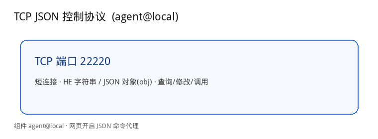
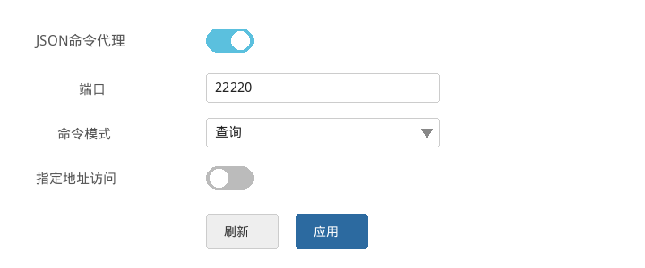
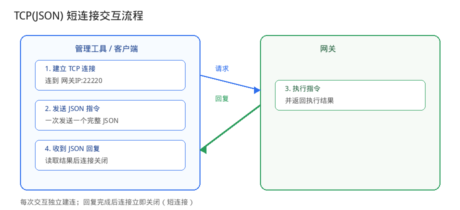

# 本地被管理协议说明

网关可接受来自局域网的 **TCP JSON 控制协议**。批量管理工具或其它本地设备通过此协议查询配置、修改配置、调用组件 API。

协议由组件 **`agent@local`** 实现。配置与权限见 [agent@local](../../com/agent/local.md)。HE 语法见 [he.md](../../com/land/he.md)。

---

## 协议概览



| 协议 | 传输 | 默认端口 | 用途 |
|------|------|----------|------|
| TCP JSON 控制协议 | TCP | **22220** | 发送 JSON / HE 指令管理网关（短连接） |

---

## 在网关上开启协议

默认 **JSON 命令代理** 可能为关闭。开启后局域网内任意主机可连入，请确认网络环境安全。

### 网页操作步骤

登录网关 Web 管理界面后，按下面路径打开并开启协议（中文界面）：

1. 左侧菜单栏点击 **系统**
2. 在展开的子菜单中点击 **远程控制**
3. 进入页面后，点击顶部标签页 **本地控制**（同一页还有「远程控制」「MQTT控制」标签，不要点错）
4. 在 **本地控制** 页中找到 **JSON 命令代理**，打开右侧开关
5. **端口** 保持默认 `22220`（一般无需修改）
6. **命令模式** 选择：
   - **查询**：只允许读配置，以及方法名含 `stat` / `list` / `info` 的调用
   - **全部**：允许查询、修改、调用（改配置、重启等需要选此项）
7. **指定地址访问** 一般保持关闭；若开启，则仅允许填入的 IP/MAC 访问该端口
8. 点击页面下方 **应用** 保存

英文界面对应路径：**System → Agent Control**，再点标签 **Local Control**，开关名为 **JSON Command Agent**。

下图为第 4～8 步所在的 **本地控制** 页内「JSON 命令代理」配置区（不含侧栏与其它标签内容）：



### 终端操作步骤（Telnet / SSH）

除网页外，也可以通过 **命令行终端** 用 HE 指令开启同一套 `agent@local` 配置。适合现场调试、脚本批量配置，或不方便开网页时。

#### 1. 连上设备终端

1. 用 Telnet 或 SSH 连接网关管理 IP（默认 Telnet 端口多为 `23`，SSH 多为 `22`；也可在 `land@machine.status` 里看 `telnet_port` / `ssh_port`）
2. 使用与网页相同的管理员账号密码登录
3. 登录成功后，一般会进入 **eline** 交互终端，提示符为 `$ `  
   在此提示符下 **直接输入 HE 指令**（不要加 `he` 前缀）

若已进入 BusyBox ash 壳（提示符多为 `~ #`），则需写成：

```shell
he 'agent@local:json=enable'
```

（ash 里必须用 `he '一整条HE'`，详见 [eline.md](../../com/land/eline.md) / [he.md](../../com/land/he.md)。）

#### 2. 查看当前本地控制配置

确认 JSON 代理是否已开、端口与命令模式：

```shell
$ agent@local
{
    "json":"disable",
    "json_port":"22220",
    "json_command":"query"
}
```

（输出里还可能有广播相关字段，本协议文档只关心以 `json` 开头的项。）

#### 3. 开启 JSON 命令代理

与网页「打开 JSON 命令代理开关」等价：

```shell
$ agent@local:json=enable
ttrue
```

设置监听端口（默认即可，一般不用改）：

```shell
$ agent@local:json_port=22220
ttrue
```

设置命令模式（与网页下拉框等价）：

```shell
$ agent@local:json_command=query
ttrue
```

- `query`：只允许查询类操作（读配置；方法名含 `stat` / `list` / `info` 的调用）
- `all`：允许查询、修改配置、调用其它 API（改配置、重启等必须用这个）

需要完整控制权限时：

```shell
$ agent@local:json_command=all
ttrue
```

#### 4. 使配置生效（如需要）

多数情况下改配置会自动拉起服务；若改完后 TCP `22220` 仍连不上，执行一次：

```shell
$ agent@local.setup
ttrue
```

#### 5. 自检

在电脑上另开一个窗口，确认端口已监听并可回包，例如：

```bash
printf '%s' '{"cmd1":"land@machine.status"}' | nc <网关IP> 22220
```

能返回设备状态 JSON，即表示终端侧开启成功。

---

# TCP JSON 控制协议

通过 **TCP 端口 22220** 与网关交互。

## 交互流程



从使用方看，一次完整交互只有四步：

1. **管理工具** 向 `网关IP:22220` 建立 TCP 连接
2. **管理工具** 发送一个完整的 JSON 指令
3. **网关** 执行指令
4. **网关** 返回 JSON 结果，并立即关闭连接（短连接；下次再发需重新建连）

说明：

- JSON 顶层每个属性是一条独立指令；属性名可自定（如 `cmd1`、`a`），网关按同名属性回填结果
- 单条指令有两种写法：**HE 字符串模式**（推荐，与终端命令一致）、**JSON 对象模式**（字段为 `obj` / `ab` / `op` / `v` / `1`…）

> JSON 对象模式里组件名键是 **`obj`**（不是 `com`）。实际发包时不要带 `//` 注释。

## JSON 指令 — HE 字符串模式

```json
{
    "cmd1":"HE指令",
    "cmd2":"另一条HE指令"
}
```

返回值可能是 JSON 对象、字符串，或不存在时为 `"NULL"`。

```json
{ "cmd1":"land@machine.status" }
```

```json
{ "a":"land@machine:name", "b":"ifname@wan.status" }
```

## JSON 指令 — JSON 对象模式

### 查询配置

对应 HE：`组件[:属性/属性/...]`

```json
{ "cmd1": { "obj":"land@machine" } }
```

```json
{ "cmd1": { "obj":"land@machine", "ab":"name" } }
```

### 修改配置

对应 HE：`组件[:属性]=值` 或 `组件|{...}`（需 `json_command=all`）

```json
{
    "cmd1":
    {
        "obj":"land@machine",
        "ab":"name",
        "op":"=",
        "v":"NewName"
    }
}
```

### 调用接口

对应 HE：`组件.方法[参数…]`

```json
{ "cmd1": { "obj":"land@machine", "op":"status" } }
```

在默认 **`query`** 权限下，仅方法名包含 `stat` / `list` / `info` 的调用会执行。

---

# 示例

以下均在开启 JSON 代理后，对 `网关IP:22220` 发送。Linux 下可用 `nc`（netcat）直接测试：

```bash
printf '%s' '{"cmd1":"land@machine.status"}' | nc <网关IP> 22220
```

网关返回的每个功能（设备信息、LTE、WAN 等）在系统里对应一个**组件**；更细的字段说明写在该组件的接口文档里。每个示例如下结构：先讲怎么用、回什么，**段末再说明应打开哪份文档、看哪一节**。

---

## 1. 设备基本配置与状态

网关的名称、工作模式、固件版本、运行时长等，都由设备管理组件 `land@machine` 提供。

### 1.1 查询基本配置

读取设备当前保存的配置（名称、工作模式、语言、配置版本等）。对应终端 HE：`land@machine`。

JSON（推荐字符串模式，与终端命令一致）：

```json
{ "cmd1":"land@machine" }
```

或对象模式：

```json
{ "cmd1": { "obj":"land@machine" } }
```

Linux 终端实测（`nc`）：

```bash
printf '%s' '{"cmd1":"land@machine"}' | nc <网关IP> 22220
```


回复示例：

```json
{
    "cmd1":
    {
        "mode":"gateway",                 // 工作模式
        "name":"8228-600620",             // 主机名
        "mac":"88:12:4E:60:06:20",        // MAC（只读）
        "macid":"88124E600620",           // MAC ID（只读）
        "language":"cn",                  // 语言
        "cfgversion":"48"                 // 配置版本号
    }
}
```

常用配置字段：

| 字段 | 说明 |
|------|------|
| `name` | 主机名 |
| `mode` | 工作模式：`ap` / `wisp` / `nwisp` / `gateway` / `dgateway` / `misp` / `nmisp` / `dmisp` / `mwm` / `mix` 等 |
| `language` | 系统语言 |
| `cfgversion` | 配置版本 |

**更多详细属性介绍见：** [land@machine 组件文档](../../com/land/machine.md) 中的 **「Configuration reference」** 一节（配置项完整说明；其中 `mode` 各取值含义也在该节）。

### 1.2 查询设备状态

查询运行中的设备状态（平台、固件版本、运行时长、管理端口、LAN IP 等）。对应终端 HE：`land@machine.status`。

```json
{ "cmd1":"land@machine.status" }
```

```json
{ "cmd1": { "obj":"land@machine", "op":"status" } }
```

Linux 终端实测（`nc`）：

```bash
printf '%s' '{"cmd1":"land@machine.status"}' | nc <网关IP> 22220
```


回复示例：

```json
{
    "cmd1":
    {
        "mode":"gateway",
        "name":"8228-600620",
        "platform":"swrt5",
        "hardware":"mt7981",
        "custom":"r607",
        "scope":"std",
        "version":"v8.6.0920",           // 固件版本
        "livetime":"01:23:53:0",         // 运行时长 时:分:秒:天
        "current":"01:23:36:01:01:2026", // 当前时间
        "mac":"88:12:4E:60:06:20",
        "macid":"88124E600620",
        "model":"8228",
        "cfgversion":"48",
        "telnet_port":"23",
        "ssh_port":"22",
        "local_ip":"192.168.32.1"
    }
}
```

也可只取某一字段，例如版本：

```json
{ "cmd1":"land@machine.status:version" }
```

**更多详细属性介绍见：** [land@machine 组件文档](../../com/land/machine.md) 中的 **「API Reference」→ `status[]`**（状态字段完整说明与示例）。

---

## 2. LTE/NR 状态：`ifname@lte` / `ifname@lte2`

4G/5G 上网链路状态由 `ifname@lte`（第一路）提供；双模组时第二路为 `ifname@lte2`，用法相同。

### 何时能拿到状态

是否存在 LTE 组件，取决于当前 **工作模式**（`land@machine` 的 `mode`）以及板卡是否有对应模组：

| 工作模式 | ifname@lte | ifname@lte2 | 说明 |
|----------|-----------|-------------|------|
| `misp` | 有 | 通常无 | 单路 4G 路由 |
| `nmisp` | 有 | 通常无 | 单路 4G/5G 路由 |
| `dmisp` | 有 | 有 | 双模组路由 |
| `mwm` | 有（按拓扑） | 有（按拓扑） | 多模组 + 无线混合 |
| `mix` | 有（若拓扑启用） | 有（若拓扑启用） | 自定义混合组网 |
| `gateway` / `wisp` / `ap` 等 | 通常无 | 通常无 | 未挂载 LTE 时调用会失败（如 `tpanic`） |

先确认模式与组件是否存在：

```json
{ "cmd1":"land@machine.status:mode", "cmd2":"?ifname@lte", "cmd3":"?ifname@lte2" }
```

### 查询状态

对应 HE：`ifname@lte.status` / `ifname@lte2.status`。

```bash
printf '%s' '{"cmd1":"ifname@lte.status"}' | nc <网关IP> 22220
```

```json
{ "cmd1": { "obj":"ifname@lte", "op":"status" } }
```

```json
{ "cmd1": { "obj":"ifname@lte2", "op":"status" } }
```

回复示例（链路已上线时）：

```json
{
    "cmd1":
    {
        "status":"up",                     // [ nodevice/reset/setup/register/idle/uping/block/up/failed/down ]
        "mode":"dhcpc",                    // IPv4 寻址：dhcpc / static / ppp
        "netdev":"usb1",
        "ifdev":"modem@lte",
        "ip":"10.84.136.245",
        "mask":"255.255.255.252",
        "gw":"10.84.136.246",
        "dns":"120.80.80.80",
        "livetime":"00:31:58:0",
        "imei":"868186042111714",
        "imsi":"460018708133639",
        "iccid":"8986012580155265717",     // 或 nosim / pin / puk
        "plmn":"46001",
        "operator":"China Unicom",
        "nettype":"FDD LTE",
        "signal":"4",                      // 0~4 格
        "rssi":"-66",
        "rsrp":"-97",
        "csq":"23",
        "band":"LTE BAND 1"
    }
}
```

当前设备若工作在 `gateway` 且无 LTE 拓扑，则可能返回失败（组件不存在），属正常现象。

**更多详细属性介绍见：** [ifname@lte 组件文档](../../com/ifname/lte.md) 中的 **「API Reference」→ `status[]`**（`ifname@lte2` 字段相同，仍看该文档）。拨号/APN 等配置项见同文档 **「Configuration reference」**。

---

## 3. 无线连网状态：`ifname@wisp` / `ifname@wisp2`

作为无线客户端连其它热点上网时，2.4G 一般为 `ifname@wisp`，5.8G 一般为 `ifname@wisp2`。

### 何时能拿到状态

| 工作模式 | ifname@wisp (2.4G) | ifname@wisp2 (5.8G) | 说明 |
|----------|--------------------|---------------------|------|
| `wisp` | 有 | 通常无 | 2.4G 无线客户端上网 |
| `nwisp` | 通常无 | 有 | 5.8G 无线客户端上网 |
| `mwm` | 有（按拓扑） | 有（按拓扑） | 与 LTE 等混合 |
| `mix` | 有（若拓扑启用） | 有（若拓扑启用） | 自定义混合组网 |
| `gateway` / `misp` / `ap` 等 | 通常无 | 通常无 | 未挂载 WISP 时调用失败 |

```json
{ "cmd1":"land@machine.status:mode", "cmd2":"?ifname@wisp", "cmd3":"?ifname@wisp2" }
```

### 查询状态

```bash
printf '%s' '{"cmd1":"ifname@wisp.status"}' | nc <网关IP> 22220
```

```json
{ "cmd1": { "obj":"ifname@wisp", "op":"status" } }
```

```json
{ "cmd1": { "obj":"ifname@wisp2", "op":"status" } }
```

回复示例（已关联上级 AP 时）：

```json
{
    "cmd1":
    {
        "status":"up",                     // [ uping/scanning/block/up/failed/down ]
        "mode":"dhcpc",
        "netdev":"ath11",
        "ip":"192.168.10.1",
        "mask":"255.255.255.0",
        "gw":"192.168.10.254",
        "dns":"114.114.114.114",
        "livetime":"01:15:50:0",
        "peer":"TP-link-2231",             // 对端 SSID
        "peermac":"70:3A:D8:54:BC:90",     // 对端 BSSID
        "channel":"10",
        "signal":"3",                      // 0~4
        "rssi":"-41",
        "rate":"270"
    }
}
```

**更多详细属性介绍见：** [ifname@wisp 组件文档](../../com/ifname/wisp.md) 中的 **「API Reference」→ `status[]`**（`ifname@wisp2` 相同）。SSID/加密等配置见同文档 **「Configuration reference」**。

---

## 4. 有线 WAN 状态：`ifname@wan`

有线宽带上网链路状态由 `ifname@wan` 提供（多 WAN 时还有 `ifname@wan2` 等）。

### 何时能拿到状态

| 工作模式 | ifname@wan | 说明 |
|----------|------------|------|
| `gateway` | 有 | 单有线 WAN 路由（本文实测示例即为此模式） |
| `dgateway` / `tgateway` / `qgateway` | 有（并可有 wan2/wan3/wan4） | 多 WAN |
| `mwm` / `mix` | 有（若拓扑启用有线外网） | 混合组网中启用 WAN 时 |
| `misp` / `wisp` / `ap` 等 | 通常无或不作默认外网 | 以当前模式拓扑为准 |

```json
{ "cmd1":"land@machine.status:mode", "cmd2":"?ifname@wan" }
```

### 查询状态

```bash
printf '%s' '{"cmd1":"ifname@wan.status"}' | nc <网关IP> 22220
```

```json
{ "cmd1": { "obj":"ifname@wan", "op":"status" } }
```

实测回复示例（`gateway` 模式）：

```json
{
    "cmd1":
    {
        "status":"up",                     // [ nodevice/uping/block/up/failed/down ]
        "mode":"static",                   // dhcpc / static / pppoec
        "ifname":"ifname@wan",
        "ifdev":"ethernet@wan",
        "netdev":"lan1",
        "ip":"120.236.16.155",
        "mask":"255.255.255.248",
        "gw":"120.236.16.153",
        "dns":"120.196.165.24",
        "dns2":"8.8.8.8",
        "livetime":"01:23:29:0",
        "rx_bytes":"409506031",
        "tx_bytes":"144777676",
        "mac":"88:12:4E:60:06:20",
        "delay":"6"
    }
}
```

**更多详细属性介绍见：** [ifname@wan 组件文档](../../com/ifname/wan.md) 中的 **「API Reference」→ `status[]`**。静态 IP / PPPoE 等配置见同文档 **「Configuration reference」**。

---

## 5. 获取客户端列表

查看当前接入网关的终端（手机、电脑等），使用 `client@station` 的 `list` 接口。任意具备 LAN 的工作模式一般均可查询。

```bash
printf '%s' '{"cmd1":"client@station.list"}' | nc <网关IP> 22220
```

```json
{ "cmd1": { "obj":"client@station", "op":"list" } }
```

实测回复示例：

```json
{
    "cmd1":
    {
        "16:09:01:1B:F3:6F":
        {
            "ip":"192.168.32.231",
            "name":"nss",
            "ifname":"ifname@lan",
            "netdev":"lan",
            "uptime":"44",
            "livetime":"01:23:09:0",
            "bindip":"192.168.32.231",
            "arpbind":"disable"
        },
        "84:47:09:33:5C:8F":
        {
            "ip":"192.168.32.230",
            "name":"YFW",
            "ifname":"ifname@lan",
            "netdev":"lan",
            "livetime":"01:23:20:0"
        }
    }
}
```

顶层 key 为客户端 MAC；`list` 方法名含 `list`，在 `json_command=query` 下允许调用。

**更多详细属性介绍见：** [client@station 组件文档](../../com/client/station.md) 中的 **「API Reference」→ `list[]`**。

---

## 6. 多链路连接状态：`network@connect`

当设备同时有多条外网上行（例如 LTE + WAN）时，可用 `network@connect.status` 查看各路上行是否在线、是否在用。多链路调度由网络框架拉起，字段说明写在网络框架文档中。

### 何时能拿到状态

| 工作模式 | 说明 |
|----------|------|
| `mwm` / `mix` | 多路上行并存，调度/主备/负载 |
| `dmisp` / `dgateway` 等 | 双模组 / 双 WAN |
| 单路上行（如纯 `gateway` 仅一条 WAN） | 服务可能存在，但 `status` 常为空 / `NULL` |

```bash
printf '%s' '{"cmd1":"network@connect.status"}' | nc <网关IP> 22220
```

```json
{ "cmd1": { "obj":"network@connect", "op":"status" } }
```

有调度结果时的回复形态示例：

```json
{
    "cmd1":
    {
        "ifname@lte":
        {
            "status":"up",              // 该外网当前状态
            "inuse":"enable"            // 是否为当前默认/在用
        },
        "ifname@lte2":
        {
            "status":"down",
            "inuse":"disable"
        },
        "ifname@wan":
        {
            "status":"up",
            "inuse":"disable"
        }
    }
}
```

- `status`：单条上行链路状态（`up` / `down` / `uping` / `failed` 等）
- `inuse`：是否当前默认/在用
- `balance`：仅负载均衡（dbdc）时出现

若返回 `"NULL"` 或空对象，先查 `land@machine.status:mode`，确认当前是否为多路上行模式。

**更多详细属性介绍见：** [network@frame 组件文档](../../com/network/frame.md) 中的 **「API Reference」→ `status[]`**（外部连接状态字段说明；`network@connect.status` 返回形态与之对应）。同文档还可看 **`list[ extern ]`** 了解当前注册了哪些外网口。

---

## 7. 重启网关

远程重启设备使用 `land@machine` 的 `restart` 接口。  
需先将 JSON **命令模式** 设为 **全部**（`json_command=all`），否则 query 模式下该调用会被忽略。

立即重启：

```bash
printf '%s' '{"cmd1":"land@machine.restart"}' | nc <网关IP> 22220
```

```json
{ "cmd1": { "obj":"land@machine", "op":"restart" } }
```

延时 10 秒重启：

```json
{
    "cmd1":
    {
        "obj":"land@machine",
        "op":"restart",
        "1":"10",
        "2":"remote manage"
    }
}
```

成功回复：

```json
{ "cmd1":"ttrue" }
```

成功后设备将在数秒内重启；请避免在生产环境误调。

**更多详细说明见：** [land@machine 组件文档](../../com/land/machine.md) 中的 **「API Reference」→ `restart[]`**（可选延时参数、返回值说明）。

---

## 如何阅读组件文档（给不熟悉框架的读者）

系统把每个功能做成一个「组件」（名字形如 `项目@名称`，例如 `land@machine`、`ifname@wan`）。  
每份组件文档通常包含：

| 文档章节 | 你要找什么时看这里 |
|----------|-------------------|
| **Overview** | 这个功能做什么 |
| **Configuration reference** | 可查询/修改的**配置项**有哪些、取值含义 |
| **API Reference** | 可**调用的方法**（如 `status`、`list`、`restart`）及返回字段 |

把组件文档里的 HE 示例（如 `land@machine.status`）原样放进 JSON 的字符串值，或按本文「JSON 对象模式」写成 `obj`/`op`，即可通过 TCP `22220` 使用。

组件文档目录入口：[doc/com/](../../com/)
