# D228 工业路由器功能测试用例（操作面全覆盖）

> DUT：`http://192.168.32.100` · Telnet `:23` · `admin`/`admin`  
> 固件：`swrt5-mt7621-d228` / `v8.6.0920` · 模式 `mwm` · 显示名 V528-212350  
> 编写日期：2026-09-28  
> 格式样例：[`sample-NET-LTE-03.md`](./sample-NET-LTE-03.md)  
> 覆盖对照：[`coverage.md`](./coverage.md)

## 怎么用

- **测试员 / AI**：每条可走 **界面** 或 **命令行（HE/eline）** 任一路径完成判定。  
- **三类判定**：界面 / 环境 / 命令行，各自成功·失败·skip；总评规则见每条「本条总评」。  
- **截图**：每条均附本条对应页面的界面实录图（`shots/`）；判定关键字段按样例方式红框标注（见 NET-LTE-03）。
- **配置纪律**：改配置必须恢复；保持 `mwm`；不默认升级 / 恢复出厂 / Sys Reboot。  
- **实机侧栏（已盘点）**：概要、性能、流量、网络（接入设置 / 4G/5G网络 / 无线连网5.8G / 本地网络）、路由（Hosts/路由表/策略/包标记/其它表/防火墙/端口映射/端口代理/TTL/ALG）、VPN（IPsec/WG/L2TP/PPTP/GRE）、无线（仅 5.8G热点）、终端、应用（IO/摄像头OSD/DDNS/串口#1#2）、系统、调试、定制开发。  
- **本机无菜单则用例标 skip（不算产品失败）**：无独立 WAN、无 2.4G 热点、无 2.4G WISP、无 GNSS 侧栏项；设备管理页内 Tab（配置/软件/密码）以实机页签为准。

## 未覆盖（阶段外）

- 字段取值笛卡尔积穷尽  
- 性能测试见 [`../performance/performance.md`](../performance/performance.md)（已单独成册）  
- 破坏性默认执行：刷 `.zz`、恢复出厂、故意改死密码

## 目录

1. [登录](#1-登录)  
2. [概要 Dashboard](#2-概要-dashboard)  
3. [性能 Utilization](#3-性能-utilization)  
4. [流量 Traffic](#4-流量-traffic)  
5. [网络 Network](#5-网络-network)  
6. [路由 Route](#6-路由-route)  
7. [VPN](#7-vpn)  
8. [无线 Wireless](#8-无线-wireless)  
9. [终端 Station](#9-终端-station)  
10. [应用 Application](#10-应用-application)  
11. [系统 System](#11-系统-system)  
12. [调试 / 定制开发](#12-调试--定制开发)

---

## 1 登录

### LOGIN-01 打开登录页

**功能说明**  
验证未登录时可打开登录页并看到设备标识与登录控件。

**侧栏路径**  
`登录页`（未登录）
页面 URL：`http://192.168.32.100/login.html`

**需要的环境**（勾选已有项）

- [ ] Web 可打开 `http://192.168.32.100/`

**步骤**

#### 1. 界面

1. 浏览器打开登录 URL，等待页面加载完成（中文「管理后台」「登录」可见）。
2. 确认可见设备名/账号框/密码框/登录按钮。

#### 2. 命令行

Telnet 登录后在 eline（`$`）执行，或 ashy：`he '…'`：

```text
land@machine.status
# 期望：custom=d228，version 以 v 开头，local_ip 可读
```

**截图**

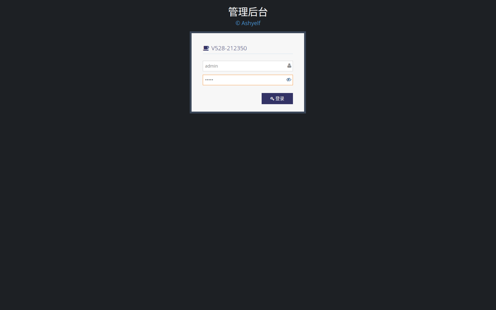

- 本条操作所在页面界面实录。

**界面判断**

| | 条件 |
|--|------|
| **成功** | 登录页打开，可见账号/密码/登录控件 |
| **失败** | 页面空白、无法加载、无登录控件 |
| **skip** | 无法访问 Web |

**环境判断**

| | 条件 |
|--|------|
| **成功** | DUT Web 端口可达 |
| **失败** | Web 不通（线/地址/服务） |
| **skip** | 无测试 PC 网络 → env |

**命令行判断**

| | 条件 |
|--|------|
| **成功** | `land@machine.status` 返回 JSON 且含 model/custom/version |
| **失败** | Telnet 可达但 status 异常且非环境 |
| **skip** | 无法 Telnet |

**本条总评**

| 判定类 | 结果（执行时勾选） |
|--------|--------------------|
| 界面 | ☐ pass　☐ fail　☐ skip |
| 环境 | ☐ pass　☐ fail　☐ skip |
| 命令行 | ☐ pass　☐ fail　☐ skip |
| **总评** | 任一类 fail → 本条 fail；已测类均为 pass、其余 skip → 本条 pass；三类皆 skip → env |


**恢复**  
无需恢复。

---
### LOGIN-02 正确账号密码登录

**功能说明**  
用正确凭据登录后进入主界面（侧栏可见）。

**侧栏路径**  
登录页 → 概要
页面 URL：`http://192.168.32.100/login.html`

**需要的环境**（勾选已有项）

- [ ] Web 可打开 `http://192.168.32.100/`

**步骤**

#### 1. 界面

1. 打开登录页，用户名 `admin`，密码 `admin`，点登录。
2. 确认进入 `index.html`，侧栏出现「概要」「网络」等。

#### 2. 命令行

Telnet 登录后在 eline（`$`）执行，或 ashy：`he '…'`：

```text
land@machine.status
```

**截图**


- 本条操作所在页面界面实录。

**界面判断**

| | 条件 |
|--|------|
| **成功** | 登录成功并见侧栏 |
| **失败** | 密码正确仍无法进入或报错 |
| **skip** | 无法打开登录页 |

**环境判断**

| | 条件 |
|--|------|
| **成功** | 账号密码为出厂/已知可用 |
| **失败** | 凭据被改且未知 |
| **skip** | 无 Web → env |

**命令行判断**

| | 条件 |
|--|------|
| **成功** | 登录后仍可用 Telnet/`land@machine.status` |
| **失败** | 认证链路异常（非环境） |
| **skip** | 无法 Telnet |

**本条总评**

| 判定类 | 结果（执行时勾选） |
|--------|--------------------|
| 界面 | ☐ pass　☐ fail　☐ skip |
| 环境 | ☐ pass　☐ fail　☐ skip |
| 命令行 | ☐ pass　☐ fail　☐ skip |
| **总评** | 任一类 fail → 本条 fail；已测类均为 pass、其余 skip → 本条 pass；三类皆 skip → env |


**恢复**  
可保持登录供后续用例；或执行 LOGIN-04 登出。

---
### LOGIN-03 错误密码拒绝

**功能说明**  
错误密码不得进入主界面。

**侧栏路径**  
登录页
页面 URL：`http://192.168.32.100/login.html`

**需要的环境**（勾选已有项）

- [ ] Web 可打开 `http://192.168.32.100/`

**步骤**

#### 1. 界面

1. 打开登录页，输入错误密码，点登录。
2. 确认仍停留在登录页或提示失败，侧栏不可用。

#### 2. 命令行

Telnet 登录后在 eline（`$`）执行，或 ashy：`he '…'`：

```text
land@machine.status
# 旁证设备仍在；错误密码无专用 HE，以界面拒绝为准
```

**截图**


- 本条操作所在页面界面实录。

**界面判断**

| | 条件 |
|--|------|
| **成功** | 错误密码被拒绝，未进入主界面 |
| **失败** | 错误密码仍进入主界面 |
| **skip** | 无法打开登录页 |

**环境判断**

| | 条件 |
|--|------|
| **成功** | Web 可用 |
| **失败** | Web 不可用 |
| **skip** | 无 Web → env |

**命令行判断**

| | 条件 |
|--|------|
| **成功** | 设备 status 仍可读（旁证） |
| **失败** | 无法旁证且界面未测 |
| **skip** | 无法 Telnet |

**本条总评**

| 判定类 | 结果（执行时勾选） |
|--------|--------------------|
| 界面 | ☐ pass　☐ fail　☐ skip |
| 环境 | ☐ pass　☐ fail　☐ skip |
| 命令行 | ☐ pass　☐ fail　☐ skip |
| **总评** | 任一类 fail → 本条 fail；已测类均为 pass、其余 skip → 本条 pass；三类皆 skip → env |


**恢复**  
无需恢复。随后用正确密码 LOGIN-02。

---
### LOGIN-04 登出回到登录页

**功能说明**  
从已登录态登出后应回到登录页。

**侧栏路径**  
主界面 → 登出
页面 URL：`http://192.168.32.100/index.html`

**需要的环境**（勾选已有项）

- [ ] Web 可打开 `http://192.168.32.100/`
- [ ] 已按 LOGIN-02 登录 Web（或本条自行登录）

**步骤**

#### 1. 界面

1. 在已登录界面找到退出/登出并执行。
2. 确认回到登录页，受保护页不可继续操作。

#### 2. 命令行

Telnet 登录后在 eline（`$`）执行，或 ashy：`he '…'`：

```text
land@machine.status
```

**截图**


- 本条操作所在页面界面实录。

**界面判断**

| | 条件 |
|--|------|
| **成功** | 回到登录页 |
| **失败** | 登出后仍可操作主界面 |
| **skip** | 无法登录故无法测登出 |

**环境判断**

| | 条件 |
|--|------|
| **成功** | 先前能登录 |
| **失败** | 会话异常 |
| **skip** | 无 Web → env |

**命令行判断**

| | 条件 |
|--|------|
| **成功** | status 可读 |
| **失败** | — |
| **skip** | 无法 Telnet |

**本条总评**

| 判定类 | 结果（执行时勾选） |
|--------|--------------------|
| 界面 | ☐ pass　☐ fail　☐ skip |
| 环境 | ☐ pass　☐ fail　☐ skip |
| 命令行 | ☐ pass　☐ fail　☐ skip |
| **总评** | 任一类 fail → 本条 fail；已测类均为 pass、其余 skip → 本条 pass；三类皆 skip → env |


**恢复**  
可再 LOGIN-02 登录继续测试。

---
## 2 概要 Dashboard

### DASH-01 进入仪表盘

**功能说明**  
打开「概要」页，确认总览卡片区域加载。

**侧栏路径**  
`概要`
页面 URL：`http://192.168.32.100/index.html#dashboard`

**需要的环境**（勾选已有项）

- [ ] Web 可打开 `http://192.168.32.100/`
- [ ] 已按 LOGIN-02 登录 Web（或本条自行登录）

**步骤**

#### 1. 界面

1. 登录后点侧栏「概要」。
2. 确认主区出现 LTE/LAN/无线等状态卡片或总览块。

#### 2. 命令行

Telnet 登录后在 eline（`$`）执行，或 ashy：`he '…'`：

```text
land@machine.status
ifname@lte.status
ifname@lan.status
```

**截图**


- 本条操作所在页面界面实录。

**界面判断**

| | 条件 |
|--|------|
| **成功** | 概要页打开且有状态区 |
| **失败** | 侧栏无概要或页空白 |
| **skip** | 无法登录 Web |

**环境判断**

| | 条件 |
|--|------|
| **成功** | 侧栏有概要 |
| **失败** | 无该菜单 |
| **skip** | 无 Web |

**命令行判断**

| | 条件 |
|--|------|
| **成功** | machine/lte/lan status 可读 |
| **失败** | status 失败非环境 |
| **skip** | 无法 Telnet |

**本条总评**

| 判定类 | 结果（执行时勾选） |
|--------|--------------------|
| 界面 | ☐ pass　☐ fail　☐ skip |
| 环境 | ☐ pass　☐ fail　☐ skip |
| 命令行 | ☐ pass　☐ fail　☐ skip |
| **总评** | 任一类 fail → 本条 fail；已测类均为 pass、其余 skip → 本条 pass；三类皆 skip → env |


**恢复**  
无需恢复。

---
### DASH-02 LTE/NR 卡片状态可读

**功能说明**  
仪表盘蜂窝卡片应显示连接相关状态。

**侧栏路径**  
`概要`
页面 URL：`http://192.168.32.100/index.html#dashboard`

**需要的环境**（勾选已有项）

- [ ] Web 可打开 `http://192.168.32.100/`
- [ ] 已按 LOGIN-02 登录 Web（或本条自行登录）
- [ ] 已插 SIM 且未欠费

**步骤**

#### 1. 界面

1. 打开概要，查看 LTE/4G/5G 卡片。
2. 记录连接态、信号或运营商等信息是否可读。

#### 2. 命令行

Telnet 登录后在 eline（`$`）执行，或 ashy：`he '…'`：

```text
modem@lte.status
ifname@lte.status
```

**截图**


- 本条操作所在页面界面实录。

**界面判断**

| | 条件 |
|--|------|
| **成功** | 卡片状态可读 |
| **失败** | 卡片缺失或长期空白（非环境） |
| **skip** | 无 Web |

**环境判断**

| | 条件 |
|--|------|
| **成功** | 有 SIM/模组 |
| **失败** | 无卡/无模组 → env |
| **skip** | 无 Web |

**命令行判断**

| | 条件 |
|--|------|
| **成功** | `modem@lte.status` 有 status/nettype 等 |
| **失败** | 长期 nodevice 且非环境 |
| **skip** | 无法 Telnet |

**本条总评**

| 判定类 | 结果（执行时勾选） |
|--------|--------------------|
| 界面 | ☐ pass　☐ fail　☐ skip |
| 环境 | ☐ pass　☐ fail　☐ skip |
| 命令行 | ☐ pass　☐ fail　☐ skip |
| **总评** | 任一类 fail → 本条 fail；已测类均为 pass、其余 skip → 本条 pass；三类皆 skip → env |


**恢复**  
无需恢复。

---
### DASH-03 LTE 卡片 play 连接

**功能说明**  
从仪表盘发起蜂窝连接。

**侧栏路径**  
`概要`
页面 URL：`http://192.168.32.100/index.html#dashboard`

**需要的环境**（勾选已有项）

- [ ] Web 可打开 `http://192.168.32.100/`
- [ ] 已按 LOGIN-02 登录 Web（或本条自行登录）
- [ ] 已插 SIM 且未欠费
- [ ] 蜂窝天线已接

**步骤**

#### 1. 界面

1. 若已连接可先 DASH-04 断开，或本条记录已连接直接成功。
2. 点 LTE 卡片 play/连接，等待 30～90s，刷新查看。

#### 2. 命令行

Telnet 登录后在 eline（`$`）执行，或 ashy：`he '…'`：

```text
modem@lte.connect
modem@lte.status
ifname@lte.status
```

**截图**


- 本条操作所在页面界面实录。

**界面判断**

| | 条件 |
|--|------|
| **成功** | 显示已连接或 Online 类状态 |
| **失败** | 点连接后长时间失败且非环境 |
| **skip** | 无 Web |

**环境判断**

| | 条件 |
|--|------|
| **成功** | SIM+天线就绪 |
| **失败** | 无卡/无信号 → env |
| **skip** | 不允许拨号 → env |

**命令行判断**

| | 条件 |
|--|------|
| **成功** | `status` 为 up |
| **失败** | connect 明确失败非环境 |
| **skip** | 无法 Telnet |

**本条总评**

| 判定类 | 结果（执行时勾选） |
|--------|--------------------|
| 界面 | ☐ pass　☐ fail　☐ skip |
| 环境 | ☐ pass　☐ fail　☐ skip |
| 命令行 | ☐ pass　☐ fail　☐ skip |
| **总评** | 任一类 fail → 本条 fail；已测类均为 pass、其余 skip → 本条 pass；三类皆 skip → env |


**恢复**  
可不恢复（保持连接）或 DASH-04。

---
### DASH-04 LTE 卡片 pause 断开

**功能说明**  
从仪表盘断开蜂窝。

**侧栏路径**  
`概要`
页面 URL：`http://192.168.32.100/index.html#dashboard`

**需要的环境**（勾选已有项）

- [ ] Web 可打开 `http://192.168.32.100/`
- [ ] 已按 LOGIN-02 登录 Web（或本条自行登录）
- [ ] 已插 SIM 且未欠费

**步骤**

#### 1. 界面

1. 在已连接时点 pause/断开。
2. 确认卡片变为断开/未连接类状态。

#### 2. 命令行

Telnet 登录后在 eline（`$`）执行，或 ashy：`he '…'`：

```text
modem@lte.down
modem@lte.status
# 若 API 名为 disconnect/offline 以 .modem@lte 为准
```

**截图**


- 本条操作所在页面界面实录。

**界面判断**

| | 条件 |
|--|------|
| **成功** | 显示断开 |
| **失败** | 无法断开且 HE 仍 up |
| **skip** | 无 Web |

**环境判断**

| | 条件 |
|--|------|
| **成功** | 允许断开 |
| **失败** | 业务禁止断开 → env |
| **skip** | 无 Web |

**命令行判断**

| | 条件 |
|--|------|
| **成功** | `status` 非 up（或约定断开态） |
| **失败** | 断开命令失败非环境 |
| **skip** | 无法 Telnet |

**本条总评**

| 判定类 | 结果（执行时勾选） |
|--------|--------------------|
| 界面 | ☐ pass　☐ fail　☐ skip |
| 环境 | ☐ pass　☐ fail　☐ skip |
| 命令行 | ☐ pass　☐ fail　☐ skip |
| **总评** | 任一类 fail → 本条 fail；已测类均为 pass、其余 skip → 本条 pass；三类皆 skip → env |


**恢复**  
测完可用 modem@lte.connect 恢复业务连接。

---
### DASH-05 WISP 卡片状态可读

**功能说明**  
仪表盘 WISP/无线上行卡片状态可读（本机为 5.8G WISP）。

**侧栏路径**  
`概要`
页面 URL：`http://192.168.32.100/index.html#dashboard`

**需要的环境**（勾选已有项）

- [ ] Web 可打开 `http://192.168.32.100/`
- [ ] 已按 LOGIN-02 登录 Web（或本条自行登录）

**步骤**

#### 1. 界面

1. 打开概要，查找 WISP/无线连网卡片。
2. 记录状态是否可读。

#### 2. 命令行

Telnet 登录后在 eline（`$`）执行，或 ashy：`he '…'`：

```text
ifname@wisp2.status
# 对象名以页面 object / `.com` 查询结果为准
```

**截图**


- 本条操作所在页面界面实录。

**界面判断**

| | 条件 |
|--|------|
| **成功** | 卡片可读或明确显示未关联 |
| **失败** | 应有卡片却空白报错 |
| **skip** | 无 Web |

**环境判断**

| | 条件 |
|--|------|
| **成功** | 有 wisp 接口 |
| **失败** | 无 WISP 功能 → skip |
| **skip** | 无 Web |

**命令行判断**

| | 条件 |
|--|------|
| **成功** | wisp status 可读或对象不存在时本条 skip |
| **失败** | — |
| **skip** | 无法 Telnet |

**本条总评**

| 判定类 | 结果（执行时勾选） |
|--------|--------------------|
| 界面 | ☐ pass　☐ fail　☐ skip |
| 环境 | ☐ pass　☐ fail　☐ skip |
| 命令行 | ☐ pass　☐ fail　☐ skip |
| **总评** | 任一类 fail → 本条 fail；已测类均为 pass、其余 skip → 本条 pass；三类皆 skip → env |


**恢复**  
无需恢复。

---
### DASH-06 WISP 卡片 play/pause

**功能说明**  
仪表盘对 WISP 执行连接/断开控件。

**侧栏路径**  
`概要`
页面 URL：`http://192.168.32.100/index.html#dashboard`

**需要的环境**（勾选已有项）

- [ ] Web 可打开 `http://192.168.32.100/`
- [ ] 已按 LOGIN-02 登录 Web（或本条自行登录）

**步骤**

#### 1. 界面

1. 对 WISP 卡片点 play 或 pause（有上级 AP 时才期望连上）。
2. 观察状态变化。

#### 2. 命令行

Telnet 登录后在 eline（`$`）执行，或 ashy：`he '…'`：

```text
ifname@wisp2.status
```

**截图**


- 本条操作所在页面界面实录。

**界面判断**

| | 条件 |
|--|------|
| **成功** | 控件可点且状态有响应（无 AP 时允许仍断开） |
| **失败** | 控件无响应/报错 |
| **skip** | 无 Web/无卡片 |

**环境判断**

| | 条件 |
|--|------|
| **成功** | 有可关联 AP 则 env 成功 |
| **失败** | 无上级 AP → 连通性 env |
| **skip** | 无 WISP → skip |

**命令行判断**

| | 条件 |
|--|------|
| **成功** | status 可读 |
| **失败** | — |
| **skip** | 无法 Telnet |

**本条总评**

| 判定类 | 结果（执行时勾选） |
|--------|--------------------|
| 界面 | ☐ pass　☐ fail　☐ skip |
| 环境 | ☐ pass　☐ fail　☐ skip |
| 命令行 | ☐ pass　☐ fail　☐ skip |
| **总评** | 任一类 fail → 本条 fail；已测类均为 pass、其余 skip → 本条 pass；三类皆 skip → env |


**恢复**  
恢复为测前连接态。

---
### DASH-07 LAN 卡片地址可读

**功能说明**  
仪表盘 LAN 卡片显示本地地址。

**侧栏路径**  
`概要`
页面 URL：`http://192.168.32.100/index.html#dashboard`

**需要的环境**（勾选已有项）

- [ ] Web 可打开 `http://192.168.32.100/`
- [ ] 已按 LOGIN-02 登录 Web（或本条自行登录）

**步骤**

#### 1. 界面

1. 查看 LAN 卡片 IP/掩码等信息。

#### 2. 命令行

Telnet 登录后在 eline（`$`）执行，或 ashy：`he '…'`：

```text
ifname@lan.status
ifname@lan
```

**截图**


- 本条操作所在页面界面实录。

**界面判断**

| | 条件 |
|--|------|
| **成功** | 可见 LAN IPv4（本机常见 192.168.32.x） |
| **失败** | 无地址且 HE 也无 |
| **skip** | 无 Web |

**环境判断**

| | 条件 |
|--|------|
| **成功** | LAN 正常 |
| **失败** | — |
| **skip** | 无 Web |

**命令行判断**

| | 条件 |
|--|------|
| **成功** | `ifname@lan.status` 有 ip |
| **失败** | 无 ip 非环境 |
| **skip** | 无法 Telnet |

**本条总评**

| 判定类 | 结果（执行时勾选） |
|--------|--------------------|
| 界面 | ☐ pass　☐ fail　☐ skip |
| 环境 | ☐ pass　☐ fail　☐ skip |
| 命令行 | ☐ pass　☐ fail　☐ skip |
| **总评** | 任一类 fail → 本条 fail；已测类均为 pass、其余 skip → 本条 pass；三类皆 skip → env |


**恢复**  
无需恢复。

---
### DASH-08 以太网口链路图标可读

**功能说明**  
仪表盘以太网口链路指示可读。

**侧栏路径**  
`概要`
页面 URL：`http://192.168.32.100/index.html#dashboard`

**需要的环境**（勾选已有项）

- [ ] Web 可打开 `http://192.168.32.100/`
- [ ] 已按 LOGIN-02 登录 Web（或本条自行登录）

**步骤**

#### 1. 界面

1. 查看以太网口链路图标/状态。

#### 2. 命令行

Telnet 登录后在 eline（`$`）执行，或 ashy：`he '…'`：

```text
land@machine.status
# 或交换机/口状态相关 com，以页面 object / `.com` 查询结果为准
```

**截图**


- 本条操作所在页面界面实录。

**界面判断**

| | 条件 |
|--|------|
| **成功** | 口状态图标/文字可读 |
| **失败** | 页上应有却全无 |
| **skip** | 无 Web |

**环境判断**

| | 条件 |
|--|------|
| **成功** | 有线口存在 |
| **失败** | — |
| **skip** | 无 Web |

**命令行判断**

| | 条件 |
|--|------|
| **成功** | machine status 可读作旁证 |
| **失败** | — |
| **skip** | 无法 Telnet |

**本条总评**

| 判定类 | 结果（执行时勾选） |
|--------|--------------------|
| 界面 | ☐ pass　☐ fail　☐ skip |
| 环境 | ☐ pass　☐ fail　☐ skip |
| 命令行 | ☐ pass　☐ fail　☐ skip |
| **总评** | 任一类 fail → 本条 fail；已测类均为 pass、其余 skip → 本条 pass；三类皆 skip → env |


**恢复**  
无需恢复。

---
### DASH-09 本地无线表可读

**功能说明**  
仪表盘本地无线/热点信息可读（本机热点为 5.8G）。

**侧栏路径**  
`概要`
页面 URL：`http://192.168.32.100/index.html#dashboard`

**需要的环境**（勾选已有项）

- [ ] Web 可打开 `http://192.168.32.100/`
- [ ] 已按 LOGIN-02 登录 Web（或本条自行登录）

**步骤**

#### 1. 界面

1. 查看无线/SSID 相关展示。

#### 2. 命令行

Telnet 登录后在 eline（`$`）执行，或 ashy：`he '…'`：

```text
wifi@a.status
wifi@a
```

**截图**


- 本条操作所在页面界面实录。

**界面判断**

| | 条件 |
|--|------|
| **成功** | 可见 SSID/无线状态或明确关闭 |
| **失败** | 应有却空白报错 |
| **skip** | 无 Web |

**环境判断**

| | 条件 |
|--|------|
| **成功** | 有 wifi@a |
| **失败** | 无无线 → skip |
| **skip** | 无 Web |

**命令行判断**

| | 条件 |
|--|------|
| **成功** | wifi@a.status 可读 |
| **失败** | — |
| **skip** | 无法 Telnet |

**本条总评**

| 判定类 | 结果（执行时勾选） |
|--------|--------------------|
| 界面 | ☐ pass　☐ fail　☐ skip |
| 环境 | ☐ pass　☐ fail　☐ skip |
| 命令行 | ☐ pass　☐ fail　☐ skip |
| **总评** | 任一类 fail → 本条 fail；已测类均为 pass、其余 skip → 本条 pass；三类皆 skip → env |


**恢复**  
无需恢复。

---
### DASH-10 LTE 扳手跳转 4G/5G

**功能说明**  
仪表盘 LTE 扳手进入网络→4G/5G。

**侧栏路径**  
`概要` → `网络 → 4G/5G网络`
页面 URL：`http://192.168.32.100/index.html#dashboard`

**需要的环境**（勾选已有项）

- [ ] Web 可打开 `http://192.168.32.100/`
- [ ] 已按 LOGIN-02 登录 Web（或本条自行登录）

**步骤**

#### 1. 界面

1. 点 LTE 卡片扳手/设置。
2. 确认进入 4G/5G网络页。

#### 2. 命令行

Telnet 登录后在 eline（`$`）执行，或 ashy：`he '…'`：

```text
modem@lte.status
```

**截图**


- 本条操作所在页面界面实录。

**界面判断**

| | 条件 |
|--|------|
| **成功** | 跳转到 4G/5G 页 |
| **失败** | 无跳转或错误页 |
| **skip** | 无 Web |

**环境判断**

| | 条件 |
|--|------|
| **成功** | 有 LTE 菜单 |
| **失败** | — |
| **skip** | 无 Web |

**命令行判断**

| | 条件 |
|--|------|
| **成功** | modem status 可读 |
| **失败** | — |
| **skip** | 无法 Telnet |

**本条总评**

| 判定类 | 结果（执行时勾选） |
|--------|--------------------|
| 界面 | ☐ pass　☐ fail　☐ skip |
| 环境 | ☐ pass　☐ fail　☐ skip |
| 命令行 | ☐ pass　☐ fail　☐ skip |
| **总评** | 任一类 fail → 本条 fail；已测类均为 pass、其余 skip → 本条 pass；三类皆 skip → env |


**恢复**  
无需恢复。

---
### DASH-11 WISP 扳手跳转

**功能说明**  
仪表盘 WISP 扳手进入无线连网。

**侧栏路径**  
`概要` → `网络 → 无线连网(5.8G)`
页面 URL：`http://192.168.32.100/index.html#dashboard`

**需要的环境**（勾选已有项）

- [ ] Web 可打开 `http://192.168.32.100/`
- [ ] 已按 LOGIN-02 登录 Web（或本条自行登录）

**步骤**

#### 1. 界面

1. 点 WISP 扳手。
2. 确认进入无线连网(5.8G)页。

#### 2. 命令行

Telnet 登录后在 eline（`$`）执行，或 ashy：`he '…'`：

```text
ifname@wisp2.status
```

**截图**


- 本条操作所在页面界面实录。

**界面判断**

| | 条件 |
|--|------|
| **成功** | 跳转到 WISP 页 |
| **失败** | 无跳转 |
| **skip** | 无卡片/无 Web |

**环境判断**

| | 条件 |
|--|------|
| **成功** | 有 WISP 菜单 |
| **失败** | 无则 skip |
| **skip** | 无 Web |

**命令行判断**

| | 条件 |
|--|------|
| **成功** | status 可读或 skip |
| **失败** | — |
| **skip** | 无法 Telnet |

**本条总评**

| 判定类 | 结果（执行时勾选） |
|--------|--------------------|
| 界面 | ☐ pass　☐ fail　☐ skip |
| 环境 | ☐ pass　☐ fail　☐ skip |
| 命令行 | ☐ pass　☐ fail　☐ skip |
| **总评** | 任一类 fail → 本条 fail；已测类均为 pass、其余 skip → 本条 pass；三类皆 skip → env |


**恢复**  
无需恢复。

---
### DASH-12 LAN/无线扳手跳转

**功能说明**  
LAN 或无线扳手进入对应配置页。

**侧栏路径**  
`概要`
页面 URL：`http://192.168.32.100/index.html#dashboard`

**需要的环境**（勾选已有项）

- [ ] Web 可打开 `http://192.168.32.100/`
- [ ] 已按 LOGIN-02 登录 Web（或本条自行登录）

**步骤**

#### 1. 界面

1. 分别点 LAN、无线扳手（若有）。
2. 确认进入本地网络或 5.8G热点页。

#### 2. 命令行

Telnet 登录后在 eline（`$`）执行，或 ashy：`he '…'`：

```text
ifname@lan.status
wifi@a.status
```

**截图**


- 本条操作所在页面界面实录。

**界面判断**

| | 条件 |
|--|------|
| **成功** | 至少一类跳转正确 |
| **失败** | 扳手无效 |
| **skip** | 无 Web |

**环境判断**

| | 条件 |
|--|------|
| **成功** | 有对应菜单 |
| **失败** | — |
| **skip** | 无 Web |

**命令行判断**

| | 条件 |
|--|------|
| **成功** | 对应 status 可读 |
| **失败** | — |
| **skip** | 无法 Telnet |

**本条总评**

| 判定类 | 结果（执行时勾选） |
|--------|--------------------|
| 界面 | ☐ pass　☐ fail　☐ skip |
| 环境 | ☐ pass　☐ fail　☐ skip |
| 命令行 | ☐ pass　☐ fail　☐ skip |
| **总评** | 任一类 fail → 本条 fail；已测类均为 pass、其余 skip → 本条 pass；三类皆 skip → env |


**恢复**  
无需恢复。

---
## 3 性能 Utilization

### UTIL-01 进入资源页

**功能说明**  
打开「性能」页。

**侧栏路径**  
`性能`
页面 URL：`http://192.168.32.100/index.html#utilization`

**需要的环境**（勾选已有项）

- [ ] Web 可打开 `http://192.168.32.100/`
- [ ] 已按 LOGIN-02 登录 Web（或本条自行登录）

**步骤**

#### 1. 界面

1. 点侧栏「性能」。
2. 确认 CPU/内存/存储类图表或数值出现。

#### 2. 命令行

Telnet 登录后在 eline（`$`）执行，或 ashy：`he '…'`：

```text
land@machine.status
```

**截图**


- 本条操作所在页面界面实录。

**界面判断**

| | 条件 |
|--|------|
| **成功** | 性能页打开 |
| **失败** | 无页面/报错 |
| **skip** | 无 Web |

**环境判断**

| | 条件 |
|--|------|
| **成功** | 有性能菜单 |
| **失败** | 无则 skip |
| **skip** | 无 Web |

**命令行判断**

| | 条件 |
|--|------|
| **成功** | status 可读旁证 |
| **失败** | — |
| **skip** | 无法 Telnet |

**本条总评**

| 判定类 | 结果（执行时勾选） |
|--------|--------------------|
| 界面 | ☐ pass　☐ fail　☐ skip |
| 环境 | ☐ pass　☐ fail　☐ skip |
| 命令行 | ☐ pass　☐ fail　☐ skip |
| **总评** | 任一类 fail → 本条 fail；已测类均为 pass、其余 skip → 本条 pass；三类皆 skip → env |


**恢复**  
无需恢复。

---
### UTIL-02 CPU 饼图与历史可读

**功能说明**  
CPU 占用展示可读。

**侧栏路径**  
`性能`
页面 URL：`http://192.168.32.100/index.html#utilization`

**需要的环境**（勾选已有项）

- [ ] Web 可打开 `http://192.168.32.100/`
- [ ] 已按 LOGIN-02 登录 Web（或本条自行登录）

**步骤**

#### 1. 界面

1. 查看 CPU 饼图/历史曲线。

#### 2. 命令行

Telnet 登录后在 eline（`$`）执行，或 ashy：`he '…'`：

```text
land@machine.status
```

**截图**


- 本条操作所在页面界面实录。

**界面判断**

| | 条件 |
|--|------|
| **成功** | CPU 图或数值可读 |
| **失败** | 应有却空白 |
| **skip** | 无页 |

**环境判断**

| | 条件 |
|--|------|
| **成功** | — |
| **失败** | — |
| **skip** | 无 Web |

**命令行判断**

| | 条件 |
|--|------|
| **成功** | 旁证 status |
| **失败** | — |
| **skip** | 无法 Telnet |

**本条总评**

| 判定类 | 结果（执行时勾选） |
|--------|--------------------|
| 界面 | ☐ pass　☐ fail　☐ skip |
| 环境 | ☐ pass　☐ fail　☐ skip |
| 命令行 | ☐ pass　☐ fail　☐ skip |
| **总评** | 任一类 fail → 本条 fail；已测类均为 pass、其余 skip → 本条 pass；三类皆 skip → env |


**恢复**  
无需恢复。

---
### UTIL-03 内存饼图可读

**功能说明**  
内存占用可读。

**侧栏路径**  
`性能`
页面 URL：`http://192.168.32.100/index.html#utilization`

**需要的环境**（勾选已有项）

- [ ] Web 可打开 `http://192.168.32.100/`
- [ ] 已按 LOGIN-02 登录 Web（或本条自行登录）

**步骤**

#### 1. 界面

1. 查看内存展示。

#### 2. 命令行

Telnet 登录后在 eline（`$`）执行，或 ashy：`he '…'`：

```text
land@machine.status
```

**截图**


- 本条操作所在页面界面实录。

**界面判断**

| | 条件 |
|--|------|
| **成功** | 内存可读 |
| **失败** | 空白报错 |
| **skip** | 无页 |

**环境判断**

| | 条件 |
|--|------|
| **成功** | — |
| **失败** | — |
| **skip** | 无 Web |

**命令行判断**

| | 条件 |
|--|------|
| **成功** | 旁证 |
| **失败** | — |
| **skip** | 无法 Telnet |

**本条总评**

| 判定类 | 结果（执行时勾选） |
|--------|--------------------|
| 界面 | ☐ pass　☐ fail　☐ skip |
| 环境 | ☐ pass　☐ fail　☐ skip |
| 命令行 | ☐ pass　☐ fail　☐ skip |
| **总评** | 任一类 fail → 本条 fail；已测类均为 pass、其余 skip → 本条 pass；三类皆 skip → env |


**恢复**  
无需恢复。

---
### UTIL-04 存储卷空间可读

**功能说明**  
存储空间可读。

**侧栏路径**  
`性能`
页面 URL：`http://192.168.32.100/index.html#utilization`

**需要的环境**（勾选已有项）

- [ ] Web 可打开 `http://192.168.32.100/`
- [ ] 已按 LOGIN-02 登录 Web（或本条自行登录）

**步骤**

#### 1. 界面

1. 查看存储/flash 空间。

#### 2. 命令行

Telnet 登录后在 eline（`$`）执行，或 ashy：`he '…'`：

```text
land@machine.status
```

**截图**


- 本条操作所在页面界面实录。

**界面判断**

| | 条件 |
|--|------|
| **成功** | 存储可读 |
| **失败** | 空白 |
| **skip** | 无页 |

**环境判断**

| | 条件 |
|--|------|
| **成功** | — |
| **失败** | — |
| **skip** | 无 Web |

**命令行判断**

| | 条件 |
|--|------|
| **成功** | 旁证 |
| **失败** | — |
| **skip** | 无法 Telnet |

**本条总评**

| 判定类 | 结果（执行时勾选） |
|--------|--------------------|
| 界面 | ☐ pass　☐ fail　☐ skip |
| 环境 | ☐ pass　☐ fail　☐ skip |
| 命令行 | ☐ pass　☐ fail　☐ skip |
| **总评** | 任一类 fail → 本条 fail；已测类均为 pass、其余 skip → 本条 pass；三类皆 skip → env |


**恢复**  
无需恢复。

---
## 4 流量 Traffic

### TRAF-01 进入流量页

**功能说明**  
打开「流量」页。

**侧栏路径**  
`流量`
页面 URL：`http://192.168.32.100/index.html#traffic`

**需要的环境**（勾选已有项）

- [ ] Web 可打开 `http://192.168.32.100/`
- [ ] 已按 LOGIN-02 登录 Web（或本条自行登录）

**步骤**

#### 1. 界面

1. 点「流量」。
2. 确认速率图或客户端表区域加载。

#### 2. 命令行

Telnet 登录后在 eline（`$`）执行，或 ashy：`he '…'`：

```text
ifname@lte.status
ifname@lan.status
```

**截图**

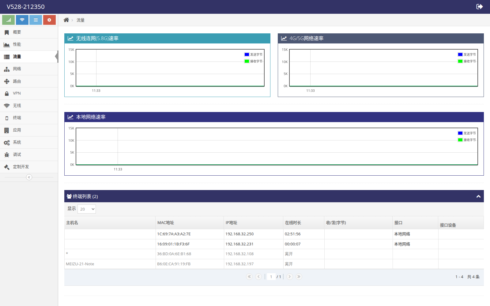

- 本条操作所在页面界面实录。

**界面判断**

| | 条件 |
|--|------|
| **成功** | 流量页打开 |
| **失败** | 无页 |
| **skip** | 无 Web |

**环境判断**

| | 条件 |
|--|------|
| **成功** | 有菜单 |
| **失败** | — |
| **skip** | 无 Web |

**命令行判断**

| | 条件 |
|--|------|
| **成功** | ifname status 可读 |
| **失败** | — |
| **skip** | 无法 Telnet |

**本条总评**

| 判定类 | 结果（执行时勾选） |
|--------|--------------------|
| 界面 | ☐ pass　☐ fail　☐ skip |
| 环境 | ☐ pass　☐ fail　☐ skip |
| 命令行 | ☐ pass　☐ fail　☐ skip |
| **总评** | 任一类 fail → 本条 fail；已测类均为 pass、其余 skip → 本条 pass；三类皆 skip → env |


**恢复**  
无需恢复。

---
### TRAF-02 上行/LAN/Wi-Fi 速率图可见

**功能说明**  
流量图可见。

**侧栏路径**  
`流量`
页面 URL：`http://192.168.32.100/index.html#traffic`

**需要的环境**（勾选已有项）

- [ ] Web 可打开 `http://192.168.32.100/`
- [ ] 已按 LOGIN-02 登录 Web（或本条自行登录）

**步骤**

#### 1. 界面

1. 查看上行/LAN/Wi-Fi 速率图。

#### 2. 命令行

Telnet 登录后在 eline（`$`）执行，或 ashy：`he '…'`：

```text
ifname@lte.status
```

**截图**


- 本条操作所在页面界面实录。

**界面判断**

| | 条件 |
|--|------|
| **成功** | 至少一类速率图可见 |
| **失败** | 应有全无 |
| **skip** | 无页 |

**环境判断**

| | 条件 |
|--|------|
| **成功** | — |
| **失败** | — |
| **skip** | 无 Web |

**命令行判断**

| | 条件 |
|--|------|
| **成功** | 旁证 |
| **失败** | — |
| **skip** | 无法 Telnet |

**本条总评**

| 判定类 | 结果（执行时勾选） |
|--------|--------------------|
| 界面 | ☐ pass　☐ fail　☐ skip |
| 环境 | ☐ pass　☐ fail　☐ skip |
| 命令行 | ☐ pass　☐ fail　☐ skip |
| **总评** | 任一类 fail → 本条 fail；已测类均为 pass、其余 skip → 本条 pass；三类皆 skip → env |


**恢复**  
无需恢复。

---
### TRAF-03 客户端表列可读

**功能说明**  
客户端表列可读。

**侧栏路径**  
`流量`
页面 URL：`http://192.168.32.100/index.html#traffic`

**需要的环境**（勾选已有项）

- [ ] Web 可打开 `http://192.168.32.100/`
- [ ] 已按 LOGIN-02 登录 Web（或本条自行登录）

**步骤**

#### 1. 界面

1. 查看客户端表头与行（可为空表）。

#### 2. 命令行

Telnet 登录后在 eline（`$`）执行，或 ashy：`he '…'`：

```text
land@machine.status
```

**截图**


- 本条操作所在页面界面实录。

**界面判断**

| | 条件 |
|--|------|
| **成功** | 表结构可读（允许 0 行） |
| **失败** | 表缺失报错 |
| **skip** | 无页 |

**环境判断**

| | 条件 |
|--|------|
| **成功** | — |
| **失败** | — |
| **skip** | 无 Web |

**命令行判断**

| | 条件 |
|--|------|
| **成功** | 旁证 |
| **失败** | — |
| **skip** | 无法 Telnet |

**本条总评**

| 判定类 | 结果（执行时勾选） |
|--------|--------------------|
| 界面 | ☐ pass　☐ fail　☐ skip |
| 环境 | ☐ pass　☐ fail　☐ skip |
| 命令行 | ☐ pass　☐ fail　☐ skip |
| **总评** | 任一类 fail → 本条 fail；已测类均为 pass、其余 skip → 本条 pass；三类皆 skip → env |


**恢复**  
无需恢复。

---
### TRAF-04 客户端表分页/条数切换

**功能说明**  
分页或每页条数可切换。

**侧栏路径**  
`流量`
页面 URL：`http://192.168.32.100/index.html#traffic`

**需要的环境**（勾选已有项）

- [ ] Web 可打开 `http://192.168.32.100/`
- [ ] 已按 LOGIN-02 登录 Web（或本条自行登录）

**步骤**

#### 1. 界面

1. 若有分页/条数控件则切换并观察。
2. 无控件则本条记录仅界面-skip。

#### 2. 命令行

Telnet 登录后在 eline（`$`）执行，或 ashy：`he '…'`：

```text
land@machine.status
```

**截图**


- 本条操作所在页面界面实录。

**界面判断**

| | 条件 |
|--|------|
| **成功** | 控件可用或明确无分页 |
| **失败** | 控件损坏 |
| **skip** | 无页 |

**环境判断**

| | 条件 |
|--|------|
| **成功** | — |
| **失败** | — |
| **skip** | 无分页控件 → 界面 skip |

**命令行判断**

| | 条件 |
|--|------|
| **成功** | 旁证 |
| **失败** | — |
| **skip** | 无法 Telnet |

**本条总评**

| 判定类 | 结果（执行时勾选） |
|--------|--------------------|
| 界面 | ☐ pass　☐ fail　☐ skip |
| 环境 | ☐ pass　☐ fail　☐ skip |
| 命令行 | ☐ pass　☐ fail　☐ skip |
| **总评** | 任一类 fail → 本条 fail；已测类均为 pass、其余 skip → 本条 pass；三类皆 skip → env |


**恢复**  
无需恢复。

---
### TRAF-05 有客户端时与终端列表对照

**功能说明**  
有关联终端时与「终端列表」对照。

**侧栏路径**  
`流量` / `终端 → 终端列表`
页面 URL：`http://192.168.32.100/index.html#traffic`

**需要的环境**（勾选已有项）

- [ ] Web 可打开 `http://192.168.32.100/`
- [ ] 已按 LOGIN-02 登录 Web（或本条自行登录）

**步骤**

#### 1. 界面

1. 流量页与终端列表各开一次，对照 MAC/IP。
2. 无客户端则环境 skip。

#### 2. 命令行

Telnet 登录后在 eline（`$`）执行，或 ashy：`he '…'`：

```text
land@machine.status
```

**截图**


- 本条操作所在页面界面实录。

**界面判断**

| | 条件 |
|--|------|
| **成功** | 两边信息可对照或不矛盾 |
| **失败** | 明显矛盾且非缓存延迟 |
| **skip** | 无页 |

**环境判断**

| | 条件 |
|--|------|
| **成功** | 有关联终端 |
| **失败** | 无终端 → env |
| **skip** | 无 Web |

**命令行判断**

| | 条件 |
|--|------|
| **成功** | 旁证 |
| **失败** | — |
| **skip** | 无法 Telnet |

**本条总评**

| 判定类 | 结果（执行时勾选） |
|--------|--------------------|
| 界面 | ☐ pass　☐ fail　☐ skip |
| 环境 | ☐ pass　☐ fail　☐ skip |
| 命令行 | ☐ pass　☐ fail　☐ skip |
| **总评** | 任一类 fail → 本条 fail；已测类均为 pass、其余 skip → 本条 pass；三类皆 skip → env |


**恢复**  
无需恢复。

---
## 5 网络 Network

### 5.1 接入设置（Connection）

### NET-CONN-01 进入连接策略页

**功能说明**  
打开接入设置页。

**侧栏路径**  
`网络 → 接入设置`
页面 URL：`http://192.168.32.100/index.html#mix`

**需要的环境**（勾选已有项）

- [ ] Web 可打开 `http://192.168.32.100/`
- [ ] 已按 LOGIN-02 登录 Web（或本条自行登录）

**步骤**

#### 1. 界面

1. 点「网络 → 接入设置」。
2. 确认方案/上行表可见。

#### 2. 命令行

Telnet 登录后在 eline（`$`）执行，或 ashy：`he '…'`：

```text
land@machine.status
# 关注 mode=mwm
ifname@lte.status
ifname@lan.status
```

**截图**


- 本条操作所在页面界面实录。

**界面判断**

| | 条件 |
|--|------|
| **成功** | 操作符合预期且页面无报错 |
| **失败** | 保存失败/策略错乱未恢复 |
| **skip** | 无 Web/无菜单 |

**环境判断**

| | 条件 |
|--|------|
| **成功** | 允许改接入策略 |
| **失败** | 业务禁止改策略 → env |
| **skip** | 无菜单 → skip |

**命令行判断**

| | 条件 |
|--|------|
| **成功** | 相关 HE get/status 与界面一致或可写回 |
| **失败** | 写入失败非环境 |
| **skip** | 无法 Telnet |

**本条总评**

| 判定类 | 结果（执行时勾选） |
|--------|--------------------|
| 界面 | ☐ pass　☐ fail　☐ skip |
| 环境 | ☐ pass　☐ fail　☐ skip |
| 命令行 | ☐ pass　☐ fail　☐ skip |
| **总评** | 任一类 fail → 本条 fail；已测类均为 pass、其余 skip → 本条 pass；三类皆 skip → env |


**恢复**  
无需恢复。

---
### NET-CONN-02 上行状态表可读

**功能说明**  
上行接口状态表可读。

**侧栏路径**  
`网络 → 接入设置`
页面 URL：`http://192.168.32.100/index.html#mix`

**需要的环境**（勾选已有项）

- [ ] Web 可打开 `http://192.168.32.100/`
- [ ] 已按 LOGIN-02 登录 Web（或本条自行登录）

**步骤**

#### 1. 界面

1. 查看 LTE/WISP/LAN 等上行行状态。

#### 2. 命令行

Telnet 登录后在 eline（`$`）执行，或 ashy：`he '…'`：

```text
ifname@lte.status
ifname@wisp2.status
ifname@lan.status
```

**截图**


- 本条操作所在页面界面实录。

**界面判断**

| | 条件 |
|--|------|
| **成功** | 操作符合预期且页面无报错 |
| **失败** | 保存失败/策略错乱未恢复 |
| **skip** | 无 Web/无菜单 |

**环境判断**

| | 条件 |
|--|------|
| **成功** | 允许改接入策略 |
| **失败** | 业务禁止改策略 → env |
| **skip** | 无菜单 → skip |

**命令行判断**

| | 条件 |
|--|------|
| **成功** | 相关 HE get/status 与界面一致或可写回 |
| **失败** | 写入失败非环境 |
| **skip** | 无法 Telnet |

**本条总评**

| 判定类 | 结果（执行时勾选） |
|--------|--------------------|
| 界面 | ☐ pass　☐ fail　☐ skip |
| 环境 | ☐ pass　☐ fail　☐ skip |
| 命令行 | ☐ pass　☐ fail　☐ skip |
| **总评** | 任一类 fail → 本条 fail；已测类均为 pass、其余 skip → 本条 pass；三类皆 skip → env |


**恢复**  
无需恢复。

---
### NET-CONN-03 查看当前 Connection Scheme

**功能说明**  
只读当前连接方案。

**侧栏路径**  
`网络 → 接入设置`
页面 URL：`http://192.168.32.100/index.html#mix`

**需要的环境**（勾选已有项）

- [ ] Web 可打开 `http://192.168.32.100/`
- [ ] 已按 LOGIN-02 登录 Web（或本条自行登录）

**步骤**

#### 1. 界面

1. 记录当前 Scheme（如 Use First Online / Backup / Balancing）。

#### 2. 命令行

Telnet 登录后在 eline（`$`）执行，或 ashy：`he '…'`：

```text
land@machine.status
```

**截图**


- 本条操作所在页面界面实录。

**界面判断**

| | 条件 |
|--|------|
| **成功** | 操作符合预期且页面无报错 |
| **失败** | 保存失败/策略错乱未恢复 |
| **skip** | 无 Web/无菜单 |

**环境判断**

| | 条件 |
|--|------|
| **成功** | 允许改接入策略 |
| **失败** | 业务禁止改策略 → env |
| **skip** | 无菜单 → skip |

**命令行判断**

| | 条件 |
|--|------|
| **成功** | 相关 HE get/status 与界面一致或可写回 |
| **失败** | 写入失败非环境 |
| **skip** | 无法 Telnet |

**本条总评**

| 判定类 | 结果（执行时勾选） |
|--------|--------------------|
| 界面 | ☐ pass　☐ fail　☐ skip |
| 环境 | ☐ pass　☐ fail　☐ skip |
| 命令行 | ☐ pass　☐ fail　☐ skip |
| **总评** | 任一类 fail → 本条 fail；已测类均为 pass、其余 skip → 本条 pass；三类皆 skip → env |


**恢复**  
无需恢复。

---
### NET-CONN-04 方案 Use First Online（改后恢复）

**功能说明**  
切换为 Use First Online 后恢复。

**侧栏路径**  
`网络 → 接入设置`
页面 URL：`http://192.168.32.100/index.html#mix`

**需要的环境**（勾选已有项）

- [ ] Web 可打开 `http://192.168.32.100/`
- [ ] 已按 LOGIN-02 登录 Web（或本条自行登录）

**步骤**

#### 1. 界面

1. 记下原方案。
2. 改为 Use First Online，Apply。
3. 确认生效后改回原方案。

#### 2. 命令行

Telnet 登录后在 eline（`$`）执行，或 ashy：`he '…'`：

```text
land@machine.status
# 配置写入以实机 mix/连接策略对象为准，示例：
# <conn_obj>
# <conn_obj>:scheme=...
```

**截图**


- 本条操作所在页面界面实录。

**界面判断**

| | 条件 |
|--|------|
| **成功** | 操作符合预期且页面无报错 |
| **失败** | 保存失败/策略错乱未恢复 |
| **skip** | 无 Web/无菜单 |

**环境判断**

| | 条件 |
|--|------|
| **成功** | 允许改接入策略 |
| **失败** | 业务禁止改策略 → env |
| **skip** | 无菜单 → skip |

**命令行判断**

| | 条件 |
|--|------|
| **成功** | 相关 HE get/status 与界面一致或可写回 |
| **失败** | 写入失败非环境 |
| **skip** | 无法 Telnet |

**本条总评**

| 判定类 | 结果（执行时勾选） |
|--------|--------------------|
| 界面 | ☐ pass　☐ fail　☐ skip |
| 环境 | ☐ pass　☐ fail　☐ skip |
| 命令行 | ☐ pass　☐ fail　☐ skip |
| **总评** | 任一类 fail → 本条 fail；已测类均为 pass、其余 skip → 本条 pass；三类皆 skip → env |


**恢复**  
改后必须恢复原 Connection Scheme / 槽位 / DNS；确认仍为业务可用态。

---
### NET-CONN-05 方案 Backup(Cold)（改后恢复）

**功能说明**  
切换 Backup(Cold) 后恢复。

**侧栏路径**  
`网络 → 接入设置`
页面 URL：`http://192.168.32.100/index.html#mix`

**需要的环境**（勾选已有项）

- [ ] Web 可打开 `http://192.168.32.100/`
- [ ] 已按 LOGIN-02 登录 Web（或本条自行登录）

**步骤**

#### 1. 界面

1. 改 Cold Backup，Apply，验证，恢复。

#### 2. 命令行

Telnet 登录后在 eline（`$`）执行，或 ashy：`he '…'`：

```text
land@machine.status
```

**截图**


- 本条操作所在页面界面实录。

**界面判断**

| | 条件 |
|--|------|
| **成功** | 操作符合预期且页面无报错 |
| **失败** | 保存失败/策略错乱未恢复 |
| **skip** | 无 Web/无菜单 |

**环境判断**

| | 条件 |
|--|------|
| **成功** | 允许改接入策略 |
| **失败** | 业务禁止改策略 → env |
| **skip** | 无菜单 → skip |

**命令行判断**

| | 条件 |
|--|------|
| **成功** | 相关 HE get/status 与界面一致或可写回 |
| **失败** | 写入失败非环境 |
| **skip** | 无法 Telnet |

**本条总评**

| 判定类 | 结果（执行时勾选） |
|--------|--------------------|
| 界面 | ☐ pass　☐ fail　☐ skip |
| 环境 | ☐ pass　☐ fail　☐ skip |
| 命令行 | ☐ pass　☐ fail　☐ skip |
| **总评** | 任一类 fail → 本条 fail；已测类均为 pass、其余 skip → 本条 pass；三类皆 skip → env |


**恢复**  
改后必须恢复原 Connection Scheme / 槽位 / DNS；确认仍为业务可用态。

---
### NET-CONN-06 方案 Backup(Hot)（改后恢复）

**功能说明**  
切换 Backup(Hot) 后恢复。

**侧栏路径**  
`网络 → 接入设置`
页面 URL：`http://192.168.32.100/index.html#mix`

**需要的环境**（勾选已有项）

- [ ] Web 可打开 `http://192.168.32.100/`
- [ ] 已按 LOGIN-02 登录 Web（或本条自行登录）

**步骤**

#### 1. 界面

1. 改 Hot Backup，Apply，验证，恢复。

#### 2. 命令行

Telnet 登录后在 eline（`$`）执行，或 ashy：`he '…'`：

```text
land@machine.status
```

**截图**


- 本条操作所在页面界面实录。

**界面判断**

| | 条件 |
|--|------|
| **成功** | 操作符合预期且页面无报错 |
| **失败** | 保存失败/策略错乱未恢复 |
| **skip** | 无 Web/无菜单 |

**环境判断**

| | 条件 |
|--|------|
| **成功** | 允许改接入策略 |
| **失败** | 业务禁止改策略 → env |
| **skip** | 无菜单 → skip |

**命令行判断**

| | 条件 |
|--|------|
| **成功** | 相关 HE get/status 与界面一致或可写回 |
| **失败** | 写入失败非环境 |
| **skip** | 无法 Telnet |

**本条总评**

| 判定类 | 结果（执行时勾选） |
|--------|--------------------|
| 界面 | ☐ pass　☐ fail　☐ skip |
| 环境 | ☐ pass　☐ fail　☐ skip |
| 命令行 | ☐ pass　☐ fail　☐ skip |
| **总评** | 任一类 fail → 本条 fail；已测类均为 pass、其余 skip → 本条 pass；三类皆 skip → env |


**恢复**  
改后必须恢复原 Connection Scheme / 槽位 / DNS；确认仍为业务可用态。

---
### NET-CONN-07 方案 Balancing 代表值（改后恢复）

**功能说明**  
切换 Balancing 代表值后恢复。

**侧栏路径**  
`网络 → 接入设置`
页面 URL：`http://192.168.32.100/index.html#mix`

**需要的环境**（勾选已有项）

- [ ] Web 可打开 `http://192.168.32.100/`
- [ ] 已按 LOGIN-02 登录 Web（或本条自行登录）

**步骤**

#### 1. 界面

1. 改 Balancing，Apply，验证，恢复。

#### 2. 命令行

Telnet 登录后在 eline（`$`）执行，或 ashy：`he '…'`：

```text
land@machine.status
```

**截图**


- 本条操作所在页面界面实录。

**界面判断**

| | 条件 |
|--|------|
| **成功** | 操作符合预期且页面无报错 |
| **失败** | 保存失败/策略错乱未恢复 |
| **skip** | 无 Web/无菜单 |

**环境判断**

| | 条件 |
|--|------|
| **成功** | 允许改接入策略 |
| **失败** | 业务禁止改策略 → env |
| **skip** | 无菜单 → skip |

**命令行判断**

| | 条件 |
|--|------|
| **成功** | 相关 HE get/status 与界面一致或可写回 |
| **失败** | 写入失败非环境 |
| **skip** | 无法 Telnet |

**本条总评**

| 判定类 | 结果（执行时勾选） |
|--------|--------------------|
| 界面 | ☐ pass　☐ fail　☐ skip |
| 环境 | ☐ pass　☐ fail　☐ skip |
| 命令行 | ☐ pass　☐ fail　☐ skip |
| **总评** | 任一类 fail → 本条 fail；已测类均为 pass、其余 skip → 本条 pass；三类皆 skip → env |


**恢复**  
改后必须恢复原 Connection Scheme / 槽位 / DNS；确认仍为业务可用态。

---
### NET-CONN-08 设置 First/Second 槽位（改后恢复）

**功能说明**  
调整主备槽位后恢复。

**侧栏路径**  
`网络 → 接入设置`
页面 URL：`http://192.168.32.100/index.html#mix`

**需要的环境**（勾选已有项）

- [ ] Web 可打开 `http://192.168.32.100/`
- [ ] 已按 LOGIN-02 登录 Web（或本条自行登录）

**步骤**

#### 1. 界面

1. 记录原 First/Second。
2. 调整槽位 Apply，再恢复。

#### 2. 命令行

Telnet 登录后在 eline（`$`）执行，或 ashy：`he '…'`：

```text
land@machine.status
```

**截图**


- 本条操作所在页面界面实录。

**界面判断**

| | 条件 |
|--|------|
| **成功** | 操作符合预期且页面无报错 |
| **失败** | 保存失败/策略错乱未恢复 |
| **skip** | 无 Web/无菜单 |

**环境判断**

| | 条件 |
|--|------|
| **成功** | 允许改接入策略 |
| **失败** | 业务禁止改策略 → env |
| **skip** | 无菜单 → skip |

**命令行判断**

| | 条件 |
|--|------|
| **成功** | 相关 HE get/status 与界面一致或可写回 |
| **失败** | 写入失败非环境 |
| **skip** | 无法 Telnet |

**本条总评**

| 判定类 | 结果（执行时勾选） |
|--------|--------------------|
| 界面 | ☐ pass　☐ fail　☐ skip |
| 环境 | ☐ pass　☐ fail　☐ skip |
| 命令行 | ☐ pass　☐ fail　☐ skip |
| **总评** | 任一类 fail → 本条 fail；已测类均为 pass、其余 skip → 本条 pass；三类皆 skip → env |


**恢复**  
改后必须恢复原 Connection Scheme / 槽位 / DNS；确认仍为业务可用态。

---
### NET-CONN-09 槽位禁止重复接口校验或恢复

**功能说明**  
验证槽位不可重复或系统有校验。

**侧栏路径**  
`网络 → 接入设置`
页面 URL：`http://192.168.32.100/index.html#mix`

**需要的环境**（勾选已有项）

- [ ] Web 可打开 `http://192.168.32.100/`
- [ ] 已按 LOGIN-02 登录 Web（或本条自行登录）

**步骤**

#### 1. 界面

1. 尝试 First/Second 选同一接口。
2. 观察拒绝或自动纠正；恢复原值。

#### 2. 命令行

Telnet 登录后在 eline（`$`）执行，或 ashy：`he '…'`：

```text
land@machine.status
```

**截图**


- 本条操作所在页面界面实录。

**界面判断**

| | 条件 |
|--|------|
| **成功** | 操作符合预期且页面无报错 |
| **失败** | 保存失败/策略错乱未恢复 |
| **skip** | 无 Web/无菜单 |

**环境判断**

| | 条件 |
|--|------|
| **成功** | 允许改接入策略 |
| **失败** | 业务禁止改策略 → env |
| **skip** | 无菜单 → skip |

**命令行判断**

| | 条件 |
|--|------|
| **成功** | 相关 HE get/status 与界面一致或可写回 |
| **失败** | 写入失败非环境 |
| **skip** | 无法 Telnet |

**本条总评**

| 判定类 | 结果（执行时勾选） |
|--------|--------------------|
| 界面 | ☐ pass　☐ fail　☐ skip |
| 环境 | ☐ pass　☐ fail　☐ skip |
| 命令行 | ☐ pass　☐ fail　☐ skip |
| **总评** | 任一类 fail → 本条 fail；已测类均为 pass、其余 skip → 本条 pass；三类皆 skip → env |


**恢复**  
改后必须恢复原 Connection Scheme / 槽位 / DNS；确认仍为业务可用态。

---
### NET-CONN-10 Custom DNS 开关与 DNS 填写恢复

**功能说明**  
自定义 DNS 开关与填写后恢复。

**侧栏路径**  
`网络 → 接入设置`
页面 URL：`http://192.168.32.100/index.html#mix`

**需要的环境**（勾选已有项）

- [ ] Web 可打开 `http://192.168.32.100/`
- [ ] 已按 LOGIN-02 登录 Web（或本条自行登录）

**步骤**

#### 1. 界面

1. 打开 Custom DNS，填测试 DNS，Apply。
2. 恢复关闭/原 DNS。

#### 2. 命令行

Telnet 登录后在 eline（`$`）执行，或 ashy：`he '…'`：

```text
land@machine.status
# DNS 相关 keys 以页面/com 为准
```

**截图**


- 本条操作所在页面界面实录。

**界面判断**

| | 条件 |
|--|------|
| **成功** | 操作符合预期且页面无报错 |
| **失败** | 保存失败/策略错乱未恢复 |
| **skip** | 无 Web/无菜单 |

**环境判断**

| | 条件 |
|--|------|
| **成功** | 允许改接入策略 |
| **失败** | 业务禁止改策略 → env |
| **skip** | 无菜单 → skip |

**命令行判断**

| | 条件 |
|--|------|
| **成功** | 相关 HE get/status 与界面一致或可写回 |
| **失败** | 写入失败非环境 |
| **skip** | 无法 Telnet |

**本条总评**

| 判定类 | 结果（执行时勾选） |
|--------|--------------------|
| 界面 | ☐ pass　☐ fail　☐ skip |
| 环境 | ☐ pass　☐ fail　☐ skip |
| 命令行 | ☐ pass　☐ fail　☐ skip |
| **总评** | 任一类 fail → 本条 fail；已测类均为 pass、其余 skip → 本条 pass；三类皆 skip → env |


**恢复**  
改后必须恢复原 Connection Scheme / 槽位 / DNS；确认仍为业务可用态。

---
### NET-CONN-11 Interval / Delay 参数查看轻改恢复

**功能说明**  
探测间隔等参数轻改恢复。

**侧栏路径**  
`网络 → 接入设置`
页面 URL：`http://192.168.32.100/index.html#mix`

**需要的环境**（勾选已有项）

- [ ] Web 可打开 `http://192.168.32.100/`
- [ ] 已按 LOGIN-02 登录 Web（或本条自行登录）

**步骤**

#### 1. 界面

1. 记录 Interval/Delay。
2. 轻改 Apply，再改回。

#### 2. 命令行

Telnet 登录后在 eline（`$`）执行，或 ashy：`he '…'`：

```text
land@machine.status
```

**截图**


- 本条操作所在页面界面实录。

**界面判断**

| | 条件 |
|--|------|
| **成功** | 操作符合预期且页面无报错 |
| **失败** | 保存失败/策略错乱未恢复 |
| **skip** | 无 Web/无菜单 |

**环境判断**

| | 条件 |
|--|------|
| **成功** | 允许改接入策略 |
| **失败** | 业务禁止改策略 → env |
| **skip** | 无菜单 → skip |

**命令行判断**

| | 条件 |
|--|------|
| **成功** | 相关 HE get/status 与界面一致或可写回 |
| **失败** | 写入失败非环境 |
| **skip** | 无法 Telnet |

**本条总评**

| 判定类 | 结果（执行时勾选） |
|--------|--------------------|
| 界面 | ☐ pass　☐ fail　☐ skip |
| 环境 | ☐ pass　☐ fail　☐ skip |
| 命令行 | ☐ pass　☐ fail　☐ skip |
| **总评** | 任一类 fail → 本条 fail；已测类均为 pass、其余 skip → 本条 pass；三类皆 skip → env |


**恢复**  
改后必须恢复原 Connection Scheme / 槽位 / DNS；确认仍为业务可用态。

---
### NET-CONN-12 Apply 后 Dashboard In Use 与策略一致

**功能说明**  
Apply 后概要 In Use 与策略一致。

**侧栏路径**  
`网络 → 接入设置`
页面 URL：`http://192.168.32.100/index.html#mix`

**需要的环境**（勾选已有项）

- [ ] Web 可打开 `http://192.168.32.100/`
- [ ] 已按 LOGIN-02 登录 Web（或本条自行登录）

**步骤**

#### 1. 界面

1. 确认当前策略与概要「正在使用」上行一致。

#### 2. 命令行

Telnet 登录后在 eline（`$`）执行，或 ashy：`he '…'`：

```text
ifname@lte.status
land@machine.status
```

**截图**


- 本条操作所在页面界面实录。

**界面判断**

| | 条件 |
|--|------|
| **成功** | 操作符合预期且页面无报错 |
| **失败** | 保存失败/策略错乱未恢复 |
| **skip** | 无 Web/无菜单 |

**环境判断**

| | 条件 |
|--|------|
| **成功** | 允许改接入策略 |
| **失败** | 业务禁止改策略 → env |
| **skip** | 无菜单 → skip |

**命令行判断**

| | 条件 |
|--|------|
| **成功** | 相关 HE get/status 与界面一致或可写回 |
| **失败** | 写入失败非环境 |
| **skip** | 无法 Telnet |

**本条总评**

| 判定类 | 结果（执行时勾选） |
|--------|--------------------|
| 界面 | ☐ pass　☐ fail　☐ skip |
| 环境 | ☐ pass　☐ fail　☐ skip |
| 命令行 | ☐ pass　☐ fail　☐ skip |
| **总评** | 任一类 fail → 本条 fail；已测类均为 pass、其余 skip → 本条 pass；三类皆 skip → env |


**恢复**  
无需恢复。

---
### NET-CONN-13 当前 mwm 槽位与预期可读对照

**功能说明**  
确认 mode=mwm 与槽位可读。

**侧栏路径**  
`网络 → 接入设置`
页面 URL：`http://192.168.32.100/index.html#mix`

**需要的环境**（勾选已有项）

- [ ] Web 可打开 `http://192.168.32.100/`
- [ ] 已按 LOGIN-02 登录 Web（或本条自行登录）

**步骤**

#### 1. 界面

1. 对照 land@machine.status 的 mode 与页面方案。

#### 2. 命令行

Telnet 登录后在 eline（`$`）执行，或 ashy：`he '…'`：

```text
land@machine.status
# 期望 mode=mwm
```

**截图**


- 本条操作所在页面界面实录。

**界面判断**

| | 条件 |
|--|------|
| **成功** | 操作符合预期且页面无报错 |
| **失败** | 保存失败/策略错乱未恢复 |
| **skip** | 无 Web/无菜单 |

**环境判断**

| | 条件 |
|--|------|
| **成功** | 允许改接入策略 |
| **失败** | 业务禁止改策略 → env |
| **skip** | 无菜单 → skip |

**命令行判断**

| | 条件 |
|--|------|
| **成功** | 相关 HE get/status 与界面一致或可写回 |
| **失败** | 写入失败非环境 |
| **skip** | 无法 Telnet |

**本条总评**

| 判定类 | 结果（执行时勾选） |
|--------|--------------------|
| 界面 | ☐ pass　☐ fail　☐ skip |
| 环境 | ☐ pass　☐ fail　☐ skip |
| 命令行 | ☐ pass　☐ fail　☐ skip |
| **总评** | 任一类 fail → 本条 fail；已测类均为 pass、其余 skip → 本条 pass；三类皆 skip → env |


**恢复**  
无需恢复。

---
### 5.2 4G/5G网络 · 基本信息

### NET-LTE-01 进入 LTE/NR · Basic Info

**功能说明**  
进入 4G/5G 基本信息页。

**侧栏路径**  
`网络 → 4G/5G网络`
页面 URL：`http://192.168.32.100/index.html#lte?object=ifname@lte`

**需要的环境**（勾选已有项）

- [ ] Web 可打开 `http://192.168.32.100/`
- [ ] 已按 LOGIN-02 登录 Web（或本条自行登录）
- [ ] 已插 SIM 且未欠费

**步骤**

#### 1. 界面

1. 点「网络 → 4G/5G网络」。
2. 确认在基本信息/状态+APN 区域。

#### 2. 命令行

Telnet 登录后在 eline（`$`）执行，或 ashy：`he '…'`：

```text
modem@lte.status
ifname@lte.status
```

**截图**

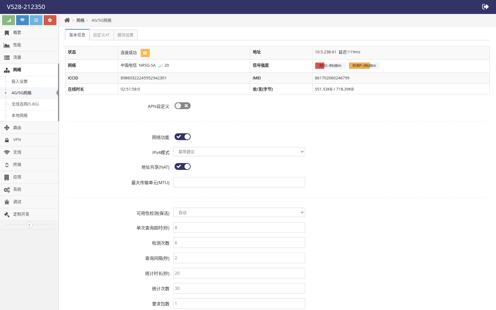

- 本条操作所在页面界面实录。

**界面判断**

| | 条件 |
|--|------|
| **成功** | 界面结果符合本条目标 |
| **失败** | 报错或状态与操作不符（非环境） |
| **skip** | 无 Web/无菜单 |

**环境判断**

| | 条件 |
|--|------|
| **成功** | SIM/模组可用 |
| **失败** | 无卡无信号 → env |
| **skip** | 无菜单 → skip |

**命令行判断**

| | 条件 |
|--|------|
| **成功** | HE 与界面一致 |
| **失败** | HE 失败非环境 |
| **skip** | 无法 Telnet |

**本条总评**

| 判定类 | 结果（执行时勾选） |
|--------|--------------------|
| 界面 | ☐ pass　☐ fail　☐ skip |
| 环境 | ☐ pass　☐ fail　☐ skip |
| 命令行 | ☐ pass　☐ fail　☐ skip |
| **总评** | 任一类 fail → 本条 fail；已测类均为 pass、其余 skip → 本条 pass；三类皆 skip → env |


**恢复**  
无需恢复。

---
### NET-LTE-02 顶部状态表可读

**功能说明**  
状态表字段可读。

**侧栏路径**  
`网络 → 4G/5G网络`
页面 URL：`http://192.168.32.100/index.html#lte?object=ifname@lte`

**需要的环境**（勾选已有项）

- [ ] Web 可打开 `http://192.168.32.100/`
- [ ] 已按 LOGIN-02 登录 Web（或本条自行登录）
- [ ] 已插 SIM 且未欠费

**步骤**

#### 1. 界面

1. 查看状态/地址/网络/信号/ICCID/IMEI 等。

#### 2. 命令行

Telnet 登录后在 eline（`$`）执行，或 ashy：`he '…'`：

```text
modem@lte.status
ifname@lte.status
```

**截图**

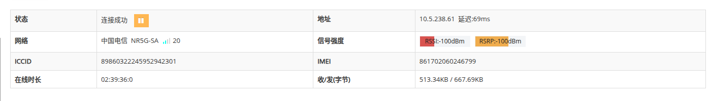

- 本条操作所在页面界面实录。

**界面判断**

| | 条件 |
|--|------|
| **成功** | 界面结果符合本条目标 |
| **失败** | 报错或状态与操作不符（非环境） |
| **skip** | 无 Web/无菜单 |

**环境判断**

| | 条件 |
|--|------|
| **成功** | SIM/模组可用 |
| **失败** | 无卡无信号 → env |
| **skip** | 无菜单 → skip |

**命令行判断**

| | 条件 |
|--|------|
| **成功** | HE 与界面一致 |
| **失败** | HE 失败非环境 |
| **skip** | 无法 Telnet |

**本条总评**

| 判定类 | 结果（执行时勾选） |
|--------|--------------------|
| 界面 | ☐ pass　☐ fail　☐ skip |
| 环境 | ☐ pass　☐ fail　☐ skip |
| 命令行 | ☐ pass　☐ fail　☐ skip |
| **总评** | 任一类 fail → 本条 fail；已测类均为 pass、其余 skip → 本条 pass；三类皆 skip → env |


**恢复**  
无需恢复。

---
### NET-LTE-03 play 拨号连接

**功能说明**  
拨号进入已连接态（样例已实录）。

**侧栏路径**  
`网络 → 4G/5G网络`
页面 URL：`http://192.168.32.100/index.html#lte?object=ifname@lte`

**需要的环境**（勾选已有项）

- [ ] Web 可打开 `http://192.168.32.100/`
- [ ] 已按 LOGIN-02 登录 Web（或本条自行登录）
- [ ] 已插 SIM 且未欠费
- [ ] 蜂窝天线已接

**步骤**

#### 1. 界面

1. 若已连接可直接判成功；否则点连接等待 30～90s。
2. 确认「连接成功」与 IP。

#### 2. 命令行

Telnet 登录后在 eline（`$`）执行，或 ashy：`he '…'`：

```text
modem@lte.status
modem@lte.connect
modem@lte.status
ifname@lte.status
```

**截图**

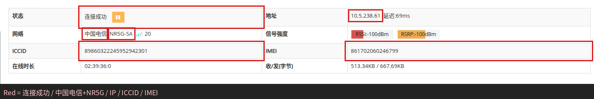

- 判定字段红框：连接成功 / 中国电信 / NR5G-SA / IP / ICCID / IMEI。

**界面判断**

| | 条件 |
|--|------|
| **成功** | 界面结果符合本条目标 |
| **失败** | 报错或状态与操作不符（非环境） |
| **skip** | 无 Web/无菜单 |

**环境判断**

| | 条件 |
|--|------|
| **成功** | SIM/模组可用 |
| **失败** | 无卡无信号 → env |
| **skip** | 无菜单 → skip |

**命令行判断**

| | 条件 |
|--|------|
| **成功** | HE 与界面一致 |
| **失败** | HE 失败非环境 |
| **skip** | 无法 Telnet |

**本条总评**

| 判定类 | 结果（执行时勾选） |
|--------|--------------------|
| 界面 | ☐ pass　☐ fail　☐ skip |
| 环境 | ☐ pass　☐ fail　☐ skip |
| 命令行 | ☐ pass　☐ fail　☐ skip |
| **总评** | 任一类 fail → 本条 fail；已测类均为 pass、其余 skip → 本条 pass；三类皆 skip → env |


**恢复**  
可不恢复（保持连接）。

---
### NET-LTE-04 pause 断开

**功能说明**  
断开蜂窝数据会话。

**侧栏路径**  
`网络 → 4G/5G网络`
页面 URL：`http://192.168.32.100/index.html#lte?object=ifname@lte`

**需要的环境**（勾选已有项）

- [ ] Web 可打开 `http://192.168.32.100/`
- [ ] 已按 LOGIN-02 登录 Web（或本条自行登录）
- [ ] 已插 SIM 且未欠费

**步骤**

#### 1. 界面

1. 点断开/pause。
2. 确认非连接成功。

#### 2. 命令行

Telnet 登录后在 eline（`$`）执行，或 ashy：`he '…'`：

```text
modem@lte.down
modem@lte.status
```

**截图**


- 本条操作所在页面界面实录。

**界面判断**

| | 条件 |
|--|------|
| **成功** | 界面结果符合本条目标 |
| **失败** | 报错或状态与操作不符（非环境） |
| **skip** | 无 Web/无菜单 |

**环境判断**

| | 条件 |
|--|------|
| **成功** | SIM/模组可用 |
| **失败** | 无卡无信号 → env |
| **skip** | 无菜单 → skip |

**命令行判断**

| | 条件 |
|--|------|
| **成功** | HE 与界面一致 |
| **失败** | HE 失败非环境 |
| **skip** | 无法 Telnet |

**本条总评**

| 判定类 | 结果（执行时勾选） |
|--------|--------------------|
| 界面 | ☐ pass　☐ fail　☐ skip |
| 环境 | ☐ pass　☐ fail　☐ skip |
| 命令行 | ☐ pass　☐ fail　☐ skip |
| **总评** | 任一类 fail → 本条 fail；已测类均为 pass、其余 skip → 本条 pass；三类皆 skip → env |


**恢复**  
测完执行 modem@lte.connect 恢复业务。

---
### NET-LTE-05 APN Custom 打开并填写后恢复

**功能说明**  
打开自定义 APN 填写后恢复。

**侧栏路径**  
`网络 → 4G/5G网络`
页面 URL：`http://192.168.32.100/index.html#lte?object=ifname@lte`

**需要的环境**（勾选已有项）

- [ ] Web 可打开 `http://192.168.32.100/`
- [ ] 已按 LOGIN-02 登录 Web（或本条自行登录）
- [ ] 已插 SIM 且未欠费

**步骤**

#### 1. 界面

1. 打开 APN Custom，填测试 APN，Apply。
2. 恢复关闭/原 APN。

#### 2. 命令行

Telnet 登录后在 eline（`$`）执行，或 ashy：`he '…'`：

```text
modem@lte
modem@lte:apn=...
# key 以页面 object / `.com` 查询结果为准
```

**截图**


- 本条操作所在页面界面实录。

**界面判断**

| | 条件 |
|--|------|
| **成功** | 界面结果符合本条目标 |
| **失败** | 报错或状态与操作不符（非环境） |
| **skip** | 无 Web/无菜单 |

**环境判断**

| | 条件 |
|--|------|
| **成功** | SIM/模组可用 |
| **失败** | 无卡无信号 → env |
| **skip** | 无菜单 → skip |

**命令行判断**

| | 条件 |
|--|------|
| **成功** | HE 与界面一致 |
| **失败** | HE 失败非环境 |
| **skip** | 无法 Telnet |

**本条总评**

| 判定类 | 结果（执行时勾选） |
|--------|--------------------|
| 界面 | ☐ pass　☐ fail　☐ skip |
| 环境 | ☐ pass　☐ fail　☐ skip |
| 命令行 | ☐ pass　☐ fail　☐ skip |
| **总评** | 任一类 fail → 本条 fail；已测类均为 pass、其余 skip → 本条 pass；三类皆 skip → env |


**恢复**  
将 APN/模式/开关等改动恢复原值；拨号类按需保持 up。

---
### NET-LTE-06 APN Custom 关闭（运营商默认）

**功能说明**  
关闭自定义 APN。

**侧栏路径**  
`网络 → 4G/5G网络`
页面 URL：`http://192.168.32.100/index.html#lte?object=ifname@lte`

**需要的环境**（勾选已有项）

- [ ] Web 可打开 `http://192.168.32.100/`
- [ ] 已按 LOGIN-02 登录 Web（或本条自行登录）
- [ ] 已插 SIM 且未欠费

**步骤**

#### 1. 界面

1. 关闭 APN Custom，Apply。
2. 确认走默认。

#### 2. 命令行

Telnet 登录后在 eline（`$`）执行，或 ashy：`he '…'`：

```text
modem@lte
```

**截图**


- 本条操作所在页面界面实录。

**界面判断**

| | 条件 |
|--|------|
| **成功** | 界面结果符合本条目标 |
| **失败** | 报错或状态与操作不符（非环境） |
| **skip** | 无 Web/无菜单 |

**环境判断**

| | 条件 |
|--|------|
| **成功** | SIM/模组可用 |
| **失败** | 无卡无信号 → env |
| **skip** | 无菜单 → skip |

**命令行判断**

| | 条件 |
|--|------|
| **成功** | HE 与界面一致 |
| **失败** | HE 失败非环境 |
| **skip** | 无法 Telnet |

**本条总评**

| 判定类 | 结果（执行时勾选） |
|--------|--------------------|
| 界面 | ☐ pass　☐ fail　☐ skip |
| 环境 | ☐ pass　☐ fail　☐ skip |
| 命令行 | ☐ pass　☐ fail　☐ skip |
| **总评** | 任一类 fail → 本条 fail；已测类均为 pass、其余 skip → 本条 pass；三类皆 skip → env |


**恢复**  
将 APN/模式/开关等改动恢复原值；拨号类按需保持 up。

---
### NET-LTE-07 IP Type / Authentication 代表值恢复

**功能说明**  
IP 类型/认证代表值切换恢复。

**侧栏路径**  
`网络 → 4G/5G网络`
页面 URL：`http://192.168.32.100/index.html#lte?object=ifname@lte`

**需要的环境**（勾选已有项）

- [ ] Web 可打开 `http://192.168.32.100/`
- [ ] 已按 LOGIN-02 登录 Web（或本条自行登录）
- [ ] 已插 SIM 且未欠费

**步骤**

#### 1. 界面

1. 改 IP Type 或 Authentication 一项，Apply，恢复。

#### 2. 命令行

Telnet 登录后在 eline（`$`）执行，或 ashy：`he '…'`：

```text
modem@lte
```

**截图**


- 本条操作所在页面界面实录。

**界面判断**

| | 条件 |
|--|------|
| **成功** | 界面结果符合本条目标 |
| **失败** | 报错或状态与操作不符（非环境） |
| **skip** | 无 Web/无菜单 |

**环境判断**

| | 条件 |
|--|------|
| **成功** | SIM/模组可用 |
| **失败** | 无卡无信号 → env |
| **skip** | 无菜单 → skip |

**命令行判断**

| | 条件 |
|--|------|
| **成功** | HE 与界面一致 |
| **失败** | HE 失败非环境 |
| **skip** | 无法 Telnet |

**本条总评**

| 判定类 | 结果（执行时勾选） |
|--------|--------------------|
| 界面 | ☐ pass　☐ fail　☐ skip |
| 环境 | ☐ pass　☐ fail　☐ skip |
| 命令行 | ☐ pass　☐ fail　☐ skip |
| **总评** | 任一类 fail → 本条 fail；已测类均为 pass、其余 skip → 本条 pass；三类皆 skip → env |


**恢复**  
将 APN/模式/开关等改动恢复原值；拨号类按需保持 up。

---
### NET-LTE-08 Network Status 开关

**功能说明**  
网络状态相关开关切换恢复。

**侧栏路径**  
`网络 → 4G/5G网络`
页面 URL：`http://192.168.32.100/index.html#lte?object=ifname@lte`

**需要的环境**（勾选已有项）

- [ ] Web 可打开 `http://192.168.32.100/`
- [ ] 已按 LOGIN-02 登录 Web（或本条自行登录）
- [ ] 已插 SIM 且未欠费

**步骤**

#### 1. 界面

1. 切换 Network Status 开关，Apply，恢复。

#### 2. 命令行

Telnet 登录后在 eline（`$`）执行，或 ashy：`he '…'`：

```text
modem@lte
ifname@lte
```

**截图**


- 本条操作所在页面界面实录。

**界面判断**

| | 条件 |
|--|------|
| **成功** | 界面结果符合本条目标 |
| **失败** | 报错或状态与操作不符（非环境） |
| **skip** | 无 Web/无菜单 |

**环境判断**

| | 条件 |
|--|------|
| **成功** | SIM/模组可用 |
| **失败** | 无卡无信号 → env |
| **skip** | 无菜单 → skip |

**命令行判断**

| | 条件 |
|--|------|
| **成功** | HE 与界面一致 |
| **失败** | HE 失败非环境 |
| **skip** | 无法 Telnet |

**本条总评**

| 判定类 | 结果（执行时勾选） |
|--------|--------------------|
| 界面 | ☐ pass　☐ fail　☐ skip |
| 环境 | ☐ pass　☐ fail　☐ skip |
| 命令行 | ☐ pass　☐ fail　☐ skip |
| **总评** | 任一类 fail → 本条 fail；已测类均为 pass、其余 skip → 本条 pass；三类皆 skip → env |


**恢复**  
将 APN/模式/开关等改动恢复原值；拨号类按需保持 up。

---
### NET-LTE-09 IPv4 Mode 代表切换恢复

**功能说明**  
IPv4 Mode（Advise/DHCP/PPP）代表切换恢复。

**侧栏路径**  
`网络 → 4G/5G网络`
页面 URL：`http://192.168.32.100/index.html#lte?object=ifname@lte`

**需要的环境**（勾选已有项）

- [ ] Web 可打开 `http://192.168.32.100/`
- [ ] 已按 LOGIN-02 登录 Web（或本条自行登录）
- [ ] 已插 SIM 且未欠费

**步骤**

#### 1. 界面

1. 切换 Mode，Apply，恢复。

#### 2. 命令行

Telnet 登录后在 eline（`$`）执行，或 ashy：`he '…'`：

```text
ifname@lte
ifname@lte.status
```

**截图**


- 本条操作所在页面界面实录。

**界面判断**

| | 条件 |
|--|------|
| **成功** | 界面结果符合本条目标 |
| **失败** | 报错或状态与操作不符（非环境） |
| **skip** | 无 Web/无菜单 |

**环境判断**

| | 条件 |
|--|------|
| **成功** | SIM/模组可用 |
| **失败** | 无卡无信号 → env |
| **skip** | 无菜单 → skip |

**命令行判断**

| | 条件 |
|--|------|
| **成功** | HE 与界面一致 |
| **失败** | HE 失败非环境 |
| **skip** | 无法 Telnet |

**本条总评**

| 判定类 | 结果（执行时勾选） |
|--------|--------------------|
| 界面 | ☐ pass　☐ fail　☐ skip |
| 环境 | ☐ pass　☐ fail　☐ skip |
| 命令行 | ☐ pass　☐ fail　☐ skip |
| **总评** | 任一类 fail → 本条 fail；已测类均为 pass、其余 skip → 本条 pass；三类皆 skip → env |


**恢复**  
将 APN/模式/开关等改动恢复原值；拨号类按需保持 up。

---
### NET-LTE-10 IPv4 Masquerade(NAT) 开关恢复

**功能说明**  
NAT/Masquerade 开关恢复。

**侧栏路径**  
`网络 → 4G/5G网络`
页面 URL：`http://192.168.32.100/index.html#lte?object=ifname@lte`

**需要的环境**（勾选已有项）

- [ ] Web 可打开 `http://192.168.32.100/`
- [ ] 已按 LOGIN-02 登录 Web（或本条自行登录）
- [ ] 已插 SIM 且未欠费

**步骤**

#### 1. 界面

1. 切换开关 Apply，恢复。

#### 2. 命令行

Telnet 登录后在 eline（`$`）执行，或 ashy：`he '…'`：

```text
ifname@lte
```

**截图**


- 本条操作所在页面界面实录。

**界面判断**

| | 条件 |
|--|------|
| **成功** | 界面结果符合本条目标 |
| **失败** | 报错或状态与操作不符（非环境） |
| **skip** | 无 Web/无菜单 |

**环境判断**

| | 条件 |
|--|------|
| **成功** | SIM/模组可用 |
| **失败** | 无卡无信号 → env |
| **skip** | 无菜单 → skip |

**命令行判断**

| | 条件 |
|--|------|
| **成功** | HE 与界面一致 |
| **失败** | HE 失败非环境 |
| **skip** | 无法 Telnet |

**本条总评**

| 判定类 | 结果（执行时勾选） |
|--------|--------------------|
| 界面 | ☐ pass　☐ fail　☐ skip |
| 环境 | ☐ pass　☐ fail　☐ skip |
| 命令行 | ☐ pass　☐ fail　☐ skip |
| **总评** | 任一类 fail → 本条 fail；已测类均为 pass、其余 skip → 本条 pass；三类皆 skip → env |


**恢复**  
将 APN/模式/开关等改动恢复原值；拨号类按需保持 up。

---
### NET-LTE-11 Custom DNS 开关恢复

**功能说明**  
LTE 侧 Custom DNS 开关恢复。

**侧栏路径**  
`网络 → 4G/5G网络`
页面 URL：`http://192.168.32.100/index.html#lte?object=ifname@lte`

**需要的环境**（勾选已有项）

- [ ] Web 可打开 `http://192.168.32.100/`
- [ ] 已按 LOGIN-02 登录 Web（或本条自行登录）
- [ ] 已插 SIM 且未欠费

**步骤**

#### 1. 界面

1. 切换并填/清 DNS，恢复。

#### 2. 命令行

Telnet 登录后在 eline（`$`）执行，或 ashy：`he '…'`：

```text
ifname@lte
```

**截图**


- 本条操作所在页面界面实录。

**界面判断**

| | 条件 |
|--|------|
| **成功** | 界面结果符合本条目标 |
| **失败** | 报错或状态与操作不符（非环境） |
| **skip** | 无 Web/无菜单 |

**环境判断**

| | 条件 |
|--|------|
| **成功** | SIM/模组可用 |
| **失败** | 无卡无信号 → env |
| **skip** | 无菜单 → skip |

**命令行判断**

| | 条件 |
|--|------|
| **成功** | HE 与界面一致 |
| **失败** | HE 失败非环境 |
| **skip** | 无法 Telnet |

**本条总评**

| 判定类 | 结果（执行时勾选） |
|--------|--------------------|
| 界面 | ☐ pass　☐ fail　☐ skip |
| 环境 | ☐ pass　☐ fail　☐ skip |
| 命令行 | ☐ pass　☐ fail　☐ skip |
| **总评** | 任一类 fail → 本条 fail；已测类均为 pass、其余 skip → 本条 pass；三类皆 skip → env |


**恢复**  
将 APN/模式/开关等改动恢复原值；拨号类按需保持 up。

---
### NET-LTE-12 Availability Check 模式代表值恢复

**功能说明**  
可用性检测模式代表值恢复。

**侧栏路径**  
`网络 → 4G/5G网络`
页面 URL：`http://192.168.32.100/index.html#lte?object=ifname@lte`

**需要的环境**（勾选已有项）

- [ ] Web 可打开 `http://192.168.32.100/`
- [ ] 已按 LOGIN-02 登录 Web（或本条自行登录）
- [ ] 已插 SIM 且未欠费

**步骤**

#### 1. 界面

1. 切换检测模式，Apply，恢复。

#### 2. 命令行

Telnet 登录后在 eline（`$`）执行，或 ashy：`he '…'`：

```text
ifname@lte
```

**截图**


- 本条操作所在页面界面实录。

**界面判断**

| | 条件 |
|--|------|
| **成功** | 界面结果符合本条目标 |
| **失败** | 报错或状态与操作不符（非环境） |
| **skip** | 无 Web/无菜单 |

**环境判断**

| | 条件 |
|--|------|
| **成功** | SIM/模组可用 |
| **失败** | 无卡无信号 → env |
| **skip** | 无菜单 → skip |

**命令行判断**

| | 条件 |
|--|------|
| **成功** | HE 与界面一致 |
| **失败** | HE 失败非环境 |
| **skip** | 无法 Telnet |

**本条总评**

| 判定类 | 结果（执行时勾选） |
|--------|--------------------|
| 界面 | ☐ pass　☐ fail　☐ skip |
| 环境 | ☐ pass　☐ fail　☐ skip |
| 命令行 | ☐ pass　☐ fail　☐ skip |
| **总评** | 任一类 fail → 本条 fail；已测类均为 pass、其余 skip → 本条 pass；三类皆 skip → env |


**恢复**  
将 APN/模式/开关等改动恢复原值；拨号类按需保持 up。

---
### NET-LTE-13 失败动作（Failed Action）代表值恢复

**功能说明**  
失败动作代表值恢复。

**侧栏路径**  
`网络 → 4G/5G网络`
页面 URL：`http://192.168.32.100/index.html#lte?object=ifname@lte`

**需要的环境**（勾选已有项）

- [ ] Web 可打开 `http://192.168.32.100/`
- [ ] 已按 LOGIN-02 登录 Web（或本条自行登录）
- [ ] 已插 SIM 且未欠费

**步骤**

#### 1. 界面

1. 切换 Failed 动作，Apply，恢复。

#### 2. 命令行

Telnet 登录后在 eline（`$`）执行，或 ashy：`he '…'`：

```text
ifname@lte
```

**截图**


- 本条操作所在页面界面实录。

**界面判断**

| | 条件 |
|--|------|
| **成功** | 界面结果符合本条目标 |
| **失败** | 报错或状态与操作不符（非环境） |
| **skip** | 无 Web/无菜单 |

**环境判断**

| | 条件 |
|--|------|
| **成功** | SIM/模组可用 |
| **失败** | 无卡无信号 → env |
| **skip** | 无菜单 → skip |

**命令行判断**

| | 条件 |
|--|------|
| **成功** | HE 与界面一致 |
| **失败** | HE 失败非环境 |
| **skip** | 无法 Telnet |

**本条总评**

| 判定类 | 结果（执行时勾选） |
|--------|--------------------|
| 界面 | ☐ pass　☐ fail　☐ skip |
| 环境 | ☐ pass　☐ fail　☐ skip |
| 命令行 | ☐ pass　☐ fail　☐ skip |
| **总评** | 任一类 fail → 本条 fail；已测类均为 pass、其余 skip → 本条 pass；三类皆 skip → env |


**恢复**  
将 APN/模式/开关等改动恢复原值；拨号类按需保持 up。

---
### NET-LTE-14 MTU 查看轻改恢复

**功能说明**  
MTU 查看轻改恢复。

**侧栏路径**  
`网络 → 4G/5G网络`
页面 URL：`http://192.168.32.100/index.html#lte?object=ifname@lte`

**需要的环境**（勾选已有项）

- [ ] Web 可打开 `http://192.168.32.100/`
- [ ] 已按 LOGIN-02 登录 Web（或本条自行登录）
- [ ] 已插 SIM 且未欠费

**步骤**

#### 1. 界面

1. 记录 MTU，轻改 Apply，改回。

#### 2. 命令行

Telnet 登录后在 eline（`$`）执行，或 ashy：`he '…'`：

```text
ifname@lte
```

**截图**


- 本条操作所在页面界面实录。

**界面判断**

| | 条件 |
|--|------|
| **成功** | 界面结果符合本条目标 |
| **失败** | 报错或状态与操作不符（非环境） |
| **skip** | 无 Web/无菜单 |

**环境判断**

| | 条件 |
|--|------|
| **成功** | SIM/模组可用 |
| **失败** | 无卡无信号 → env |
| **skip** | 无菜单 → skip |

**命令行判断**

| | 条件 |
|--|------|
| **成功** | HE 与界面一致 |
| **失败** | HE 失败非环境 |
| **skip** | 无法 Telnet |

**本条总评**

| 判定类 | 结果（执行时勾选） |
|--------|--------------------|
| 界面 | ☐ pass　☐ fail　☐ skip |
| 环境 | ☐ pass　☐ fail　☐ skip |
| 命令行 | ☐ pass　☐ fail　☐ skip |
| **总评** | 任一类 fail → 本条 fail；已测类均为 pass、其余 skip → 本条 pass；三类皆 skip → env |


**恢复**  
将 APN/模式/开关等改动恢复原值；拨号类按需保持 up。

---
### NET-LTE-27 Dashboard 与 LTE 页状态一致

**功能说明**  
概要与 4G/5G 页状态一致。

**侧栏路径**  
`网络 → 4G/5G网络`
页面 URL：`http://192.168.32.100/index.html#lte?object=ifname@lte`

**需要的环境**（勾选已有项）

- [ ] Web 可打开 `http://192.168.32.100/`
- [ ] 已按 LOGIN-02 登录 Web（或本条自行登录）
- [ ] 已插 SIM 且未欠费

**步骤**

#### 1. 界面

1. 对照两页连接态/IP。

#### 2. 命令行

Telnet 登录后在 eline（`$`）执行，或 ashy：`he '…'`：

```text
modem@lte.status
ifname@lte.status
```

**截图**


- 本条操作所在页面界面实录。

**界面判断**

| | 条件 |
|--|------|
| **成功** | 界面结果符合本条目标 |
| **失败** | 报错或状态与操作不符（非环境） |
| **skip** | 无 Web/无菜单 |

**环境判断**

| | 条件 |
|--|------|
| **成功** | SIM/模组可用 |
| **失败** | 无卡无信号 → env |
| **skip** | 无菜单 → skip |

**命令行判断**

| | 条件 |
|--|------|
| **成功** | HE 与界面一致 |
| **失败** | HE 失败非环境 |
| **skip** | 无法 Telnet |

**本条总评**

| 判定类 | 结果（执行时勾选） |
|--------|--------------------|
| 界面 | ☐ pass　☐ fail　☐ skip |
| 环境 | ☐ pass　☐ fail　☐ skip |
| 命令行 | ☐ pass　☐ fail　☐ skip |
| **总评** | 任一类 fail → 本条 fail；已测类均为 pass、其余 skip → 本条 pass；三类皆 skip → env |


**恢复**  
无需恢复。

---
### NET-LTE-28 Connection 与 LTE In Use 一致

**功能说明**  
接入设置与 LTE 使用态一致。

**侧栏路径**  
`网络 → 4G/5G网络`
页面 URL：`http://192.168.32.100/index.html#lte?object=ifname@lte`

**需要的环境**（勾选已有项）

- [ ] Web 可打开 `http://192.168.32.100/`
- [ ] 已按 LOGIN-02 登录 Web（或本条自行登录）
- [ ] 已插 SIM 且未欠费

**步骤**

#### 1. 界面

1. 对照接入页与 LTE 是否为当前上行。

#### 2. 命令行

Telnet 登录后在 eline（`$`）执行，或 ashy：`he '…'`：

```text
land@machine.status
ifname@lte.status
```

**截图**


- 本条操作所在页面界面实录。

**界面判断**

| | 条件 |
|--|------|
| **成功** | 界面结果符合本条目标 |
| **失败** | 报错或状态与操作不符（非环境） |
| **skip** | 无 Web/无菜单 |

**环境判断**

| | 条件 |
|--|------|
| **成功** | SIM/模组可用 |
| **失败** | 无卡无信号 → env |
| **skip** | 无菜单 → skip |

**命令行判断**

| | 条件 |
|--|------|
| **成功** | HE 与界面一致 |
| **失败** | HE 失败非环境 |
| **skip** | 无法 Telnet |

**本条总评**

| 判定类 | 结果（执行时勾选） |
|--------|--------------------|
| 界面 | ☐ pass　☐ fail　☐ skip |
| 环境 | ☐ pass　☐ fail　☐ skip |
| 命令行 | ☐ pass　☐ fail　☐ skip |
| **总评** | 任一类 fail → 本条 fail；已测类均为 pass、其余 skip → 本条 pass；三类皆 skip → env |


**恢复**  
无需恢复。

---
### 5.3 4G/5G网络 · 其它页签

### NET-LTE-15 Backup SIM 页进入

**功能说明**  
进入备份 SIM 页签。

**侧栏路径**  
`网络 → 4G/5G网络`
页面 URL：`http://192.168.32.100/index.html#lte?object=ifname@lte`

**需要的环境**（勾选已有项）

- [ ] Web 可打开 `http://192.168.32.100/`
- [ ] 已按 LOGIN-02 登录 Web（或本条自行登录）
- [ ] 已插 SIM 且未欠费

**步骤**

#### 1. 界面

1. 打开 4G/5G，切到 Backup SIM/备份 SIM。

#### 2. 命令行

Telnet 登录后在 eline（`$`）执行，或 ashy：`he '…'`：

```text
modem@lte
```

**截图**


- 本条操作所在页面界面实录。

**界面判断**

| | 条件 |
|--|------|
| **成功** | 界面结果符合本条目标 |
| **失败** | 报错或状态与操作不符（非环境） |
| **skip** | 无 Web/无菜单 |

**环境判断**

| | 条件 |
|--|------|
| **成功** | SIM/模组可用 |
| **失败** | 无卡无信号 → env |
| **skip** | 无菜单 → skip |

**命令行判断**

| | 条件 |
|--|------|
| **成功** | HE 与界面一致 |
| **失败** | HE 失败非环境 |
| **skip** | 无法 Telnet |

**本条总评**

| 判定类 | 结果（执行时勾选） |
|--------|--------------------|
| 界面 | ☐ pass　☐ fail　☐ skip |
| 环境 | ☐ pass　☐ fail　☐ skip |
| 命令行 | ☐ pass　☐ fail　☐ skip |
| **总评** | 任一类 fail → 本条 fail；已测类均为 pass、其余 skip → 本条 pass；三类皆 skip → env |


**恢复**  
无需恢复。

---
### NET-LTE-16 SIM Function / Mode 查看轻改恢复

**功能说明**  
备份 SIM 功能/模式轻改恢复。

**侧栏路径**  
`网络 → 4G/5G网络`
页面 URL：`http://192.168.32.100/index.html#lte?object=ifname@lte`

**需要的环境**（勾选已有项）

- [ ] Web 可打开 `http://192.168.32.100/`
- [ ] 已按 LOGIN-02 登录 Web（或本条自行登录）
- [ ] 已插 SIM 且未欠费

**步骤**

#### 1. 界面

1. 查看并轻改 Function/Mode，恢复。

#### 2. 命令行

Telnet 登录后在 eline（`$`）执行，或 ashy：`he '…'`：

```text
modem@lte
```

**截图**


- 本条操作所在页面界面实录。

**界面判断**

| | 条件 |
|--|------|
| **成功** | 界面结果符合本条目标 |
| **失败** | 报错或状态与操作不符（非环境） |
| **skip** | 无 Web/无菜单 |

**环境判断**

| | 条件 |
|--|------|
| **成功** | SIM/模组可用 |
| **失败** | 无卡无信号 → env |
| **skip** | 无菜单 → skip |

**命令行判断**

| | 条件 |
|--|------|
| **成功** | HE 与界面一致 |
| **失败** | HE 失败非环境 |
| **skip** | 无法 Telnet |

**本条总评**

| 判定类 | 结果（执行时勾选） |
|--------|--------------------|
| 界面 | ☐ pass　☐ fail　☐ skip |
| 环境 | ☐ pass　☐ fail　☐ skip |
| 命令行 | ☐ pass　☐ fail　☐ skip |
| **总评** | 任一类 fail → 本条 fail；已测类均为 pass、其余 skip → 本条 pass；三类皆 skip → env |


**恢复**  
恢复原值。

---
### NET-LTE-17 备份 APN/PIN 字段可读

**功能说明**  
备份 APN/PIN 字段可读。

**侧栏路径**  
`网络 → 4G/5G网络`
页面 URL：`http://192.168.32.100/index.html#lte?object=ifname@lte`

**需要的环境**（勾选已有项）

- [ ] Web 可打开 `http://192.168.32.100/`
- [ ] 已按 LOGIN-02 登录 Web（或本条自行登录）
- [ ] 已插 SIM 且未欠费

**步骤**

#### 1. 界面

1. 查看备份 APN/PIN 表单（可不改）。

#### 2. 命令行

Telnet 登录后在 eline（`$`）执行，或 ashy：`he '…'`：

```text
modem@lte
```

**截图**


- 本条操作所在页面界面实录。

**界面判断**

| | 条件 |
|--|------|
| **成功** | 界面结果符合本条目标 |
| **失败** | 报错或状态与操作不符（非环境） |
| **skip** | 无 Web/无菜单 |

**环境判断**

| | 条件 |
|--|------|
| **成功** | SIM/模组可用 |
| **失败** | 无卡无信号 → env |
| **skip** | 无菜单 → skip |

**命令行判断**

| | 条件 |
|--|------|
| **成功** | HE 与界面一致 |
| **失败** | HE 失败非环境 |
| **skip** | 无法 Telnet |

**本条总评**

| 判定类 | 结果（执行时勾选） |
|--------|--------------------|
| 界面 | ☐ pass　☐ fail　☐ skip |
| 环境 | ☐ pass　☐ fail　☐ skip |
| 命令行 | ☐ pass　☐ fail　☐ skip |
| **总评** | 任一类 fail → 本条 fail；已测类均为 pass、其余 skip → 本条 pass；三类皆 skip → env |


**恢复**  
无需恢复。

---
### NET-LTE-18 Custom AT 页进入

**功能说明**  
进入自定义 AT 页。

**侧栏路径**  
`网络 → 4G/5G网络`
页面 URL：`http://192.168.32.100/index.html#lte?object=ifname@lte`

**需要的环境**（勾选已有项）

- [ ] Web 可打开 `http://192.168.32.100/`
- [ ] 已按 LOGIN-02 登录 Web（或本条自行登录）
- [ ] 已插 SIM 且未欠费

**步骤**

#### 1. 界面

1. 切到 Custom AT。

#### 2. 命令行

Telnet 登录后在 eline（`$`）执行，或 ashy：`he '…'`：

```text
modem@lte
```

**截图**


- 本条操作所在页面界面实录。

**界面判断**

| | 条件 |
|--|------|
| **成功** | 界面结果符合本条目标 |
| **失败** | 报错或状态与操作不符（非环境） |
| **skip** | 无 Web/无菜单 |

**环境判断**

| | 条件 |
|--|------|
| **成功** | SIM/模组可用 |
| **失败** | 无卡无信号 → env |
| **skip** | 无菜单 → skip |

**命令行判断**

| | 条件 |
|--|------|
| **成功** | HE 与界面一致 |
| **失败** | HE 失败非环境 |
| **skip** | 无法 Telnet |

**本条总评**

| 判定类 | 结果（执行时勾选） |
|--------|--------------------|
| 界面 | ☐ pass　☐ fail　☐ skip |
| 环境 | ☐ pass　☐ fail　☐ skip |
| 命令行 | ☐ pass　☐ fail　☐ skip |
| **总评** | 任一类 fail → 本条 fail；已测类均为 pass、其余 skip → 本条 pass；三类皆 skip → env |


**恢复**  
无需恢复。

---
### NET-LTE-19 新增一条 setup AT 后删除

**功能说明**  
新增 setup AT 后删除。

**侧栏路径**  
`网络 → 4G/5G网络`
页面 URL：`http://192.168.32.100/index.html#lte?object=ifname@lte`

**需要的环境**（勾选已有项）

- [ ] Web 可打开 `http://192.168.32.100/`
- [ ] 已按 LOGIN-02 登录 Web（或本条自行登录）
- [ ] 已插 SIM 且未欠费

**步骤**

#### 1. 界面

1. 新增一条 setup AT，保存，再删除。

#### 2. 命令行

Telnet 登录后在 eline（`$`）执行，或 ashy：`he '…'`：

```text
modem@lte
```

**截图**


- 本条操作所在页面界面实录。

**界面判断**

| | 条件 |
|--|------|
| **成功** | 界面结果符合本条目标 |
| **失败** | 报错或状态与操作不符（非环境） |
| **skip** | 无 Web/无菜单 |

**环境判断**

| | 条件 |
|--|------|
| **成功** | SIM/模组可用 |
| **失败** | 无卡无信号 → env |
| **skip** | 无菜单 → skip |

**命令行判断**

| | 条件 |
|--|------|
| **成功** | HE 与界面一致 |
| **失败** | HE 失败非环境 |
| **skip** | 无法 Telnet |

**本条总评**

| 判定类 | 结果（执行时勾选） |
|--------|--------------------|
| 界面 | ☐ pass　☐ fail　☐ skip |
| 环境 | ☐ pass　☐ fail　☐ skip |
| 命令行 | ☐ pass　☐ fail　☐ skip |
| **总评** | 任一类 fail → 本条 fail；已测类均为 pass、其余 skip → 本条 pass；三类皆 skip → env |


**恢复**  
确保测试 AT 已删。

---
### NET-LTE-20 新增一条周期 AT 后删除

**功能说明**  
新增周期 AT 后删除。

**侧栏路径**  
`网络 → 4G/5G网络`
页面 URL：`http://192.168.32.100/index.html#lte?object=ifname@lte`

**需要的环境**（勾选已有项）

- [ ] Web 可打开 `http://192.168.32.100/`
- [ ] 已按 LOGIN-02 登录 Web（或本条自行登录）
- [ ] 已插 SIM 且未欠费

**步骤**

#### 1. 界面

1. 新增周期 AT，删除。

#### 2. 命令行

Telnet 登录后在 eline（`$`）执行，或 ashy：`he '…'`：

```text
modem@lte
```

**截图**


- 本条操作所在页面界面实录。

**界面判断**

| | 条件 |
|--|------|
| **成功** | 界面结果符合本条目标 |
| **失败** | 报错或状态与操作不符（非环境） |
| **skip** | 无 Web/无菜单 |

**环境判断**

| | 条件 |
|--|------|
| **成功** | SIM/模组可用 |
| **失败** | 无卡无信号 → env |
| **skip** | 无菜单 → skip |

**命令行判断**

| | 条件 |
|--|------|
| **成功** | HE 与界面一致 |
| **失败** | HE 失败非环境 |
| **skip** | 无法 Telnet |

**本条总评**

| 判定类 | 结果（执行时勾选） |
|--------|--------------------|
| 界面 | ☐ pass　☐ fail　☐ skip |
| 环境 | ☐ pass　☐ fail　☐ skip |
| 命令行 | ☐ pass　☐ fail　☐ skip |
| **总评** | 任一类 fail → 本条 fail；已测类均为 pass、其余 skip → 本条 pass；三类皆 skip → env |


**恢复**  
确保已删。

---
### NET-LTE-21 SMS Settings 进入

**功能说明**  
进入短信设置。

**侧栏路径**  
`网络 → 4G/5G网络`
页面 URL：`http://192.168.32.100/index.html#lte?object=ifname@lte`

**需要的环境**（勾选已有项）

- [ ] Web 可打开 `http://192.168.32.100/`
- [ ] 已按 LOGIN-02 登录 Web（或本条自行登录）
- [ ] 已插 SIM 且未欠费

**步骤**

#### 1. 界面

1. 切到 SMS Settings。

#### 2. 命令行

Telnet 登录后在 eline（`$`）执行，或 ashy：`he '…'`：

```text
modem@lte
```

**截图**


- 本条操作所在页面界面实录。

**界面判断**

| | 条件 |
|--|------|
| **成功** | 界面结果符合本条目标 |
| **失败** | 报错或状态与操作不符（非环境） |
| **skip** | 无 Web/无菜单 |

**环境判断**

| | 条件 |
|--|------|
| **成功** | SIM/模组可用 |
| **失败** | 无卡无信号 → env |
| **skip** | 无菜单 → skip |

**命令行判断**

| | 条件 |
|--|------|
| **成功** | HE 与界面一致 |
| **失败** | HE 失败非环境 |
| **skip** | 无法 Telnet |

**本条总评**

| 判定类 | 结果（执行时勾选） |
|--------|--------------------|
| 界面 | ☐ pass　☐ fail　☐ skip |
| 环境 | ☐ pass　☐ fail　☐ skip |
| 命令行 | ☐ pass　☐ fail　☐ skip |
| **总评** | 任一类 fail → 本条 fail；已测类均为 pass、其余 skip → 本条 pass；三类皆 skip → env |


**恢复**  
无需恢复。

---
### NET-LTE-22 SMS Function / HE Agent 开关恢复

**功能说明**  
短信功能/HE Agent 开关恢复。

**侧栏路径**  
`网络 → 4G/5G网络`
页面 URL：`http://192.168.32.100/index.html#lte?object=ifname@lte`

**需要的环境**（勾选已有项）

- [ ] Web 可打开 `http://192.168.32.100/`
- [ ] 已按 LOGIN-02 登录 Web（或本条自行登录）
- [ ] 已插 SIM 且未欠费

**步骤**

#### 1. 界面

1. 切换开关 Apply，恢复。

#### 2. 命令行

Telnet 登录后在 eline（`$`）执行，或 ashy：`he '…'`：

```text
modem@lte
```

**截图**


- 本条操作所在页面界面实录。

**界面判断**

| | 条件 |
|--|------|
| **成功** | 界面结果符合本条目标 |
| **失败** | 报错或状态与操作不符（非环境） |
| **skip** | 无 Web/无菜单 |

**环境判断**

| | 条件 |
|--|------|
| **成功** | SIM/模组可用 |
| **失败** | 无卡无信号 → env |
| **skip** | 无菜单 → skip |

**命令行判断**

| | 条件 |
|--|------|
| **成功** | HE 与界面一致 |
| **失败** | HE 失败非环境 |
| **skip** | 无法 Telnet |

**本条总评**

| 判定类 | 结果（执行时勾选） |
|--------|--------------------|
| 界面 | ☐ pass　☐ fail　☐ skip |
| 环境 | ☐ pass　☐ fail　☐ skip |
| 命令行 | ☐ pass　☐ fail　☐ skip |
| **总评** | 任一类 fail → 本条 fail；已测类均为 pass、其余 skip → 本条 pass；三类皆 skip → env |


**恢复**  
恢复原开关。

---
### NET-LTE-23 短信收件箱表可读

**功能说明**  
收件箱表可读（可空）。

**侧栏路径**  
`网络 → 4G/5G网络`
页面 URL：`http://192.168.32.100/index.html#lte?object=ifname@lte`

**需要的环境**（勾选已有项）

- [ ] Web 可打开 `http://192.168.32.100/`
- [ ] 已按 LOGIN-02 登录 Web（或本条自行登录）
- [ ] 已插 SIM 且未欠费

**步骤**

#### 1. 界面

1. 查看收件箱表。

#### 2. 命令行

Telnet 登录后在 eline（`$`）执行，或 ashy：`he '…'`：

```text
modem@lte
```

**截图**


- 本条操作所在页面界面实录。

**界面判断**

| | 条件 |
|--|------|
| **成功** | 界面结果符合本条目标 |
| **失败** | 报错或状态与操作不符（非环境） |
| **skip** | 无 Web/无菜单 |

**环境判断**

| | 条件 |
|--|------|
| **成功** | SIM/模组可用 |
| **失败** | 无卡无信号 → env |
| **skip** | 无菜单 → skip |

**命令行判断**

| | 条件 |
|--|------|
| **成功** | HE 与界面一致 |
| **失败** | HE 失败非环境 |
| **skip** | 无法 Telnet |

**本条总评**

| 判定类 | 结果（执行时勾选） |
|--------|--------------------|
| 界面 | ☐ pass　☐ fail　☐ skip |
| 环境 | ☐ pass　☐ fail　☐ skip |
| 命令行 | ☐ pass　☐ fail　☐ skip |
| **总评** | 任一类 fail → 本条 fail；已测类均为 pass、其余 skip → 本条 pass；三类皆 skip → env |


**恢复**  
无需恢复。

---
### NET-LTE-24 Modem Settings 进入

**功能说明**  
进入模组设置。

**侧栏路径**  
`网络 → 4G/5G网络`
页面 URL：`http://192.168.32.100/index.html#lte?object=ifname@lte`

**需要的环境**（勾选已有项）

- [ ] Web 可打开 `http://192.168.32.100/`
- [ ] 已按 LOGIN-02 登录 Web（或本条自行登录）
- [ ] 已插 SIM 且未欠费

**步骤**

#### 1. 界面

1. 切到 Modem Settings。

#### 2. 命令行

Telnet 登录后在 eline（`$`）执行，或 ashy：`he '…'`：

```text
modem@lte.status
```

**截图**


- 本条操作所在页面界面实录。

**界面判断**

| | 条件 |
|--|------|
| **成功** | 界面结果符合本条目标 |
| **失败** | 报错或状态与操作不符（非环境） |
| **skip** | 无 Web/无菜单 |

**环境判断**

| | 条件 |
|--|------|
| **成功** | SIM/模组可用 |
| **失败** | 无卡无信号 → env |
| **skip** | 无菜单 → skip |

**命令行判断**

| | 条件 |
|--|------|
| **成功** | HE 与界面一致 |
| **失败** | HE 失败非环境 |
| **skip** | 无法 Telnet |

**本条总评**

| 判定类 | 结果（执行时勾选） |
|--------|--------------------|
| 界面 | ☐ pass　☐ fail　☐ skip |
| 环境 | ☐ pass　☐ fail　☐ skip |
| 命令行 | ☐ pass　☐ fail　☐ skip |
| **总评** | 任一类 fail → 本条 fail；已测类均为 pass、其余 skip → 本条 pass；三类皆 skip → env |


**恢复**  
无需恢复。

---
### NET-LTE-25 Attach Mode 代表值后恢复 Auto

**功能说明**  
Attach Mode 改代表值后恢复 Auto。

**侧栏路径**  
`网络 → 4G/5G网络`
页面 URL：`http://192.168.32.100/index.html#lte?object=ifname@lte`

**需要的环境**（勾选已有项）

- [ ] Web 可打开 `http://192.168.32.100/`
- [ ] 已按 LOGIN-02 登录 Web（或本条自行登录）
- [ ] 已插 SIM 且未欠费

**步骤**

#### 1. 界面

1. 改为 LTE 等代表值 Apply，再恢复 Auto。

#### 2. 命令行

Telnet 登录后在 eline（`$`）执行，或 ashy：`he '…'`：

```text
modem@lte
```

**截图**


- 本条操作所在页面界面实录。

**界面判断**

| | 条件 |
|--|------|
| **成功** | 界面结果符合本条目标 |
| **失败** | 报错或状态与操作不符（非环境） |
| **skip** | 无 Web/无菜单 |

**环境判断**

| | 条件 |
|--|------|
| **成功** | SIM/模组可用 |
| **失败** | 无卡无信号 → env |
| **skip** | 无菜单 → skip |

**命令行判断**

| | 条件 |
|--|------|
| **成功** | HE 与界面一致 |
| **失败** | HE 失败非环境 |
| **skip** | 无法 Telnet |

**本条总评**

| 判定类 | 结果（执行时勾选） |
|--------|--------------------|
| 界面 | ☐ pass　☐ fail　☐ skip |
| 环境 | ☐ pass　☐ fail　☐ skip |
| 命令行 | ☐ pass　☐ fail　☐ skip |
| **总评** | 任一类 fail → 本条 fail；已测类均为 pass、其余 skip → 本条 pass；三类皆 skip → env |


**恢复**  
恢复 Auto。

---
### NET-LTE-26 Watch/Need SIM 等健康检查查看

**功能说明**  
健康检查项查看。

**侧栏路径**  
`网络 → 4G/5G网络`
页面 URL：`http://192.168.32.100/index.html#lte?object=ifname@lte`

**需要的环境**（勾选已有项）

- [ ] Web 可打开 `http://192.168.32.100/`
- [ ] 已按 LOGIN-02 登录 Web（或本条自行登录）
- [ ] 已插 SIM 且未欠费

**步骤**

#### 1. 界面

1. 查看 Watch/Need SIM 等选项（轻改须恢复）。

#### 2. 命令行

Telnet 登录后在 eline（`$`）执行，或 ashy：`he '…'`：

```text
modem@lte
```

**截图**


- 本条操作所在页面界面实录。

**界面判断**

| | 条件 |
|--|------|
| **成功** | 界面结果符合本条目标 |
| **失败** | 报错或状态与操作不符（非环境） |
| **skip** | 无 Web/无菜单 |

**环境判断**

| | 条件 |
|--|------|
| **成功** | SIM/模组可用 |
| **失败** | 无卡无信号 → env |
| **skip** | 无菜单 → skip |

**命令行判断**

| | 条件 |
|--|------|
| **成功** | HE 与界面一致 |
| **失败** | HE 失败非环境 |
| **skip** | 无法 Telnet |

**本条总评**

| 判定类 | 结果（执行时勾选） |
|--------|--------------------|
| 界面 | ☐ pass　☐ fail　☐ skip |
| 环境 | ☐ pass　☐ fail　☐ skip |
| 命令行 | ☐ pass　☐ fail　☐ skip |
| **总评** | 任一类 fail → 本条 fail；已测类均为 pass、其余 skip → 本条 pass；三类皆 skip → env |


**恢复**  
恢复原值。

---
### 5.4 无线连网 / 本地网络 / WAN

### NET-WISP24-01 进入 WISP 2.4G

**功能说明**  
本机侧栏无 2.4G WISP。

**侧栏路径**  
`网络 →（无 2.4G WISP）`

**需要的环境**（勾选已有项）

- [ ] Web 可打开 `http://192.168.32.100/`
- [ ] 已按 LOGIN-02 登录 Web（或本条自行登录）

**步骤**

#### 1. 界面

1. 打开侧栏，确认本机是否存在本条所述菜单。
2. 若菜单不存在：界面判定记 **skip**（不算产品失败）。
3. 若菜单存在：进入该页并完成本条操作。

#### 2. 命令行

Telnet 登录后在 eline（`$`）执行，或 ashy：`he '…'`：

```text
ifname@wisp.status
```

**截图**


- 本机固件侧栏无本条菜单：界面判定记 **skip**（不算产品失败）。下图为同产品相关页面实录，供对照。

**界面判断**

| | 条件 |
|--|------|
| **成功** | 页面与操作符合预期 |
| **失败** | 报错或关键控件无效 |
| **skip** | 无菜单 → skip |

**环境判断**

| | 条件 |
|--|------|
| **成功** | 菜单存在且允许操作 |
| **失败** | 环境导致无法操作 |
| **skip** | 无 2.4G WISP 菜单 → skip |

**命令行判断**

| | 条件 |
|--|------|
| **成功** | HE 可读/可写与界面一致 |
| **失败** | HE 失败非环境 |
| **skip** | 无法 Telnet |

**本条总评**

| 判定类 | 结果（执行时勾选） |
|--------|--------------------|
| 界面 | ☐ pass　☐ fail　☐ skip |
| 环境 | ☐ pass　☐ fail　☐ skip |
| 命令行 | ☐ pass　☐ fail　☐ skip |
| **总评** | 任一类 fail → 本条 fail；已测类均为 pass、其余 skip → 本条 pass；三类皆 skip → env |


**恢复**  
无需恢复。

---
### NET-WISP24-02 状态与模式可读

**功能说明**  
无 2.4G WISP 则 skip。

**侧栏路径**  
`网络 →（无）`

**需要的环境**（勾选已有项）

- [ ] Web 可打开 `http://192.168.32.100/`
- [ ] 已按 LOGIN-02 登录 Web（或本条自行登录）

**步骤**

#### 1. 界面

1. 打开侧栏，确认本机是否存在 2.4G 无线连网菜单。
2. 若菜单不存在：界面判定记 **skip**（不算产品失败）。

#### 2. 命令行

Telnet 登录后在 eline（`$`）执行，或 ashy：`he '…'`：

```text
ifname@wisp.status
```

**截图**


- 本机固件侧栏无本条菜单：界面判定记 **skip**（不算产品失败）。下图为同产品相关页面实录，供对照。

**界面判断**

| | 条件 |
|--|------|
| **成功** | 页面与操作符合预期 |
| **失败** | 报错或关键控件无效 |
| **skip** | 无 Web 或无该菜单 |

**环境判断**

| | 条件 |
|--|------|
| **成功** | 菜单存在且允许操作 |
| **失败** | 环境导致无法操作 |
| **skip** | 无菜单 → skip；缺外设 → env |

**命令行判断**

| | 条件 |
|--|------|
| **成功** | HE 可读/可写与界面一致 |
| **失败** | HE 失败非环境 |
| **skip** | 无法 Telnet |

**本条总评**

| 判定类 | 结果（执行时勾选） |
|--------|--------------------|
| 界面 | ☐ pass　☐ fail　☐ skip |
| 环境 | ☐ pass　☐ fail　☐ skip |
| 命令行 | ☐ pass　☐ fail　☐ skip |
| **总评** | 任一类 fail → 本条 fail；已测类均为 pass、其余 skip → 本条 pass；三类皆 skip → env |


**恢复**  
无需恢复。

---
### NET-WISP24-03 扫描上级 AP

**功能说明**  
无菜单 skip。

**侧栏路径**  
`网络 →（无）`

**需要的环境**（勾选已有项）

- [ ] Web 可打开 `http://192.168.32.100/`
- [ ] 已按 LOGIN-02 登录 Web（或本条自行登录）

**步骤**

#### 1. 界面

1. 打开侧栏，确认本机是否存在本条所述菜单。
2. 若菜单不存在：本条界面判定记 **skip**（不算产品失败），并保留下方对照截图。
3. 若菜单存在：按功能说明完成查看或配置操作。

#### 2. 命令行

Telnet 登录后在 eline（`$`）执行，或 ashy：`he '…'`：

```text
ifname@wisp.status
```

**截图**


- 本机固件侧栏无本条菜单：界面判定记 **skip**（不算产品失败）。下图为同产品相关页面实录，供对照。

**界面判断**

| | 条件 |
|--|------|
| **成功** | 页面与操作符合预期 |
| **失败** | 报错或关键控件无效 |
| **skip** | 无 Web 或无该菜单 |

**环境判断**

| | 条件 |
|--|------|
| **成功** | 菜单存在且允许操作 |
| **失败** | 环境导致无法操作 |
| **skip** | 无菜单 → skip；缺外设 → env |

**命令行判断**

| | 条件 |
|--|------|
| **成功** | HE 可读/可写与界面一致 |
| **失败** | HE 失败非环境 |
| **skip** | 无法 Telnet |

**本条总评**

| 判定类 | 结果（执行时勾选） |
|--------|--------------------|
| 界面 | ☐ pass　☐ fail　☐ skip |
| 环境 | ☐ pass　☐ fail　☐ skip |
| 命令行 | ☐ pass　☐ fail　☐ skip |
| **总评** | 任一类 fail → 本条 fail；已测类均为 pass、其余 skip → 本条 pass；三类皆 skip → env |


**恢复**  
无需恢复。

---
### NET-WISP24-04 填写 SSID/密码关联

**功能说明**  
无菜单 skip。

**侧栏路径**  
`网络 →（无）`

**需要的环境**（勾选已有项）

- [ ] Web 可打开 `http://192.168.32.100/`
- [ ] 已按 LOGIN-02 登录 Web（或本条自行登录）

**步骤**

#### 1. 界面

1. 打开侧栏，确认本机是否存在本条所述菜单。
2. 若菜单不存在：本条界面判定记 **skip**（不算产品失败），并保留下方对照截图。
3. 若菜单存在：按功能说明完成查看或配置操作。

#### 2. 命令行

Telnet 登录后在 eline（`$`）执行，或 ashy：`he '…'`：

```text
ifname@wisp.status
```

**截图**


- 本机固件侧栏无本条菜单：界面判定记 **skip**（不算产品失败）。下图为同产品相关页面实录，供对照。

**界面判断**

| | 条件 |
|--|------|
| **成功** | 页面与操作符合预期 |
| **失败** | 报错或关键控件无效 |
| **skip** | 无 Web 或无该菜单 |

**环境判断**

| | 条件 |
|--|------|
| **成功** | 菜单存在且允许操作 |
| **失败** | 环境导致无法操作 |
| **skip** | 无菜单 → skip；缺外设 → env |

**命令行判断**

| | 条件 |
|--|------|
| **成功** | HE 可读/可写与界面一致 |
| **失败** | HE 失败非环境 |
| **skip** | 无法 Telnet |

**本条总评**

| 判定类 | 结果（执行时勾选） |
|--------|--------------------|
| 界面 | ☐ pass　☐ fail　☐ skip |
| 环境 | ☐ pass　☐ fail　☐ skip |
| 命令行 | ☐ pass　☐ fail　☐ skip |
| **总评** | 任一类 fail → 本条 fail；已测类均为 pass、其余 skip → 本条 pass；三类皆 skip → env |


**恢复**  
无需恢复。

---
### NET-WISP24-05 play 连接 / pause 断开

**功能说明**  
无菜单 skip。

**侧栏路径**  
`网络 →（无）`

**需要的环境**（勾选已有项）

- [ ] Web 可打开 `http://192.168.32.100/`
- [ ] 已按 LOGIN-02 登录 Web（或本条自行登录）

**步骤**

#### 1. 界面

1. 打开侧栏，确认本机是否存在本条所述菜单。
2. 若菜单不存在：本条界面判定记 **skip**（不算产品失败），并保留下方对照截图。
3. 若菜单存在：按功能说明完成查看或配置操作。

#### 2. 命令行

Telnet 登录后在 eline（`$`）执行，或 ashy：`he '…'`：

```text
ifname@wisp.status
```

**截图**


- 本机固件侧栏无本条菜单：界面判定记 **skip**（不算产品失败）。下图为同产品相关页面实录，供对照。

**界面判断**

| | 条件 |
|--|------|
| **成功** | 页面与操作符合预期 |
| **失败** | 报错或关键控件无效 |
| **skip** | 无 Web 或无该菜单 |

**环境判断**

| | 条件 |
|--|------|
| **成功** | 菜单存在且允许操作 |
| **失败** | 环境导致无法操作 |
| **skip** | 无菜单 → skip；缺外设 → env |

**命令行判断**

| | 条件 |
|--|------|
| **成功** | HE 可读/可写与界面一致 |
| **失败** | HE 失败非环境 |
| **skip** | 无法 Telnet |

**本条总评**

| 判定类 | 结果（执行时勾选） |
|--------|--------------------|
| 界面 | ☐ pass　☐ fail　☐ skip |
| 环境 | ☐ pass　☐ fail　☐ skip |
| 命令行 | ☐ pass　☐ fail　☐ skip |
| **总评** | 任一类 fail → 本条 fail；已测类均为 pass、其余 skip → 本条 pass；三类皆 skip → env |


**恢复**  
无需恢复。

---
### NET-WISP24-06 DHCP/PPPoE/Static 模式代表切换恢复

**功能说明**  
无菜单 skip。

**侧栏路径**  
`网络 →（无）`

**需要的环境**（勾选已有项）

- [ ] Web 可打开 `http://192.168.32.100/`
- [ ] 已按 LOGIN-02 登录 Web（或本条自行登录）

**步骤**

#### 1. 界面

1. 打开侧栏，确认本机是否存在本条所述菜单。
2. 若菜单不存在：本条界面判定记 **skip**（不算产品失败），并保留下方对照截图。
3. 若菜单存在：按功能说明完成查看或配置操作。

#### 2. 命令行

Telnet 登录后在 eline（`$`）执行，或 ashy：`he '…'`：

```text
ifname@wisp.status
```

**截图**


- 本机固件侧栏无本条菜单：界面判定记 **skip**（不算产品失败）。下图为同产品相关页面实录，供对照。

**界面判断**

| | 条件 |
|--|------|
| **成功** | 页面与操作符合预期 |
| **失败** | 报错或关键控件无效 |
| **skip** | 无 Web 或无该菜单 |

**环境判断**

| | 条件 |
|--|------|
| **成功** | 菜单存在且允许操作 |
| **失败** | 环境导致无法操作 |
| **skip** | 无菜单 → skip；缺外设 → env |

**命令行判断**

| | 条件 |
|--|------|
| **成功** | HE 可读/可写与界面一致 |
| **失败** | HE 失败非环境 |
| **skip** | 无法 Telnet |

**本条总评**

| 判定类 | 结果（执行时勾选） |
|--------|--------------------|
| 界面 | ☐ pass　☐ fail　☐ skip |
| 环境 | ☐ pass　☐ fail　☐ skip |
| 命令行 | ☐ pass　☐ fail　☐ skip |
| **总评** | 任一类 fail → 本条 fail；已测类均为 pass、其余 skip → 本条 pass；三类皆 skip → env |


**恢复**  
无需恢复。

---
### NET-WISP24-07 Masquerade / Availability 查看恢复

**功能说明**  
无菜单 skip。

**侧栏路径**  
`网络 →（无）`

**需要的环境**（勾选已有项）

- [ ] Web 可打开 `http://192.168.32.100/`
- [ ] 已按 LOGIN-02 登录 Web（或本条自行登录）

**步骤**

#### 1. 界面

1. 打开侧栏，确认本机是否存在本条所述菜单。
2. 若菜单不存在：本条界面判定记 **skip**（不算产品失败），并保留下方对照截图。
3. 若菜单存在：按功能说明完成查看或配置操作。

#### 2. 命令行

Telnet 登录后在 eline（`$`）执行，或 ashy：`he '…'`：

```text
ifname@wisp.status
```

**截图**


- 本机固件侧栏无本条菜单：界面判定记 **skip**（不算产品失败）。下图为同产品相关页面实录，供对照。

**界面判断**

| | 条件 |
|--|------|
| **成功** | 页面与操作符合预期 |
| **失败** | 报错或关键控件无效 |
| **skip** | 无 Web 或无该菜单 |

**环境判断**

| | 条件 |
|--|------|
| **成功** | 菜单存在且允许操作 |
| **失败** | 环境导致无法操作 |
| **skip** | 无菜单 → skip；缺外设 → env |

**命令行判断**

| | 条件 |
|--|------|
| **成功** | HE 可读/可写与界面一致 |
| **失败** | HE 失败非环境 |
| **skip** | 无法 Telnet |

**本条总评**

| 判定类 | 结果（执行时勾选） |
|--------|--------------------|
| 界面 | ☐ pass　☐ fail　☐ skip |
| 环境 | ☐ pass　☐ fail　☐ skip |
| 命令行 | ☐ pass　☐ fail　☐ skip |
| **总评** | 任一类 fail → 本条 fail；已测类均为 pass、其余 skip → 本条 pass；三类皆 skip → env |


**恢复**  
无需恢复。

---
### NET-WISP58-01 进入 WISP 5.8G

**功能说明**  
进入无线连网(5.8G)。

**侧栏路径**  
`网络 → 无线连网(5.8G)`
页面 URL：`http://192.168.32.100/index.html#wisp?object=ifname@wisp2`

**需要的环境**（勾选已有项）

- [ ] Web 可打开 `http://192.168.32.100/`
- [ ] 已按 LOGIN-02 登录 Web（或本条自行登录）

**步骤**

#### 1. 界面

1. 点「无线连网(5.8G)」。
2. 确认状态/模式表单加载。

#### 2. 命令行

Telnet 登录后在 eline（`$`）执行，或 ashy：`he '…'`：

```text
ifname@wisp2.status
ifname@wisp2
```

**截图**


- 本条操作所在页面界面实录。

**界面判断**

| | 条件 |
|--|------|
| **成功** | 页面与操作符合预期 |
| **失败** | 报错或关键控件无效 |
| **skip** | 无 Web 或无该菜单 |

**环境判断**

| | 条件 |
|--|------|
| **成功** | 菜单存在且允许操作 |
| **失败** | 环境导致无法操作 |
| **skip** | 无菜单 → skip；缺外设 → env |

**命令行判断**

| | 条件 |
|--|------|
| **成功** | HE 可读/可写与界面一致 |
| **失败** | HE 失败非环境 |
| **skip** | 无法 Telnet |

**本条总评**

| 判定类 | 结果（执行时勾选） |
|--------|--------------------|
| 界面 | ☐ pass　☐ fail　☐ skip |
| 环境 | ☐ pass　☐ fail　☐ skip |
| 命令行 | ☐ pass　☐ fail　☐ skip |
| **总评** | 任一类 fail → 本条 fail；已测类均为 pass、其余 skip → 本条 pass；三类皆 skip → env |


**恢复**  
无需恢复。

---
### NET-WISP58-02 5.8G 关联代表流程

**功能说明**  
扫描/填 SSID 关联代表流程（无 AP 则 env）。

**侧栏路径**  
`网络 → 无线连网(5.8G)`
页面 URL：`http://192.168.32.100/index.html#wisp?object=ifname@wisp2`

**需要的环境**（勾选已有项）

- [ ] Web 可打开 `http://192.168.32.100/`
- [ ] 已按 LOGIN-02 登录 Web（或本条自行登录）

**步骤**

#### 1. 界面

1. 扫描或手填上级 SSID/密码。
2. 尝试连接；无 AP 时记录 env。
3. 恢复原配置。

#### 2. 命令行

Telnet 登录后在 eline（`$`）执行，或 ashy：`he '…'`：

```text
ifname@wisp2.status
```

**截图**


- 本条操作所在页面界面实录。

**界面判断**

| | 条件 |
|--|------|
| **成功** | 页面与操作符合预期 |
| **失败** | 报错或关键控件无效 |
| **skip** | 无 Web 或无该菜单 |

**环境判断**

| | 条件 |
|--|------|
| **成功** | 菜单存在且允许操作 |
| **失败** | 环境导致无法操作 |
| **skip** | 无上级 AP → 连通性 env |

**命令行判断**

| | 条件 |
|--|------|
| **成功** | HE 可读/可写与界面一致 |
| **失败** | HE 失败非环境 |
| **skip** | 无法 Telnet |

**本条总评**

| 判定类 | 结果（执行时勾选） |
|--------|--------------------|
| 界面 | ☐ pass　☐ fail　☐ skip |
| 环境 | ☐ pass　☐ fail　☐ skip |
| 命令行 | ☐ pass　☐ fail　☐ skip |
| **总评** | 任一类 fail → 本条 fail；已测类均为 pass、其余 skip → 本条 pass；三类皆 skip → env |


**恢复**  
恢复原 SSID/密码/连接态。

---
### NET-LAN-01 进入 LAN

**功能说明**  
进入本地网络。

**侧栏路径**  
`网络 → 本地网络`
页面 URL：`http://192.168.32.100/index.html#lan?object=ifname@lan`

**需要的环境**（勾选已有项）

- [ ] Web 可打开 `http://192.168.32.100/`
- [ ] 已按 LOGIN-02 登录 Web（或本条自行登录）

**步骤**

#### 1. 界面

1. 点「本地网络」。

#### 2. 命令行

Telnet 登录后在 eline（`$`）执行，或 ashy：`he '…'`：

```text
ifname@lan.status
ifname@lan
```

**截图**

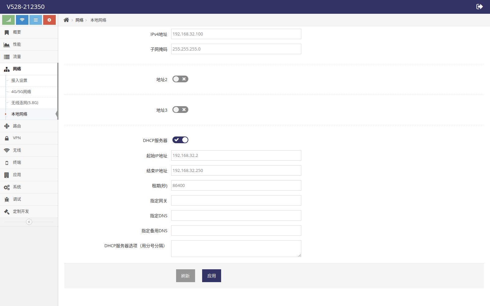

- 本条操作所在页面界面实录。

**界面判断**

| | 条件 |
|--|------|
| **成功** | 页面与操作符合预期 |
| **失败** | 报错或关键控件无效 |
| **skip** | 无 Web 或无该菜单 |

**环境判断**

| | 条件 |
|--|------|
| **成功** | 菜单存在且允许操作 |
| **失败** | 环境导致无法操作 |
| **skip** | 无菜单 → skip；缺外设 → env |

**命令行判断**

| | 条件 |
|--|------|
| **成功** | HE 可读/可写与界面一致 |
| **失败** | HE 失败非环境 |
| **skip** | 无法 Telnet |

**本条总评**

| 判定类 | 结果（执行时勾选） |
|--------|--------------------|
| 界面 | ☐ pass　☐ fail　☐ skip |
| 环境 | ☐ pass　☐ fail　☐ skip |
| 命令行 | ☐ pass　☐ fail　☐ skip |
| **总评** | 任一类 fail → 本条 fail；已测类均为 pass、其余 skip → 本条 pass；三类皆 skip → env |


**恢复**  
无需恢复。

---
### NET-LAN-02 IPv4 地址/掩码可读

**功能说明**  
LAN IPv4/掩码可读。

**侧栏路径**  
`网络 → 本地网络`
页面 URL：`http://192.168.32.100/index.html#lan?object=ifname@lan`

**需要的环境**（勾选已有项）

- [ ] Web 可打开 `http://192.168.32.100/`
- [ ] 已按 LOGIN-02 登录 Web（或本条自行登录）

**步骤**

#### 1. 界面

1. 查看 IPv4 地址与掩码。

#### 2. 命令行

Telnet 登录后在 eline（`$`）执行，或 ashy：`he '…'`：

```text
ifname@lan.status
```

**截图**


- 本条操作所在页面界面实录。

**界面判断**

| | 条件 |
|--|------|
| **成功** | 页面与操作符合预期 |
| **失败** | 报错或关键控件无效 |
| **skip** | 无 Web 或无该菜单 |

**环境判断**

| | 条件 |
|--|------|
| **成功** | 菜单存在且允许操作 |
| **失败** | 环境导致无法操作 |
| **skip** | 无菜单 → skip；缺外设 → env |

**命令行判断**

| | 条件 |
|--|------|
| **成功** | HE 可读/可写与界面一致 |
| **失败** | HE 失败非环境 |
| **skip** | 无法 Telnet |

**本条总评**

| 判定类 | 结果（执行时勾选） |
|--------|--------------------|
| 界面 | ☐ pass　☐ fail　☐ skip |
| 环境 | ☐ pass　☐ fail　☐ skip |
| 命令行 | ☐ pass　☐ fail　☐ skip |
| **总评** | 任一类 fail → 本条 fail；已测类均为 pass、其余 skip → 本条 pass；三类皆 skip → env |


**恢复**  
无需恢复。

---
### NET-LAN-03 Address2/3 开关查看

**功能说明**  
Address2/3 开关查看。

**侧栏路径**  
`网络 → 本地网络`
页面 URL：`http://192.168.32.100/index.html#lan?object=ifname@lan`

**需要的环境**（勾选已有项）

- [ ] Web 可打开 `http://192.168.32.100/`
- [ ] 已按 LOGIN-02 登录 Web（或本条自行登录）

**步骤**

#### 1. 界面

1. 查看 Address2/3；若改动须恢复。

#### 2. 命令行

Telnet 登录后在 eline（`$`）执行，或 ashy：`he '…'`：

```text
ifname@lan
```

**截图**


- 本条操作所在页面界面实录。

**界面判断**

| | 条件 |
|--|------|
| **成功** | 页面与操作符合预期 |
| **失败** | 报错或关键控件无效 |
| **skip** | 无 Web 或无该菜单 |

**环境判断**

| | 条件 |
|--|------|
| **成功** | 菜单存在且允许操作 |
| **失败** | 环境导致无法操作 |
| **skip** | 无菜单 → skip；缺外设 → env |

**命令行判断**

| | 条件 |
|--|------|
| **成功** | HE 可读/可写与界面一致 |
| **失败** | HE 失败非环境 |
| **skip** | 无法 Telnet |

**本条总评**

| 判定类 | 结果（执行时勾选） |
|--------|--------------------|
| 界面 | ☐ pass　☐ fail　☐ skip |
| 环境 | ☐ pass　☐ fail　☐ skip |
| 命令行 | ☐ pass　☐ fail　☐ skip |
| **总评** | 任一类 fail → 本条 fail；已测类均为 pass、其余 skip → 本条 pass；三类皆 skip → env |


**恢复**  
恢复原开关/地址。

---
### NET-LAN-04 DHCP Server 开关

**功能说明**  
DHCP Server 开关恢复。

**侧栏路径**  
`网络 → 本地网络`
页面 URL：`http://192.168.32.100/index.html#lan?object=ifname@lan`

**需要的环境**（勾选已有项）

- [ ] Web 可打开 `http://192.168.32.100/`
- [ ] 已按 LOGIN-02 登录 Web（或本条自行登录）

**步骤**

#### 1. 界面

1. 切换 DHCP Server，Apply，恢复。

#### 2. 命令行

Telnet 登录后在 eline（`$`）执行，或 ashy：`he '…'`：

```text
ifname@lan
```

**截图**


- 本条操作所在页面界面实录。

**界面判断**

| | 条件 |
|--|------|
| **成功** | 页面与操作符合预期 |
| **失败** | 报错或关键控件无效 |
| **skip** | 无 Web 或无该菜单 |

**环境判断**

| | 条件 |
|--|------|
| **成功** | 菜单存在且允许操作 |
| **失败** | 环境导致无法操作 |
| **skip** | 无菜单 → skip；缺外设 → env |

**命令行判断**

| | 条件 |
|--|------|
| **成功** | HE 可读/可写与界面一致 |
| **失败** | HE 失败非环境 |
| **skip** | 无法 Telnet |

**本条总评**

| 判定类 | 结果（执行时勾选） |
|--------|--------------------|
| 界面 | ☐ pass　☐ fail　☐ skip |
| 环境 | ☐ pass　☐ fail　☐ skip |
| 命令行 | ☐ pass　☐ fail　☐ skip |
| **总评** | 任一类 fail → 本条 fail；已测类均为 pass、其余 skip → 本条 pass；三类皆 skip → env |


**恢复**  
恢复原 DHCP 开关。

---
### NET-LAN-05 DHCP 地址池查看轻改恢复

**功能说明**  
地址池轻改恢复。

**侧栏路径**  
`网络 → 本地网络`
页面 URL：`http://192.168.32.100/index.html#lan?object=ifname@lan`

**需要的环境**（勾选已有项）

- [ ] Web 可打开 `http://192.168.32.100/`
- [ ] 已按 LOGIN-02 登录 Web（或本条自行登录）

**步骤**

#### 1. 界面

1. 记录地址池，轻改 Apply，改回。

#### 2. 命令行

Telnet 登录后在 eline（`$`）执行，或 ashy：`he '…'`：

```text
ifname@lan
```

**截图**


- 本条操作所在页面界面实录。

**界面判断**

| | 条件 |
|--|------|
| **成功** | 页面与操作符合预期 |
| **失败** | 报错或关键控件无效 |
| **skip** | 无 Web 或无该菜单 |

**环境判断**

| | 条件 |
|--|------|
| **成功** | 菜单存在且允许操作 |
| **失败** | 环境导致无法操作 |
| **skip** | 无菜单 → skip；缺外设 → env |

**命令行判断**

| | 条件 |
|--|------|
| **成功** | HE 可读/可写与界面一致 |
| **失败** | HE 失败非环境 |
| **skip** | 无法 Telnet |

**本条总评**

| 判定类 | 结果（执行时勾选） |
|--------|--------------------|
| 界面 | ☐ pass　☐ fail　☐ skip |
| 环境 | ☐ pass　☐ fail　☐ skip |
| 命令行 | ☐ pass　☐ fail　☐ skip |
| **总评** | 任一类 fail → 本条 fail；已测类均为 pass、其余 skip → 本条 pass；三类皆 skip → env |


**恢复**  
恢复原池。

---
### NET-LAN-06 Lease / 下发网关 DNS 查看

**功能说明**  
租期/下发网关 DNS 查看。

**侧栏路径**  
`网络 → 本地网络`
页面 URL：`http://192.168.32.100/index.html#lan?object=ifname@lan`

**需要的环境**（勾选已有项）

- [ ] Web 可打开 `http://192.168.32.100/`
- [ ] 已按 LOGIN-02 登录 Web（或本条自行登录）

**步骤**

#### 1. 界面

1. 查看 Lease/网关/DNS 下发项。

#### 2. 命令行

Telnet 登录后在 eline（`$`）执行，或 ashy：`he '…'`：

```text
ifname@lan
```

**截图**


- 本条操作所在页面界面实录。

**界面判断**

| | 条件 |
|--|------|
| **成功** | 页面与操作符合预期 |
| **失败** | 报错或关键控件无效 |
| **skip** | 无 Web 或无该菜单 |

**环境判断**

| | 条件 |
|--|------|
| **成功** | 菜单存在且允许操作 |
| **失败** | 环境导致无法操作 |
| **skip** | 无菜单 → skip；缺外设 → env |

**命令行判断**

| | 条件 |
|--|------|
| **成功** | HE 可读/可写与界面一致 |
| **失败** | HE 失败非环境 |
| **skip** | 无法 Telnet |

**本条总评**

| 判定类 | 结果（执行时勾选） |
|--------|--------------------|
| 界面 | ☐ pass　☐ fail　☐ skip |
| 环境 | ☐ pass　☐ fail　☐ skip |
| 命令行 | ☐ pass　☐ fail　☐ skip |
| **总评** | 任一类 fail → 本条 fail；已测类均为 pass、其余 skip → 本条 pass；三类皆 skip → env |


**恢复**  
无需恢复。

---
### NET-LAN-07 IPv6 Mode 查看

**功能说明**  
IPv6 Mode 查看。

**侧栏路径**  
`网络 → 本地网络`
页面 URL：`http://192.168.32.100/index.html#lan?object=ifname@lan`

**需要的环境**（勾选已有项）

- [ ] Web 可打开 `http://192.168.32.100/`
- [ ] 已按 LOGIN-02 登录 Web（或本条自行登录）

**步骤**

#### 1. 界面

1. 查看 IPv6 Mode。

#### 2. 命令行

Telnet 登录后在 eline（`$`）执行，或 ashy：`he '…'`：

```text
ifname@lan
```

**截图**


- 本条操作所在页面界面实录。

**界面判断**

| | 条件 |
|--|------|
| **成功** | 页面与操作符合预期 |
| **失败** | 报错或关键控件无效 |
| **skip** | 无 Web 或无该菜单 |

**环境判断**

| | 条件 |
|--|------|
| **成功** | 菜单存在且允许操作 |
| **失败** | 环境导致无法操作 |
| **skip** | 无菜单 → skip；缺外设 → env |

**命令行判断**

| | 条件 |
|--|------|
| **成功** | HE 可读/可写与界面一致 |
| **失败** | HE 失败非环境 |
| **skip** | 无法 Telnet |

**本条总评**

| 判定类 | 结果（执行时勾选） |
|--------|--------------------|
| 界面 | ☐ pass　☐ fail　☐ skip |
| 环境 | ☐ pass　☐ fail　☐ skip |
| 命令行 | ☐ pass　☐ fail　☐ skip |
| **总评** | 任一类 fail → 本条 fail；已测类均为 pass、其余 skip → 本条 pass；三类皆 skip → env |


**恢复**  
无需恢复。

---
### NET-LAN-08 DHCPv6 相关字段查看

**功能说明**  
DHCPv6 字段查看（若开）。

**侧栏路径**  
`网络 → 本地网络`
页面 URL：`http://192.168.32.100/index.html#lan?object=ifname@lan`

**需要的环境**（勾选已有项）

- [ ] Web 可打开 `http://192.168.32.100/`
- [ ] 已按 LOGIN-02 登录 Web（或本条自行登录）

**步骤**

#### 1. 界面

1. 若启用 IPv6/DHCPv6 则查看字段。

#### 2. 命令行

Telnet 登录后在 eline（`$`）执行，或 ashy：`he '…'`：

```text
ifname@lan
```

**截图**


- 本条操作所在页面界面实录。

**界面判断**

| | 条件 |
|--|------|
| **成功** | 页面与操作符合预期 |
| **失败** | 报错或关键控件无效 |
| **skip** | 无 Web 或无该菜单 |

**环境判断**

| | 条件 |
|--|------|
| **成功** | 菜单存在且允许操作 |
| **失败** | 环境导致无法操作 |
| **skip** | 无菜单 → skip；缺外设 → env |

**命令行判断**

| | 条件 |
|--|------|
| **成功** | HE 可读/可写与界面一致 |
| **失败** | HE 失败非环境 |
| **skip** | 无法 Telnet |

**本条总评**

| 判定类 | 结果（执行时勾选） |
|--------|--------------------|
| 界面 | ☐ pass　☐ fail　☐ skip |
| 环境 | ☐ pass　☐ fail　☐ skip |
| 命令行 | ☐ pass　☐ fail　☐ skip |
| **总评** | 任一类 fail → 本条 fail；已测类均为 pass、其余 skip → 本条 pass；三类皆 skip → env |


**恢复**  
无需恢复。

---
### NET-WAN-01 进入 WAN

**功能说明**  
本机侧栏无独立 WAN。

**侧栏路径**  
`网络 →（无 WAN）`

**需要的环境**（勾选已有项）

- [ ] Web 可打开 `http://192.168.32.100/`
- [ ] 已按 LOGIN-02 登录 Web（或本条自行登录）

**步骤**

#### 1. 界面

1. 确认无独立 WAN 菜单则 skip。

#### 2. 命令行

Telnet 登录后在 eline（`$`）执行，或 ashy：`he '…'`：

```text
land@machine.status
```

**截图**


- 本机固件侧栏无本条菜单：界面判定记 **skip**（不算产品失败）。下图为同产品相关页面实录，供对照。

**界面判断**

| | 条件 |
|--|------|
| **成功** | 页面与操作符合预期 |
| **失败** | 报错或关键控件无效 |
| **skip** | 无 Web 或无该菜单 |

**环境判断**

| | 条件 |
|--|------|
| **成功** | 菜单存在且允许操作 |
| **失败** | 环境导致无法操作 |
| **skip** | 无菜单 → skip；缺外设 → env |

**命令行判断**

| | 条件 |
|--|------|
| **成功** | HE 可读/可写与界面一致 |
| **失败** | HE 失败非环境 |
| **skip** | 无法 Telnet |

**本条总评**

| 判定类 | 结果（执行时勾选） |
|--------|--------------------|
| 界面 | ☐ pass　☐ fail　☐ skip |
| 环境 | ☐ pass　☐ fail　☐ skip |
| 命令行 | ☐ pass　☐ fail　☐ skip |
| **总评** | 任一类 fail → 本条 fail；已测类均为 pass、其余 skip → 本条 pass；三类皆 skip → env |


**恢复**  
无需恢复。

---
### NET-WAN-02 WAN 模式查看

**功能说明**  
无 WAN skip。

**侧栏路径**  
`网络 →（无）`

**需要的环境**（勾选已有项）

- [ ] Web 可打开 `http://192.168.32.100/`
- [ ] 已按 LOGIN-02 登录 Web（或本条自行登录）

**步骤**

#### 1. 界面

1. 打开侧栏，确认本机是否存在本条所述菜单。
2. 若菜单不存在：本条界面判定记 **skip**（不算产品失败），并保留下方对照截图。
3. 若菜单存在：按功能说明完成查看或配置操作。

#### 2. 命令行

Telnet 登录后在 eline（`$`）执行，或 ashy：`he '…'`：

```text
land@machine.status
```

**截图**


- 本机固件侧栏无本条菜单：界面判定记 **skip**（不算产品失败）。下图为同产品相关页面实录，供对照。

**界面判断**

| | 条件 |
|--|------|
| **成功** | 页面与操作符合预期 |
| **失败** | 报错或关键控件无效 |
| **skip** | 无 Web 或无该菜单 |

**环境判断**

| | 条件 |
|--|------|
| **成功** | 菜单存在且允许操作 |
| **失败** | 环境导致无法操作 |
| **skip** | 无菜单 → skip；缺外设 → env |

**命令行判断**

| | 条件 |
|--|------|
| **成功** | HE 可读/可写与界面一致 |
| **失败** | HE 失败非环境 |
| **skip** | 无法 Telnet |

**本条总评**

| 判定类 | 结果（执行时勾选） |
|--------|--------------------|
| 界面 | ☐ pass　☐ fail　☐ skip |
| 环境 | ☐ pass　☐ fail　☐ skip |
| 命令行 | ☐ pass　☐ fail　☐ skip |
| **总评** | 任一类 fail → 本条 fail；已测类均为 pass、其余 skip → 本条 pass；三类皆 skip → env |


**恢复**  
无需恢复。

---
### NET-WAN-03 WAN DHCP/Static/PPPoE 代表恢复

**功能说明**  
无 WAN skip。

**侧栏路径**  
`网络 →（无）`

**需要的环境**（勾选已有项）

- [ ] Web 可打开 `http://192.168.32.100/`
- [ ] 已按 LOGIN-02 登录 Web（或本条自行登录）

**步骤**

#### 1. 界面

1. 打开侧栏，确认本机是否存在本条所述菜单。
2. 若菜单不存在：本条界面判定记 **skip**（不算产品失败），并保留下方对照截图。
3. 若菜单存在：按功能说明完成查看或配置操作。

#### 2. 命令行

Telnet 登录后在 eline（`$`）执行，或 ashy：`he '…'`：

```text
land@machine.status
```

**截图**


- 本机固件侧栏无本条菜单：界面判定记 **skip**（不算产品失败）。下图为同产品相关页面实录，供对照。

**界面判断**

| | 条件 |
|--|------|
| **成功** | 页面与操作符合预期 |
| **失败** | 报错或关键控件无效 |
| **skip** | 无 Web 或无该菜单 |

**环境判断**

| | 条件 |
|--|------|
| **成功** | 菜单存在且允许操作 |
| **失败** | 环境导致无法操作 |
| **skip** | 无菜单 → skip；缺外设 → env |

**命令行判断**

| | 条件 |
|--|------|
| **成功** | HE 可读/可写与界面一致 |
| **失败** | HE 失败非环境 |
| **skip** | 无法 Telnet |

**本条总评**

| 判定类 | 结果（执行时勾选） |
|--------|--------------------|
| 界面 | ☐ pass　☐ fail　☐ skip |
| 环境 | ☐ pass　☐ fail　☐ skip |
| 命令行 | ☐ pass　☐ fail　☐ skip |
| **总评** | 任一类 fail → 本条 fail；已测类均为 pass、其余 skip → 本条 pass；三类皆 skip → env |


**恢复**  
无需恢复。

---
### NET-WAN-04 WAN NAT/可用性查看

**功能说明**  
无 WAN skip。

**侧栏路径**  
`网络 →（无）`

**需要的环境**（勾选已有项）

- [ ] Web 可打开 `http://192.168.32.100/`
- [ ] 已按 LOGIN-02 登录 Web（或本条自行登录）

**步骤**

#### 1. 界面

1. 打开侧栏，确认本机是否存在本条所述菜单。
2. 若菜单不存在：本条界面判定记 **skip**（不算产品失败），并保留下方对照截图。
3. 若菜单存在：按功能说明完成查看或配置操作。

#### 2. 命令行

Telnet 登录后在 eline（`$`）执行，或 ashy：`he '…'`：

```text
land@machine.status
```

**截图**


- 本机固件侧栏无本条菜单：界面判定记 **skip**（不算产品失败）。下图为同产品相关页面实录，供对照。

**界面判断**

| | 条件 |
|--|------|
| **成功** | 页面与操作符合预期 |
| **失败** | 报错或关键控件无效 |
| **skip** | 无 Web 或无该菜单 |

**环境判断**

| | 条件 |
|--|------|
| **成功** | 菜单存在且允许操作 |
| **失败** | 环境导致无法操作 |
| **skip** | 无菜单 → skip；缺外设 → env |

**命令行判断**

| | 条件 |
|--|------|
| **成功** | HE 可读/可写与界面一致 |
| **失败** | HE 失败非环境 |
| **skip** | 无法 Telnet |

**本条总评**

| 判定类 | 结果（执行时勾选） |
|--------|--------------------|
| 界面 | ☐ pass　☐ fail　☐ skip |
| 环境 | ☐ pass　☐ fail　☐ skip |
| 命令行 | ☐ pass　☐ fail　☐ skip |
| **总评** | 任一类 fail → 本条 fail；已测类均为 pass、其余 skip → 本条 pass；三类皆 skip → env |


**恢复**  
无需恢复。

---
## 6 路由 Route

### ROUTE-HOSTS-01 Hosts 进入

**功能说明**  
进入 Hosts 映射。

**侧栏路径**  
`路由 → Hosts映射`
页面 URL：`http://192.168.32.100/index.html#hosts`

**需要的环境**（勾选已有项）

- [ ] Web 可打开 `http://192.168.32.100/`
- [ ] 已按 LOGIN-02 登录 Web（或本条自行登录）

**步骤**

#### 1. 界面

1. 打开 `路由 → Hosts映射`。
2. 进入 Hosts 映射。
3. 按本条目标操作。

#### 2. 命令行

Telnet 登录后在 eline（`$`）执行，或 ashy：`he '…'`：

```text
hosts 或等价对象
land@machine.status
```

**截图**

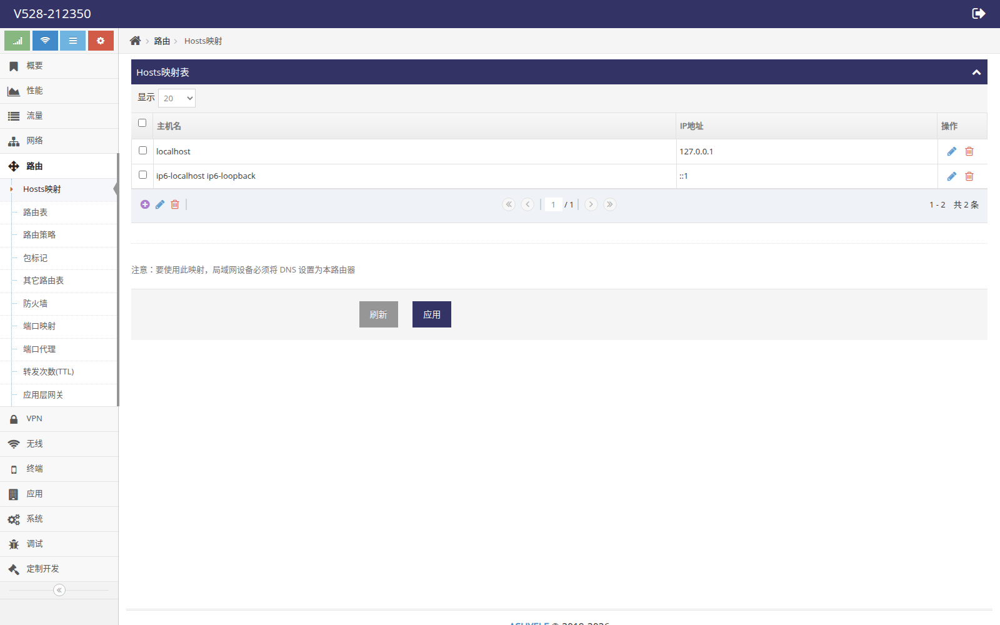

- 本条操作所在页面界面实录。

**界面判断**

| | 条件 |
|--|------|
| **成功** | 页面与操作符合预期 |
| **失败** | 报错或关键控件无效 |
| **skip** | 无 Web 或无该菜单 |

**环境判断**

| | 条件 |
|--|------|
| **成功** | 菜单存在且允许操作 |
| **失败** | 环境导致无法操作 |
| **skip** | 无菜单 → skip；缺外设 → env |

**命令行判断**

| | 条件 |
|--|------|
| **成功** | HE 可读/可写与界面一致 |
| **失败** | HE 失败非环境 |
| **skip** | 无法 Telnet |

**本条总评**

| 判定类 | 结果（执行时勾选） |
|--------|--------------------|
| 界面 | ☐ pass　☐ fail　☐ skip |
| 环境 | ☐ pass　☐ fail　☐ skip |
| 命令行 | ☐ pass　☐ fail　☐ skip |
| **总评** | 任一类 fail → 本条 fail；已测类均为 pass、其余 skip → 本条 pass；三类皆 skip → env |


**恢复**  
land@machine.status

---
### ROUTE-HOSTS-02 新增主机名映射后删除

**功能说明**  
新增一条 hosts 映射后删除。

**侧栏路径**  
`路由 → Hosts映射`
页面 URL：`http://192.168.32.100/index.html#hosts`

**需要的环境**（勾选已有项）

- [ ] Web 可打开 `http://192.168.32.100/`
- [ ] 已按 LOGIN-02 登录 Web（或本条自行登录）

**步骤**

#### 1. 界面

1. 打开 `路由 → Hosts映射`。
2. 新增一条 hosts 映射后删除。
3. 按本条目标操作。

#### 2. 命令行

Telnet 登录后在 eline（`$`）执行，或 ashy：`he '…'`：

```text
hosts
land@machine.status
```

**截图**


- 本条操作所在页面界面实录。

**界面判断**

| | 条件 |
|--|------|
| **成功** | 页面与操作符合预期 |
| **失败** | 报错或关键控件无效 |
| **skip** | 无 Web 或无该菜单 |

**环境判断**

| | 条件 |
|--|------|
| **成功** | 菜单存在且允许操作 |
| **失败** | 环境导致无法操作 |
| **skip** | 无菜单 → skip；缺外设 → env |

**命令行判断**

| | 条件 |
|--|------|
| **成功** | HE 可读/可写与界面一致 |
| **失败** | HE 失败非环境 |
| **skip** | 无法 Telnet |

**本条总评**

| 判定类 | 结果（执行时勾选） |
|--------|--------------------|
| 界面 | ☐ pass　☐ fail　☐ skip |
| 环境 | ☐ pass　☐ fail　☐ skip |
| 命令行 | ☐ pass　☐ fail　☐ skip |
| **总评** | 任一类 fail → 本条 fail；已测类均为 pass、其余 skip → 本条 pass；三类皆 skip → env |


**恢复**  
确保测试项已删

---
### ROUTE-MAIN-01 路由表进入

**功能说明**  
进入主路由表。

**侧栏路径**  
`路由 → 路由表`

**需要的环境**（勾选已有项）

- [ ] Web 可打开 `http://192.168.32.100/`
- [ ] 已按 LOGIN-02 登录 Web（或本条自行登录）

**步骤**

#### 1. 界面

1. 打开 `路由 → 路由表`。
2. 进入主路由表。
3. 按本条目标操作。

#### 2. 命令行

Telnet 登录后在 eline（`$`）执行，或 ashy：`he '…'`：

```text
forward@main 或 ip route 旁证
land@machine.status
```

**截图**

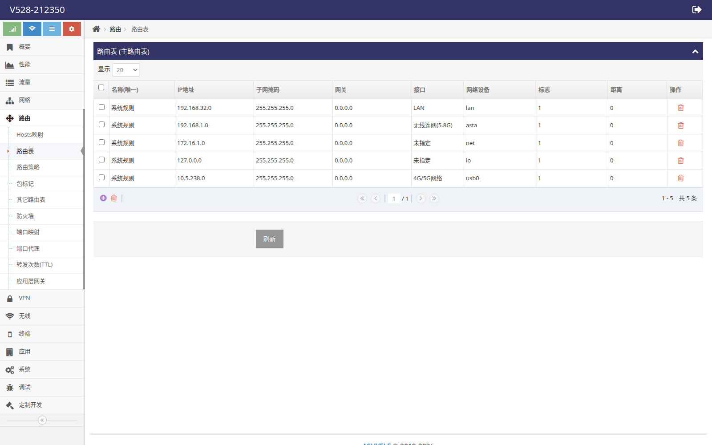

- 本条操作所在页面界面实录。

**界面判断**

| | 条件 |
|--|------|
| **成功** | 页面与操作符合预期 |
| **失败** | 报错或关键控件无效 |
| **skip** | 无 Web 或无该菜单 |

**环境判断**

| | 条件 |
|--|------|
| **成功** | 菜单存在且允许操作 |
| **失败** | 环境导致无法操作 |
| **skip** | 无菜单 → skip；缺外设 → env |

**命令行判断**

| | 条件 |
|--|------|
| **成功** | HE 可读/可写与界面一致 |
| **失败** | HE 失败非环境 |
| **skip** | 无法 Telnet |

**本条总评**

| 判定类 | 结果（执行时勾选） |
|--------|--------------------|
| 界面 | ☐ pass　☐ fail　☐ skip |
| 环境 | ☐ pass　☐ fail　☐ skip |
| 命令行 | ☐ pass　☐ fail　☐ skip |
| **总评** | 任一类 fail → 本条 fail；已测类均为 pass、其余 skip → 本条 pass；三类皆 skip → env |


**恢复**  
land@machine.status

---
### ROUTE-MAIN-02 默认路由/接口列可读

**功能说明**  
查看默认路由与接口列。

**侧栏路径**  
`路由 → 路由表`
页面 URL：`http://192.168.32.100/index.html`

**需要的环境**（勾选已有项）

- [ ] Web 可打开 `http://192.168.32.100/`
- [ ] 已按 LOGIN-02 登录 Web（或本条自行登录）

**步骤**

#### 1. 界面

1. 打开 `路由 → 路由表`。
2. 查看默认路由与接口列。
3. 按本条目标操作。

#### 2. 命令行

Telnet 登录后在 eline（`$`）执行，或 ashy：`he '…'`：

```text
land@machine.status
ifname@lte.status
```

**截图**


- 本条操作所在页面界面实录。

**界面判断**

| | 条件 |
|--|------|
| **成功** | 页面与操作符合预期 |
| **失败** | 报错或关键控件无效 |
| **skip** | 无 Web 或无该菜单 |

**环境判断**

| | 条件 |
|--|------|
| **成功** | 菜单存在且允许操作 |
| **失败** | 环境导致无法操作 |
| **skip** | 无菜单 → skip；缺外设 → env |

**命令行判断**

| | 条件 |
|--|------|
| **成功** | HE 可读/可写与界面一致 |
| **失败** | HE 失败非环境 |
| **skip** | 无法 Telnet |

**本条总评**

| 判定类 | 结果（执行时勾选） |
|--------|--------------------|
| 界面 | ☐ pass　☐ fail　☐ skip |
| 环境 | ☐ pass　☐ fail　☐ skip |
| 命令行 | ☐ pass　☐ fail　☐ skip |
| **总评** | 任一类 fail → 本条 fail；已测类均为 pass、其余 skip → 本条 pass；三类皆 skip → env |


**恢复**  
无需恢复

---
### ROUTE-MAIN-03 改 Connection 后主表默认路由变化

**功能说明**  
对照接入策略变更前后默认路由（只读对照，改动须恢复）。

**侧栏路径**  
`路由 → 路由表`
页面 URL：`http://192.168.32.100/index.html`

**需要的环境**（勾选已有项）

- [ ] Web 可打开 `http://192.168.32.100/`
- [ ] 已按 LOGIN-02 登录 Web（或本条自行登录）

**步骤**

#### 1. 界面

1. 打开 `路由 → 路由表`。
2. 对照接入策略变更前后默认路由（只读对照，改动须恢复）。
3. 按本条目标操作。

#### 2. 命令行

Telnet 登录后在 eline（`$`）执行，或 ashy：`he '…'`：

```text
land@machine.status
land@machine.status
```

**截图**


- 本条操作所在页面界面实录。

**界面判断**

| | 条件 |
|--|------|
| **成功** | 页面与操作符合预期 |
| **失败** | 报错或关键控件无效 |
| **skip** | 无 Web 或无该菜单 |

**环境判断**

| | 条件 |
|--|------|
| **成功** | 菜单存在且允许操作 |
| **失败** | 环境导致无法操作 |
| **skip** | 无菜单 → skip；缺外设 → env |

**命令行判断**

| | 条件 |
|--|------|
| **成功** | HE 可读/可写与界面一致 |
| **失败** | HE 失败非环境 |
| **skip** | 无法 Telnet |

**本条总评**

| 判定类 | 结果（执行时勾选） |
|--------|--------------------|
| 界面 | ☐ pass　☐ fail　☐ skip |
| 环境 | ☐ pass　☐ fail　☐ skip |
| 命令行 | ☐ pass　☐ fail　☐ skip |
| **总评** | 任一类 fail → 本条 fail；已测类均为 pass、其余 skip → 本条 pass；三类皆 skip → env |


**恢复**  
恢复接入策略

---
### ROUTE-CUSTOM-01 其它路由表进入

**功能说明**  
进入其它路由表。

**侧栏路径**  
`路由 → 其它路由表`
页面 URL：`http://192.168.32.100/index.html`

**需要的环境**（勾选已有项）

- [ ] Web 可打开 `http://192.168.32.100/`
- [ ] 已按 LOGIN-02 登录 Web（或本条自行登录）

**步骤**

#### 1. 界面

1. 打开 `路由 → 其它路由表`。
2. 进入其它路由表。
3. 按本条目标操作。

#### 2. 命令行

Telnet 登录后在 eline（`$`）执行，或 ashy：`he '…'`：

```text
land@machine.status
land@machine.status
```

**截图**

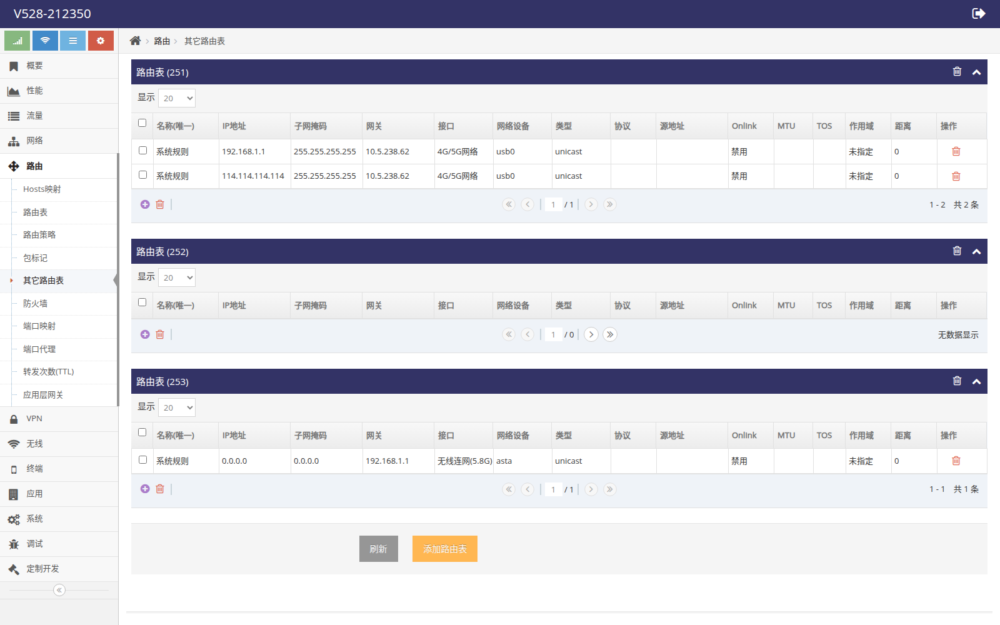

- 本条操作所在页面界面实录。

**界面判断**

| | 条件 |
|--|------|
| **成功** | 页面与操作符合预期 |
| **失败** | 报错或关键控件无效 |
| **skip** | 无 Web 或无该菜单 |

**环境判断**

| | 条件 |
|--|------|
| **成功** | 菜单存在且允许操作 |
| **失败** | 环境导致无法操作 |
| **skip** | 无菜单 → skip；缺外设 → env |

**命令行判断**

| | 条件 |
|--|------|
| **成功** | HE 可读/可写与界面一致 |
| **失败** | HE 失败非环境 |
| **skip** | 无法 Telnet |

**本条总评**

| 判定类 | 结果（执行时勾选） |
|--------|--------------------|
| 界面 | ☐ pass　☐ fail　☐ skip |
| 环境 | ☐ pass　☐ fail　☐ skip |
| 命令行 | ☐ pass　☐ fail　☐ skip |
| **总评** | 任一类 fail → 本条 fail；已测类均为 pass、其余 skip → 本条 pass；三类皆 skip → env |


**恢复**  
无需恢复

---
### ROUTE-CUSTOM-02 新建表后删除

**功能说明**  
新建自定义表后删除。

**侧栏路径**  
`路由 → 其它路由表`
页面 URL：`http://192.168.32.100/index.html`

**需要的环境**（勾选已有项）

- [ ] Web 可打开 `http://192.168.32.100/`
- [ ] 已按 LOGIN-02 登录 Web（或本条自行登录）

**步骤**

#### 1. 界面

1. 打开 `路由 → 其它路由表`。
2. 新建自定义表后删除。
3. 按本条目标操作。

#### 2. 命令行

Telnet 登录后在 eline（`$`）执行，或 ashy：`he '…'`：

```text
land@machine.status
land@machine.status
```

**截图**


- 本条操作所在页面界面实录。

**界面判断**

| | 条件 |
|--|------|
| **成功** | 页面与操作符合预期 |
| **失败** | 报错或关键控件无效 |
| **skip** | 无 Web 或无该菜单 |

**环境判断**

| | 条件 |
|--|------|
| **成功** | 菜单存在且允许操作 |
| **失败** | 环境导致无法操作 |
| **skip** | 无菜单 → skip；缺外设 → env |

**命令行判断**

| | 条件 |
|--|------|
| **成功** | HE 可读/可写与界面一致 |
| **失败** | HE 失败非环境 |
| **skip** | 无法 Telnet |

**本条总评**

| 判定类 | 结果（执行时勾选） |
|--------|--------------------|
| 界面 | ☐ pass　☐ fail　☐ skip |
| 环境 | ☐ pass　☐ fail　☐ skip |
| 命令行 | ☐ pass　☐ fail　☐ skip |
| **总评** | 任一类 fail → 本条 fail；已测类均为 pass、其余 skip → 本条 pass；三类皆 skip → env |


**恢复**  
确保测试表已删

---
### ROUTE-CUSTOM-03 表内加一条路由后删除

**功能说明**  
在测试表加路由后删。

**侧栏路径**  
`路由 → 其它路由表`
页面 URL：`http://192.168.32.100/index.html`

**需要的环境**（勾选已有项）

- [ ] Web 可打开 `http://192.168.32.100/`
- [ ] 已按 LOGIN-02 登录 Web（或本条自行登录）

**步骤**

#### 1. 界面

1. 打开 `路由 → 其它路由表`。
2. 在测试表加路由后删。
3. 按本条目标操作。

#### 2. 命令行

Telnet 登录后在 eline（`$`）执行，或 ashy：`he '…'`：

```text
land@machine.status
land@machine.status
```

**截图**


- 本条操作所在页面界面实录。

**界面判断**

| | 条件 |
|--|------|
| **成功** | 页面与操作符合预期 |
| **失败** | 报错或关键控件无效 |
| **skip** | 无 Web 或无该菜单 |

**环境判断**

| | 条件 |
|--|------|
| **成功** | 菜单存在且允许操作 |
| **失败** | 环境导致无法操作 |
| **skip** | 无菜单 → skip；缺外设 → env |

**命令行判断**

| | 条件 |
|--|------|
| **成功** | HE 可读/可写与界面一致 |
| **失败** | HE 失败非环境 |
| **skip** | 无法 Telnet |

**本条总评**

| 判定类 | 结果（执行时勾选） |
|--------|--------------------|
| 界面 | ☐ pass　☐ fail　☐ skip |
| 环境 | ☐ pass　☐ fail　☐ skip |
| 命令行 | ☐ pass　☐ fail　☐ skip |
| **总评** | 任一类 fail → 本条 fail；已测类均为 pass、其余 skip → 本条 pass；三类皆 skip → env |


**恢复**  
清理测试路由

---
### ROUTE-RULE-01 路由策略进入

**功能说明**  
进入路由策略。

**侧栏路径**  
`路由 → 路由策略`
页面 URL：`http://192.168.32.100/index.html`

**需要的环境**（勾选已有项）

- [ ] Web 可打开 `http://192.168.32.100/`
- [ ] 已按 LOGIN-02 登录 Web（或本条自行登录）

**步骤**

#### 1. 界面

1. 打开 `路由 → 路由策略`。
2. 进入路由策略。
3. 按本条目标操作。

#### 2. 命令行

Telnet 登录后在 eline（`$`）执行，或 ashy：`he '…'`：

```text
land@machine.status
land@machine.status
```

**截图**

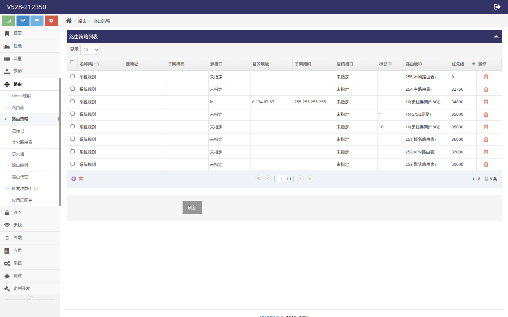

- 本条操作所在页面界面实录。

**界面判断**

| | 条件 |
|--|------|
| **成功** | 页面与操作符合预期 |
| **失败** | 报错或关键控件无效 |
| **skip** | 无 Web 或无该菜单 |

**环境判断**

| | 条件 |
|--|------|
| **成功** | 菜单存在且允许操作 |
| **失败** | 环境导致无法操作 |
| **skip** | 无菜单 → skip；缺外设 → env |

**命令行判断**

| | 条件 |
|--|------|
| **成功** | HE 可读/可写与界面一致 |
| **失败** | HE 失败非环境 |
| **skip** | 无法 Telnet |

**本条总评**

| 判定类 | 结果（执行时勾选） |
|--------|--------------------|
| 界面 | ☐ pass　☐ fail　☐ skip |
| 环境 | ☐ pass　☐ fail　☐ skip |
| 命令行 | ☐ pass　☐ fail　☐ skip |
| **总评** | 任一类 fail → 本条 fail；已测类均为 pass、其余 skip → 本条 pass；三类皆 skip → env |


**恢复**  
无需恢复

---
### ROUTE-RULE-02 新增策略后删除

**功能说明**  
新增策略后删除。

**侧栏路径**  
`路由 → 路由策略`
页面 URL：`http://192.168.32.100/index.html`

**需要的环境**（勾选已有项）

- [ ] Web 可打开 `http://192.168.32.100/`
- [ ] 已按 LOGIN-02 登录 Web（或本条自行登录）

**步骤**

#### 1. 界面

1. 打开 `路由 → 路由策略`。
2. 新增策略后删除。
3. 按本条目标操作。

#### 2. 命令行

Telnet 登录后在 eline（`$`）执行，或 ashy：`he '…'`：

```text
land@machine.status
land@machine.status
```

**截图**


- 本条操作所在页面界面实录。

**界面判断**

| | 条件 |
|--|------|
| **成功** | 页面与操作符合预期 |
| **失败** | 报错或关键控件无效 |
| **skip** | 无 Web 或无该菜单 |

**环境判断**

| | 条件 |
|--|------|
| **成功** | 菜单存在且允许操作 |
| **失败** | 环境导致无法操作 |
| **skip** | 无菜单 → skip；缺外设 → env |

**命令行判断**

| | 条件 |
|--|------|
| **成功** | HE 可读/可写与界面一致 |
| **失败** | HE 失败非环境 |
| **skip** | 无法 Telnet |

**本条总评**

| 判定类 | 结果（执行时勾选） |
|--------|--------------------|
| 界面 | ☐ pass　☐ fail　☐ skip |
| 环境 | ☐ pass　☐ fail　☐ skip |
| 命令行 | ☐ pass　☐ fail　☐ skip |
| **总评** | 任一类 fail → 本条 fail；已测类均为 pass、其余 skip → 本条 pass；三类皆 skip → env |


**恢复**  
清理策略

---
### ROUTE-MARK-01 包标记进入

**功能说明**  
进入包标记。

**侧栏路径**  
`路由 → 包标记`
页面 URL：`http://192.168.32.100/index.html`

**需要的环境**（勾选已有项）

- [ ] Web 可打开 `http://192.168.32.100/`
- [ ] 已按 LOGIN-02 登录 Web（或本条自行登录）

**步骤**

#### 1. 界面

1. 打开 `路由 → 包标记`。
2. 进入包标记。
3. 按本条目标操作。

#### 2. 命令行

Telnet 登录后在 eline（`$`）执行，或 ashy：`he '…'`：

```text
land@machine.status
land@machine.status
```

**截图**

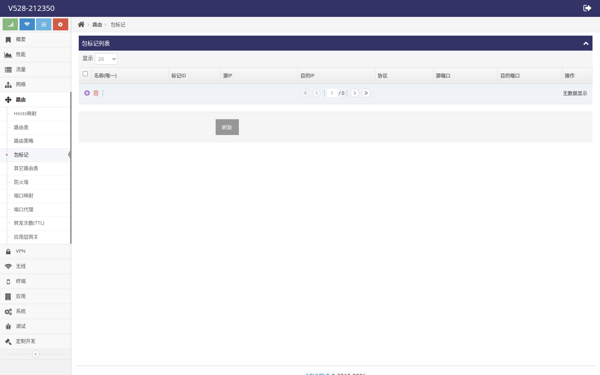

- 本条操作所在页面界面实录。

**界面判断**

| | 条件 |
|--|------|
| **成功** | 页面与操作符合预期 |
| **失败** | 报错或关键控件无效 |
| **skip** | 无 Web 或无该菜单 |

**环境判断**

| | 条件 |
|--|------|
| **成功** | 菜单存在且允许操作 |
| **失败** | 环境导致无法操作 |
| **skip** | 无菜单 → skip；缺外设 → env |

**命令行判断**

| | 条件 |
|--|------|
| **成功** | HE 可读/可写与界面一致 |
| **失败** | HE 失败非环境 |
| **skip** | 无法 Telnet |

**本条总评**

| 判定类 | 结果（执行时勾选） |
|--------|--------------------|
| 界面 | ☐ pass　☐ fail　☐ skip |
| 环境 | ☐ pass　☐ fail　☐ skip |
| 命令行 | ☐ pass　☐ fail　☐ skip |
| **总评** | 任一类 fail → 本条 fail；已测类均为 pass、其余 skip → 本条 pass；三类皆 skip → env |


**恢复**  
无需恢复

---
### ROUTE-MARK-02 新增标记后删除

**功能说明**  
新增标记后删除。

**侧栏路径**  
`路由 → 包标记`
页面 URL：`http://192.168.32.100/index.html`

**需要的环境**（勾选已有项）

- [ ] Web 可打开 `http://192.168.32.100/`
- [ ] 已按 LOGIN-02 登录 Web（或本条自行登录）

**步骤**

#### 1. 界面

1. 打开 `路由 → 包标记`。
2. 新增标记后删除。
3. 按本条目标操作。

#### 2. 命令行

Telnet 登录后在 eline（`$`）执行，或 ashy：`he '…'`：

```text
land@machine.status
land@machine.status
```

**截图**


- 本条操作所在页面界面实录。

**界面判断**

| | 条件 |
|--|------|
| **成功** | 页面与操作符合预期 |
| **失败** | 报错或关键控件无效 |
| **skip** | 无 Web 或无该菜单 |

**环境判断**

| | 条件 |
|--|------|
| **成功** | 菜单存在且允许操作 |
| **失败** | 环境导致无法操作 |
| **skip** | 无菜单 → skip；缺外设 → env |

**命令行判断**

| | 条件 |
|--|------|
| **成功** | HE 可读/可写与界面一致 |
| **失败** | HE 失败非环境 |
| **skip** | 无法 Telnet |

**本条总评**

| 判定类 | 结果（执行时勾选） |
|--------|--------------------|
| 界面 | ☐ pass　☐ fail　☐ skip |
| 环境 | ☐ pass　☐ fail　☐ skip |
| 命令行 | ☐ pass　☐ fail　☐ skip |
| **总评** | 任一类 fail → 本条 fail；已测类均为 pass、其余 skip → 本条 pass；三类皆 skip → env |


**恢复**  
清理标记

---
### ROUTE-FW-01 防火墙进入

**功能说明**  
进入防火墙。

**侧栏路径**  
`路由 → 防火墙`
页面 URL：`http://192.168.32.100/index.html`

**需要的环境**（勾选已有项）

- [ ] Web 可打开 `http://192.168.32.100/`
- [ ] 已按 LOGIN-02 登录 Web（或本条自行登录）

**步骤**

#### 1. 界面

1. 打开 `路由 → 防火墙`。
2. 进入防火墙。
3. 按本条目标操作。

#### 2. 命令行

Telnet 登录后在 eline（`$`）执行，或 ashy：`he '…'`：

```text
land@machine.status
land@machine.status
```

**截图**

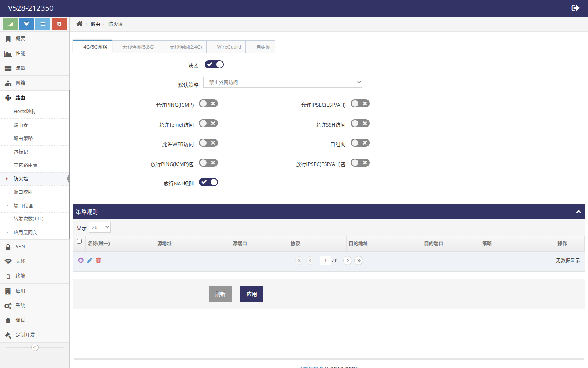

- 本条操作所在页面界面实录。

**界面判断**

| | 条件 |
|--|------|
| **成功** | 页面与操作符合预期 |
| **失败** | 报错或关键控件无效 |
| **skip** | 无 Web 或无该菜单 |

**环境判断**

| | 条件 |
|--|------|
| **成功** | 菜单存在且允许操作 |
| **失败** | 环境导致无法操作 |
| **skip** | 无菜单 → skip；缺外设 → env |

**命令行判断**

| | 条件 |
|--|------|
| **成功** | HE 可读/可写与界面一致 |
| **失败** | HE 失败非环境 |
| **skip** | 无法 Telnet |

**本条总评**

| 判定类 | 结果（执行时勾选） |
|--------|--------------------|
| 界面 | ☐ pass　☐ fail　☐ skip |
| 环境 | ☐ pass　☐ fail　☐ skip |
| 命令行 | ☐ pass　☐ fail　☐ skip |
| **总评** | 任一类 fail → 本条 fail；已测类均为 pass、其余 skip → 本条 pass；三类皆 skip → env |


**恢复**  
无需恢复

---
### ROUTE-FW-02 切换 LAN/LTE 等接口 Tab

**功能说明**  
切换接口 Tab。

**侧栏路径**  
`路由 → 防火墙`
页面 URL：`http://192.168.32.100/index.html`

**需要的环境**（勾选已有项）

- [ ] Web 可打开 `http://192.168.32.100/`
- [ ] 已按 LOGIN-02 登录 Web（或本条自行登录）

**步骤**

#### 1. 界面

1. 打开 `路由 → 防火墙`。
2. 切换接口 Tab。
3. 按本条目标操作。

#### 2. 命令行

Telnet 登录后在 eline（`$`）执行，或 ashy：`he '…'`：

```text
land@machine.status
land@machine.status
```

**截图**


- 本条操作所在页面界面实录。

**界面判断**

| | 条件 |
|--|------|
| **成功** | 页面与操作符合预期 |
| **失败** | 报错或关键控件无效 |
| **skip** | 无 Web 或无该菜单 |

**环境判断**

| | 条件 |
|--|------|
| **成功** | 菜单存在且允许操作 |
| **失败** | 环境导致无法操作 |
| **skip** | 无菜单 → skip；缺外设 → env |

**命令行判断**

| | 条件 |
|--|------|
| **成功** | HE 可读/可写与界面一致 |
| **失败** | HE 失败非环境 |
| **skip** | 无法 Telnet |

**本条总评**

| 判定类 | 结果（执行时勾选） |
|--------|--------------------|
| 界面 | ☐ pass　☐ fail　☐ skip |
| 环境 | ☐ pass　☐ fail　☐ skip |
| 命令行 | ☐ pass　☐ fail　☐ skip |
| **总评** | 任一类 fail → 本条 fail；已测类均为 pass、其余 skip → 本条 pass；三类皆 skip → env |


**恢复**  
无需恢复

---
### ROUTE-FW-03 Status / Default Action 查看

**功能说明**  
查看 Status/Default Action。

**侧栏路径**  
`路由 → 防火墙`
页面 URL：`http://192.168.32.100/index.html`

**需要的环境**（勾选已有项）

- [ ] Web 可打开 `http://192.168.32.100/`
- [ ] 已按 LOGIN-02 登录 Web（或本条自行登录）

**步骤**

#### 1. 界面

1. 打开 `路由 → 防火墙`。
2. 查看 Status/Default Action。
3. 按本条目标操作。

#### 2. 命令行

Telnet 登录后在 eline（`$`）执行，或 ashy：`he '…'`：

```text
land@machine.status
land@machine.status
```

**截图**


- 本条操作所在页面界面实录。

**界面判断**

| | 条件 |
|--|------|
| **成功** | 页面与操作符合预期 |
| **失败** | 报错或关键控件无效 |
| **skip** | 无 Web 或无该菜单 |

**环境判断**

| | 条件 |
|--|------|
| **成功** | 菜单存在且允许操作 |
| **失败** | 环境导致无法操作 |
| **skip** | 无菜单 → skip；缺外设 → env |

**命令行判断**

| | 条件 |
|--|------|
| **成功** | HE 可读/可写与界面一致 |
| **失败** | HE 失败非环境 |
| **skip** | 无法 Telnet |

**本条总评**

| 判定类 | 结果（执行时勾选） |
|--------|--------------------|
| 界面 | ☐ pass　☐ fail　☐ skip |
| 环境 | ☐ pass　☐ fail　☐ skip |
| 命令行 | ☐ pass　☐ fail　☐ skip |
| **总评** | 任一类 fail → 本条 fail；已测类均为 pass、其余 skip → 本条 pass；三类皆 skip → env |


**恢复**  
轻改须恢复

---
### ROUTE-FW-04 ICMP/WEB/SSH/Telnet Access 开关恢复

**功能说明**  
逐项或代表项切换 Access 开关后恢复。

**侧栏路径**  
`路由 → 防火墙`
页面 URL：`http://192.168.32.100/index.html`

**需要的环境**（勾选已有项）

- [ ] Web 可打开 `http://192.168.32.100/`
- [ ] 已按 LOGIN-02 登录 Web（或本条自行登录）

**步骤**

#### 1. 界面

1. 打开 `路由 → 防火墙`。
2. 逐项或代表项切换 Access 开关后恢复。
3. 按本条目标操作。

#### 2. 命令行

Telnet 登录后在 eline（`$`）执行，或 ashy：`he '…'`：

```text
land@machine.status
land@machine.status
```

**截图**


- 本条操作所在页面界面实录。

**界面判断**

| | 条件 |
|--|------|
| **成功** | 页面与操作符合预期 |
| **失败** | 报错或关键控件无效 |
| **skip** | 无 Web 或无该菜单 |

**环境判断**

| | 条件 |
|--|------|
| **成功** | 菜单存在且允许操作 |
| **失败** | 环境导致无法操作 |
| **skip** | 无菜单 → skip；缺外设 → env |

**命令行判断**

| | 条件 |
|--|------|
| **成功** | HE 可读/可写与界面一致 |
| **失败** | HE 失败非环境 |
| **skip** | 无法 Telnet |

**本条总评**

| 判定类 | 结果（执行时勾选） |
|--------|--------------------|
| 界面 | ☐ pass　☐ fail　☐ skip |
| 环境 | ☐ pass　☐ fail　☐ skip |
| 命令行 | ☐ pass　☐ fail　☐ skip |
| **总评** | 任一类 fail → 本条 fail；已测类均为 pass、其余 skip → 本条 pass；三类皆 skip → env |


**恢复**  
全部恢复原值；勿把自己锁死

---
### ROUTE-FW-05 IPSEC/NAT Through 开关恢复

**功能说明**  
切换 Through 类开关后恢复。

**侧栏路径**  
`路由 → 防火墙`
页面 URL：`http://192.168.32.100/index.html`

**需要的环境**（勾选已有项）

- [ ] Web 可打开 `http://192.168.32.100/`
- [ ] 已按 LOGIN-02 登录 Web（或本条自行登录）

**步骤**

#### 1. 界面

1. 打开 `路由 → 防火墙`。
2. 切换 Through 类开关后恢复。
3. 按本条目标操作。

#### 2. 命令行

Telnet 登录后在 eline（`$`）执行，或 ashy：`he '…'`：

```text
land@machine.status
land@machine.status
```

**截图**


- 本条操作所在页面界面实录。

**界面判断**

| | 条件 |
|--|------|
| **成功** | 页面与操作符合预期 |
| **失败** | 报错或关键控件无效 |
| **skip** | 无 Web 或无该菜单 |

**环境判断**

| | 条件 |
|--|------|
| **成功** | 菜单存在且允许操作 |
| **失败** | 环境导致无法操作 |
| **skip** | 无菜单 → skip；缺外设 → env |

**命令行判断**

| | 条件 |
|--|------|
| **成功** | HE 可读/可写与界面一致 |
| **失败** | HE 失败非环境 |
| **skip** | 无法 Telnet |

**本条总评**

| 判定类 | 结果（执行时勾选） |
|--------|--------------------|
| 界面 | ☐ pass　☐ fail　☐ skip |
| 环境 | ☐ pass　☐ fail　☐ skip |
| 命令行 | ☐ pass　☐ fail　☐ skip |
| **总评** | 任一类 fail → 本条 fail；已测类均为 pass、其余 skip → 本条 pass；三类皆 skip → env |


**恢复**  
恢复原值

---
### ROUTE-FW-06 新增一条防火墙规则后删除

**功能说明**  
新增规则后删除。

**侧栏路径**  
`路由 → 防火墙`
页面 URL：`http://192.168.32.100/index.html`

**需要的环境**（勾选已有项）

- [ ] Web 可打开 `http://192.168.32.100/`
- [ ] 已按 LOGIN-02 登录 Web（或本条自行登录）

**步骤**

#### 1. 界面

1. 打开 `路由 → 防火墙`。
2. 新增规则后删除。
3. 按本条目标操作。

#### 2. 命令行

Telnet 登录后在 eline（`$`）执行，或 ashy：`he '…'`：

```text
land@machine.status
land@machine.status
```

**截图**


- 本条操作所在页面界面实录。

**界面判断**

| | 条件 |
|--|------|
| **成功** | 页面与操作符合预期 |
| **失败** | 报错或关键控件无效 |
| **skip** | 无 Web 或无该菜单 |

**环境判断**

| | 条件 |
|--|------|
| **成功** | 菜单存在且允许操作 |
| **失败** | 环境导致无法操作 |
| **skip** | 无菜单 → skip；缺外设 → env |

**命令行判断**

| | 条件 |
|--|------|
| **成功** | HE 可读/可写与界面一致 |
| **失败** | HE 失败非环境 |
| **skip** | 无法 Telnet |

**本条总评**

| 判定类 | 结果（执行时勾选） |
|--------|--------------------|
| 界面 | ☐ pass　☐ fail　☐ skip |
| 环境 | ☐ pass　☐ fail　☐ skip |
| 命令行 | ☐ pass　☐ fail　☐ skip |
| **总评** | 任一类 fail → 本条 fail；已测类均为 pass、其余 skip → 本条 pass；三类皆 skip → env |


**恢复**  
清理规则

---
### ROUTE-NAT-01 端口映射进入

**功能说明**  
进入端口映射。

**侧栏路径**  
`路由 → 端口映射`
页面 URL：`http://192.168.32.100/index.html`

**需要的环境**（勾选已有项）

- [ ] Web 可打开 `http://192.168.32.100/`
- [ ] 已按 LOGIN-02 登录 Web（或本条自行登录）

**步骤**

#### 1. 界面

1. 打开 `路由 → 端口映射`。
2. 进入端口映射。
3. 按本条目标操作。

#### 2. 命令行

Telnet 登录后在 eline（`$`）执行，或 ashy：`he '…'`：

```text
land@machine.status
land@machine.status
```

**截图**

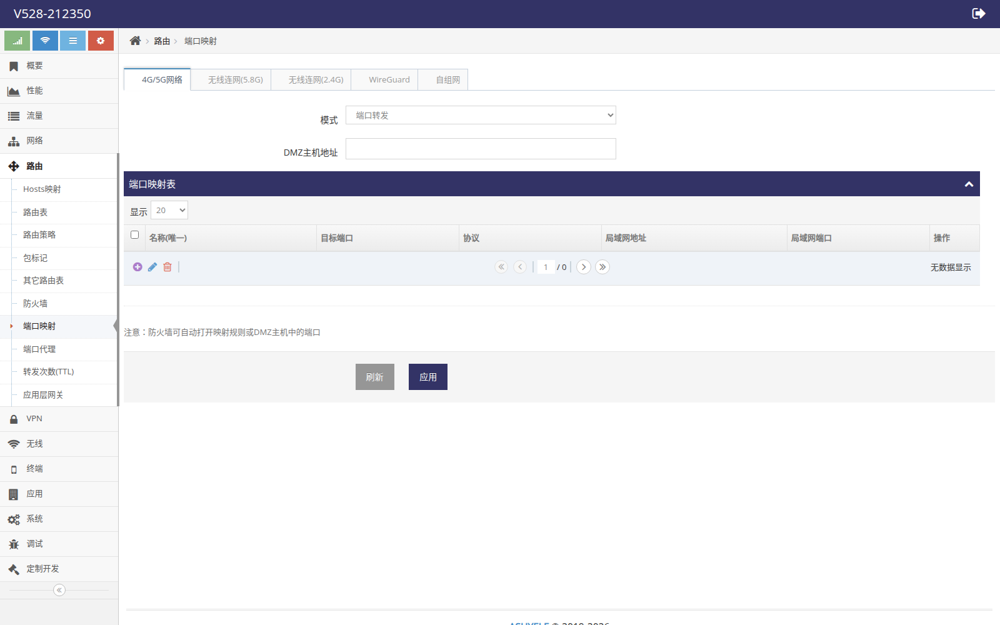

- 本条操作所在页面界面实录。

**界面判断**

| | 条件 |
|--|------|
| **成功** | 页面与操作符合预期 |
| **失败** | 报错或关键控件无效 |
| **skip** | 无 Web 或无该菜单 |

**环境判断**

| | 条件 |
|--|------|
| **成功** | 菜单存在且允许操作 |
| **失败** | 环境导致无法操作 |
| **skip** | 无菜单 → skip；缺外设 → env |

**命令行判断**

| | 条件 |
|--|------|
| **成功** | HE 可读/可写与界面一致 |
| **失败** | HE 失败非环境 |
| **skip** | 无法 Telnet |

**本条总评**

| 判定类 | 结果（执行时勾选） |
|--------|--------------------|
| 界面 | ☐ pass　☐ fail　☐ skip |
| 环境 | ☐ pass　☐ fail　☐ skip |
| 命令行 | ☐ pass　☐ fail　☐ skip |
| **总评** | 任一类 fail → 本条 fail；已测类均为 pass、其余 skip → 本条 pass；三类皆 skip → env |


**恢复**  
无需恢复

---
### ROUTE-NAT-02 切换上行 Tab

**功能说明**  
切换上行 Tab。

**侧栏路径**  
`路由 → 端口映射`
页面 URL：`http://192.168.32.100/index.html`

**需要的环境**（勾选已有项）

- [ ] Web 可打开 `http://192.168.32.100/`
- [ ] 已按 LOGIN-02 登录 Web（或本条自行登录）

**步骤**

#### 1. 界面

1. 打开 `路由 → 端口映射`。
2. 切换上行 Tab。
3. 按本条目标操作。

#### 2. 命令行

Telnet 登录后在 eline（`$`）执行，或 ashy：`he '…'`：

```text
land@machine.status
land@machine.status
```

**截图**


- 本条操作所在页面界面实录。

**界面判断**

| | 条件 |
|--|------|
| **成功** | 页面与操作符合预期 |
| **失败** | 报错或关键控件无效 |
| **skip** | 无 Web 或无该菜单 |

**环境判断**

| | 条件 |
|--|------|
| **成功** | 菜单存在且允许操作 |
| **失败** | 环境导致无法操作 |
| **skip** | 无菜单 → skip；缺外设 → env |

**命令行判断**

| | 条件 |
|--|------|
| **成功** | HE 可读/可写与界面一致 |
| **失败** | HE 失败非环境 |
| **skip** | 无法 Telnet |

**本条总评**

| 判定类 | 结果（执行时勾选） |
|--------|--------------------|
| 界面 | ☐ pass　☐ fail　☐ skip |
| 环境 | ☐ pass　☐ fail　☐ skip |
| 命令行 | ☐ pass　☐ fail　☐ skip |
| **总评** | 任一类 fail → 本条 fail；已测类均为 pass、其余 skip → 本条 pass；三类皆 skip → env |


**恢复**  
无需恢复

---
### ROUTE-NAT-03 新增一条 DNAT 后删除

**功能说明**  
新增 DNAT 后删除。

**侧栏路径**  
`路由 → 端口映射`
页面 URL：`http://192.168.32.100/index.html`

**需要的环境**（勾选已有项）

- [ ] Web 可打开 `http://192.168.32.100/`
- [ ] 已按 LOGIN-02 登录 Web（或本条自行登录）

**步骤**

#### 1. 界面

1. 打开 `路由 → 端口映射`。
2. 新增 DNAT 后删除。
3. 按本条目标操作。

#### 2. 命令行

Telnet 登录后在 eline（`$`）执行，或 ashy：`he '…'`：

```text
land@machine.status
land@machine.status
```

**截图**


- 本条操作所在页面界面实录。

**界面判断**

| | 条件 |
|--|------|
| **成功** | 页面与操作符合预期 |
| **失败** | 报错或关键控件无效 |
| **skip** | 无 Web 或无该菜单 |

**环境判断**

| | 条件 |
|--|------|
| **成功** | 菜单存在且允许操作 |
| **失败** | 环境导致无法操作 |
| **skip** | 无菜单 → skip；缺外设 → env |

**命令行判断**

| | 条件 |
|--|------|
| **成功** | HE 可读/可写与界面一致 |
| **失败** | HE 失败非环境 |
| **skip** | 无法 Telnet |

**本条总评**

| 判定类 | 结果（执行时勾选） |
|--------|--------------------|
| 界面 | ☐ pass　☐ fail　☐ skip |
| 环境 | ☐ pass　☐ fail　☐ skip |
| 命令行 | ☐ pass　☐ fail　☐ skip |
| **总评** | 任一类 fail → 本条 fail；已测类均为 pass、其余 skip → 本条 pass；三类皆 skip → env |


**恢复**  
清理映射

---
### ROUTE-NAT-04 DMZ 字段查看

**功能说明**  
查看 DMZ 字段（不强制开启）。

**侧栏路径**  
`路由 → 端口映射`
页面 URL：`http://192.168.32.100/index.html`

**需要的环境**（勾选已有项）

- [ ] Web 可打开 `http://192.168.32.100/`
- [ ] 已按 LOGIN-02 登录 Web（或本条自行登录）

**步骤**

#### 1. 界面

1. 打开 `路由 → 端口映射`。
2. 查看 DMZ 字段（不强制开启）。
3. 按本条目标操作。

#### 2. 命令行

Telnet 登录后在 eline（`$`）执行，或 ashy：`he '…'`：

```text
land@machine.status
land@machine.status
```

**截图**


- 本条操作所在页面界面实录。

**界面判断**

| | 条件 |
|--|------|
| **成功** | 页面与操作符合预期 |
| **失败** | 报错或关键控件无效 |
| **skip** | 无 Web 或无该菜单 |

**环境判断**

| | 条件 |
|--|------|
| **成功** | 菜单存在且允许操作 |
| **失败** | 环境导致无法操作 |
| **skip** | 无菜单 → skip；缺外设 → env |

**命令行判断**

| | 条件 |
|--|------|
| **成功** | HE 可读/可写与界面一致 |
| **失败** | HE 失败非环境 |
| **skip** | 无法 Telnet |

**本条总评**

| 判定类 | 结果（执行时勾选） |
|--------|--------------------|
| 界面 | ☐ pass　☐ fail　☐ skip |
| 环境 | ☐ pass　☐ fail　☐ skip |
| 命令行 | ☐ pass　☐ fail　☐ skip |
| **总评** | 任一类 fail → 本条 fail；已测类均为 pass、其余 skip → 本条 pass；三类皆 skip → env |


**恢复**  
勿留测试 DMZ

---
### ROUTE-PROXY-01 端口代理进入

**功能说明**  
进入端口代理。

**侧栏路径**  
`路由 → 端口代理`
页面 URL：`http://192.168.32.100/index.html`

**需要的环境**（勾选已有项）

- [ ] Web 可打开 `http://192.168.32.100/`
- [ ] 已按 LOGIN-02 登录 Web（或本条自行登录）

**步骤**

#### 1. 界面

1. 打开 `路由 → 端口代理`。
2. 进入端口代理。
3. 按本条目标操作。

#### 2. 命令行

Telnet 登录后在 eline（`$`）执行，或 ashy：`he '…'`：

```text
land@machine.status
land@machine.status
```

**截图**

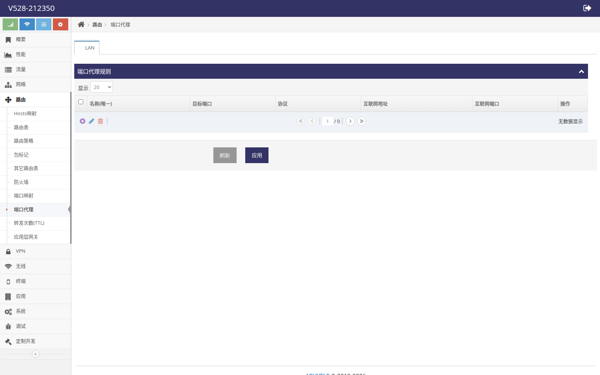

- 本条操作所在页面界面实录。

**界面判断**

| | 条件 |
|--|------|
| **成功** | 页面与操作符合预期 |
| **失败** | 报错或关键控件无效 |
| **skip** | 无 Web 或无该菜单 |

**环境判断**

| | 条件 |
|--|------|
| **成功** | 菜单存在且允许操作 |
| **失败** | 环境导致无法操作 |
| **skip** | 无菜单 → skip；缺外设 → env |

**命令行判断**

| | 条件 |
|--|------|
| **成功** | HE 可读/可写与界面一致 |
| **失败** | HE 失败非环境 |
| **skip** | 无法 Telnet |

**本条总评**

| 判定类 | 结果（执行时勾选） |
|--------|--------------------|
| 界面 | ☐ pass　☐ fail　☐ skip |
| 环境 | ☐ pass　☐ fail　☐ skip |
| 命令行 | ☐ pass　☐ fail　☐ skip |
| **总评** | 任一类 fail → 本条 fail；已测类均为 pass、其余 skip → 本条 pass；三类皆 skip → env |


**恢复**  
无需恢复

---
### ROUTE-PROXY-02 新增一条代理后删除

**功能说明**  
新增代理后删除。

**侧栏路径**  
`路由 → 端口代理`
页面 URL：`http://192.168.32.100/index.html`

**需要的环境**（勾选已有项）

- [ ] Web 可打开 `http://192.168.32.100/`
- [ ] 已按 LOGIN-02 登录 Web（或本条自行登录）

**步骤**

#### 1. 界面

1. 打开 `路由 → 端口代理`。
2. 新增代理后删除。
3. 按本条目标操作。

#### 2. 命令行

Telnet 登录后在 eline（`$`）执行，或 ashy：`he '…'`：

```text
land@machine.status
land@machine.status
```

**截图**


- 本条操作所在页面界面实录。

**界面判断**

| | 条件 |
|--|------|
| **成功** | 页面与操作符合预期 |
| **失败** | 报错或关键控件无效 |
| **skip** | 无 Web 或无该菜单 |

**环境判断**

| | 条件 |
|--|------|
| **成功** | 菜单存在且允许操作 |
| **失败** | 环境导致无法操作 |
| **skip** | 无菜单 → skip；缺外设 → env |

**命令行判断**

| | 条件 |
|--|------|
| **成功** | HE 可读/可写与界面一致 |
| **失败** | HE 失败非环境 |
| **skip** | 无法 Telnet |

**本条总评**

| 判定类 | 结果（执行时勾选） |
|--------|--------------------|
| 界面 | ☐ pass　☐ fail　☐ skip |
| 环境 | ☐ pass　☐ fail　☐ skip |
| 命令行 | ☐ pass　☐ fail　☐ skip |
| **总评** | 任一类 fail → 本条 fail；已测类均为 pass、其余 skip → 本条 pass；三类皆 skip → env |


**恢复**  
清理代理

---
### ROUTE-TTL-01 TTL 进入

**功能说明**  
进入 TTL。

**侧栏路径**  
`路由 → 转发次数(TTL)`
页面 URL：`http://192.168.32.100/index.html`

**需要的环境**（勾选已有项）

- [ ] Web 可打开 `http://192.168.32.100/`
- [ ] 已按 LOGIN-02 登录 Web（或本条自行登录）

**步骤**

#### 1. 界面

1. 打开 `路由 → 转发次数(TTL)`。
2. 进入 TTL。
3. 按本条目标操作。

#### 2. 命令行

Telnet 登录后在 eline（`$`）执行，或 ashy：`he '…'`：

```text
land@machine.status
land@machine.status
```

**截图**

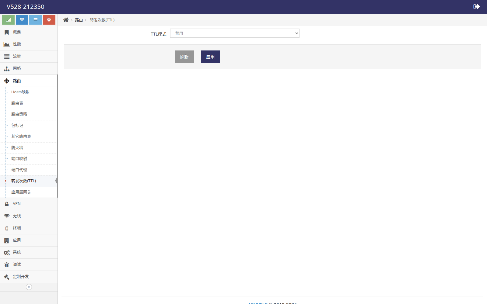

- 本条操作所在页面界面实录。

**界面判断**

| | 条件 |
|--|------|
| **成功** | 页面与操作符合预期 |
| **失败** | 报错或关键控件无效 |
| **skip** | 无 Web 或无该菜单 |

**环境判断**

| | 条件 |
|--|------|
| **成功** | 菜单存在且允许操作 |
| **失败** | 环境导致无法操作 |
| **skip** | 无菜单 → skip；缺外设 → env |

**命令行判断**

| | 条件 |
|--|------|
| **成功** | HE 可读/可写与界面一致 |
| **失败** | HE 失败非环境 |
| **skip** | 无法 Telnet |

**本条总评**

| 判定类 | 结果（执行时勾选） |
|--------|--------------------|
| 界面 | ☐ pass　☐ fail　☐ skip |
| 环境 | ☐ pass　☐ fail　☐ skip |
| 命令行 | ☐ pass　☐ fail　☐ skip |
| **总评** | 任一类 fail → 本条 fail；已测类均为 pass、其余 skip → 本条 pass；三类皆 skip → env |


**恢复**  
无需恢复

---
### ROUTE-TTL-02 TTL Mode 代表值恢复

**功能说明**  
切换 TTL Mode 后恢复。

**侧栏路径**  
`路由 → 转发次数(TTL)`
页面 URL：`http://192.168.32.100/index.html`

**需要的环境**（勾选已有项）

- [ ] Web 可打开 `http://192.168.32.100/`
- [ ] 已按 LOGIN-02 登录 Web（或本条自行登录）

**步骤**

#### 1. 界面

1. 打开 `路由 → 转发次数(TTL)`。
2. 切换 TTL Mode 后恢复。
3. 按本条目标操作。

#### 2. 命令行

Telnet 登录后在 eline（`$`）执行，或 ashy：`he '…'`：

```text
land@machine.status
land@machine.status
```

**截图**


- 本条操作所在页面界面实录。

**界面判断**

| | 条件 |
|--|------|
| **成功** | 页面与操作符合预期 |
| **失败** | 报错或关键控件无效 |
| **skip** | 无 Web 或无该菜单 |

**环境判断**

| | 条件 |
|--|------|
| **成功** | 菜单存在且允许操作 |
| **失败** | 环境导致无法操作 |
| **skip** | 无菜单 → skip；缺外设 → env |

**命令行判断**

| | 条件 |
|--|------|
| **成功** | HE 可读/可写与界面一致 |
| **失败** | HE 失败非环境 |
| **skip** | 无法 Telnet |

**本条总评**

| 判定类 | 结果（执行时勾选） |
|--------|--------------------|
| 界面 | ☐ pass　☐ fail　☐ skip |
| 环境 | ☐ pass　☐ fail　☐ skip |
| 命令行 | ☐ pass　☐ fail　☐ skip |
| **总评** | 任一类 fail → 本条 fail；已测类均为 pass、其余 skip → 本条 pass；三类皆 skip → env |


**恢复**  
恢复原 Mode

---
### ROUTE-ALG-01 ALG 进入

**功能说明**  
进入 ALG。

**侧栏路径**  
`路由 → 应用层网关`
页面 URL：`http://192.168.32.100/index.html`

**需要的环境**（勾选已有项）

- [ ] Web 可打开 `http://192.168.32.100/`
- [ ] 已按 LOGIN-02 登录 Web（或本条自行登录）

**步骤**

#### 1. 界面

1. 打开 `路由 → 应用层网关`。
2. 进入 ALG。
3. 按本条目标操作。

#### 2. 命令行

Telnet 登录后在 eline（`$`）执行，或 ashy：`he '…'`：

```text
land@machine.status
land@machine.status
```

**截图**

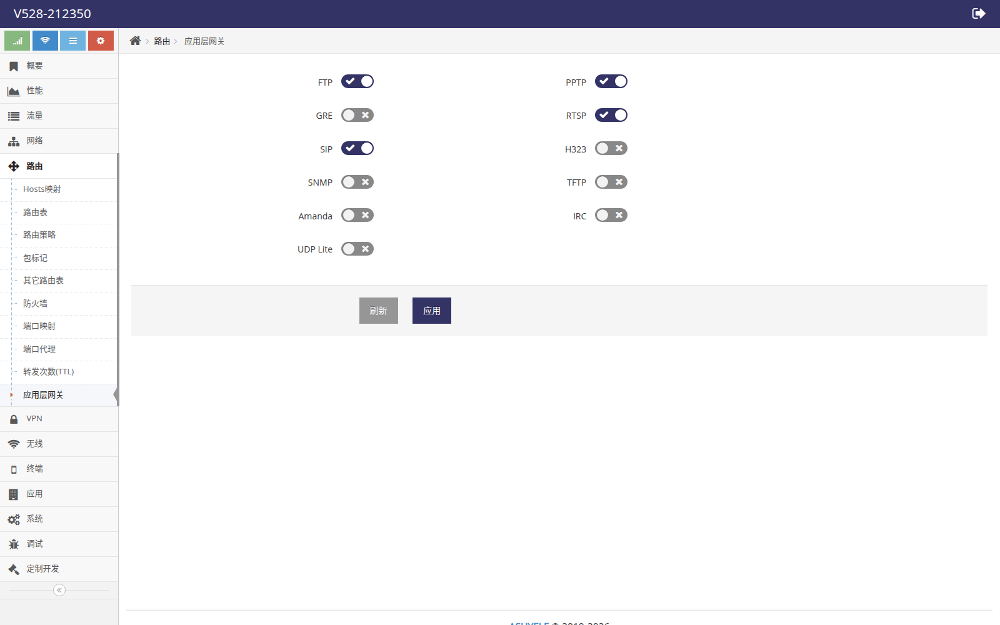

- 本条操作所在页面界面实录。

**界面判断**

| | 条件 |
|--|------|
| **成功** | 页面与操作符合预期 |
| **失败** | 报错或关键控件无效 |
| **skip** | 无 Web 或无该菜单 |

**环境判断**

| | 条件 |
|--|------|
| **成功** | 菜单存在且允许操作 |
| **失败** | 环境导致无法操作 |
| **skip** | 无菜单 → skip；缺外设 → env |

**命令行判断**

| | 条件 |
|--|------|
| **成功** | HE 可读/可写与界面一致 |
| **失败** | HE 失败非环境 |
| **skip** | 无法 Telnet |

**本条总评**

| 判定类 | 结果（执行时勾选） |
|--------|--------------------|
| 界面 | ☐ pass　☐ fail　☐ skip |
| 环境 | ☐ pass　☐ fail　☐ skip |
| 命令行 | ☐ pass　☐ fail　☐ skip |
| **总评** | 任一类 fail → 本条 fail；已测类均为 pass、其余 skip → 本条 pass；三类皆 skip → env |


**恢复**  
无需恢复

---
### ROUTE-ALG-02 FTP ALG 开关恢复

**功能说明**  
切换 FTP ALG 后恢复。

**侧栏路径**  
`路由 → 应用层网关`
页面 URL：`http://192.168.32.100/index.html`

**需要的环境**（勾选已有项）

- [ ] Web 可打开 `http://192.168.32.100/`
- [ ] 已按 LOGIN-02 登录 Web（或本条自行登录）

**步骤**

#### 1. 界面

1. 打开 `路由 → 应用层网关`。
2. 切换 FTP ALG 后恢复。
3. 按本条目标操作。

#### 2. 命令行

Telnet 登录后在 eline（`$`）执行，或 ashy：`he '…'`：

```text
land@machine.status
land@machine.status
```

**截图**


- 本条操作所在页面界面实录。

**界面判断**

| | 条件 |
|--|------|
| **成功** | 页面与操作符合预期 |
| **失败** | 报错或关键控件无效 |
| **skip** | 无 Web 或无该菜单 |

**环境判断**

| | 条件 |
|--|------|
| **成功** | 菜单存在且允许操作 |
| **失败** | 环境导致无法操作 |
| **skip** | 无菜单 → skip；缺外设 → env |

**命令行判断**

| | 条件 |
|--|------|
| **成功** | HE 可读/可写与界面一致 |
| **失败** | HE 失败非环境 |
| **skip** | 无法 Telnet |

**本条总评**

| 判定类 | 结果（执行时勾选） |
|--------|--------------------|
| 界面 | ☐ pass　☐ fail　☐ skip |
| 环境 | ☐ pass　☐ fail　☐ skip |
| 命令行 | ☐ pass　☐ fail　☐ skip |
| **总评** | 任一类 fail → 本条 fail；已测类均为 pass、其余 skip → 本条 pass；三类皆 skip → env |


**恢复**  
恢复

---
### ROUTE-ALG-03 PPTP ALG 开关恢复

**功能说明**  
切换 PPTP ALG 后恢复。

**侧栏路径**  
`路由 → 应用层网关`
页面 URL：`http://192.168.32.100/index.html`

**需要的环境**（勾选已有项）

- [ ] Web 可打开 `http://192.168.32.100/`
- [ ] 已按 LOGIN-02 登录 Web（或本条自行登录）

**步骤**

#### 1. 界面

1. 打开 `路由 → 应用层网关`。
2. 切换 PPTP ALG 后恢复。
3. 按本条目标操作。

#### 2. 命令行

Telnet 登录后在 eline（`$`）执行，或 ashy：`he '…'`：

```text
land@machine.status
land@machine.status
```

**截图**


- 本条操作所在页面界面实录。

**界面判断**

| | 条件 |
|--|------|
| **成功** | 页面与操作符合预期 |
| **失败** | 报错或关键控件无效 |
| **skip** | 无 Web 或无该菜单 |

**环境判断**

| | 条件 |
|--|------|
| **成功** | 菜单存在且允许操作 |
| **失败** | 环境导致无法操作 |
| **skip** | 无菜单 → skip；缺外设 → env |

**命令行判断**

| | 条件 |
|--|------|
| **成功** | HE 可读/可写与界面一致 |
| **失败** | HE 失败非环境 |
| **skip** | 无法 Telnet |

**本条总评**

| 判定类 | 结果（执行时勾选） |
|--------|--------------------|
| 界面 | ☐ pass　☐ fail　☐ skip |
| 环境 | ☐ pass　☐ fail　☐ skip |
| 命令行 | ☐ pass　☐ fail　☐ skip |
| **总评** | 任一类 fail → 本条 fail；已测类均为 pass、其余 skip → 本条 pass；三类皆 skip → env |


**恢复**  
恢复

---
### ROUTE-ALG-04 GRE ALG 开关恢复

**功能说明**  
切换 GRE ALG 后恢复。

**侧栏路径**  
`路由 → 应用层网关`
页面 URL：`http://192.168.32.100/index.html`

**需要的环境**（勾选已有项）

- [ ] Web 可打开 `http://192.168.32.100/`
- [ ] 已按 LOGIN-02 登录 Web（或本条自行登录）

**步骤**

#### 1. 界面

1. 打开 `路由 → 应用层网关`。
2. 切换 GRE ALG 后恢复。
3. 按本条目标操作。

#### 2. 命令行

Telnet 登录后在 eline（`$`）执行，或 ashy：`he '…'`：

```text
land@machine.status
land@machine.status
```

**截图**


- 本条操作所在页面界面实录。

**界面判断**

| | 条件 |
|--|------|
| **成功** | 页面与操作符合预期 |
| **失败** | 报错或关键控件无效 |
| **skip** | 无 Web 或无该菜单 |

**环境判断**

| | 条件 |
|--|------|
| **成功** | 菜单存在且允许操作 |
| **失败** | 环境导致无法操作 |
| **skip** | 无菜单 → skip；缺外设 → env |

**命令行判断**

| | 条件 |
|--|------|
| **成功** | HE 可读/可写与界面一致 |
| **失败** | HE 失败非环境 |
| **skip** | 无法 Telnet |

**本条总评**

| 判定类 | 结果（执行时勾选） |
|--------|--------------------|
| 界面 | ☐ pass　☐ fail　☐ skip |
| 环境 | ☐ pass　☐ fail　☐ skip |
| 命令行 | ☐ pass　☐ fail　☐ skip |
| **总评** | 任一类 fail → 本条 fail；已测类均为 pass、其余 skip → 本条 pass；三类皆 skip → env |


**恢复**  
恢复

---
### ROUTE-ALG-05 其余 ALG 逐项开关恢复

**功能说明**  
对其余 ALG（RTSP/SIP 等）逐项或合并记录开关恢复。

**侧栏路径**  
`路由 → 应用层网关`
页面 URL：`http://192.168.32.100/index.html`

**需要的环境**（勾选已有项）

- [ ] Web 可打开 `http://192.168.32.100/`
- [ ] 已按 LOGIN-02 登录 Web（或本条自行登录）

**步骤**

#### 1. 界面

1. 打开 `路由 → 应用层网关`。
2. 对其余 ALG（RTSP/SIP 等）逐项或合并记录开关恢复。
3. 按本条目标操作。

#### 2. 命令行

Telnet 登录后在 eline（`$`）执行，或 ashy：`he '…'`：

```text
land@machine.status
land@machine.status
```

**截图**


- 本条操作所在页面界面实录。

**界面判断**

| | 条件 |
|--|------|
| **成功** | 页面与操作符合预期 |
| **失败** | 报错或关键控件无效 |
| **skip** | 无 Web 或无该菜单 |

**环境判断**

| | 条件 |
|--|------|
| **成功** | 菜单存在且允许操作 |
| **失败** | 环境导致无法操作 |
| **skip** | 无菜单 → skip；缺外设 → env |

**命令行判断**

| | 条件 |
|--|------|
| **成功** | HE 可读/可写与界面一致 |
| **失败** | HE 失败非环境 |
| **skip** | 无法 Telnet |

**本条总评**

| 判定类 | 结果（执行时勾选） |
|--------|--------------------|
| 界面 | ☐ pass　☐ fail　☐ skip |
| 环境 | ☐ pass　☐ fail　☐ skip |
| 命令行 | ☐ pass　☐ fail　☐ skip |
| **总评** | 任一类 fail → 本条 fail；已测类均为 pass、其余 skip → 本条 pass；三类皆 skip → env |


**恢复**  
全部恢复

---
### ROUTE-ALG-06 ALG Apply 后配置可读

**功能说明**  
Apply 后再次打开确认配置可读。

**侧栏路径**  
`路由 → 应用层网关`
页面 URL：`http://192.168.32.100/index.html`

**需要的环境**（勾选已有项）

- [ ] Web 可打开 `http://192.168.32.100/`
- [ ] 已按 LOGIN-02 登录 Web（或本条自行登录）

**步骤**

#### 1. 界面

1. 打开 `路由 → 应用层网关`。
2. Apply 后再次打开确认配置可读。
3. 按本条目标操作。

#### 2. 命令行

Telnet 登录后在 eline（`$`）执行，或 ashy：`he '…'`：

```text
land@machine.status
land@machine.status
```

**截图**


- 本条操作所在页面界面实录。

**界面判断**

| | 条件 |
|--|------|
| **成功** | 页面与操作符合预期 |
| **失败** | 报错或关键控件无效 |
| **skip** | 无 Web 或无该菜单 |

**环境判断**

| | 条件 |
|--|------|
| **成功** | 菜单存在且允许操作 |
| **失败** | 环境导致无法操作 |
| **skip** | 无菜单 → skip；缺外设 → env |

**命令行判断**

| | 条件 |
|--|------|
| **成功** | HE 可读/可写与界面一致 |
| **失败** | HE 失败非环境 |
| **skip** | 无法 Telnet |

**本条总评**

| 判定类 | 结果（执行时勾选） |
|--------|--------------------|
| 界面 | ☐ pass　☐ fail　☐ skip |
| 环境 | ☐ pass　☐ fail　☐ skip |
| 命令行 | ☐ pass　☐ fail　☐ skip |
| **总评** | 任一类 fail → 本条 fail；已测类均为 pass、其余 skip → 本条 pass；三类皆 skip → env |


**恢复**  
保持恢复后状态

---
## 7 VPN

### 7.IPsec客户端

### VPN-IPSEC-01 IPsec客户端 列表页进入

**功能说明**  
打开列表页，确认可加载。

**侧栏路径**  
`VPN → IPsec客户端`

**需要的环境**（勾选已有项）

- [ ] Web 可打开 `http://192.168.32.100/`
- [ ] 已按 LOGIN-02 登录 Web（或本条自行登录）

**步骤**

#### 1. 界面

1. 打开 `VPN → IPsec客户端`。
2. 打开列表页，确认可加载。

#### 2. 命令行

Telnet 登录后在 eline（`$`）执行，或 ashy：`he '…'`：

```text
land@machine.status
# 相关组件：ipsec@client 或列表对象
# 列表/实例操作以页面 object 与 .com 查询结果为准
```

**截图**


- 本条操作所在页面界面实录。

**界面判断**

| | 条件 |
|--|------|
| **成功** | 页面与操作符合预期 |
| **失败** | 报错或关键控件无效 |
| **skip** | 无 Web 或无该菜单 |

**环境判断**

| | 条件 |
|--|------|
| **成功** | 菜单存在且允许操作 |
| **失败** | 环境导致无法操作 |
| **skip** | 无该 VPN 菜单 → skip；无对端 → 连通 env |

**命令行判断**

| | 条件 |
|--|------|
| **成功** | HE 可读/可写与界面一致 |
| **失败** | HE 失败非环境 |
| **skip** | 无法 Telnet |

**本条总评**

| 判定类 | 结果（执行时勾选） |
|--------|--------------------|
| 界面 | ☐ pass　☐ fail　☐ skip |
| 环境 | ☐ pass　☐ fail　☐ skip |
| 命令行 | ☐ pass　☐ fail　☐ skip |
| **总评** | 任一类 fail → 本条 fail；已测类均为 pass、其余 skip → 本条 pass；三类皆 skip → env |


**恢复**  
无需恢复。

---
### VPN-IPSEC-02 IPsec客户端 + 新建实例

**功能说明**  
新建实例，填写对端关键项（测试可用占位地址，无需真实对端也可保存配置），保存。

**侧栏路径**  
`VPN → IPsec客户端`

**需要的环境**（勾选已有项）

- [ ] Web 可打开 `http://192.168.32.100/`
- [ ] 已按 LOGIN-02 登录 Web（或本条自行登录）

**步骤**

#### 1. 界面

1. 打开 `VPN → IPsec客户端`。
2. 新建实例，填写对端关键项（测试可用占位地址，无需真实对端也可保存配置），保存。

#### 2. 命令行

Telnet 登录后在 eline（`$`）执行，或 ashy：`he '…'`：

```text
land@machine.status
# 相关组件：ipsec@client 或列表对象
# 列表/实例操作以页面 object 与 .com 查询结果为准
```

**截图**


- 本条操作所在页面界面实录。

**界面判断**

| | 条件 |
|--|------|
| **成功** | 页面与操作符合预期 |
| **失败** | 报错或关键控件无效 |
| **skip** | 无 Web 或无该菜单 |

**环境判断**

| | 条件 |
|--|------|
| **成功** | 菜单存在且允许操作 |
| **失败** | 环境导致无法操作 |
| **skip** | 无该 VPN 菜单 → skip；无对端 → 连通 env |

**命令行判断**

| | 条件 |
|--|------|
| **成功** | HE 可读/可写与界面一致 |
| **失败** | HE 失败非环境 |
| **skip** | 无法 Telnet |

**本条总评**

| 判定类 | 结果（执行时勾选） |
|--------|--------------------|
| 界面 | ☐ pass　☐ fail　☐ skip |
| 环境 | ☐ pass　☐ fail　☐ skip |
| 命令行 | ☐ pass　☐ fail　☐ skip |
| **总评** | 任一类 fail → 本条 fail；已测类均为 pass、其余 skip → 本条 pass；三类皆 skip → env |


**恢复**  
测完删除实例。

---
### VPN-IPSEC-03 IPsec客户端 打开实例编辑页字段可读

**功能说明**  
打开实例编辑页，字段可读。

**侧栏路径**  
`VPN → IPsec客户端`

**需要的环境**（勾选已有项）

- [ ] Web 可打开 `http://192.168.32.100/`
- [ ] 已按 LOGIN-02 登录 Web（或本条自行登录）

**步骤**

#### 1. 界面

1. 打开 `VPN → IPsec客户端`。
2. 打开实例编辑页，字段可读。

#### 2. 命令行

Telnet 登录后在 eline（`$`）执行，或 ashy：`he '…'`：

```text
land@machine.status
# 相关组件：ipsec@client 或列表对象
# 列表/实例操作以页面 object 与 .com 查询结果为准
```

**截图**


- 本条操作所在页面界面实录。

**界面判断**

| | 条件 |
|--|------|
| **成功** | 页面与操作符合预期 |
| **失败** | 报错或关键控件无效 |
| **skip** | 无 Web 或无该菜单 |

**环境判断**

| | 条件 |
|--|------|
| **成功** | 菜单存在且允许操作 |
| **失败** | 环境导致无法操作 |
| **skip** | 无该 VPN 菜单 → skip；无对端 → 连通 env |

**命令行判断**

| | 条件 |
|--|------|
| **成功** | HE 可读/可写与界面一致 |
| **失败** | HE 失败非环境 |
| **skip** | 无法 Telnet |

**本条总评**

| 判定类 | 结果（执行时勾选） |
|--------|--------------------|
| 界面 | ☐ pass　☐ fail　☐ skip |
| 环境 | ☐ pass　☐ fail　☐ skip |
| 命令行 | ☐ pass　☐ fail　☐ skip |
| **总评** | 任一类 fail → 本条 fail；已测类均为 pass、其余 skip → 本条 pass；三类皆 skip → env |


**恢复**  
不强制改。

---
### VPN-IPSEC-04 IPsec客户端 Status 启用

**功能说明**  
启用 Status/开关。

**侧栏路径**  
`VPN → IPsec客户端`

**需要的环境**（勾选已有项）

- [ ] Web 可打开 `http://192.168.32.100/`
- [ ] 已按 LOGIN-02 登录 Web（或本条自行登录）

**步骤**

#### 1. 界面

1. 打开 `VPN → IPsec客户端`。
2. 启用 Status/开关。

#### 2. 命令行

Telnet 登录后在 eline（`$`）执行，或 ashy：`he '…'`：

```text
land@machine.status
# 相关组件：ipsec@client 或列表对象
# 列表/实例操作以页面 object 与 .com 查询结果为准
```

**截图**


- 本条操作所在页面界面实录。

**界面判断**

| | 条件 |
|--|------|
| **成功** | 页面与操作符合预期 |
| **失败** | 报错或关键控件无效 |
| **skip** | 无 Web 或无该菜单 |

**环境判断**

| | 条件 |
|--|------|
| **成功** | 菜单存在且允许操作 |
| **失败** | 环境导致无法操作 |
| **skip** | 无该 VPN 菜单 → skip；无对端 → 连通 env |

**命令行判断**

| | 条件 |
|--|------|
| **成功** | HE 可读/可写与界面一致 |
| **失败** | HE 失败非环境 |
| **skip** | 无法 Telnet |

**本条总评**

| 判定类 | 结果（执行时勾选） |
|--------|--------------------|
| 界面 | ☐ pass　☐ fail　☐ skip |
| 环境 | ☐ pass　☐ fail　☐ skip |
| 命令行 | ☐ pass　☐ fail　☐ skip |
| **总评** | 任一类 fail → 本条 fail；已测类均为 pass、其余 skip → 本条 pass；三类皆 skip → env |


**恢复**  
按需关回。

---
### VPN-IPSEC-05 IPsec客户端 play 连接

**功能说明**  
点连接；无真实对端则连通性 env。

**侧栏路径**  
`VPN → IPsec客户端`

**需要的环境**（勾选已有项）

- [ ] Web 可打开 `http://192.168.32.100/`
- [ ] 已按 LOGIN-02 登录 Web（或本条自行登录）

**步骤**

#### 1. 界面

1. 打开 `VPN → IPsec客户端`。
2. 点连接；无真实对端则连通性 env。

#### 2. 命令行

Telnet 登录后在 eline（`$`）执行，或 ashy：`he '…'`：

```text
land@machine.status
# 相关组件：ipsec@client 或列表对象
# 列表/实例操作以页面 object 与 .com 查询结果为准
```

**截图**


- 本条操作所在页面界面实录。

**界面判断**

| | 条件 |
|--|------|
| **成功** | 页面与操作符合预期 |
| **失败** | 报错或关键控件无效 |
| **skip** | 无 Web 或无该菜单 |

**环境判断**

| | 条件 |
|--|------|
| **成功** | 菜单存在且允许操作 |
| **失败** | 环境导致无法操作 |
| **skip** | 无该 VPN 菜单 → skip；无对端 → 连通 env |

**命令行判断**

| | 条件 |
|--|------|
| **成功** | HE 可读/可写与界面一致 |
| **失败** | HE 失败非环境 |
| **skip** | 无法 Telnet |

**本条总评**

| 判定类 | 结果（执行时勾选） |
|--------|--------------------|
| 界面 | ☐ pass　☐ fail　☐ skip |
| 环境 | ☐ pass　☐ fail　☐ skip |
| 命令行 | ☐ pass　☐ fail　☐ skip |
| **总评** | 任一类 fail → 本条 fail；已测类均为 pass、其余 skip → 本条 pass；三类皆 skip → env |


**恢复**  
断开/删实例。

---
### VPN-IPSEC-06 IPsec客户端 pause 断开

**功能说明**  
点断开。

**侧栏路径**  
`VPN → IPsec客户端`

**需要的环境**（勾选已有项）

- [ ] Web 可打开 `http://192.168.32.100/`
- [ ] 已按 LOGIN-02 登录 Web（或本条自行登录）

**步骤**

#### 1. 界面

1. 打开 `VPN → IPsec客户端`。
2. 点断开。

#### 2. 命令行

Telnet 登录后在 eline（`$`）执行，或 ashy：`he '…'`：

```text
land@machine.status
# 相关组件：ipsec@client 或列表对象
# 列表/实例操作以页面 object 与 .com 查询结果为准
```

**截图**


- 本条操作所在页面界面实录。

**界面判断**

| | 条件 |
|--|------|
| **成功** | 页面与操作符合预期 |
| **失败** | 报错或关键控件无效 |
| **skip** | 无 Web 或无该菜单 |

**环境判断**

| | 条件 |
|--|------|
| **成功** | 菜单存在且允许操作 |
| **失败** | 环境导致无法操作 |
| **skip** | 无该 VPN 菜单 → skip；无对端 → 连通 env |

**命令行判断**

| | 条件 |
|--|------|
| **成功** | HE 可读/可写与界面一致 |
| **失败** | HE 失败非环境 |
| **skip** | 无法 Telnet |

**本条总评**

| 判定类 | 结果（执行时勾选） |
|--------|--------------------|
| 界面 | ☐ pass　☐ fail　☐ skip |
| 环境 | ☐ pass　☐ fail　☐ skip |
| 命令行 | ☐ pass　☐ fail　☐ skip |
| **总评** | 任一类 fail → 本条 fail；已测类均为 pass、其余 skip → 本条 pass；三类皆 skip → env |


**恢复**  
可删实例。

---
### VPN-IPSEC-07 IPsec客户端 删除实例恢复

**功能说明**  
删除测试实例，列表恢复。

**侧栏路径**  
`VPN → IPsec客户端`

**需要的环境**（勾选已有项）

- [ ] Web 可打开 `http://192.168.32.100/`
- [ ] 已按 LOGIN-02 登录 Web（或本条自行登录）

**步骤**

#### 1. 界面

1. 打开 `VPN → IPsec客户端`。
2. 删除测试实例，列表恢复。

#### 2. 命令行

Telnet 登录后在 eline（`$`）执行，或 ashy：`he '…'`：

```text
land@machine.status
# 相关组件：ipsec@client 或列表对象
# 列表/实例操作以页面 object 与 .com 查询结果为准
```

**截图**


- 本条操作所在页面界面实录。

**界面判断**

| | 条件 |
|--|------|
| **成功** | 页面与操作符合预期 |
| **失败** | 报错或关键控件无效 |
| **skip** | 无 Web 或无该菜单 |

**环境判断**

| | 条件 |
|--|------|
| **成功** | 菜单存在且允许操作 |
| **失败** | 环境导致无法操作 |
| **skip** | 无该 VPN 菜单 → skip；无对端 → 连通 env |

**命令行判断**

| | 条件 |
|--|------|
| **成功** | HE 可读/可写与界面一致 |
| **失败** | HE 失败非环境 |
| **skip** | 无法 Telnet |

**本条总评**

| 判定类 | 结果（执行时勾选） |
|--------|--------------------|
| 界面 | ☐ pass　☐ fail　☐ skip |
| 环境 | ☐ pass　☐ fail　☐ skip |
| 命令行 | ☐ pass　☐ fail　☐ skip |
| **总评** | 任一类 fail → 本条 fail；已测类均为 pass、其余 skip → 本条 pass；三类皆 skip → env |


**恢复**  
确认测试实例已删。

---
### 7.WireGuard

### VPN-WG-01 WireGuard 列表页进入

**功能说明**  
打开列表页，确认可加载。

**侧栏路径**  
`VPN → WireGuard`

**需要的环境**（勾选已有项）

- [ ] Web 可打开 `http://192.168.32.100/`
- [ ] 已按 LOGIN-02 登录 Web（或本条自行登录）

**步骤**

#### 1. 界面

1. 打开 `VPN → WireGuard`。
2. 打开列表页，确认可加载。

#### 2. 命令行

Telnet 登录后在 eline（`$`）执行，或 ashy：`he '…'`：

```text
land@machine.status
# 相关组件：nvpn / wg 相关对象
# 列表/实例操作以页面 object 与 .com 查询结果为准
```

**截图**


- 本条操作所在页面界面实录。

**界面判断**

| | 条件 |
|--|------|
| **成功** | 页面与操作符合预期 |
| **失败** | 报错或关键控件无效 |
| **skip** | 无 Web 或无该菜单 |

**环境判断**

| | 条件 |
|--|------|
| **成功** | 菜单存在且允许操作 |
| **失败** | 环境导致无法操作 |
| **skip** | 无该 VPN 菜单 → skip；无对端 → 连通 env |

**命令行判断**

| | 条件 |
|--|------|
| **成功** | HE 可读/可写与界面一致 |
| **失败** | HE 失败非环境 |
| **skip** | 无法 Telnet |

**本条总评**

| 判定类 | 结果（执行时勾选） |
|--------|--------------------|
| 界面 | ☐ pass　☐ fail　☐ skip |
| 环境 | ☐ pass　☐ fail　☐ skip |
| 命令行 | ☐ pass　☐ fail　☐ skip |
| **总评** | 任一类 fail → 本条 fail；已测类均为 pass、其余 skip → 本条 pass；三类皆 skip → env |


**恢复**  
无需恢复。

---
### VPN-WG-02 WireGuard + 新建实例

**功能说明**  
新建实例，填写对端关键项（测试可用占位地址，无需真实对端也可保存配置），保存。

**侧栏路径**  
`VPN → WireGuard`

**需要的环境**（勾选已有项）

- [ ] Web 可打开 `http://192.168.32.100/`
- [ ] 已按 LOGIN-02 登录 Web（或本条自行登录）

**步骤**

#### 1. 界面

1. 打开 `VPN → WireGuard`。
2. 新建实例，填写对端关键项（测试可用占位地址，无需真实对端也可保存配置），保存。

#### 2. 命令行

Telnet 登录后在 eline（`$`）执行，或 ashy：`he '…'`：

```text
land@machine.status
# 相关组件：nvpn / wg 相关对象
# 列表/实例操作以页面 object 与 .com 查询结果为准
```

**截图**


- 本条操作所在页面界面实录。

**界面判断**

| | 条件 |
|--|------|
| **成功** | 页面与操作符合预期 |
| **失败** | 报错或关键控件无效 |
| **skip** | 无 Web 或无该菜单 |

**环境判断**

| | 条件 |
|--|------|
| **成功** | 菜单存在且允许操作 |
| **失败** | 环境导致无法操作 |
| **skip** | 无该 VPN 菜单 → skip；无对端 → 连通 env |

**命令行判断**

| | 条件 |
|--|------|
| **成功** | HE 可读/可写与界面一致 |
| **失败** | HE 失败非环境 |
| **skip** | 无法 Telnet |

**本条总评**

| 判定类 | 结果（执行时勾选） |
|--------|--------------------|
| 界面 | ☐ pass　☐ fail　☐ skip |
| 环境 | ☐ pass　☐ fail　☐ skip |
| 命令行 | ☐ pass　☐ fail　☐ skip |
| **总评** | 任一类 fail → 本条 fail；已测类均为 pass、其余 skip → 本条 pass；三类皆 skip → env |


**恢复**  
测完删除实例。

---
### VPN-WG-03 WireGuard 打开实例编辑页字段可读

**功能说明**  
打开实例编辑页，字段可读。

**侧栏路径**  
`VPN → WireGuard`

**需要的环境**（勾选已有项）

- [ ] Web 可打开 `http://192.168.32.100/`
- [ ] 已按 LOGIN-02 登录 Web（或本条自行登录）

**步骤**

#### 1. 界面

1. 打开 `VPN → WireGuard`。
2. 打开实例编辑页，字段可读。

#### 2. 命令行

Telnet 登录后在 eline（`$`）执行，或 ashy：`he '…'`：

```text
land@machine.status
# 相关组件：nvpn / wg 相关对象
# 列表/实例操作以页面 object 与 .com 查询结果为准
```

**截图**


- 本条操作所在页面界面实录。

**界面判断**

| | 条件 |
|--|------|
| **成功** | 页面与操作符合预期 |
| **失败** | 报错或关键控件无效 |
| **skip** | 无 Web 或无该菜单 |

**环境判断**

| | 条件 |
|--|------|
| **成功** | 菜单存在且允许操作 |
| **失败** | 环境导致无法操作 |
| **skip** | 无该 VPN 菜单 → skip；无对端 → 连通 env |

**命令行判断**

| | 条件 |
|--|------|
| **成功** | HE 可读/可写与界面一致 |
| **失败** | HE 失败非环境 |
| **skip** | 无法 Telnet |

**本条总评**

| 判定类 | 结果（执行时勾选） |
|--------|--------------------|
| 界面 | ☐ pass　☐ fail　☐ skip |
| 环境 | ☐ pass　☐ fail　☐ skip |
| 命令行 | ☐ pass　☐ fail　☐ skip |
| **总评** | 任一类 fail → 本条 fail；已测类均为 pass、其余 skip → 本条 pass；三类皆 skip → env |


**恢复**  
不强制改。

---
### VPN-WG-04 WireGuard Status 启用

**功能说明**  
启用 Status/开关。

**侧栏路径**  
`VPN → WireGuard`

**需要的环境**（勾选已有项）

- [ ] Web 可打开 `http://192.168.32.100/`
- [ ] 已按 LOGIN-02 登录 Web（或本条自行登录）

**步骤**

#### 1. 界面

1. 打开 `VPN → WireGuard`。
2. 启用 Status/开关。

#### 2. 命令行

Telnet 登录后在 eline（`$`）执行，或 ashy：`he '…'`：

```text
land@machine.status
# 相关组件：nvpn / wg 相关对象
# 列表/实例操作以页面 object 与 .com 查询结果为准
```

**截图**


- 本条操作所在页面界面实录。

**界面判断**

| | 条件 |
|--|------|
| **成功** | 页面与操作符合预期 |
| **失败** | 报错或关键控件无效 |
| **skip** | 无 Web 或无该菜单 |

**环境判断**

| | 条件 |
|--|------|
| **成功** | 菜单存在且允许操作 |
| **失败** | 环境导致无法操作 |
| **skip** | 无该 VPN 菜单 → skip；无对端 → 连通 env |

**命令行判断**

| | 条件 |
|--|------|
| **成功** | HE 可读/可写与界面一致 |
| **失败** | HE 失败非环境 |
| **skip** | 无法 Telnet |

**本条总评**

| 判定类 | 结果（执行时勾选） |
|--------|--------------------|
| 界面 | ☐ pass　☐ fail　☐ skip |
| 环境 | ☐ pass　☐ fail　☐ skip |
| 命令行 | ☐ pass　☐ fail　☐ skip |
| **总评** | 任一类 fail → 本条 fail；已测类均为 pass、其余 skip → 本条 pass；三类皆 skip → env |


**恢复**  
按需关回。

---
### VPN-WG-05 WireGuard play 连接

**功能说明**  
点连接；无真实对端则连通性 env。

**侧栏路径**  
`VPN → WireGuard`

**需要的环境**（勾选已有项）

- [ ] Web 可打开 `http://192.168.32.100/`
- [ ] 已按 LOGIN-02 登录 Web（或本条自行登录）

**步骤**

#### 1. 界面

1. 打开 `VPN → WireGuard`。
2. 点连接；无真实对端则连通性 env。

#### 2. 命令行

Telnet 登录后在 eline（`$`）执行，或 ashy：`he '…'`：

```text
land@machine.status
# 相关组件：nvpn / wg 相关对象
# 列表/实例操作以页面 object 与 .com 查询结果为准
```

**截图**


- 本条操作所在页面界面实录。

**界面判断**

| | 条件 |
|--|------|
| **成功** | 页面与操作符合预期 |
| **失败** | 报错或关键控件无效 |
| **skip** | 无 Web 或无该菜单 |

**环境判断**

| | 条件 |
|--|------|
| **成功** | 菜单存在且允许操作 |
| **失败** | 环境导致无法操作 |
| **skip** | 无该 VPN 菜单 → skip；无对端 → 连通 env |

**命令行判断**

| | 条件 |
|--|------|
| **成功** | HE 可读/可写与界面一致 |
| **失败** | HE 失败非环境 |
| **skip** | 无法 Telnet |

**本条总评**

| 判定类 | 结果（执行时勾选） |
|--------|--------------------|
| 界面 | ☐ pass　☐ fail　☐ skip |
| 环境 | ☐ pass　☐ fail　☐ skip |
| 命令行 | ☐ pass　☐ fail　☐ skip |
| **总评** | 任一类 fail → 本条 fail；已测类均为 pass、其余 skip → 本条 pass；三类皆 skip → env |


**恢复**  
断开/删实例。

---
### VPN-WG-06 WireGuard pause 断开

**功能说明**  
点断开。

**侧栏路径**  
`VPN → WireGuard`

**需要的环境**（勾选已有项）

- [ ] Web 可打开 `http://192.168.32.100/`
- [ ] 已按 LOGIN-02 登录 Web（或本条自行登录）

**步骤**

#### 1. 界面

1. 打开 `VPN → WireGuard`。
2. 点断开。

#### 2. 命令行

Telnet 登录后在 eline（`$`）执行，或 ashy：`he '…'`：

```text
land@machine.status
# 相关组件：nvpn / wg 相关对象
# 列表/实例操作以页面 object 与 .com 查询结果为准
```

**截图**


- 本条操作所在页面界面实录。

**界面判断**

| | 条件 |
|--|------|
| **成功** | 页面与操作符合预期 |
| **失败** | 报错或关键控件无效 |
| **skip** | 无 Web 或无该菜单 |

**环境判断**

| | 条件 |
|--|------|
| **成功** | 菜单存在且允许操作 |
| **失败** | 环境导致无法操作 |
| **skip** | 无该 VPN 菜单 → skip；无对端 → 连通 env |

**命令行判断**

| | 条件 |
|--|------|
| **成功** | HE 可读/可写与界面一致 |
| **失败** | HE 失败非环境 |
| **skip** | 无法 Telnet |

**本条总评**

| 判定类 | 结果（执行时勾选） |
|--------|--------------------|
| 界面 | ☐ pass　☐ fail　☐ skip |
| 环境 | ☐ pass　☐ fail　☐ skip |
| 命令行 | ☐ pass　☐ fail　☐ skip |
| **总评** | 任一类 fail → 本条 fail；已测类均为 pass、其余 skip → 本条 pass；三类皆 skip → env |


**恢复**  
可删实例。

---
### VPN-WG-07 WireGuard 删除实例恢复

**功能说明**  
删除测试实例，列表恢复。

**侧栏路径**  
`VPN → WireGuard`

**需要的环境**（勾选已有项）

- [ ] Web 可打开 `http://192.168.32.100/`
- [ ] 已按 LOGIN-02 登录 Web（或本条自行登录）

**步骤**

#### 1. 界面

1. 打开 `VPN → WireGuard`。
2. 删除测试实例，列表恢复。

#### 2. 命令行

Telnet 登录后在 eline（`$`）执行，或 ashy：`he '…'`：

```text
land@machine.status
# 相关组件：nvpn / wg 相关对象
# 列表/实例操作以页面 object 与 .com 查询结果为准
```

**截图**


- 本条操作所在页面界面实录。

**界面判断**

| | 条件 |
|--|------|
| **成功** | 页面与操作符合预期 |
| **失败** | 报错或关键控件无效 |
| **skip** | 无 Web 或无该菜单 |

**环境判断**

| | 条件 |
|--|------|
| **成功** | 菜单存在且允许操作 |
| **失败** | 环境导致无法操作 |
| **skip** | 无该 VPN 菜单 → skip；无对端 → 连通 env |

**命令行判断**

| | 条件 |
|--|------|
| **成功** | HE 可读/可写与界面一致 |
| **失败** | HE 失败非环境 |
| **skip** | 无法 Telnet |

**本条总评**

| 判定类 | 结果（执行时勾选） |
|--------|--------------------|
| 界面 | ☐ pass　☐ fail　☐ skip |
| 环境 | ☐ pass　☐ fail　☐ skip |
| 命令行 | ☐ pass　☐ fail　☐ skip |
| **总评** | 任一类 fail → 本条 fail；已测类均为 pass、其余 skip → 本条 pass；三类皆 skip → env |


**恢复**  
确认测试实例已删。

---
### 7.L2TP客户端

### VPN-L2TP-01 L2TP客户端 列表页进入

**功能说明**  
打开列表页，确认可加载。

**侧栏路径**  
`VPN → L2TP客户端`

**需要的环境**（勾选已有项）

- [ ] Web 可打开 `http://192.168.32.100/`
- [ ] 已按 LOGIN-02 登录 Web（或本条自行登录）

**步骤**

#### 1. 界面

1. 打开 `VPN → L2TP客户端`。
2. 打开列表页，确认可加载。

#### 2. 命令行

Telnet 登录后在 eline（`$`）执行，或 ashy：`he '…'`：

```text
land@machine.status
# 相关组件：vpn L2TP 对象
# 列表/实例操作以页面 object 与 .com 查询结果为准
```

**截图**

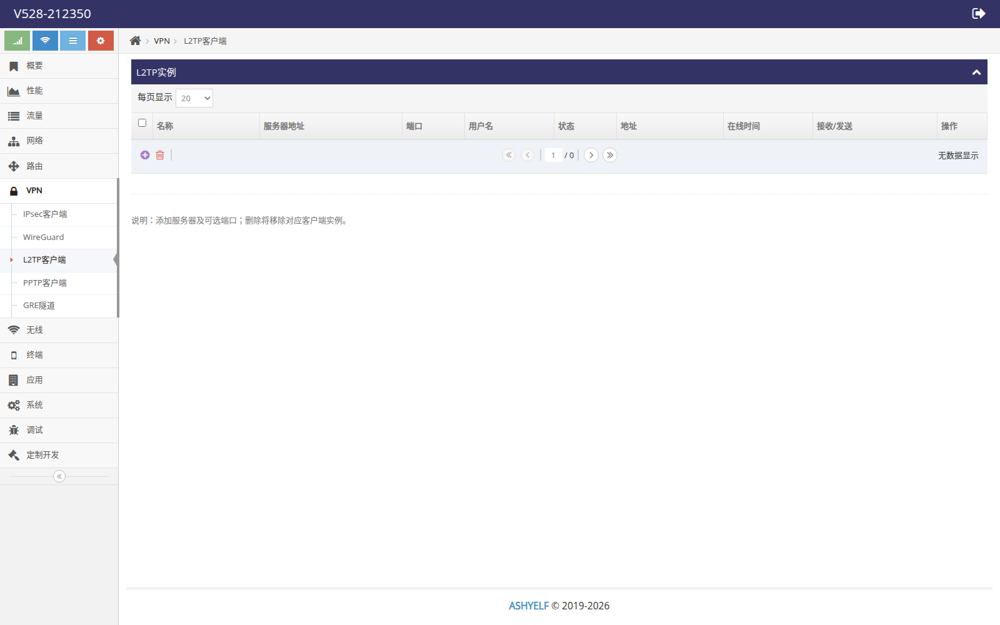

- 本条操作所在页面界面实录。

**界面判断**

| | 条件 |
|--|------|
| **成功** | 页面与操作符合预期 |
| **失败** | 报错或关键控件无效 |
| **skip** | 无 Web 或无该菜单 |

**环境判断**

| | 条件 |
|--|------|
| **成功** | 菜单存在且允许操作 |
| **失败** | 环境导致无法操作 |
| **skip** | 无该 VPN 菜单 → skip；无对端 → 连通 env |

**命令行判断**

| | 条件 |
|--|------|
| **成功** | HE 可读/可写与界面一致 |
| **失败** | HE 失败非环境 |
| **skip** | 无法 Telnet |

**本条总评**

| 判定类 | 结果（执行时勾选） |
|--------|--------------------|
| 界面 | ☐ pass　☐ fail　☐ skip |
| 环境 | ☐ pass　☐ fail　☐ skip |
| 命令行 | ☐ pass　☐ fail　☐ skip |
| **总评** | 任一类 fail → 本条 fail；已测类均为 pass、其余 skip → 本条 pass；三类皆 skip → env |


**恢复**  
无需恢复。

---
### VPN-L2TP-02 L2TP客户端 + 新建实例

**功能说明**  
新建实例，填写对端关键项（测试可用占位地址，无需真实对端也可保存配置），保存。

**侧栏路径**  
`VPN → L2TP客户端`

**需要的环境**（勾选已有项）

- [ ] Web 可打开 `http://192.168.32.100/`
- [ ] 已按 LOGIN-02 登录 Web（或本条自行登录）

**步骤**

#### 1. 界面

1. 打开 `VPN → L2TP客户端`。
2. 新建实例，填写对端关键项（测试可用占位地址，无需真实对端也可保存配置），保存。

#### 2. 命令行

Telnet 登录后在 eline（`$`）执行，或 ashy：`he '…'`：

```text
land@machine.status
# 相关组件：vpn L2TP 对象
# 列表/实例操作以页面 object 与 .com 查询结果为准
```

**截图**


- 本条操作所在页面界面实录。

**界面判断**

| | 条件 |
|--|------|
| **成功** | 页面与操作符合预期 |
| **失败** | 报错或关键控件无效 |
| **skip** | 无 Web 或无该菜单 |

**环境判断**

| | 条件 |
|--|------|
| **成功** | 菜单存在且允许操作 |
| **失败** | 环境导致无法操作 |
| **skip** | 无该 VPN 菜单 → skip；无对端 → 连通 env |

**命令行判断**

| | 条件 |
|--|------|
| **成功** | HE 可读/可写与界面一致 |
| **失败** | HE 失败非环境 |
| **skip** | 无法 Telnet |

**本条总评**

| 判定类 | 结果（执行时勾选） |
|--------|--------------------|
| 界面 | ☐ pass　☐ fail　☐ skip |
| 环境 | ☐ pass　☐ fail　☐ skip |
| 命令行 | ☐ pass　☐ fail　☐ skip |
| **总评** | 任一类 fail → 本条 fail；已测类均为 pass、其余 skip → 本条 pass；三类皆 skip → env |


**恢复**  
测完删除实例。

---
### VPN-L2TP-03 L2TP客户端 打开实例编辑页字段可读

**功能说明**  
打开实例编辑页，字段可读。

**侧栏路径**  
`VPN → L2TP客户端`

**需要的环境**（勾选已有项）

- [ ] Web 可打开 `http://192.168.32.100/`
- [ ] 已按 LOGIN-02 登录 Web（或本条自行登录）

**步骤**

#### 1. 界面

1. 打开 `VPN → L2TP客户端`。
2. 打开实例编辑页，字段可读。

#### 2. 命令行

Telnet 登录后在 eline（`$`）执行，或 ashy：`he '…'`：

```text
land@machine.status
# 相关组件：vpn L2TP 对象
# 列表/实例操作以页面 object 与 .com 查询结果为准
```

**截图**


- 本条操作所在页面界面实录。

**界面判断**

| | 条件 |
|--|------|
| **成功** | 页面与操作符合预期 |
| **失败** | 报错或关键控件无效 |
| **skip** | 无 Web 或无该菜单 |

**环境判断**

| | 条件 |
|--|------|
| **成功** | 菜单存在且允许操作 |
| **失败** | 环境导致无法操作 |
| **skip** | 无该 VPN 菜单 → skip；无对端 → 连通 env |

**命令行判断**

| | 条件 |
|--|------|
| **成功** | HE 可读/可写与界面一致 |
| **失败** | HE 失败非环境 |
| **skip** | 无法 Telnet |

**本条总评**

| 判定类 | 结果（执行时勾选） |
|--------|--------------------|
| 界面 | ☐ pass　☐ fail　☐ skip |
| 环境 | ☐ pass　☐ fail　☐ skip |
| 命令行 | ☐ pass　☐ fail　☐ skip |
| **总评** | 任一类 fail → 本条 fail；已测类均为 pass、其余 skip → 本条 pass；三类皆 skip → env |


**恢复**  
不强制改。

---
### VPN-L2TP-04 L2TP客户端 Status 启用

**功能说明**  
启用 Status/开关。

**侧栏路径**  
`VPN → L2TP客户端`

**需要的环境**（勾选已有项）

- [ ] Web 可打开 `http://192.168.32.100/`
- [ ] 已按 LOGIN-02 登录 Web（或本条自行登录）

**步骤**

#### 1. 界面

1. 打开 `VPN → L2TP客户端`。
2. 启用 Status/开关。

#### 2. 命令行

Telnet 登录后在 eline（`$`）执行，或 ashy：`he '…'`：

```text
land@machine.status
# 相关组件：vpn L2TP 对象
# 列表/实例操作以页面 object 与 .com 查询结果为准
```

**截图**


- 本条操作所在页面界面实录。

**界面判断**

| | 条件 |
|--|------|
| **成功** | 页面与操作符合预期 |
| **失败** | 报错或关键控件无效 |
| **skip** | 无 Web 或无该菜单 |

**环境判断**

| | 条件 |
|--|------|
| **成功** | 菜单存在且允许操作 |
| **失败** | 环境导致无法操作 |
| **skip** | 无该 VPN 菜单 → skip；无对端 → 连通 env |

**命令行判断**

| | 条件 |
|--|------|
| **成功** | HE 可读/可写与界面一致 |
| **失败** | HE 失败非环境 |
| **skip** | 无法 Telnet |

**本条总评**

| 判定类 | 结果（执行时勾选） |
|--------|--------------------|
| 界面 | ☐ pass　☐ fail　☐ skip |
| 环境 | ☐ pass　☐ fail　☐ skip |
| 命令行 | ☐ pass　☐ fail　☐ skip |
| **总评** | 任一类 fail → 本条 fail；已测类均为 pass、其余 skip → 本条 pass；三类皆 skip → env |


**恢复**  
按需关回。

---
### VPN-L2TP-05 L2TP客户端 play 连接

**功能说明**  
点连接；无真实对端则连通性 env。

**侧栏路径**  
`VPN → L2TP客户端`

**需要的环境**（勾选已有项）

- [ ] Web 可打开 `http://192.168.32.100/`
- [ ] 已按 LOGIN-02 登录 Web（或本条自行登录）

**步骤**

#### 1. 界面

1. 打开 `VPN → L2TP客户端`。
2. 点连接；无真实对端则连通性 env。

#### 2. 命令行

Telnet 登录后在 eline（`$`）执行，或 ashy：`he '…'`：

```text
land@machine.status
# 相关组件：vpn L2TP 对象
# 列表/实例操作以页面 object 与 .com 查询结果为准
```

**截图**


- 本条操作所在页面界面实录。

**界面判断**

| | 条件 |
|--|------|
| **成功** | 页面与操作符合预期 |
| **失败** | 报错或关键控件无效 |
| **skip** | 无 Web 或无该菜单 |

**环境判断**

| | 条件 |
|--|------|
| **成功** | 菜单存在且允许操作 |
| **失败** | 环境导致无法操作 |
| **skip** | 无该 VPN 菜单 → skip；无对端 → 连通 env |

**命令行判断**

| | 条件 |
|--|------|
| **成功** | HE 可读/可写与界面一致 |
| **失败** | HE 失败非环境 |
| **skip** | 无法 Telnet |

**本条总评**

| 判定类 | 结果（执行时勾选） |
|--------|--------------------|
| 界面 | ☐ pass　☐ fail　☐ skip |
| 环境 | ☐ pass　☐ fail　☐ skip |
| 命令行 | ☐ pass　☐ fail　☐ skip |
| **总评** | 任一类 fail → 本条 fail；已测类均为 pass、其余 skip → 本条 pass；三类皆 skip → env |


**恢复**  
断开/删实例。

---
### VPN-L2TP-06 L2TP客户端 pause 断开

**功能说明**  
点断开。

**侧栏路径**  
`VPN → L2TP客户端`

**需要的环境**（勾选已有项）

- [ ] Web 可打开 `http://192.168.32.100/`
- [ ] 已按 LOGIN-02 登录 Web（或本条自行登录）

**步骤**

#### 1. 界面

1. 打开 `VPN → L2TP客户端`。
2. 点断开。

#### 2. 命令行

Telnet 登录后在 eline（`$`）执行，或 ashy：`he '…'`：

```text
land@machine.status
# 相关组件：vpn L2TP 对象
# 列表/实例操作以页面 object 与 .com 查询结果为准
```

**截图**


- 本条操作所在页面界面实录。

**界面判断**

| | 条件 |
|--|------|
| **成功** | 页面与操作符合预期 |
| **失败** | 报错或关键控件无效 |
| **skip** | 无 Web 或无该菜单 |

**环境判断**

| | 条件 |
|--|------|
| **成功** | 菜单存在且允许操作 |
| **失败** | 环境导致无法操作 |
| **skip** | 无该 VPN 菜单 → skip；无对端 → 连通 env |

**命令行判断**

| | 条件 |
|--|------|
| **成功** | HE 可读/可写与界面一致 |
| **失败** | HE 失败非环境 |
| **skip** | 无法 Telnet |

**本条总评**

| 判定类 | 结果（执行时勾选） |
|--------|--------------------|
| 界面 | ☐ pass　☐ fail　☐ skip |
| 环境 | ☐ pass　☐ fail　☐ skip |
| 命令行 | ☐ pass　☐ fail　☐ skip |
| **总评** | 任一类 fail → 本条 fail；已测类均为 pass、其余 skip → 本条 pass；三类皆 skip → env |


**恢复**  
可删实例。

---
### VPN-L2TP-07 L2TP客户端 删除实例恢复

**功能说明**  
删除测试实例，列表恢复。

**侧栏路径**  
`VPN → L2TP客户端`

**需要的环境**（勾选已有项）

- [ ] Web 可打开 `http://192.168.32.100/`
- [ ] 已按 LOGIN-02 登录 Web（或本条自行登录）

**步骤**

#### 1. 界面

1. 打开 `VPN → L2TP客户端`。
2. 删除测试实例，列表恢复。

#### 2. 命令行

Telnet 登录后在 eline（`$`）执行，或 ashy：`he '…'`：

```text
land@machine.status
# 相关组件：vpn L2TP 对象
# 列表/实例操作以页面 object 与 .com 查询结果为准
```

**截图**


- 本条操作所在页面界面实录。

**界面判断**

| | 条件 |
|--|------|
| **成功** | 页面与操作符合预期 |
| **失败** | 报错或关键控件无效 |
| **skip** | 无 Web 或无该菜单 |

**环境判断**

| | 条件 |
|--|------|
| **成功** | 菜单存在且允许操作 |
| **失败** | 环境导致无法操作 |
| **skip** | 无该 VPN 菜单 → skip；无对端 → 连通 env |

**命令行判断**

| | 条件 |
|--|------|
| **成功** | HE 可读/可写与界面一致 |
| **失败** | HE 失败非环境 |
| **skip** | 无法 Telnet |

**本条总评**

| 判定类 | 结果（执行时勾选） |
|--------|--------------------|
| 界面 | ☐ pass　☐ fail　☐ skip |
| 环境 | ☐ pass　☐ fail　☐ skip |
| 命令行 | ☐ pass　☐ fail　☐ skip |
| **总评** | 任一类 fail → 本条 fail；已测类均为 pass、其余 skip → 本条 pass；三类皆 skip → env |


**恢复**  
确认测试实例已删。

---
### 7.PPTP客户端

### VPN-PPTP-01 PPTP客户端 列表页进入

**功能说明**  
打开列表页，确认可加载。

**侧栏路径**  
`VPN → PPTP客户端`

**需要的环境**（勾选已有项）

- [ ] Web 可打开 `http://192.168.32.100/`
- [ ] 已按 LOGIN-02 登录 Web（或本条自行登录）

**步骤**

#### 1. 界面

1. 打开 `VPN → PPTP客户端`。
2. 打开列表页，确认可加载。

#### 2. 命令行

Telnet 登录后在 eline（`$`）执行，或 ashy：`he '…'`：

```text
land@machine.status
# 相关组件：vpn PPTP 对象
# 列表/实例操作以页面 object 与 .com 查询结果为准
```

**截图**

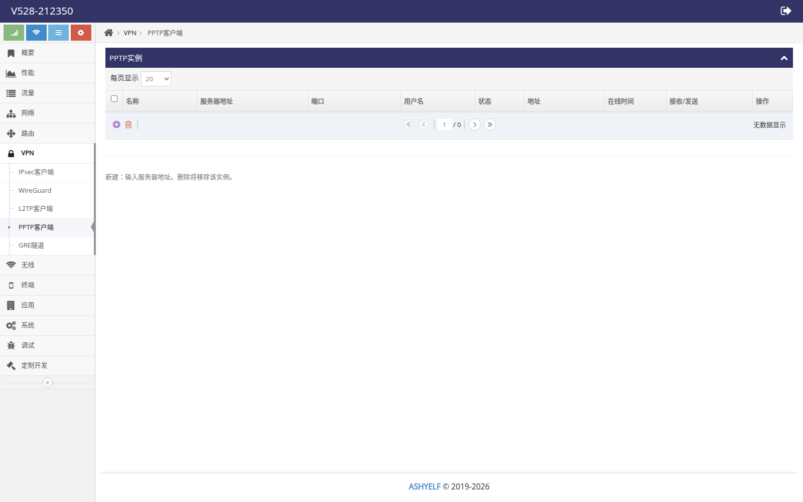

- 本条操作所在页面界面实录。

**界面判断**

| | 条件 |
|--|------|
| **成功** | 页面与操作符合预期 |
| **失败** | 报错或关键控件无效 |
| **skip** | 无 Web 或无该菜单 |

**环境判断**

| | 条件 |
|--|------|
| **成功** | 菜单存在且允许操作 |
| **失败** | 环境导致无法操作 |
| **skip** | 无该 VPN 菜单 → skip；无对端 → 连通 env |

**命令行判断**

| | 条件 |
|--|------|
| **成功** | HE 可读/可写与界面一致 |
| **失败** | HE 失败非环境 |
| **skip** | 无法 Telnet |

**本条总评**

| 判定类 | 结果（执行时勾选） |
|--------|--------------------|
| 界面 | ☐ pass　☐ fail　☐ skip |
| 环境 | ☐ pass　☐ fail　☐ skip |
| 命令行 | ☐ pass　☐ fail　☐ skip |
| **总评** | 任一类 fail → 本条 fail；已测类均为 pass、其余 skip → 本条 pass；三类皆 skip → env |


**恢复**  
无需恢复。

---
### VPN-PPTP-02 PPTP客户端 + 新建实例

**功能说明**  
新建实例，填写对端关键项（测试可用占位地址，无需真实对端也可保存配置），保存。

**侧栏路径**  
`VPN → PPTP客户端`

**需要的环境**（勾选已有项）

- [ ] Web 可打开 `http://192.168.32.100/`
- [ ] 已按 LOGIN-02 登录 Web（或本条自行登录）

**步骤**

#### 1. 界面

1. 打开 `VPN → PPTP客户端`。
2. 新建实例，填写对端关键项（测试可用占位地址，无需真实对端也可保存配置），保存。

#### 2. 命令行

Telnet 登录后在 eline（`$`）执行，或 ashy：`he '…'`：

```text
land@machine.status
# 相关组件：vpn PPTP 对象
# 列表/实例操作以页面 object 与 .com 查询结果为准
```

**截图**


- 本条操作所在页面界面实录。

**界面判断**

| | 条件 |
|--|------|
| **成功** | 页面与操作符合预期 |
| **失败** | 报错或关键控件无效 |
| **skip** | 无 Web 或无该菜单 |

**环境判断**

| | 条件 |
|--|------|
| **成功** | 菜单存在且允许操作 |
| **失败** | 环境导致无法操作 |
| **skip** | 无该 VPN 菜单 → skip；无对端 → 连通 env |

**命令行判断**

| | 条件 |
|--|------|
| **成功** | HE 可读/可写与界面一致 |
| **失败** | HE 失败非环境 |
| **skip** | 无法 Telnet |

**本条总评**

| 判定类 | 结果（执行时勾选） |
|--------|--------------------|
| 界面 | ☐ pass　☐ fail　☐ skip |
| 环境 | ☐ pass　☐ fail　☐ skip |
| 命令行 | ☐ pass　☐ fail　☐ skip |
| **总评** | 任一类 fail → 本条 fail；已测类均为 pass、其余 skip → 本条 pass；三类皆 skip → env |


**恢复**  
测完删除实例。

---
### VPN-PPTP-03 PPTP客户端 打开实例编辑页字段可读

**功能说明**  
打开实例编辑页，字段可读。

**侧栏路径**  
`VPN → PPTP客户端`

**需要的环境**（勾选已有项）

- [ ] Web 可打开 `http://192.168.32.100/`
- [ ] 已按 LOGIN-02 登录 Web（或本条自行登录）

**步骤**

#### 1. 界面

1. 打开 `VPN → PPTP客户端`。
2. 打开实例编辑页，字段可读。

#### 2. 命令行

Telnet 登录后在 eline（`$`）执行，或 ashy：`he '…'`：

```text
land@machine.status
# 相关组件：vpn PPTP 对象
# 列表/实例操作以页面 object 与 .com 查询结果为准
```

**截图**


- 本条操作所在页面界面实录。

**界面判断**

| | 条件 |
|--|------|
| **成功** | 页面与操作符合预期 |
| **失败** | 报错或关键控件无效 |
| **skip** | 无 Web 或无该菜单 |

**环境判断**

| | 条件 |
|--|------|
| **成功** | 菜单存在且允许操作 |
| **失败** | 环境导致无法操作 |
| **skip** | 无该 VPN 菜单 → skip；无对端 → 连通 env |

**命令行判断**

| | 条件 |
|--|------|
| **成功** | HE 可读/可写与界面一致 |
| **失败** | HE 失败非环境 |
| **skip** | 无法 Telnet |

**本条总评**

| 判定类 | 结果（执行时勾选） |
|--------|--------------------|
| 界面 | ☐ pass　☐ fail　☐ skip |
| 环境 | ☐ pass　☐ fail　☐ skip |
| 命令行 | ☐ pass　☐ fail　☐ skip |
| **总评** | 任一类 fail → 本条 fail；已测类均为 pass、其余 skip → 本条 pass；三类皆 skip → env |


**恢复**  
不强制改。

---
### VPN-PPTP-04 PPTP客户端 Status 启用

**功能说明**  
启用 Status/开关。

**侧栏路径**  
`VPN → PPTP客户端`

**需要的环境**（勾选已有项）

- [ ] Web 可打开 `http://192.168.32.100/`
- [ ] 已按 LOGIN-02 登录 Web（或本条自行登录）

**步骤**

#### 1. 界面

1. 打开 `VPN → PPTP客户端`。
2. 启用 Status/开关。

#### 2. 命令行

Telnet 登录后在 eline（`$`）执行，或 ashy：`he '…'`：

```text
land@machine.status
# 相关组件：vpn PPTP 对象
# 列表/实例操作以页面 object 与 .com 查询结果为准
```

**截图**


- 本条操作所在页面界面实录。

**界面判断**

| | 条件 |
|--|------|
| **成功** | 页面与操作符合预期 |
| **失败** | 报错或关键控件无效 |
| **skip** | 无 Web 或无该菜单 |

**环境判断**

| | 条件 |
|--|------|
| **成功** | 菜单存在且允许操作 |
| **失败** | 环境导致无法操作 |
| **skip** | 无该 VPN 菜单 → skip；无对端 → 连通 env |

**命令行判断**

| | 条件 |
|--|------|
| **成功** | HE 可读/可写与界面一致 |
| **失败** | HE 失败非环境 |
| **skip** | 无法 Telnet |

**本条总评**

| 判定类 | 结果（执行时勾选） |
|--------|--------------------|
| 界面 | ☐ pass　☐ fail　☐ skip |
| 环境 | ☐ pass　☐ fail　☐ skip |
| 命令行 | ☐ pass　☐ fail　☐ skip |
| **总评** | 任一类 fail → 本条 fail；已测类均为 pass、其余 skip → 本条 pass；三类皆 skip → env |


**恢复**  
按需关回。

---
### VPN-PPTP-05 PPTP客户端 play 连接

**功能说明**  
点连接；无真实对端则连通性 env。

**侧栏路径**  
`VPN → PPTP客户端`

**需要的环境**（勾选已有项）

- [ ] Web 可打开 `http://192.168.32.100/`
- [ ] 已按 LOGIN-02 登录 Web（或本条自行登录）

**步骤**

#### 1. 界面

1. 打开 `VPN → PPTP客户端`。
2. 点连接；无真实对端则连通性 env。

#### 2. 命令行

Telnet 登录后在 eline（`$`）执行，或 ashy：`he '…'`：

```text
land@machine.status
# 相关组件：vpn PPTP 对象
# 列表/实例操作以页面 object 与 .com 查询结果为准
```

**截图**


- 本条操作所在页面界面实录。

**界面判断**

| | 条件 |
|--|------|
| **成功** | 页面与操作符合预期 |
| **失败** | 报错或关键控件无效 |
| **skip** | 无 Web 或无该菜单 |

**环境判断**

| | 条件 |
|--|------|
| **成功** | 菜单存在且允许操作 |
| **失败** | 环境导致无法操作 |
| **skip** | 无该 VPN 菜单 → skip；无对端 → 连通 env |

**命令行判断**

| | 条件 |
|--|------|
| **成功** | HE 可读/可写与界面一致 |
| **失败** | HE 失败非环境 |
| **skip** | 无法 Telnet |

**本条总评**

| 判定类 | 结果（执行时勾选） |
|--------|--------------------|
| 界面 | ☐ pass　☐ fail　☐ skip |
| 环境 | ☐ pass　☐ fail　☐ skip |
| 命令行 | ☐ pass　☐ fail　☐ skip |
| **总评** | 任一类 fail → 本条 fail；已测类均为 pass、其余 skip → 本条 pass；三类皆 skip → env |


**恢复**  
断开/删实例。

---
### VPN-PPTP-06 PPTP客户端 pause 断开

**功能说明**  
点断开。

**侧栏路径**  
`VPN → PPTP客户端`

**需要的环境**（勾选已有项）

- [ ] Web 可打开 `http://192.168.32.100/`
- [ ] 已按 LOGIN-02 登录 Web（或本条自行登录）

**步骤**

#### 1. 界面

1. 打开 `VPN → PPTP客户端`。
2. 点断开。

#### 2. 命令行

Telnet 登录后在 eline（`$`）执行，或 ashy：`he '…'`：

```text
land@machine.status
# 相关组件：vpn PPTP 对象
# 列表/实例操作以页面 object 与 .com 查询结果为准
```

**截图**


- 本条操作所在页面界面实录。

**界面判断**

| | 条件 |
|--|------|
| **成功** | 页面与操作符合预期 |
| **失败** | 报错或关键控件无效 |
| **skip** | 无 Web 或无该菜单 |

**环境判断**

| | 条件 |
|--|------|
| **成功** | 菜单存在且允许操作 |
| **失败** | 环境导致无法操作 |
| **skip** | 无该 VPN 菜单 → skip；无对端 → 连通 env |

**命令行判断**

| | 条件 |
|--|------|
| **成功** | HE 可读/可写与界面一致 |
| **失败** | HE 失败非环境 |
| **skip** | 无法 Telnet |

**本条总评**

| 判定类 | 结果（执行时勾选） |
|--------|--------------------|
| 界面 | ☐ pass　☐ fail　☐ skip |
| 环境 | ☐ pass　☐ fail　☐ skip |
| 命令行 | ☐ pass　☐ fail　☐ skip |
| **总评** | 任一类 fail → 本条 fail；已测类均为 pass、其余 skip → 本条 pass；三类皆 skip → env |


**恢复**  
可删实例。

---
### VPN-PPTP-07 PPTP客户端 删除实例恢复

**功能说明**  
删除测试实例，列表恢复。

**侧栏路径**  
`VPN → PPTP客户端`

**需要的环境**（勾选已有项）

- [ ] Web 可打开 `http://192.168.32.100/`
- [ ] 已按 LOGIN-02 登录 Web（或本条自行登录）

**步骤**

#### 1. 界面

1. 打开 `VPN → PPTP客户端`。
2. 删除测试实例，列表恢复。

#### 2. 命令行

Telnet 登录后在 eline（`$`）执行，或 ashy：`he '…'`：

```text
land@machine.status
# 相关组件：vpn PPTP 对象
# 列表/实例操作以页面 object 与 .com 查询结果为准
```

**截图**


- 本条操作所在页面界面实录。

**界面判断**

| | 条件 |
|--|------|
| **成功** | 页面与操作符合预期 |
| **失败** | 报错或关键控件无效 |
| **skip** | 无 Web 或无该菜单 |

**环境判断**

| | 条件 |
|--|------|
| **成功** | 菜单存在且允许操作 |
| **失败** | 环境导致无法操作 |
| **skip** | 无该 VPN 菜单 → skip；无对端 → 连通 env |

**命令行判断**

| | 条件 |
|--|------|
| **成功** | HE 可读/可写与界面一致 |
| **失败** | HE 失败非环境 |
| **skip** | 无法 Telnet |

**本条总评**

| 判定类 | 结果（执行时勾选） |
|--------|--------------------|
| 界面 | ☐ pass　☐ fail　☐ skip |
| 环境 | ☐ pass　☐ fail　☐ skip |
| 命令行 | ☐ pass　☐ fail　☐ skip |
| **总评** | 任一类 fail → 本条 fail；已测类均为 pass、其余 skip → 本条 pass；三类皆 skip → env |


**恢复**  
确认测试实例已删。

---
### 7.GRE隧道

### VPN-GRE-01 GRE隧道 列表页进入

**功能说明**  
打开列表页，确认可加载。

**侧栏路径**  
`VPN → GRE隧道`

**需要的环境**（勾选已有项）

- [ ] Web 可打开 `http://192.168.32.100/`
- [ ] 已按 LOGIN-02 登录 Web（或本条自行登录）

**步骤**

#### 1. 界面

1. 打开 `VPN → GRE隧道`。
2. 打开列表页，确认可加载。

#### 2. 命令行

Telnet 登录后在 eline（`$`）执行，或 ashy：`he '…'`：

```text
land@machine.status
# 相关组件：vpn GRE 对象
# 列表/实例操作以页面 object 与 .com 查询结果为准
```

**截图**

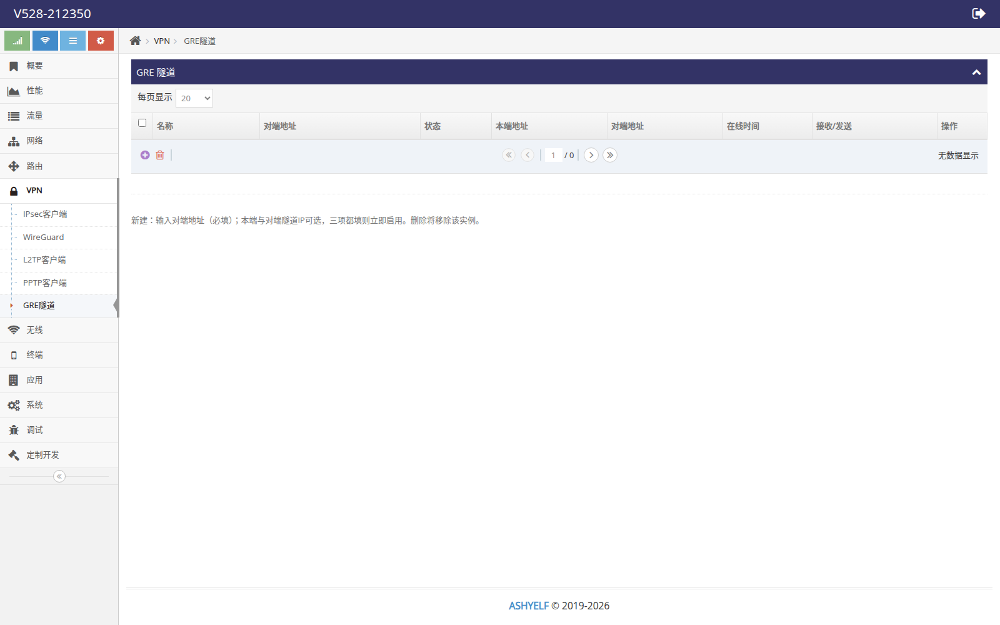

- 本条操作所在页面界面实录。

**界面判断**

| | 条件 |
|--|------|
| **成功** | 页面与操作符合预期 |
| **失败** | 报错或关键控件无效 |
| **skip** | 无 Web 或无该菜单 |

**环境判断**

| | 条件 |
|--|------|
| **成功** | 菜单存在且允许操作 |
| **失败** | 环境导致无法操作 |
| **skip** | 无该 VPN 菜单 → skip；无对端 → 连通 env |

**命令行判断**

| | 条件 |
|--|------|
| **成功** | HE 可读/可写与界面一致 |
| **失败** | HE 失败非环境 |
| **skip** | 无法 Telnet |

**本条总评**

| 判定类 | 结果（执行时勾选） |
|--------|--------------------|
| 界面 | ☐ pass　☐ fail　☐ skip |
| 环境 | ☐ pass　☐ fail　☐ skip |
| 命令行 | ☐ pass　☐ fail　☐ skip |
| **总评** | 任一类 fail → 本条 fail；已测类均为 pass、其余 skip → 本条 pass；三类皆 skip → env |


**恢复**  
无需恢复。

---
### VPN-GRE-02 GRE隧道 + 新建实例

**功能说明**  
新建实例，填写对端关键项（测试可用占位地址，无需真实对端也可保存配置），保存。

**侧栏路径**  
`VPN → GRE隧道`

**需要的环境**（勾选已有项）

- [ ] Web 可打开 `http://192.168.32.100/`
- [ ] 已按 LOGIN-02 登录 Web（或本条自行登录）

**步骤**

#### 1. 界面

1. 打开 `VPN → GRE隧道`。
2. 新建实例，填写对端关键项（测试可用占位地址，无需真实对端也可保存配置），保存。

#### 2. 命令行

Telnet 登录后在 eline（`$`）执行，或 ashy：`he '…'`：

```text
land@machine.status
# 相关组件：vpn GRE 对象
# 列表/实例操作以页面 object 与 .com 查询结果为准
```

**截图**


- 本条操作所在页面界面实录。

**界面判断**

| | 条件 |
|--|------|
| **成功** | 页面与操作符合预期 |
| **失败** | 报错或关键控件无效 |
| **skip** | 无 Web 或无该菜单 |

**环境判断**

| | 条件 |
|--|------|
| **成功** | 菜单存在且允许操作 |
| **失败** | 环境导致无法操作 |
| **skip** | 无该 VPN 菜单 → skip；无对端 → 连通 env |

**命令行判断**

| | 条件 |
|--|------|
| **成功** | HE 可读/可写与界面一致 |
| **失败** | HE 失败非环境 |
| **skip** | 无法 Telnet |

**本条总评**

| 判定类 | 结果（执行时勾选） |
|--------|--------------------|
| 界面 | ☐ pass　☐ fail　☐ skip |
| 环境 | ☐ pass　☐ fail　☐ skip |
| 命令行 | ☐ pass　☐ fail　☐ skip |
| **总评** | 任一类 fail → 本条 fail；已测类均为 pass、其余 skip → 本条 pass；三类皆 skip → env |


**恢复**  
测完删除实例。

---
### VPN-GRE-03 GRE隧道 打开实例编辑页字段可读

**功能说明**  
打开实例编辑页，字段可读。

**侧栏路径**  
`VPN → GRE隧道`

**需要的环境**（勾选已有项）

- [ ] Web 可打开 `http://192.168.32.100/`
- [ ] 已按 LOGIN-02 登录 Web（或本条自行登录）

**步骤**

#### 1. 界面

1. 打开 `VPN → GRE隧道`。
2. 打开实例编辑页，字段可读。

#### 2. 命令行

Telnet 登录后在 eline（`$`）执行，或 ashy：`he '…'`：

```text
land@machine.status
# 相关组件：vpn GRE 对象
# 列表/实例操作以页面 object 与 .com 查询结果为准
```

**截图**


- 本条操作所在页面界面实录。

**界面判断**

| | 条件 |
|--|------|
| **成功** | 页面与操作符合预期 |
| **失败** | 报错或关键控件无效 |
| **skip** | 无 Web 或无该菜单 |

**环境判断**

| | 条件 |
|--|------|
| **成功** | 菜单存在且允许操作 |
| **失败** | 环境导致无法操作 |
| **skip** | 无该 VPN 菜单 → skip；无对端 → 连通 env |

**命令行判断**

| | 条件 |
|--|------|
| **成功** | HE 可读/可写与界面一致 |
| **失败** | HE 失败非环境 |
| **skip** | 无法 Telnet |

**本条总评**

| 判定类 | 结果（执行时勾选） |
|--------|--------------------|
| 界面 | ☐ pass　☐ fail　☐ skip |
| 环境 | ☐ pass　☐ fail　☐ skip |
| 命令行 | ☐ pass　☐ fail　☐ skip |
| **总评** | 任一类 fail → 本条 fail；已测类均为 pass、其余 skip → 本条 pass；三类皆 skip → env |


**恢复**  
不强制改。

---
### VPN-GRE-04 GRE隧道 Status 启用

**功能说明**  
启用 Status/开关。

**侧栏路径**  
`VPN → GRE隧道`

**需要的环境**（勾选已有项）

- [ ] Web 可打开 `http://192.168.32.100/`
- [ ] 已按 LOGIN-02 登录 Web（或本条自行登录）

**步骤**

#### 1. 界面

1. 打开 `VPN → GRE隧道`。
2. 启用 Status/开关。

#### 2. 命令行

Telnet 登录后在 eline（`$`）执行，或 ashy：`he '…'`：

```text
land@machine.status
# 相关组件：vpn GRE 对象
# 列表/实例操作以页面 object 与 .com 查询结果为准
```

**截图**


- 本条操作所在页面界面实录。

**界面判断**

| | 条件 |
|--|------|
| **成功** | 页面与操作符合预期 |
| **失败** | 报错或关键控件无效 |
| **skip** | 无 Web 或无该菜单 |

**环境判断**

| | 条件 |
|--|------|
| **成功** | 菜单存在且允许操作 |
| **失败** | 环境导致无法操作 |
| **skip** | 无该 VPN 菜单 → skip；无对端 → 连通 env |

**命令行判断**

| | 条件 |
|--|------|
| **成功** | HE 可读/可写与界面一致 |
| **失败** | HE 失败非环境 |
| **skip** | 无法 Telnet |

**本条总评**

| 判定类 | 结果（执行时勾选） |
|--------|--------------------|
| 界面 | ☐ pass　☐ fail　☐ skip |
| 环境 | ☐ pass　☐ fail　☐ skip |
| 命令行 | ☐ pass　☐ fail　☐ skip |
| **总评** | 任一类 fail → 本条 fail；已测类均为 pass、其余 skip → 本条 pass；三类皆 skip → env |


**恢复**  
按需关回。

---
### VPN-GRE-05 GRE隧道 play 连接

**功能说明**  
点连接；无真实对端则连通性 env。

**侧栏路径**  
`VPN → GRE隧道`

**需要的环境**（勾选已有项）

- [ ] Web 可打开 `http://192.168.32.100/`
- [ ] 已按 LOGIN-02 登录 Web（或本条自行登录）

**步骤**

#### 1. 界面

1. 打开 `VPN → GRE隧道`。
2. 点连接；无真实对端则连通性 env。

#### 2. 命令行

Telnet 登录后在 eline（`$`）执行，或 ashy：`he '…'`：

```text
land@machine.status
# 相关组件：vpn GRE 对象
# 列表/实例操作以页面 object 与 .com 查询结果为准
```

**截图**


- 本条操作所在页面界面实录。

**界面判断**

| | 条件 |
|--|------|
| **成功** | 页面与操作符合预期 |
| **失败** | 报错或关键控件无效 |
| **skip** | 无 Web 或无该菜单 |

**环境判断**

| | 条件 |
|--|------|
| **成功** | 菜单存在且允许操作 |
| **失败** | 环境导致无法操作 |
| **skip** | 无该 VPN 菜单 → skip；无对端 → 连通 env |

**命令行判断**

| | 条件 |
|--|------|
| **成功** | HE 可读/可写与界面一致 |
| **失败** | HE 失败非环境 |
| **skip** | 无法 Telnet |

**本条总评**

| 判定类 | 结果（执行时勾选） |
|--------|--------------------|
| 界面 | ☐ pass　☐ fail　☐ skip |
| 环境 | ☐ pass　☐ fail　☐ skip |
| 命令行 | ☐ pass　☐ fail　☐ skip |
| **总评** | 任一类 fail → 本条 fail；已测类均为 pass、其余 skip → 本条 pass；三类皆 skip → env |


**恢复**  
断开/删实例。

---
### VPN-GRE-06 GRE隧道 pause 断开

**功能说明**  
点断开。

**侧栏路径**  
`VPN → GRE隧道`

**需要的环境**（勾选已有项）

- [ ] Web 可打开 `http://192.168.32.100/`
- [ ] 已按 LOGIN-02 登录 Web（或本条自行登录）

**步骤**

#### 1. 界面

1. 打开 `VPN → GRE隧道`。
2. 点断开。

#### 2. 命令行

Telnet 登录后在 eline（`$`）执行，或 ashy：`he '…'`：

```text
land@machine.status
# 相关组件：vpn GRE 对象
# 列表/实例操作以页面 object 与 .com 查询结果为准
```

**截图**


- 本条操作所在页面界面实录。

**界面判断**

| | 条件 |
|--|------|
| **成功** | 页面与操作符合预期 |
| **失败** | 报错或关键控件无效 |
| **skip** | 无 Web 或无该菜单 |

**环境判断**

| | 条件 |
|--|------|
| **成功** | 菜单存在且允许操作 |
| **失败** | 环境导致无法操作 |
| **skip** | 无该 VPN 菜单 → skip；无对端 → 连通 env |

**命令行判断**

| | 条件 |
|--|------|
| **成功** | HE 可读/可写与界面一致 |
| **失败** | HE 失败非环境 |
| **skip** | 无法 Telnet |

**本条总评**

| 判定类 | 结果（执行时勾选） |
|--------|--------------------|
| 界面 | ☐ pass　☐ fail　☐ skip |
| 环境 | ☐ pass　☐ fail　☐ skip |
| 命令行 | ☐ pass　☐ fail　☐ skip |
| **总评** | 任一类 fail → 本条 fail；已测类均为 pass、其余 skip → 本条 pass；三类皆 skip → env |


**恢复**  
可删实例。

---
### VPN-GRE-07 GRE隧道 删除实例恢复

**功能说明**  
删除测试实例，列表恢复。

**侧栏路径**  
`VPN → GRE隧道`

**需要的环境**（勾选已有项）

- [ ] Web 可打开 `http://192.168.32.100/`
- [ ] 已按 LOGIN-02 登录 Web（或本条自行登录）

**步骤**

#### 1. 界面

1. 打开 `VPN → GRE隧道`。
2. 删除测试实例，列表恢复。

#### 2. 命令行

Telnet 登录后在 eline（`$`）执行，或 ashy：`he '…'`：

```text
land@machine.status
# 相关组件：vpn GRE 对象
# 列表/实例操作以页面 object 与 .com 查询结果为准
```

**截图**


- 本条操作所在页面界面实录。

**界面判断**

| | 条件 |
|--|------|
| **成功** | 页面与操作符合预期 |
| **失败** | 报错或关键控件无效 |
| **skip** | 无 Web 或无该菜单 |

**环境判断**

| | 条件 |
|--|------|
| **成功** | 菜单存在且允许操作 |
| **失败** | 环境导致无法操作 |
| **skip** | 无该 VPN 菜单 → skip；无对端 → 连通 env |

**命令行判断**

| | 条件 |
|--|------|
| **成功** | HE 可读/可写与界面一致 |
| **失败** | HE 失败非环境 |
| **skip** | 无法 Telnet |

**本条总评**

| 判定类 | 结果（执行时勾选） |
|--------|--------------------|
| 界面 | ☐ pass　☐ fail　☐ skip |
| 环境 | ☐ pass　☐ fail　☐ skip |
| 命令行 | ☐ pass　☐ fail　☐ skip |
| **总评** | 任一类 fail → 本条 fail；已测类均为 pass、其余 skip → 本条 pass；三类皆 skip → env |


**恢复**  
确认测试实例已删。

---
## 8 无线 Wireless

> 实机侧栏仅见 **5.8G热点**（`wifi@a`）。2.4G 热点/多SSID/网卡类用例默认 **skip**（除非后续固件出现菜单）。

### WIFI-N-01 进入 2.4G 热点/SSID Setup

**功能说明**  
本机无 2.4G 热点菜单，本条 skip。

**侧栏路径**  
`无线 →（无 2.4G热点）`

**需要的环境**（勾选已有项）

- [ ] Web 可打开 `http://192.168.32.100/`
- [ ] 已按 LOGIN-02 登录 Web（或本条自行登录）

**步骤**

#### 1. 界面

1. 打开侧栏，确认本机是否存在本条所述菜单。
2. 若菜单不存在：界面判定记 **skip**（不算产品失败）。
3. 若菜单存在：进入该页并完成本条操作。

#### 2. 命令行

Telnet 登录后在 eline（`$`）执行，或 ashy：`he '…'`：

```text
wifi@n.status
# 若对象不存在则 skip
```

**截图**


- 本机固件侧栏无本条菜单：界面判定记 **skip**（不算产品失败）。下图为同产品相关页面实录，供对照。

**界面判断**

| | 条件 |
|--|------|
| **成功** | 页面与操作符合预期 |
| **失败** | 报错或关键控件无效 |
| **skip** | 无 Web 或无该菜单 |

**环境判断**

| | 条件 |
|--|------|
| **成功** | 菜单存在且允许操作 |
| **失败** | 环境导致无法操作 |
| **skip** | 无 2.4G 热点 → skip |

**命令行判断**

| | 条件 |
|--|------|
| **成功** | HE 可读/可写与界面一致 |
| **失败** | HE 失败非环境 |
| **skip** | 无法 Telnet |

**本条总评**

| 判定类 | 结果（执行时勾选） |
|--------|--------------------|
| 界面 | ☐ pass　☐ fail　☐ skip |
| 环境 | ☐ pass　☐ fail　☐ skip |
| 命令行 | ☐ pass　☐ fail　☐ skip |
| **总评** | 任一类 fail → 本条 fail；已测类均为 pass、其余 skip → 本条 pass；三类皆 skip → env |


**恢复**  
无需恢复。

---
### WIFI-N-02 Status 开启 AP

**功能说明**  
本机无 2.4G 热点菜单，本条 skip。

**侧栏路径**  
`无线 →（无 2.4G热点）`

**需要的环境**（勾选已有项）

- [ ] Web 可打开 `http://192.168.32.100/`
- [ ] 已按 LOGIN-02 登录 Web（或本条自行登录）

**步骤**

#### 1. 界面

1. 打开侧栏，确认本机是否存在本条所述菜单。
2. 若菜单不存在：界面判定记 **skip**（不算产品失败）。
3. 若菜单存在：进入该页并完成本条操作。

#### 2. 命令行

Telnet 登录后在 eline（`$`）执行，或 ashy：`he '…'`：

```text
wifi@n.status
# 若对象不存在则 skip
```

**截图**


- 本机固件侧栏无本条菜单：界面判定记 **skip**（不算产品失败）。下图为同产品相关页面实录，供对照。

**界面判断**

| | 条件 |
|--|------|
| **成功** | 页面与操作符合预期 |
| **失败** | 报错或关键控件无效 |
| **skip** | 无 Web 或无该菜单 |

**环境判断**

| | 条件 |
|--|------|
| **成功** | 菜单存在且允许操作 |
| **失败** | 环境导致无法操作 |
| **skip** | 无 2.4G 热点 → skip |

**命令行判断**

| | 条件 |
|--|------|
| **成功** | HE 可读/可写与界面一致 |
| **失败** | HE 失败非环境 |
| **skip** | 无法 Telnet |

**本条总评**

| 判定类 | 结果（执行时勾选） |
|--------|--------------------|
| 界面 | ☐ pass　☐ fail　☐ skip |
| 环境 | ☐ pass　☐ fail　☐ skip |
| 命令行 | ☐ pass　☐ fail　☐ skip |
| **总评** | 任一类 fail → 本条 fail；已测类均为 pass、其余 skip → 本条 pass；三类皆 skip → env |


**恢复**  
无需恢复。

---
### WIFI-N-03 设置 SSID

**功能说明**  
本机无 2.4G 热点菜单，本条 skip。

**侧栏路径**  
`无线 →（无 2.4G热点）`

**需要的环境**（勾选已有项）

- [ ] Web 可打开 `http://192.168.32.100/`
- [ ] 已按 LOGIN-02 登录 Web（或本条自行登录）

**步骤**

#### 1. 界面

1. 打开侧栏，确认本机是否存在本条所述菜单。
2. 若菜单不存在：界面判定记 **skip**（不算产品失败）。
3. 若菜单存在：进入该页并完成本条操作。

#### 2. 命令行

Telnet 登录后在 eline（`$`）执行，或 ashy：`he '…'`：

```text
wifi@n.status
# 若对象不存在则 skip
```

**截图**


- 本机固件侧栏无本条菜单：界面判定记 **skip**（不算产品失败）。下图为同产品相关页面实录，供对照。

**界面判断**

| | 条件 |
|--|------|
| **成功** | 页面与操作符合预期 |
| **失败** | 报错或关键控件无效 |
| **skip** | 无 Web 或无该菜单 |

**环境判断**

| | 条件 |
|--|------|
| **成功** | 菜单存在且允许操作 |
| **失败** | 环境导致无法操作 |
| **skip** | 无 2.4G 热点 → skip |

**命令行判断**

| | 条件 |
|--|------|
| **成功** | HE 可读/可写与界面一致 |
| **失败** | HE 失败非环境 |
| **skip** | 无法 Telnet |

**本条总评**

| 判定类 | 结果（执行时勾选） |
|--------|--------------------|
| 界面 | ☐ pass　☐ fail　☐ skip |
| 环境 | ☐ pass　☐ fail　☐ skip |
| 命令行 | ☐ pass　☐ fail　☐ skip |
| **总评** | 任一类 fail → 本条 fail；已测类均为 pass、其余 skip → 本条 pass；三类皆 skip → env |


**恢复**  
无需恢复。

---
### WIFI-N-04 Security WPA2-PSK + AES + 密码

**功能说明**  
本机无 2.4G 热点菜单，本条 skip。

**侧栏路径**  
`无线 →（无 2.4G热点）`

**需要的环境**（勾选已有项）

- [ ] Web 可打开 `http://192.168.32.100/`
- [ ] 已按 LOGIN-02 登录 Web（或本条自行登录）

**步骤**

#### 1. 界面

1. 打开侧栏，确认本机是否存在本条所述菜单。
2. 若菜单不存在：界面判定记 **skip**（不算产品失败）。
3. 若菜单存在：进入该页并完成本条操作。

#### 2. 命令行

Telnet 登录后在 eline（`$`）执行，或 ashy：`he '…'`：

```text
wifi@n.status
# 若对象不存在则 skip
```

**截图**


- 本机固件侧栏无本条菜单：界面判定记 **skip**（不算产品失败）。下图为同产品相关页面实录，供对照。

**界面判断**

| | 条件 |
|--|------|
| **成功** | 页面与操作符合预期 |
| **失败** | 报错或关键控件无效 |
| **skip** | 无 Web 或无该菜单 |

**环境判断**

| | 条件 |
|--|------|
| **成功** | 菜单存在且允许操作 |
| **失败** | 环境导致无法操作 |
| **skip** | 无 2.4G 热点 → skip |

**命令行判断**

| | 条件 |
|--|------|
| **成功** | HE 可读/可写与界面一致 |
| **失败** | HE 失败非环境 |
| **skip** | 无法 Telnet |

**本条总评**

| 判定类 | 结果（执行时勾选） |
|--------|--------------------|
| 界面 | ☐ pass　☐ fail　☐ skip |
| 环境 | ☐ pass　☐ fail　☐ skip |
| 命令行 | ☐ pass　☐ fail　☐ skip |
| **总评** | 任一类 fail → 本条 fail；已测类均为 pass、其余 skip → 本条 pass；三类皆 skip → env |


**恢复**  
无需恢复。

---
### WIFI-N-05 Security Mixed / None 代表切换恢复

**功能说明**  
本机无 2.4G 热点菜单，本条 skip。

**侧栏路径**  
`无线 →（无 2.4G热点）`

**需要的环境**（勾选已有项）

- [ ] Web 可打开 `http://192.168.32.100/`
- [ ] 已按 LOGIN-02 登录 Web（或本条自行登录）

**步骤**

#### 1. 界面

1. 打开侧栏，确认本机是否存在本条所述菜单。
2. 若菜单不存在：界面判定记 **skip**（不算产品失败）。
3. 若菜单存在：进入该页并完成本条操作。

#### 2. 命令行

Telnet 登录后在 eline（`$`）执行，或 ashy：`he '…'`：

```text
wifi@n.status
# 若对象不存在则 skip
```

**截图**


- 本机固件侧栏无本条菜单：界面判定记 **skip**（不算产品失败）。下图为同产品相关页面实录，供对照。

**界面判断**

| | 条件 |
|--|------|
| **成功** | 页面与操作符合预期 |
| **失败** | 报错或关键控件无效 |
| **skip** | 无 Web 或无该菜单 |

**环境判断**

| | 条件 |
|--|------|
| **成功** | 菜单存在且允许操作 |
| **失败** | 环境导致无法操作 |
| **skip** | 无 2.4G 热点 → skip |

**命令行判断**

| | 条件 |
|--|------|
| **成功** | HE 可读/可写与界面一致 |
| **失败** | HE 失败非环境 |
| **skip** | 无法 Telnet |

**本条总评**

| 判定类 | 结果（执行时勾选） |
|--------|--------------------|
| 界面 | ☐ pass　☐ fail　☐ skip |
| 环境 | ☐ pass　☐ fail　☐ skip |
| 命令行 | ☐ pass　☐ fail　☐ skip |
| **总评** | 任一类 fail → 本条 fail；已测类均为 pass、其余 skip → 本条 pass；三类皆 skip → env |


**恢复**  
无需恢复。

---
### WIFI-N-06 Hide SSID 开关恢复

**功能说明**  
本机无 2.4G 热点菜单，本条 skip。

**侧栏路径**  
`无线 →（无 2.4G热点）`

**需要的环境**（勾选已有项）

- [ ] Web 可打开 `http://192.168.32.100/`
- [ ] 已按 LOGIN-02 登录 Web（或本条自行登录）

**步骤**

#### 1. 界面

1. 打开侧栏，确认本机是否存在本条所述菜单。
2. 若菜单不存在：界面判定记 **skip**（不算产品失败）。
3. 若菜单存在：进入该页并完成本条操作。

#### 2. 命令行

Telnet 登录后在 eline（`$`）执行，或 ashy：`he '…'`：

```text
wifi@n.status
# 若对象不存在则 skip
```

**截图**


- 本机固件侧栏无本条菜单：界面判定记 **skip**（不算产品失败）。下图为同产品相关页面实录，供对照。

**界面判断**

| | 条件 |
|--|------|
| **成功** | 页面与操作符合预期 |
| **失败** | 报错或关键控件无效 |
| **skip** | 无 Web 或无该菜单 |

**环境判断**

| | 条件 |
|--|------|
| **成功** | 菜单存在且允许操作 |
| **失败** | 环境导致无法操作 |
| **skip** | 无 2.4G 热点 → skip |

**命令行判断**

| | 条件 |
|--|------|
| **成功** | HE 可读/可写与界面一致 |
| **失败** | HE 失败非环境 |
| **skip** | 无法 Telnet |

**本条总评**

| 判定类 | 结果（执行时勾选） |
|--------|--------------------|
| 界面 | ☐ pass　☐ fail　☐ skip |
| 环境 | ☐ pass　☐ fail　☐ skip |
| 命令行 | ☐ pass　☐ fail　☐ skip |
| **总评** | 任一类 fail → 本条 fail；已测类均为 pass、其余 skip → 本条 pass；三类皆 skip → env |


**恢复**  
无需恢复。

---
### WIFI-N-07 Isolate Clients 开关恢复

**功能说明**  
本机无 2.4G 热点菜单，本条 skip。

**侧栏路径**  
`无线 →（无 2.4G热点）`

**需要的环境**（勾选已有项）

- [ ] Web 可打开 `http://192.168.32.100/`
- [ ] 已按 LOGIN-02 登录 Web（或本条自行登录）

**步骤**

#### 1. 界面

1. 打开侧栏，确认本机是否存在本条所述菜单。
2. 若菜单不存在：界面判定记 **skip**（不算产品失败）。
3. 若菜单存在：进入该页并完成本条操作。

#### 2. 命令行

Telnet 登录后在 eline（`$`）执行，或 ashy：`he '…'`：

```text
wifi@n.status
# 若对象不存在则 skip
```

**截图**


- 本机固件侧栏无本条菜单：界面判定记 **skip**（不算产品失败）。下图为同产品相关页面实录，供对照。

**界面判断**

| | 条件 |
|--|------|
| **成功** | 页面与操作符合预期 |
| **失败** | 报错或关键控件无效 |
| **skip** | 无 Web 或无该菜单 |

**环境判断**

| | 条件 |
|--|------|
| **成功** | 菜单存在且允许操作 |
| **失败** | 环境导致无法操作 |
| **skip** | 无 2.4G 热点 → skip |

**命令行判断**

| | 条件 |
|--|------|
| **成功** | HE 可读/可写与界面一致 |
| **失败** | HE 失败非环境 |
| **skip** | 无法 Telnet |

**本条总评**

| 判定类 | 结果（执行时勾选） |
|--------|--------------------|
| 界面 | ☐ pass　☐ fail　☐ skip |
| 环境 | ☐ pass　☐ fail　☐ skip |
| 命令行 | ☐ pass　☐ fail　☐ skip |
| **总评** | 任一类 fail → 本条 fail；已测类均为 pass、其余 skip → 本条 pass；三类皆 skip → env |


**恢复**  
无需恢复。

---
### WIFI-N-08 终端关联 2.4G

**功能说明**  
本机无 2.4G 热点菜单，本条 skip。

**侧栏路径**  
`无线 →（无 2.4G热点）`

**需要的环境**（勾选已有项）

- [ ] Web 可打开 `http://192.168.32.100/`
- [ ] 已按 LOGIN-02 登录 Web（或本条自行登录）

**步骤**

#### 1. 界面

1. 打开侧栏，确认本机是否存在本条所述菜单。
2. 若菜单不存在：界面判定记 **skip**（不算产品失败）。
3. 若菜单存在：进入该页并完成本条操作。

#### 2. 命令行

Telnet 登录后在 eline（`$`）执行，或 ashy：`he '…'`：

```text
wifi@n.status
# 若对象不存在则 skip
```

**截图**


- 本机固件侧栏无本条菜单：界面判定记 **skip**（不算产品失败）。下图为同产品相关页面实录，供对照。

**界面判断**

| | 条件 |
|--|------|
| **成功** | 页面与操作符合预期 |
| **失败** | 报错或关键控件无效 |
| **skip** | 无 Web 或无该菜单 |

**环境判断**

| | 条件 |
|--|------|
| **成功** | 菜单存在且允许操作 |
| **失败** | 环境导致无法操作 |
| **skip** | 无 2.4G 热点 → skip |

**命令行判断**

| | 条件 |
|--|------|
| **成功** | HE 可读/可写与界面一致 |
| **失败** | HE 失败非环境 |
| **skip** | 无法 Telnet |

**本条总评**

| 判定类 | 结果（执行时勾选） |
|--------|--------------------|
| 界面 | ☐ pass　☐ fail　☐ skip |
| 环境 | ☐ pass　☐ fail　☐ skip |
| 命令行 | ☐ pass　☐ fail　☐ skip |
| **总评** | 任一类 fail → 本条 fail；已测类均为 pass、其余 skip → 本条 pass；三类皆 skip → env |


**恢复**  
无需恢复。

---
### WIFI-N-09 关闭 AP 或恢复原 SSID

**功能说明**  
本机无 2.4G 热点菜单，本条 skip。

**侧栏路径**  
`无线 →（无 2.4G热点）`

**需要的环境**（勾选已有项）

- [ ] Web 可打开 `http://192.168.32.100/`
- [ ] 已按 LOGIN-02 登录 Web（或本条自行登录）

**步骤**

#### 1. 界面

1. 打开侧栏，确认本机是否存在本条所述菜单。
2. 若菜单不存在：界面判定记 **skip**（不算产品失败）。
3. 若菜单存在：进入该页并完成本条操作。

#### 2. 命令行

Telnet 登录后在 eline（`$`）执行，或 ashy：`he '…'`：

```text
wifi@n.status
# 若对象不存在则 skip
```

**截图**


- 本机固件侧栏无本条菜单：界面判定记 **skip**（不算产品失败）。下图为同产品相关页面实录，供对照。

**界面判断**

| | 条件 |
|--|------|
| **成功** | 页面与操作符合预期 |
| **失败** | 报错或关键控件无效 |
| **skip** | 无 Web 或无该菜单 |

**环境判断**

| | 条件 |
|--|------|
| **成功** | 菜单存在且允许操作 |
| **失败** | 环境导致无法操作 |
| **skip** | 无 2.4G 热点 → skip |

**命令行判断**

| | 条件 |
|--|------|
| **成功** | HE 可读/可写与界面一致 |
| **失败** | HE 失败非环境 |
| **skip** | 无法 Telnet |

**本条总评**

| 判定类 | 结果（执行时勾选） |
|--------|--------------------|
| 界面 | ☐ pass　☐ fail　☐ skip |
| 环境 | ☐ pass　☐ fail　☐ skip |
| 命令行 | ☐ pass　☐ fail　☐ skip |
| **总评** | 任一类 fail → 本条 fail；已测类均为 pass、其余 skip → 本条 pass；三类皆 skip → env |


**恢复**  
无需恢复。

---
### WIFI-N-10 Advanced 进入

**功能说明**  
本机无 2.4G 热点菜单，本条 skip。

**侧栏路径**  
`无线 →（无 2.4G热点）`

**需要的环境**（勾选已有项）

- [ ] Web 可打开 `http://192.168.32.100/`
- [ ] 已按 LOGIN-02 登录 Web（或本条自行登录）

**步骤**

#### 1. 界面

1. 打开侧栏，确认本机是否存在本条所述菜单。
2. 若菜单不存在：界面判定记 **skip**（不算产品失败）。
3. 若菜单存在：进入该页并完成本条操作。

#### 2. 命令行

Telnet 登录后在 eline（`$`）执行，或 ashy：`he '…'`：

```text
wifi@n.status
# 若对象不存在则 skip
```

**截图**


- 本机固件侧栏无本条菜单：界面判定记 **skip**（不算产品失败）。下图为同产品相关页面实录，供对照。

**界面判断**

| | 条件 |
|--|------|
| **成功** | 页面与操作符合预期 |
| **失败** | 报错或关键控件无效 |
| **skip** | 无 Web 或无该菜单 |

**环境判断**

| | 条件 |
|--|------|
| **成功** | 菜单存在且允许操作 |
| **失败** | 环境导致无法操作 |
| **skip** | 无 2.4G 热点 → skip |

**命令行判断**

| | 条件 |
|--|------|
| **成功** | HE 可读/可写与界面一致 |
| **失败** | HE 失败非环境 |
| **skip** | 无法 Telnet |

**本条总评**

| 判定类 | 结果（执行时勾选） |
|--------|--------------------|
| 界面 | ☐ pass　☐ fail　☐ skip |
| 环境 | ☐ pass　☐ fail　☐ skip |
| 命令行 | ☐ pass　☐ fail　☐ skip |
| **总评** | 任一类 fail → 本条 fail；已测类均为 pass、其余 skip → 本条 pass；三类皆 skip → env |


**恢复**  
无需恢复。

---
### WIFI-N-11 Mode / Bandwidth 查看

**功能说明**  
本机无 2.4G 热点菜单，本条 skip。

**侧栏路径**  
`无线 →（无 2.4G热点）`

**需要的环境**（勾选已有项）

- [ ] Web 可打开 `http://192.168.32.100/`
- [ ] 已按 LOGIN-02 登录 Web（或本条自行登录）

**步骤**

#### 1. 界面

1. 打开侧栏，确认本机是否存在本条所述菜单。
2. 若菜单不存在：界面判定记 **skip**（不算产品失败）。
3. 若菜单存在：进入该页并完成本条操作。

#### 2. 命令行

Telnet 登录后在 eline（`$`）执行，或 ashy：`he '…'`：

```text
wifi@n.status
# 若对象不存在则 skip
```

**截图**


- 本机固件侧栏无本条菜单：界面判定记 **skip**（不算产品失败）。下图为同产品相关页面实录，供对照。

**界面判断**

| | 条件 |
|--|------|
| **成功** | 页面与操作符合预期 |
| **失败** | 报错或关键控件无效 |
| **skip** | 无 Web 或无该菜单 |

**环境判断**

| | 条件 |
|--|------|
| **成功** | 菜单存在且允许操作 |
| **失败** | 环境导致无法操作 |
| **skip** | 无 2.4G 热点 → skip |

**命令行判断**

| | 条件 |
|--|------|
| **成功** | HE 可读/可写与界面一致 |
| **失败** | HE 失败非环境 |
| **skip** | 无法 Telnet |

**本条总评**

| 判定类 | 结果（执行时勾选） |
|--------|--------------------|
| 界面 | ☐ pass　☐ fail　☐ skip |
| 环境 | ☐ pass　☐ fail　☐ skip |
| 命令行 | ☐ pass　☐ fail　☐ skip |
| **总评** | 任一类 fail → 本条 fail；已测类均为 pass、其余 skip → 本条 pass；三类皆 skip → env |


**恢复**  
无需恢复。

---
### WIFI-N-12 Channel / Country 轻改恢复

**功能说明**  
本机无 2.4G 热点菜单，本条 skip。

**侧栏路径**  
`无线 →（无 2.4G热点）`

**需要的环境**（勾选已有项）

- [ ] Web 可打开 `http://192.168.32.100/`
- [ ] 已按 LOGIN-02 登录 Web（或本条自行登录）

**步骤**

#### 1. 界面

1. 打开侧栏，确认本机是否存在本条所述菜单。
2. 若菜单不存在：界面判定记 **skip**（不算产品失败）。
3. 若菜单存在：进入该页并完成本条操作。

#### 2. 命令行

Telnet 登录后在 eline（`$`）执行，或 ashy：`he '…'`：

```text
wifi@n.status
# 若对象不存在则 skip
```

**截图**


- 本机固件侧栏无本条菜单：界面判定记 **skip**（不算产品失败）。下图为同产品相关页面实录，供对照。

**界面判断**

| | 条件 |
|--|------|
| **成功** | 页面与操作符合预期 |
| **失败** | 报错或关键控件无效 |
| **skip** | 无 Web 或无该菜单 |

**环境判断**

| | 条件 |
|--|------|
| **成功** | 菜单存在且允许操作 |
| **失败** | 环境导致无法操作 |
| **skip** | 无 2.4G 热点 → skip |

**命令行判断**

| | 条件 |
|--|------|
| **成功** | HE 可读/可写与界面一致 |
| **失败** | HE 失败非环境 |
| **skip** | 无法 Telnet |

**本条总评**

| 判定类 | 结果（执行时勾选） |
|--------|--------------------|
| 界面 | ☐ pass　☐ fail　☐ skip |
| 环境 | ☐ pass　☐ fail　☐ skip |
| 命令行 | ☐ pass　☐ fail　☐ skip |
| **总评** | 任一类 fail → 本条 fail；已测类均为 pass、其余 skip → 本条 pass；三类皆 skip → env |


**恢复**  
无需恢复。

---
### WIFI-N-13 Tx Power 查看

**功能说明**  
本机无 2.4G 热点菜单，本条 skip。

**侧栏路径**  
`无线 →（无 2.4G热点）`

**需要的环境**（勾选已有项）

- [ ] Web 可打开 `http://192.168.32.100/`
- [ ] 已按 LOGIN-02 登录 Web（或本条自行登录）

**步骤**

#### 1. 界面

1. 打开侧栏，确认本机是否存在本条所述菜单。
2. 若菜单不存在：界面判定记 **skip**（不算产品失败）。
3. 若菜单存在：进入该页并完成本条操作。

#### 2. 命令行

Telnet 登录后在 eline（`$`）执行，或 ashy：`he '…'`：

```text
wifi@n.status
# 若对象不存在则 skip
```

**截图**


- 本机固件侧栏无本条菜单：界面判定记 **skip**（不算产品失败）。下图为同产品相关页面实录，供对照。

**界面判断**

| | 条件 |
|--|------|
| **成功** | 页面与操作符合预期 |
| **失败** | 报错或关键控件无效 |
| **skip** | 无 Web 或无该菜单 |

**环境判断**

| | 条件 |
|--|------|
| **成功** | 菜单存在且允许操作 |
| **失败** | 环境导致无法操作 |
| **skip** | 无 2.4G 热点 → skip |

**命令行判断**

| | 条件 |
|--|------|
| **成功** | HE 可读/可写与界面一致 |
| **失败** | HE 失败非环境 |
| **skip** | 无法 Telnet |

**本条总评**

| 判定类 | 结果（执行时勾选） |
|--------|--------------------|
| 界面 | ☐ pass　☐ fail　☐ skip |
| 环境 | ☐ pass　☐ fail　☐ skip |
| 命令行 | ☐ pass　☐ fail　☐ skip |
| **总评** | 任一类 fail → 本条 fail；已测类均为 pass、其余 skip → 本条 pass；三类皆 skip → env |


**恢复**  
无需恢复。

---
### WIFI-N-14 Beacon/DTIM/LDPC 等查看

**功能说明**  
本机无 2.4G 热点菜单，本条 skip。

**侧栏路径**  
`无线 →（无 2.4G热点）`

**需要的环境**（勾选已有项）

- [ ] Web 可打开 `http://192.168.32.100/`
- [ ] 已按 LOGIN-02 登录 Web（或本条自行登录）

**步骤**

#### 1. 界面

1. 打开侧栏，确认本机是否存在本条所述菜单。
2. 若菜单不存在：界面判定记 **skip**（不算产品失败）。
3. 若菜单存在：进入该页并完成本条操作。

#### 2. 命令行

Telnet 登录后在 eline（`$`）执行，或 ashy：`he '…'`：

```text
wifi@n.status
# 若对象不存在则 skip
```

**截图**


- 本机固件侧栏无本条菜单：界面判定记 **skip**（不算产品失败）。下图为同产品相关页面实录，供对照。

**界面判断**

| | 条件 |
|--|------|
| **成功** | 页面与操作符合预期 |
| **失败** | 报错或关键控件无效 |
| **skip** | 无 Web 或无该菜单 |

**环境判断**

| | 条件 |
|--|------|
| **成功** | 菜单存在且允许操作 |
| **失败** | 环境导致无法操作 |
| **skip** | 无 2.4G 热点 → skip |

**命令行判断**

| | 条件 |
|--|------|
| **成功** | HE 可读/可写与界面一致 |
| **失败** | HE 失败非环境 |
| **skip** | 无法 Telnet |

**本条总评**

| 判定类 | 结果（执行时勾选） |
|--------|--------------------|
| 界面 | ☐ pass　☐ fail　☐ skip |
| 环境 | ☐ pass　☐ fail　☐ skip |
| 命令行 | ☐ pass　☐ fail　☐ skip |
| **总评** | 任一类 fail → 本条 fail；已测类均为 pass、其余 skip → 本条 pass；三类皆 skip → env |


**恢复**  
无需恢复。

---
### WIFI-N-15 ACL Setup 进入

**功能说明**  
本机无 2.4G 热点菜单，本条 skip。

**侧栏路径**  
`无线 →（无 2.4G热点）`

**需要的环境**（勾选已有项）

- [ ] Web 可打开 `http://192.168.32.100/`
- [ ] 已按 LOGIN-02 登录 Web（或本条自行登录）

**步骤**

#### 1. 界面

1. 打开侧栏，确认本机是否存在本条所述菜单。
2. 若菜单不存在：界面判定记 **skip**（不算产品失败）。
3. 若菜单存在：进入该页并完成本条操作。

#### 2. 命令行

Telnet 登录后在 eline（`$`）执行，或 ashy：`he '…'`：

```text
wifi@n.status
# 若对象不存在则 skip
```

**截图**


- 本机固件侧栏无本条菜单：界面判定记 **skip**（不算产品失败）。下图为同产品相关页面实录，供对照。

**界面判断**

| | 条件 |
|--|------|
| **成功** | 页面与操作符合预期 |
| **失败** | 报错或关键控件无效 |
| **skip** | 无 Web 或无该菜单 |

**环境判断**

| | 条件 |
|--|------|
| **成功** | 菜单存在且允许操作 |
| **失败** | 环境导致无法操作 |
| **skip** | 无 2.4G 热点 → skip |

**命令行判断**

| | 条件 |
|--|------|
| **成功** | HE 可读/可写与界面一致 |
| **失败** | HE 失败非环境 |
| **skip** | 无法 Telnet |

**本条总评**

| 判定类 | 结果（执行时勾选） |
|--------|--------------------|
| 界面 | ☐ pass　☐ fail　☐ skip |
| 环境 | ☐ pass　☐ fail　☐ skip |
| 命令行 | ☐ pass　☐ fail　☐ skip |
| **总评** | 任一类 fail → 本条 fail；已测类均为 pass、其余 skip → 本条 pass；三类皆 skip → env |


**恢复**  
无需恢复。

---
### WIFI-N-16 Clients ACL 开关

**功能说明**  
本机无 2.4G 热点菜单，本条 skip。

**侧栏路径**  
`无线 →（无 2.4G热点）`

**需要的环境**（勾选已有项）

- [ ] Web 可打开 `http://192.168.32.100/`
- [ ] 已按 LOGIN-02 登录 Web（或本条自行登录）

**步骤**

#### 1. 界面

1. 打开侧栏，确认本机是否存在本条所述菜单。
2. 若菜单不存在：界面判定记 **skip**（不算产品失败）。
3. 若菜单存在：进入该页并完成本条操作。

#### 2. 命令行

Telnet 登录后在 eline（`$`）执行，或 ashy：`he '…'`：

```text
wifi@n.status
# 若对象不存在则 skip
```

**截图**


- 本机固件侧栏无本条菜单：界面判定记 **skip**（不算产品失败）。下图为同产品相关页面实录，供对照。

**界面判断**

| | 条件 |
|--|------|
| **成功** | 页面与操作符合预期 |
| **失败** | 报错或关键控件无效 |
| **skip** | 无 Web 或无该菜单 |

**环境判断**

| | 条件 |
|--|------|
| **成功** | 菜单存在且允许操作 |
| **失败** | 环境导致无法操作 |
| **skip** | 无 2.4G 热点 → skip |

**命令行判断**

| | 条件 |
|--|------|
| **成功** | HE 可读/可写与界面一致 |
| **失败** | HE 失败非环境 |
| **skip** | 无法 Telnet |

**本条总评**

| 判定类 | 结果（执行时勾选） |
|--------|--------------------|
| 界面 | ☐ pass　☐ fail　☐ skip |
| 环境 | ☐ pass　☐ fail　☐ skip |
| 命令行 | ☐ pass　☐ fail　☐ skip |
| **总评** | 任一类 fail → 本条 fail；已测类均为 pass、其余 skip → 本条 pass；三类皆 skip → env |


**恢复**  
无需恢复。

---
### WIFI-N-17 增删一条 MAC ACL

**功能说明**  
本机无 2.4G 热点菜单，本条 skip。

**侧栏路径**  
`无线 →（无 2.4G热点）`

**需要的环境**（勾选已有项）

- [ ] Web 可打开 `http://192.168.32.100/`
- [ ] 已按 LOGIN-02 登录 Web（或本条自行登录）

**步骤**

#### 1. 界面

1. 打开侧栏，确认本机是否存在本条所述菜单。
2. 若菜单不存在：界面判定记 **skip**（不算产品失败）。
3. 若菜单存在：进入该页并完成本条操作。

#### 2. 命令行

Telnet 登录后在 eline（`$`）执行，或 ashy：`he '…'`：

```text
wifi@n.status
# 若对象不存在则 skip
```

**截图**


- 本机固件侧栏无本条菜单：界面判定记 **skip**（不算产品失败）。下图为同产品相关页面实录，供对照。

**界面判断**

| | 条件 |
|--|------|
| **成功** | 页面与操作符合预期 |
| **失败** | 报错或关键控件无效 |
| **skip** | 无 Web 或无该菜单 |

**环境判断**

| | 条件 |
|--|------|
| **成功** | 菜单存在且允许操作 |
| **失败** | 环境导致无法操作 |
| **skip** | 无 2.4G 热点 → skip |

**命令行判断**

| | 条件 |
|--|------|
| **成功** | HE 可读/可写与界面一致 |
| **失败** | HE 失败非环境 |
| **skip** | 无法 Telnet |

**本条总评**

| 判定类 | 结果（执行时勾选） |
|--------|--------------------|
| 界面 | ☐ pass　☐ fail　☐ skip |
| 环境 | ☐ pass　☐ fail　☐ skip |
| 命令行 | ☐ pass　☐ fail　☐ skip |
| **总评** | 任一类 fail → 本条 fail；已测类均为 pass、其余 skip → 本条 pass；三类皆 skip → env |


**恢复**  
无需恢复。

---
### WIFI-N-18 Clients Table 进入

**功能说明**  
本机无 2.4G 热点菜单，本条 skip。

**侧栏路径**  
`无线 →（无 2.4G热点）`

**需要的环境**（勾选已有项）

- [ ] Web 可打开 `http://192.168.32.100/`
- [ ] 已按 LOGIN-02 登录 Web（或本条自行登录）

**步骤**

#### 1. 界面

1. 打开侧栏，确认本机是否存在本条所述菜单。
2. 若菜单不存在：界面判定记 **skip**（不算产品失败）。
3. 若菜单存在：进入该页并完成本条操作。

#### 2. 命令行

Telnet 登录后在 eline（`$`）执行，或 ashy：`he '…'`：

```text
wifi@n.status
# 若对象不存在则 skip
```

**截图**


- 本机固件侧栏无本条菜单：界面判定记 **skip**（不算产品失败）。下图为同产品相关页面实录，供对照。

**界面判断**

| | 条件 |
|--|------|
| **成功** | 页面与操作符合预期 |
| **失败** | 报错或关键控件无效 |
| **skip** | 无 Web 或无该菜单 |

**环境判断**

| | 条件 |
|--|------|
| **成功** | 菜单存在且允许操作 |
| **失败** | 环境导致无法操作 |
| **skip** | 无 2.4G 热点 → skip |

**命令行判断**

| | 条件 |
|--|------|
| **成功** | HE 可读/可写与界面一致 |
| **失败** | HE 失败非环境 |
| **skip** | 无法 Telnet |

**本条总评**

| 判定类 | 结果（执行时勾选） |
|--------|--------------------|
| 界面 | ☐ pass　☐ fail　☐ skip |
| 环境 | ☐ pass　☐ fail　☐ skip |
| 命令行 | ☐ pass　☐ fail　☐ skip |
| **总评** | 任一类 fail → 本条 fail；已测类均为 pass、其余 skip → 本条 pass；三类皆 skip → env |


**恢复**  
无需恢复。

---
### WIFI-N-19 关联客户端表可读

**功能说明**  
本机无 2.4G 热点菜单，本条 skip。

**侧栏路径**  
`无线 →（无 2.4G热点）`

**需要的环境**（勾选已有项）

- [ ] Web 可打开 `http://192.168.32.100/`
- [ ] 已按 LOGIN-02 登录 Web（或本条自行登录）

**步骤**

#### 1. 界面

1. 打开侧栏，确认本机是否存在本条所述菜单。
2. 若菜单不存在：界面判定记 **skip**（不算产品失败）。
3. 若菜单存在：进入该页并完成本条操作。

#### 2. 命令行

Telnet 登录后在 eline（`$`）执行，或 ashy：`he '…'`：

```text
wifi@n.status
# 若对象不存在则 skip
```

**截图**


- 本机固件侧栏无本条菜单：界面判定记 **skip**（不算产品失败）。下图为同产品相关页面实录，供对照。

**界面判断**

| | 条件 |
|--|------|
| **成功** | 页面与操作符合预期 |
| **失败** | 报错或关键控件无效 |
| **skip** | 无 Web 或无该菜单 |

**环境判断**

| | 条件 |
|--|------|
| **成功** | 菜单存在且允许操作 |
| **失败** | 环境导致无法操作 |
| **skip** | 无 2.4G 热点 → skip |

**命令行判断**

| | 条件 |
|--|------|
| **成功** | HE 可读/可写与界面一致 |
| **失败** | HE 失败非环境 |
| **skip** | 无法 Telnet |

**本条总评**

| 判定类 | 结果（执行时勾选） |
|--------|--------------------|
| 界面 | ☐ pass　☐ fail　☐ skip |
| 环境 | ☐ pass　☐ fail　☐ skip |
| 命令行 | ☐ pass　☐ fail　☐ skip |
| **总评** | 任一类 fail → 本条 fail；已测类均为 pass、其余 skip → 本条 pass；三类皆 skip → env |


**恢复**  
无需恢复。

---
### WIFI-N-20 Knock 踢下线

**功能说明**  
本机无 2.4G 热点菜单，本条 skip。

**侧栏路径**  
`无线 →（无 2.4G热点）`

**需要的环境**（勾选已有项）

- [ ] Web 可打开 `http://192.168.32.100/`
- [ ] 已按 LOGIN-02 登录 Web（或本条自行登录）

**步骤**

#### 1. 界面

1. 打开侧栏，确认本机是否存在本条所述菜单。
2. 若菜单不存在：界面判定记 **skip**（不算产品失败）。
3. 若菜单存在：进入该页并完成本条操作。

#### 2. 命令行

Telnet 登录后在 eline（`$`）执行，或 ashy：`he '…'`：

```text
wifi@n.status
# 若对象不存在则 skip
```

**截图**


- 本机固件侧栏无本条菜单：界面判定记 **skip**（不算产品失败）。下图为同产品相关页面实录，供对照。

**界面判断**

| | 条件 |
|--|------|
| **成功** | 页面与操作符合预期 |
| **失败** | 报错或关键控件无效 |
| **skip** | 无 Web 或无该菜单 |

**环境判断**

| | 条件 |
|--|------|
| **成功** | 菜单存在且允许操作 |
| **失败** | 环境导致无法操作 |
| **skip** | 无 2.4G 热点 → skip |

**命令行判断**

| | 条件 |
|--|------|
| **成功** | HE 可读/可写与界面一致 |
| **失败** | HE 失败非环境 |
| **skip** | 无法 Telnet |

**本条总评**

| 判定类 | 结果（执行时勾选） |
|--------|--------------------|
| 界面 | ☐ pass　☐ fail　☐ skip |
| 环境 | ☐ pass　☐ fail　☐ skip |
| 命令行 | ☐ pass　☐ fail　☐ skip |
| **总评** | 任一类 fail → 本条 fail；已测类均为 pass、其余 skip → 本条 pass；三类皆 skip → env |


**恢复**  
无需恢复。

---
### WIFI-N-21 2.4G 多SSID 进入并增删一条恢复

**功能说明**  
本机无 2.4G 热点菜单，本条 skip。

**侧栏路径**  
`无线 →（无 2.4G热点）`

**需要的环境**（勾选已有项）

- [ ] Web 可打开 `http://192.168.32.100/`
- [ ] 已按 LOGIN-02 登录 Web（或本条自行登录）

**步骤**

#### 1. 界面

1. 打开侧栏，确认本机是否存在本条所述菜单。
2. 若菜单不存在：界面判定记 **skip**（不算产品失败）。
3. 若菜单存在：进入该页并完成本条操作。

#### 2. 命令行

Telnet 登录后在 eline（`$`）执行，或 ashy：`he '…'`：

```text
wifi@n.status
# 若对象不存在则 skip
```

**截图**


- 本机固件侧栏无本条菜单：界面判定记 **skip**（不算产品失败）。下图为同产品相关页面实录，供对照。

**界面判断**

| | 条件 |
|--|------|
| **成功** | 页面与操作符合预期 |
| **失败** | 报错或关键控件无效 |
| **skip** | 无 Web 或无该菜单 |

**环境判断**

| | 条件 |
|--|------|
| **成功** | 菜单存在且允许操作 |
| **失败** | 环境导致无法操作 |
| **skip** | 无 2.4G 热点 → skip |

**命令行判断**

| | 条件 |
|--|------|
| **成功** | HE 可读/可写与界面一致 |
| **失败** | HE 失败非环境 |
| **skip** | 无法 Telnet |

**本条总评**

| 判定类 | 结果（执行时勾选） |
|--------|--------------------|
| 界面 | ☐ pass　☐ fail　☐ skip |
| 环境 | ☐ pass　☐ fail　☐ skip |
| 命令行 | ☐ pass　☐ fail　☐ skip |
| **总评** | 任一类 fail → 本条 fail；已测类均为 pass、其余 skip → 本条 pass；三类皆 skip → env |


**恢复**  
无需恢复。

---
### WIFI-N-STA-01 2.4G 网卡(Station)进入

**功能说明**  
本机无独立 2.4G 网卡菜单则 skip。

**侧栏路径**  
`无线 →（无）`

**需要的环境**（勾选已有项）

- [ ] Web 可打开 `http://192.168.32.100/`
- [ ] 已按 LOGIN-02 登录 Web（或本条自行登录）

**步骤**

#### 1. 界面

1. 打开侧栏，确认本机是否存在本条所述菜单。
2. 若菜单不存在：界面判定记 **skip**（不算产品失败）。
3. 若菜单存在：进入该页并完成本条操作。

#### 2. 命令行

Telnet 登录后在 eline（`$`）执行，或 ashy：`he '…'`：

```text
land@machine.status
```

**截图**


- 本机固件侧栏无本条菜单：界面判定记 **skip**（不算产品失败）。下图为同产品相关页面实录，供对照。

**界面判断**

| | 条件 |
|--|------|
| **成功** | 页面与操作符合预期 |
| **失败** | 报错或关键控件无效 |
| **skip** | 无 Web 或无该菜单 |

**环境判断**

| | 条件 |
|--|------|
| **成功** | 菜单存在且允许操作 |
| **失败** | 环境导致无法操作 |
| **skip** | 无菜单 → skip；缺外设 → env |

**命令行判断**

| | 条件 |
|--|------|
| **成功** | HE 可读/可写与界面一致 |
| **失败** | HE 失败非环境 |
| **skip** | 无法 Telnet |

**本条总评**

| 判定类 | 结果（执行时勾选） |
|--------|--------------------|
| 界面 | ☐ pass　☐ fail　☐ skip |
| 环境 | ☐ pass　☐ fail　☐ skip |
| 命令行 | ☐ pass　☐ fail　☐ skip |
| **总评** | 任一类 fail → 本条 fail；已测类均为 pass、其余 skip → 本条 pass；三类皆 skip → env |


**恢复**  
无需恢复。

---
### WIFI-N-STA-02 Station 扫描关联

**功能说明**  
本机无独立 2.4G 网卡菜单则 skip。

**侧栏路径**  
`无线 →（无）`

**需要的环境**（勾选已有项）

- [ ] Web 可打开 `http://192.168.32.100/`
- [ ] 已按 LOGIN-02 登录 Web（或本条自行登录）

**步骤**

#### 1. 界面

1. 打开侧栏，确认本机是否存在本条所述菜单。
2. 若菜单不存在：界面判定记 **skip**（不算产品失败）。
3. 若菜单存在：进入该页并完成本条操作。

#### 2. 命令行

Telnet 登录后在 eline（`$`）执行，或 ashy：`he '…'`：

```text
land@machine.status
```

**截图**


- 本机固件侧栏无本条菜单：界面判定记 **skip**（不算产品失败）。下图为同产品相关页面实录，供对照。

**界面判断**

| | 条件 |
|--|------|
| **成功** | 页面与操作符合预期 |
| **失败** | 报错或关键控件无效 |
| **skip** | 无 Web 或无该菜单 |

**环境判断**

| | 条件 |
|--|------|
| **成功** | 菜单存在且允许操作 |
| **失败** | 环境导致无法操作 |
| **skip** | 无菜单 → skip；缺外设 → env |

**命令行判断**

| | 条件 |
|--|------|
| **成功** | HE 可读/可写与界面一致 |
| **失败** | HE 失败非环境 |
| **skip** | 无法 Telnet |

**本条总评**

| 判定类 | 结果（执行时勾选） |
|--------|--------------------|
| 界面 | ☐ pass　☐ fail　☐ skip |
| 环境 | ☐ pass　☐ fail　☐ skip |
| 命令行 | ☐ pass　☐ fail　☐ skip |
| **总评** | 任一类 fail → 本条 fail；已测类均为 pass、其余 skip → 本条 pass；三类皆 skip → env |


**恢复**  
无需恢复。

---
### WIFI-A-01 进入 5.8G 热点

**功能说明**  
打开 5.8G热点页。

**侧栏路径**  
`无线 → 5.8G热点`
页面 URL：`http://192.168.32.100/index.html#app?page=wifi-radio&object=wifi@a`

**需要的环境**（勾选已有项）

- [ ] Web 可打开 `http://192.168.32.100/`
- [ ] 已按 LOGIN-02 登录 Web（或本条自行登录）

**步骤**

#### 1. 界面

1. 打开「无线 → 5.8G热点」。
2. 进入页，确认 SSID/状态表单。

#### 2. 命令行

Telnet 登录后在 eline（`$`）执行，或 ashy：`he '…'`：

```text
wifi@a.status
wifi@a
```

**截图**


- 本条操作所在页面界面实录。

**界面判断**

| | 条件 |
|--|------|
| **成功** | 页面与操作符合预期 |
| **失败** | 报错或关键控件无效 |
| **skip** | 无 Web 或无该菜单 |

**环境判断**

| | 条件 |
|--|------|
| **成功** | 菜单存在且允许操作 |
| **失败** | 环境导致无法操作 |
| **skip** | 无菜单 → skip；缺外设 → env |

**命令行判断**

| | 条件 |
|--|------|
| **成功** | HE 可读/可写与界面一致 |
| **失败** | HE 失败非环境 |
| **skip** | 无法 Telnet |

**本条总评**

| 判定类 | 结果（执行时勾选） |
|--------|--------------------|
| 界面 | ☐ pass　☐ fail　☐ skip |
| 环境 | ☐ pass　☐ fail　☐ skip |
| 命令行 | ☐ pass　☐ fail　☐ skip |
| **总评** | 任一类 fail → 本条 fail；已测类均为 pass、其余 skip → 本条 pass；三类皆 skip → env |


**恢复**  
无需恢复。

---
### WIFI-A-02 Status 开启 AP

**功能说明**  
开启 AP Status。

**侧栏路径**  
`无线 → 5.8G热点`
页面 URL：`http://192.168.32.100/index.html#app?page=wifi-radio&object=wifi@a`

**需要的环境**（勾选已有项）

- [ ] Web 可打开 `http://192.168.32.100/`
- [ ] 已按 LOGIN-02 登录 Web（或本条自行登录）

**步骤**

#### 1. 界面

1. 打开「无线 → 5.8G热点」。
2. 打开 Status/AP，Apply。

#### 2. 命令行

Telnet 登录后在 eline（`$`）执行，或 ashy：`he '…'`：

```text
wifi@a
```

**截图**


- 本条操作所在页面界面实录。

**界面判断**

| | 条件 |
|--|------|
| **成功** | 页面与操作符合预期 |
| **失败** | 报错或关键控件无效 |
| **skip** | 无 Web 或无该菜单 |

**环境判断**

| | 条件 |
|--|------|
| **成功** | 菜单存在且允许操作 |
| **失败** | 环境导致无法操作 |
| **skip** | 无菜单 → skip；缺外设 → env |

**命令行判断**

| | 条件 |
|--|------|
| **成功** | HE 可读/可写与界面一致 |
| **失败** | HE 失败非环境 |
| **skip** | 无法 Telnet |

**本条总评**

| 判定类 | 结果（执行时勾选） |
|--------|--------------------|
| 界面 | ☐ pass　☐ fail　☐ skip |
| 环境 | ☐ pass　☐ fail　☐ skip |
| 命令行 | ☐ pass　☐ fail　☐ skip |
| **总评** | 任一类 fail → 本条 fail；已测类均为 pass、其余 skip → 本条 pass；三类皆 skip → env |


**恢复**  
测完可保持或按策略恢复。

---
### WIFI-A-03 设置 SSID

**功能说明**  
修改 SSID 后可改回。

**侧栏路径**  
`无线 → 5.8G热点`
页面 URL：`http://192.168.32.100/index.html#app?page=wifi-radio&object=wifi@a`

**需要的环境**（勾选已有项）

- [ ] Web 可打开 `http://192.168.32.100/`
- [ ] 已按 LOGIN-02 登录 Web（或本条自行登录）

**步骤**

#### 1. 界面

1. 打开「无线 → 5.8G热点」。
2. 记录原 SSID，改测试名 Apply，再恢复。

#### 2. 命令行

Telnet 登录后在 eline（`$`）执行，或 ashy：`he '…'`：

```text
wifi@a:ssid=...
# key 以页面 object / `.com` 查询结果为准
```

**截图**


- 本条操作所在页面界面实录。

**界面判断**

| | 条件 |
|--|------|
| **成功** | 页面与操作符合预期 |
| **失败** | 报错或关键控件无效 |
| **skip** | 无 Web 或无该菜单 |

**环境判断**

| | 条件 |
|--|------|
| **成功** | 菜单存在且允许操作 |
| **失败** | 环境导致无法操作 |
| **skip** | 无菜单 → skip；缺外设 → env |

**命令行判断**

| | 条件 |
|--|------|
| **成功** | HE 可读/可写与界面一致 |
| **失败** | HE 失败非环境 |
| **skip** | 无法 Telnet |

**本条总评**

| 判定类 | 结果（执行时勾选） |
|--------|--------------------|
| 界面 | ☐ pass　☐ fail　☐ skip |
| 环境 | ☐ pass　☐ fail　☐ skip |
| 命令行 | ☐ pass　☐ fail　☐ skip |
| **总评** | 任一类 fail → 本条 fail；已测类均为 pass、其余 skip → 本条 pass；三类皆 skip → env |


**恢复**  
恢复原 SSID。

---
### WIFI-A-04 Security WPA2-PSK + AES + 密码

**功能说明**  
设置 WPA2-PSK。

**侧栏路径**  
`无线 → 5.8G热点`
页面 URL：`http://192.168.32.100/index.html#app?page=wifi-radio&object=wifi@a`

**需要的环境**（勾选已有项）

- [ ] Web 可打开 `http://192.168.32.100/`
- [ ] 已按 LOGIN-02 登录 Web（或本条自行登录）

**步骤**

#### 1. 界面

1. 打开「无线 → 5.8G热点」。
2. 设 WPA2-PSK/AES/测试密码 Apply，再恢复原加密。

#### 2. 命令行

Telnet 登录后在 eline（`$`）执行，或 ashy：`he '…'`：

```text
wifi@a
```

**截图**


- 本条操作所在页面界面实录。

**界面判断**

| | 条件 |
|--|------|
| **成功** | 页面与操作符合预期 |
| **失败** | 报错或关键控件无效 |
| **skip** | 无 Web 或无该菜单 |

**环境判断**

| | 条件 |
|--|------|
| **成功** | 菜单存在且允许操作 |
| **失败** | 环境导致无法操作 |
| **skip** | 无菜单 → skip；缺外设 → env |

**命令行判断**

| | 条件 |
|--|------|
| **成功** | HE 可读/可写与界面一致 |
| **失败** | HE 失败非环境 |
| **skip** | 无法 Telnet |

**本条总评**

| 判定类 | 结果（执行时勾选） |
|--------|--------------------|
| 界面 | ☐ pass　☐ fail　☐ skip |
| 环境 | ☐ pass　☐ fail　☐ skip |
| 命令行 | ☐ pass　☐ fail　☐ skip |
| **总评** | 任一类 fail → 本条 fail；已测类均为 pass、其余 skip → 本条 pass；三类皆 skip → env |


**恢复**  
恢复原安全设置。

---
### WIFI-A-05 Security Mixed / None 代表切换恢复

**功能说明**  
安全模式代表切换恢复。

**侧栏路径**  
`无线 → 5.8G热点`
页面 URL：`http://192.168.32.100/index.html#app?page=wifi-radio&object=wifi@a`

**需要的环境**（勾选已有项）

- [ ] Web 可打开 `http://192.168.32.100/`
- [ ] 已按 LOGIN-02 登录 Web（或本条自行登录）

**步骤**

#### 1. 界面

1. 打开「无线 → 5.8G热点」。
2. 切换 Mixed 或 None 之一后恢复。

#### 2. 命令行

Telnet 登录后在 eline（`$`）执行，或 ashy：`he '…'`：

```text
wifi@a
```

**截图**


- 本条操作所在页面界面实录。

**界面判断**

| | 条件 |
|--|------|
| **成功** | 页面与操作符合预期 |
| **失败** | 报错或关键控件无效 |
| **skip** | 无 Web 或无该菜单 |

**环境判断**

| | 条件 |
|--|------|
| **成功** | 菜单存在且允许操作 |
| **失败** | 环境导致无法操作 |
| **skip** | 无菜单 → skip；缺外设 → env |

**命令行判断**

| | 条件 |
|--|------|
| **成功** | HE 可读/可写与界面一致 |
| **失败** | HE 失败非环境 |
| **skip** | 无法 Telnet |

**本条总评**

| 判定类 | 结果（执行时勾选） |
|--------|--------------------|
| 界面 | ☐ pass　☐ fail　☐ skip |
| 环境 | ☐ pass　☐ fail　☐ skip |
| 命令行 | ☐ pass　☐ fail　☐ skip |
| **总评** | 任一类 fail → 本条 fail；已测类均为 pass、其余 skip → 本条 pass；三类皆 skip → env |


**恢复**  
恢复原模式。

---
### WIFI-A-06 Hide SSID 开关恢复

**功能说明**  
隐藏 SSID 开关恢复。

**侧栏路径**  
`无线 → 5.8G热点`
页面 URL：`http://192.168.32.100/index.html#app?page=wifi-radio&object=wifi@a`

**需要的环境**（勾选已有项）

- [ ] Web 可打开 `http://192.168.32.100/`
- [ ] 已按 LOGIN-02 登录 Web（或本条自行登录）

**步骤**

#### 1. 界面

1. 打开「无线 → 5.8G热点」。
2. 切换 Hide SSID，恢复。

#### 2. 命令行

Telnet 登录后在 eline（`$`）执行，或 ashy：`he '…'`：

```text
wifi@a
```

**截图**


- 本条操作所在页面界面实录。

**界面判断**

| | 条件 |
|--|------|
| **成功** | 页面与操作符合预期 |
| **失败** | 报错或关键控件无效 |
| **skip** | 无 Web 或无该菜单 |

**环境判断**

| | 条件 |
|--|------|
| **成功** | 菜单存在且允许操作 |
| **失败** | 环境导致无法操作 |
| **skip** | 无菜单 → skip；缺外设 → env |

**命令行判断**

| | 条件 |
|--|------|
| **成功** | HE 可读/可写与界面一致 |
| **失败** | HE 失败非环境 |
| **skip** | 无法 Telnet |

**本条总评**

| 判定类 | 结果（执行时勾选） |
|--------|--------------------|
| 界面 | ☐ pass　☐ fail　☐ skip |
| 环境 | ☐ pass　☐ fail　☐ skip |
| 命令行 | ☐ pass　☐ fail　☐ skip |
| **总评** | 任一类 fail → 本条 fail；已测类均为 pass、其余 skip → 本条 pass；三类皆 skip → env |


**恢复**  
恢复。

---
### WIFI-A-07 Isolate Clients 开关恢复

**功能说明**  
客户端隔离开关恢复。

**侧栏路径**  
`无线 → 5.8G热点`
页面 URL：`http://192.168.32.100/index.html#app?page=wifi-radio&object=wifi@a`

**需要的环境**（勾选已有项）

- [ ] Web 可打开 `http://192.168.32.100/`
- [ ] 已按 LOGIN-02 登录 Web（或本条自行登录）

**步骤**

#### 1. 界面

1. 打开「无线 → 5.8G热点」。
2. 切换隔离，恢复。

#### 2. 命令行

Telnet 登录后在 eline（`$`）执行，或 ashy：`he '…'`：

```text
wifi@a
```

**截图**


- 本条操作所在页面界面实录。

**界面判断**

| | 条件 |
|--|------|
| **成功** | 页面与操作符合预期 |
| **失败** | 报错或关键控件无效 |
| **skip** | 无 Web 或无该菜单 |

**环境判断**

| | 条件 |
|--|------|
| **成功** | 菜单存在且允许操作 |
| **失败** | 环境导致无法操作 |
| **skip** | 无菜单 → skip；缺外设 → env |

**命令行判断**

| | 条件 |
|--|------|
| **成功** | HE 可读/可写与界面一致 |
| **失败** | HE 失败非环境 |
| **skip** | 无法 Telnet |

**本条总评**

| 判定类 | 结果（执行时勾选） |
|--------|--------------------|
| 界面 | ☐ pass　☐ fail　☐ skip |
| 环境 | ☐ pass　☐ fail　☐ skip |
| 命令行 | ☐ pass　☐ fail　☐ skip |
| **总评** | 任一类 fail → 本条 fail；已测类均为 pass、其余 skip → 本条 pass；三类皆 skip → env |


**恢复**  
恢复。

---
### WIFI-A-08 终端关联 5.8G

**功能说明**  
终端关联热点（需环境）。

**侧栏路径**  
`无线 → 5.8G热点`
页面 URL：`http://192.168.32.100/index.html#app?page=wifi-radio&object=wifi@a`

**需要的环境**（勾选已有项）

- [ ] Web 可打开 `http://192.168.32.100/`
- [ ] 已按 LOGIN-02 登录 Web（或本条自行登录）

**步骤**

#### 1. 界面

1. 打开「无线 → 5.8G热点」。
2. 用手机/PC 关联；无终端 env。

#### 2. 命令行

Telnet 登录后在 eline（`$`）执行，或 ashy：`he '…'`：

```text
wifi@a.status
```

**截图**


- 本条操作所在页面界面实录。

**界面判断**

| | 条件 |
|--|------|
| **成功** | 页面与操作符合预期 |
| **失败** | 报错或关键控件无效 |
| **skip** | 无 Web 或无该菜单 |

**环境判断**

| | 条件 |
|--|------|
| **成功** | 菜单存在且允许操作 |
| **失败** | 环境导致无法操作 |
| **skip** | 无菜单 → skip；缺外设 → env |

**命令行判断**

| | 条件 |
|--|------|
| **成功** | HE 可读/可写与界面一致 |
| **失败** | HE 失败非环境 |
| **skip** | 无法 Telnet |

**本条总评**

| 判定类 | 结果（执行时勾选） |
|--------|--------------------|
| 界面 | ☐ pass　☐ fail　☐ skip |
| 环境 | ☐ pass　☐ fail　☐ skip |
| 命令行 | ☐ pass　☐ fail　☐ skip |
| **总评** | 任一类 fail → 本条 fail；已测类均为 pass、其余 skip → 本条 pass；三类皆 skip → env |


**恢复**  
可断开测试终端。

---
### WIFI-A-09 关闭 AP 或恢复原 SSID

**功能说明**  
关闭 AP 或恢复原配置。

**侧栏路径**  
`无线 → 5.8G热点`
页面 URL：`http://192.168.32.100/index.html#app?page=wifi-radio&object=wifi@a`

**需要的环境**（勾选已有项）

- [ ] Web 可打开 `http://192.168.32.100/`
- [ ] 已按 LOGIN-02 登录 Web（或本条自行登录）

**步骤**

#### 1. 界面

1. 打开「无线 → 5.8G热点」。
2. 按测前配置恢复。

#### 2. 命令行

Telnet 登录后在 eline（`$`）执行，或 ashy：`he '…'`：

```text
wifi@a
```

**截图**


- 本条操作所在页面界面实录。

**界面判断**

| | 条件 |
|--|------|
| **成功** | 页面与操作符合预期 |
| **失败** | 报错或关键控件无效 |
| **skip** | 无 Web 或无该菜单 |

**环境判断**

| | 条件 |
|--|------|
| **成功** | 菜单存在且允许操作 |
| **失败** | 环境导致无法操作 |
| **skip** | 无菜单 → skip；缺外设 → env |

**命令行判断**

| | 条件 |
|--|------|
| **成功** | HE 可读/可写与界面一致 |
| **失败** | HE 失败非环境 |
| **skip** | 无法 Telnet |

**本条总评**

| 判定类 | 结果（执行时勾选） |
|--------|--------------------|
| 界面 | ☐ pass　☐ fail　☐ skip |
| 环境 | ☐ pass　☐ fail　☐ skip |
| 命令行 | ☐ pass　☐ fail　☐ skip |
| **总评** | 任一类 fail → 本条 fail；已测类均为 pass、其余 skip → 本条 pass；三类皆 skip → env |


**恢复**  
恢复测前。

---
### WIFI-A-10 Advanced 进入

**功能说明**  
进入高级页签。

**侧栏路径**  
`无线 → 5.8G热点`
页面 URL：`http://192.168.32.100/index.html#app?page=wifi-radio&object=wifi@a`

**需要的环境**（勾选已有项）

- [ ] Web 可打开 `http://192.168.32.100/`
- [ ] 已按 LOGIN-02 登录 Web（或本条自行登录）

**步骤**

#### 1. 界面

1. 打开「无线 → 5.8G热点」。
2. 打开 Advanced。

#### 2. 命令行

Telnet 登录后在 eline（`$`）执行，或 ashy：`he '…'`：

```text
wifi@a
```

**截图**


- 本条操作所在页面界面实录。

**界面判断**

| | 条件 |
|--|------|
| **成功** | 页面与操作符合预期 |
| **失败** | 报错或关键控件无效 |
| **skip** | 无 Web 或无该菜单 |

**环境判断**

| | 条件 |
|--|------|
| **成功** | 菜单存在且允许操作 |
| **失败** | 环境导致无法操作 |
| **skip** | 无菜单 → skip；缺外设 → env |

**命令行判断**

| | 条件 |
|--|------|
| **成功** | HE 可读/可写与界面一致 |
| **失败** | HE 失败非环境 |
| **skip** | 无法 Telnet |

**本条总评**

| 判定类 | 结果（执行时勾选） |
|--------|--------------------|
| 界面 | ☐ pass　☐ fail　☐ skip |
| 环境 | ☐ pass　☐ fail　☐ skip |
| 命令行 | ☐ pass　☐ fail　☐ skip |
| **总评** | 任一类 fail → 本条 fail；已测类均为 pass、其余 skip → 本条 pass；三类皆 skip → env |


**恢复**  
无需恢复。

---
### WIFI-A-11 Mode / Bandwidth 查看

**功能说明**  
模式/带宽查看。

**侧栏路径**  
`无线 → 5.8G热点`
页面 URL：`http://192.168.32.100/index.html#app?page=wifi-radio&object=wifi@a`

**需要的环境**（勾选已有项）

- [ ] Web 可打开 `http://192.168.32.100/`
- [ ] 已按 LOGIN-02 登录 Web（或本条自行登录）

**步骤**

#### 1. 界面

1. 打开「无线 → 5.8G热点」。
2. 查看 Mode/Bandwidth。

#### 2. 命令行

Telnet 登录后在 eline（`$`）执行，或 ashy：`he '…'`：

```text
wifi@a
```

**截图**


- 本条操作所在页面界面实录。

**界面判断**

| | 条件 |
|--|------|
| **成功** | 页面与操作符合预期 |
| **失败** | 报错或关键控件无效 |
| **skip** | 无 Web 或无该菜单 |

**环境判断**

| | 条件 |
|--|------|
| **成功** | 菜单存在且允许操作 |
| **失败** | 环境导致无法操作 |
| **skip** | 无菜单 → skip；缺外设 → env |

**命令行判断**

| | 条件 |
|--|------|
| **成功** | HE 可读/可写与界面一致 |
| **失败** | HE 失败非环境 |
| **skip** | 无法 Telnet |

**本条总评**

| 判定类 | 结果（执行时勾选） |
|--------|--------------------|
| 界面 | ☐ pass　☐ fail　☐ skip |
| 环境 | ☐ pass　☐ fail　☐ skip |
| 命令行 | ☐ pass　☐ fail　☐ skip |
| **总评** | 任一类 fail → 本条 fail；已测类均为 pass、其余 skip → 本条 pass；三类皆 skip → env |


**恢复**  
轻改须恢复。

---
### WIFI-A-12 Channel / Country 轻改恢复

**功能说明**  
信道/国家码轻改恢复。

**侧栏路径**  
`无线 → 5.8G热点`
页面 URL：`http://192.168.32.100/index.html#app?page=wifi-radio&object=wifi@a`

**需要的环境**（勾选已有项）

- [ ] Web 可打开 `http://192.168.32.100/`
- [ ] 已按 LOGIN-02 登录 Web（或本条自行登录）

**步骤**

#### 1. 界面

1. 打开「无线 → 5.8G热点」。
2. 轻改后改回。

#### 2. 命令行

Telnet 登录后在 eline（`$`）执行，或 ashy：`he '…'`：

```text
wifi@a
```

**截图**


- 本条操作所在页面界面实录。

**界面判断**

| | 条件 |
|--|------|
| **成功** | 页面与操作符合预期 |
| **失败** | 报错或关键控件无效 |
| **skip** | 无 Web 或无该菜单 |

**环境判断**

| | 条件 |
|--|------|
| **成功** | 菜单存在且允许操作 |
| **失败** | 环境导致无法操作 |
| **skip** | 无菜单 → skip；缺外设 → env |

**命令行判断**

| | 条件 |
|--|------|
| **成功** | HE 可读/可写与界面一致 |
| **失败** | HE 失败非环境 |
| **skip** | 无法 Telnet |

**本条总评**

| 判定类 | 结果（执行时勾选） |
|--------|--------------------|
| 界面 | ☐ pass　☐ fail　☐ skip |
| 环境 | ☐ pass　☐ fail　☐ skip |
| 命令行 | ☐ pass　☐ fail　☐ skip |
| **总评** | 任一类 fail → 本条 fail；已测类均为 pass、其余 skip → 本条 pass；三类皆 skip → env |


**恢复**  
恢复。

---
### WIFI-A-13 Tx Power 查看

**功能说明**  
发射功率查看。

**侧栏路径**  
`无线 → 5.8G热点`
页面 URL：`http://192.168.32.100/index.html#app?page=wifi-radio&object=wifi@a`

**需要的环境**（勾选已有项）

- [ ] Web 可打开 `http://192.168.32.100/`
- [ ] 已按 LOGIN-02 登录 Web（或本条自行登录）

**步骤**

#### 1. 界面

1. 打开「无线 → 5.8G热点」。
2. 查看 Tx Power。

#### 2. 命令行

Telnet 登录后在 eline（`$`）执行，或 ashy：`he '…'`：

```text
wifi@a
```

**截图**


- 本条操作所在页面界面实录。

**界面判断**

| | 条件 |
|--|------|
| **成功** | 页面与操作符合预期 |
| **失败** | 报错或关键控件无效 |
| **skip** | 无 Web 或无该菜单 |

**环境判断**

| | 条件 |
|--|------|
| **成功** | 菜单存在且允许操作 |
| **失败** | 环境导致无法操作 |
| **skip** | 无菜单 → skip；缺外设 → env |

**命令行判断**

| | 条件 |
|--|------|
| **成功** | HE 可读/可写与界面一致 |
| **失败** | HE 失败非环境 |
| **skip** | 无法 Telnet |

**本条总评**

| 判定类 | 结果（执行时勾选） |
|--------|--------------------|
| 界面 | ☐ pass　☐ fail　☐ skip |
| 环境 | ☐ pass　☐ fail　☐ skip |
| 命令行 | ☐ pass　☐ fail　☐ skip |
| **总评** | 任一类 fail → 本条 fail；已测类均为 pass、其余 skip → 本条 pass；三类皆 skip → env |


**恢复**  
轻改须恢复。

---
### WIFI-A-14 Beacon/DTIM/LDPC 等查看

**功能说明**  
Beacon 等参数查看。

**侧栏路径**  
`无线 → 5.8G热点`
页面 URL：`http://192.168.32.100/index.html#app?page=wifi-radio&object=wifi@a`

**需要的环境**（勾选已有项）

- [ ] Web 可打开 `http://192.168.32.100/`
- [ ] 已按 LOGIN-02 登录 Web（或本条自行登录）

**步骤**

#### 1. 界面

1. 打开「无线 → 5.8G热点」。
2. 查看高级参数。

#### 2. 命令行

Telnet 登录后在 eline（`$`）执行，或 ashy：`he '…'`：

```text
wifi@a
```

**截图**


- 本条操作所在页面界面实录。

**界面判断**

| | 条件 |
|--|------|
| **成功** | 页面与操作符合预期 |
| **失败** | 报错或关键控件无效 |
| **skip** | 无 Web 或无该菜单 |

**环境判断**

| | 条件 |
|--|------|
| **成功** | 菜单存在且允许操作 |
| **失败** | 环境导致无法操作 |
| **skip** | 无菜单 → skip；缺外设 → env |

**命令行判断**

| | 条件 |
|--|------|
| **成功** | HE 可读/可写与界面一致 |
| **失败** | HE 失败非环境 |
| **skip** | 无法 Telnet |

**本条总评**

| 判定类 | 结果（执行时勾选） |
|--------|--------------------|
| 界面 | ☐ pass　☐ fail　☐ skip |
| 环境 | ☐ pass　☐ fail　☐ skip |
| 命令行 | ☐ pass　☐ fail　☐ skip |
| **总评** | 任一类 fail → 本条 fail；已测类均为 pass、其余 skip → 本条 pass；三类皆 skip → env |


**恢复**  
轻改须恢复。

---
### WIFI-A-15 ACL Setup 进入

**功能说明**  
进入 ACL。

**侧栏路径**  
`无线 → 5.8G热点`
页面 URL：`http://192.168.32.100/index.html#app?page=wifi-radio&object=wifi@a`

**需要的环境**（勾选已有项）

- [ ] Web 可打开 `http://192.168.32.100/`
- [ ] 已按 LOGIN-02 登录 Web（或本条自行登录）

**步骤**

#### 1. 界面

1. 打开「无线 → 5.8G热点」。
2. 打开 ACL 页签。

#### 2. 命令行

Telnet 登录后在 eline（`$`）执行，或 ashy：`he '…'`：

```text
wifi@a
```

**截图**


- 本条操作所在页面界面实录。

**界面判断**

| | 条件 |
|--|------|
| **成功** | 页面与操作符合预期 |
| **失败** | 报错或关键控件无效 |
| **skip** | 无 Web 或无该菜单 |

**环境判断**

| | 条件 |
|--|------|
| **成功** | 菜单存在且允许操作 |
| **失败** | 环境导致无法操作 |
| **skip** | 无菜单 → skip；缺外设 → env |

**命令行判断**

| | 条件 |
|--|------|
| **成功** | HE 可读/可写与界面一致 |
| **失败** | HE 失败非环境 |
| **skip** | 无法 Telnet |

**本条总评**

| 判定类 | 结果（执行时勾选） |
|--------|--------------------|
| 界面 | ☐ pass　☐ fail　☐ skip |
| 环境 | ☐ pass　☐ fail　☐ skip |
| 命令行 | ☐ pass　☐ fail　☐ skip |
| **总评** | 任一类 fail → 本条 fail；已测类均为 pass、其余 skip → 本条 pass；三类皆 skip → env |


**恢复**  
无需恢复。

---
### WIFI-A-16 Clients ACL 开关

**功能说明**  
ACL 开关恢复。

**侧栏路径**  
`无线 → 5.8G热点`
页面 URL：`http://192.168.32.100/index.html#app?page=wifi-radio&object=wifi@a`

**需要的环境**（勾选已有项）

- [ ] Web 可打开 `http://192.168.32.100/`
- [ ] 已按 LOGIN-02 登录 Web（或本条自行登录）

**步骤**

#### 1. 界面

1. 打开「无线 → 5.8G热点」。
2. 切换 ACL 开关，恢复。

#### 2. 命令行

Telnet 登录后在 eline（`$`）执行，或 ashy：`he '…'`：

```text
wifi@a
```

**截图**


- 本条操作所在页面界面实录。

**界面判断**

| | 条件 |
|--|------|
| **成功** | 页面与操作符合预期 |
| **失败** | 报错或关键控件无效 |
| **skip** | 无 Web 或无该菜单 |

**环境判断**

| | 条件 |
|--|------|
| **成功** | 菜单存在且允许操作 |
| **失败** | 环境导致无法操作 |
| **skip** | 无菜单 → skip；缺外设 → env |

**命令行判断**

| | 条件 |
|--|------|
| **成功** | HE 可读/可写与界面一致 |
| **失败** | HE 失败非环境 |
| **skip** | 无法 Telnet |

**本条总评**

| 判定类 | 结果（执行时勾选） |
|--------|--------------------|
| 界面 | ☐ pass　☐ fail　☐ skip |
| 环境 | ☐ pass　☐ fail　☐ skip |
| 命令行 | ☐ pass　☐ fail　☐ skip |
| **总评** | 任一类 fail → 本条 fail；已测类均为 pass、其余 skip → 本条 pass；三类皆 skip → env |


**恢复**  
恢复。

---
### WIFI-A-17 增删一条 MAC ACL

**功能说明**  
增删 MAC ACL。

**侧栏路径**  
`无线 → 5.8G热点`
页面 URL：`http://192.168.32.100/index.html#app?page=wifi-radio&object=wifi@a`

**需要的环境**（勾选已有项）

- [ ] Web 可打开 `http://192.168.32.100/`
- [ ] 已按 LOGIN-02 登录 Web（或本条自行登录）

**步骤**

#### 1. 界面

1. 打开「无线 → 5.8G热点」。
2. 新增测试 MAC 后删除。

#### 2. 命令行

Telnet 登录后在 eline（`$`）执行，或 ashy：`he '…'`：

```text
wifi@a
```

**截图**


- 本条操作所在页面界面实录。

**界面判断**

| | 条件 |
|--|------|
| **成功** | 页面与操作符合预期 |
| **失败** | 报错或关键控件无效 |
| **skip** | 无 Web 或无该菜单 |

**环境判断**

| | 条件 |
|--|------|
| **成功** | 菜单存在且允许操作 |
| **失败** | 环境导致无法操作 |
| **skip** | 无菜单 → skip；缺外设 → env |

**命令行判断**

| | 条件 |
|--|------|
| **成功** | HE 可读/可写与界面一致 |
| **失败** | HE 失败非环境 |
| **skip** | 无法 Telnet |

**本条总评**

| 判定类 | 结果（执行时勾选） |
|--------|--------------------|
| 界面 | ☐ pass　☐ fail　☐ skip |
| 环境 | ☐ pass　☐ fail　☐ skip |
| 命令行 | ☐ pass　☐ fail　☐ skip |
| **总评** | 任一类 fail → 本条 fail；已测类均为 pass、其余 skip → 本条 pass；三类皆 skip → env |


**恢复**  
清理 ACL。

---
### WIFI-A-18 Clients / 关联表可读

**功能说明**  
客户端表可读。

**侧栏路径**  
`无线 → 5.8G热点`
页面 URL：`http://192.168.32.100/index.html#app?page=wifi-radio&object=wifi@a`

**需要的环境**（勾选已有项）

- [ ] Web 可打开 `http://192.168.32.100/`
- [ ] 已按 LOGIN-02 登录 Web（或本条自行登录）

**步骤**

#### 1. 界面

1. 打开「无线 → 5.8G热点」。
2. 查看关联客户端表。

#### 2. 命令行

Telnet 登录后在 eline（`$`）执行，或 ashy：`he '…'`：

```text
wifi@a.status
```

**截图**


- 本条操作所在页面界面实录。

**界面判断**

| | 条件 |
|--|------|
| **成功** | 页面与操作符合预期 |
| **失败** | 报错或关键控件无效 |
| **skip** | 无 Web 或无该菜单 |

**环境判断**

| | 条件 |
|--|------|
| **成功** | 菜单存在且允许操作 |
| **失败** | 环境导致无法操作 |
| **skip** | 无菜单 → skip；缺外设 → env |

**命令行判断**

| | 条件 |
|--|------|
| **成功** | HE 可读/可写与界面一致 |
| **失败** | HE 失败非环境 |
| **skip** | 无法 Telnet |

**本条总评**

| 判定类 | 结果（执行时勾选） |
|--------|--------------------|
| 界面 | ☐ pass　☐ fail　☐ skip |
| 环境 | ☐ pass　☐ fail　☐ skip |
| 命令行 | ☐ pass　☐ fail　☐ skip |
| **总评** | 任一类 fail → 本条 fail；已测类均为 pass、其余 skip → 本条 pass；三类皆 skip → env |


**恢复**  
无需恢复。

---
### WIFI-A-19 多SSID（若页内有）

**功能说明**  
多 SSID 入口；无则 skip。

**侧栏路径**  
`无线 → 5.8G热点`
页面 URL：`http://192.168.32.100/index.html#app?page=wifi-radio&object=wifi@a`

**需要的环境**（勾选已有项）

- [ ] Web 可打开 `http://192.168.32.100/`
- [ ] 已按 LOGIN-02 登录 Web（或本条自行登录）

**步骤**

#### 1. 界面

1. 打开「无线 → 5.8G热点」。
2. 若有多 SSID，增删一条恢复；无则 skip。

#### 2. 命令行

Telnet 登录后在 eline（`$`）执行，或 ashy：`he '…'`：

```text
wifi@a
```

**截图**


- 本条操作所在页面界面实录。

**界面判断**

| | 条件 |
|--|------|
| **成功** | 页面与操作符合预期 |
| **失败** | 报错或关键控件无效 |
| **skip** | 无 Web 或无该菜单 |

**环境判断**

| | 条件 |
|--|------|
| **成功** | 菜单存在且允许操作 |
| **失败** | 环境导致无法操作 |
| **skip** | 无菜单 → skip；缺外设 → env |

**命令行判断**

| | 条件 |
|--|------|
| **成功** | HE 可读/可写与界面一致 |
| **失败** | HE 失败非环境 |
| **skip** | 无法 Telnet |

**本条总评**

| 判定类 | 结果（执行时勾选） |
|--------|--------------------|
| 界面 | ☐ pass　☐ fail　☐ skip |
| 环境 | ☐ pass　☐ fail　☐ skip |
| 命令行 | ☐ pass　☐ fail　☐ skip |
| **总评** | 任一类 fail → 本条 fail；已测类均为 pass、其余 skip → 本条 pass；三类皆 skip → env |


**恢复**  
清理测试 SSID。

---
### WIFI-A-STA-01 5.8G 网卡进入

**功能说明**  
若无独立 5.8 Station 菜单则 skip（WISP 已覆盖上行）。

**侧栏路径**  
`无线 / 网络 → 无线连网(5.8G)`

**需要的环境**（勾选已有项）

- [ ] Web 可打开 `http://192.168.32.100/`
- [ ] 已按 LOGIN-02 登录 Web（或本条自行登录）

**步骤**

#### 1. 界面

1. 无独立网卡菜单则 skip 或与 NET-WISP58 对照。

#### 2. 命令行

Telnet 登录后在 eline（`$`）执行，或 ashy：`he '…'`：

```text
ifname@wisp2.status
```

**截图**


- 本条操作所在页面界面实录。

**界面判断**

| | 条件 |
|--|------|
| **成功** | 页面与操作符合预期 |
| **失败** | 报错或关键控件无效 |
| **skip** | 无 Web 或无该菜单 |

**环境判断**

| | 条件 |
|--|------|
| **成功** | 菜单存在且允许操作 |
| **失败** | 环境导致无法操作 |
| **skip** | 无菜单 → skip；缺外设 → env |

**命令行判断**

| | 条件 |
|--|------|
| **成功** | HE 可读/可写与界面一致 |
| **失败** | HE 失败非环境 |
| **skip** | 无法 Telnet |

**本条总评**

| 判定类 | 结果（执行时勾选） |
|--------|--------------------|
| 界面 | ☐ pass　☐ fail　☐ skip |
| 环境 | ☐ pass　☐ fail　☐ skip |
| 命令行 | ☐ pass　☐ fail　☐ skip |
| **总评** | 任一类 fail → 本条 fail；已测类均为 pass、其余 skip → 本条 pass；三类皆 skip → env |


**恢复**  
无需恢复。

---
### WIFI-A-STA-02 5.8G 网卡关联

**功能说明**  
若无独立 5.8 Station 菜单则 skip（WISP 已覆盖上行）。

**侧栏路径**  
`无线 / 网络 → 无线连网(5.8G)`

**需要的环境**（勾选已有项）

- [ ] Web 可打开 `http://192.168.32.100/`
- [ ] 已按 LOGIN-02 登录 Web（或本条自行登录）

**步骤**

#### 1. 界面

1. 无独立网卡菜单则 skip 或与 NET-WISP58 对照。

#### 2. 命令行

Telnet 登录后在 eline（`$`）执行，或 ashy：`he '…'`：

```text
ifname@wisp2.status
```

**截图**


- 本条操作所在页面界面实录。

**界面判断**

| | 条件 |
|--|------|
| **成功** | 页面与操作符合预期 |
| **失败** | 报错或关键控件无效 |
| **skip** | 无 Web 或无该菜单 |

**环境判断**

| | 条件 |
|--|------|
| **成功** | 菜单存在且允许操作 |
| **失败** | 环境导致无法操作 |
| **skip** | 无菜单 → skip；缺外设 → env |

**命令行判断**

| | 条件 |
|--|------|
| **成功** | HE 可读/可写与界面一致 |
| **失败** | HE 失败非环境 |
| **skip** | 无法 Telnet |

**本条总评**

| 判定类 | 结果（执行时勾选） |
|--------|--------------------|
| 界面 | ☐ pass　☐ fail　☐ skip |
| 环境 | ☐ pass　☐ fail　☐ skip |
| 命令行 | ☐ pass　☐ fail　☐ skip |
| **总评** | 任一类 fail → 本条 fail；已测类均为 pass、其余 skip → 本条 pass；三类皆 skip → env |


**恢复**  
无需恢复。

---
## 9 终端 Station

### STA-LIST-01 终端列表进入

**功能说明**  
打开终端列表。

**侧栏路径**  
`终端 → 终端列表`

**需要的环境**（勾选已有项）

- [ ] Web 可打开 `http://192.168.32.100/`
- [ ] 已按 LOGIN-02 登录 Web（或本条自行登录）

**步骤**

#### 1. 界面

1. 打开 `终端 → 终端列表`。
2. 打开终端列表。

#### 2. 命令行

Telnet 登录后在 eline（`$`）执行，或 ashy：`he '…'`：

```text
land@machine.status
```

**截图**

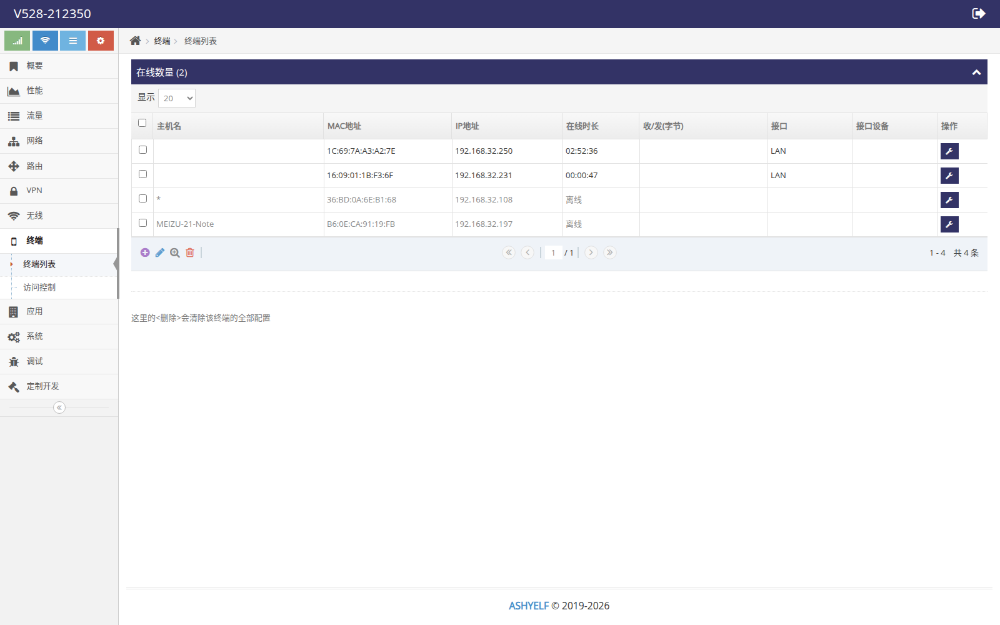

- 本条操作所在页面界面实录。

**界面判断**

| | 条件 |
|--|------|
| **成功** | 页面与操作符合预期 |
| **失败** | 报错或关键控件无效 |
| **skip** | 无 Web 或无该菜单 |

**环境判断**

| | 条件 |
|--|------|
| **成功** | 菜单存在且允许操作 |
| **失败** | 环境导致无法操作 |
| **skip** | 无菜单 → skip；缺外设 → env |

**命令行判断**

| | 条件 |
|--|------|
| **成功** | HE 可读/可写与界面一致 |
| **失败** | HE 失败非环境 |
| **skip** | 无法 Telnet |

**本条总评**

| 判定类 | 结果（执行时勾选） |
|--------|--------------------|
| 界面 | ☐ pass　☐ fail　☐ skip |
| 环境 | ☐ pass　☐ fail　☐ skip |
| 命令行 | ☐ pass　☐ fail　☐ skip |
| **总评** | 任一类 fail → 本条 fail；已测类均为 pass、其余 skip → 本条 pass；三类皆 skip → env |


**恢复**  
无需恢复。

---
### STA-LIST-02 列字段可读

**功能说明**  
查看 MAC/IP/名称等列（可空表）。

**侧栏路径**  
`终端 → 终端列表`

**需要的环境**（勾选已有项）

- [ ] Web 可打开 `http://192.168.32.100/`
- [ ] 已按 LOGIN-02 登录 Web（或本条自行登录）

**步骤**

#### 1. 界面

1. 打开 `终端 → 终端列表`。
2. 查看 MAC/IP/名称等列（可空表）。

#### 2. 命令行

Telnet 登录后在 eline（`$`）执行，或 ashy：`he '…'`：

```text
land@machine.status
```

**截图**


- 本条操作所在页面界面实录。

**界面判断**

| | 条件 |
|--|------|
| **成功** | 页面与操作符合预期 |
| **失败** | 报错或关键控件无效 |
| **skip** | 无 Web 或无该菜单 |

**环境判断**

| | 条件 |
|--|------|
| **成功** | 菜单存在且允许操作 |
| **失败** | 环境导致无法操作 |
| **skip** | 无菜单 → skip；缺外设 → env |

**命令行判断**

| | 条件 |
|--|------|
| **成功** | HE 可读/可写与界面一致 |
| **失败** | HE 失败非环境 |
| **skip** | 无法 Telnet |

**本条总评**

| 判定类 | 结果（执行时勾选） |
|--------|--------------------|
| 界面 | ☐ pass　☐ fail　☐ skip |
| 环境 | ☐ pass　☐ fail　☐ skip |
| 命令行 | ☐ pass　☐ fail　☐ skip |
| **总评** | 任一类 fail → 本条 fail；已测类均为 pass、其余 skip → 本条 pass；三类皆 skip → env |


**恢复**  
无需恢复。

---
### STA-LIST-03 编辑终端名称恢复

**功能说明**  
有终端时改名称再改回；无终端 env。

**侧栏路径**  
`终端 → 终端列表`

**需要的环境**（勾选已有项）

- [ ] Web 可打开 `http://192.168.32.100/`
- [ ] 已按 LOGIN-02 登录 Web（或本条自行登录）

**步骤**

#### 1. 界面

1. 打开 `终端 → 终端列表`。
2. 有终端时改名称再改回；无终端 env。

#### 2. 命令行

Telnet 登录后在 eline（`$`）执行，或 ashy：`he '…'`：

```text
land@machine.status
```

**截图**


- 本条操作所在页面界面实录。

**界面判断**

| | 条件 |
|--|------|
| **成功** | 页面与操作符合预期 |
| **失败** | 报错或关键控件无效 |
| **skip** | 无 Web 或无该菜单 |

**环境判断**

| | 条件 |
|--|------|
| **成功** | 菜单存在且允许操作 |
| **失败** | 环境导致无法操作 |
| **skip** | 无菜单 → skip；缺外设 → env |

**命令行判断**

| | 条件 |
|--|------|
| **成功** | HE 可读/可写与界面一致 |
| **失败** | HE 失败非环境 |
| **skip** | 无法 Telnet |

**本条总评**

| 判定类 | 结果（执行时勾选） |
|--------|--------------------|
| 界面 | ☐ pass　☐ fail　☐ skip |
| 环境 | ☐ pass　☐ fail　☐ skip |
| 命令行 | ☐ pass　☐ fail　☐ skip |
| **总评** | 任一类 fail → 本条 fail；已测类均为 pass、其余 skip → 本条 pass；三类皆 skip → env |


**恢复**  
恢复原名。

---
### STA-LIST-04 Forget/忽略终端

**功能说明**  
有 Forget 则测后恢复策略；无则 skip。

**侧栏路径**  
`终端 → 终端列表`

**需要的环境**（勾选已有项）

- [ ] Web 可打开 `http://192.168.32.100/`
- [ ] 已按 LOGIN-02 登录 Web（或本条自行登录）

**步骤**

#### 1. 界面

1. 打开 `终端 → 终端列表`。
2. 有 Forget 则测后恢复策略；无则 skip。

#### 2. 命令行

Telnet 登录后在 eline（`$`）执行，或 ashy：`he '…'`：

```text
land@machine.status
```

**截图**


- 本条操作所在页面界面实录。

**界面判断**

| | 条件 |
|--|------|
| **成功** | 页面与操作符合预期 |
| **失败** | 报错或关键控件无效 |
| **skip** | 无 Web 或无该菜单 |

**环境判断**

| | 条件 |
|--|------|
| **成功** | 菜单存在且允许操作 |
| **失败** | 环境导致无法操作 |
| **skip** | 无菜单 → skip；缺外设 → env |

**命令行判断**

| | 条件 |
|--|------|
| **成功** | HE 可读/可写与界面一致 |
| **失败** | HE 失败非环境 |
| **skip** | 无法 Telnet |

**本条总评**

| 判定类 | 结果（执行时勾选） |
|--------|--------------------|
| 界面 | ☐ pass　☐ fail　☐ skip |
| 环境 | ☐ pass　☐ fail　☐ skip |
| 命令行 | ☐ pass　☐ fail　☐ skip |
| **总评** | 任一类 fail → 本条 fail；已测类均为 pass、其余 skip → 本条 pass；三类皆 skip → env |


**恢复**  
勿误删生产终端。

---
### STA-ACL-01 访问控制进入

**功能说明**  
进入访问控制。

**侧栏路径**  
`终端 → 访问控制`

**需要的环境**（勾选已有项）

- [ ] Web 可打开 `http://192.168.32.100/`
- [ ] 已按 LOGIN-02 登录 Web（或本条自行登录）

**步骤**

#### 1. 界面

1. 打开 `终端 → 访问控制`。
2. 进入访问控制。

#### 2. 命令行

Telnet 登录后在 eline（`$`）执行，或 ashy：`he '…'`：

```text
land@machine.status
```

**截图**

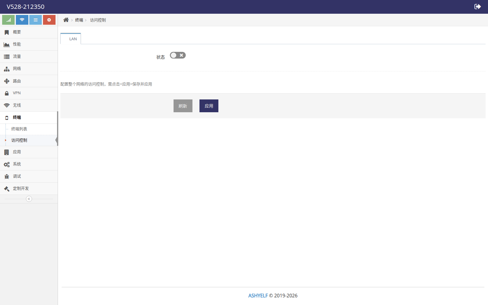

- 本条操作所在页面界面实录。

**界面判断**

| | 条件 |
|--|------|
| **成功** | 页面与操作符合预期 |
| **失败** | 报错或关键控件无效 |
| **skip** | 无 Web 或无该菜单 |

**环境判断**

| | 条件 |
|--|------|
| **成功** | 菜单存在且允许操作 |
| **失败** | 环境导致无法操作 |
| **skip** | 无菜单 → skip；缺外设 → env |

**命令行判断**

| | 条件 |
|--|------|
| **成功** | HE 可读/可写与界面一致 |
| **失败** | HE 失败非环境 |
| **skip** | 无法 Telnet |

**本条总评**

| 判定类 | 结果（执行时勾选） |
|--------|--------------------|
| 界面 | ☐ pass　☐ fail　☐ skip |
| 环境 | ☐ pass　☐ fail　☐ skip |
| 命令行 | ☐ pass　☐ fail　☐ skip |
| **总评** | 任一类 fail → 本条 fail；已测类均为 pass、其余 skip → 本条 pass；三类皆 skip → env |


**恢复**  
无需恢复。

---
### STA-ACL-02 Status 开关恢复

**功能说明**  
切换 Status，恢复。

**侧栏路径**  
`终端 → 访问控制`

**需要的环境**（勾选已有项）

- [ ] Web 可打开 `http://192.168.32.100/`
- [ ] 已按 LOGIN-02 登录 Web（或本条自行登录）

**步骤**

#### 1. 界面

1. 打开 `终端 → 访问控制`。
2. 切换 Status，恢复。

#### 2. 命令行

Telnet 登录后在 eline（`$`）执行，或 ashy：`he '…'`：

```text
land@machine.status
```

**截图**


- 本条操作所在页面界面实录。

**界面判断**

| | 条件 |
|--|------|
| **成功** | 页面与操作符合预期 |
| **失败** | 报错或关键控件无效 |
| **skip** | 无 Web 或无该菜单 |

**环境判断**

| | 条件 |
|--|------|
| **成功** | 菜单存在且允许操作 |
| **失败** | 环境导致无法操作 |
| **skip** | 无菜单 → skip；缺外设 → env |

**命令行判断**

| | 条件 |
|--|------|
| **成功** | HE 可读/可写与界面一致 |
| **失败** | HE 失败非环境 |
| **skip** | 无法 Telnet |

**本条总评**

| 判定类 | 结果（执行时勾选） |
|--------|--------------------|
| 界面 | ☐ pass　☐ fail　☐ skip |
| 环境 | ☐ pass　☐ fail　☐ skip |
| 命令行 | ☐ pass　☐ fail　☐ skip |
| **总评** | 任一类 fail → 本条 fail；已测类均为 pass、其余 skip → 本条 pass；三类皆 skip → env |


**恢复**  
恢复。

---
### STA-ACL-03 切换接口 Tab

**功能说明**  
切换接口 Tab。

**侧栏路径**  
`终端 → 访问控制`

**需要的环境**（勾选已有项）

- [ ] Web 可打开 `http://192.168.32.100/`
- [ ] 已按 LOGIN-02 登录 Web（或本条自行登录）

**步骤**

#### 1. 界面

1. 打开 `终端 → 访问控制`。
2. 切换接口 Tab。

#### 2. 命令行

Telnet 登录后在 eline（`$`）执行，或 ashy：`he '…'`：

```text
land@machine.status
```

**截图**


- 本条操作所在页面界面实录。

**界面判断**

| | 条件 |
|--|------|
| **成功** | 页面与操作符合预期 |
| **失败** | 报错或关键控件无效 |
| **skip** | 无 Web 或无该菜单 |

**环境判断**

| | 条件 |
|--|------|
| **成功** | 菜单存在且允许操作 |
| **失败** | 环境导致无法操作 |
| **skip** | 无菜单 → skip；缺外设 → env |

**命令行判断**

| | 条件 |
|--|------|
| **成功** | HE 可读/可写与界面一致 |
| **失败** | HE 失败非环境 |
| **skip** | 无法 Telnet |

**本条总评**

| 判定类 | 结果（执行时勾选） |
|--------|--------------------|
| 界面 | ☐ pass　☐ fail　☐ skip |
| 环境 | ☐ pass　☐ fail　☐ skip |
| 命令行 | ☐ pass　☐ fail　☐ skip |
| **总评** | 任一类 fail → 本条 fail；已测类均为 pass、其余 skip → 本条 pass；三类皆 skip → env |


**恢复**  
无需恢复。

---
### STA-ACL-04 新增一条 ACL 后删除

**功能说明**  
新增 ACL 后删除。

**侧栏路径**  
`终端 → 访问控制`

**需要的环境**（勾选已有项）

- [ ] Web 可打开 `http://192.168.32.100/`
- [ ] 已按 LOGIN-02 登录 Web（或本条自行登录）

**步骤**

#### 1. 界面

1. 打开 `终端 → 访问控制`。
2. 新增 ACL 后删除。

#### 2. 命令行

Telnet 登录后在 eline（`$`）执行，或 ashy：`he '…'`：

```text
land@machine.status
```

**截图**


- 本条操作所在页面界面实录。

**界面判断**

| | 条件 |
|--|------|
| **成功** | 页面与操作符合预期 |
| **失败** | 报错或关键控件无效 |
| **skip** | 无 Web 或无该菜单 |

**环境判断**

| | 条件 |
|--|------|
| **成功** | 菜单存在且允许操作 |
| **失败** | 环境导致无法操作 |
| **skip** | 无菜单 → skip；缺外设 → env |

**命令行判断**

| | 条件 |
|--|------|
| **成功** | HE 可读/可写与界面一致 |
| **失败** | HE 失败非环境 |
| **skip** | 无法 Telnet |

**本条总评**

| 判定类 | 结果（执行时勾选） |
|--------|--------------------|
| 界面 | ☐ pass　☐ fail　☐ skip |
| 环境 | ☐ pass　☐ fail　☐ skip |
| 命令行 | ☐ pass　☐ fail　☐ skip |
| **总评** | 任一类 fail → 本条 fail；已测类均为 pass、其余 skip → 本条 pass；三类皆 skip → env |


**恢复**  
清理。

---
## 10 应用 Application

### APP-IO-01 IO 管理进入

**功能说明**  
进入 IO 管理。

**侧栏路径**  
`应用 → IO管理`

**需要的环境**（勾选已有项）

- [ ] Web 可打开 `http://192.168.32.100/`
- [ ] 已按 LOGIN-02 登录 Web（或本条自行登录）

**步骤**

#### 1. 界面

1. 打开 `应用 → IO管理`。
2. 进入 IO 管理。

#### 2. 命令行

Telnet 登录后在 eline（`$`）执行，或 ashy：`he '…'`：

```text
agent 或 io 相关 com
land@machine.status
```

**截图**

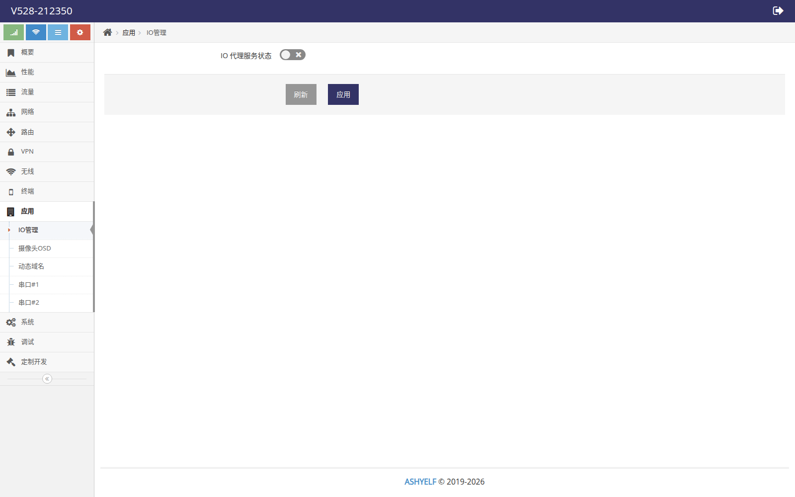

- 本条操作所在页面界面实录。

**界面判断**

| | 条件 |
|--|------|
| **成功** | 页面与操作符合预期 |
| **失败** | 报错或关键控件无效 |
| **skip** | 无 Web 或无该菜单 |

**环境判断**

| | 条件 |
|--|------|
| **成功** | 菜单存在且允许操作 |
| **失败** | 环境导致无法操作 |
| **skip** | 无菜单 → skip；缺外设 → env |

**命令行判断**

| | 条件 |
|--|------|
| **成功** | HE 可读/可写与界面一致 |
| **失败** | HE 失败非环境 |
| **skip** | 无法 Telnet |

**本条总评**

| 判定类 | 结果（执行时勾选） |
|--------|--------------------|
| 界面 | ☐ pass　☐ fail　☐ skip |
| 环境 | ☐ pass　☐ fail　☐ skip |
| 命令行 | ☐ pass　☐ fail　☐ skip |
| **总评** | 任一类 fail → 本条 fail；已测类均为 pass、其余 skip → 本条 pass；三类皆 skip → env |


**恢复**  
无需恢复。

---
### APP-IO-02 切换 g1/g2/g3 Tab

**功能说明**  
切换 g1/g2/g3。

**侧栏路径**  
`应用 → IO管理`

**需要的环境**（勾选已有项）

- [ ] Web 可打开 `http://192.168.32.100/`
- [ ] 已按 LOGIN-02 登录 Web（或本条自行登录）

**步骤**

#### 1. 界面

1. 打开 `应用 → IO管理`。
2. 切换 g1/g2/g3。

#### 2. 命令行

Telnet 登录后在 eline（`$`）执行，或 ashy：`he '…'`：

```text
land@machine.status
land@machine.status
```

**截图**


- 本条操作所在页面界面实录。

**界面判断**

| | 条件 |
|--|------|
| **成功** | 页面与操作符合预期 |
| **失败** | 报错或关键控件无效 |
| **skip** | 无 Web 或无该菜单 |

**环境判断**

| | 条件 |
|--|------|
| **成功** | 菜单存在且允许操作 |
| **失败** | 环境导致无法操作 |
| **skip** | 无菜单 → skip；缺外设 → env |

**命令行判断**

| | 条件 |
|--|------|
| **成功** | HE 可读/可写与界面一致 |
| **失败** | HE 失败非环境 |
| **skip** | 无法 Telnet |

**本条总评**

| 判定类 | 结果（执行时勾选） |
|--------|--------------------|
| 界面 | ☐ pass　☐ fail　☐ skip |
| 环境 | ☐ pass　☐ fail　☐ skip |
| 命令行 | ☐ pass　☐ fail　☐ skip |
| **总评** | 任一类 fail → 本条 fail；已测类均为 pass、其余 skip → 本条 pass；三类皆 skip → env |


**恢复**  
无需恢复。

---
### APP-IO-03 查看初始电平映射

**功能说明**  
查看电平映射。

**侧栏路径**  
`应用 → IO管理`

**需要的环境**（勾选已有项）

- [ ] Web 可打开 `http://192.168.32.100/`
- [ ] 已按 LOGIN-02 登录 Web（或本条自行登录）

**步骤**

#### 1. 界面

1. 打开 `应用 → IO管理`。
2. 查看电平映射。

#### 2. 命令行

Telnet 登录后在 eline（`$`）执行，或 ashy：`he '…'`：

```text
land@machine.status
land@machine.status
```

**截图**


- 本条操作所在页面界面实录。

**界面判断**

| | 条件 |
|--|------|
| **成功** | 页面与操作符合预期 |
| **失败** | 报错或关键控件无效 |
| **skip** | 无 Web 或无该菜单 |

**环境判断**

| | 条件 |
|--|------|
| **成功** | 菜单存在且允许操作 |
| **失败** | 环境导致无法操作 |
| **skip** | 无菜单 → skip；缺外设 → env |

**命令行判断**

| | 条件 |
|--|------|
| **成功** | HE 可读/可写与界面一致 |
| **失败** | HE 失败非环境 |
| **skip** | 无法 Telnet |

**本条总评**

| 判定类 | 结果（执行时勾选） |
|--------|--------------------|
| 界面 | ☐ pass　☐ fail　☐ skip |
| 环境 | ☐ pass　☐ fail　☐ skip |
| 命令行 | ☐ pass　☐ fail　☐ skip |
| **总评** | 任一类 fail → 本条 fail；已测类均为 pass、其余 skip → 本条 pass；三类皆 skip → env |


**恢复**  
无需恢复。

---
### APP-IO-04 改 g1 输出后恢复

**功能说明**  
改 g1 输出，表笔确认（无表笔 env），恢复。

**侧栏路径**  
`应用 → IO管理`

**需要的环境**（勾选已有项）

- [ ] Web 可打开 `http://192.168.32.100/`
- [ ] 已按 LOGIN-02 登录 Web（或本条自行登录）

**步骤**

#### 1. 界面

1. 打开 `应用 → IO管理`。
2. 改 g1 输出，表笔确认（无表笔 env），恢复。

#### 2. 命令行

Telnet 登录后在 eline（`$`）执行，或 ashy：`he '…'`：

```text
land@machine.status
land@machine.status
```

**截图**


- 本条操作所在页面界面实录。

**界面判断**

| | 条件 |
|--|------|
| **成功** | 页面与操作符合预期 |
| **失败** | 报错或关键控件无效 |
| **skip** | 无 Web 或无该菜单 |

**环境判断**

| | 条件 |
|--|------|
| **成功** | 菜单存在且允许操作 |
| **失败** | 环境导致无法操作 |
| **skip** | 无菜单 → skip；缺外设 → env |

**命令行判断**

| | 条件 |
|--|------|
| **成功** | HE 可读/可写与界面一致 |
| **失败** | HE 失败非环境 |
| **skip** | 无法 Telnet |

**本条总评**

| 判定类 | 结果（执行时勾选） |
|--------|--------------------|
| 界面 | ☐ pass　☐ fail　☐ skip |
| 环境 | ☐ pass　☐ fail　☐ skip |
| 命令行 | ☐ pass　☐ fail　☐ skip |
| **总评** | 任一类 fail → 本条 fail；已测类均为 pass、其余 skip → 本条 pass；三类皆 skip → env |


**恢复**  
恢复原电平。

---
### APP-IO-05 IO Proxy Service 开关查看

**功能说明**  
查看 Proxy Service 开关。

**侧栏路径**  
`应用 → IO管理`

**需要的环境**（勾选已有项）

- [ ] Web 可打开 `http://192.168.32.100/`
- [ ] 已按 LOGIN-02 登录 Web（或本条自行登录）

**步骤**

#### 1. 界面

1. 打开 `应用 → IO管理`。
2. 查看 Proxy Service 开关。

#### 2. 命令行

Telnet 登录后在 eline（`$`）执行，或 ashy：`he '…'`：

```text
land@machine.status
land@machine.status
```

**截图**


- 本条操作所在页面界面实录。

**界面判断**

| | 条件 |
|--|------|
| **成功** | 页面与操作符合预期 |
| **失败** | 报错或关键控件无效 |
| **skip** | 无 Web 或无该菜单 |

**环境判断**

| | 条件 |
|--|------|
| **成功** | 菜单存在且允许操作 |
| **失败** | 环境导致无法操作 |
| **skip** | 无菜单 → skip；缺外设 → env |

**命令行判断**

| | 条件 |
|--|------|
| **成功** | HE 可读/可写与界面一致 |
| **失败** | HE 失败非环境 |
| **skip** | 无法 Telnet |

**本条总评**

| 判定类 | 结果（执行时勾选） |
|--------|--------------------|
| 界面 | ☐ pass　☐ fail　☐ skip |
| 环境 | ☐ pass　☐ fail　☐ skip |
| 命令行 | ☐ pass　☐ fail　☐ skip |
| **总评** | 任一类 fail → 本条 fail；已测类均为 pass、其余 skip → 本条 pass；三类皆 skip → env |


**恢复**  
轻改须恢复。

---
### APP-IO-06 MQTT/Client 参数表单可读

**功能说明**  
查看 MQTT/Client 表单。

**侧栏路径**  
`应用 → IO管理`

**需要的环境**（勾选已有项）

- [ ] Web 可打开 `http://192.168.32.100/`
- [ ] 已按 LOGIN-02 登录 Web（或本条自行登录）

**步骤**

#### 1. 界面

1. 打开 `应用 → IO管理`。
2. 查看 MQTT/Client 表单。

#### 2. 命令行

Telnet 登录后在 eline（`$`）执行，或 ashy：`he '…'`：

```text
land@machine.status
land@machine.status
```

**截图**


- 本条操作所在页面界面实录。

**界面判断**

| | 条件 |
|--|------|
| **成功** | 页面与操作符合预期 |
| **失败** | 报错或关键控件无效 |
| **skip** | 无 Web 或无该菜单 |

**环境判断**

| | 条件 |
|--|------|
| **成功** | 菜单存在且允许操作 |
| **失败** | 环境导致无法操作 |
| **skip** | 无菜单 → skip；缺外设 → env |

**命令行判断**

| | 条件 |
|--|------|
| **成功** | HE 可读/可写与界面一致 |
| **失败** | HE 失败非环境 |
| **skip** | 无法 Telnet |

**本条总评**

| 判定类 | 结果（执行时勾选） |
|--------|--------------------|
| 界面 | ☐ pass　☐ fail　☐ skip |
| 环境 | ☐ pass　☐ fail　☐ skip |
| 命令行 | ☐ pass　☐ fail　☐ skip |
| **总评** | 任一类 fail → 本条 fail；已测类均为 pass、其余 skip → 本条 pass；三类皆 skip → env |


**恢复**  
无需恢复。

---
### APP-IO-07 远程平台 IO

**功能说明**  
无 center 账号则 env。

**侧栏路径**  
`应用 → IO管理`

**需要的环境**（勾选已有项）

- [ ] Web 可打开 `http://192.168.32.100/`
- [ ] 已按 LOGIN-02 登录 Web（或本条自行登录）

**步骤**

#### 1. 界面

1. 打开 `应用 → IO管理`。
2. 无 center 账号则 env。

#### 2. 命令行

Telnet 登录后在 eline（`$`）执行，或 ashy：`he '…'`：

```text
land@machine.status
land@machine.status
```

**截图**


- 本条操作所在页面界面实录。

**界面判断**

| | 条件 |
|--|------|
| **成功** | 页面与操作符合预期 |
| **失败** | 报错或关键控件无效 |
| **skip** | 无 Web 或无该菜单 |

**环境判断**

| | 条件 |
|--|------|
| **成功** | 菜单存在且允许操作 |
| **失败** | 环境导致无法操作 |
| **skip** | 无菜单 → skip；缺外设 → env |

**命令行判断**

| | 条件 |
|--|------|
| **成功** | HE 可读/可写与界面一致 |
| **失败** | HE 失败非环境 |
| **skip** | 无法 Telnet |

**本条总评**

| 判定类 | 结果（执行时勾选） |
|--------|--------------------|
| 界面 | ☐ pass　☐ fail　☐ skip |
| 环境 | ☐ pass　☐ fail　☐ skip |
| 命令行 | ☐ pass　☐ fail　☐ skip |
| **总评** | 任一类 fail → 本条 fail；已测类均为 pass、其余 skip → 本条 pass；三类皆 skip → env |


**恢复**  
勿留测试平台配置。

---
### APP-CAM-01 摄像头 OSD 进入

**功能说明**  
进入摄像头 OSD。

**侧栏路径**  
`应用 → 摄像头OSD`

**需要的环境**（勾选已有项）

- [ ] Web 可打开 `http://192.168.32.100/`
- [ ] 已按 LOGIN-02 登录 Web（或本条自行登录）

**步骤**

#### 1. 界面

1. 打开 `应用 → 摄像头OSD`。
2. 进入摄像头 OSD。

#### 2. 命令行

Telnet 登录后在 eline（`$`）执行，或 ashy：`he '…'`：

```text
land@machine.status
land@machine.status
```

**截图**

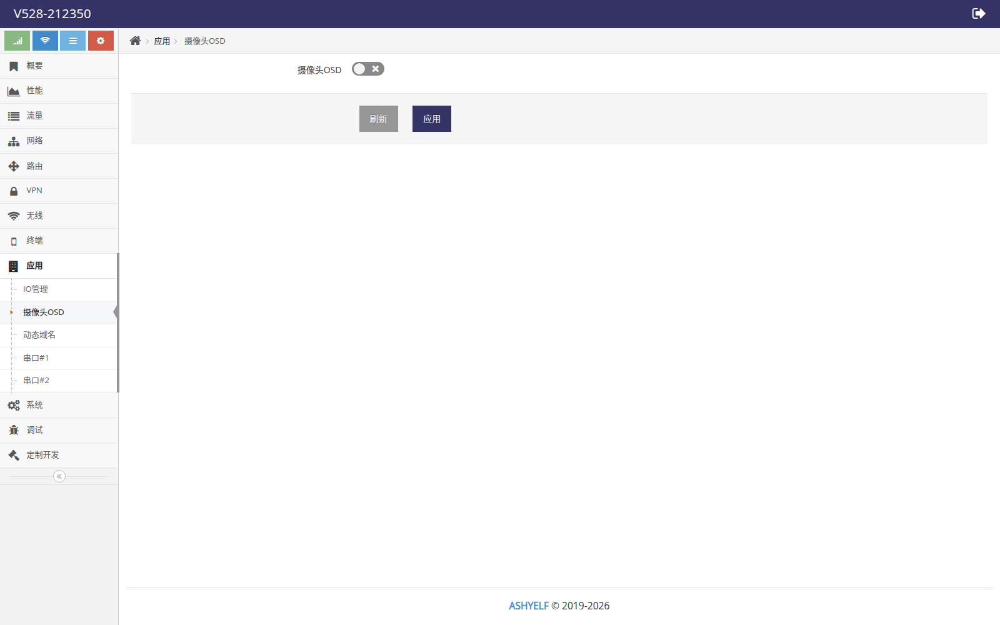

- 本条操作所在页面界面实录。

**界面判断**

| | 条件 |
|--|------|
| **成功** | 页面与操作符合预期 |
| **失败** | 报错或关键控件无效 |
| **skip** | 无 Web 或无该菜单 |

**环境判断**

| | 条件 |
|--|------|
| **成功** | 菜单存在且允许操作 |
| **失败** | 环境导致无法操作 |
| **skip** | 无菜单 → skip；缺外设 → env |

**命令行判断**

| | 条件 |
|--|------|
| **成功** | HE 可读/可写与界面一致 |
| **失败** | HE 失败非环境 |
| **skip** | 无法 Telnet |

**本条总评**

| 判定类 | 结果（执行时勾选） |
|--------|--------------------|
| 界面 | ☐ pass　☐ fail　☐ skip |
| 环境 | ☐ pass　☐ fail　☐ skip |
| 命令行 | ☐ pass　☐ fail　☐ skip |
| **总评** | 任一类 fail → 本条 fail；已测类均为 pass、其余 skip → 本条 pass；三类皆 skip → env |


**恢复**  
无需恢复。

---
### APP-CAM-02 开关 Camera OSD

**功能说明**  
切换开关，恢复。

**侧栏路径**  
`应用 → 摄像头OSD`

**需要的环境**（勾选已有项）

- [ ] Web 可打开 `http://192.168.32.100/`
- [ ] 已按 LOGIN-02 登录 Web（或本条自行登录）

**步骤**

#### 1. 界面

1. 打开 `应用 → 摄像头OSD`。
2. 切换开关，恢复。

#### 2. 命令行

Telnet 登录后在 eline（`$`）执行，或 ashy：`he '…'`：

```text
land@machine.status
land@machine.status
```

**截图**


- 本条操作所在页面界面实录。

**界面判断**

| | 条件 |
|--|------|
| **成功** | 页面与操作符合预期 |
| **失败** | 报错或关键控件无效 |
| **skip** | 无 Web 或无该菜单 |

**环境判断**

| | 条件 |
|--|------|
| **成功** | 菜单存在且允许操作 |
| **失败** | 环境导致无法操作 |
| **skip** | 无菜单 → skip；缺外设 → env |

**命令行判断**

| | 条件 |
|--|------|
| **成功** | HE 可读/可写与界面一致 |
| **失败** | HE 失败非环境 |
| **skip** | 无法 Telnet |

**本条总评**

| 判定类 | 结果（执行时勾选） |
|--------|--------------------|
| 界面 | ☐ pass　☐ fail　☐ skip |
| 环境 | ☐ pass　☐ fail　☐ skip |
| 命令行 | ☐ pass　☐ fail　☐ skip |
| **总评** | 任一类 fail → 本条 fail；已测类均为 pass、其余 skip → 本条 pass；三类皆 skip → env |


**恢复**  
恢复。

---
### APP-CAM-03 填写 IP/账号表单

**功能说明**  
填表单；无摄像头 env。

**侧栏路径**  
`应用 → 摄像头OSD`

**需要的环境**（勾选已有项）

- [ ] Web 可打开 `http://192.168.32.100/`
- [ ] 已按 LOGIN-02 登录 Web（或本条自行登录）

**步骤**

#### 1. 界面

1. 打开 `应用 → 摄像头OSD`。
2. 填表单；无摄像头 env。

#### 2. 命令行

Telnet 登录后在 eline（`$`）执行，或 ashy：`he '…'`：

```text
land@machine.status
land@machine.status
```

**截图**


- 本条操作所在页面界面实录。

**界面判断**

| | 条件 |
|--|------|
| **成功** | 页面与操作符合预期 |
| **失败** | 报错或关键控件无效 |
| **skip** | 无 Web 或无该菜单 |

**环境判断**

| | 条件 |
|--|------|
| **成功** | 菜单存在且允许操作 |
| **失败** | 环境导致无法操作 |
| **skip** | 无菜单 → skip；缺外设 → env |

**命令行判断**

| | 条件 |
|--|------|
| **成功** | HE 可读/可写与界面一致 |
| **失败** | HE 失败非环境 |
| **skip** | 无法 Telnet |

**本条总评**

| 判定类 | 结果（执行时勾选） |
|--------|--------------------|
| 界面 | ☐ pass　☐ fail　☐ skip |
| 环境 | ☐ pass　☐ fail　☐ skip |
| 命令行 | ☐ pass　☐ fail　☐ skip |
| **总评** | 任一类 fail → 本条 fail；已测类均为 pass、其余 skip → 本条 pass；三类皆 skip → env |


**恢复**  
恢复空/原值。

---
### APP-CAM-04 增删一条 Mapping 规则

**功能说明**  
增删 Mapping。

**侧栏路径**  
`应用 → 摄像头OSD`

**需要的环境**（勾选已有项）

- [ ] Web 可打开 `http://192.168.32.100/`
- [ ] 已按 LOGIN-02 登录 Web（或本条自行登录）

**步骤**

#### 1. 界面

1. 打开 `应用 → 摄像头OSD`。
2. 增删 Mapping。

#### 2. 命令行

Telnet 登录后在 eline（`$`）执行，或 ashy：`he '…'`：

```text
land@machine.status
land@machine.status
```

**截图**


- 本条操作所在页面界面实录。

**界面判断**

| | 条件 |
|--|------|
| **成功** | 页面与操作符合预期 |
| **失败** | 报错或关键控件无效 |
| **skip** | 无 Web 或无该菜单 |

**环境判断**

| | 条件 |
|--|------|
| **成功** | 菜单存在且允许操作 |
| **失败** | 环境导致无法操作 |
| **skip** | 无菜单 → skip；缺外设 → env |

**命令行判断**

| | 条件 |
|--|------|
| **成功** | HE 可读/可写与界面一致 |
| **失败** | HE 失败非环境 |
| **skip** | 无法 Telnet |

**本条总评**

| 判定类 | 结果（执行时勾选） |
|--------|--------------------|
| 界面 | ☐ pass　☐ fail　☐ skip |
| 环境 | ☐ pass　☐ fail　☐ skip |
| 命令行 | ☐ pass　☐ fail　☐ skip |
| **总评** | 任一类 fail → 本条 fail；已测类均为 pass、其余 skip → 本条 pass；三类皆 skip → env |


**恢复**  
清理规则。

---
### APP-DDNS-01 DDNS 进入

**功能说明**  
进入 DDNS。

**侧栏路径**  
`应用 → 动态域名`

**需要的环境**（勾选已有项）

- [ ] Web 可打开 `http://192.168.32.100/`
- [ ] 已按 LOGIN-02 登录 Web（或本条自行登录）

**步骤**

#### 1. 界面

1. 打开 `应用 → 动态域名`。
2. 进入 DDNS。

#### 2. 命令行

Telnet 登录后在 eline（`$`）执行，或 ashy：`he '…'`：

```text
land@machine.status
land@machine.status
```

**截图**

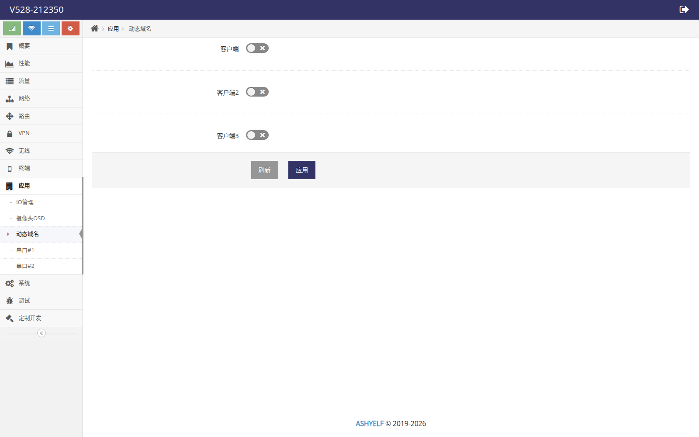

- 本条操作所在页面界面实录。

**界面判断**

| | 条件 |
|--|------|
| **成功** | 页面与操作符合预期 |
| **失败** | 报错或关键控件无效 |
| **skip** | 无 Web 或无该菜单 |

**环境判断**

| | 条件 |
|--|------|
| **成功** | 菜单存在且允许操作 |
| **失败** | 环境导致无法操作 |
| **skip** | 无菜单 → skip；缺外设 → env |

**命令行判断**

| | 条件 |
|--|------|
| **成功** | HE 可读/可写与界面一致 |
| **失败** | HE 失败非环境 |
| **skip** | 无法 Telnet |

**本条总评**

| 判定类 | 结果（执行时勾选） |
|--------|--------------------|
| 界面 | ☐ pass　☐ fail　☐ skip |
| 环境 | ☐ pass　☐ fail　☐ skip |
| 命令行 | ☐ pass　☐ fail　☐ skip |
| **总评** | 任一类 fail → 本条 fail；已测类均为 pass、其余 skip → 本条 pass；三类皆 skip → env |


**恢复**  
无需恢复。

---
### APP-DDNS-02 Client1 开关

**功能说明**  
切换 Client1，恢复。

**侧栏路径**  
`应用 → 动态域名`

**需要的环境**（勾选已有项）

- [ ] Web 可打开 `http://192.168.32.100/`
- [ ] 已按 LOGIN-02 登录 Web（或本条自行登录）

**步骤**

#### 1. 界面

1. 打开 `应用 → 动态域名`。
2. 切换 Client1，恢复。

#### 2. 命令行

Telnet 登录后在 eline（`$`）执行，或 ashy：`he '…'`：

```text
land@machine.status
land@machine.status
```

**截图**


- 本条操作所在页面界面实录。

**界面判断**

| | 条件 |
|--|------|
| **成功** | 页面与操作符合预期 |
| **失败** | 报错或关键控件无效 |
| **skip** | 无 Web 或无该菜单 |

**环境判断**

| | 条件 |
|--|------|
| **成功** | 菜单存在且允许操作 |
| **失败** | 环境导致无法操作 |
| **skip** | 无菜单 → skip；缺外设 → env |

**命令行判断**

| | 条件 |
|--|------|
| **成功** | HE 可读/可写与界面一致 |
| **失败** | HE 失败非环境 |
| **skip** | 无法 Telnet |

**本条总评**

| 判定类 | 结果（执行时勾选） |
|--------|--------------------|
| 界面 | ☐ pass　☐ fail　☐ skip |
| 环境 | ☐ pass　☐ fail　☐ skip |
| 命令行 | ☐ pass　☐ fail　☐ skip |
| **总评** | 任一类 fail → 本条 fail；已测类均为 pass、其余 skip → 本条 pass；三类皆 skip → env |


**恢复**  
恢复。

---
### APP-DDNS-03 选服务商填域名账号

**功能说明**  
无账号 env。

**侧栏路径**  
`应用 → 动态域名`

**需要的环境**（勾选已有项）

- [ ] Web 可打开 `http://192.168.32.100/`
- [ ] 已按 LOGIN-02 登录 Web（或本条自行登录）

**步骤**

#### 1. 界面

1. 打开 `应用 → 动态域名`。
2. 无账号 env。

#### 2. 命令行

Telnet 登录后在 eline（`$`）执行，或 ashy：`he '…'`：

```text
land@machine.status
land@machine.status
```

**截图**


- 本条操作所在页面界面实录。

**界面判断**

| | 条件 |
|--|------|
| **成功** | 页面与操作符合预期 |
| **失败** | 报错或关键控件无效 |
| **skip** | 无 Web 或无该菜单 |

**环境判断**

| | 条件 |
|--|------|
| **成功** | 菜单存在且允许操作 |
| **失败** | 环境导致无法操作 |
| **skip** | 无菜单 → skip；缺外设 → env |

**命令行判断**

| | 条件 |
|--|------|
| **成功** | HE 可读/可写与界面一致 |
| **失败** | HE 失败非环境 |
| **skip** | 无法 Telnet |

**本条总评**

| 判定类 | 结果（执行时勾选） |
|--------|--------------------|
| 界面 | ☐ pass　☐ fail　☐ skip |
| 环境 | ☐ pass　☐ fail　☐ skip |
| 命令行 | ☐ pass　☐ fail　☐ skip |
| **总评** | 任一类 fail → 本条 fail；已测类均为 pass、其余 skip → 本条 pass；三类皆 skip → env |


**恢复**  
清测试账号。

---
### APP-DDNS-04 State 字段可读

**功能说明**  
查看 State。

**侧栏路径**  
`应用 → 动态域名`

**需要的环境**（勾选已有项）

- [ ] Web 可打开 `http://192.168.32.100/`
- [ ] 已按 LOGIN-02 登录 Web（或本条自行登录）

**步骤**

#### 1. 界面

1. 打开 `应用 → 动态域名`。
2. 查看 State。

#### 2. 命令行

Telnet 登录后在 eline（`$`）执行，或 ashy：`he '…'`：

```text
land@machine.status
land@machine.status
```

**截图**


- 本条操作所在页面界面实录。

**界面判断**

| | 条件 |
|--|------|
| **成功** | 页面与操作符合预期 |
| **失败** | 报错或关键控件无效 |
| **skip** | 无 Web 或无该菜单 |

**环境判断**

| | 条件 |
|--|------|
| **成功** | 菜单存在且允许操作 |
| **失败** | 环境导致无法操作 |
| **skip** | 无菜单 → skip；缺外设 → env |

**命令行判断**

| | 条件 |
|--|------|
| **成功** | HE 可读/可写与界面一致 |
| **失败** | HE 失败非环境 |
| **skip** | 无法 Telnet |

**本条总评**

| 判定类 | 结果（执行时勾选） |
|--------|--------------------|
| 界面 | ☐ pass　☐ fail　☐ skip |
| 环境 | ☐ pass　☐ fail　☐ skip |
| 命令行 | ☐ pass　☐ fail　☐ skip |
| **总评** | 任一类 fail → 本条 fail；已测类均为 pass、其余 skip → 本条 pass；三类皆 skip → env |


**恢复**  
无需恢复。

---
### APP-DDNS-05 Client2/3 槽位进入查看

**功能说明**  
查看 Client2/3。

**侧栏路径**  
`应用 → 动态域名`

**需要的环境**（勾选已有项）

- [ ] Web 可打开 `http://192.168.32.100/`
- [ ] 已按 LOGIN-02 登录 Web（或本条自行登录）

**步骤**

#### 1. 界面

1. 打开 `应用 → 动态域名`。
2. 查看 Client2/3。

#### 2. 命令行

Telnet 登录后在 eline（`$`）执行，或 ashy：`he '…'`：

```text
land@machine.status
land@machine.status
```

**截图**


- 本条操作所在页面界面实录。

**界面判断**

| | 条件 |
|--|------|
| **成功** | 页面与操作符合预期 |
| **失败** | 报错或关键控件无效 |
| **skip** | 无 Web 或无该菜单 |

**环境判断**

| | 条件 |
|--|------|
| **成功** | 菜单存在且允许操作 |
| **失败** | 环境导致无法操作 |
| **skip** | 无菜单 → skip；缺外设 → env |

**命令行判断**

| | 条件 |
|--|------|
| **成功** | HE 可读/可写与界面一致 |
| **失败** | HE 失败非环境 |
| **skip** | 无法 Telnet |

**本条总评**

| 判定类 | 结果（执行时勾选） |
|--------|--------------------|
| 界面 | ☐ pass　☐ fail　☐ skip |
| 环境 | ☐ pass　☐ fail　☐ skip |
| 命令行 | ☐ pass　☐ fail　☐ skip |
| **总评** | 任一类 fail → 本条 fail；已测类均为 pass、其余 skip → 本条 pass；三类皆 skip → env |


**恢复**  
无需恢复。

---
### APP-GNSS-01 定位进入

**功能说明**  
无 GNSS 菜单 → skip。

**侧栏路径**  
`应用 →（无定位）`

**需要的环境**（勾选已有项）

- [ ] Web 可打开 `http://192.168.32.100/`
- [ ] 已按 LOGIN-02 登录 Web（或本条自行登录）

**步骤**

#### 1. 界面

1. 打开 `应用 →（无定位）`。
2. 无 GNSS 菜单 → skip。

#### 2. 命令行

Telnet 登录后在 eline（`$`）执行，或 ashy：`he '…'`：

```text
land@machine.status
land@machine.status
```

**截图**


- 本机固件侧栏无本条菜单：界面判定记 **skip**（不算产品失败）。下图为同产品相关页面实录，供对照。

**界面判断**

| | 条件 |
|--|------|
| **成功** | 页面与操作符合预期 |
| **失败** | 报错或关键控件无效 |
| **skip** | 无 Web 或无该菜单 |

**环境判断**

| | 条件 |
|--|------|
| **成功** | 菜单存在且允许操作 |
| **失败** | 环境导致无法操作 |
| **skip** | 无菜单 → skip；缺外设 → env |

**命令行判断**

| | 条件 |
|--|------|
| **成功** | HE 可读/可写与界面一致 |
| **失败** | HE 失败非环境 |
| **skip** | 无法 Telnet |

**本条总评**

| 判定类 | 结果（执行时勾选） |
|--------|--------------------|
| 界面 | ☐ pass　☐ fail　☐ skip |
| 环境 | ☐ pass　☐ fail　☐ skip |
| 命令行 | ☐ pass　☐ fail　☐ skip |
| **总评** | 任一类 fail → 本条 fail；已测类均为 pass、其余 skip → 本条 pass；三类皆 skip → env |


**恢复**  
skip

---
### APP-GNSS-02 Status 启用

**功能说明**  
skip。

**侧栏路径**  
`应用 →（无）`

**需要的环境**（勾选已有项）

- [ ] Web 可打开 `http://192.168.32.100/`
- [ ] 已按 LOGIN-02 登录 Web（或本条自行登录）

**步骤**

#### 1. 界面

1. 打开 `应用 →（无）`。
2. skip。

#### 2. 命令行

Telnet 登录后在 eline（`$`）执行，或 ashy：`he '…'`：

```text
land@machine.status
land@machine.status
```

**截图**


- 本机固件侧栏无本条菜单：界面判定记 **skip**（不算产品失败）。下图为同产品相关页面实录，供对照。

**界面判断**

| | 条件 |
|--|------|
| **成功** | 页面与操作符合预期 |
| **失败** | 报错或关键控件无效 |
| **skip** | 无 Web 或无该菜单 |

**环境判断**

| | 条件 |
|--|------|
| **成功** | 菜单存在且允许操作 |
| **失败** | 环境导致无法操作 |
| **skip** | 无菜单 → skip；缺外设 → env |

**命令行判断**

| | 条件 |
|--|------|
| **成功** | HE 可读/可写与界面一致 |
| **失败** | HE 失败非环境 |
| **skip** | 无法 Telnet |

**本条总评**

| 判定类 | 结果（执行时勾选） |
|--------|--------------------|
| 界面 | ☐ pass　☐ fail　☐ skip |
| 环境 | ☐ pass　☐ fail　☐ skip |
| 命令行 | ☐ pass　☐ fail　☐ skip |
| **总评** | 任一类 fail → 本条 fail；已测类均为 pass、其余 skip → 本条 pass；三类皆 skip → env |


**恢复**  
skip

---
### APP-GNSS-03 Fix/坐标字段可读

**功能说明**  
skip。

**侧栏路径**  
`应用 →（无）`

**需要的环境**（勾选已有项）

- [ ] Web 可打开 `http://192.168.32.100/`
- [ ] 已按 LOGIN-02 登录 Web（或本条自行登录）

**步骤**

#### 1. 界面

1. 打开 `应用 →（无）`。
2. skip。

#### 2. 命令行

Telnet 登录后在 eline（`$`）执行，或 ashy：`he '…'`：

```text
land@machine.status
land@machine.status
```

**截图**


- 本机固件侧栏无本条菜单：界面判定记 **skip**（不算产品失败）。下图为同产品相关页面实录，供对照。

**界面判断**

| | 条件 |
|--|------|
| **成功** | 页面与操作符合预期 |
| **失败** | 报错或关键控件无效 |
| **skip** | 无 Web 或无该菜单 |

**环境判断**

| | 条件 |
|--|------|
| **成功** | 菜单存在且允许操作 |
| **失败** | 环境导致无法操作 |
| **skip** | 无菜单 → skip；缺外设 → env |

**命令行判断**

| | 条件 |
|--|------|
| **成功** | HE 可读/可写与界面一致 |
| **失败** | HE 失败非环境 |
| **skip** | 无法 Telnet |

**本条总评**

| 判定类 | 结果（执行时勾选） |
|--------|--------------------|
| 界面 | ☐ pass　☐ fail　☐ skip |
| 环境 | ☐ pass　☐ fail　☐ skip |
| 命令行 | ☐ pass　☐ fail　☐ skip |
| **总评** | 任一类 fail → 本条 fail；已测类均为 pass、其余 skip → 本条 pass；三类皆 skip → env |


**恢复**  
skip

---
### APP-GNSS-04 配置 NMEA 转发

**功能说明**  
skip。

**侧栏路径**  
`应用 →（无）`

**需要的环境**（勾选已有项）

- [ ] Web 可打开 `http://192.168.32.100/`
- [ ] 已按 LOGIN-02 登录 Web（或本条自行登录）

**步骤**

#### 1. 界面

1. 打开 `应用 →（无）`。
2. skip。

#### 2. 命令行

Telnet 登录后在 eline（`$`）执行，或 ashy：`he '…'`：

```text
land@machine.status
land@machine.status
```

**截图**


- 本机固件侧栏无本条菜单：界面判定记 **skip**（不算产品失败）。下图为同产品相关页面实录，供对照。

**界面判断**

| | 条件 |
|--|------|
| **成功** | 页面与操作符合预期 |
| **失败** | 报错或关键控件无效 |
| **skip** | 无 Web 或无该菜单 |

**环境判断**

| | 条件 |
|--|------|
| **成功** | 菜单存在且允许操作 |
| **失败** | 环境导致无法操作 |
| **skip** | 无菜单 → skip；缺外设 → env |

**命令行判断**

| | 条件 |
|--|------|
| **成功** | HE 可读/可写与界面一致 |
| **失败** | HE 失败非环境 |
| **skip** | 无法 Telnet |

**本条总评**

| 判定类 | 结果（执行时勾选） |
|--------|--------------------|
| 界面 | ☐ pass　☐ fail　☐ skip |
| 环境 | ☐ pass　☐ fail　☐ skip |
| 命令行 | ☐ pass　☐ fail　☐ skip |
| **总评** | 任一类 fail → 本条 fail；已测类均为 pass、其余 skip → 本条 pass；三类皆 skip → env |


**恢复**  
skip

---
### APP-GNSS-05 句子过滤

**功能说明**  
skip。

**侧栏路径**  
`应用 →（无）`

**需要的环境**（勾选已有项）

- [ ] Web 可打开 `http://192.168.32.100/`
- [ ] 已按 LOGIN-02 登录 Web（或本条自行登录）

**步骤**

#### 1. 界面

1. 打开 `应用 →（无）`。
2. skip。

#### 2. 命令行

Telnet 登录后在 eline（`$`）执行，或 ashy：`he '…'`：

```text
land@machine.status
land@machine.status
```

**截图**


- 本机固件侧栏无本条菜单：界面判定记 **skip**（不算产品失败）。下图为同产品相关页面实录，供对照。

**界面判断**

| | 条件 |
|--|------|
| **成功** | 页面与操作符合预期 |
| **失败** | 报错或关键控件无效 |
| **skip** | 无 Web 或无该菜单 |

**环境判断**

| | 条件 |
|--|------|
| **成功** | 菜单存在且允许操作 |
| **失败** | 环境导致无法操作 |
| **skip** | 无菜单 → skip；缺外设 → env |

**命令行判断**

| | 条件 |
|--|------|
| **成功** | HE 可读/可写与界面一致 |
| **失败** | HE 失败非环境 |
| **skip** | 无法 Telnet |

**本条总评**

| 判定类 | 结果（执行时勾选） |
|--------|--------------------|
| 界面 | ☐ pass　☐ fail　☐ skip |
| 环境 | ☐ pass　☐ fail　☐ skip |
| 命令行 | ☐ pass　☐ fail　☐ skip |
| **总评** | 任一类 fail → 本条 fail；已测类均为 pass、其余 skip → 本条 pass；三类皆 skip → env |


**恢复**  
skip

---
### APP-GNSS-06 定位#2/#3

**功能说明**  
skip。

**侧栏路径**  
`应用 →（无）`

**需要的环境**（勾选已有项）

- [ ] Web 可打开 `http://192.168.32.100/`
- [ ] 已按 LOGIN-02 登录 Web（或本条自行登录）

**步骤**

#### 1. 界面

1. 打开 `应用 →（无）`。
2. skip。

#### 2. 命令行

Telnet 登录后在 eline（`$`）执行，或 ashy：`he '…'`：

```text
land@machine.status
land@machine.status
```

**截图**


- 本机固件侧栏无本条菜单：界面判定记 **skip**（不算产品失败）。下图为同产品相关页面实录，供对照。

**界面判断**

| | 条件 |
|--|------|
| **成功** | 页面与操作符合预期 |
| **失败** | 报错或关键控件无效 |
| **skip** | 无 Web 或无该菜单 |

**环境判断**

| | 条件 |
|--|------|
| **成功** | 菜单存在且允许操作 |
| **失败** | 环境导致无法操作 |
| **skip** | 无菜单 → skip；缺外设 → env |

**命令行判断**

| | 条件 |
|--|------|
| **成功** | HE 可读/可写与界面一致 |
| **失败** | HE 失败非环境 |
| **skip** | 无法 Telnet |

**本条总评**

| 判定类 | 结果（执行时勾选） |
|--------|--------------------|
| 界面 | ☐ pass　☐ fail　☐ skip |
| 环境 | ☐ pass　☐ fail　☐ skip |
| 命令行 | ☐ pass　☐ fail　☐ skip |
| **总评** | 任一类 fail → 本条 fail；已测类均为 pass、其余 skip → 本条 pass；三类皆 skip → env |


**恢复**  
skip

---
### APP-UART1-01 串口#1 进入

**功能说明**  
进入串口#1。

**侧栏路径**  
`应用 → 串口#1`

**需要的环境**（勾选已有项）

- [ ] Web 可打开 `http://192.168.32.100/`
- [ ] 已按 LOGIN-02 登录 Web（或本条自行登录）

**步骤**

#### 1. 界面

1. 打开 `应用 → 串口#1`。
2. 进入串口#1。

#### 2. 命令行

Telnet 登录后在 eline（`$`）执行，或 ashy：`he '…'`：

```text
uart@tty.status
uart@tty
```

**截图**


- 本条操作所在页面界面实录。

**界面判断**

| | 条件 |
|--|------|
| **成功** | 页面与操作符合预期 |
| **失败** | 报错或关键控件无效 |
| **skip** | 无 Web 或无该菜单 |

**环境判断**

| | 条件 |
|--|------|
| **成功** | 菜单存在且允许操作 |
| **失败** | 环境导致无法操作 |
| **skip** | 无菜单 → skip；缺外设 → env |

**命令行判断**

| | 条件 |
|--|------|
| **成功** | HE 可读/可写与界面一致 |
| **失败** | HE 失败非环境 |
| **skip** | 无法 Telnet |

**本条总评**

| 判定类 | 结果（执行时勾选） |
|--------|--------------------|
| 界面 | ☐ pass　☐ fail　☐ skip |
| 环境 | ☐ pass　☐ fail　☐ skip |
| 命令行 | ☐ pass　☐ fail　☐ skip |
| **总评** | 任一类 fail → 本条 fail；已测类均为 pass、其余 skip → 本条 pass；三类皆 skip → env |


**恢复**  
无需恢复。

---
### APP-UART1-02 Status 打开端口

**功能说明**  
打开 Status，恢复策略按业务。

**侧栏路径**  
`应用 → 串口#1`

**需要的环境**（勾选已有项）

- [ ] Web 可打开 `http://192.168.32.100/`
- [ ] 已按 LOGIN-02 登录 Web（或本条自行登录）

**步骤**

#### 1. 界面

1. 打开 `应用 → 串口#1`。
2. 打开 Status，恢复策略按业务。

#### 2. 命令行

Telnet 登录后在 eline（`$`）执行，或 ashy：`he '…'`：

```text
uart@tty
land@machine.status
```

**截图**


- 本条操作所在页面界面实录。

**界面判断**

| | 条件 |
|--|------|
| **成功** | 页面与操作符合预期 |
| **失败** | 报错或关键控件无效 |
| **skip** | 无 Web 或无该菜单 |

**环境判断**

| | 条件 |
|--|------|
| **成功** | 菜单存在且允许操作 |
| **失败** | 环境导致无法操作 |
| **skip** | 无菜单 → skip；缺外设 → env |

**命令行判断**

| | 条件 |
|--|------|
| **成功** | HE 可读/可写与界面一致 |
| **失败** | HE 失败非环境 |
| **skip** | 无法 Telnet |

**本条总评**

| 判定类 | 结果（执行时勾选） |
|--------|--------------------|
| 界面 | ☐ pass　☐ fail　☐ skip |
| 环境 | ☐ pass　☐ fail　☐ skip |
| 命令行 | ☐ pass　☐ fail　☐ skip |
| **总评** | 任一类 fail → 本条 fail；已测类均为 pass、其余 skip → 本条 pass；三类皆 skip → env |


**恢复**  
按需恢复。

---
### APP-UART1-03 Mode=Command Line 并恢复

**功能说明**  
改 Command Line，再恢复原 Mode。

**侧栏路径**  
`应用 → 串口#1`

**需要的环境**（勾选已有项）

- [ ] Web 可打开 `http://192.168.32.100/`
- [ ] 已按 LOGIN-02 登录 Web（或本条自行登录）

**步骤**

#### 1. 界面

1. 打开 `应用 → 串口#1`。
2. 改 Command Line，再恢复原 Mode。

#### 2. 命令行

Telnet 登录后在 eline（`$`）执行，或 ashy：`he '…'`：

```text
uart@tty
land@machine.status
```

**截图**


- 本条操作所在页面界面实录。

**界面判断**

| | 条件 |
|--|------|
| **成功** | 页面与操作符合预期 |
| **失败** | 报错或关键控件无效 |
| **skip** | 无 Web 或无该菜单 |

**环境判断**

| | 条件 |
|--|------|
| **成功** | 菜单存在且允许操作 |
| **失败** | 环境导致无法操作 |
| **skip** | 无菜单 → skip；缺外设 → env |

**命令行判断**

| | 条件 |
|--|------|
| **成功** | HE 可读/可写与界面一致 |
| **失败** | HE 失败非环境 |
| **skip** | 无法 Telnet |

**本条总评**

| 判定类 | 结果（执行时勾选） |
|--------|--------------------|
| 界面 | ☐ pass　☐ fail　☐ skip |
| 环境 | ☐ pass　☐ fail　☐ skip |
| 命令行 | ☐ pass　☐ fail　☐ skip |
| **总评** | 任一类 fail → 本条 fail；已测类均为 pass、其余 skip → 本条 pass；三类皆 skip → env |


**恢复**  
恢复原 Mode。

---
### APP-UART1-04 Mode=Transparent 并恢复

**功能说明**  
改 Transparent，恢复。

**侧栏路径**  
`应用 → 串口#1`

**需要的环境**（勾选已有项）

- [ ] Web 可打开 `http://192.168.32.100/`
- [ ] 已按 LOGIN-02 登录 Web（或本条自行登录）

**步骤**

#### 1. 界面

1. 打开 `应用 → 串口#1`。
2. 改 Transparent，恢复。

#### 2. 命令行

Telnet 登录后在 eline（`$`）执行，或 ashy：`he '…'`：

```text
uart@tty
land@machine.status
```

**截图**


- 本条操作所在页面界面实录。

**界面判断**

| | 条件 |
|--|------|
| **成功** | 页面与操作符合预期 |
| **失败** | 报错或关键控件无效 |
| **skip** | 无 Web 或无该菜单 |

**环境判断**

| | 条件 |
|--|------|
| **成功** | 菜单存在且允许操作 |
| **失败** | 环境导致无法操作 |
| **skip** | 无菜单 → skip；缺外设 → env |

**命令行判断**

| | 条件 |
|--|------|
| **成功** | HE 可读/可写与界面一致 |
| **失败** | HE 失败非环境 |
| **skip** | 无法 Telnet |

**本条总评**

| 判定类 | 结果（执行时勾选） |
|--------|--------------------|
| 界面 | ☐ pass　☐ fail　☐ skip |
| 环境 | ☐ pass　☐ fail　☐ skip |
| 命令行 | ☐ pass　☐ fail　☐ skip |
| **总评** | 任一类 fail → 本条 fail；已测类均为 pass、其余 skip → 本条 pass；三类皆 skip → env |


**恢复**  
恢复。

---
### APP-UART1-05 Mode=RTK 查看

**功能说明**  
若有 RTK 模式则查看。

**侧栏路径**  
`应用 → 串口#1`

**需要的环境**（勾选已有项）

- [ ] Web 可打开 `http://192.168.32.100/`
- [ ] 已按 LOGIN-02 登录 Web（或本条自行登录）

**步骤**

#### 1. 界面

1. 打开 `应用 → 串口#1`。
2. 若有 RTK 模式则查看。

#### 2. 命令行

Telnet 登录后在 eline（`$`）执行，或 ashy：`he '…'`：

```text
uart@tty
land@machine.status
```

**截图**


- 本条操作所在页面界面实录。

**界面判断**

| | 条件 |
|--|------|
| **成功** | 页面与操作符合预期 |
| **失败** | 报错或关键控件无效 |
| **skip** | 无 Web 或无该菜单 |

**环境判断**

| | 条件 |
|--|------|
| **成功** | 菜单存在且允许操作 |
| **失败** | 环境导致无法操作 |
| **skip** | 无菜单 → skip；缺外设 → env |

**命令行判断**

| | 条件 |
|--|------|
| **成功** | HE 可读/可写与界面一致 |
| **失败** | HE 失败非环境 |
| **skip** | 无法 Telnet |

**本条总评**

| 判定类 | 结果（执行时勾选） |
|--------|--------------------|
| 界面 | ☐ pass　☐ fail　☐ skip |
| 环境 | ☐ pass　☐ fail　☐ skip |
| 命令行 | ☐ pass　☐ fail　☐ skip |
| **总评** | 任一类 fail → 本条 fail；已测类均为 pass、其余 skip → 本条 pass；三类皆 skip → env |


**恢复**  
恢复。

---
### APP-UART1-06 线参数修改恢复

**功能说明**  
改波特率等后恢复。

**侧栏路径**  
`应用 → 串口#1`

**需要的环境**（勾选已有项）

- [ ] Web 可打开 `http://192.168.32.100/`
- [ ] 已按 LOGIN-02 登录 Web（或本条自行登录）

**步骤**

#### 1. 界面

1. 打开 `应用 → 串口#1`。
2. 改波特率等后恢复。

#### 2. 命令行

Telnet 登录后在 eline（`$`）执行，或 ashy：`he '…'`：

```text
uart@tty
land@machine.status
```

**截图**


- 本条操作所在页面界面实录。

**界面判断**

| | 条件 |
|--|------|
| **成功** | 页面与操作符合预期 |
| **失败** | 报错或关键控件无效 |
| **skip** | 无 Web 或无该菜单 |

**环境判断**

| | 条件 |
|--|------|
| **成功** | 菜单存在且允许操作 |
| **失败** | 环境导致无法操作 |
| **skip** | 无菜单 → skip；缺外设 → env |

**命令行判断**

| | 条件 |
|--|------|
| **成功** | HE 可读/可写与界面一致 |
| **失败** | HE 失败非环境 |
| **skip** | 无法 Telnet |

**本条总评**

| 判定类 | 结果（执行时勾选） |
|--------|--------------------|
| 界面 | ☐ pass　☐ fail　☐ skip |
| 环境 | ☐ pass　☐ fail　☐ skip |
| 命令行 | ☐ pass　☐ fail　☐ skip |
| **总评** | 任一类 fail → 本条 fail；已测类均为 pass、其余 skip → 本条 pass；三类皆 skip → env |


**恢复**  
恢复线参数。

---
### APP-UART1-07 DTU TCP 目标填写恢复

**功能说明**  
填测试 TCP 目标后恢复。

**侧栏路径**  
`应用 → 串口#1`

**需要的环境**（勾选已有项）

- [ ] Web 可打开 `http://192.168.32.100/`
- [ ] 已按 LOGIN-02 登录 Web（或本条自行登录）

**步骤**

#### 1. 界面

1. 打开 `应用 → 串口#1`。
2. 填测试 TCP 目标后恢复。

#### 2. 命令行

Telnet 登录后在 eline（`$`）执行，或 ashy：`he '…'`：

```text
uart@tty
land@machine.status
```

**截图**


- 本条操作所在页面界面实录。

**界面判断**

| | 条件 |
|--|------|
| **成功** | 页面与操作符合预期 |
| **失败** | 报错或关键控件无效 |
| **skip** | 无 Web 或无该菜单 |

**环境判断**

| | 条件 |
|--|------|
| **成功** | 菜单存在且允许操作 |
| **失败** | 环境导致无法操作 |
| **skip** | 无菜单 → skip；缺外设 → env |

**命令行判断**

| | 条件 |
|--|------|
| **成功** | HE 可读/可写与界面一致 |
| **失败** | HE 失败非环境 |
| **skip** | 无法 Telnet |

**本条总评**

| 判定类 | 结果（执行时勾选） |
|--------|--------------------|
| 界面 | ☐ pass　☐ fail　☐ skip |
| 环境 | ☐ pass　☐ fail　☐ skip |
| 命令行 | ☐ pass　☐ fail　☐ skip |
| **总评** | 任一类 fail → 本条 fail；已测类均为 pass、其余 skip → 本条 pass；三类皆 skip → env |


**恢复**  
清测试目标。

---
### APP-UART1-08 MQTT/TLS 块查看

**功能说明**  
透传下查看 MQTT/TLS 块。

**侧栏路径**  
`应用 → 串口#1`

**需要的环境**（勾选已有项）

- [ ] Web 可打开 `http://192.168.32.100/`
- [ ] 已按 LOGIN-02 登录 Web（或本条自行登录）

**步骤**

#### 1. 界面

1. 打开 `应用 → 串口#1`。
2. 透传下查看 MQTT/TLS 块。

#### 2. 命令行

Telnet 登录后在 eline（`$`）执行，或 ashy：`he '…'`：

```text
uart@tty
land@machine.status
```

**截图**


- 本条操作所在页面界面实录。

**界面判断**

| | 条件 |
|--|------|
| **成功** | 页面与操作符合预期 |
| **失败** | 报错或关键控件无效 |
| **skip** | 无 Web 或无该菜单 |

**环境判断**

| | 条件 |
|--|------|
| **成功** | 菜单存在且允许操作 |
| **失败** | 环境导致无法操作 |
| **skip** | 无菜单 → skip；缺外设 → env |

**命令行判断**

| | 条件 |
|--|------|
| **成功** | HE 可读/可写与界面一致 |
| **失败** | HE 失败非环境 |
| **skip** | 无法 Telnet |

**本条总评**

| 判定类 | 结果（执行时勾选） |
|--------|--------------------|
| 界面 | ☐ pass　☐ fail　☐ skip |
| 环境 | ☐ pass　☐ fail　☐ skip |
| 命令行 | ☐ pass　☐ fail　☐ skip |
| **总评** | 任一类 fail → 本条 fail；已测类均为 pass、其余 skip → 本条 pass；三类皆 skip → env |


**恢复**  
无需恢复。

---
### APP-UART2-01 串口#2 进入

**功能说明**  
进入串口#2。

**侧栏路径**  
`应用 → 串口#2`

**需要的环境**（勾选已有项）

- [ ] Web 可打开 `http://192.168.32.100/`
- [ ] 已按 LOGIN-02 登录 Web（或本条自行登录）

**步骤**

#### 1. 界面

1. 打开 `应用 → 串口#2`。
2. 进入串口#2。

#### 2. 命令行

Telnet 登录后在 eline（`$`）执行，或 ashy：`he '…'`：

```text
uart@tty2.status
uart@tty2
```

**截图**

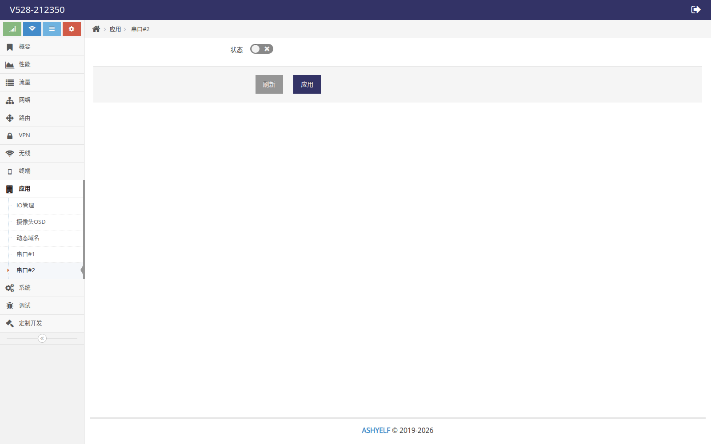

- 本条操作所在页面界面实录。

**界面判断**

| | 条件 |
|--|------|
| **成功** | 页面与操作符合预期 |
| **失败** | 报错或关键控件无效 |
| **skip** | 无 Web 或无该菜单 |

**环境判断**

| | 条件 |
|--|------|
| **成功** | 菜单存在且允许操作 |
| **失败** | 环境导致无法操作 |
| **skip** | 无菜单 → skip；缺外设 → env |

**命令行判断**

| | 条件 |
|--|------|
| **成功** | HE 可读/可写与界面一致 |
| **失败** | HE 失败非环境 |
| **skip** | 无法 Telnet |

**本条总评**

| 判定类 | 结果（执行时勾选） |
|--------|--------------------|
| 界面 | ☐ pass　☐ fail　☐ skip |
| 环境 | ☐ pass　☐ fail　☐ skip |
| 命令行 | ☐ pass　☐ fail　☐ skip |
| **总评** | 任一类 fail → 本条 fail；已测类均为 pass、其余 skip → 本条 pass；三类皆 skip → env |


**恢复**  
无需恢复。

---
### APP-UART2-02 Status 打开

**功能说明**  
打开 Status。

**侧栏路径**  
`应用 → 串口#2`

**需要的环境**（勾选已有项）

- [ ] Web 可打开 `http://192.168.32.100/`
- [ ] 已按 LOGIN-02 登录 Web（或本条自行登录）

**步骤**

#### 1. 界面

1. 打开 `应用 → 串口#2`。
2. 打开 Status。

#### 2. 命令行

Telnet 登录后在 eline（`$`）执行，或 ashy：`he '…'`：

```text
uart@tty2
land@machine.status
```

**截图**


- 本条操作所在页面界面实录。

**界面判断**

| | 条件 |
|--|------|
| **成功** | 页面与操作符合预期 |
| **失败** | 报错或关键控件无效 |
| **skip** | 无 Web 或无该菜单 |

**环境判断**

| | 条件 |
|--|------|
| **成功** | 菜单存在且允许操作 |
| **失败** | 环境导致无法操作 |
| **skip** | 无菜单 → skip；缺外设 → env |

**命令行判断**

| | 条件 |
|--|------|
| **成功** | HE 可读/可写与界面一致 |
| **失败** | HE 失败非环境 |
| **skip** | 无法 Telnet |

**本条总评**

| 判定类 | 结果（执行时勾选） |
|--------|--------------------|
| 界面 | ☐ pass　☐ fail　☐ skip |
| 环境 | ☐ pass　☐ fail　☐ skip |
| 命令行 | ☐ pass　☐ fail　☐ skip |
| **总评** | 任一类 fail → 本条 fail；已测类均为 pass、其余 skip → 本条 pass；三类皆 skip → env |


**恢复**  
按需恢复。

---
### APP-UART2-03 Command Line 模式恢复

**功能说明**  
改 Command Line 后恢复。

**侧栏路径**  
`应用 → 串口#2`

**需要的环境**（勾选已有项）

- [ ] Web 可打开 `http://192.168.32.100/`
- [ ] 已按 LOGIN-02 登录 Web（或本条自行登录）

**步骤**

#### 1. 界面

1. 打开 `应用 → 串口#2`。
2. 改 Command Line 后恢复。

#### 2. 命令行

Telnet 登录后在 eline（`$`）执行，或 ashy：`he '…'`：

```text
uart@tty2
land@machine.status
```

**截图**


- 本条操作所在页面界面实录。

**界面判断**

| | 条件 |
|--|------|
| **成功** | 页面与操作符合预期 |
| **失败** | 报错或关键控件无效 |
| **skip** | 无 Web 或无该菜单 |

**环境判断**

| | 条件 |
|--|------|
| **成功** | 菜单存在且允许操作 |
| **失败** | 环境导致无法操作 |
| **skip** | 无菜单 → skip；缺外设 → env |

**命令行判断**

| | 条件 |
|--|------|
| **成功** | HE 可读/可写与界面一致 |
| **失败** | HE 失败非环境 |
| **skip** | 无法 Telnet |

**本条总评**

| 判定类 | 结果（执行时勾选） |
|--------|--------------------|
| 界面 | ☐ pass　☐ fail　☐ skip |
| 环境 | ☐ pass　☐ fail　☐ skip |
| 命令行 | ☐ pass　☐ fail　☐ skip |
| **总评** | 任一类 fail → 本条 fail；已测类均为 pass、其余 skip → 本条 pass；三类皆 skip → env |


**恢复**  
恢复。

---
### APP-UART2-04 Transparent 模式恢复

**功能说明**  
改 Transparent 后恢复。

**侧栏路径**  
`应用 → 串口#2`

**需要的环境**（勾选已有项）

- [ ] Web 可打开 `http://192.168.32.100/`
- [ ] 已按 LOGIN-02 登录 Web（或本条自行登录）

**步骤**

#### 1. 界面

1. 打开 `应用 → 串口#2`。
2. 改 Transparent 后恢复。

#### 2. 命令行

Telnet 登录后在 eline（`$`）执行，或 ashy：`he '…'`：

```text
uart@tty2
land@machine.status
```

**截图**


- 本条操作所在页面界面实录。

**界面判断**

| | 条件 |
|--|------|
| **成功** | 页面与操作符合预期 |
| **失败** | 报错或关键控件无效 |
| **skip** | 无 Web 或无该菜单 |

**环境判断**

| | 条件 |
|--|------|
| **成功** | 菜单存在且允许操作 |
| **失败** | 环境导致无法操作 |
| **skip** | 无菜单 → skip；缺外设 → env |

**命令行判断**

| | 条件 |
|--|------|
| **成功** | HE 可读/可写与界面一致 |
| **失败** | HE 失败非环境 |
| **skip** | 无法 Telnet |

**本条总评**

| 判定类 | 结果（执行时勾选） |
|--------|--------------------|
| 界面 | ☐ pass　☐ fail　☐ skip |
| 环境 | ☐ pass　☐ fail　☐ skip |
| 命令行 | ☐ pass　☐ fail　☐ skip |
| **总评** | 任一类 fail → 本条 fail；已测类均为 pass、其余 skip → 本条 pass；三类皆 skip → env |


**恢复**  
恢复。

---
### APP-UART2-05 线参数修改恢复

**功能说明**  
改线参数后恢复。

**侧栏路径**  
`应用 → 串口#2`

**需要的环境**（勾选已有项）

- [ ] Web 可打开 `http://192.168.32.100/`
- [ ] 已按 LOGIN-02 登录 Web（或本条自行登录）

**步骤**

#### 1. 界面

1. 打开 `应用 → 串口#2`。
2. 改线参数后恢复。

#### 2. 命令行

Telnet 登录后在 eline（`$`）执行，或 ashy：`he '…'`：

```text
uart@tty2
land@machine.status
```

**截图**


- 本条操作所在页面界面实录。

**界面判断**

| | 条件 |
|--|------|
| **成功** | 页面与操作符合预期 |
| **失败** | 报错或关键控件无效 |
| **skip** | 无 Web 或无该菜单 |

**环境判断**

| | 条件 |
|--|------|
| **成功** | 菜单存在且允许操作 |
| **失败** | 环境导致无法操作 |
| **skip** | 无菜单 → skip；缺外设 → env |

**命令行判断**

| | 条件 |
|--|------|
| **成功** | HE 可读/可写与界面一致 |
| **失败** | HE 失败非环境 |
| **skip** | 无法 Telnet |

**本条总评**

| 判定类 | 结果（执行时勾选） |
|--------|--------------------|
| 界面 | ☐ pass　☐ fail　☐ skip |
| 环境 | ☐ pass　☐ fail　☐ skip |
| 命令行 | ☐ pass　☐ fail　☐ skip |
| **总评** | 任一类 fail → 本条 fail；已测类均为 pass、其余 skip → 本条 pass；三类皆 skip → env |


**恢复**  
恢复。

---
### APP-UART2-06 DTU 目标填写恢复

**功能说明**  
填 DTU 目标后恢复。

**侧栏路径**  
`应用 → 串口#2`

**需要的环境**（勾选已有项）

- [ ] Web 可打开 `http://192.168.32.100/`
- [ ] 已按 LOGIN-02 登录 Web（或本条自行登录）

**步骤**

#### 1. 界面

1. 打开 `应用 → 串口#2`。
2. 填 DTU 目标后恢复。

#### 2. 命令行

Telnet 登录后在 eline（`$`）执行，或 ashy：`he '…'`：

```text
uart@tty2
land@machine.status
```

**截图**


- 本条操作所在页面界面实录。

**界面判断**

| | 条件 |
|--|------|
| **成功** | 页面与操作符合预期 |
| **失败** | 报错或关键控件无效 |
| **skip** | 无 Web 或无该菜单 |

**环境判断**

| | 条件 |
|--|------|
| **成功** | 菜单存在且允许操作 |
| **失败** | 环境导致无法操作 |
| **skip** | 无菜单 → skip；缺外设 → env |

**命令行判断**

| | 条件 |
|--|------|
| **成功** | HE 可读/可写与界面一致 |
| **失败** | HE 失败非环境 |
| **skip** | 无法 Telnet |

**本条总评**

| 判定类 | 结果（执行时勾选） |
|--------|--------------------|
| 界面 | ☐ pass　☐ fail　☐ skip |
| 环境 | ☐ pass　☐ fail　☐ skip |
| 命令行 | ☐ pass　☐ fail　☐ skip |
| **总评** | 任一类 fail → 本条 fail；已测类均为 pass、其余 skip → 本条 pass；三类皆 skip → env |


**恢复**  
清测试目标。

---
## 11 系统 System

> 「设备管理」为 `#device` 入口；配置备份/软件/密码若为页内 Tab，路径写「系统 → 设备管理 →对应 Tab」。侧栏另有远程控制/自动重启/Telnet/SSH/WEB。

### SYS-DEV-01 设备管理进入

**功能说明**  
进入设备管理。

**侧栏路径**  
`系统 → 设备管理`

**需要的环境**（勾选已有项）

- [ ] Web 可打开 `http://192.168.32.100/`
- [ ] 已按 LOGIN-02 登录 Web（或本条自行登录）

**步骤**

#### 1. 界面

1. 打开 `系统 → 设备管理`。
2. 进入设备管理。

#### 2. 命令行

Telnet 登录后在 eline（`$`）执行，或 ashy：`he '…'`：

```text
land@machine.status
```

**截图**

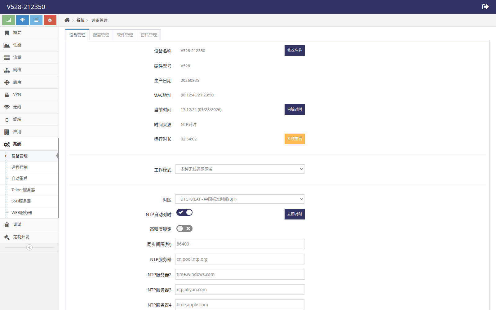

- 本条操作所在页面界面实录。

**界面判断**

| | 条件 |
|--|------|
| **成功** | 页面与操作符合预期 |
| **失败** | 报错或关键控件无效 |
| **skip** | 无 Web 或无该菜单 |

**环境判断**

| | 条件 |
|--|------|
| **成功** | 菜单存在且允许操作 |
| **失败** | 环境导致无法操作 |
| **skip** | 无菜单 → skip；缺外设 → env |

**命令行判断**

| | 条件 |
|--|------|
| **成功** | HE 可读/可写与界面一致 |
| **失败** | HE 失败非环境 |
| **skip** | 无法 Telnet |

**本条总评**

| 判定类 | 结果（执行时勾选） |
|--------|--------------------|
| 界面 | ☐ pass　☐ fail　☐ skip |
| 环境 | ☐ pass　☐ fail　☐ skip |
| 命令行 | ☐ pass　☐ fail　☐ skip |
| **总评** | 任一类 fail → 本条 fail；已测类均为 pass、其余 skip → 本条 pass；三类皆 skip → env |


**恢复**  
无需恢复。

---
### SYS-DEV-02 设备名修改恢复

**功能说明**  
改设备名后恢复。

**侧栏路径**  
`系统 → 设备管理`

**需要的环境**（勾选已有项）

- [ ] Web 可打开 `http://192.168.32.100/`
- [ ] 已按 LOGIN-02 登录 Web（或本条自行登录）

**步骤**

#### 1. 界面

1. 打开 `系统 → 设备管理`。
2. 改设备名后恢复。

#### 2. 命令行

Telnet 登录后在 eline（`$`）执行，或 ashy：`he '…'`：

```text
land@machine
```

**截图**


- 本条操作所在页面界面实录。

**界面判断**

| | 条件 |
|--|------|
| **成功** | 页面与操作符合预期 |
| **失败** | 报错或关键控件无效 |
| **skip** | 无 Web 或无该菜单 |

**环境判断**

| | 条件 |
|--|------|
| **成功** | 菜单存在且允许操作 |
| **失败** | 环境导致无法操作 |
| **skip** | 无菜单 → skip；缺外设 → env |

**命令行判断**

| | 条件 |
|--|------|
| **成功** | HE 可读/可写与界面一致 |
| **失败** | HE 失败非环境 |
| **skip** | 无法 Telnet |

**本条总评**

| 判定类 | 结果（执行时勾选） |
|--------|--------------------|
| 界面 | ☐ pass　☐ fail　☐ skip |
| 环境 | ☐ pass　☐ fail　☐ skip |
| 命令行 | ☐ pass　☐ fail　☐ skip |
| **总评** | 任一类 fail → 本条 fail；已测类均为 pass、其余 skip → 本条 pass；三类皆 skip → env |


**恢复**  
恢复原名。

---
### SYS-DEV-03 MAC/运行时间只读

**功能说明**  
核对 MAC/运行时间只读。

**侧栏路径**  
`系统 → 设备管理`

**需要的环境**（勾选已有项）

- [ ] Web 可打开 `http://192.168.32.100/`
- [ ] 已按 LOGIN-02 登录 Web（或本条自行登录）

**步骤**

#### 1. 界面

1. 打开 `系统 → 设备管理`。
2. 核对 MAC/运行时间只读。

#### 2. 命令行

Telnet 登录后在 eline（`$`）执行，或 ashy：`he '…'`：

```text
land@machine.status
```

**截图**


- 本条操作所在页面界面实录。

**界面判断**

| | 条件 |
|--|------|
| **成功** | 页面与操作符合预期 |
| **失败** | 报错或关键控件无效 |
| **skip** | 无 Web 或无该菜单 |

**环境判断**

| | 条件 |
|--|------|
| **成功** | 菜单存在且允许操作 |
| **失败** | 环境导致无法操作 |
| **skip** | 无菜单 → skip；缺外设 → env |

**命令行判断**

| | 条件 |
|--|------|
| **成功** | HE 可读/可写与界面一致 |
| **失败** | HE 失败非环境 |
| **skip** | 无法 Telnet |

**本条总评**

| 判定类 | 结果（执行时勾选） |
|--------|--------------------|
| 界面 | ☐ pass　☐ fail　☐ skip |
| 环境 | ☐ pass　☐ fail　☐ skip |
| 命令行 | ☐ pass　☐ fail　☐ skip |
| **总评** | 任一类 fail → 本条 fail；已测类均为 pass、其余 skip → 本条 pass；三类皆 skip → env |


**恢复**  
无需恢复。

---
### SYS-DEV-04 PC Time Sync

**功能说明**  
执行 PC 时间同步（若有）。

**侧栏路径**  
`系统 → 设备管理`

**需要的环境**（勾选已有项）

- [ ] Web 可打开 `http://192.168.32.100/`
- [ ] 已按 LOGIN-02 登录 Web（或本条自行登录）

**步骤**

#### 1. 界面

1. 打开 `系统 → 设备管理`。
2. 执行 PC 时间同步（若有）。

#### 2. 命令行

Telnet 登录后在 eline（`$`）执行，或 ashy：`he '…'`：

```text
land@machine.status
```

**截图**


- 本条操作所在页面界面实录。

**界面判断**

| | 条件 |
|--|------|
| **成功** | 页面与操作符合预期 |
| **失败** | 报错或关键控件无效 |
| **skip** | 无 Web 或无该菜单 |

**环境判断**

| | 条件 |
|--|------|
| **成功** | 菜单存在且允许操作 |
| **失败** | 环境导致无法操作 |
| **skip** | 无菜单 → skip；缺外设 → env |

**命令行判断**

| | 条件 |
|--|------|
| **成功** | HE 可读/可写与界面一致 |
| **失败** | HE 失败非环境 |
| **skip** | 无法 Telnet |

**本条总评**

| 判定类 | 结果（执行时勾选） |
|--------|--------------------|
| 界面 | ☐ pass　☐ fail　☐ skip |
| 环境 | ☐ pass　☐ fail　☐ skip |
| 命令行 | ☐ pass　☐ fail　☐ skip |
| **总评** | 任一类 fail → 本条 fail；已测类均为 pass、其余 skip → 本条 pass；三类皆 skip → env |


**恢复**  
无需强制恢复。

---
### SYS-DEV-05 时区设置恢复

**功能说明**  
改时区后恢复。

**侧栏路径**  
`系统 → 设备管理`

**需要的环境**（勾选已有项）

- [ ] Web 可打开 `http://192.168.32.100/`
- [ ] 已按 LOGIN-02 登录 Web（或本条自行登录）

**步骤**

#### 1. 界面

1. 打开 `系统 → 设备管理`。
2. 改时区后恢复。

#### 2. 命令行

Telnet 登录后在 eline（`$`）执行，或 ashy：`he '…'`：

```text
land@machine
```

**截图**


- 本条操作所在页面界面实录。

**界面判断**

| | 条件 |
|--|------|
| **成功** | 页面与操作符合预期 |
| **失败** | 报错或关键控件无效 |
| **skip** | 无 Web 或无该菜单 |

**环境判断**

| | 条件 |
|--|------|
| **成功** | 菜单存在且允许操作 |
| **失败** | 环境导致无法操作 |
| **skip** | 无菜单 → skip；缺外设 → env |

**命令行判断**

| | 条件 |
|--|------|
| **成功** | HE 可读/可写与界面一致 |
| **失败** | HE 失败非环境 |
| **skip** | 无法 Telnet |

**本条总评**

| 判定类 | 结果（执行时勾选） |
|--------|--------------------|
| 界面 | ☐ pass　☐ fail　☐ skip |
| 环境 | ☐ pass　☐ fail　☐ skip |
| 命令行 | ☐ pass　☐ fail　☐ skip |
| **总评** | 任一类 fail → 本条 fail；已测类均为 pass、其余 skip → 本条 pass；三类皆 skip → env |


**恢复**  
恢复原时区。

---
### SYS-DEV-06 NTP 开关与服务器恢复

**功能说明**  
改 NTP 后恢复。

**侧栏路径**  
`系统 → 设备管理`

**需要的环境**（勾选已有项）

- [ ] Web 可打开 `http://192.168.32.100/`
- [ ] 已按 LOGIN-02 登录 Web（或本条自行登录）

**步骤**

#### 1. 界面

1. 打开 `系统 → 设备管理`。
2. 改 NTP 后恢复。

#### 2. 命令行

Telnet 登录后在 eline（`$`）执行，或 ashy：`he '…'`：

```text
land@machine
```

**截图**


- 本条操作所在页面界面实录。

**界面判断**

| | 条件 |
|--|------|
| **成功** | 页面与操作符合预期 |
| **失败** | 报错或关键控件无效 |
| **skip** | 无 Web 或无该菜单 |

**环境判断**

| | 条件 |
|--|------|
| **成功** | 菜单存在且允许操作 |
| **失败** | 环境导致无法操作 |
| **skip** | 无菜单 → skip；缺外设 → env |

**命令行判断**

| | 条件 |
|--|------|
| **成功** | HE 可读/可写与界面一致 |
| **失败** | HE 失败非环境 |
| **skip** | 无法 Telnet |

**本条总评**

| 判定类 | 结果（执行时勾选） |
|--------|--------------------|
| 界面 | ☐ pass　☐ fail　☐ skip |
| 环境 | ☐ pass　☐ fail　☐ skip |
| 命令行 | ☐ pass　☐ fail　☐ skip |
| **总评** | 任一类 fail → 本条 fail；已测类均为 pass、其余 skip → 本条 pass；三类皆 skip → env |


**恢复**  
恢复。

---
### SYS-DEV-07 Sync Now

**功能说明**  
点 Sync Now（若有）。

**侧栏路径**  
`系统 → 设备管理`

**需要的环境**（勾选已有项）

- [ ] Web 可打开 `http://192.168.32.100/`
- [ ] 已按 LOGIN-02 登录 Web（或本条自行登录）

**步骤**

#### 1. 界面

1. 打开 `系统 → 设备管理`。
2. 点 Sync Now（若有）。

#### 2. 命令行

Telnet 登录后在 eline（`$`）执行，或 ashy：`he '…'`：

```text
land@machine.status
```

**截图**


- 本条操作所在页面界面实录。

**界面判断**

| | 条件 |
|--|------|
| **成功** | 页面与操作符合预期 |
| **失败** | 报错或关键控件无效 |
| **skip** | 无 Web 或无该菜单 |

**环境判断**

| | 条件 |
|--|------|
| **成功** | 菜单存在且允许操作 |
| **失败** | 环境导致无法操作 |
| **skip** | 无菜单 → skip；缺外设 → env |

**命令行判断**

| | 条件 |
|--|------|
| **成功** | HE 可读/可写与界面一致 |
| **失败** | HE 失败非环境 |
| **skip** | 无法 Telnet |

**本条总评**

| 判定类 | 结果（执行时勾选） |
|--------|--------------------|
| 界面 | ☐ pass　☐ fail　☐ skip |
| 环境 | ☐ pass　☐ fail　☐ skip |
| 命令行 | ☐ pass　☐ fail　☐ skip |
| **总评** | 任一类 fail → 本条 fail；已测类均为 pass、其余 skip → 本条 pass；三类皆 skip → env |


**恢复**  
无需恢复。

---
### SYS-DEV-08 NTP Service（LAN 授时）查看

**功能说明**  
查看 NTP Service。

**侧栏路径**  
`系统 → 设备管理`

**需要的环境**（勾选已有项）

- [ ] Web 可打开 `http://192.168.32.100/`
- [ ] 已按 LOGIN-02 登录 Web（或本条自行登录）

**步骤**

#### 1. 界面

1. 打开 `系统 → 设备管理`。
2. 查看 NTP Service。

#### 2. 命令行

Telnet 登录后在 eline（`$`）执行，或 ashy：`he '…'`：

```text
land@machine
```

**截图**


- 本条操作所在页面界面实录。

**界面判断**

| | 条件 |
|--|------|
| **成功** | 页面与操作符合预期 |
| **失败** | 报错或关键控件无效 |
| **skip** | 无 Web 或无该菜单 |

**环境判断**

| | 条件 |
|--|------|
| **成功** | 菜单存在且允许操作 |
| **失败** | 环境导致无法操作 |
| **skip** | 无菜单 → skip；缺外设 → env |

**命令行判断**

| | 条件 |
|--|------|
| **成功** | HE 可读/可写与界面一致 |
| **失败** | HE 失败非环境 |
| **skip** | 无法 Telnet |

**本条总评**

| 判定类 | 结果（执行时勾选） |
|--------|--------------------|
| 界面 | ☐ pass　☐ fail　☐ skip |
| 环境 | ☐ pass　☐ fail　☐ skip |
| 命令行 | ☐ pass　☐ fail　☐ skip |
| **总评** | 任一类 fail → 本条 fail；已测类均为 pass、其余 skip → 本条 pass；三类皆 skip → env |


**恢复**  
轻改须恢复。

---
### SYS-DEV-09 Operation Mode 只读确认 mwm

**功能说明**  
确认模式为 mwm（只读/不切换）。

**侧栏路径**  
`系统 → 设备管理`

**需要的环境**（勾选已有项）

- [ ] Web 可打开 `http://192.168.32.100/`
- [ ] 已按 LOGIN-02 登录 Web（或本条自行登录）

**步骤**

#### 1. 界面

1. 打开 `系统 → 设备管理`。
2. 确认模式为 mwm（只读/不切换）。

#### 2. 命令行

Telnet 登录后在 eline（`$`）执行，或 ashy：`he '…'`：

```text
land@machine.status
# 期望 mode=mwm
```

**截图**


- 本条操作所在页面界面实录。

**界面判断**

| | 条件 |
|--|------|
| **成功** | 页面与操作符合预期 |
| **失败** | 报错或关键控件无效 |
| **skip** | 无 Web 或无该菜单 |

**环境判断**

| | 条件 |
|--|------|
| **成功** | 菜单存在且允许操作 |
| **失败** | 环境导致无法操作 |
| **skip** | 无菜单 → skip；缺外设 → env |

**命令行判断**

| | 条件 |
|--|------|
| **成功** | HE 可读/可写与界面一致 |
| **失败** | HE 失败非环境 |
| **skip** | 无法 Telnet |

**本条总评**

| 判定类 | 结果（执行时勾选） |
|--------|--------------------|
| 界面 | ☐ pass　☐ fail　☐ skip |
| 环境 | ☐ pass　☐ fail　☐ skip |
| 命令行 | ☐ pass　☐ fail　☐ skip |
| **总评** | 任一类 fail → 本条 fail；已测类均为 pass、其余 skip → 本条 pass；三类皆 skip → env |


**恢复**  
不切换模式。

---
### SYS-DEV-10 Sys Reboot 仅写步骤不默认执行

**功能说明**  
确认重启入口存在；**默认不执行重启**。

**侧栏路径**  
`系统 → 设备管理`

**需要的环境**（勾选已有项）

- [ ] Web 可打开 `http://192.168.32.100/`
- [ ] 已按 LOGIN-02 登录 Web（或本条自行登录）

**步骤**

#### 1. 界面

1. 打开 `系统 → 设备管理`。
2. 确认重启入口存在；**默认不执行重启**。

#### 2. 命令行

Telnet 登录后在 eline（`$`）执行，或 ashy：`he '…'`：

```text
# land@machine.restart  # 禁止默认执行
```

**截图**


- 本条操作所在页面界面实录。

**界面判断**

| | 条件 |
|--|------|
| **成功** | 页面与操作符合预期 |
| **失败** | 报错或关键控件无效 |
| **skip** | 无 Web 或无该菜单 |

**环境判断**

| | 条件 |
|--|------|
| **成功** | 菜单存在且允许操作 |
| **失败** | 环境导致无法操作 |
| **skip** | 无菜单 → skip；缺外设 → env |

**命令行判断**

| | 条件 |
|--|------|
| **成功** | HE 可读/可写与界面一致 |
| **失败** | HE 失败非环境 |
| **skip** | 无法 Telnet |

**本条总评**

| 判定类 | 结果（执行时勾选） |
|--------|--------------------|
| 界面 | ☐ pass　☐ fail　☐ skip |
| 环境 | ☐ pass　☐ fail　☐ skip |
| 命令行 | ☐ pass　☐ fail　☐ skip |
| **总评** | 任一类 fail → 本条 fail；已测类均为 pass、其余 skip → 本条 pass；三类皆 skip → env |


**恢复**  
不执行则无需恢复。

---
### SYS-CFG-01 配置管理进入

**功能说明**  
进入配置管理 Tab（无则 skip）。

**侧栏路径**  
`系统 → 设备管理 → 配置`

**需要的环境**（勾选已有项）

- [ ] Web 可打开 `http://192.168.32.100/`
- [ ] 已按 LOGIN-02 登录 Web（或本条自行登录）

**步骤**

#### 1. 界面

1. 打开 `系统 → 设备管理 → 配置`。
2. 进入配置管理 Tab（无则 skip）。

#### 2. 命令行

Telnet 登录后在 eline（`$`）执行，或 ashy：`he '…'`：

```text
land@machine.status
```

**截图**


- 本条操作所在页面界面实录。

**界面判断**

| | 条件 |
|--|------|
| **成功** | 页面与操作符合预期 |
| **失败** | 报错或关键控件无效 |
| **skip** | 无 Web 或无该菜单 |

**环境判断**

| | 条件 |
|--|------|
| **成功** | 菜单存在且允许操作 |
| **失败** | 环境导致无法操作 |
| **skip** | 无菜单 → skip；缺外设 → env |

**命令行判断**

| | 条件 |
|--|------|
| **成功** | HE 可读/可写与界面一致 |
| **失败** | HE 失败非环境 |
| **skip** | 无法 Telnet |

**本条总评**

| 判定类 | 结果（执行时勾选） |
|--------|--------------------|
| 界面 | ☐ pass　☐ fail　☐ skip |
| 环境 | ☐ pass　☐ fail　☐ skip |
| 命令行 | ☐ pass　☐ fail　☐ skip |
| **总评** | 任一类 fail → 本条 fail；已测类均为 pass、其余 skip → 本条 pass；三类皆 skip → env |


**恢复**  
无需恢复。

---
### SYS-CFG-02 Backup Configure 导出

**功能说明**  
执行备份导出（若有）。

**侧栏路径**  
`系统 → 设备管理 → 配置`

**需要的环境**（勾选已有项）

- [ ] Web 可打开 `http://192.168.32.100/`
- [ ] 已按 LOGIN-02 登录 Web（或本条自行登录）

**步骤**

#### 1. 界面

1. 打开 `系统 → 设备管理 → 配置`。
2. 执行备份导出（若有）。

#### 2. 命令行

Telnet 登录后在 eline（`$`）执行，或 ashy：`he '…'`：

```text
land@machine.status
```

**截图**


- 本条操作所在页面界面实录。

**界面判断**

| | 条件 |
|--|------|
| **成功** | 页面与操作符合预期 |
| **失败** | 报错或关键控件无效 |
| **skip** | 无 Web 或无该菜单 |

**环境判断**

| | 条件 |
|--|------|
| **成功** | 菜单存在且允许操作 |
| **失败** | 环境导致无法操作 |
| **skip** | 无菜单 → skip；缺外设 → env |

**命令行判断**

| | 条件 |
|--|------|
| **成功** | HE 可读/可写与界面一致 |
| **失败** | HE 失败非环境 |
| **skip** | 无法 Telnet |

**本条总评**

| 判定类 | 结果（执行时勾选） |
|--------|--------------------|
| 界面 | ☐ pass　☐ fail　☐ skip |
| 环境 | ☐ pass　☐ fail　☐ skip |
| 命令行 | ☐ pass　☐ fail　☐ skip |
| **总评** | 任一类 fail → 本条 fail；已测类均为 pass、其余 skip → 本条 pass；三类皆 skip → env |


**恢复**  
保存导出文件备查。

---
### SYS-CFG-03 Configure Version 可读

**功能说明**  
查看配置版本。

**侧栏路径**  
`系统 → 设备管理 → 配置`

**需要的环境**（勾选已有项）

- [ ] Web 可打开 `http://192.168.32.100/`
- [ ] 已按 LOGIN-02 登录 Web（或本条自行登录）

**步骤**

#### 1. 界面

1. 打开 `系统 → 设备管理 → 配置`。
2. 查看配置版本。

#### 2. 命令行

Telnet 登录后在 eline（`$`）执行，或 ashy：`he '…'`：

```text
land@machine.status
```

**截图**


- 本条操作所在页面界面实录。

**界面判断**

| | 条件 |
|--|------|
| **成功** | 页面与操作符合预期 |
| **失败** | 报错或关键控件无效 |
| **skip** | 无 Web 或无该菜单 |

**环境判断**

| | 条件 |
|--|------|
| **成功** | 菜单存在且允许操作 |
| **失败** | 环境导致无法操作 |
| **skip** | 无菜单 → skip；缺外设 → env |

**命令行判断**

| | 条件 |
|--|------|
| **成功** | HE 可读/可写与界面一致 |
| **失败** | HE 失败非环境 |
| **skip** | 无法 Telnet |

**本条总评**

| 判定类 | 结果（执行时勾选） |
|--------|--------------------|
| 界面 | ☐ pass　☐ fail　☐ skip |
| 环境 | ☐ pass　☐ fail　☐ skip |
| 命令行 | ☐ pass　☐ fail　☐ skip |
| **总评** | 任一类 fail → 本条 fail；已测类均为 pass、其余 skip → 本条 pass；三类皆 skip → env |


**恢复**  
无需恢复。

---
### SYS-CFG-04 Restore 入口存在

**功能说明**  
确认恢复入口存在；**不上传随意包**。

**侧栏路径**  
`系统 → 设备管理 → 配置`

**需要的环境**（勾选已有项）

- [ ] Web 可打开 `http://192.168.32.100/`
- [ ] 已按 LOGIN-02 登录 Web（或本条自行登录）

**步骤**

#### 1. 界面

1. 打开 `系统 → 设备管理 → 配置`。
2. 确认恢复入口存在；**不上传随意包**。

#### 2. 命令行

Telnet 登录后在 eline（`$`）执行，或 ashy：`he '…'`：

```text
land@machine.status
```

**截图**


- 本条操作所在页面界面实录。

**界面判断**

| | 条件 |
|--|------|
| **成功** | 页面与操作符合预期 |
| **失败** | 报错或关键控件无效 |
| **skip** | 无 Web 或无该菜单 |

**环境判断**

| | 条件 |
|--|------|
| **成功** | 菜单存在且允许操作 |
| **失败** | 环境导致无法操作 |
| **skip** | 无菜单 → skip；缺外设 → env |

**命令行判断**

| | 条件 |
|--|------|
| **成功** | HE 可读/可写与界面一致 |
| **失败** | HE 失败非环境 |
| **skip** | 无法 Telnet |

**本条总评**

| 判定类 | 结果（执行时勾选） |
|--------|--------------------|
| 界面 | ☐ pass　☐ fail　☐ skip |
| 环境 | ☐ pass　☐ fail　☐ skip |
| 命令行 | ☐ pass　☐ fail　☐ skip |
| **总评** | 任一类 fail → 本条 fail；已测类均为 pass、其余 skip → 本条 pass；三类皆 skip → env |


**恢复**  
不执行有害恢复。

---
### SYS-CFG-05 Default Configure 仅写不执行

**功能说明**  
确认恢复出厂入口；**默认不执行**。

**侧栏路径**  
`系统 → 设备管理 → 配置`

**需要的环境**（勾选已有项）

- [ ] Web 可打开 `http://192.168.32.100/`
- [ ] 已按 LOGIN-02 登录 Web（或本条自行登录）

**步骤**

#### 1. 界面

1. 打开 `系统 → 设备管理 → 配置`。
2. 确认恢复出厂入口；**默认不执行**。

#### 2. 命令行

Telnet 登录后在 eline（`$`）执行，或 ashy：`he '…'`：

```text
# 禁止默认 factory default
```

**截图**


- 本条操作所在页面界面实录。

**界面判断**

| | 条件 |
|--|------|
| **成功** | 页面与操作符合预期 |
| **失败** | 报错或关键控件无效 |
| **skip** | 无 Web 或无该菜单 |

**环境判断**

| | 条件 |
|--|------|
| **成功** | 菜单存在且允许操作 |
| **失败** | 环境导致无法操作 |
| **skip** | 无菜单 → skip；缺外设 → env |

**命令行判断**

| | 条件 |
|--|------|
| **成功** | HE 可读/可写与界面一致 |
| **失败** | HE 失败非环境 |
| **skip** | 无法 Telnet |

**本条总评**

| 判定类 | 结果（执行时勾选） |
|--------|--------------------|
| 界面 | ☐ pass　☐ fail　☐ skip |
| 环境 | ☐ pass　☐ fail　☐ skip |
| 命令行 | ☐ pass　☐ fail　☐ skip |
| **总评** | 任一类 fail → 本条 fail；已测类均为 pass、其余 skip → 本条 pass；三类皆 skip → env |


**恢复**  
不执行。

---
### SYS-SW-01 软件管理进入

**功能说明**  
进入软件管理（无则 skip）。

**侧栏路径**  
`系统 → 设备管理 → 软件`

**需要的环境**（勾选已有项）

- [ ] Web 可打开 `http://192.168.32.100/`
- [ ] 已按 LOGIN-02 登录 Web（或本条自行登录）

**步骤**

#### 1. 界面

1. 打开 `系统 → 设备管理 → 软件`。
2. 进入软件管理（无则 skip）。

#### 2. 命令行

Telnet 登录后在 eline（`$`）执行，或 ashy：`he '…'`：

```text
land@machine.status
```

**截图**


- 本条操作所在页面界面实录。

**界面判断**

| | 条件 |
|--|------|
| **成功** | 页面与操作符合预期 |
| **失败** | 报错或关键控件无效 |
| **skip** | 无 Web 或无该菜单 |

**环境判断**

| | 条件 |
|--|------|
| **成功** | 菜单存在且允许操作 |
| **失败** | 环境导致无法操作 |
| **skip** | 无菜单 → skip；缺外设 → env |

**命令行判断**

| | 条件 |
|--|------|
| **成功** | HE 可读/可写与界面一致 |
| **失败** | HE 失败非环境 |
| **skip** | 无法 Telnet |

**本条总评**

| 判定类 | 结果（执行时勾选） |
|--------|--------------------|
| 界面 | ☐ pass　☐ fail　☐ skip |
| 环境 | ☐ pass　☐ fail　☐ skip |
| 命令行 | ☐ pass　☐ fail　☐ skip |
| **总评** | 任一类 fail → 本条 fail；已测类均为 pass、其余 skip → 本条 pass；三类皆 skip → env |


**恢复**  
无需恢复。

---
### SYS-SW-02 固件版本/SDK/标识可读

**功能说明**  
核对 version 等。

**侧栏路径**  
`系统 → 设备管理 → 软件`

**需要的环境**（勾选已有项）

- [ ] Web 可打开 `http://192.168.32.100/`
- [ ] 已按 LOGIN-02 登录 Web（或本条自行登录）

**步骤**

#### 1. 界面

1. 打开 `系统 → 设备管理 → 软件`。
2. 核对 version 等。

#### 2. 命令行

Telnet 登录后在 eline（`$`）执行，或 ashy：`he '…'`：

```text
land@machine.status
```

**截图**


- 本条操作所在页面界面实录。

**界面判断**

| | 条件 |
|--|------|
| **成功** | 页面与操作符合预期 |
| **失败** | 报错或关键控件无效 |
| **skip** | 无 Web 或无该菜单 |

**环境判断**

| | 条件 |
|--|------|
| **成功** | 菜单存在且允许操作 |
| **失败** | 环境导致无法操作 |
| **skip** | 无菜单 → skip；缺外设 → env |

**命令行判断**

| | 条件 |
|--|------|
| **成功** | HE 可读/可写与界面一致 |
| **失败** | HE 失败非环境 |
| **skip** | 无法 Telnet |

**本条总评**

| 判定类 | 结果（执行时勾选） |
|--------|--------------------|
| 界面 | ☐ pass　☐ fail　☐ skip |
| 环境 | ☐ pass　☐ fail　☐ skip |
| 命令行 | ☐ pass　☐ fail　☐ skip |
| **总评** | 任一类 fail → 本条 fail；已测类均为 pass、其余 skip → 本条 pass；三类皆 skip → env |


**恢复**  
无需恢复。

---
### SYS-SW-03 工程 FPK 列表可读

**功能说明**  
查看 FPK 列表。

**侧栏路径**  
`系统 → 设备管理 → 软件`

**需要的环境**（勾选已有项）

- [ ] Web 可打开 `http://192.168.32.100/`
- [ ] 已按 LOGIN-02 登录 Web（或本条自行登录）

**步骤**

#### 1. 界面

1. 打开 `系统 → 设备管理 → 软件`。
2. 查看 FPK 列表。

#### 2. 命令行

Telnet 登录后在 eline（`$`）执行，或 ashy：`he '…'`：

```text
land@fpk.list
```

**截图**


- 本条操作所在页面界面实录。

**界面判断**

| | 条件 |
|--|------|
| **成功** | 页面与操作符合预期 |
| **失败** | 报错或关键控件无效 |
| **skip** | 无 Web 或无该菜单 |

**环境判断**

| | 条件 |
|--|------|
| **成功** | 菜单存在且允许操作 |
| **失败** | 环境导致无法操作 |
| **skip** | 无菜单 → skip；缺外设 → env |

**命令行判断**

| | 条件 |
|--|------|
| **成功** | HE 可读/可写与界面一致 |
| **失败** | HE 失败非环境 |
| **skip** | 无法 Telnet |

**本条总评**

| 判定类 | 结果（执行时勾选） |
|--------|--------------------|
| 界面 | ☐ pass　☐ fail　☐ skip |
| 环境 | ☐ pass　☐ fail　☐ skip |
| 命令行 | ☐ pass　☐ fail　☐ skip |
| **总评** | 任一类 fail → 本条 fail；已测类均为 pass、其余 skip → 本条 pass；三类皆 skip → env |


**恢复**  
无需恢复。

---
### SYS-SW-04 升级上传入口存在

**功能说明**  
确认上传入口；**不上传 .zz**。

**侧栏路径**  
`系统 → 设备管理 → 软件`

**需要的环境**（勾选已有项）

- [ ] Web 可打开 `http://192.168.32.100/`
- [ ] 已按 LOGIN-02 登录 Web（或本条自行登录）

**步骤**

#### 1. 界面

1. 打开 `系统 → 设备管理 → 软件`。
2. 确认上传入口；**不上传 .zz**。

#### 2. 命令行

Telnet 登录后在 eline（`$`）执行，或 ashy：`he '…'`：

```text
land@machine.status
```

**截图**


- 本条操作所在页面界面实录。

**界面判断**

| | 条件 |
|--|------|
| **成功** | 页面与操作符合预期 |
| **失败** | 报错或关键控件无效 |
| **skip** | 无 Web 或无该菜单 |

**环境判断**

| | 条件 |
|--|------|
| **成功** | 菜单存在且允许操作 |
| **失败** | 环境导致无法操作 |
| **skip** | 无菜单 → skip；缺外设 → env |

**命令行判断**

| | 条件 |
|--|------|
| **成功** | HE 可读/可写与界面一致 |
| **失败** | HE 失败非环境 |
| **skip** | 无法 Telnet |

**本条总评**

| 判定类 | 结果（执行时勾选） |
|--------|--------------------|
| 界面 | ☐ pass　☐ fail　☐ skip |
| 环境 | ☐ pass　☐ fail　☐ skip |
| 命令行 | ☐ pass　☐ fail　☐ skip |
| **总评** | 任一类 fail → 本条 fail；已测类均为 pass、其余 skip → 本条 pass；三类皆 skip → env |


**恢复**  
不升级。

---
### SYS-SW-05 FPK 仓库入口存在

**功能说明**  
确认仓库入口；不安装。

**侧栏路径**  
`系统 → 设备管理 → 软件`

**需要的环境**（勾选已有项）

- [ ] Web 可打开 `http://192.168.32.100/`
- [ ] 已按 LOGIN-02 登录 Web（或本条自行登录）

**步骤**

#### 1. 界面

1. 打开 `系统 → 设备管理 → 软件`。
2. 确认仓库入口；不安装。

#### 2. 命令行

Telnet 登录后在 eline（`$`）执行，或 ashy：`he '…'`：

```text
land@fpk.list
```

**截图**


- 本条操作所在页面界面实录。

**界面判断**

| | 条件 |
|--|------|
| **成功** | 页面与操作符合预期 |
| **失败** | 报错或关键控件无效 |
| **skip** | 无 Web 或无该菜单 |

**环境判断**

| | 条件 |
|--|------|
| **成功** | 菜单存在且允许操作 |
| **失败** | 环境导致无法操作 |
| **skip** | 无菜单 → skip；缺外设 → env |

**命令行判断**

| | 条件 |
|--|------|
| **成功** | HE 可读/可写与界面一致 |
| **失败** | HE 失败非环境 |
| **skip** | 无法 Telnet |

**本条总评**

| 判定类 | 结果（执行时勾选） |
|--------|--------------------|
| 界面 | ☐ pass　☐ fail　☐ skip |
| 环境 | ☐ pass　☐ fail　☐ skip |
| 命令行 | ☐ pass　☐ fail　☐ skip |
| **总评** | 任一类 fail → 本条 fail；已测类均为 pass、其余 skip → 本条 pass；三类皆 skip → env |


**恢复**  
不安装。

---
### SYS-PWD-01 密码管理进入

**功能说明**  
进入密码页（无则 skip）。

**侧栏路径**  
`系统 → 设备管理 → 密码`

**需要的环境**（勾选已有项）

- [ ] Web 可打开 `http://192.168.32.100/`
- [ ] 已按 LOGIN-02 登录 Web（或本条自行登录）

**步骤**

#### 1. 界面

1. 打开 `系统 → 设备管理 → 密码`。
2. 进入密码页（无则 skip）。

#### 2. 命令行

Telnet 登录后在 eline（`$`）执行，或 ashy：`he '…'`：

```text
land@machine.status
```

**截图**


- 本条操作所在页面界面实录。

**界面判断**

| | 条件 |
|--|------|
| **成功** | 页面与操作符合预期 |
| **失败** | 报错或关键控件无效 |
| **skip** | 无 Web 或无该菜单 |

**环境判断**

| | 条件 |
|--|------|
| **成功** | 菜单存在且允许操作 |
| **失败** | 环境导致无法操作 |
| **skip** | 无菜单 → skip；缺外设 → env |

**命令行判断**

| | 条件 |
|--|------|
| **成功** | HE 可读/可写与界面一致 |
| **失败** | HE 失败非环境 |
| **skip** | 无法 Telnet |

**本条总评**

| 判定类 | 结果（执行时勾选） |
|--------|--------------------|
| 界面 | ☐ pass　☐ fail　☐ skip |
| 环境 | ☐ pass　☐ fail　☐ skip |
| 命令行 | ☐ pass　☐ fail　☐ skip |
| **总评** | 任一类 fail → 本条 fail；已测类均为 pass、其余 skip → 本条 pass；三类皆 skip → env |


**恢复**  
无需恢复。

---
### SYS-PWD-02 原密码错误校验

**功能说明**  
输入错误原密码应失败。

**侧栏路径**  
`系统 → 设备管理 → 密码`

**需要的环境**（勾选已有项）

- [ ] Web 可打开 `http://192.168.32.100/`
- [ ] 已按 LOGIN-02 登录 Web（或本条自行登录）

**步骤**

#### 1. 界面

1. 打开 `系统 → 设备管理 → 密码`。
2. 输入错误原密码应失败。

#### 2. 命令行

Telnet 登录后在 eline（`$`）执行，或 ashy：`he '…'`：

```text
land@machine.status
```

**截图**


- 本条操作所在页面界面实录。

**界面判断**

| | 条件 |
|--|------|
| **成功** | 页面与操作符合预期 |
| **失败** | 报错或关键控件无效 |
| **skip** | 无 Web 或无该菜单 |

**环境判断**

| | 条件 |
|--|------|
| **成功** | 菜单存在且允许操作 |
| **失败** | 环境导致无法操作 |
| **skip** | 无菜单 → skip；缺外设 → env |

**命令行判断**

| | 条件 |
|--|------|
| **成功** | HE 可读/可写与界面一致 |
| **失败** | HE 失败非环境 |
| **skip** | 无法 Telnet |

**本条总评**

| 判定类 | 结果（执行时勾选） |
|--------|--------------------|
| 界面 | ☐ pass　☐ fail　☐ skip |
| 环境 | ☐ pass　☐ fail　☐ skip |
| 命令行 | ☐ pass　☐ fail　☐ skip |
| **总评** | 任一类 fail → 本条 fail；已测类均为 pass、其余 skip → 本条 pass；三类皆 skip → env |


**恢复**  
不改密。

---
### SYS-PWD-03 新密码不一致校验

**功能说明**  
新密码两次不一致应失败。

**侧栏路径**  
`系统 → 设备管理 → 密码`

**需要的环境**（勾选已有项）

- [ ] Web 可打开 `http://192.168.32.100/`
- [ ] 已按 LOGIN-02 登录 Web（或本条自行登录）

**步骤**

#### 1. 界面

1. 打开 `系统 → 设备管理 → 密码`。
2. 新密码两次不一致应失败。

#### 2. 命令行

Telnet 登录后在 eline（`$`）执行，或 ashy：`he '…'`：

```text
land@machine.status
```

**截图**


- 本条操作所在页面界面实录。

**界面判断**

| | 条件 |
|--|------|
| **成功** | 页面与操作符合预期 |
| **失败** | 报错或关键控件无效 |
| **skip** | 无 Web 或无该菜单 |

**环境判断**

| | 条件 |
|--|------|
| **成功** | 菜单存在且允许操作 |
| **失败** | 环境导致无法操作 |
| **skip** | 无菜单 → skip；缺外设 → env |

**命令行判断**

| | 条件 |
|--|------|
| **成功** | HE 可读/可写与界面一致 |
| **失败** | HE 失败非环境 |
| **skip** | 无法 Telnet |

**本条总评**

| 判定类 | 结果（执行时勾选） |
|--------|--------------------|
| 界面 | ☐ pass　☐ fail　☐ skip |
| 环境 | ☐ pass　☐ fail　☐ skip |
| 命令行 | ☐ pass　☐ fail　☐ skip |
| **总评** | 任一类 fail → 本条 fail；已测类均为 pass、其余 skip → 本条 pass；三类皆 skip → env |


**恢复**  
不改密。

---
### SYS-PWD-04 改密成功后再改回

**功能说明**  
可选：改密后再改回 admin；避免锁死。

**侧栏路径**  
`系统 → 设备管理 → 密码`

**需要的环境**（勾选已有项）

- [ ] Web 可打开 `http://192.168.32.100/`
- [ ] 已按 LOGIN-02 登录 Web（或本条自行登录）

**步骤**

#### 1. 界面

1. 打开 `系统 → 设备管理 → 密码`。
2. 可选：改密后再改回 admin；避免锁死。

#### 2. 命令行

Telnet 登录后在 eline（`$`）执行，或 ashy：`he '…'`：

```text
land@machine.status
```

**截图**


- 本条操作所在页面界面实录。

**界面判断**

| | 条件 |
|--|------|
| **成功** | 页面与操作符合预期 |
| **失败** | 报错或关键控件无效 |
| **skip** | 无 Web 或无该菜单 |

**环境判断**

| | 条件 |
|--|------|
| **成功** | 菜单存在且允许操作 |
| **失败** | 环境导致无法操作 |
| **skip** | 无菜单 → skip；缺外设 → env |

**命令行判断**

| | 条件 |
|--|------|
| **成功** | HE 可读/可写与界面一致 |
| **失败** | HE 失败非环境 |
| **skip** | 无法 Telnet |

**本条总评**

| 判定类 | 结果（执行时勾选） |
|--------|--------------------|
| 界面 | ☐ pass　☐ fail　☐ skip |
| 环境 | ☐ pass　☐ fail　☐ skip |
| 命令行 | ☐ pass　☐ fail　☐ skip |
| **总评** | 任一类 fail → 本条 fail；已测类均为 pass、其余 skip → 本条 pass；三类皆 skip → env |


**恢复**  
必须改回已知密码。

---
### SYS-AGENT-01 远程控制进入

**功能说明**  
进入远程控制。

**侧栏路径**  
`系统 → 远程控制`

**需要的环境**（勾选已有项）

- [ ] Web 可打开 `http://192.168.32.100/`
- [ ] 已按 LOGIN-02 登录 Web（或本条自行登录）

**步骤**

#### 1. 界面

1. 打开 `系统 → 远程控制`。
2. 进入远程控制。

#### 2. 命令行

Telnet 登录后在 eline（`$`）执行，或 ashy：`he '…'`：

```text
land@machine.status
```

**截图**

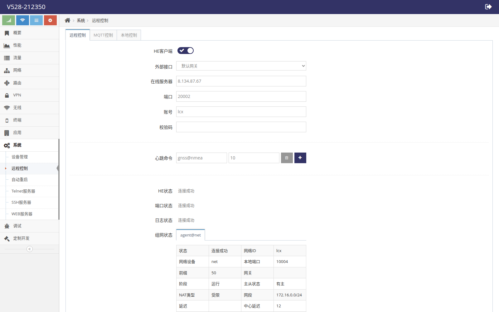

- 本条操作所在页面界面实录。

**界面判断**

| | 条件 |
|--|------|
| **成功** | 页面与操作符合预期 |
| **失败** | 报错或关键控件无效 |
| **skip** | 无 Web 或无该菜单 |

**环境判断**

| | 条件 |
|--|------|
| **成功** | 菜单存在且允许操作 |
| **失败** | 环境导致无法操作 |
| **skip** | 无菜单 → skip；缺外设 → env |

**命令行判断**

| | 条件 |
|--|------|
| **成功** | HE 可读/可写与界面一致 |
| **失败** | HE 失败非环境 |
| **skip** | 无法 Telnet |

**本条总评**

| 判定类 | 结果（执行时勾选） |
|--------|--------------------|
| 界面 | ☐ pass　☐ fail　☐ skip |
| 环境 | ☐ pass　☐ fail　☐ skip |
| 命令行 | ☐ pass　☐ fail　☐ skip |
| **总评** | 任一类 fail → 本条 fail；已测类均为 pass、其余 skip → 本条 pass；三类皆 skip → env |


**恢复**  
无需恢复。

---
### SYS-AGENT-02 Local Control 广播/端口查看

**功能说明**  
查看本地控制参数。

**侧栏路径**  
`系统 → 远程控制`

**需要的环境**（勾选已有项）

- [ ] Web 可打开 `http://192.168.32.100/`
- [ ] 已按 LOGIN-02 登录 Web（或本条自行登录）

**步骤**

#### 1. 界面

1. 打开 `系统 → 远程控制`。
2. 查看本地控制参数。

#### 2. 命令行

Telnet 登录后在 eline（`$`）执行，或 ashy：`he '…'`：

```text
land@machine.status
```

**截图**


- 本条操作所在页面界面实录。

**界面判断**

| | 条件 |
|--|------|
| **成功** | 页面与操作符合预期 |
| **失败** | 报错或关键控件无效 |
| **skip** | 无 Web 或无该菜单 |

**环境判断**

| | 条件 |
|--|------|
| **成功** | 菜单存在且允许操作 |
| **失败** | 环境导致无法操作 |
| **skip** | 无菜单 → skip；缺外设 → env |

**命令行判断**

| | 条件 |
|--|------|
| **成功** | HE 可读/可写与界面一致 |
| **失败** | HE 失败非环境 |
| **skip** | 无法 Telnet |

**本条总评**

| 判定类 | 结果（执行时勾选） |
|--------|--------------------|
| 界面 | ☐ pass　☐ fail　☐ skip |
| 环境 | ☐ pass　☐ fail　☐ skip |
| 命令行 | ☐ pass　☐ fail　☐ skip |
| **总评** | 任一类 fail → 本条 fail；已测类均为 pass、其余 skip → 本条 pass；三类皆 skip → env |


**恢复**  
轻改须恢复。

---
### SYS-AGENT-03 Command Mode 代表值恢复

**功能说明**  
切换 Command Mode 后恢复。

**侧栏路径**  
`系统 → 远程控制`

**需要的环境**（勾选已有项）

- [ ] Web 可打开 `http://192.168.32.100/`
- [ ] 已按 LOGIN-02 登录 Web（或本条自行登录）

**步骤**

#### 1. 界面

1. 打开 `系统 → 远程控制`。
2. 切换 Command Mode 后恢复。

#### 2. 命令行

Telnet 登录后在 eline（`$`）执行，或 ashy：`he '…'`：

```text
land@machine.status
```

**截图**


- 本条操作所在页面界面实录。

**界面判断**

| | 条件 |
|--|------|
| **成功** | 页面与操作符合预期 |
| **失败** | 报错或关键控件无效 |
| **skip** | 无 Web 或无该菜单 |

**环境判断**

| | 条件 |
|--|------|
| **成功** | 菜单存在且允许操作 |
| **失败** | 环境导致无法操作 |
| **skip** | 无菜单 → skip；缺外设 → env |

**命令行判断**

| | 条件 |
|--|------|
| **成功** | HE 可读/可写与界面一致 |
| **失败** | HE 失败非环境 |
| **skip** | 无法 Telnet |

**本条总评**

| 判定类 | 结果（执行时勾选） |
|--------|--------------------|
| 界面 | ☐ pass　☐ fail　☐ skip |
| 环境 | ☐ pass　☐ fail　☐ skip |
| 命令行 | ☐ pass　☐ fail　☐ skip |
| **总评** | 任一类 fail → 本条 fail；已测类均为 pass、其余 skip → 本条 pass；三类皆 skip → env |


**恢复**  
恢复。

---
### SYS-AGENT-04 Agent Control json 端口查看

**功能说明**  
查看 Agent 端口。

**侧栏路径**  
`系统 → 远程控制`

**需要的环境**（勾选已有项）

- [ ] Web 可打开 `http://192.168.32.100/`
- [ ] 已按 LOGIN-02 登录 Web（或本条自行登录）

**步骤**

#### 1. 界面

1. 打开 `系统 → 远程控制`。
2. 查看 Agent 端口。

#### 2. 命令行

Telnet 登录后在 eline（`$`）执行，或 ashy：`he '…'`：

```text
land@machine.status
```

**截图**


- 本条操作所在页面界面实录。

**界面判断**

| | 条件 |
|--|------|
| **成功** | 页面与操作符合预期 |
| **失败** | 报错或关键控件无效 |
| **skip** | 无 Web 或无该菜单 |

**环境判断**

| | 条件 |
|--|------|
| **成功** | 菜单存在且允许操作 |
| **失败** | 环境导致无法操作 |
| **skip** | 无菜单 → skip；缺外设 → env |

**命令行判断**

| | 条件 |
|--|------|
| **成功** | HE 可读/可写与界面一致 |
| **失败** | HE 失败非环境 |
| **skip** | 无法 Telnet |

**本条总评**

| 判定类 | 结果（执行时勾选） |
|--------|--------------------|
| 界面 | ☐ pass　☐ fail　☐ skip |
| 环境 | ☐ pass　☐ fail　☐ skip |
| 命令行 | ☐ pass　☐ fail　☐ skip |
| **总评** | 任一类 fail → 本条 fail；已测类均为 pass、其余 skip → 本条 pass；三类皆 skip → env |


**恢复**  
轻改须恢复。

---
### SYS-AGENT-05 Agent 填 center 账号

**功能说明**  
无 center 账号 → env。

**侧栏路径**  
`系统 → 远程控制`

**需要的环境**（勾选已有项）

- [ ] Web 可打开 `http://192.168.32.100/`
- [ ] 已按 LOGIN-02 登录 Web（或本条自行登录）

**步骤**

#### 1. 界面

1. 打开 `系统 → 远程控制`。
2. 无 center 账号 → env。

#### 2. 命令行

Telnet 登录后在 eline（`$`）执行，或 ashy：`he '…'`：

```text
land@machine.status
```

**截图**


- 本条操作所在页面界面实录。

**界面判断**

| | 条件 |
|--|------|
| **成功** | 页面与操作符合预期 |
| **失败** | 报错或关键控件无效 |
| **skip** | 无 Web 或无该菜单 |

**环境判断**

| | 条件 |
|--|------|
| **成功** | 菜单存在且允许操作 |
| **失败** | 环境导致无法操作 |
| **skip** | 无菜单 → skip；缺外设 → env |

**命令行判断**

| | 条件 |
|--|------|
| **成功** | HE 可读/可写与界面一致 |
| **失败** | HE 失败非环境 |
| **skip** | 无法 Telnet |

**本条总评**

| 判定类 | 结果（执行时勾选） |
|--------|--------------------|
| 界面 | ☐ pass　☐ fail　☐ skip |
| 环境 | ☐ pass　☐ fail　☐ skip |
| 命令行 | ☐ pass　☐ fail　☐ skip |
| **总评** | 任一类 fail → 本条 fail；已测类均为 pass、其余 skip → 本条 pass；三类皆 skip → env |


**恢复**  
清测试账号。

---
### SYS-AGENT-06 MQTT Control 表单查看

**功能说明**  
查看 MQTT Control。

**侧栏路径**  
`系统 → 远程控制`

**需要的环境**（勾选已有项）

- [ ] Web 可打开 `http://192.168.32.100/`
- [ ] 已按 LOGIN-02 登录 Web（或本条自行登录）

**步骤**

#### 1. 界面

1. 打开 `系统 → 远程控制`。
2. 查看 MQTT Control。

#### 2. 命令行

Telnet 登录后在 eline（`$`）执行，或 ashy：`he '…'`：

```text
land@machine.status
```

**截图**


- 本条操作所在页面界面实录。

**界面判断**

| | 条件 |
|--|------|
| **成功** | 页面与操作符合预期 |
| **失败** | 报错或关键控件无效 |
| **skip** | 无 Web 或无该菜单 |

**环境判断**

| | 条件 |
|--|------|
| **成功** | 菜单存在且允许操作 |
| **失败** | 环境导致无法操作 |
| **skip** | 无菜单 → skip；缺外设 → env |

**命令行判断**

| | 条件 |
|--|------|
| **成功** | HE 可读/可写与界面一致 |
| **失败** | HE 失败非环境 |
| **skip** | 无法 Telnet |

**本条总评**

| 判定类 | 结果（执行时勾选） |
|--------|--------------------|
| 界面 | ☐ pass　☐ fail　☐ skip |
| 环境 | ☐ pass　☐ fail　☐ skip |
| 命令行 | ☐ pass　☐ fail　☐ skip |
| **总评** | 任一类 fail → 本条 fail；已测类均为 pass、其余 skip → 本条 pass；三类皆 skip → env |


**恢复**  
无需恢复。

---
### SYS-AGENT-07 MQTT 开关轻改恢复

**功能说明**  
切换 MQTT 开关后恢复。

**侧栏路径**  
`系统 → 远程控制`

**需要的环境**（勾选已有项）

- [ ] Web 可打开 `http://192.168.32.100/`
- [ ] 已按 LOGIN-02 登录 Web（或本条自行登录）

**步骤**

#### 1. 界面

1. 打开 `系统 → 远程控制`。
2. 切换 MQTT 开关后恢复。

#### 2. 命令行

Telnet 登录后在 eline（`$`）执行，或 ashy：`he '…'`：

```text
land@machine.status
```

**截图**


- 本条操作所在页面界面实录。

**界面判断**

| | 条件 |
|--|------|
| **成功** | 页面与操作符合预期 |
| **失败** | 报错或关键控件无效 |
| **skip** | 无 Web 或无该菜单 |

**环境判断**

| | 条件 |
|--|------|
| **成功** | 菜单存在且允许操作 |
| **失败** | 环境导致无法操作 |
| **skip** | 无菜单 → skip；缺外设 → env |

**命令行判断**

| | 条件 |
|--|------|
| **成功** | HE 可读/可写与界面一致 |
| **失败** | HE 失败非环境 |
| **skip** | 无法 Telnet |

**本条总评**

| 判定类 | 结果（执行时勾选） |
|--------|--------------------|
| 界面 | ☐ pass　☐ fail　☐ skip |
| 环境 | ☐ pass　☐ fail　☐ skip |
| 命令行 | ☐ pass　☐ fail　☐ skip |
| **总评** | 任一类 fail → 本条 fail；已测类均为 pass、其余 skip → 本条 pass；三类皆 skip → env |


**恢复**  
恢复。

---
### SYS-REBOOT-01 自动重启进入

**功能说明**  
进入自动重启。

**侧栏路径**  
`系统 → 自动重启`

**需要的环境**（勾选已有项）

- [ ] Web 可打开 `http://192.168.32.100/`
- [ ] 已按 LOGIN-02 登录 Web（或本条自行登录）

**步骤**

#### 1. 界面

1. 打开 `系统 → 自动重启`。
2. 进入自动重启。

#### 2. 命令行

Telnet 登录后在 eline（`$`）执行，或 ashy：`he '…'`：

```text
land@machine.status
```

**截图**

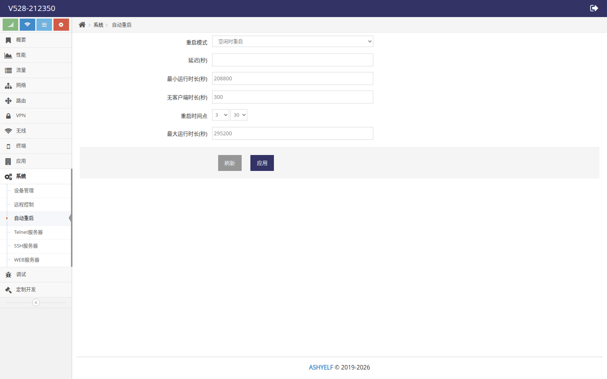

- 本条操作所在页面界面实录。

**界面判断**

| | 条件 |
|--|------|
| **成功** | 页面与操作符合预期 |
| **失败** | 报错或关键控件无效 |
| **skip** | 无 Web 或无该菜单 |

**环境判断**

| | 条件 |
|--|------|
| **成功** | 菜单存在且允许操作 |
| **失败** | 环境导致无法操作 |
| **skip** | 无菜单 → skip；缺外设 → env |

**命令行判断**

| | 条件 |
|--|------|
| **成功** | HE 可读/可写与界面一致 |
| **失败** | HE 失败非环境 |
| **skip** | 无法 Telnet |

**本条总评**

| 判定类 | 结果（执行时勾选） |
|--------|--------------------|
| 界面 | ☐ pass　☐ fail　☐ skip |
| 环境 | ☐ pass　☐ fail　☐ skip |
| 命令行 | ☐ pass　☐ fail　☐ skip |
| **总评** | 任一类 fail → 本条 fail；已测类均为 pass、其余 skip → 本条 pass；三类皆 skip → env |


**恢复**  
无需恢复。

---
### SYS-REBOOT-02 Reboot Mode 各代表值查看恢复

**功能说明**  
切换 Mode 代表值后恢复。

**侧栏路径**  
`系统 → 自动重启`

**需要的环境**（勾选已有项）

- [ ] Web 可打开 `http://192.168.32.100/`
- [ ] 已按 LOGIN-02 登录 Web（或本条自行登录）

**步骤**

#### 1. 界面

1. 打开 `系统 → 自动重启`。
2. 切换 Mode 代表值后恢复。

#### 2. 命令行

Telnet 登录后在 eline（`$`）执行，或 ashy：`he '…'`：

```text
land@machine.status
```

**截图**


- 本条操作所在页面界面实录。

**界面判断**

| | 条件 |
|--|------|
| **成功** | 页面与操作符合预期 |
| **失败** | 报错或关键控件无效 |
| **skip** | 无 Web 或无该菜单 |

**环境判断**

| | 条件 |
|--|------|
| **成功** | 菜单存在且允许操作 |
| **失败** | 环境导致无法操作 |
| **skip** | 无菜单 → skip；缺外设 → env |

**命令行判断**

| | 条件 |
|--|------|
| **成功** | HE 可读/可写与界面一致 |
| **失败** | HE 失败非环境 |
| **skip** | 无法 Telnet |

**本条总评**

| 判定类 | 结果（执行时勾选） |
|--------|--------------------|
| 界面 | ☐ pass　☐ fail　☐ skip |
| 环境 | ☐ pass　☐ fail　☐ skip |
| 命令行 | ☐ pass　☐ fail　☐ skip |
| **总评** | 任一类 fail → 本条 fail；已测类均为 pass、其余 skip → 本条 pass；三类皆 skip → env |


**恢复**  
恢复；勿留下临近重启点。

---
### SYS-REBOOT-03 Point 时间设置恢复

**功能说明**  
改 Point 时间后恢复。

**侧栏路径**  
`系统 → 自动重启`

**需要的环境**（勾选已有项）

- [ ] Web 可打开 `http://192.168.32.100/`
- [ ] 已按 LOGIN-02 登录 Web（或本条自行登录）

**步骤**

#### 1. 界面

1. 打开 `系统 → 自动重启`。
2. 改 Point 时间后恢复。

#### 2. 命令行

Telnet 登录后在 eline（`$`）执行，或 ashy：`he '…'`：

```text
land@machine.status
```

**截图**


- 本条操作所在页面界面实录。

**界面判断**

| | 条件 |
|--|------|
| **成功** | 页面与操作符合预期 |
| **失败** | 报错或关键控件无效 |
| **skip** | 无 Web 或无该菜单 |

**环境判断**

| | 条件 |
|--|------|
| **成功** | 菜单存在且允许操作 |
| **失败** | 环境导致无法操作 |
| **skip** | 无菜单 → skip；缺外设 → env |

**命令行判断**

| | 条件 |
|--|------|
| **成功** | HE 可读/可写与界面一致 |
| **失败** | HE 失败非环境 |
| **skip** | 无法 Telnet |

**本条总评**

| 判定类 | 结果（执行时勾选） |
|--------|--------------------|
| 界面 | ☐ pass　☐ fail　☐ skip |
| 环境 | ☐ pass　☐ fail　☐ skip |
| 命令行 | ☐ pass　☐ fail　☐ skip |
| **总评** | 任一类 fail → 本条 fail；已测类均为 pass、其余 skip → 本条 pass；三类皆 skip → env |


**恢复**  
恢复。

---
### SYS-WEB-01 WEB 服务器进入

**功能说明**  
进入 WEB 服务器。

**侧栏路径**  
`系统 → WEB服务器`

**需要的环境**（勾选已有项）

- [ ] Web 可打开 `http://192.168.32.100/`
- [ ] 已按 LOGIN-02 登录 Web（或本条自行登录）

**步骤**

#### 1. 界面

1. 打开 `系统 → WEB服务器`。
2. 进入 WEB 服务器。

#### 2. 命令行

Telnet 登录后在 eline（`$`）执行，或 ashy：`he '…'`：

```text
land@machine.status
```

**截图**

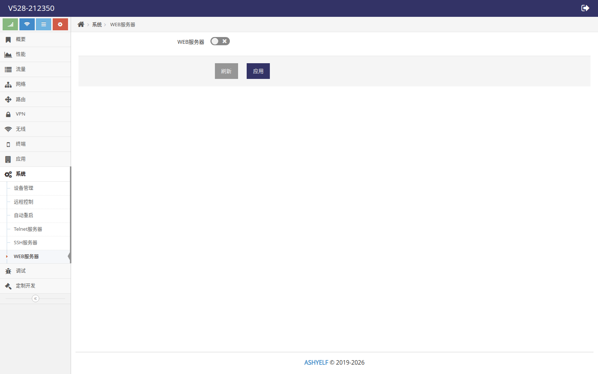

- 本条操作所在页面界面实录。

**界面判断**

| | 条件 |
|--|------|
| **成功** | 页面与操作符合预期 |
| **失败** | 报错或关键控件无效 |
| **skip** | 无 Web 或无该菜单 |

**环境判断**

| | 条件 |
|--|------|
| **成功** | 菜单存在且允许操作 |
| **失败** | 环境导致无法操作 |
| **skip** | 无菜单 → skip；缺外设 → env |

**命令行判断**

| | 条件 |
|--|------|
| **成功** | HE 可读/可写与界面一致 |
| **失败** | HE 失败非环境 |
| **skip** | 无法 Telnet |

**本条总评**

| 判定类 | 结果（执行时勾选） |
|--------|--------------------|
| 界面 | ☐ pass　☐ fail　☐ skip |
| 环境 | ☐ pass　☐ fail　☐ skip |
| 命令行 | ☐ pass　☐ fail　☐ skip |
| **总评** | 任一类 fail → 本条 fail；已测类均为 pass、其余 skip → 本条 pass；三类皆 skip → env |


**恢复**  
无需恢复。

---
### SYS-WEB-02 HTTP 开关/端口查看

**功能说明**  
查看 HTTP；改端口慎防锁死。

**侧栏路径**  
`系统 → WEB服务器`

**需要的环境**（勾选已有项）

- [ ] Web 可打开 `http://192.168.32.100/`
- [ ] 已按 LOGIN-02 登录 Web（或本条自行登录）

**步骤**

#### 1. 界面

1. 打开 `系统 → WEB服务器`。
2. 查看 HTTP；改端口慎防锁死。

#### 2. 命令行

Telnet 登录后在 eline（`$`）执行，或 ashy：`he '…'`：

```text
land@machine.status
```

**截图**


- 本条操作所在页面界面实录。

**界面判断**

| | 条件 |
|--|------|
| **成功** | 页面与操作符合预期 |
| **失败** | 报错或关键控件无效 |
| **skip** | 无 Web 或无该菜单 |

**环境判断**

| | 条件 |
|--|------|
| **成功** | 菜单存在且允许操作 |
| **失败** | 环境导致无法操作 |
| **skip** | 无菜单 → skip；缺外设 → env |

**命令行判断**

| | 条件 |
|--|------|
| **成功** | HE 可读/可写与界面一致 |
| **失败** | HE 失败非环境 |
| **skip** | 无法 Telnet |

**本条总评**

| 判定类 | 结果（执行时勾选） |
|--------|--------------------|
| 界面 | ☐ pass　☐ fail　☐ skip |
| 环境 | ☐ pass　☐ fail　☐ skip |
| 命令行 | ☐ pass　☐ fail　☐ skip |
| **总评** | 任一类 fail → 本条 fail；已测类均为 pass、其余 skip → 本条 pass；三类皆 skip → env |


**恢复**  
恢复；勿关死当前访问。

---
### SYS-WEB-03 HTTPS 开关/端口查看

**功能说明**  
查看 HTTPS。

**侧栏路径**  
`系统 → WEB服务器`

**需要的环境**（勾选已有项）

- [ ] Web 可打开 `http://192.168.32.100/`
- [ ] 已按 LOGIN-02 登录 Web（或本条自行登录）

**步骤**

#### 1. 界面

1. 打开 `系统 → WEB服务器`。
2. 查看 HTTPS。

#### 2. 命令行

Telnet 登录后在 eline（`$`）执行，或 ashy：`he '…'`：

```text
land@machine.status
```

**截图**


- 本条操作所在页面界面实录。

**界面判断**

| | 条件 |
|--|------|
| **成功** | 页面与操作符合预期 |
| **失败** | 报错或关键控件无效 |
| **skip** | 无 Web 或无该菜单 |

**环境判断**

| | 条件 |
|--|------|
| **成功** | 菜单存在且允许操作 |
| **失败** | 环境导致无法操作 |
| **skip** | 无菜单 → skip；缺外设 → env |

**命令行判断**

| | 条件 |
|--|------|
| **成功** | HE 可读/可写与界面一致 |
| **失败** | HE 失败非环境 |
| **skip** | 无法 Telnet |

**本条总评**

| 判定类 | 结果（执行时勾选） |
|--------|--------------------|
| 界面 | ☐ pass　☐ fail　☐ skip |
| 环境 | ☐ pass　☐ fail　☐ skip |
| 命令行 | ☐ pass　☐ fail　☐ skip |
| **总评** | 任一类 fail → 本条 fail；已测类均为 pass、其余 skip → 本条 pass；三类皆 skip → env |


**恢复**  
恢复。

---
### SYS-WEB-04 访问地址 ACL 查看

**功能说明**  
查看访问 ACL。

**侧栏路径**  
`系统 → WEB服务器`

**需要的环境**（勾选已有项）

- [ ] Web 可打开 `http://192.168.32.100/`
- [ ] 已按 LOGIN-02 登录 Web（或本条自行登录）

**步骤**

#### 1. 界面

1. 打开 `系统 → WEB服务器`。
2. 查看访问 ACL。

#### 2. 命令行

Telnet 登录后在 eline（`$`）执行，或 ashy：`he '…'`：

```text
land@machine.status
```

**截图**


- 本条操作所在页面界面实录。

**界面判断**

| | 条件 |
|--|------|
| **成功** | 页面与操作符合预期 |
| **失败** | 报错或关键控件无效 |
| **skip** | 无 Web 或无该菜单 |

**环境判断**

| | 条件 |
|--|------|
| **成功** | 菜单存在且允许操作 |
| **失败** | 环境导致无法操作 |
| **skip** | 无菜单 → skip；缺外设 → env |

**命令行判断**

| | 条件 |
|--|------|
| **成功** | HE 可读/可写与界面一致 |
| **失败** | HE 失败非环境 |
| **skip** | 无法 Telnet |

**本条总评**

| 判定类 | 结果（执行时勾选） |
|--------|--------------------|
| 界面 | ☐ pass　☐ fail　☐ skip |
| 环境 | ☐ pass　☐ fail　☐ skip |
| 命令行 | ☐ pass　☐ fail　☐ skip |
| **总评** | 任一类 fail → 本条 fail；已测类均为 pass、其余 skip → 本条 pass；三类皆 skip → env |


**恢复**  
勿锁死测试 PC。

---
### SYS-TELNET-01 Telnet 进入

**功能说明**  
进入 Telnet。

**侧栏路径**  
`系统 → Telnet服务器`

**需要的环境**（勾选已有项）

- [ ] Web 可打开 `http://192.168.32.100/`
- [ ] 已按 LOGIN-02 登录 Web（或本条自行登录）

**步骤**

#### 1. 界面

1. 打开 `系统 → Telnet服务器`。
2. 进入 Telnet。

#### 2. 命令行

Telnet 登录后在 eline（`$`）执行，或 ashy：`he '…'`：

```text
land@machine.status
```

**截图**

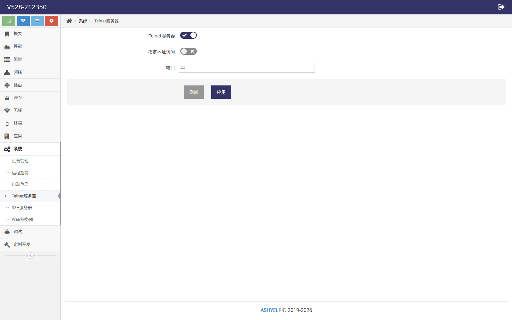

- 本条操作所在页面界面实录。

**界面判断**

| | 条件 |
|--|------|
| **成功** | 页面与操作符合预期 |
| **失败** | 报错或关键控件无效 |
| **skip** | 无 Web 或无该菜单 |

**环境判断**

| | 条件 |
|--|------|
| **成功** | 菜单存在且允许操作 |
| **失败** | 环境导致无法操作 |
| **skip** | 无菜单 → skip；缺外设 → env |

**命令行判断**

| | 条件 |
|--|------|
| **成功** | HE 可读/可写与界面一致 |
| **失败** | HE 失败非环境 |
| **skip** | 无法 Telnet |

**本条总评**

| 判定类 | 结果（执行时勾选） |
|--------|--------------------|
| 界面 | ☐ pass　☐ fail　☐ skip |
| 环境 | ☐ pass　☐ fail　☐ skip |
| 命令行 | ☐ pass　☐ fail　☐ skip |
| **总评** | 任一类 fail → 本条 fail；已测类均为 pass、其余 skip → 本条 pass；三类皆 skip → env |


**恢复**  
无需恢复。

---
### SYS-TELNET-02 开关/端口/ACL 查看恢复

**功能说明**  
查看；勿关死当前 Telnet 会话。

**侧栏路径**  
`系统 → Telnet服务器`

**需要的环境**（勾选已有项）

- [ ] Web 可打开 `http://192.168.32.100/`
- [ ] 已按 LOGIN-02 登录 Web（或本条自行登录）

**步骤**

#### 1. 界面

1. 打开 `系统 → Telnet服务器`。
2. 查看；勿关死当前 Telnet 会话。

#### 2. 命令行

Telnet 登录后在 eline（`$`）执行，或 ashy：`he '…'`：

```text
land@machine.status
```

**截图**


- 本条操作所在页面界面实录。

**界面判断**

| | 条件 |
|--|------|
| **成功** | 页面与操作符合预期 |
| **失败** | 报错或关键控件无效 |
| **skip** | 无 Web 或无该菜单 |

**环境判断**

| | 条件 |
|--|------|
| **成功** | 菜单存在且允许操作 |
| **失败** | 环境导致无法操作 |
| **skip** | 无菜单 → skip；缺外设 → env |

**命令行判断**

| | 条件 |
|--|------|
| **成功** | HE 可读/可写与界面一致 |
| **失败** | HE 失败非环境 |
| **skip** | 无法 Telnet |

**本条总评**

| 判定类 | 结果（执行时勾选） |
|--------|--------------------|
| 界面 | ☐ pass　☐ fail　☐ skip |
| 环境 | ☐ pass　☐ fail　☐ skip |
| 命令行 | ☐ pass　☐ fail　☐ skip |
| **总评** | 任一类 fail → 本条 fail；已测类均为 pass、其余 skip → 本条 pass；三类皆 skip → env |


**恢复**  
恢复；保持可测。

---
### SYS-SSH-01 SSH 进入

**功能说明**  
进入 SSH。

**侧栏路径**  
`系统 → SSH服务器`

**需要的环境**（勾选已有项）

- [ ] Web 可打开 `http://192.168.32.100/`
- [ ] 已按 LOGIN-02 登录 Web（或本条自行登录）

**步骤**

#### 1. 界面

1. 打开 `系统 → SSH服务器`。
2. 进入 SSH。

#### 2. 命令行

Telnet 登录后在 eline（`$`）执行，或 ashy：`he '…'`：

```text
land@machine.status
```

**截图**

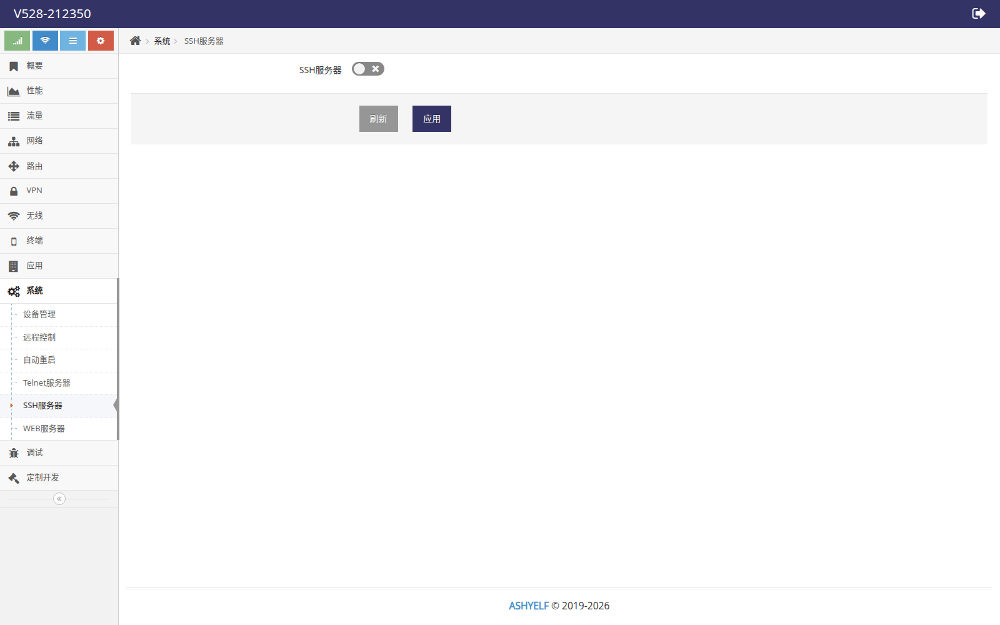

- 本条操作所在页面界面实录。

**界面判断**

| | 条件 |
|--|------|
| **成功** | 页面与操作符合预期 |
| **失败** | 报错或关键控件无效 |
| **skip** | 无 Web 或无该菜单 |

**环境判断**

| | 条件 |
|--|------|
| **成功** | 菜单存在且允许操作 |
| **失败** | 环境导致无法操作 |
| **skip** | 无菜单 → skip；缺外设 → env |

**命令行判断**

| | 条件 |
|--|------|
| **成功** | HE 可读/可写与界面一致 |
| **失败** | HE 失败非环境 |
| **skip** | 无法 Telnet |

**本条总评**

| 判定类 | 结果（执行时勾选） |
|--------|--------------------|
| 界面 | ☐ pass　☐ fail　☐ skip |
| 环境 | ☐ pass　☐ fail　☐ skip |
| 命令行 | ☐ pass　☐ fail　☐ skip |
| **总评** | 任一类 fail → 本条 fail；已测类均为 pass、其余 skip → 本条 pass；三类皆 skip → env |


**恢复**  
无需恢复。

---
### SYS-SSH-02 开关/端口/ACL 查看恢复

**功能说明**  
查看开关/端口/ACL。

**侧栏路径**  
`系统 → SSH服务器`

**需要的环境**（勾选已有项）

- [ ] Web 可打开 `http://192.168.32.100/`
- [ ] 已按 LOGIN-02 登录 Web（或本条自行登录）

**步骤**

#### 1. 界面

1. 打开 `系统 → SSH服务器`。
2. 查看开关/端口/ACL。

#### 2. 命令行

Telnet 登录后在 eline（`$`）执行，或 ashy：`he '…'`：

```text
land@machine.status
```

**截图**


- 本条操作所在页面界面实录。

**界面判断**

| | 条件 |
|--|------|
| **成功** | 页面与操作符合预期 |
| **失败** | 报错或关键控件无效 |
| **skip** | 无 Web 或无该菜单 |

**环境判断**

| | 条件 |
|--|------|
| **成功** | 菜单存在且允许操作 |
| **失败** | 环境导致无法操作 |
| **skip** | 无菜单 → skip；缺外设 → env |

**命令行判断**

| | 条件 |
|--|------|
| **成功** | HE 可读/可写与界面一致 |
| **失败** | HE 失败非环境 |
| **skip** | 无法 Telnet |

**本条总评**

| 判定类 | 结果（执行时勾选） |
|--------|--------------------|
| 界面 | ☐ pass　☐ fail　☐ skip |
| 环境 | ☐ pass　☐ fail　☐ skip |
| 命令行 | ☐ pass　☐ fail　☐ skip |
| **总评** | 任一类 fail → 本条 fail；已测类均为 pass、其余 skip → 本条 pass；三类皆 skip → env |


**恢复**  
恢复。

---
## 12 调试 / 定制开发

### DBG-LOG-01 Syslog 进入

**功能说明**  
进入系统日志。

**侧栏路径**  
`调试 → 系统日志`

**需要的环境**（勾选已有项）

- [ ] Web 可打开 `http://192.168.32.100/`
- [ ] 已按 LOGIN-02 登录 Web（或本条自行登录）

**步骤**

#### 1. 界面

1. 打开 `调试 → 系统日志`。
2. 进入系统日志。

#### 2. 命令行

Telnet 登录后在 eline（`$`）执行，或 ashy：`he '…'`：

```text
land@machine.status
```

**截图**

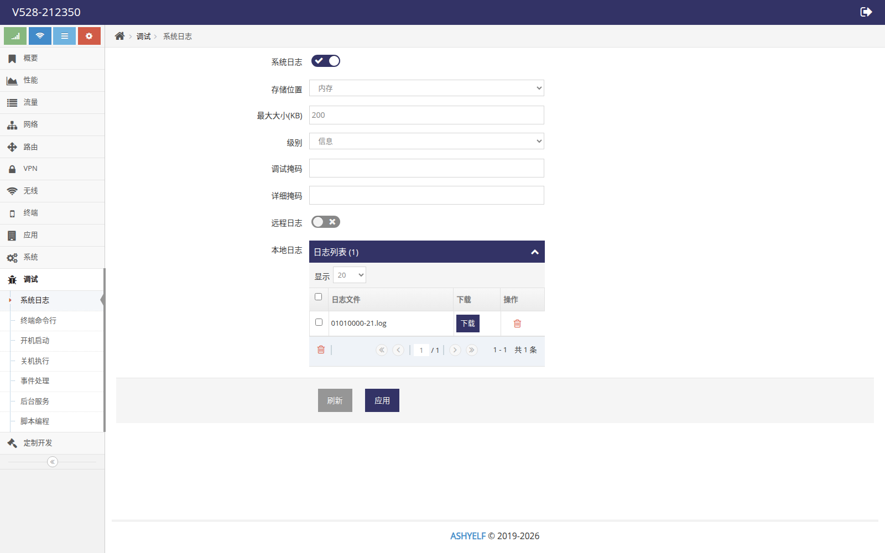

- 本条操作所在页面界面实录。

**界面判断**

| | 条件 |
|--|------|
| **成功** | 页面与操作符合预期 |
| **失败** | 报错或关键控件无效 |
| **skip** | 无 Web 或无该菜单 |

**环境判断**

| | 条件 |
|--|------|
| **成功** | 菜单存在且允许操作 |
| **失败** | 环境导致无法操作 |
| **skip** | 无菜单 → skip；缺外设 → env |

**命令行判断**

| | 条件 |
|--|------|
| **成功** | HE 可读/可写与界面一致 |
| **失败** | HE 失败非环境 |
| **skip** | 无法 Telnet |

**本条总评**

| 判定类 | 结果（执行时勾选） |
|--------|--------------------|
| 界面 | ☐ pass　☐ fail　☐ skip |
| 环境 | ☐ pass　☐ fail　☐ skip |
| 命令行 | ☐ pass　☐ fail　☐ skip |
| **总评** | 任一类 fail → 本条 fail；已测类均为 pass、其余 skip → 本条 pass；三类皆 skip → env |


**恢复**  
无需恢复。

---
### DBG-LOG-02 Location/Level 设置恢复

**功能说明**  
改 Location/Level 后恢复。

**侧栏路径**  
`调试 → 系统日志`

**需要的环境**（勾选已有项）

- [ ] Web 可打开 `http://192.168.32.100/`
- [ ] 已按 LOGIN-02 登录 Web（或本条自行登录）

**步骤**

#### 1. 界面

1. 打开 `调试 → 系统日志`。
2. 改 Location/Level 后恢复。

#### 2. 命令行

Telnet 登录后在 eline（`$`）执行，或 ashy：`he '…'`：

```text
land@machine.status
```

**截图**


- 本条操作所在页面界面实录。

**界面判断**

| | 条件 |
|--|------|
| **成功** | 页面与操作符合预期 |
| **失败** | 报错或关键控件无效 |
| **skip** | 无 Web 或无该菜单 |

**环境判断**

| | 条件 |
|--|------|
| **成功** | 菜单存在且允许操作 |
| **失败** | 环境导致无法操作 |
| **skip** | 无菜单 → skip；缺外设 → env |

**命令行判断**

| | 条件 |
|--|------|
| **成功** | HE 可读/可写与界面一致 |
| **失败** | HE 失败非环境 |
| **skip** | 无法 Telnet |

**本条总评**

| 判定类 | 结果（执行时勾选） |
|--------|--------------------|
| 界面 | ☐ pass　☐ fail　☐ skip |
| 环境 | ☐ pass　☐ fail　☐ skip |
| 命令行 | ☐ pass　☐ fail　☐ skip |
| **总评** | 任一类 fail → 本条 fail；已测类均为 pass、其余 skip → 本条 pass；三类皆 skip → env |


**恢复**  
恢复。

---
### DBG-LOG-03 远程日志开关查看

**功能说明**  
查看远程日志开关。

**侧栏路径**  
`调试 → 系统日志`

**需要的环境**（勾选已有项）

- [ ] Web 可打开 `http://192.168.32.100/`
- [ ] 已按 LOGIN-02 登录 Web（或本条自行登录）

**步骤**

#### 1. 界面

1. 打开 `调试 → 系统日志`。
2. 查看远程日志开关。

#### 2. 命令行

Telnet 登录后在 eline（`$`）执行，或 ashy：`he '…'`：

```text
land@machine.status
```

**截图**


- 本条操作所在页面界面实录。

**界面判断**

| | 条件 |
|--|------|
| **成功** | 页面与操作符合预期 |
| **失败** | 报错或关键控件无效 |
| **skip** | 无 Web 或无该菜单 |

**环境判断**

| | 条件 |
|--|------|
| **成功** | 菜单存在且允许操作 |
| **失败** | 环境导致无法操作 |
| **skip** | 无菜单 → skip；缺外设 → env |

**命令行判断**

| | 条件 |
|--|------|
| **成功** | HE 可读/可写与界面一致 |
| **失败** | HE 失败非环境 |
| **skip** | 无法 Telnet |

**本条总评**

| 判定类 | 结果（执行时勾选） |
|--------|--------------------|
| 界面 | ☐ pass　☐ fail　☐ skip |
| 环境 | ☐ pass　☐ fail　☐ skip |
| 命令行 | ☐ pass　☐ fail　☐ skip |
| **总评** | 任一类 fail → 本条 fail；已测类均为 pass、其余 skip → 本条 pass；三类皆 skip → env |


**恢复**  
轻改须恢复。

---
### DBG-LOG-04 日志文件下载入口

**功能说明**  
确认下载入口。

**侧栏路径**  
`调试 → 系统日志`

**需要的环境**（勾选已有项）

- [ ] Web 可打开 `http://192.168.32.100/`
- [ ] 已按 LOGIN-02 登录 Web（或本条自行登录）

**步骤**

#### 1. 界面

1. 打开 `调试 → 系统日志`。
2. 确认下载入口。

#### 2. 命令行

Telnet 登录后在 eline（`$`）执行，或 ashy：`he '…'`：

```text
land@machine.status
```

**截图**


- 本条操作所在页面界面实录。

**界面判断**

| | 条件 |
|--|------|
| **成功** | 页面与操作符合预期 |
| **失败** | 报错或关键控件无效 |
| **skip** | 无 Web 或无该菜单 |

**环境判断**

| | 条件 |
|--|------|
| **成功** | 菜单存在且允许操作 |
| **失败** | 环境导致无法操作 |
| **skip** | 无菜单 → skip；缺外设 → env |

**命令行判断**

| | 条件 |
|--|------|
| **成功** | HE 可读/可写与界面一致 |
| **失败** | HE 失败非环境 |
| **skip** | 无法 Telnet |

**本条总评**

| 判定类 | 结果（执行时勾选） |
|--------|--------------------|
| 界面 | ☐ pass　☐ fail　☐ skip |
| 环境 | ☐ pass　☐ fail　☐ skip |
| 命令行 | ☐ pass　☐ fail　☐ skip |
| **总评** | 任一类 fail → 本条 fail；已测类均为 pass、其余 skip → 本条 pass；三类皆 skip → env |


**恢复**  
无需恢复。

---
### DBG-LOG-05 Debug/Verb Mask 查看

**功能说明**  
查看 Debug/Verb Mask（若有）。

**侧栏路径**  
`调试 → 系统日志`

**需要的环境**（勾选已有项）

- [ ] Web 可打开 `http://192.168.32.100/`
- [ ] 已按 LOGIN-02 登录 Web（或本条自行登录）

**步骤**

#### 1. 界面

1. 打开 `调试 → 系统日志`。
2. 查看 Debug/Verb Mask（若有）。

#### 2. 命令行

Telnet 登录后在 eline（`$`）执行，或 ashy：`he '…'`：

```text
land@machine.status
```

**截图**


- 本条操作所在页面界面实录。

**界面判断**

| | 条件 |
|--|------|
| **成功** | 页面与操作符合预期 |
| **失败** | 报错或关键控件无效 |
| **skip** | 无 Web 或无该菜单 |

**环境判断**

| | 条件 |
|--|------|
| **成功** | 菜单存在且允许操作 |
| **失败** | 环境导致无法操作 |
| **skip** | 无菜单 → skip；缺外设 → env |

**命令行判断**

| | 条件 |
|--|------|
| **成功** | HE 可读/可写与界面一致 |
| **失败** | HE 失败非环境 |
| **skip** | 无法 Telnet |

**本条总评**

| 判定类 | 结果（执行时勾选） |
|--------|--------------------|
| 界面 | ☐ pass　☐ fail　☐ skip |
| 环境 | ☐ pass　☐ fail　☐ skip |
| 命令行 | ☐ pass　☐ fail　☐ skip |
| **总评** | 任一类 fail → 本条 fail；已测类均为 pass、其余 skip → 本条 pass；三类皆 skip → env |


**恢复**  
轻改须恢复。

---
### DBG-TERM-01 Terminal 进入

**功能说明**  
进入终端命令行页。

**侧栏路径**  
`调试 → 终端命令行`

**需要的环境**（勾选已有项）

- [ ] Web 可打开 `http://192.168.32.100/`
- [ ] 已按 LOGIN-02 登录 Web（或本条自行登录）

**步骤**

#### 1. 界面

1. 打开 `调试 → 终端命令行`。
2. 进入终端命令行页。

#### 2. 命令行

Telnet 登录后在 eline（`$`）执行，或 ashy：`he '…'`：

```text
land@machine.status
```

**截图**

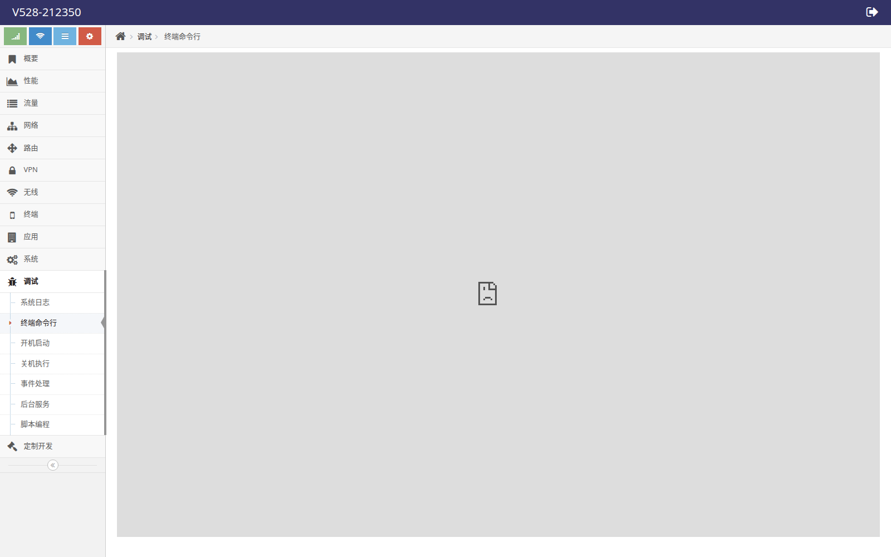

- 本条操作所在页面界面实录。

**界面判断**

| | 条件 |
|--|------|
| **成功** | 页面与操作符合预期 |
| **失败** | 报错或关键控件无效 |
| **skip** | 无 Web 或无该菜单 |

**环境判断**

| | 条件 |
|--|------|
| **成功** | 菜单存在且允许操作 |
| **失败** | 环境导致无法操作 |
| **skip** | 无菜单 → skip；缺外设 → env |

**命令行判断**

| | 条件 |
|--|------|
| **成功** | HE 可读/可写与界面一致 |
| **失败** | HE 失败非环境 |
| **skip** | 无法 Telnet |

**本条总评**

| 判定类 | 结果（执行时勾选） |
|--------|--------------------|
| 界面 | ☐ pass　☐ fail　☐ skip |
| 环境 | ☐ pass　☐ fail　☐ skip |
| 命令行 | ☐ pass　☐ fail　☐ skip |
| **总评** | 任一类 fail → 本条 fail；已测类均为 pass、其余 skip → 本条 pass；三类皆 skip → env |


**恢复**  
无需恢复。

---
### DBG-TERM-02 打开 HE 终端可输入

**功能说明**  
在页内终端输入只读 HE。

**侧栏路径**  
`调试 → 终端命令行`

**需要的环境**（勾选已有项）

- [ ] Web 可打开 `http://192.168.32.100/`
- [ ] 已按 LOGIN-02 登录 Web（或本条自行登录）

**步骤**

#### 1. 界面

1. 打开 `调试 → 终端命令行`。
2. 在页内终端输入只读 HE。

#### 2. 命令行

Telnet 登录后在 eline（`$`）执行，或 ashy：`he '…'`：

```text
land@machine.status
```

**截图**


- 本条操作所在页面界面实录。

**界面判断**

| | 条件 |
|--|------|
| **成功** | 页面与操作符合预期 |
| **失败** | 报错或关键控件无效 |
| **skip** | 无 Web 或无该菜单 |

**环境判断**

| | 条件 |
|--|------|
| **成功** | 菜单存在且允许操作 |
| **失败** | 环境导致无法操作 |
| **skip** | 无菜单 → skip；缺外设 → env |

**命令行判断**

| | 条件 |
|--|------|
| **成功** | HE 可读/可写与界面一致 |
| **失败** | HE 失败非环境 |
| **skip** | 无法 Telnet |

**本条总评**

| 判定类 | 结果（执行时勾选） |
|--------|--------------------|
| 界面 | ☐ pass　☐ fail　☐ skip |
| 环境 | ☐ pass　☐ fail　☐ skip |
| 命令行 | ☐ pass　☐ fail　☐ skip |
| **总评** | 任一类 fail → 本条 fail；已测类均为 pass、其余 skip → 本条 pass；三类皆 skip → env |


**恢复**  
无需恢复。

---
### DBG-INIT-01 Inittab 进入只读

**功能说明**  
只读查看 inittab。

**侧栏路径**  
`调试 → 开机启动`

**需要的环境**（勾选已有项）

- [ ] Web 可打开 `http://192.168.32.100/`
- [ ] 已按 LOGIN-02 登录 Web（或本条自行登录）

**步骤**

#### 1. 界面

1. 打开 `调试 → 开机启动`。
2. 只读查看 inittab。

#### 2. 命令行

Telnet 登录后在 eline（`$`）执行，或 ashy：`he '…'`：

```text
land@machine.status
```

**截图**


- 本条操作所在页面界面实录。

**界面判断**

| | 条件 |
|--|------|
| **成功** | 页面与操作符合预期 |
| **失败** | 报错或关键控件无效 |
| **skip** | 无 Web 或无该菜单 |

**环境判断**

| | 条件 |
|--|------|
| **成功** | 菜单存在且允许操作 |
| **失败** | 环境导致无法操作 |
| **skip** | 无菜单 → skip；缺外设 → env |

**命令行判断**

| | 条件 |
|--|------|
| **成功** | HE 可读/可写与界面一致 |
| **失败** | HE 失败非环境 |
| **skip** | 无法 Telnet |

**本条总评**

| 判定类 | 结果（执行时勾选） |
|--------|--------------------|
| 界面 | ☐ pass　☐ fail　☐ skip |
| 环境 | ☐ pass　☐ fail　☐ skip |
| 命令行 | ☐ pass　☐ fail　☐ skip |
| **总评** | 任一类 fail → 本条 fail；已测类均为 pass、其余 skip → 本条 pass；三类皆 skip → env |


**恢复**  
不改。

---
### DBG-INIT-02 Uninittab 进入只读

**功能说明**  
只读查看。

**侧栏路径**  
`调试 → 关机执行`

**需要的环境**（勾选已有项）

- [ ] Web 可打开 `http://192.168.32.100/`
- [ ] 已按 LOGIN-02 登录 Web（或本条自行登录）

**步骤**

#### 1. 界面

1. 打开 `调试 → 关机执行`。
2. 只读查看。

#### 2. 命令行

Telnet 登录后在 eline（`$`）执行，或 ashy：`he '…'`：

```text
land@machine.status
```

**截图**

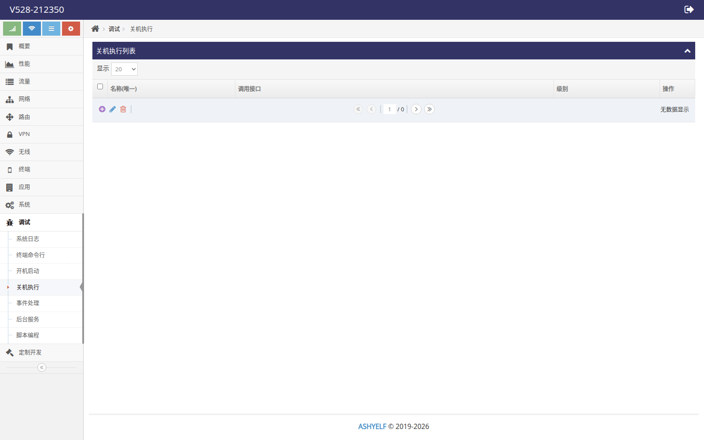

- 本条操作所在页面界面实录。

**界面判断**

| | 条件 |
|--|------|
| **成功** | 页面与操作符合预期 |
| **失败** | 报错或关键控件无效 |
| **skip** | 无 Web 或无该菜单 |

**环境判断**

| | 条件 |
|--|------|
| **成功** | 菜单存在且允许操作 |
| **失败** | 环境导致无法操作 |
| **skip** | 无菜单 → skip；缺外设 → env |

**命令行判断**

| | 条件 |
|--|------|
| **成功** | HE 可读/可写与界面一致 |
| **失败** | HE 失败非环境 |
| **skip** | 无法 Telnet |

**本条总评**

| 判定类 | 结果（执行时勾选） |
|--------|--------------------|
| 界面 | ☐ pass　☐ fail　☐ skip |
| 环境 | ☐ pass　☐ fail　☐ skip |
| 命令行 | ☐ pass　☐ fail　☐ skip |
| **总评** | 任一类 fail → 本条 fail；已测类均为 pass、其余 skip → 本条 pass；三类皆 skip → env |


**恢复**  
不改。

---
### DBG-JOINT-01 Jointtab 进入只读

**功能说明**  
只读查看。

**侧栏路径**  
`调试 → 事件处理`

**需要的环境**（勾选已有项）

- [ ] Web 可打开 `http://192.168.32.100/`
- [ ] 已按 LOGIN-02 登录 Web（或本条自行登录）

**步骤**

#### 1. 界面

1. 打开 `调试 → 事件处理`。
2. 只读查看。

#### 2. 命令行

Telnet 登录后在 eline（`$`）执行，或 ashy：`he '…'`：

```text
land@machine.status
```

**截图**


- 本条操作所在页面界面实录。

**界面判断**

| | 条件 |
|--|------|
| **成功** | 页面与操作符合预期 |
| **失败** | 报错或关键控件无效 |
| **skip** | 无 Web 或无该菜单 |

**环境判断**

| | 条件 |
|--|------|
| **成功** | 菜单存在且允许操作 |
| **失败** | 环境导致无法操作 |
| **skip** | 无菜单 → skip；缺外设 → env |

**命令行判断**

| | 条件 |
|--|------|
| **成功** | HE 可读/可写与界面一致 |
| **失败** | HE 失败非环境 |
| **skip** | 无法 Telnet |

**本条总评**

| 判定类 | 结果（执行时勾选） |
|--------|--------------------|
| 界面 | ☐ pass　☐ fail　☐ skip |
| 环境 | ☐ pass　☐ fail　☐ skip |
| 命令行 | ☐ pass　☐ fail　☐ skip |
| **总评** | 任一类 fail → 本条 fail；已测类均为 pass、其余 skip → 本条 pass；三类皆 skip → env |


**恢复**  
不改。

---
### DBG-DAEMON-01 Daemon 进入只读

**功能说明**  
只读查看。

**侧栏路径**  
`调试 → 后台服务`

**需要的环境**（勾选已有项）

- [ ] Web 可打开 `http://192.168.32.100/`
- [ ] 已按 LOGIN-02 登录 Web（或本条自行登录）

**步骤**

#### 1. 界面

1. 打开 `调试 → 后台服务`。
2. 只读查看。

#### 2. 命令行

Telnet 登录后在 eline（`$`）执行，或 ashy：`he '…'`：

```text
land@machine.status
```

**截图**

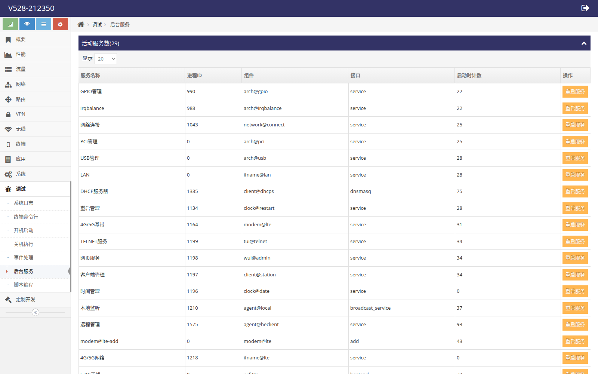

- 本条操作所在页面界面实录。

**界面判断**

| | 条件 |
|--|------|
| **成功** | 页面与操作符合预期 |
| **失败** | 报错或关键控件无效 |
| **skip** | 无 Web 或无该菜单 |

**环境判断**

| | 条件 |
|--|------|
| **成功** | 菜单存在且允许操作 |
| **失败** | 环境导致无法操作 |
| **skip** | 无菜单 → skip；缺外设 → env |

**命令行判断**

| | 条件 |
|--|------|
| **成功** | HE 可读/可写与界面一致 |
| **失败** | HE 失败非环境 |
| **skip** | 无法 Telnet |

**本条总评**

| 判定类 | 结果（执行时勾选） |
|--------|--------------------|
| 界面 | ☐ pass　☐ fail　☐ skip |
| 环境 | ☐ pass　☐ fail　☐ skip |
| 命令行 | ☐ pass　☐ fail　☐ skip |
| **总评** | 任一类 fail → 本条 fail；已测类均为 pass、其余 skip → 本条 pass；三类皆 skip → env |


**恢复**  
不改。

---
### DBG-SCRIPT-01 脚本编程进入

**功能说明**  
进入脚本编程。

**侧栏路径**  
`调试 → 脚本编程`

**需要的环境**（勾选已有项）

- [ ] Web 可打开 `http://192.168.32.100/`
- [ ] 已按 LOGIN-02 登录 Web（或本条自行登录）

**步骤**

#### 1. 界面

1. 打开 `调试 → 脚本编程`。
2. 进入脚本编程。

#### 2. 命令行

Telnet 登录后在 eline（`$`）执行，或 ashy：`he '…'`：

```text
land@machine.status
```

**截图**

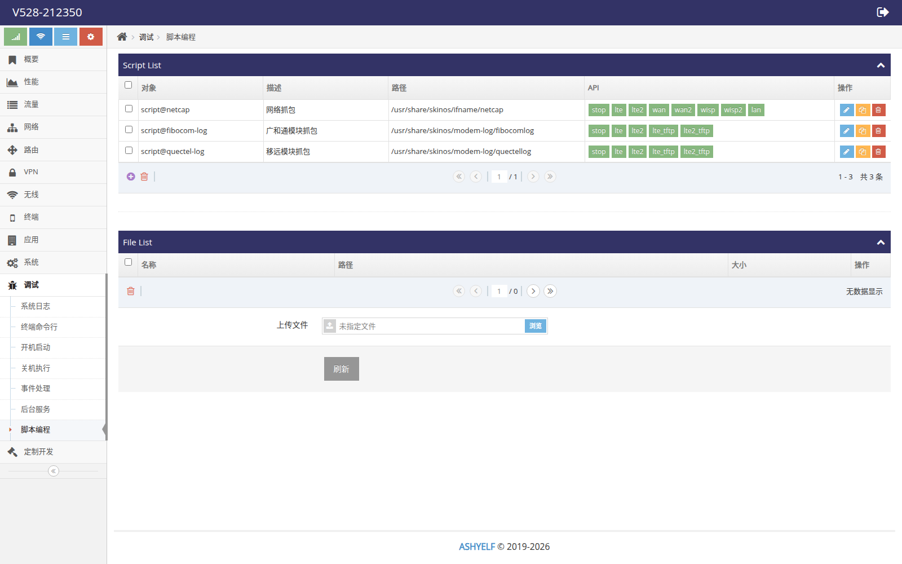

- 本条操作所在页面界面实录。

**界面判断**

| | 条件 |
|--|------|
| **成功** | 页面与操作符合预期 |
| **失败** | 报错或关键控件无效 |
| **skip** | 无 Web 或无该菜单 |

**环境判断**

| | 条件 |
|--|------|
| **成功** | 菜单存在且允许操作 |
| **失败** | 环境导致无法操作 |
| **skip** | 无菜单 → skip；缺外设 → env |

**命令行判断**

| | 条件 |
|--|------|
| **成功** | HE 可读/可写与界面一致 |
| **失败** | HE 失败非环境 |
| **skip** | 无法 Telnet |

**本条总评**

| 判定类 | 结果（执行时勾选） |
|--------|--------------------|
| 界面 | ☐ pass　☐ fail　☐ skip |
| 环境 | ☐ pass　☐ fail　☐ skip |
| 命令行 | ☐ pass　☐ fail　☐ skip |
| **总评** | 任一类 fail → 本条 fail；已测类均为 pass、其余 skip → 本条 pass；三类皆 skip → env |


**恢复**  
无需恢复。

---
### DBG-SCRIPT-02 脚本列表/编辑入口存在

**功能说明**  
确认列表/编辑入口。

**侧栏路径**  
`调试 → 脚本编程`

**需要的环境**（勾选已有项）

- [ ] Web 可打开 `http://192.168.32.100/`
- [ ] 已按 LOGIN-02 登录 Web（或本条自行登录）

**步骤**

#### 1. 界面

1. 打开 `调试 → 脚本编程`。
2. 确认列表/编辑入口。

#### 2. 命令行

Telnet 登录后在 eline（`$`）执行，或 ashy：`he '…'`：

```text
land@machine.status
```

**截图**


- 本条操作所在页面界面实录。

**界面判断**

| | 条件 |
|--|------|
| **成功** | 页面与操作符合预期 |
| **失败** | 报错或关键控件无效 |
| **skip** | 无 Web 或无该菜单 |

**环境判断**

| | 条件 |
|--|------|
| **成功** | 菜单存在且允许操作 |
| **失败** | 环境导致无法操作 |
| **skip** | 无菜单 → skip；缺外设 → env |

**命令行判断**

| | 条件 |
|--|------|
| **成功** | HE 可读/可写与界面一致 |
| **失败** | HE 失败非环境 |
| **skip** | 无法 Telnet |

**本条总评**

| 判定类 | 结果（执行时勾选） |
|--------|--------------------|
| 界面 | ☐ pass　☐ fail　☐ skip |
| 环境 | ☐ pass　☐ fail　☐ skip |
| 命令行 | ☐ pass　☐ fail　☐ skip |
| **总评** | 任一类 fail → 本条 fail；已测类均为 pass、其余 skip → 本条 pass；三类皆 skip → env |


**恢复**  
不运行危险脚本。

---
### DBG-SCRIPT-03 运行示例脚本

**功能说明**  
仅当有安全只读样例时运行。

**侧栏路径**  
`调试 → 脚本编程`

**需要的环境**（勾选已有项）

- [ ] Web 可打开 `http://192.168.32.100/`
- [ ] 已按 LOGIN-02 登录 Web（或本条自行登录）

**步骤**

#### 1. 界面

1. 打开 `调试 → 脚本编程`。
2. 仅当有安全只读样例时运行。

#### 2. 命令行

Telnet 登录后在 eline（`$`）执行，或 ashy：`he '…'`：

```text
land@machine.status
```

**截图**


- 本条操作所在页面界面实录。

**界面判断**

| | 条件 |
|--|------|
| **成功** | 页面与操作符合预期 |
| **失败** | 报错或关键控件无效 |
| **skip** | 无 Web 或无该菜单 |

**环境判断**

| | 条件 |
|--|------|
| **成功** | 菜单存在且允许操作 |
| **失败** | 环境导致无法操作 |
| **skip** | 无菜单 → skip；缺外设 → env |

**命令行判断**

| | 条件 |
|--|------|
| **成功** | HE 可读/可写与界面一致 |
| **失败** | HE 失败非环境 |
| **skip** | 无法 Telnet |

**本条总评**

| 判定类 | 结果（执行时勾选） |
|--------|--------------------|
| 界面 | ☐ pass　☐ fail　☐ skip |
| 环境 | ☐ pass　☐ fail　☐ skip |
| 命令行 | ☐ pass　☐ fail　☐ skip |
| **总评** | 任一类 fail → 本条 fail；已测类均为 pass、其余 skip → 本条 pass；三类皆 skip → env |


**恢复**  
不留测试脚本。

---
### DEV-NET-01 网络框架进入

**功能说明**  
进入网络框架。

**侧栏路径**  
`定制开发 → 网络框架`

**需要的环境**（勾选已有项）

- [ ] Web 可打开 `http://192.168.32.100/`
- [ ] 已按 LOGIN-02 登录 Web（或本条自行登录）

**步骤**

#### 1. 界面

1. 打开 `定制开发 → 网络框架`。
2. 进入网络框架。

#### 2. 命令行

Telnet 登录后在 eline（`$`）执行，或 ashy：`he '…'`：

```text
land@machine.status
```

**截图**

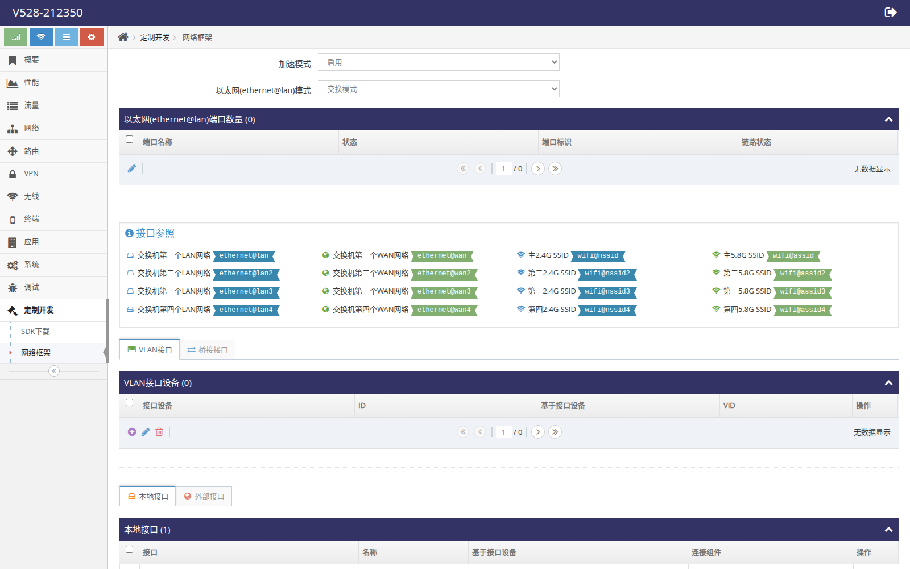

- 本条操作所在页面界面实录。

**界面判断**

| | 条件 |
|--|------|
| **成功** | 页面与操作符合预期 |
| **失败** | 报错或关键控件无效 |
| **skip** | 无 Web 或无该菜单 |

**环境判断**

| | 条件 |
|--|------|
| **成功** | 菜单存在且允许操作 |
| **失败** | 环境导致无法操作 |
| **skip** | 无菜单 → skip；缺外设 → env |

**命令行判断**

| | 条件 |
|--|------|
| **成功** | HE 可读/可写与界面一致 |
| **失败** | HE 失败非环境 |
| **skip** | 无法 Telnet |

**本条总评**

| 判定类 | 结果（执行时勾选） |
|--------|--------------------|
| 界面 | ☐ pass　☐ fail　☐ skip |
| 环境 | ☐ pass　☐ fail　☐ skip |
| 命令行 | ☐ pass　☐ fail　☐ skip |
| **总评** | 任一类 fail → 本条 fail；已测类均为 pass、其余 skip → 本条 pass；三类皆 skip → env |


**恢复**  
无需恢复。

---
### DEV-NET-02 当前模式与 status 一致

**功能说明**  
对照 mode 与 land@machine.status。

**侧栏路径**  
`定制开发 → 网络框架`

**需要的环境**（勾选已有项）

- [ ] Web 可打开 `http://192.168.32.100/`
- [ ] 已按 LOGIN-02 登录 Web（或本条自行登录）

**步骤**

#### 1. 界面

1. 打开 `定制开发 → 网络框架`。
2. 对照 mode 与 land@machine.status。

#### 2. 命令行

Telnet 登录后在 eline（`$`）执行，或 ashy：`he '…'`：

```text
land@machine.status
# mode=mwm
```

**截图**


- 本条操作所在页面界面实录。

**界面判断**

| | 条件 |
|--|------|
| **成功** | 页面与操作符合预期 |
| **失败** | 报错或关键控件无效 |
| **skip** | 无 Web 或无该菜单 |

**环境判断**

| | 条件 |
|--|------|
| **成功** | 菜单存在且允许操作 |
| **失败** | 环境导致无法操作 |
| **skip** | 无菜单 → skip；缺外设 → env |

**命令行判断**

| | 条件 |
|--|------|
| **成功** | HE 可读/可写与界面一致 |
| **失败** | HE 失败非环境 |
| **skip** | 无法 Telnet |

**本条总评**

| 判定类 | 结果（执行时勾选） |
|--------|--------------------|
| 界面 | ☐ pass　☐ fail　☐ skip |
| 环境 | ☐ pass　☐ fail　☐ skip |
| 命令行 | ☐ pass　☐ fail　☐ skip |
| **总评** | 任一类 fail → 本条 fail；已测类均为 pass、其余 skip → 本条 pass；三类皆 skip → env |


**恢复**  
不切换。

---
### DEV-NET-03 模式列表可读

**功能说明**  
查看 gateway/misp/mwm/mix 等列表。

**侧栏路径**  
`定制开发 → 网络框架`

**需要的环境**（勾选已有项）

- [ ] Web 可打开 `http://192.168.32.100/`
- [ ] 已按 LOGIN-02 登录 Web（或本条自行登录）

**步骤**

#### 1. 界面

1. 打开 `定制开发 → 网络框架`。
2. 查看 gateway/misp/mwm/mix 等列表。

#### 2. 命令行

Telnet 登录后在 eline（`$`）执行，或 ashy：`he '…'`：

```text
land@machine.status
```

**截图**


- 本条操作所在页面界面实录。

**界面判断**

| | 条件 |
|--|------|
| **成功** | 页面与操作符合预期 |
| **失败** | 报错或关键控件无效 |
| **skip** | 无 Web 或无该菜单 |

**环境判断**

| | 条件 |
|--|------|
| **成功** | 菜单存在且允许操作 |
| **失败** | 环境导致无法操作 |
| **skip** | 无菜单 → skip；缺外设 → env |

**命令行判断**

| | 条件 |
|--|------|
| **成功** | HE 可读/可写与界面一致 |
| **失败** | HE 失败非环境 |
| **skip** | 无法 Telnet |

**本条总评**

| 判定类 | 结果（执行时勾选） |
|--------|--------------------|
| 界面 | ☐ pass　☐ fail　☐ skip |
| 环境 | ☐ pass　☐ fail　☐ skip |
| 命令行 | ☐ pass　☐ fail　☐ skip |
| **总评** | 任一类 fail → 本条 fail；已测类均为 pass、其余 skip → 本条 pass；三类皆 skip → env |


**恢复**  
不切换。

---
### DEV-NET-04 不切换破坏性模式

**功能说明**  
文档禁止项：不切换离开 mwm。

**侧栏路径**  
`定制开发 → 网络框架`

**需要的环境**（勾选已有项）

- [ ] Web 可打开 `http://192.168.32.100/`
- [ ] 已按 LOGIN-02 登录 Web（或本条自行登录）

**步骤**

#### 1. 界面

1. 打开 `定制开发 → 网络框架`。
2. 文档禁止项：不切换离开 mwm。

#### 2. 命令行

Telnet 登录后在 eline（`$`）执行，或 ashy：`he '…'`：

```text
land@machine.status
```

**截图**


- 本条操作所在页面界面实录。

**界面判断**

| | 条件 |
|--|------|
| **成功** | 页面与操作符合预期 |
| **失败** | 报错或关键控件无效 |
| **skip** | 无 Web 或无该菜单 |

**环境判断**

| | 条件 |
|--|------|
| **成功** | 菜单存在且允许操作 |
| **失败** | 环境导致无法操作 |
| **skip** | 无菜单 → skip；缺外设 → env |

**命令行判断**

| | 条件 |
|--|------|
| **成功** | HE 可读/可写与界面一致 |
| **失败** | HE 失败非环境 |
| **skip** | 无法 Telnet |

**本条总评**

| 判定类 | 结果（执行时勾选） |
|--------|--------------------|
| 界面 | ☐ pass　☐ fail　☐ skip |
| 环境 | ☐ pass　☐ fail　☐ skip |
| 命令行 | ☐ pass　☐ fail　☐ skip |
| **总评** | 任一类 fail → 本条 fail；已测类均为 pass、其余 skip → 本条 pass；三类皆 skip → env |


**恢复**  
保持 mwm。

---
### DEV-NET-05 offload 等只读字段

**功能说明**  
查看 offload 等只读字段（若有）。

**侧栏路径**  
`定制开发 → 网络框架`

**需要的环境**（勾选已有项）

- [ ] Web 可打开 `http://192.168.32.100/`
- [ ] 已按 LOGIN-02 登录 Web（或本条自行登录）

**步骤**

#### 1. 界面

1. 打开 `定制开发 → 网络框架`。
2. 查看 offload 等只读字段（若有）。

#### 2. 命令行

Telnet 登录后在 eline（`$`）执行，或 ashy：`he '…'`：

```text
land@machine.status
```

**截图**


- 本条操作所在页面界面实录。

**界面判断**

| | 条件 |
|--|------|
| **成功** | 页面与操作符合预期 |
| **失败** | 报错或关键控件无效 |
| **skip** | 无 Web 或无该菜单 |

**环境判断**

| | 条件 |
|--|------|
| **成功** | 菜单存在且允许操作 |
| **失败** | 环境导致无法操作 |
| **skip** | 无菜单 → skip；缺外设 → env |

**命令行判断**

| | 条件 |
|--|------|
| **成功** | HE 可读/可写与界面一致 |
| **失败** | HE 失败非环境 |
| **skip** | 无法 Telnet |

**本条总评**

| 判定类 | 结果（执行时勾选） |
|--------|--------------------|
| 界面 | ☐ pass　☐ fail　☐ skip |
| 环境 | ☐ pass　☐ fail　☐ skip |
| 命令行 | ☐ pass　☐ fail　☐ skip |
| **总评** | 任一类 fail → 本条 fail；已测类均为 pass、其余 skip → 本条 pass；三类皆 skip → env |


**恢复**  
不改。

---
### DEV-SDK-01 SDK 下载

**功能说明**  
确认 SDK 下载页可开。

**侧栏路径**  
`定制开发 → SDK下载`

**需要的环境**（勾选已有项）

- [ ] Web 可打开 `http://192.168.32.100/`
- [ ] 已按 LOGIN-02 登录 Web（或本条自行登录）

**步骤**

#### 1. 界面

1. 打开 `定制开发 → SDK下载`。
2. 确认 SDK 下载页可开。

#### 2. 命令行

Telnet 登录后在 eline（`$`）执行，或 ashy：`he '…'`：

```text
land@machine.status
```

**截图**

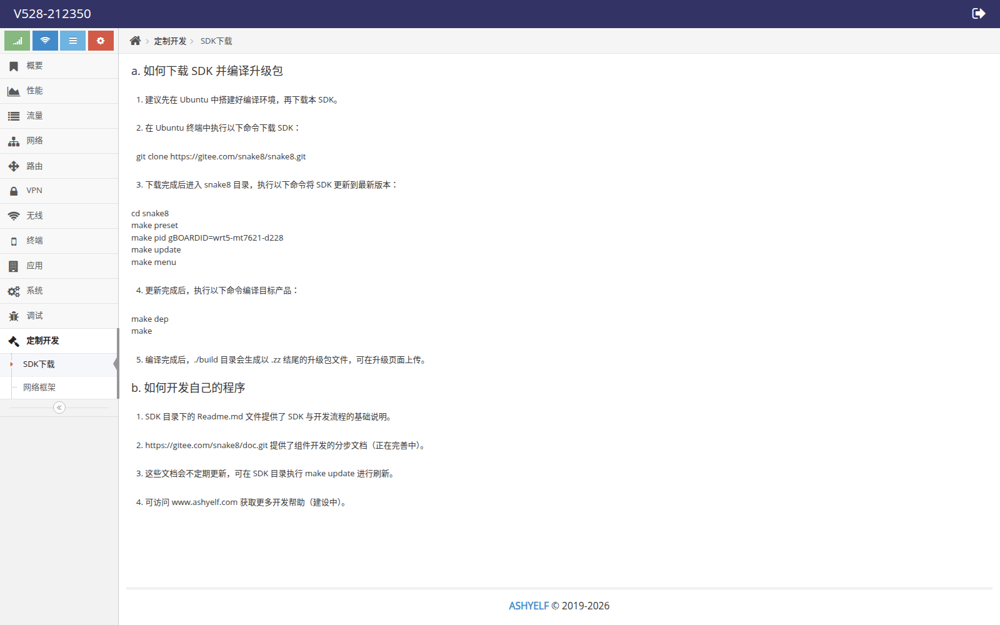

- 本条操作所在页面界面实录。

**界面判断**

| | 条件 |
|--|------|
| **成功** | 页面与操作符合预期 |
| **失败** | 报错或关键控件无效 |
| **skip** | 无 Web 或无该菜单 |

**环境判断**

| | 条件 |
|--|------|
| **成功** | 菜单存在且允许操作 |
| **失败** | 环境导致无法操作 |
| **skip** | 无菜单 → skip；缺外设 → env |

**命令行判断**

| | 条件 |
|--|------|
| **成功** | HE 可读/可写与界面一致 |
| **失败** | HE 失败非环境 |
| **skip** | 无法 Telnet |

**本条总评**

| 判定类 | 结果（执行时勾选） |
|--------|--------------------|
| 界面 | ☐ pass　☐ fail　☐ skip |
| 环境 | ☐ pass　☐ fail　☐ skip |
| 命令行 | ☐ pass　☐ fail　☐ skip |
| **总评** | 任一类 fail → 本条 fail；已测类均为 pass、其余 skip → 本条 pass；三类皆 skip → env |


**恢复**  
无需恢复。

---
## 附录 A · 截图规范

1. 截图主机需安装 CJK 字体（Noto Sans CJK SC）。  
2. 等中文文案加载完成后再截。  
3. 主图为用例对应页面；关键判定字段可红框标注。  
4. 本文件 `shots/` 目录已收录各侧栏页面实录。

## 附录 B · HE 写法提醒

- 改配置：`com:key=value` 或 JSON merge；**禁止** `com|key=val`。  
- ashy：`he 'land@machine.status'`（单引号）。  
- 对象名以页面 `object=` 参数及 eline `.com` 查询结果为准。

---

**文档统计**：共 304 条用例；每条含功能说明、侧栏路径、环境、界面步骤、命令行、界面实录图、三类判定与恢复。

