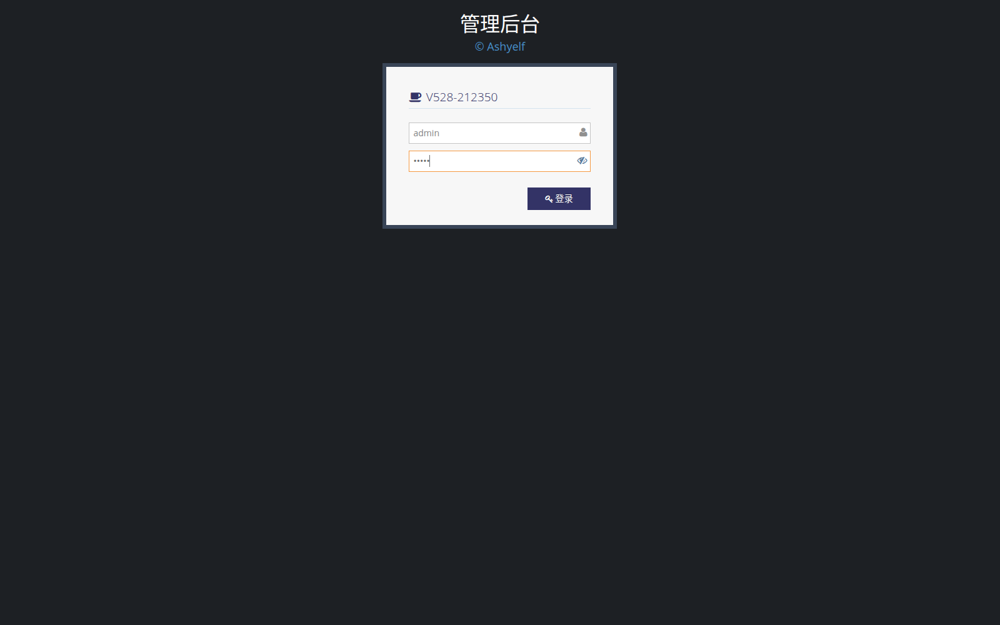

# 格式样例：NET-LTE-03（实机实录）

> 本文仅供确认用例格式与内容深度。数据来自 DUT `192.168.32.100`（2026-09-28，固件 `v8.6.0920`，型号 D228 / 显示名 V528-212350）。  
> **正式全集已写入** [`industrial-router.md`](./industrial-router.md)；覆盖表 [`coverage.md`](./coverage.md)。性能测试见 [`../performance/performance.md`](../performance/performance.md)。

---

## NET-LTE-03 4G/5G 拨号连接（确认已连接）

### 功能说明

4G/5G 拨号把蜂窝模组数据会话拉起来，使设备通过运营商网络上网。本机侧栏名称为 **网络 → 4G/5G网络**（对应英文手册 Network → LTE/NR）。仪表盘上的蜂窝卡片与本页状态应一致。

本条验证：**拨号成功后的已连接态**（本实录拍摄时链路已是 `up`，未强制先断开再拨，避免中断现场业务；若测前为断开态，则先点连接 / 执行 `modem@lte.connect`）。

### 侧栏路径

`网络 → 4G/5G网络`  
页面 URL（登录后）：`http://192.168.32.100/index.html#lte?object=ifname@lte`

### 需要的环境（勾选已有项）

- [x] Web 可打开 `http://192.168.32.100/`
- [x] Telnet `:23`，账号 `admin` / `admin`
- [x] 已插 SIM（本机 ICCID 见下）
- [x] 蜂窝天线已接（有信号：本实录 `signal=2`，`nettype=NR5G-SA`）

### 步骤

#### 1. 界面

1. 浏览器打开 `http://192.168.32.100/login.html`，用户名 `admin`，密码 `admin`，点钥匙按钮登录。  
2. 左侧点 **网络**，再点 **4G/5G网络**。  
3. 查看页顶状态区：制式、信号、IP、ICCID、IMEI、时延等。  
4. 若未连接：点连接（play）后等待 30～90 秒再刷新查看。

登录页（已填密码）实录：



4G/5G **状态表**实录（完整四行：状态/地址/网络/信号/ICCID/IMEI/在线时长/收发；**红框**标判定字段）：


无红框原图：


> **截图要求（本样例已按此出图）：** 等中文加载完成 → 裁完整状态表（含「状态」「连接成功」「中国电信」等）→ 红框只标：连接成功、中国电信、NR5G-SA、IP、ICCID、IMEI。下方 APN 配置表不进主图。  
> （旧图缺中文，是截图主机当时无 CJK 字体；现已装 Noto CJK 后重截。）

#### 2. 命令行

Telnet 登录 DUT 后，在 eline（`$`）下执行（或 ashy：`he '…'`）：

```text
land@machine.status
modem@lte.status
ifname@lte.status
```

若当前为断开态、需要主动拨号：

```text
modem@lte.connect
modem@lte.status
```

### 本实录命令行输出（2026-09-28 重截）

```text
$ land@machine.status
{
    "mode":"mwm",
    "name":"V528-212350",
    "platform":"swrt5",
    "hardware":"mt7621",
    "custom":"d228",
    "scope":"std",
    "version":"v8.6.0920",
    "mac":"88:12:4E:21:23:50",
    "model":"D228",
    "cmodel":"V528",
    "local_ip":"192.168.32.100"
}

$ modem@lte.status
{
    "netdev":"usb0",
    "imei":"861702060246799",
    "plmn":"46011",
    "band":"n28",
    "nettype":"NR5G-SA",
    "rsrp":"-100",
    "rsrq":"-12",
    "sinr":"6",
    "rssi":"-100",
    "signal":"2",
    "csq":"20",
    "operator":"China Telecom",
    "imsi":"460115219364957",
    "iccid":"89860322245952942301",
    "status":"up",
    "name":"Fibocom-FM160",
    "na":"enable"
}

$ ifname@lte.status
{
    "mode":"dhcpc",
    "ifname":"ifname@lte",
    "netdev":"usb0",
    "ip":"10.5.238.61",
    "gw":"10.5.238.62",
    "dns":"192.168.1.1",
    "ifdev":"modem@lte",
    "status":"up",
    "delay":"139",
    "mask":"255.255.255.0",
    "operator":"China Telecom",
    "iccid":"89860322245952942301"
}
```

完整原始输出另存：[`NET-LTE-03-he.txt`](./NET-LTE-03-he.txt)

### 界面判断

| | 条件 |
|--|------|
| **成功** | 能打开 `网络 → 4G/5G网络`；状态区显示已连接类信息；可见制式（如 `NR5G-SA`）或 IP（本实录 `10.5.238.61`）；ICCID/IMEI 可读 |
| **失败** | 侧栏无「4G/5G网络」；页面报错；长时间无地址且命令行亦非 `up`（排除环境） |
| **skip** | 无法打开 Web |

### 环境判断

| | 条件 |
|--|------|
| **成功** | SIM 已识别（有 ICCID）；有信号（`signal`≥1 或界面有信号格）；可选：经该上行能访问外网 |
| **失败** | 无卡、无信号、欠费无法附着（先修环境再测） |
| **skip** | 无 SIM / 无天线 → 本条记 **env**，不算产品失败 |

### 命令行判断

| | 条件 |
|--|------|
| **成功** | `modem@lte.status` 中 `status` 为 `up`；`iccid` 非空；`netdev` 非空；`ifname@lte.status` 中 `status` 为 `up` 且有 `ip`（本实录 `10.5.238.61`） |
| **失败** | Telnet 可用但 `status` 长期为 `nodevice`/`nosim` 等且非环境问题；`connect` 明确失败且非环境 |
| **skip** | 无法 Telnet |

### 本条总评（本实录）

| 判定类 | 结果 |
|--------|------|
| 界面 | **pass**（已截到 4G/5G 页，NR5G-SA，IP 10.5.238.61） |
| 环境 | **pass**（有 SIM/信号，中国电信） |
| 命令行 | **pass**（`modem@lte.status` / `ifname@lte.status` 均为 `up`） |
| **总评** | **pass**（现有条件下通过） |

### 恢复

本条为只读确认已连接态，未改配置，**无需恢复**。若测前执行了断开，可用界面连接或：

```text
modem@lte.connect
modem@lte.status
```

断开（下一条 NET-LTE-04，本条不执行）：

```text
modem@lte.down
# 或以 .modem@lte 列表中的 disconnect/offline/down 为准
modem@lte.status
```

---

## 请你确认

1. 字段顺序、三类判定表是否合适  
2. 截图 + 真实 HE 输出这种「实录」深度是否够  
3. 侧栏中文名（4G/5G网络）是否就按实机写（不再写 LTE/NR）  
4. 已连接态写成「拨号成功确认」、不强制先断再拨，是否接受  

确认后回复「格式可以」或列出要改的点；再批量写正式 `industrial-router.md`。
