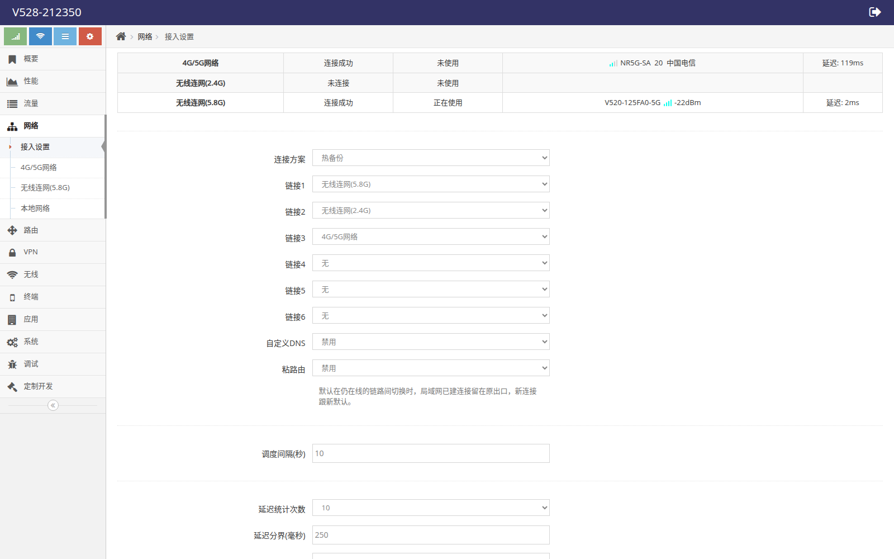
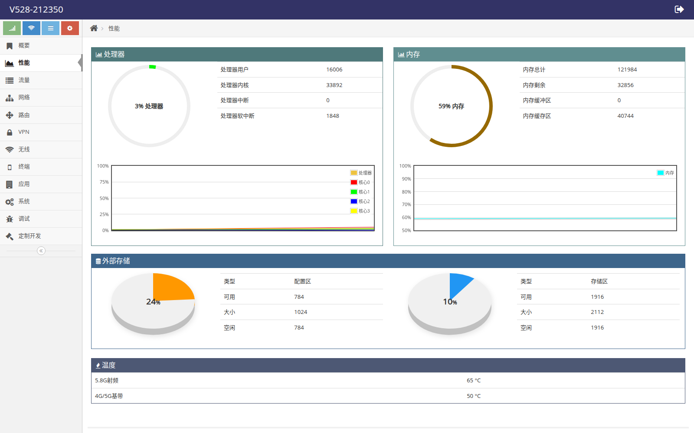
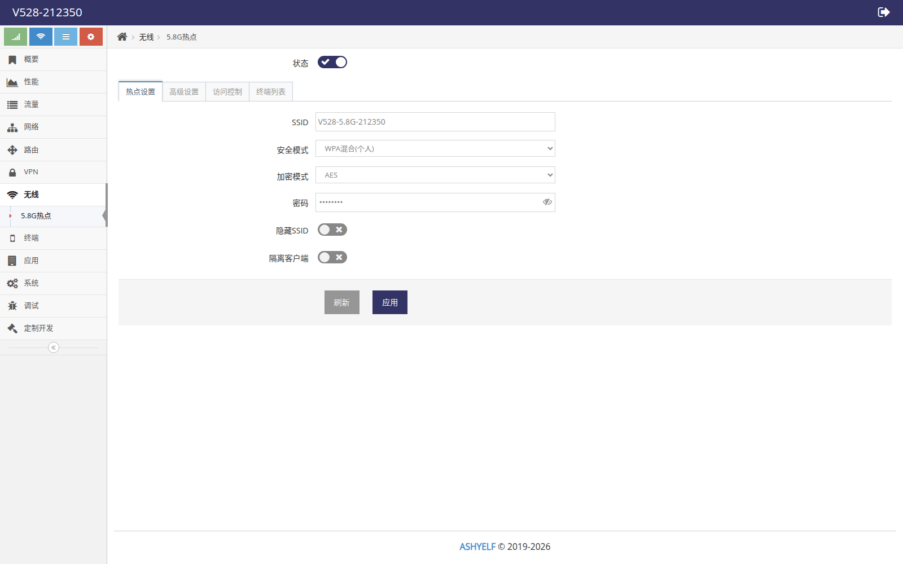
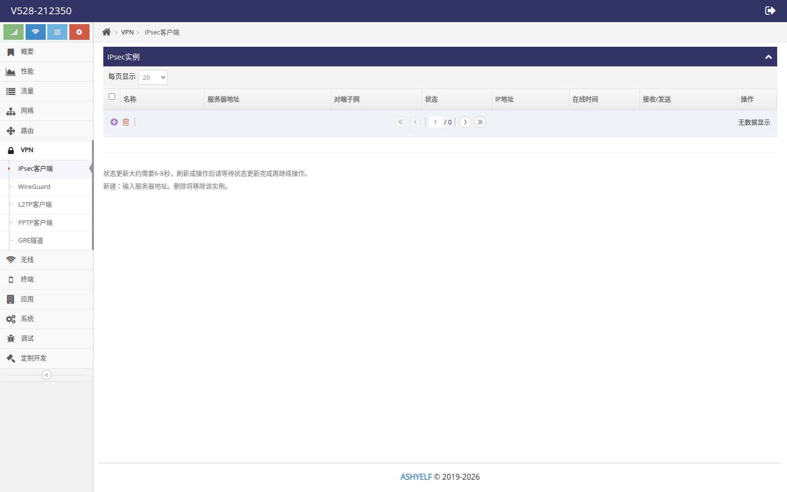
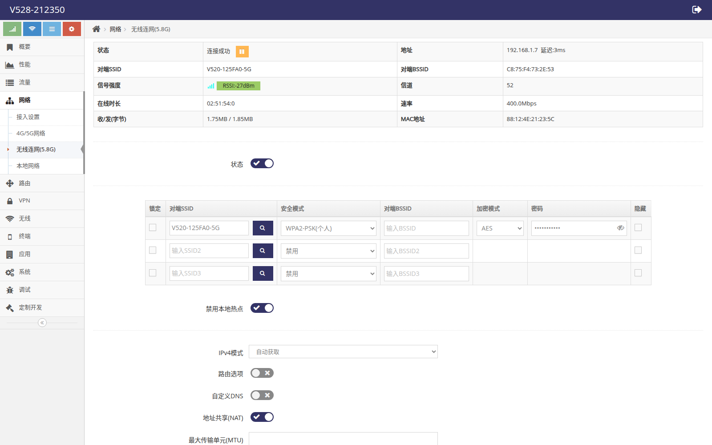
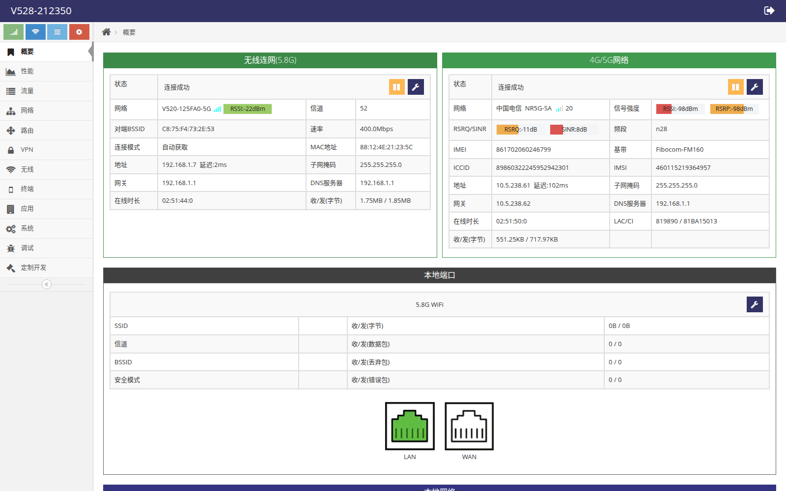

# D228 性能测试用例

> DUT：`http://192.168.32.100` · Telnet `:23` · `admin`/`admin`  
> 固件：`swrt5-mt7621-d228` / `v8.6.0920` · 模式 `mwm` · 显示名 V528-212350  
> 格式样例：[`sample-PERF-LTE-DL-01.md`](./sample-PERF-LTE-DL-01.md)（已确认并收录为 PERF-LTE-DL-01）  
> 功能用例见 [`../industrial-router/industrial-router.md`](../industrial-router/industrial-router.md)

## 怎么用

- 每条可走 **界面旁证** + **命令行测量**；缺外设/对端/流量额度记 **env**，不算产品失败。  
- **指标**：完成约定时长/字节的测量并记录数值（Mbps、ms、切换秒数等）。产品规格绝对门限未给出时，以「链路保持可用 + 测量完整可重复」为通过条件；有规格后把门限填进各条「判定说明」。  
- **工具约定**：优先 DUT ashy `curl`/`ping`/`iperf`；或 LAN 主机 `iperf3`/`curl`（默认网关指向 DUT）。公网 iperf 不可达时用 HTTPS 大包下载计量下行。  
- **纪律**：测后恢复配置；保持 `mwm`；不默认刷机/恢复出厂/Sys Reboot。  
- **截图**：链路页中文可见；关键状态/结果数字可红框。本仓库已附 PERF-LTE-DL-01 实录图与各侧栏页面图（`shots/`）。

## 目录

1. [A 蜂窝 LTE/NR](#a-蜂窝-ltenr)  
2. [B 有线转发](#b-有线转发)  
3. [C Wi-Fi](#c-wi-fi)  
4. [D VPN](#d-vpn)  
5. [E 链路切换](#e-链路切换)  
6. [F 稳定性](#f-稳定性)  
7. [附录 · 换算与工具](#附录--换算与工具)

---

## A 蜂窝 LTE/NR

### PERF-LTE-DL-01 蜂窝下行吞吐（经 LTE/NR）

**功能说明**  
验证 LTE/NR 已连接时，经蜂窝访问 Internet 的下行吞吐，并记录 RTT 旁证。DUT 本机 curl 大包下载，路径：应用→modem@lte→运营商→Internet。

**拓扑**

```text
[ Internet / Cloudflare ]
          ^
          |  NR5G-SA
   +------+-------+
   |  D228 DUT    |  modem@lte up
   | 192.168.32.100
   +--------------+
```

**侧栏路径（旁证）**  
`网络 → 4G/5G网络`
页面 URL：`http://192.168.32.100/index.html#lte?object=ifname@lte`

**需要的环境**（勾选已有项）

- [ ] Web / Telnet 可管理 DUT（`http://192.168.32.100`，`admin`/`admin`）
- [ ] SIM 已插入且未欠费，蜂窝天线已接
- [ ] `modem@lte.status` 中 `status=up`
- [ ] DUT 可访问外网（如 ping 8.8.8.8）
- [ ] DUT 具备 curl（HTTPS）或约定测速工具

**指标与判定阈值**

| 指标 | 方法 | 记录 | 判定说明 |
|------|------|------|----------|
| 下行吞吐 | DUT ashy：curl Cloudflare 30 MiB | 实录 **9.08 Mbps** | HTTP 200 且收满字节；链路保持 up；记录 Mbps |
| RTT | ping -c 10 8.8.8.8 | 实录 avg **45.3 ms** | 有稳定回包 |
| 链路态 | modem@lte.status / ifname@lte.status | up / NR5G-SA / 10.5.238.61 | 测前测后均为 up |

> 本条为样例实录（2026-09-28）。原文见 sample-PERF-LTE-DL-01.md；测量日志 PERF-LTE-DL-01-measure.txt。

**步骤**

#### 1. 界面（旁证）

1. 登录 Web，打开 网络 → 4G/5G网络。
2. 确认「连接成功」，可见制式/IP。
3. 测速中保持本页，确认不掉线。

状态表实录（红框：连接成功 / 电信+NR5G / IP）：


测量结果面板（红框：Mbps）：


#### 2. 命令行（测量 · 硬性）

Telnet 登录后 eline（`$`）或 ashy：

```text
modem@lte.status
ifname@lte.status

# ashy:
ping -c 10 -W 2 8.8.8.8
curl -k --max-time 180 -o /tmp/perf.bin \
  -w 'code=%{http_code} size=%{size_download} time=%{time_total} speed=%{speed_download}\n' \
  'https://speed.cloudflare.com/__down?bytes=31457280'
# Mbps = speed * 8 / 1000000
rm -f /tmp/perf.bin
```

### 本实录摘要（2026-09-28）

| 项 | 值 |
|----|-----|
| 下行 | **9.08 Mbps**（30 MiB / 27.722 s） |
| RTT | avg **45.329 ms**，0% loss |
| 制式 | NR5G-SA / China Telecom |

**界面判断**

| | 条件 |
|--|------|
| **成功** | 测速前后「连接成功」，可见制式或 IP |
| **失败** | 测速中掉线且 HE 长期非 up（排除环境） |
| **skip** | 无法打开 Web |

**环境判断**

| | 条件 |
|--|------|
| **成功** | SIM/信号/外网可达 |
| **失败** | 无卡、无信号、欠费、测速源被拦 |
| **skip** | 无 SIM/天线/不允许跑流量 → env |

**命令行（测量）判断**

| | 条件 |
|--|------|
| **成功** | 下载成功算出 Mbps；ping 有回包；链路 up |
| **失败** | 链路 up 且外网可达但约定下载反复失败 |
| **skip** | 无法 Telnet / 无 curl 且无替代工具 |

**本条总评**

| 判定类 | 结果（执行时勾选） |
|--------|--------------------|
| 界面 | ☐ pass　☐ fail　☐ skip |
| 环境 | ☐ pass　☐ fail　☐ skip |
| 命令行（测量） | ☐ pass　☐ fail　☐ skip |
| **总评** | 任一类 fail → 本条 fail；已测类均为 pass、其余 skip → 本条 pass；三类皆 skip → env |

**恢复**  
无需恢复。`rm -f /tmp/perf.bin`

---
### PERF-LTE-UL-01 蜂窝上行吞吐

**功能说明**  
验证经 LTE/NR 的上行吞吐。在 DUT 本机用 curl 上传或 iperf 客户端向可达 server 发送。

**拓扑**

```text
[ Internet / 上传目标 ]
          ^
          |  NR5G-SA 上行
   +------+-------+
   |  D228 DUT    |
   +--------------+
```

**侧栏路径（旁证）**  
`网络 → 4G/5G网络`
页面 URL：`http://192.168.32.100/index.html#lte?object=ifname@lte`

**需要的环境**（勾选已有项）

- [ ] Web / Telnet 可管理 DUT（`http://192.168.32.100`，`admin`/`admin`）
- [ ] SIM 已插入且未欠费，蜂窝天线已接
- [ ] `modem@lte.status` 中 `status=up`
- [ ] DUT 可访问外网（如 ping 8.8.8.8）
- [ ] DUT 具备 curl（HTTPS）或约定测速工具
- [ ] 具备可达的上传目标（HTTP PUT/POST 或 iperf -c）

**指标与判定阈值**

| 指标 | 方法 | 记录 | 判定说明 |
|------|------|------|----------|
| 上行吞吐 | DUT：curl -T 或 iperf -c <server> -t 30 -f m | ____ Mbps | 传满约定时长/字节；链路 up；记录 Mbps |
| 链路态 | modem@lte.status | up | 测前测后 up |

> 无可用上传端点时本条环境记 env。

**步骤**

#### 1. 界面（旁证）

1. 打开 4G/5G网络，确认已连接。

4G/5G 状态旁证：


#### 2. 命令行（测量 · 硬性）

Telnet 登录后 eline（`$`）或 ashy：

```text
modem@lte.status
ifname@lte.status

# ashy 示例（按实际上传目标替换 URL/server）:
dd if=/dev/zero bs=1M count=20 of=/tmp/up.bin
curl -k --max-time 180 -T /tmp/up.bin -o /dev/null \
  -w 'code=%{http_code} size=%{size_upload} time=%{time_total} speed=%{speed_upload}\n' \
  'https://<your-upload-endpoint>'
# 或: iperf -c <server> -t 30 -f m
rm -f /tmp/up.bin
```

**界面判断**

| | 条件 |
|--|------|
| **成功** | 连接成功保持 |
| **失败** | 上传中掉线且 HE 非 up |
| **skip** | 无 Web |

**环境判断**

| | 条件 |
|--|------|
| **成功** | 外网上行目标可达 |
| **失败** | 目标拒绝/防火墙 |
| **skip** | 无上传目标 → env |

**命令行（测量）判断**

| | 条件 |
|--|------|
| **成功** | 算出上行 Mbps；链路 up |
| **失败** | 链路 up 但上传反复失败（排除环境） |
| **skip** | 无工具 |

**本条总评**

| 判定类 | 结果（执行时勾选） |
|--------|--------------------|
| 界面 | ☐ pass　☐ fail　☐ skip |
| 环境 | ☐ pass　☐ fail　☐ skip |
| 命令行（测量） | ☐ pass　☐ fail　☐ skip |
| **总评** | 任一类 fail → 本条 fail；已测类均为 pass、其余 skip → 本条 pass；三类皆 skip → env |

**恢复**  
删临时文件；无需改配置。

---
### PERF-LTE-RTT-01 蜂窝 RTT / 丢包

**功能说明**  
量化经 LTE/NR 到固定外网主机的往返时延与丢包。

**侧栏路径（旁证）**  
`网络 → 4G/5G网络`
页面 URL：`http://192.168.32.100/index.html#lte?object=ifname@lte`

**需要的环境**（勾选已有项）

- [ ] Web / Telnet 可管理 DUT（`http://192.168.32.100`，`admin`/`admin`）
- [ ] SIM 已插入且未欠费，蜂窝天线已接
- [ ] `modem@lte.status` 中 `status=up`
- [ ] DUT 可访问外网（如 ping 8.8.8.8）
- [ ] DUT 具备 curl（HTTPS）或约定测速工具

**指标与判定阈值**

| 指标 | 方法 | 记录 | 判定说明 |
|------|------|------|----------|
| RTT avg/max | ping -c 20 8.8.8.8 | ____ ms | 记录 min/avg/max；对照页面「延迟」字段可旁证 |
| 丢包率 | 同上 | ____ % | 记录 packet loss |

**步骤**

#### 1. 界面（旁证）

1. 打开 4G/5G网络，查看状态表「延迟」数值作旁证。

状态表（含延迟）：


#### 2. 命令行（测量 · 硬性）

Telnet 登录后 eline（`$`）或 ashy：

```text
ifname@lte.status
# 关注 delay 字段

# ashy:
ping -c 20 -W 2 8.8.8.8
```

**界面判断**

| | 条件 |
|--|------|
| **成功** | 页面可打开且已连接 |
| **失败** | 页面异常 |
| **skip** | 无 Web |

**环境判断**

| | 条件 |
|--|------|
| **成功** | 外网 ICMP 可达 |
| **失败** | ICMP 被拦 |
| **skip** | 不允许 ping → env |

**命令行（测量）判断**

| | 条件 |
|--|------|
| **成功** | 完成 20 次 ping 并记录统计 |
| **失败** | 链路 up 但完全无回包（排除封锁） |
| **skip** | 无法 ashy |

**本条总评**

| 判定类 | 结果（执行时勾选） |
|--------|--------------------|
| 界面 | ☐ pass　☐ fail　☐ skip |
| 环境 | ☐ pass　☐ fail　☐ skip |
| 命令行（测量） | ☐ pass　☐ fail　☐ skip |
| **总评** | 任一类 fail → 本条 fail；已测类均为 pass、其余 skip → 本条 pass；三类皆 skip → env |

**恢复**  
无需恢复。

---
### PERF-LTE-DL-LAN-01 LAN 主机经 DUT 蜂窝下行

**功能说明**  
测试 PC 接 LAN、默认网关为 DUT，经 NAT/LTE 测下行（更接近终端用户路径）。

**拓扑**

```text
[ Internet ]
     ^
     | LTE
[ DUT ] <--- LAN --- [ 测试 PC ]
网关=192.168.32.100
```

**侧栏路径（旁证）**  
`网络 → 4G/5G网络` / `本地网络`
页面 URL：`http://192.168.32.100/index.html#lte?object=ifname@lte`

**需要的环境**（勾选已有项）

- [ ] Web / Telnet 可管理 DUT（`http://192.168.32.100`，`admin`/`admin`）
- [ ] 测试 PC 接在 DUT LAN，并以 DUT 为默认网关（或对测速目标强制经 DUT）
- [ ] 蜂窝或约定上行 `up`，DUT 可 NAT 出外网

**指标与判定阈值**

| 指标 | 方法 | 记录 | 判定说明 |
|------|------|------|----------|
| 下行吞吐 | PC：curl 或 iperf3 -c <server> -R -t 60 | ____ Mbps | 网关确为 DUT；传满；记录 Mbps |
| 路径确认 | PC：ip route / traceroute | 下一跳为 DUT | 避免误走其它网关 |

**步骤**

#### 1. 界面（旁证）

1. 确认 4G/5G 已连接。
2. 确认本地网络 LAN IP 与 PC 同网段。

LTE 状态：


LAN：


#### 2. 命令行（测量 · 硬性）

Telnet 登录后 eline（`$`）或 ashy：

```text
ifname@lte.status
ifname@lan.status

# 在测试 PC（网关=DUT）:
curl -k --max-time 180 -o /tmp/perf.bin \
  -w 'code=%{http_code} size=%{size_download} time=%{time_total} speed=%{speed_download}\n' \
  'https://speed.cloudflare.com/__down?bytes=31457280'
# 或: iperf3 -c <server> -R -t 60 -f m
rm -f /tmp/perf.bin
```

**界面判断**

| | 条件 |
|--|------|
| **成功** | LTE/LAN 页状态正常 |
| **失败** | Web 异常 |
| **skip** | 无 Web |

**环境判断**

| | 条件 |
|--|------|
| **成功** | PC 网关为 DUT 且经 LTE 出网 |
| **失败** | PC 仍走其它网关 |
| **skip** | 无法改 PC 路由 → env |

**命令行（测量）判断**

| | 条件 |
|--|------|
| **成功** | 测量完整并记录 Mbps |
| **失败** | 网关正确但下载失败（排除环境） |
| **skip** | PC 无工具 |

**本条总评**

| 判定类 | 结果（执行时勾选） |
|--------|--------------------|
| 界面 | ☐ pass　☐ fail　☐ skip |
| 环境 | ☐ pass　☐ fail　☐ skip |
| 命令行（测量） | ☐ pass　☐ fail　☐ skip |
| **总评** | 任一类 fail → 本条 fail；已测类均为 pass、其余 skip → 本条 pass；三类皆 skip → env |

**恢复**  
恢复 PC 原默认网关（若曾修改）。

---
## B 有线转发

### PERF-LAN-RTT-01 LAN 到 DUT 时延

**功能说明**  
测量测试 PC 到 DUT LAN 地址的 RTT，作为有线侧基线。

**拓扑**

```text
[ PC ] ---LAN--- [ DUT 192.168.32.100 ]
```

**侧栏路径（旁证）**  
`网络 → 本地网络`
页面 URL：`http://192.168.32.100/index.html#lan?object=ifname@lan`

**需要的环境**（勾选已有项）

- [ ] Web / Telnet 可管理 DUT（`http://192.168.32.100`，`admin`/`admin`）
- [ ] PC 与 DUT 同 LAN 网段

**指标与判定阈值**

| 指标 | 方法 | 记录 | 判定说明 |
|------|------|------|----------|
| RTT | PC：ping -c 20 192.168.32.100 | ____ ms | 记录 avg；通常应远小于蜂窝 RTT |

**步骤**

#### 1. 界面（旁证）

1. 打开本地网络，确认 LAN IP。

LAN 页：


#### 2. 命令行（测量 · 硬性）

Telnet 登录后 eline（`$`）或 ashy：

```text
ifname@lan.status

# 测试 PC:
ping -c 20 -W 1 192.168.32.100
```

**界面判断**

| | 条件 |
|--|------|
| **成功** | LAN 页可读 |
| **失败** | 无 LAN 页 |
| **skip** | 无 Web |

**环境判断**

| | 条件 |
|--|------|
| **成功** | 二层连通 |
| **失败** | 线缆/口 down |
| **skip** | PC 不在该网段 → env |

**命令行（测量）判断**

| | 条件 |
|--|------|
| **成功** | 完成 ping 统计 |
| **失败** | 同网段但全丢包 |
| **skip** | 无 ping |

**本条总评**

| 判定类 | 结果（执行时勾选） |
|--------|--------------------|
| 界面 | ☐ pass　☐ fail　☐ skip |
| 环境 | ☐ pass　☐ fail　☐ skip |
| 命令行（测量） | ☐ pass　☐ fail　☐ skip |
| **总评** | 任一类 fail → 本条 fail；已测类均为 pass、其余 skip → 本条 pass；三类皆 skip → env |

**恢复**  
无需恢复。

---
### PERF-LAN-FWD-01 有线经 DUT 转发吞吐（LAN→上行）

**功能说明**  
PC 经 DUT 有线口转发到上行（LTE/WISP）的吞吐，验证 NAT/转发性能。

**拓扑**

```text
[ Internet ]
     ^
     | 上行
[ DUT ] <---有线--- [ PC ]
```

**侧栏路径（旁证）**  
`网络 → 接入设置` / `4G/5G网络`
页面 URL：`http://192.168.32.100/index.html#mix`

**需要的环境**（勾选已有项）

- [ ] Web / Telnet 可管理 DUT（`http://192.168.32.100`，`admin`/`admin`）
- [ ] 测试 PC 接在 DUT LAN，并以 DUT 为默认网关（或对测速目标强制经 DUT）
- [ ] 蜂窝或约定上行 `up`，DUT 可 NAT 出外网

**指标与判定阈值**

| 指标 | 方法 | 记录 | 判定说明 |
|------|------|------|----------|
| 转发下行或上行 | PC 经 DUT 网关 curl/iperf3 ≥30s | ____ Mbps | 记录方向与 Mbps；对照 PERF-LTE-DL-01 可分析转发开销 |
| CPU 旁证 | 测中打开「性能」页 | 目视/截图 | 可选记录 CPU 是否打满 |

**步骤**

#### 1. 界面（旁证）

1. 确认接入策略与上行 In Use。
2. 可选打开「性能」观察 CPU。

接入设置：



性能页：



#### 2. 命令行（测量 · 硬性）

Telnet 登录后 eline（`$`）或 ashy：

```text
land@machine.status
ifname@lte.status

# PC（网关=DUT），同 PERF-LTE-DL-LAN-01 测速命令，时长建议 ≥60s
iperf3 -c <server> -R -t 60 -f m
# 或 curl 30MiB 法
```

**界面判断**

| | 条件 |
|--|------|
| **成功** | 接入/LTE 状态正常 |
| **失败** | 页面异常 |
| **skip** | 无 Web |

**环境判断**

| | 条件 |
|--|------|
| **成功** | PC 经 DUT 出网 |
| **失败** | 上行 down |
| **skip** | 无法指定网关 → env |

**命令行（测量）判断**

| | 条件 |
|--|------|
| **成功** | 完成测量并记录 |
| **失败** | 路径正确但测速失败 |
| **skip** | 无工具 |

**本条总评**

| 判定类 | 结果（执行时勾选） |
|--------|--------------------|
| 界面 | ☐ pass　☐ fail　☐ skip |
| 环境 | ☐ pass　☐ fail　☐ skip |
| 命令行（测量） | ☐ pass　☐ fail　☐ skip |
| **总评** | 任一类 fail → 本条 fail；已测类均为 pass、其余 skip → 本条 pass；三类皆 skip → env |

**恢复**  
恢复 PC 路由；DUT 配置若有临时改动则恢复。

---
### PERF-LAN-FWD-02 有线转发双向（上行+下行）

**功能说明**  
在同一拓扑下分别测下行与上行，记录双方向 Mbps。

**侧栏路径（旁证）**  
`网络 → 4G/5G网络`
页面 URL：`http://192.168.32.100/index.html#lte?object=ifname@lte`

**需要的环境**（勾选已有项）

- [ ] Web / Telnet 可管理 DUT（`http://192.168.32.100`，`admin`/`admin`）
- [ ] 测试 PC 接在 DUT LAN，并以 DUT 为默认网关（或对测速目标强制经 DUT）
- [ ] 蜂窝或约定上行 `up`，DUT 可 NAT 出外网

**指标与判定阈值**

| 指标 | 方法 | 记录 | 判定说明 |
|------|------|------|----------|
| 下行 | iperf3 -R 或 curl 下载 | ____ Mbps | 记录 |
| 上行 | iperf3 正向或 curl -T | ____ Mbps | 记录 |

**步骤**

#### 1. 界面（旁证）

1. 确认 LTE 已连接。

LTE：


#### 2. 命令行（测量 · 硬性）

Telnet 登录后 eline（`$`）或 ashy：

```text
ifname@lte.status

# PC 网关=DUT:
# 下行
iperf3 -c <server> -R -t 30 -f m
# 上行
iperf3 -c <server> -t 30 -f m
```

**界面判断**

| | 条件 |
|--|------|
| **成功** | 链路页正常 |
| **失败** | 异常 |
| **skip** | 无 Web |

**环境判断**

| | 条件 |
|--|------|
| **成功** | 双向上传下载目标可用 |
| **失败** | 仅单向可达 |
| **skip** | env |

**命令行（测量）判断**

| | 条件 |
|--|------|
| **成功** | 两个方向均有记录值 |
| **失败** | 链路 up 但双侧失败 |
| **skip** | 无工具 |

**本条总评**

| 判定类 | 结果（执行时勾选） |
|--------|--------------------|
| 界面 | ☐ pass　☐ fail　☐ skip |
| 环境 | ☐ pass　☐ fail　☐ skip |
| 命令行（测量） | ☐ pass　☐ fail　☐ skip |
| **总评** | 任一类 fail → 本条 fail；已测类均为 pass、其余 skip → 本条 pass；三类皆 skip → env |

**恢复**  
恢复 PC 路由。

---
## C Wi-Fi

### PERF-WIFI-DL-01 STA 经 5.8G 热点下行吞吐

**功能说明**  
无线终端关联本机 5.8G 热点后，经 DUT 上行访问 Internet 的下行吞吐。

**拓扑**

```text
[ Internet ]
     ^
     | 上行(LTE/WISP)
[ DUT 5.8G AP ] ))) ((( [ STA ]
```

**侧栏路径（旁证）**  
`无线 → 5.8G热点`

**需要的环境**（勾选已有项）

- [ ] Web / Telnet 可管理 DUT（`http://192.168.32.100`，`admin`/`admin`）
- [ ] 5.8G 热点已开启（`无线 → 5.8G热点`）
- [ ] STA（手机/PC）已关联该热点，上网经 DUT 上行
- [ ] 上行（LTE 或 WISP）`up`

**指标与判定阈值**

| 指标 | 方法 | 记录 | 判定说明 |
|------|------|------|----------|
| 下行吞吐 | STA 上 curl/iperf3/手机测速 | ____ Mbps | 关联正确 SSID；记录 Mbps |
| 关联态 | 热点 Clients / 终端列表 | 已关联 | 旁证 |

**步骤**

#### 1. 界面（旁证）

1. 打开 5.8G热点，确认 AP 开启与 SSID。
2. STA 关联后打开终端列表确认。

5.8G热点：



终端列表：


#### 2. 命令行（测量 · 硬性）

Telnet 登录后 eline（`$`）或 ashy：

```text
wifi@a.status
wifi@a

# 在 STA（网关为 DUT）:
curl -k --max-time 180 -o /tmp/perf.bin \
  -w 'code=%{http_code} size=%{size_download} time=%{time_total} speed=%{speed_download}\n' \
  'https://speed.cloudflare.com/__down?bytes=31457280'
rm -f /tmp/perf.bin
```

**界面判断**

| | 条件 |
|--|------|
| **成功** | 热点页可开，STA 可关联 |
| **失败** | AP 异常无法关联 |
| **skip** | 无 5.8G 菜单 → skip |

**环境判断**

| | 条件 |
|--|------|
| **成功** | 有 STA 且上行 up |
| **失败** | 无 STA / 上行 down |
| **skip** | 无无线终端 → env |

**命令行（测量）判断**

| | 条件 |
|--|------|
| **成功** | 测得 Mbps |
| **失败** | 已关联且上行 up 但测速失败 |
| **skip** | STA 无工具 |

**本条总评**

| 判定类 | 结果（执行时勾选） |
|--------|--------------------|
| 界面 | ☐ pass　☐ fail　☐ skip |
| 环境 | ☐ pass　☐ fail　☐ skip |
| 命令行（测量） | ☐ pass　☐ fail　☐ skip |
| **总评** | 任一类 fail → 本条 fail；已测类均为 pass、其余 skip → 本条 pass；三类皆 skip → env |

**恢复**  
可恢复原 SSID/密码（若测中改过）。

---
### PERF-WIFI-UL-01 STA 经 5.8G 热点上行吞吐

**功能说明**  
STA 经热点上传的吞吐。

**侧栏路径（旁证）**  
`无线 → 5.8G热点`

**需要的环境**（勾选已有项）

- [ ] Web / Telnet 可管理 DUT（`http://192.168.32.100`，`admin`/`admin`）
- [ ] 5.8G 热点已开启（`无线 → 5.8G热点`）
- [ ] STA（手机/PC）已关联该热点，上网经 DUT 上行
- [ ] 上行（LTE 或 WISP）`up`
- [ ] 可达上传目标

**指标与判定阈值**

| 指标 | 方法 | 记录 | 判定说明 |
|------|------|------|----------|
| 上行吞吐 | STA：iperf3 或 curl -T | ____ Mbps | 记录 |

**步骤**

#### 1. 界面（旁证）

1. 确认 AP 与 STA 关联。

5.8G热点：


#### 2. 命令行（测量 · 硬性）

Telnet 登录后 eline（`$`）或 ashy：

```text
wifi@a.status

# STA:
iperf3 -c <server> -t 30 -f m
```

**界面判断**

| | 条件 |
|--|------|
| **成功** | 关联正常 |
| **失败** | 关联失败 |
| **skip** | 无菜单 skip |

**环境判断**

| | 条件 |
|--|------|
| **成功** | 上传目标可达 |
| **失败** | 目标不可达 |
| **skip** | env |

**命令行（测量）判断**

| | 条件 |
|--|------|
| **成功** | 记录上行 Mbps |
| **失败** | 失败非环境 |
| **skip** | 无工具 |

**本条总评**

| 判定类 | 结果（执行时勾选） |
|--------|--------------------|
| 界面 | ☐ pass　☐ fail　☐ skip |
| 环境 | ☐ pass　☐ fail　☐ skip |
| 命令行（测量） | ☐ pass　☐ fail　☐ skip |
| **总评** | 任一类 fail → 本条 fail；已测类均为 pass、其余 skip → 本条 pass；三类皆 skip → env |

**恢复**  
恢复热点配置（若改过）。

---
### PERF-WIFI-RTT-01 STA 经热点的 RTT

**功能说明**  
STA 经 DUT 热点到外网的 RTT。

**侧栏路径（旁证）**  
`无线 → 5.8G热点`

**需要的环境**（勾选已有项）

- [ ] Web / Telnet 可管理 DUT（`http://192.168.32.100`，`admin`/`admin`）
- [ ] 5.8G 热点已开启（`无线 → 5.8G热点`）
- [ ] STA（手机/PC）已关联该热点，上网经 DUT 上行
- [ ] 上行（LTE 或 WISP）`up`

**指标与判定阈值**

| 指标 | 方法 | 记录 | 判定说明 |
|------|------|------|----------|
| RTT | STA：ping -c 20 8.8.8.8 | ____ ms | 记录 avg/loss |

**步骤**

#### 1. 界面（旁证）

1. 确认关联。

5.8G热点：


#### 2. 命令行（测量 · 硬性）

Telnet 登录后 eline（`$`）或 ashy：

```text
wifi@a.status
ifname@lte.status

# STA:
ping -c 20 8.8.8.8
```

**界面判断**

| | 条件 |
|--|------|
| **成功** | AP 正常 |
| **失败** | 异常 |
| **skip** | skip |

**环境判断**

| | 条件 |
|--|------|
| **成功** | STA 已关联出网 |
| **失败** | 未关联 |
| **skip** | env |

**命令行（测量）判断**

| | 条件 |
|--|------|
| **成功** | 完成 ping 统计 |
| **失败** | 全丢包非环境 |
| **skip** | 无 ping |

**本条总评**

| 判定类 | 结果（执行时勾选） |
|--------|--------------------|
| 界面 | ☐ pass　☐ fail　☐ skip |
| 环境 | ☐ pass　☐ fail　☐ skip |
| 命令行（测量） | ☐ pass　☐ fail　☐ skip |
| **总评** | 任一类 fail → 本条 fail；已测类均为 pass、其余 skip → 本条 pass；三类皆 skip → env |

**恢复**  
无需恢复。

---
## D VPN

### PERF-VPN-IPSEC-01 IPsec 隧道吞吐

**功能说明**  
在 IPsec 隧道建立后，测量经隧道的吞吐。

**拓扑**

```text
[ 对端 ] ===IPsec=== [ DUT ] --- LAN/STA --- [ 测试机 ]
```

**侧栏路径（旁证）**  
`VPN → IPsec客户端`

**需要的环境**（勾选已有项）

- [ ] Web / Telnet 可管理 DUT（`http://192.168.32.100`，`admin`/`admin`）
- [ ] 已配置可用 VPN 实例且隧道 `established`/`up`（无对端则连通性记 env）
- [ ] 测速流量可走隧道（路由/策略已指向隧道）

**指标与判定阈值**

| 指标 | 方法 | 记录 | 判定说明 |
|------|------|------|----------|
| 隧道态 | 实例 status / HE | established/up | 未建立则先功能用例建连 |
| 隧道吞吐 | 测试机经隧道路由 iperf3/curl ≥30s | ____ Mbps | 记录；可对照无隧道基线 |

**步骤**

#### 1. 界面（旁证）

1. 打开 IPsec 列表，确认实例已连接。

IPsec 列表：



#### 2. 命令行（测量 · 硬性）

Telnet 登录后 eline（`$`）或 ashy：

```text
land@machine.status
# 以实机 IPsec 实例 status API 为准，例如：
# ipsec@<name>.status

# 测试机流量走隧道网段:
iperf3 -c <peer-or-via-tunnel> -t 30 -f m
# 或对隧道对端/内网目标 curl
```

**界面判断**

| | 条件 |
|--|------|
| **成功** | 列表页可见已连接实例 |
| **失败** | 页面报错 |
| **skip** | 无 IPsec 菜单 skip |

**环境判断**

| | 条件 |
|--|------|
| **成功** | 隧道 up 且有测速对端 |
| **失败** | 无对端/隧道 down |
| **skip** | 连通 env |

**命令行（测量）判断**

| | 条件 |
|--|------|
| **成功** | 隧道 up 下完成测速并记录 |
| **失败** | 隧道 up 但测速失败非环境 |
| **skip** | 无工具 |

**本条总评**

| 判定类 | 结果（执行时勾选） |
|--------|--------------------|
| 界面 | ☐ pass　☐ fail　☐ skip |
| 环境 | ☐ pass　☐ fail　☐ skip |
| 命令行（测量） | ☐ pass　☐ fail　☐ skip |
| **总评** | 任一类 fail → 本条 fail；已测类均为 pass、其余 skip → 本条 pass；三类皆 skip → env |

**恢复**  
删除测试路由；VPN 实例按需保留或删。

---
### PERF-VPN-WG-01 WireGuard 隧道吞吐

**功能说明**  
WireGuard 隧道建立后的吞吐。

**侧栏路径（旁证）**  
`VPN → WireGuard`

**需要的环境**（勾选已有项）

- [ ] Web / Telnet 可管理 DUT（`http://192.168.32.100`，`admin`/`admin`）
- [ ] 已配置可用 VPN 实例且隧道 `established`/`up`（无对端则连通性记 env）
- [ ] 测速流量可走隧道（路由/策略已指向隧道）

**指标与判定阈值**

| 指标 | 方法 | 记录 | 判定说明 |
|------|------|------|----------|
| 隧道态 | WG 实例 status | up | 先建立隧道 |
| 吞吐 | iperf3/curl 经隧道 ≥30s | ____ Mbps | 记录 |

**步骤**

#### 1. 界面（旁证）

1. 打开 WireGuard 列表，确认连接。

WireGuard：


#### 2. 命令行（测量 · 硬性）

Telnet 登录后 eline（`$`）或 ashy：

```text
land@machine.status

iperf3 -c <via-wg> -t 30 -f m
```

**界面判断**

| | 条件 |
|--|------|
| **成功** | 列表正常 |
| **失败** | 异常 |
| **skip** | 无菜单 skip |

**环境判断**

| | 条件 |
|--|------|
| **成功** | 隧道 up |
| **失败** | 无对端 |
| **skip** | env |

**命令行（测量）判断**

| | 条件 |
|--|------|
| **成功** | 记录 Mbps |
| **失败** | 失败非环境 |
| **skip** | 无工具 |

**本条总评**

| 判定类 | 结果（执行时勾选） |
|--------|--------------------|
| 界面 | ☐ pass　☐ fail　☐ skip |
| 环境 | ☐ pass　☐ fail　☐ skip |
| 命令行（测量） | ☐ pass　☐ fail　☐ skip |
| **总评** | 任一类 fail → 本条 fail；已测类均为 pass、其余 skip → 本条 pass；三类皆 skip → env |

**恢复**  
恢复测试路由/实例。

---
### PERF-VPN-L2TP-01 L2TP 隧道吞吐

**功能说明**  
L2TP 客户端隧道吞吐代表项。

**侧栏路径（旁证）**  
`VPN → L2TP客户端`

**需要的环境**（勾选已有项）

- [ ] Web / Telnet 可管理 DUT（`http://192.168.32.100`，`admin`/`admin`）
- [ ] 已配置可用 VPN 实例且隧道 `established`/`up`（无对端则连通性记 env）
- [ ] 测速流量可走隧道（路由/策略已指向隧道）

**指标与判定阈值**

| 指标 | 方法 | 记录 | 判定说明 |
|------|------|------|----------|
| 隧道态 | L2TP status | up | 先建立 |
| 吞吐 | iperf3/curl ≥30s | ____ Mbps | 记录 |

**步骤**

#### 1. 界面（旁证）

1. 打开 L2TP 列表确认连接。

L2TP：


#### 2. 命令行（测量 · 硬性）

Telnet 登录后 eline（`$`）或 ashy：

```text
land@machine.status

iperf3 -c <via-l2tp> -t 30 -f m
```

**界面判断**

| | 条件 |
|--|------|
| **成功** | 列表正常 |
| **失败** | 异常 |
| **skip** | skip |

**环境判断**

| | 条件 |
|--|------|
| **成功** | 隧道 up |
| **失败** | 无对端 |
| **skip** | env |

**命令行（测量）判断**

| | 条件 |
|--|------|
| **成功** | 记录 Mbps |
| **失败** | 失败非环境 |
| **skip** | 无工具 |

**本条总评**

| 判定类 | 结果（执行时勾选） |
|--------|--------------------|
| 界面 | ☐ pass　☐ fail　☐ skip |
| 环境 | ☐ pass　☐ fail　☐ skip |
| 命令行（测量） | ☐ pass　☐ fail　☐ skip |
| **总评** | 任一类 fail → 本条 fail；已测类均为 pass、其余 skip → 本条 pass；三类皆 skip → env |

**恢复**  
恢复。

---
## E 链路切换

### PERF-FO-LTE-WISP-01 LTE → WISP 切换耗时

**功能说明**  
从 LTE 主用切到 WISP（或断开 LTE 触发备份）时，测量业务中断到恢复的时间。

**拓扑**

```text
切换前: 业务走 LTE
切换后: 业务走 WISP 5.8G
计时: 操作瞬间 → ping/HTTP 恢复
```

**侧栏路径（旁证）**  
`网络 → 接入设置` / `无线连网(5.8G)`
页面 URL：`http://192.168.32.100/index.html#mix`

**需要的环境**（勾选已有项）

- [ ] Web / Telnet 可管理 DUT（`http://192.168.32.100`，`admin`/`admin`）
- [ ] LTE 与 WISP（或双上行）均可独立连通外网
- [ ] 允许短暂中断业务做切换

**指标与判定阈值**

| 指标 | 方法 | 记录 | 判定说明 |
|------|------|------|----------|
| 切换耗时 | 操作切换同时 PC 连续 ping 8.8.8.8；算中断时长 | ____ s | 记录从连续丢包开始到连续恢复的秒数 |
| 切换后上行 | ifname@wisp2.status / 概要 In Use | WISP up | 旁证 |

**步骤**

#### 1. 界面（旁证）

1. 打开接入设置，确认当前 In Use 为 LTE。
2. 确认 WISP 已可关联上级。
3. 执行切换（改方案/断 LTE/点 WISP 连接，按现场策略选一种并记录）。

接入设置：


WISP：



概要：



#### 2. 命令行（测量 · 硬性）

Telnet 登录后 eline（`$`）或 ashy：

```text
ifname@lte.status
ifname@wisp2.status
land@machine.status

# PC 网关=DUT，另开终端持续:
ping -c 200 -W 1 8.8.8.8 | tee /tmp/fo-ping.txt
# 同时在 DUT/Web 执行切换操作
# 事后根据连续 timeout → 恢复 估算秒数
```

**界面判断**

| | 条件 |
|--|------|
| **成功** | 能完成切换操作且页面可观察 In Use |
| **失败** | 切换控件无效 |
| **skip** | 无 WISP 菜单 → skip |

**环境判断**

| | 条件 |
|--|------|
| **成功** | 双上行均可出网 |
| **失败** | WISP 无上级 AP |
| **skip** | env |

**命令行（测量）判断**

| | 条件 |
|--|------|
| **成功** | 得到可重复的切换秒数；切换后业务恢复 |
| **失败** | 双上行就绪但业务永不恢复（排除环境） |
| **skip** | 无法打 ping |

**本条总评**

| 判定类 | 结果（执行时勾选） |
|--------|--------------------|
| 界面 | ☐ pass　☐ fail　☐ skip |
| 环境 | ☐ pass　☐ fail　☐ skip |
| 命令行（测量） | ☐ pass　☐ fail　☐ skip |
| **总评** | 任一类 fail → 本条 fail；已测类均为 pass、其余 skip → 本条 pass；三类皆 skip → env |

**恢复**  
恢复原接入方案与 LTE/WISP 连接态。

---
### PERF-FO-WISP-LTE-01 WISP → LTE 切换耗时

**功能说明**  
主用 WISP 切回 LTE 的耗时。

**侧栏路径（旁证）**  
`网络 → 接入设置`
页面 URL：`http://192.168.32.100/index.html#mix`

**需要的环境**（勾选已有项）

- [ ] Web / Telnet 可管理 DUT（`http://192.168.32.100`，`admin`/`admin`）
- [ ] LTE 与 WISP（或双上行）均可独立连通外网
- [ ] 允许短暂中断业务做切换

**指标与判定阈值**

| 指标 | 方法 | 记录 | 判定说明 |
|------|------|------|----------|
| 切换耗时 | 同 PERF-FO-LTE-WISP-01 反向 | ____ s | 记录 |

**步骤**

#### 1. 界面（旁证）

1. 确认 In Use 为 WISP 后切换回 LTE。

接入设置：


概要：


#### 2. 命令行（测量 · 硬性）

Telnet 登录后 eline（`$`）或 ashy：

```text
ifname@wisp2.status
ifname@lte.status

ping -c 200 -W 1 8.8.8.8 | tee /tmp/fo-ping2.txt
# 同时切换回 LTE
```

**界面判断**

| | 条件 |
|--|------|
| **成功** | 可观察切换 |
| **失败** | 无效 |
| **skip** | skip |

**环境判断**

| | 条件 |
|--|------|
| **成功** | 双上行可用 |
| **失败** | 单上行 |
| **skip** | env |

**命令行（测量）判断**

| | 条件 |
|--|------|
| **成功** | 记录秒数且恢复 |
| **失败** | 不恢复 |
| **skip** | 无 ping |

**本条总评**

| 判定类 | 结果（执行时勾选） |
|--------|--------------------|
| 界面 | ☐ pass　☐ fail　☐ skip |
| 环境 | ☐ pass　☐ fail　☐ skip |
| 命令行（测量） | ☐ pass　☐ fail　☐ skip |
| **总评** | 任一类 fail → 本条 fail；已测类均为 pass、其余 skip → 本条 pass；三类皆 skip → env |

**恢复**  
恢复测前主用上行。

---
### PERF-FO-SCHEME-01 接入方案切换耗时（Backup/First Online）

**功能说明**  
在接入设置中切换 Connection Scheme，测量业务恢复时间。

**侧栏路径（旁证）**  
`网络 → 接入设置`
页面 URL：`http://192.168.32.100/index.html#mix`

**需要的环境**（勾选已有项）

- [ ] Web / Telnet 可管理 DUT（`http://192.168.32.100`，`admin`/`admin`）
- [ ] LTE 与 WISP（或双上行）均可独立连通外网
- [ ] 允许短暂中断业务做切换
- [ ] 允许改 Connection Scheme 并恢复

**指标与判定阈值**

| 指标 | 方法 | 记录 | 判定说明 |
|------|------|------|----------|
| 方案切换耗时 | 改 Scheme+Apply，同时 ping | ____ s | 记录；测后必须改回原方案 |

**步骤**

#### 1. 界面（旁证）

1. 记录原 Scheme。
2. 改为目标方案 Apply。
3. 观察概要 In Use 与 ping 恢复。
4. 改回原方案。

接入设置：


#### 2. 命令行（测量 · 硬性）

Telnet 登录后 eline（`$`）或 ashy：

```text
land@machine.status

# PC:
ping -c 200 8.8.8.8
# Web: 修改 Scheme → Apply → 再改回
```

**界面判断**

| | 条件 |
|--|------|
| **成功** | 方案可改可回 |
| **失败** | 改后无法恢复原方案 |
| **skip** | 无菜单 |

**环境判断**

| | 条件 |
|--|------|
| **成功** | 允许改策略 |
| **失败** | 业务禁止 |
| **skip** | env |

**命令行（测量）判断**

| | 条件 |
|--|------|
| **成功** | 有耗时记录且已改回原方案 |
| **失败** | 改乱策略无法恢复 |
| **skip** | 无 ping |

**本条总评**

| 判定类 | 结果（执行时勾选） |
|--------|--------------------|
| 界面 | ☐ pass　☐ fail　☐ skip |
| 环境 | ☐ pass　☐ fail　☐ skip |
| 命令行（测量） | ☐ pass　☐ fail　☐ skip |
| **总评** | 任一类 fail → 本条 fail；已测类均为 pass、其余 skip → 本条 pass；三类皆 skip → env |

**恢复**  
**必须恢复原 Connection Scheme 与槽位。**

---
## F 稳定性

### PERF-SOAK-1H-01 蜂窝 1 小时稳定性

**功能说明**  
在 LTE/NR up 条件下连续 1 小时周期性探测，验证不掉线、无异常重启。

**侧栏路径（旁证）**  
`网络 → 4G/5G网络` / `系统 → 设备管理`
页面 URL：`http://192.168.32.100/index.html#lte?object=ifname@lte`

**需要的环境**（勾选已有项）

- [ ] Web / Telnet 可管理 DUT（`http://192.168.32.100`，`admin`/`admin`）
- [ ] 允许长时间占用蜂窝流量
- [ ] 供电稳定，测期间不人为重启
- [ ] Web / Telnet 可管理 DUT（`http://192.168.32.100`，`admin`/`admin`）
- [ ] SIM 已插入且未欠费，蜂窝天线已接
- [ ] `modem@lte.status` 中 `status=up`
- [ ] DUT 可访问外网（如 ping 8.8.8.8）
- [ ] DUT 具备 curl（HTTPS）或约定测速工具

**指标与判定阈值**

| 指标 | 方法 | 记录 | 判定说明 |
|------|------|------|----------|
| 持续时间 | 循环 ping 或小流量 curl，1h | 1h 完成 | 中途人工停止则重测 |
| 掉线次数 | 统计 ping 连续失败段 | ____ 次 | 记录；产品门限另定 |
| 重启 | 对比 land@machine.status livetime | 未异常清零 | livetime 不应无故回绕 |

**步骤**

#### 1. 界面（旁证）

1. 测前记录设备运行时间。
2. 测中可打开 4G/5G 页观察。
3. 测后再次核对运行时间与链路态。

LTE：


设备管理：


#### 2. 命令行（测量 · 硬性）

Telnet 登录后 eline（`$`）或 ashy：

```text
land@machine.status
modem@lte.status

# ashy 示例（1 小时）:
end=$(( $(date +%s) + 3600 ))
while [ $(date +%s) -lt $end ]; do
  ping -c 3 -W 2 8.8.8.8 || echo FAIL $(date)
  sleep 30
done
he 'modem@lte.status'
he 'land@machine.status'
```

**界面判断**

| | 条件 |
|--|------|
| **成功** | 页可观察 |
| **失败** | 异常 |
| **skip** | 无 Web |

**环境判断**

| | 条件 |
|--|------|
| **成功** | 允许 1h 测试与流量 |
| **失败** | 不允许长测 |
| **skip** | env |

**命令行（测量）判断**

| | 条件 |
|--|------|
| **成功** | 满 1h；记录掉线/重启情况 |
| **失败** | 无故重启或持续掉线非环境 |
| **skip** | 无法跑脚本 |

**本条总评**

| 判定类 | 结果（执行时勾选） |
|--------|--------------------|
| 界面 | ☐ pass　☐ fail　☐ skip |
| 环境 | ☐ pass　☐ fail　☐ skip |
| 命令行（测量） | ☐ pass　☐ fail　☐ skip |
| **总评** | 任一类 fail → 本条 fail；已测类均为 pass、其余 skip → 本条 pass；三类皆 skip → env |

**恢复**  
无需恢复。

---
### PERF-SOAK-4H-01 蜂窝 4 小时稳定性

**功能说明**  
同 PERF-SOAK-1H-01，时长 4 小时。

**侧栏路径（旁证）**  
`网络 → 4G/5G网络`
页面 URL：`http://192.168.32.100/index.html#lte?object=ifname@lte`

**需要的环境**（勾选已有项）

- [ ] Web / Telnet 可管理 DUT（`http://192.168.32.100`，`admin`/`admin`）
- [ ] 允许长时间占用蜂窝流量
- [ ] 供电稳定，测期间不人为重启
- [ ] Web / Telnet 可管理 DUT（`http://192.168.32.100`，`admin`/`admin`）
- [ ] SIM 已插入且未欠费，蜂窝天线已接
- [ ] `modem@lte.status` 中 `status=up`
- [ ] DUT 可访问外网（如 ping 8.8.8.8）
- [ ] DUT 具备 curl（HTTPS）或约定测速工具

**指标与判定阈值**

| 指标 | 方法 | 记录 | 判定说明 |
|------|------|------|----------|
| 持续时间 | 4h 周期探测 | 4h 完成 | 记录掉线/重启 |

**步骤**

#### 1. 界面（旁证）

1. 同 1h 用例，延长至 4h。

LTE：


#### 2. 命令行（测量 · 硬性）

Telnet 登录后 eline（`$`）或 ashy：

```text
land@machine.status
modem@lte.status

# ashy: 将 3600 改为 14400
end=$(( $(date +%s) + 14400 ))
while [ $(date +%s) -lt $end ]; do
  ping -c 3 -W 2 8.8.8.8 || echo FAIL $(date)
  sleep 60
done
```

**界面判断**

| | 条件 |
|--|------|
| **成功** | 可观察 |
| **失败** | 异常 |
| **skip** | 无 Web |

**环境判断**

| | 条件 |
|--|------|
| **成功** | 允许 4h |
| **失败** | 不允许 |
| **skip** | env |

**命令行（测量）判断**

| | 条件 |
|--|------|
| **成功** | 满 4h 并记录 |
| **失败** | 异常掉线/重启 |
| **skip** | 无法跑 |

**本条总评**

| 判定类 | 结果（执行时勾选） |
|--------|--------------------|
| 界面 | ☐ pass　☐ fail　☐ skip |
| 环境 | ☐ pass　☐ fail　☐ skip |
| 命令行（测量） | ☐ pass　☐ fail　☐ skip |
| **总评** | 任一类 fail → 本条 fail；已测类均为 pass、其余 skip → 本条 pass；三类皆 skip → env |

**恢复**  
无需恢复。

---
### PERF-SOAK-REDIAL-01 长时间后重拨恢复

**功能说明**  
稳定性测中或结束后执行断开再连接，验证仍能拨号恢复并再测一次短下行。

**侧栏路径（旁证）**  
`网络 → 4G/5G网络`
页面 URL：`http://192.168.32.100/index.html#lte?object=ifname@lte`

**需要的环境**（勾选已有项）

- [ ] Web / Telnet 可管理 DUT（`http://192.168.32.100`，`admin`/`admin`）
- [ ] SIM 已插入且未欠费，蜂窝天线已接
- [ ] `modem@lte.status` 中 `status=up`
- [ ] DUT 可访问外网（如 ping 8.8.8.8）
- [ ] DUT 具备 curl（HTTPS）或约定测速工具
- [ ] 允许断开再拨

**指标与判定阈值**

| 指标 | 方法 | 记录 | 判定说明 |
|------|------|------|----------|
| 重拨成功 | modem@lte.down 后 connect | 再次 up | 记录耗时可选 |
| 短下行 | curl 10MiB | ____ Mbps | 重拨后仍可测速 |

**步骤**

#### 1. 界面（旁证）

1. 4G/5G 页执行断开再连接，或 HE 操作。

LTE：


#### 2. 命令行（测量 · 硬性）

Telnet 登录后 eline（`$`）或 ashy：

```text
modem@lte.down
modem@lte.status
modem@lte.connect
modem@lte.status
ifname@lte.status

# ashy 重拨后:
curl -k --max-time 120 -o /tmp/perf.bin \
  -w 'code=%{http_code} size=%{size_download} time=%{time_total} speed=%{speed_download}\n' \
  'https://speed.cloudflare.com/__down?bytes=10485760'
rm -f /tmp/perf.bin
```

**界面判断**

| | 条件 |
|--|------|
| **成功** | 可断开再连成功 |
| **失败** | 无法再连 |
| **skip** | 无 Web |

**环境判断**

| | 条件 |
|--|------|
| **成功** | 允许拨号 |
| **失败** | 禁止 |
| **skip** | env |

**命令行（测量）判断**

| | 条件 |
|--|------|
| **成功** | 再次 up 且短测成功 |
| **失败** | 无法恢复 up |
| **skip** | 无工具 |

**本条总评**

| 判定类 | 结果（执行时勾选） |
|--------|--------------------|
| 界面 | ☐ pass　☐ fail　☐ skip |
| 环境 | ☐ pass　☐ fail　☐ skip |
| 命令行（测量） | ☐ pass　☐ fail　☐ skip |
| **总评** | 任一类 fail → 本条 fail；已测类均为 pass、其余 skip → 本条 pass；三类皆 skip → env |

**恢复**  
保持业务所需连接态。

---
### PERF-SYS-CPU-01 负载下 CPU/内存旁证

**功能说明**  
在吞吐测试同时观察「性能」页 CPU/内存，记录是否异常打满或页面卡死。

**侧栏路径（旁证）**  
`性能`
页面 URL：`http://192.168.32.100/index.html#utilization`

**需要的环境**（勾选已有项）

- [ ] Web / Telnet 可管理 DUT（`http://192.168.32.100`，`admin`/`admin`）
- [ ] 与任一条吞吐用例同时执行

**指标与判定阈值**

| 指标 | 方法 | 记录 | 判定说明 |
|------|------|------|----------|
| CPU/内存 | 测中截「性能」页 | 截图+目视 | 记录是否长期 100% 导致管理失败 |

**步骤**

#### 1. 界面（旁证）

1. 开始吞吐测试后打开性能页观察并截图。

性能页：


#### 2. 命令行（测量 · 硬性）

Telnet 登录后 eline（`$`）或 ashy：

```text
land@machine.status

# 并行跑 PERF-LTE-DL-01 或 LAN 转发测速
# 同时保存性能页截图
```

**界面判断**

| | 条件 |
|--|------|
| **成功** | 性能页可读 |
| **失败** | 负载下管理完全卡死（排除环境） |
| **skip** | 无性能菜单 skip |

**环境判断**

| | 条件 |
|--|------|
| **成功** | 能跑并行测速 |
| **失败** | 不能 |
| **skip** | env |

**命令行（测量）判断**

| | 条件 |
|--|------|
| **成功** | 有截图记录 |
| **失败** | N/A |
| **skip** | 无 Web |

**本条总评**

| 判定类 | 结果（执行时勾选） |
|--------|--------------------|
| 界面 | ☐ pass　☐ fail　☐ skip |
| 环境 | ☐ pass　☐ fail　☐ skip |
| 命令行（测量） | ☐ pass　☐ fail　☐ skip |
| **总评** | 任一类 fail → 本条 fail；已测类均为 pass、其余 skip → 本条 pass；三类皆 skip → env |

**恢复**  
无需恢复。

---
## 附录 · 换算与工具

### Mbps 换算

```text
# curl -w 的 speed 单位为字节/秒
Mbps = speed * 8 / 1000000
```

### 推荐命令模板

**DUT 本机下行（已验证可用）**

```text
curl -k --max-time 180 -o /tmp/perf.bin \
  -w 'code=%{http_code} size=%{size_download} time=%{time_total} speed=%{speed_download}\n' \
  'https://speed.cloudflare.com/__down?bytes=31457280'
```

**RTT**

```text
ping -c 10 -W 2 8.8.8.8
```

**链路旁证**

```text
modem@lte.status
ifname@lte.status
ifname@lan.status
wifi@a.status
```

### 用例索引

| ID | 章 | 名称 |
|----|----|------|
| PERF-LTE-DL-01 | A | 蜂窝下行吞吐（含 2026-09-28 实录） |
| PERF-LTE-UL-01 | A | 蜂窝上行吞吐 |
| PERF-LTE-RTT-01 | A | 蜂窝 RTT / 丢包 |
| PERF-LTE-DL-LAN-01 | A | LAN 主机经 DUT 蜂窝下行 |
| PERF-LAN-RTT-01 | B | LAN 到 DUT 时延 |
| PERF-LAN-FWD-01 | B | 有线经 DUT 转发吞吐 |
| PERF-LAN-FWD-02 | B | 有线转发双向 |
| PERF-WIFI-DL-01 | C | STA 经 5.8G 下行 |
| PERF-WIFI-UL-01 | C | STA 经 5.8G 上行 |
| PERF-WIFI-RTT-01 | C | STA 经热点 RTT |
| PERF-VPN-IPSEC-01 | D | IPsec 吞吐 |
| PERF-VPN-WG-01 | D | WireGuard 吞吐 |
| PERF-VPN-L2TP-01 | D | L2TP 吞吐 |
| PERF-FO-LTE-WISP-01 | E | LTE→WISP 切换耗时 |
| PERF-FO-WISP-LTE-01 | E | WISP→LTE 切换耗时 |
| PERF-FO-SCHEME-01 | E | 接入方案切换耗时 |
| PERF-SOAK-1H-01 | F | 1 小时稳定性 |
| PERF-SOAK-4H-01 | F | 4 小时稳定性 |
| PERF-SOAK-REDIAL-01 | F | 重拨恢复 |
| PERF-SYS-CPU-01 | F | 负载下 CPU/内存旁证 |

合计：**20** 条。
