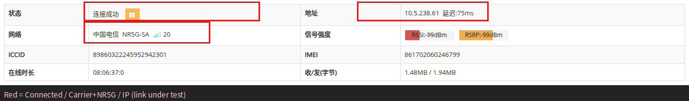
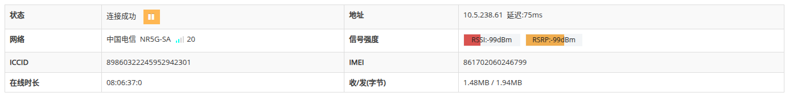
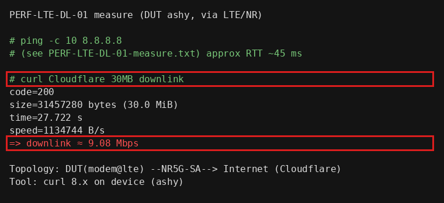

# 格式样例：PERF-LTE-DL-01（性能测试 · 实机实录）

> 本文仅供确认**性能测试用例**格式与内容深度。数据来自 DUT `192.168.32.100`（2026-09-28，固件 `v8.6.0920`，型号 D228 / 显示名 V528-212350）。  
> **正式全集已写入** [`performance.md`](./performance.md)（蜂窝 / 有线 / Wi-Fi / VPN / 切换 / 稳定性）。

---

## PERF-LTE-DL-01 蜂窝下行吞吐（经 LTE/NR）

### 功能说明

验证设备在 **LTE/NR 已连接** 条件下，经蜂窝上行访问互联网时的**下行吞吐能力**，并记录 RTT 旁证。  

本条在 DUT 本机（ashy）发起 HTTPS 大包下载，流量路径为：

`DUT 应用 → modem@lte / usb0 → 运营商 NR5G-SA → Internet`

用于评估模组+运营商链路在现网条件下的下行速率，作为后续 LAN 客户端经 NAT 转发类性能用例的基准对照。

### 拓扑

```text
[ Internet / Cloudflare ]
          ^
          |  NR5G-SA（中国电信）
          |
   +------+-------+
   |  D228 DUT    |  modem@lte status=up
   | 192.168.32.100 LAN
   +--------------+
          ^
          | Telnet / Web（管理，非测速流量）
          |
   [ 测试 PC 192.168.32.231 ]
```

### 侧栏路径（旁证）

`网络 → 4G/5G网络`  
页面 URL：`http://192.168.32.100/index.html#lte?object=ifname@lte`

### 需要的环境（勾选已有项）

- [x] Web / Telnet 可管理 DUT（`admin`/`admin`）
- [x] Nano SIM 已插入且未欠费
- [x] 蜂窝天线已接，`modem@lte.status` 中 `status=up`
- [x] DUT 可访问外网（本实录：`ping 8.8.8.8` 通）
- [x] DUT 具备 `curl`（本机 OpenWrt curl 8.x，支持 HTTPS）

### 指标与判定阈值

| 指标 | 方法 | 本实录取值 | 判定说明 |
|------|------|------------|----------|
| 下行吞吐 | DUT ashy：`curl` 拉取 Cloudflare `__down?bytes=31457280`（30 MiB） | **9.08 Mbps** | 链路保持 `up`，传输完成（HTTP 200，收满约定字节）；记录 Mbps。绝对门限由产品规格另定，本样例以「可测、可重复、有数字」为完整用例形态 |
| RTT | DUT ashy：`ping -c 10 8.8.8.8` | **avg 45.3 ms**（0% loss） | 旁证：有回包；loss 长期过高则先查环境 |
| 链路态 | HE：`modem@lte.status` / `ifname@lte.status` | `status=up`，`nettype=NR5G-SA`，IP `10.5.238.61` | 测前测后均为 `up` |

> 说明：公网 iperf 服务器本环境拒绝连接；故本条采用 **DUT 本机 HTTPS 大包下载** 计量下行。正式全集可并行给出「LAN 主机经 DUT 网关 + iperf3」写法，判定字段相同。

### 步骤

#### 1. 界面（旁证链路）

1. 浏览器打开 `http://192.168.32.100/login.html`，用户名 `admin`，密码 `admin`，登录。  
2. 打开 **网络 → 4G/5G网络**。  
3. 确认状态为「连接成功」，可见运营商/制式、IP、ICCID/IMEI。  
4. 测速过程中可保持本页打开，确认不掉线。

4G/5G 状态表实录（红框：连接成功 / 电信+NR5G / IP 区域）：



无红框原图：



#### 2. 命令行（测量 · 硬性）

Telnet 登录 DUT → 输入 `ashy` 进入 BusyBox：

```text
# 1) 确认蜂窝已连接
he 'modem@lte.status'
he 'ifname@lte.status'
# 期望：status=up；ifname@lte 有 ip

# 2) RTT 旁证
ping -c 10 -W 2 8.8.8.8

# 3) 下行吞吐（30 MiB，HTTPS）
curl -k --max-time 180 -o /tmp/perf.bin \
  -w 'code=%{http_code} size=%{size_download} time=%{time_total} speed=%{speed_download}\n' \
  'https://speed.cloudflare.com/__down?bytes=31457280'

# 4) 换算 Mbps（speed 为字节/秒）
# Mbps = speed * 8 / 1000000
rm -f /tmp/perf.bin
```

eline（未进 ashy）仅做链路旁证：

```text
modem@lte.status
ifname@lte.status
```

### 本实录测量结果（2026-09-28）

测量结果面板（红框为下行 Mbps）：



摘要：

| 项 | 值 |
|----|-----|
| HTTP | 200 |
| 下载字节 | 31457280（30 MiB） |
| 耗时 | 27.722 s |
| 平均速率 | 1134744 B/s → **9.08 Mbps** |
| ping 8.8.8.8 | 10/10 收到，avg **45.329 ms** |
| 制式 / 运营商 | NR5G-SA / China Telecom |
| 蜂窝 IP | 10.5.238.61 |

完整命令输出：[`PERF-LTE-DL-01-measure.txt`](./PERF-LTE-DL-01-measure.txt)

### HE 旁证（测后）

```text
$ modem@lte.status
{
    "netdev":"usb0",
    "imei":"861702060246799",
    "band":"n28",
    "nettype":"NR5G-SA",
    "signal":"2",
    "operator":"China Telecom",
    "iccid":"89860322245952942301",
    "status":"up",
    "name":"Fibocom-FM160"
}

$ ifname@lte.status
{
    "ifname":"ifname@lte",
    "netdev":"usb0",
    "ip":"10.5.238.61",
    "status":"up",
    "delay":"62",
    "mask":"255.255.255.0"
}
```

### 界面判断

| | 条件 |
|--|------|
| **成功** | 能打开 4G/5G 页；测速前后状态保持「连接成功」类文案；可见制式或 IP |
| **失败** | 测速中页面报错掉线，且 HE 亦长期非 `up`（排除环境） |
| **skip** | 无法打开 Web |

### 环境判断

| | 条件 |
|--|------|
| **成功** | SIM 识别、有信号、外网 ICMP/HTTPS 可达 |
| **失败** | 无卡、无信号、欠费、运营商阻断测速地址（先换源或修环境） |
| **skip** | 无 SIM / 无天线 / 不允许跑流量 → 本条记 **env**，不算产品失败 |

### 命令行（测量）判断

| | 条件 |
|--|------|
| **成功** | `modem@lte` / `ifname@lte` 为 `up`；下载 `code=200` 且 `size` 达到约定字节；能算出 Mbps 并记录；ping 有稳定回包 |
| **失败** | 链路 `up` 且外网可达，但约定下载反复失败/收不满字节（排除环境封锁后） |
| **skip** | 无法 Telnet / 设备无 `curl` 且无替代测速工具 |

### 本条总评（本实录）

| 判定类 | 结果 |
|--------|------|
| 界面 | **pass**（4G/5G 页连接成功，NR5G-SA，有 IP） |
| 环境 | **pass**（SIM/信号/外网可达） |
| 命令行（测量） | **pass**（30 MiB 下完，**9.08 Mbps**；RTT avg 45.3 ms） |
| **总评** | **pass**（现有条件下通过；Mbps 作实测记录，规格门限待产品给出后写入全集） |

### 恢复

本条仅只读测速与旁证，未改配置，**无需恢复**。删除临时文件：

```text
rm -f /tmp/perf.bin
```

---

样例已纳入正式文档首条：**PERF-LTE-DL-01**。其余 A～F 用例见 [`performance.md`](./performance.md)。
