# Center Cloud Platform — Administrator & User Guide

This guide explains how to use the **center** cloud platform: the **admin Web**
(platform operator) and the **cloud-user Web** (tenant who owns gateways), plus how
to bind an embedded gateway so it appears online and can be managed remotely.

Screenshots in this document were taken from a live demo host. Use your own
center host address and account credentials in production.

| Role | URL | Login |
|------|-----|-------|
| **Administrator** | `http://<center-host>:20001/login.html` | Admin username and password |
| **Cloud user** | `http://<center-host>:20000/` | Cloud username and password |

Related install / ports reference: [../install.md](../install.md).

---

## 1. Roles at a glance

```text
  Admin Web (:20001)          Cloud-user Web (:20000)         Embedded gateway
  ----------------            -----------------------         ----------------
  Create cloud users   --->   Log in as that user      <---   agent@heclient
  Open user portal port       See Gateway List                Server / Port /
  Configure Device Port       Remote Web / Terminal           Account / vcode
  Configure Proxy Port        Port maps, firmware, settings   Status: Connected
```

- The **admin** account is a platform operator (`land@auth`). It does **not** own
  gateways. It creates **cloud users**, enables the user portal, and configures
  center services (device connect port, proxy port, and so on).
- A **cloud user** (for example `ashyelf`) owns a set of gateways. Gateways register
  with that user’s **username** and **Device Verify Code (vcode)**. The user then
  monitors devices and uses remote management from the user portal.
- An **embedded gateway** runs `agent@heclient` (and usually port-proxy client
  features) so it can stay connected to center over the network.

---

## Part A — Administrator

### A.1 What the admin account is for

Use the admin Web to:

1. **Create and maintain cloud-user accounts** (username, password, device verify
   code, language, comment).
2. **Enable / configure the cloud-user Web** (default TCP **20000**).
3. **Configure Device Port** (`center@heport`, default TCP **20002**) so gateways
   can register for remote HE control.
4. **Configure Proxy Port** (`center@pport`, default TCP **20005** plus mapped
   public ports) so remote Web / SSH / custom TCP maps work.
5. Use host **System / Debug / Development** pages when operating the center
   machine itself (hostname, web server, logs, SDK notes). Those are host
   maintenance tools, not day-to-day tenant features.

Admin does **not** replace the cloud-user portal: after you create a user, that
user logs in on port **20000** to manage their own devices.

### A.2 Sign in to the admin Web

1. Open the admin login page: `http://<center-host>:20001/login.html`.
2. Enter the admin username and password.
3. Click **Sign In**.


After login you see the admin shell (sidebar menus **Cloud**, **System**,
**Debug**, **Development**).

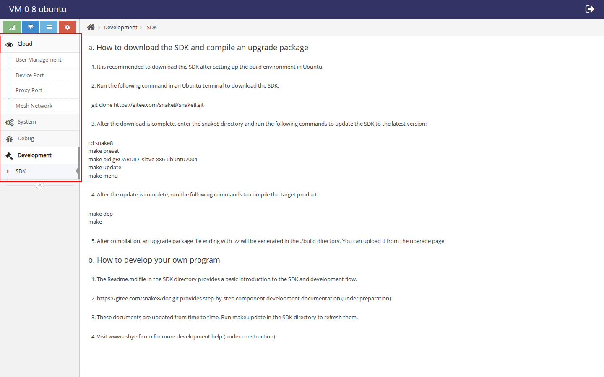

### A.3 Create a cloud-user account (step by step)

Cloud users are managed on the **User List** page (table caption **User Number**).
On some builds the Cloud menu entry is labeled **User List**; if that label is
missing, open the center user account page that shows the **User Number(N)** grid
(demo host serves `/skinos/center/user.html`).

1. Open the user account table. Existing users appear as rows (demo: `ashyelf`,
   `xyc`, `fm160`).

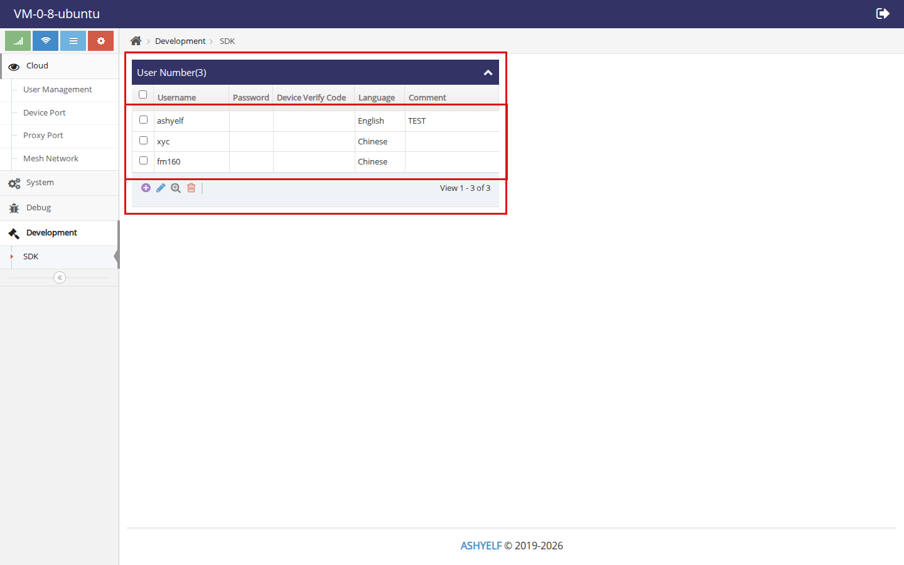

2. Click the purple **+** (Add) icon in the toolbar under the table.
3. In **Add Record**, fill in:

   | Field | Meaning |
   |-------|---------|
   | **Username** | Cloud login name (`A–Z`, `a–z`, `0–9`, `_`, `-`) |
   | **Password** | Password for the user Web on port **20000** |
   | **Device Verify Code** | Shared secret the gateway must set as `vcode` |
   | **Language** | UI language preference (`Auto` / `Chinese` / `English`) |
   | **Comment** | Optional note |

4. Click **Submit**. The new user appears in the list.
5. Use the pencil / search / trash icons to **edit**, **view**, or **delete**
   accounts. Changing password or vcode later must be reflected on each gateway’s
   Agent Control settings.

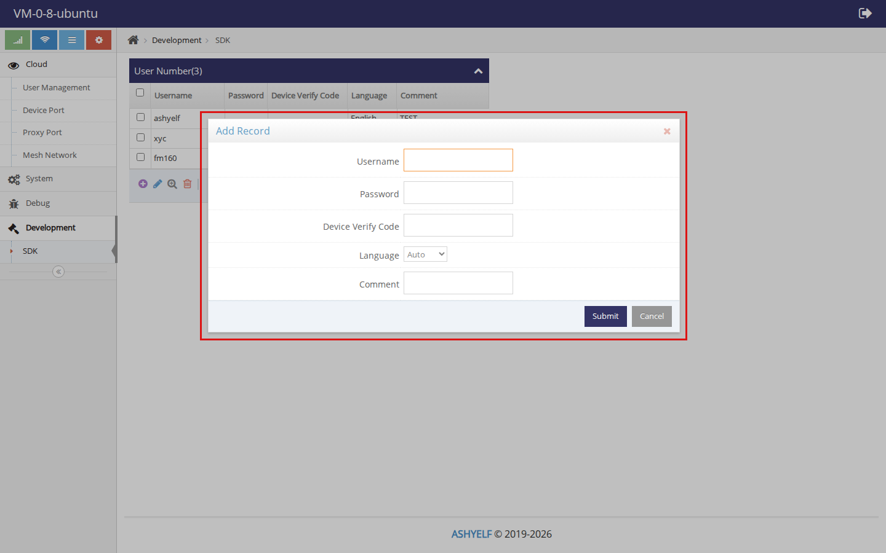

> Tip: give each tenant a unique **Device Verify Code**. Gateways that present the
> wrong username or vcode fail to go online (`usererror` / `vcodeerror` on the
> device). An empty vcode is allowed only if both sides leave it empty.

### A.4 Cloud-user Web server (port 20000)

**Cloud → User Management** (User WEB Server) controls the tenant portal listener.

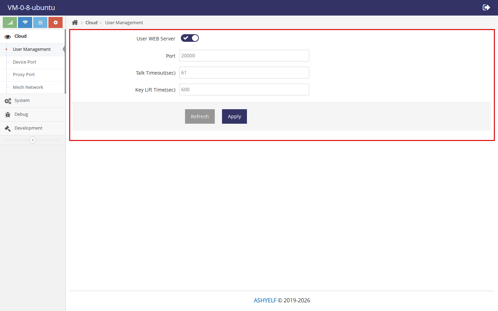

| Setting | Typical value | Notes |
|---------|---------------|-------|
| **User WEB Server** | ON | Must be enabled for tenants to log in |
| **Port** | `20000` | Cloud-user Web URL port |
| **Talk Timeout / Key Lift Time** | defaults | Session timing |

Click **Apply** after changes.

### A.5 Device Port (gateway registration)

**Cloud → Device Port** configures the HE server gateways connect to.

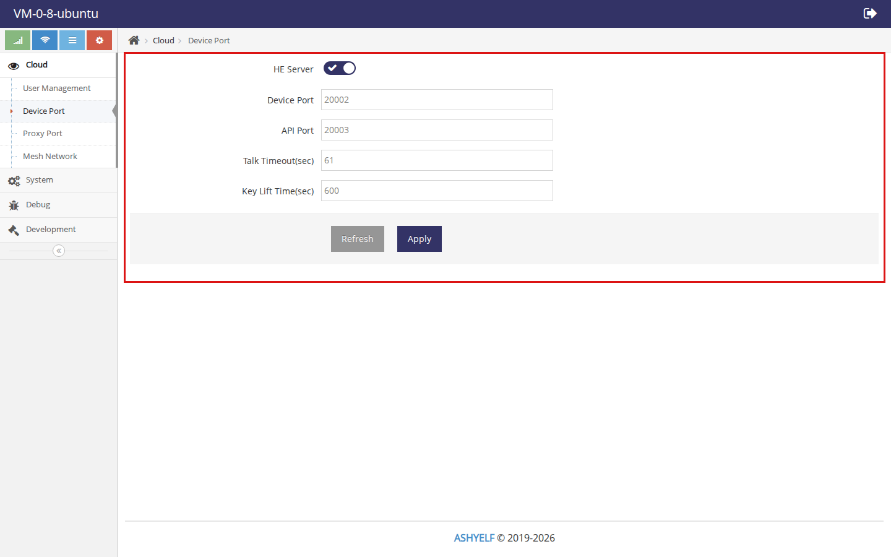

| Setting | Typical value | Notes |
|---------|---------------|-------|
| **HE Server** | ON | Accepts `agent@heclient` sessions |
| **Device Port** | `20002` | Value gateways put in **Port** |
| **API Port** | `20003` | Platform API control port |

Gateways must reach the center host on this **Device Port** (TCP).

### A.6 Proxy Port (remote access tunnels)

**Cloud → Proxy Port** enables port mapping used by remote Web / terminal / custom
maps.

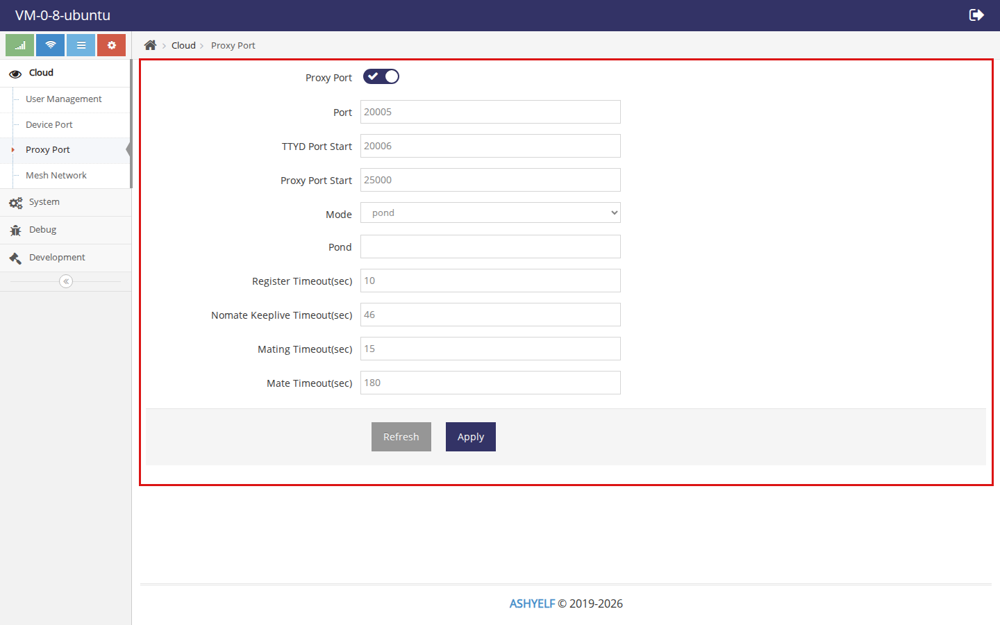

| Setting | Typical value | Notes |
|---------|---------------|-------|
| **Proxy Port** | ON | Control channel for maps |
| **Port** | `20005` | Gateway port-proxy client target |
| **TTYD Port Start** | `20006` | Start of dynamic terminal/Web map pool |
| **Proxy Port Start** | `25000` | Start of static map ports |

Firewall / security groups should allow the published map range (see
[install.md](../install.md) §9.3). Without Proxy Port, devices may still show
**online**, but remote Web/SSH maps will not work.

---

## Part B — Cloud user & device binding

### B.1 What the cloud-user account is for

A cloud user (demo: `ashyelf`):

- Logs into the **user portal** on port **20000**.
- Sees only **gateways bound to that account**.
- Opens **remote Web / terminal**, reboots or disconnects devices, manages **port
  maps**, uploads **firmware**, and edits **User Settings** (password, language,
  device verify code).

It is **not** the admin account and **not** the local `admin` login on the gateway
itself.

### B.2 Sign in to the user portal

1. Open the user portal: `http://<center-host>:20000/`.
2. Enter the cloud username and password created by the admin.
3. Click **Sign In**.

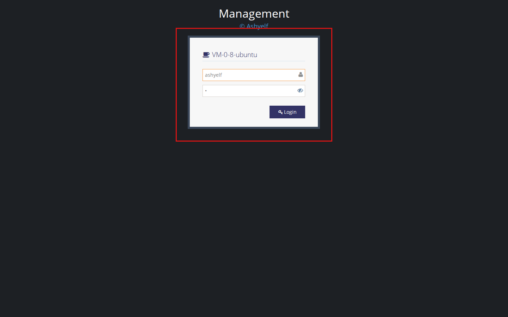

After login the sidebar typically includes:

- **Gateway List**
- **Port Proxy**
- **Firmware Upgrade**
- **User Settings**

(Mesh Network may appear; it is outside the scope of this guide.)

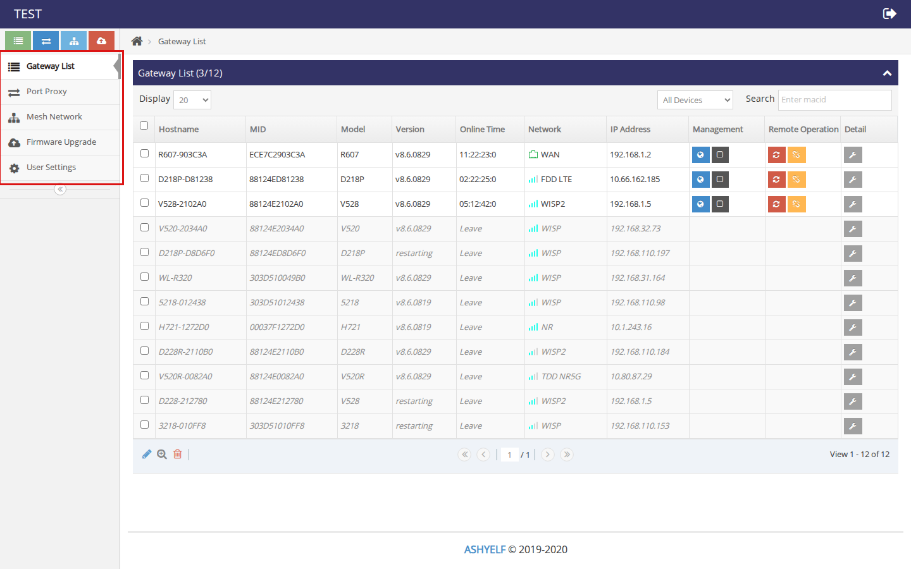

### B.3 Bind a gateway to the cloud account

Do this on the **embedded gateway’s local Web UI** (LAN address), not on the
center admin page.

Demo gateway used for screenshots: device `R607-903C3A` on the LAN. Sign in with
the gateway’s local Web credentials.

#### Step 1 — Log in to the gateway


#### Step 2 — Open System → Agent Control

1. Expand **System** in the sidebar.
2. Click **Agent Control**.
3. Open the **Agent Control** tab (next to **Local Control** / **MQTT Control**).
   That tab is the **HE Client** cloud connection form.

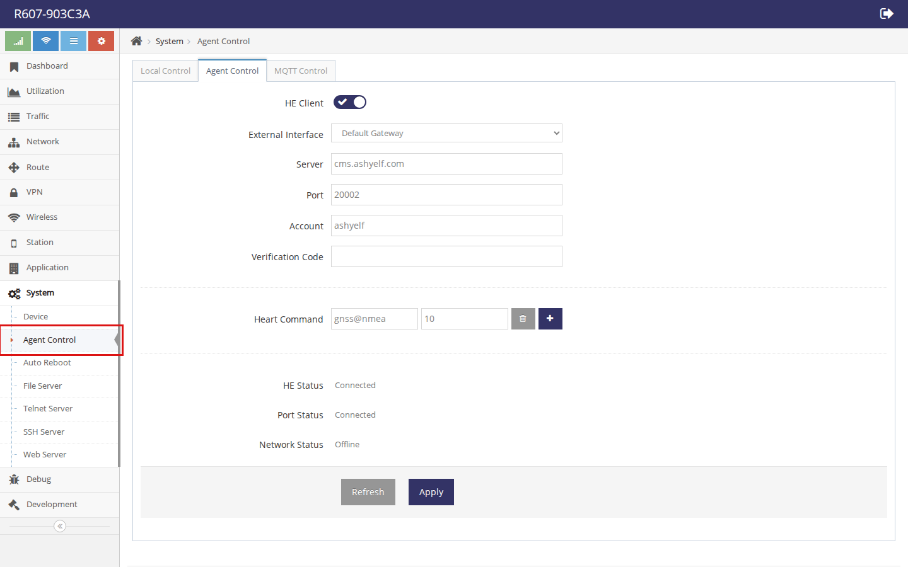

#### Step 3 — Fill HE Client settings and Apply

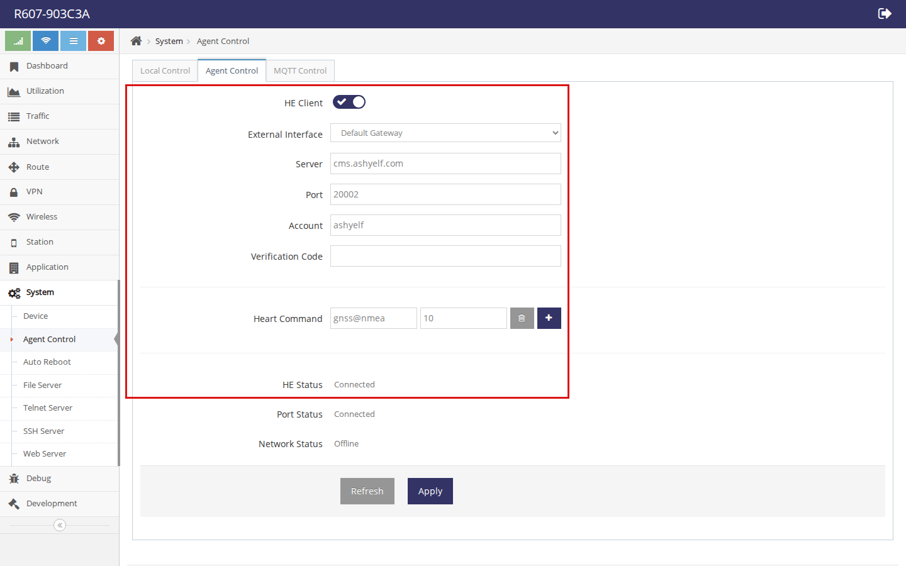

| Field | What to enter |
|-------|----------------|
| **HE Client** | ON |
| **External Interface** | Usually **Default Gateway** (outbound path to center) |
| **Server** | Center host IP or hostname reachable from the gateway |
| **Port** | Device Port from admin, normally **`20002`** |
| **Account** | Cloud username (same as the user portal login) |
| **Verification Code** | Same **Device Verify Code** as on center for that user |

Click **Apply**.

#### Step 4 — Check status on the gateway

| HE Status | Meaning |
|-----------|---------|
| **Connected** / `online` | Registered to center |
| Connecting / `uping` | Still bringing the session up |
| `usererror` / `vcodeerror` | Fix **Account** / **Verification Code**, Apply again |
| Down / `down` | Client disabled or not running |

**Port Status** should also become connected when port-proxy is enabled on both
sides.

#### Step 5 — Confirm on the user portal

Log in as the cloud user → **Gateway List**. The device hostname / MID should
appear; **Online Time** shows a duration when online, or **Leave** when offline.

---

## Part C — Managing devices (cloud user)

### C.1 Gateway List

**Gateway List** is the main fleet view. Caption **Gateway List (online/total)**
summarizes how many devices are online.

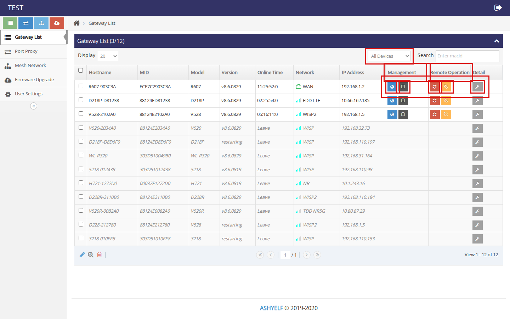

Useful columns:

| Column | Meaning |
|--------|---------|
| **Hostname / MID / Model / Version** | Device identity and firmware |
| **Online Time** | Connected duration, or **Leave** if offline |
| **Network / IP Address** | Current uplink type and address |
| **Management** | Remote Web (globe) and Terminal (square) |
| **Remote Operation** | Restart (refresh) and Disconnect (unlink) |
| **Detail** | Wrench — device detail / port maps page |

Filter with **All Devices / Online Devices / Offline Devices**, or search by
**macid**.

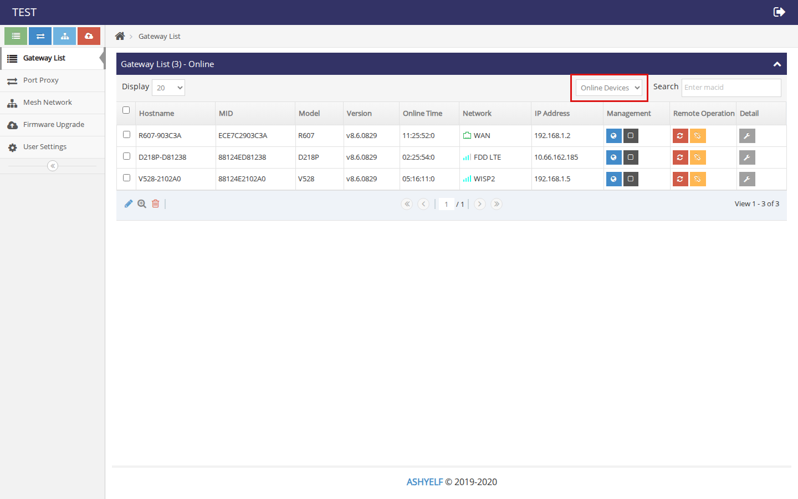

### C.2 Remote Web access

1. Ensure the gateway is **online** and Proxy Port is working.
2. In **Management**, click the blue **globe** button (remote Web / PAGE).
3. A new browser tab opens through a mapped public port on the center host
   (form: `http://<center-host>:<map-port>/login.html`).
4. Sign in with the **gateway’s local** Web credentials, not the cloud-user
   password.

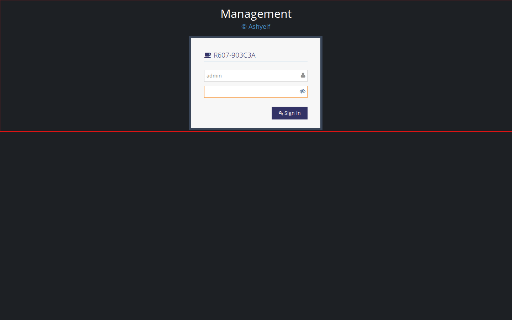

The dark **square** button in **Management** opens a **remote terminal** session
the same way (TTYD-style map).

### C.3 Remote restart / disconnect

In **Remote Operation**:

- Red **refresh** — request a **device restart**.
- Orange **unlink** — **disconnect** the cloud session.

Confirm prompts carefully; restart interrupts connectivity until the gateway
comes back online.

### C.4 Device detail and per-device port maps

Click the grey **wrench** (**Detail**) on a row to open that gateway’s detail
page: identity, online/run time, reboot/disconnect, and the **TCP Map Table** for
maps belonging to this device.

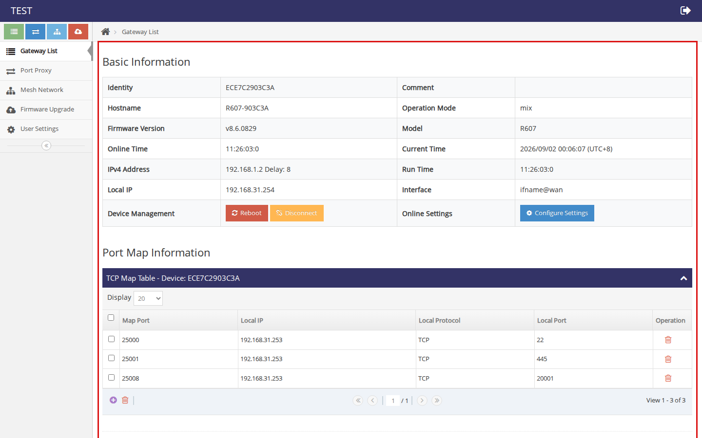

Use **+** under the map table to add a map (public map port → local IP/port on
the gateway LAN). Delete with the trash icon.

### C.5 Port Proxy (all maps)

**Port Proxy** lists TCP maps across your account. Each row shows **Map Port**
(public on center), **Gateway** MID, **Local IP**, and **Local Port**.

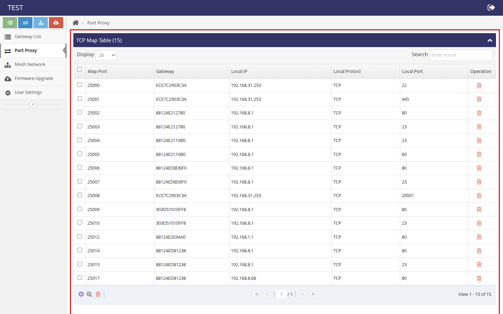

Example: map port `25000` → local `22` means
`tcp://<center-host>:25000` reaches SSH on that LAN host through the gateway
tunnel.

### C.6 Firmware Upgrade

**Firmware Upgrade** lets you keep `.zz` images on the cloud and select them for
devices.

1. Under **Firmware Upload**, click **Choose**, pick a `.zz` file, and upload.
2. The file appears in **Firmware List** (version / custom / scope / filename).
3. Use the list actions to select or remove images, then apply upgrades from the
   workflows your build provides for target gateways.

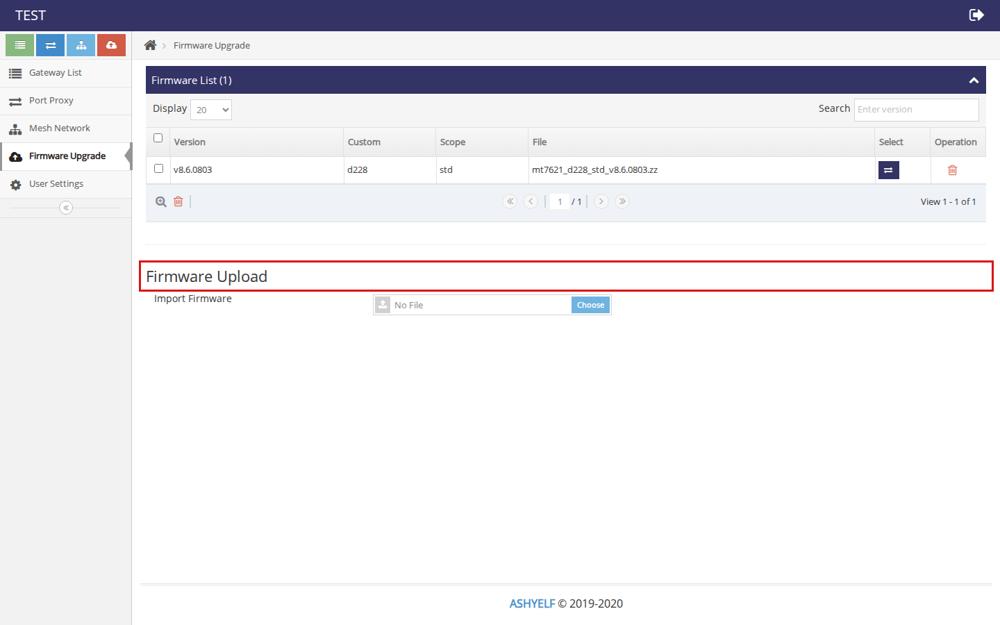

Match firmware **custom/scope** to the target product; wrong images can brick or
refuse install.

### C.7 User Settings

**User Settings** is where the cloud user maintains their own account:

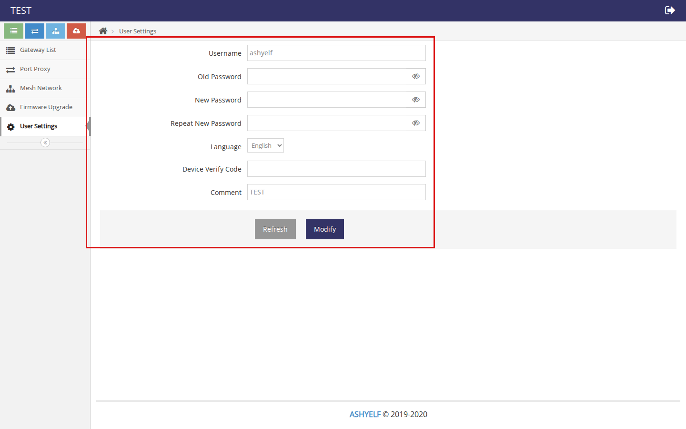

| Field | Purpose |
|-------|---------|
| **Username** | Read-only cloud account name |
| **Old / New / Repeat Password** | Change portal password |
| **Language** | Portal language |
| **Device Verify Code** | vcode gateways must use; change it only together with all devices |
| **Comment** | Optional note |

Click **Modify** to save.

---

## Quick checklist

**Admin**

1. Admin login → create cloud user (username + password + vcode).
2. Confirm User WEB Server **ON** on port **20000**.
3. Confirm Device Port **ON** on **20002**, Proxy Port **ON** as needed.
4. Open firewall paths from gateways to center (at least **20002/tcp**; for remote
   maps also **20005/tcp** and the map port range).

**User / device**

1. User portal login with the cloud account.
2. On each gateway: **System → Agent Control → Agent Control tab** → set Server /
   Port / Account / Verification Code → **Apply** → status **Connected**.
3. Gateway List shows the device online → use globe/terminal for remote access,
   Port Proxy / Detail for maps, Firmware Upgrade for images.

---

## Reference notes

| Item | Value |
|------|-------|
| Admin URL | `http://<center-host>:20001/login.html` |
| User URL | `http://<center-host>:20000/` |
| Example online gateway | `R607-903C3A` (MID `ECE7C2903C3A`) |
| HE Client Port | `20002` |
| HE Client Account | Cloud username bound to the device |

Keep admin, cloud-user, and gateway-local passwords distinct. Change defaults
before production use.
