# Center Cloud Platform — Administrator & User Guide

This guide explains how to use the **center** cloud platform: the **admin Web**
(platform operator) and the **cloud-user Web** (tenant who owns gateways), plus how
to bind an embedded gateway so it appears online and can be managed remotely.

Screenshots were taken on `8.134.87.67` (admin Web **20001**, cloud-user Web **20000**).
Use your own center host and accounts in production. The gateway LAN screenshots in
**B.3** are the device’s own Web UI, not a center page.

| Role | URL | Login |
|------|-----|-------|
| **Administrator** | `http://<center-host>:20001/login.html` | Admin username and password |
| **Cloud user** | `http://<center-host>:20000/login.html` | Cloud username and password |

Related install / ports reference: [../install.md](../install.md).

---

## 1. Roles at a glance

```text
  Admin Web (:20001)          Cloud-user Web (:20000)         Embedded gateway
  ----------------            -----------------------         ----------------
  Create cloud users   --->   Log in as that user      <---   agent@heclient
  Open the user portal        Gateway List                    Server / Port /
  Device / proxy / mesh /     Port maps, mesh, firmware,      Account / vcode
  remote-log services         settings, device logs           Status: Connected
```

- The **admin** account is a platform operator (`land@auth`). It does **not** own
  gateways. It creates **cloud users** and configures center services.
- A **cloud user** (for example `ashyelf`) owns a set of gateways. Gateways register
  with that user’s **username** and **Device Verify Code (vcode)**. The user then
  monitors devices from the portal on port **20000**.
- An **embedded gateway** runs `agent@heclient` (and usually the port-proxy and log
  clients) so it stays connected to center.

---

## Part A — Administrator

### A.1 What the admin account is for

Use the admin Web to:

1. **Create cloud-user accounts** and open each account page for language, comment,
   vcode, and the mesh / proxy / log gates.
2. **Enable the cloud-user Web** (default TCP **20000**).
3. **Configure Device Port** (`center@heport`, default TCP **20002**) so gateways
   can register.
4. **Configure Proxy Port** (`center@pport`, default TCP **20005** plus mapped
   public ports) so remote Web / SSH / custom maps work.
5. **Configure Mesh Network** (`center@nport`, UDP **20002** / **20003**) and
   **Remote Log** (`center@log`, TCP **20004**) when those features are used.
6. Use host **System / Debug / Development** pages when operating the center
   machine itself. Those are host tools, not day-to-day tenant features.

After you create a user, that user logs in on port **20000** to manage their own
devices.

### A.2 Sign in to the admin Web

1. Open `http://<center-host>:20001/login.html`.
2. Enter the admin username and password.
3. Click **Sign In**.

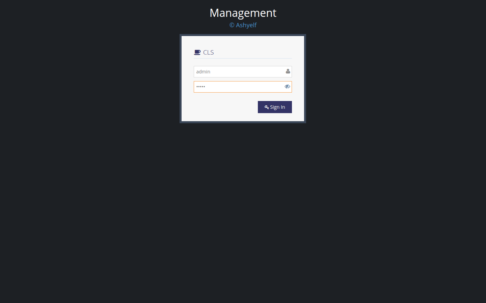

The shell has four sidebar groups: **Cloud**, **System**, **Debug**, **Development**.

**Cloud** contains:

- **User List**
- **Web Server**
- **Device Port**
- **Proxy Port**
- **Mesh Network**
- **Remote Log**

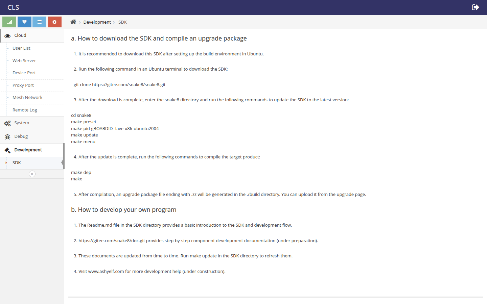

### A.3 Cloud users

**Cloud → User List** is the account table. The caption is **User Number(N)**.

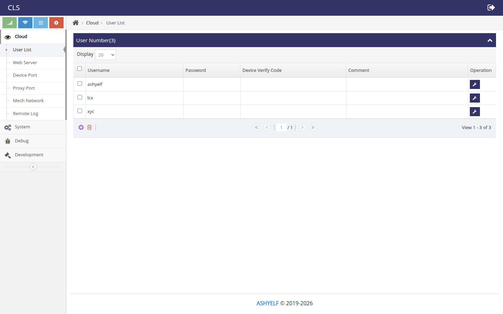

Columns: **Username**, **Password** (not shown after create), **Device Verify Code**,
**Comment**, **Operation**.

| Control | What it does |
|---------|----------------|
| Purple **+** | Add a user |
| Trash | Delete the checked users |
| Wrench on a row | Open that account’s settings page |
| Double-click a row | Same as the wrench |

There is no pencil edit on this grid. The password is set only in the add dialog.
Later password changes are done by the cloud user on **User Settings**, or by
`center@ctrl.user_reset` from HE.

#### Add a user

1. Click the purple **+**.
2. In **Add Record**, fill in:

   | Field | Meaning |
   |-------|---------|
   | **Username** | Cloud login name (`A–Z`, `a–z`, `0–9`, `_`, `-`). Required |
   | **Password** | Password for the portal on port **20000**. Required |
   | **Device Verify Code** | Optional. The gateway must send the same value as `vcode` |

3. Click **Submit**. Language and comment are not on this dialog.

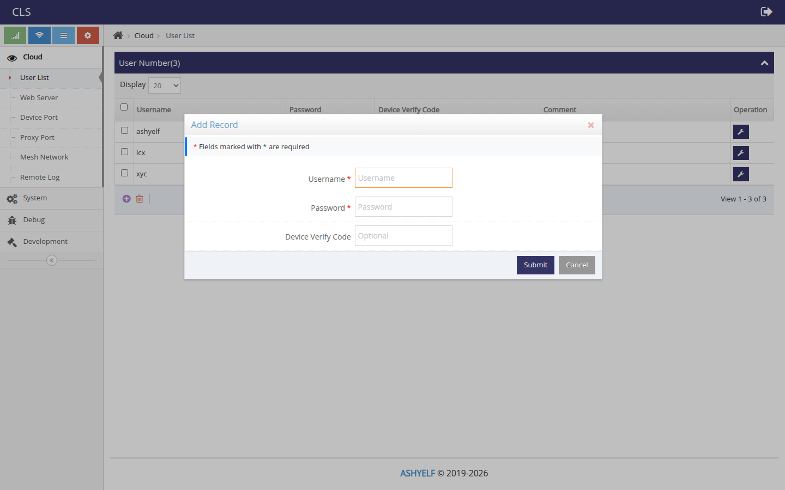

#### Account page

Open a row with the wrench or a double-click. **Username** is read-only. Click
**Apply** to save. **Refresh** reloads the stored values.

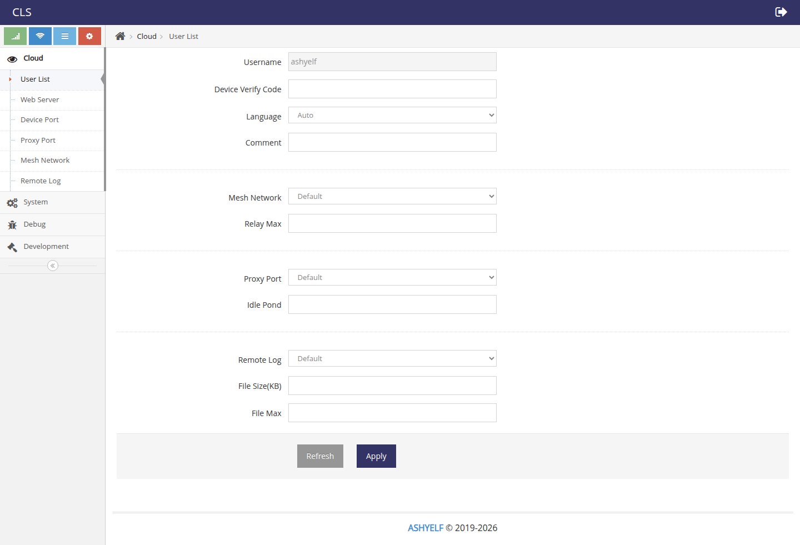

| Field | Meaning |
|-------|---------|
| **Device Verify Code** | vcode gateways must present. Empty is allowed when the gateway also leaves it empty |
| **Language** | `Auto` / `Chinese` / `English` |
| **Comment** | Note. Shown in the user list when set |
| **Mesh Network** | `Default` follows the device and `center@nport`. `Disable` forces `agent@gtog` off. `Enable` does not force the client on |
| **Relay Max** | How many live mesh relay UDP listens this user may hold. Empty = unlimited. `0` = none |
| **Proxy Port** | Same three choices for `agent@portc` |
| **Idle Pond** | Idle standby pool pushed to this user’s gateways. Empty follows **Proxy Port → Idle Pond**. A full integer `0..10000` replaces it |
| **Remote Log** | Same three choices for the `agent@logc` uplink |
| **File Size (KB)** | Per-user log file cap, `1..1048576`. Empty follows **Remote Log** |
| **File Max** | Per-user log file count, `1..100000`. Empty follows **Remote Log** |

`Disable` hides the matching extra fields (`Relay Max`, `Idle Pond`, or the two
file caps). Changing vcode must be copied onto each gateway’s Agent Control page.

> Tip: give each tenant a unique **Device Verify Code**. A wrong username or vcode
> shows `usererror` / `vcodeerror` on the gateway.

### A.4 Web Server (port 20000)

**Cloud → Web Server** is the tenant portal listener.

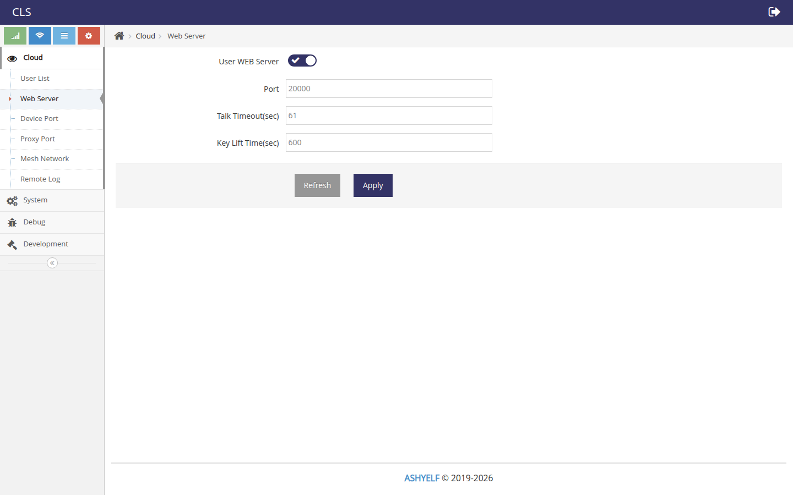

| Setting | Demo value | Notes |
|---------|------------|-------|
| **User WEB Server** | ON | Tenants cannot log in while this is off |
| **Port** | `20000` | Cloud-user Web URL port |
| **Talk Timeout (sec)** | `61` | HE talk wait |
| **Key Lift Time (sec)** | `600` | Login key lifetime |

Click **Apply** after changes.

### A.5 Device Port (gateway registration)

**Cloud → Device Port** is the HE server gateways connect to.

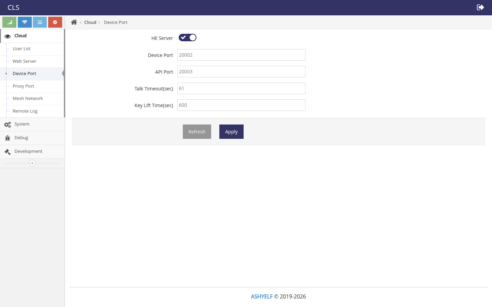

| Setting | Demo value | Notes |
|---------|------------|-------|
| **HE Server** | ON | Accepts `agent@heclient` |
| **Device Port** | `20002` | Value gateways put in **Port** |
| **API Port** | `20003` | Platform API control port |
| **Talk Timeout (sec)** | `61` | Idle disconnect and HE ACK wait |
| **Key Lift Time (sec)** | `600` | HTTP auth key lifetime |

Gateways must reach this **Device Port** (TCP).

### A.6 Proxy Port (remote access tunnels)

**Cloud → Proxy Port** is the control channel and the public map range used by
remote Web, terminal, and custom maps.

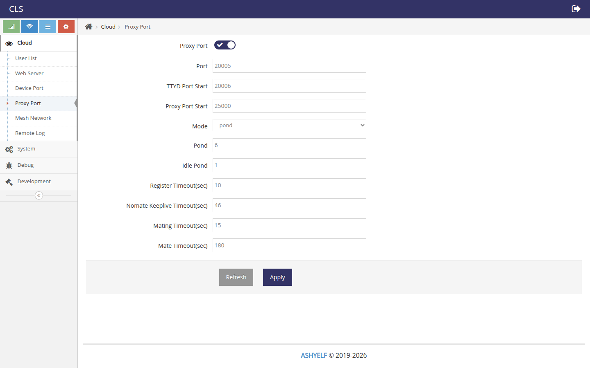

| Setting | Demo value | Notes |
|---------|------------|-------|
| **Proxy Port** | ON | Control channel for maps |
| **Port** | `20005` | Gateway port-proxy client target |
| **TTYD Port Start** | `20006` | Start of the dynamic terminal/Web pool |
| **Proxy Port Start** | `25000` | Start of static map ports |
| **Mode** | `pond` | `pond` or `mux` |
| **Pond** | `6` | Active standby pool |
| **Idle Pond** | `1` | Standby pool when a gateway has no maps. A user’s **Idle Pond** can replace this |
| **Register Timeout (sec)** | `10` | |
| **Nomate Keeplive Timeout (sec)** | `46` | |
| **Mating Timeout (sec)** | `15` | |
| **Mate Timeout (sec)** | `180` | |

Open the published map range on the firewall ([install.md](../install.md) §9.3).
Devices can still show **online** while Proxy Port is off, but remote Web and SSH
maps will not work.

### A.7 Remote Log

**Cloud → Remote Log** is `center@log`. Gateways upload with `agent@logc`.

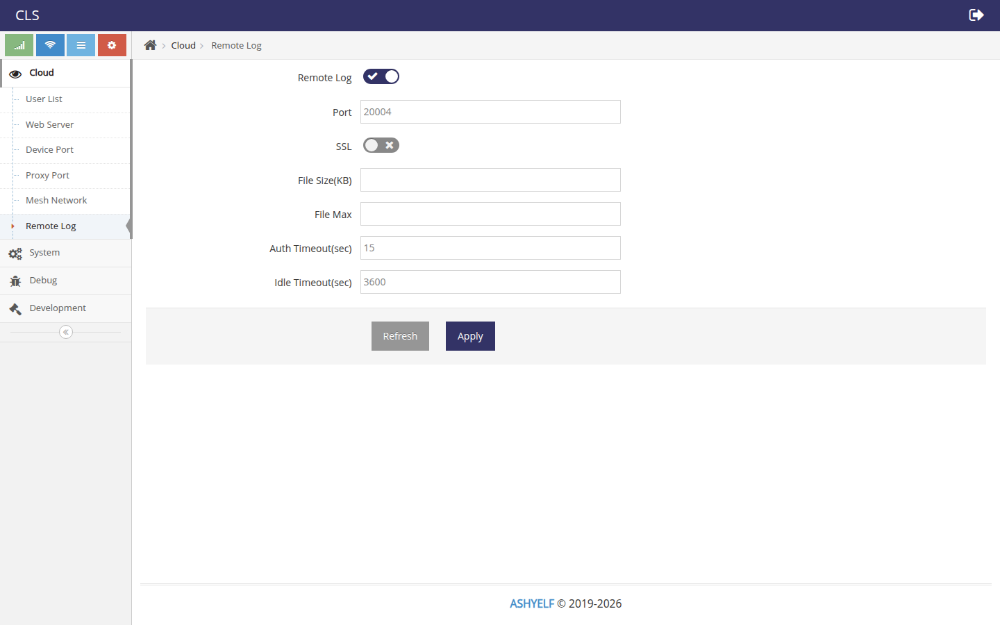

| Setting | Demo value | Notes |
|---------|------------|-------|
| **Remote Log** | ON | Accepts TCP uploads |
| **Port** | `20004` | Gateway log client target |
| **SSL** | OFF | Turn ON only when the gateway uplink uses SSL too |
| **File Size (KB)** | empty on this host | Usable `1..1048576`. Empty keeps **1024** |
| **File Max** | empty on this host | Usable `1..100000`. Empty keeps **10** |
| **Auth Timeout (sec)** | `15` | Wait for the identity line. Usable `1..86400` |
| **Idle Timeout (sec)** | `3600` | Close after this long with no data. Usable `1..86400` |

A value outside those ranges is ignored and the previous service value stays.
Per-user file caps are on the account page in **A.3**, not here.

### A.8 Mesh Network service

**Cloud → Mesh Network** is the UDP coordinator (`center@nport`). Tenants build
networks on the user portal; this page only sets the listener.

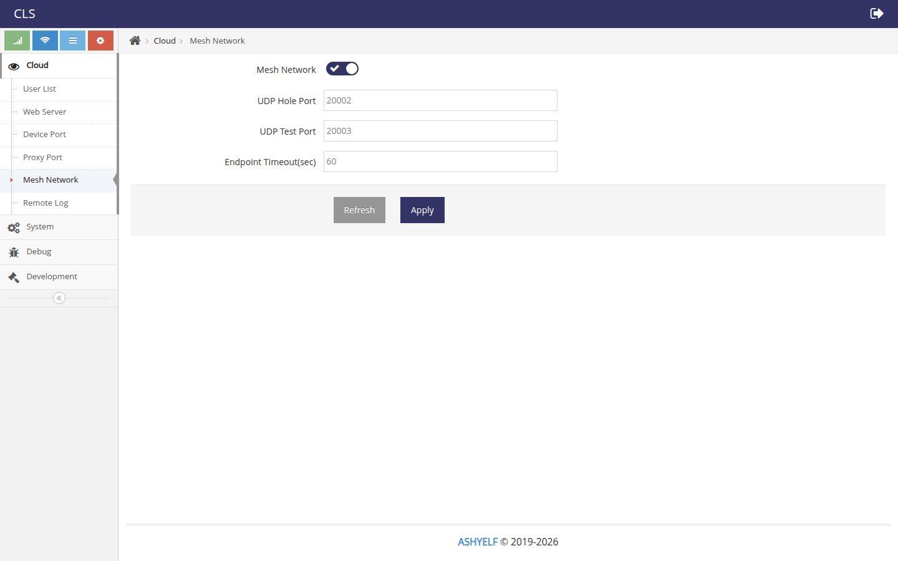

| Setting | Demo value | Notes |
|---------|------------|-------|
| **Mesh Network** | ON | |
| **UDP Hole Port** | `20002` | Gateway mesh register |
| **UDP Test Port** | `20003` | NAT probe |
| **Endpoint Timeout (sec)** | `60` | |

---

## Part B — Cloud user and device binding

### B.1 What the cloud-user account is for

A cloud user:

- Logs into the portal on port **20000**.
- Sees only gateways bound to that account.
- Opens remote Web / terminal, reboots or disconnects online devices, manages port
  maps and mesh networks, uploads firmware, downloads device logs, and edits
  **User Settings**.

It is not the admin account and not the local `admin` login on the gateway.

### B.2 Sign in to the user portal

1. Open `http://<center-host>:20000/login.html`.
2. Enter the cloud username and password.
3. Click **Sign In**.


The sidebar is:

- **Gateway List**
- **Port Proxy**
- **Mesh Network**
- **Firmware Upgrade**
- **User Settings**

Home is **Gateway List**. The caption is **Gateway List (online/total)**.

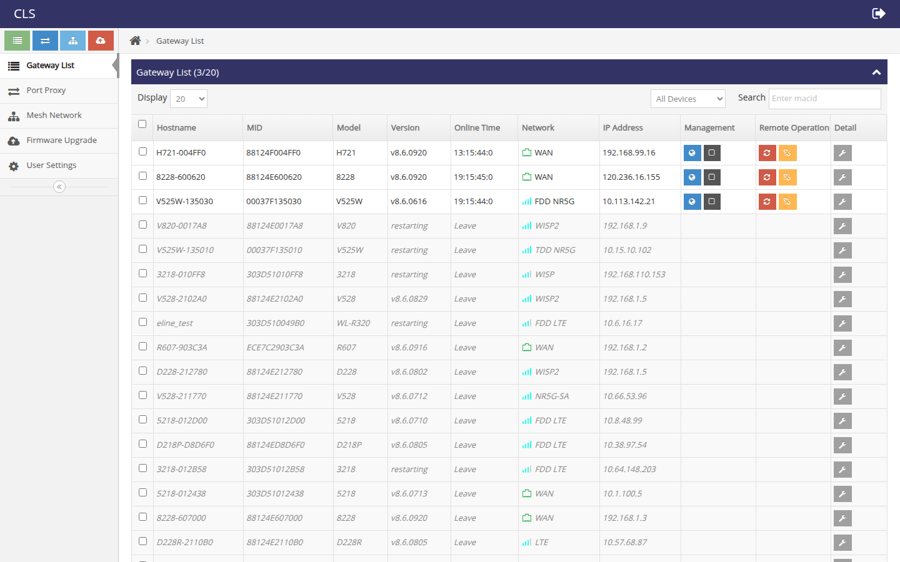

### B.3 Bind a gateway to the cloud account

Do this on the **embedded gateway’s local Web UI**, not on the center admin page.
The three pictures below are that LAN UI.

#### Step 1 — Log in to the gateway

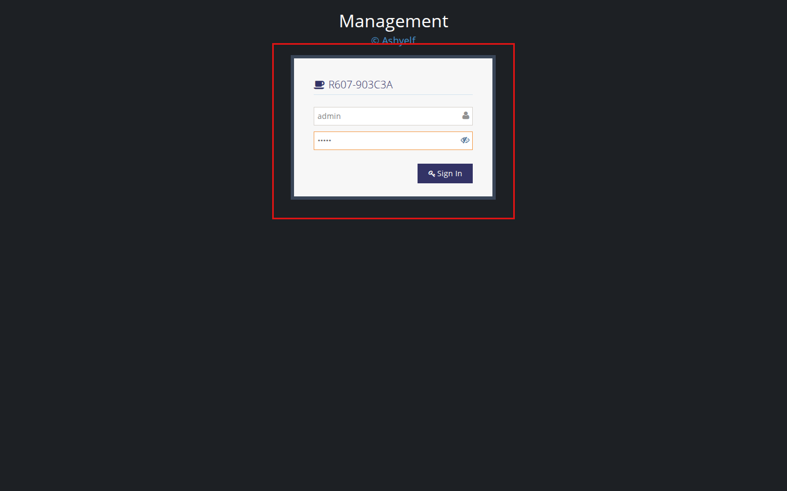

#### Step 2 — Open System → Agent Control

1. Expand **System**.
2. Click **Agent Control**.
3. Open the **Agent Control** tab (next to **Local Control** / **MQTT Control**).
   That tab is the HE Client form.

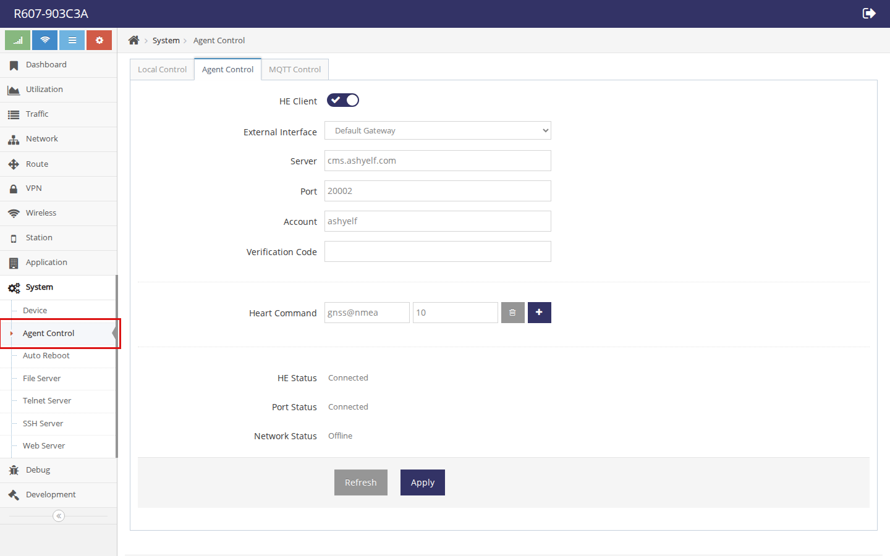

#### Step 3 — Fill HE Client settings and Apply

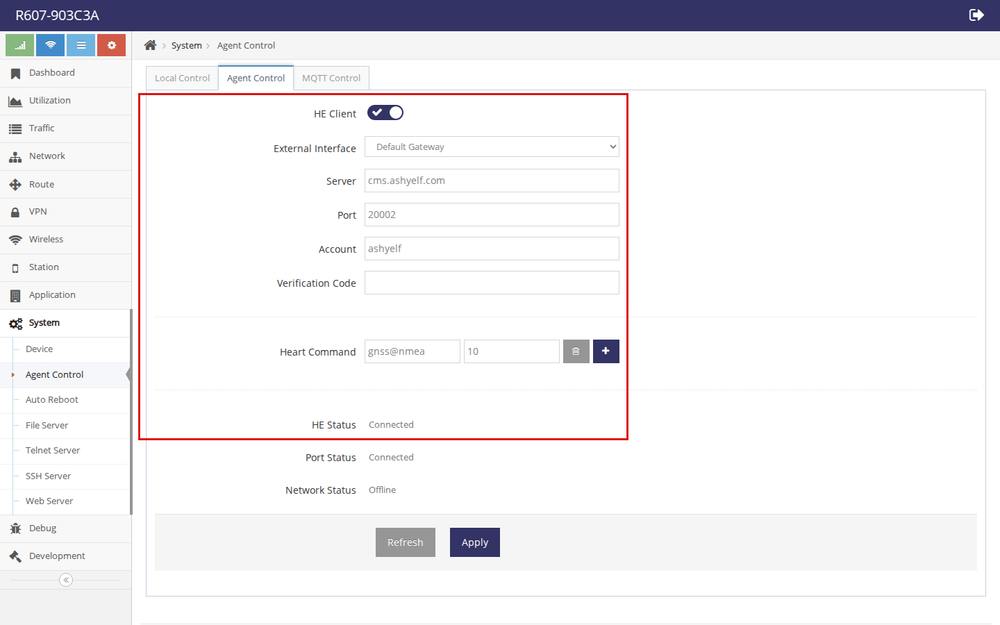

| Field | What to enter |
|-------|----------------|
| **HE Client** | ON |
| **External Interface** | Usually **Default Gateway** |
| **Server** | Center host IP or hostname the gateway can route to |
| **Port** | Device Port from admin, normally **`20002`** |
| **Account** | Cloud username |
| **Verification Code** | Same **Device Verify Code** as on that user’s account page |

Click **Apply**.

#### Step 4 — Check status on the gateway

| HE Status | Meaning |
|-----------|---------|
| **Connected** / `online` | Registered to center |
| Connecting / `uping` | Session still coming up |
| `usererror` / `vcodeerror` | Fix **Account** / **Verification Code**, then Apply |
| Down / `down` | Client disabled or not running |

**Port Status** becomes connected when port-proxy is enabled on both sides.

#### Step 5 — Confirm on the user portal

**Gateway List** shows the hostname and MID. **Online Time** is a duration while
the session is up, or **Leave** when it is not. **Management** and **Remote
Operation** buttons appear only on online rows.

---

## Part C — Managing devices (cloud user)

### C.1 Gateway List

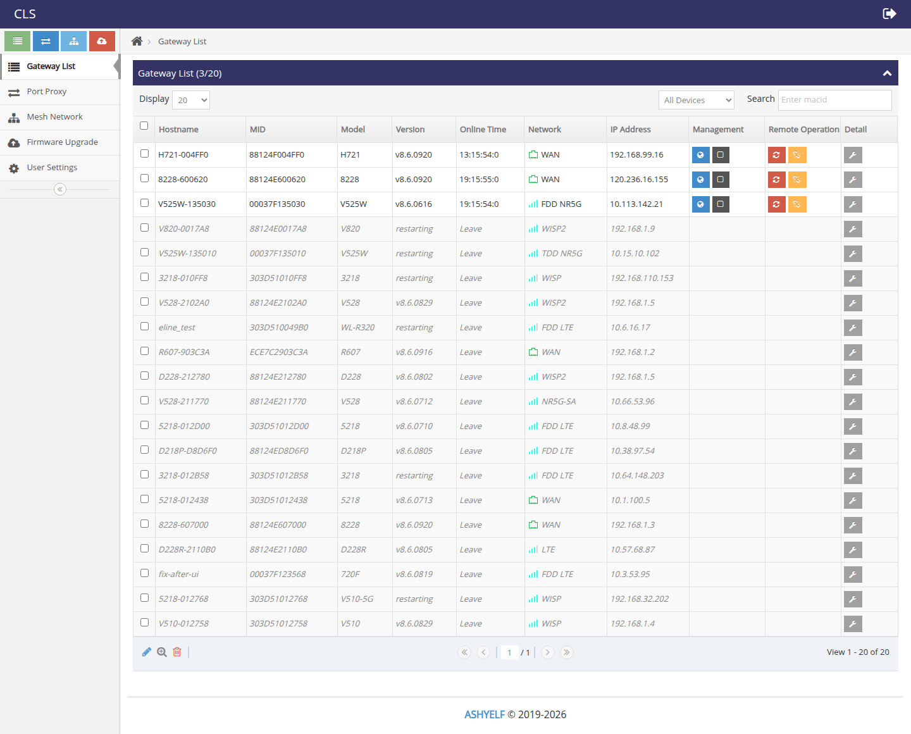

| Column | Meaning |
|--------|---------|
| **Hostname / MID / Model / Version** | Device identity and firmware. Version may show `restarting` |
| **Online Time** | Connected duration, or **Leave** |
| **Network / IP Address** | Current uplink and address |
| **Management** | Online only. Blue globe = remote Web. Dark square = remote terminal |
| **Remote Operation** | Online only. Red refresh = restart. Orange unlink = disconnect |
| **Detail** | Grey wrench. Device page, including offline rows |

The **All Devices / Online Devices / Offline Devices** list and the **Search** box
(placeholder **Enter macid**) filter the table.

### C.2 Remote Web and terminal

1. The gateway must be **online**, and Proxy Port must be on.
2. In **Management**, click the blue globe.
3. A new tab opens on a mapped public port
   (`http://<center-host>:<map-port>/login.html`).
4. Sign in with the **gateway’s local** Web credentials, not the cloud-user password.

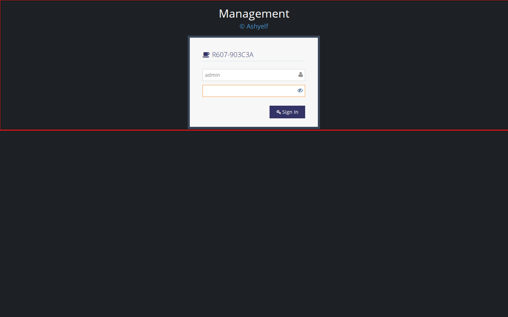

The dark square opens a remote terminal the same way.

### C.3 Restart and disconnect

On an online row, **Remote Operation**:

- Red refresh asks for a **restart**.
- Orange unlink **disconnects** the cloud session.

Confirm the prompt. A restart drops the session until the gateway comes back.
Offline rows do not show these buttons.

### C.4 Device detail

The wrench opens that gateway’s page: identity, comment, online time, run time,
**Reboot** / **Disconnect**, **TCP Map Table**, **UDP Map Table**, and **Device Log**.

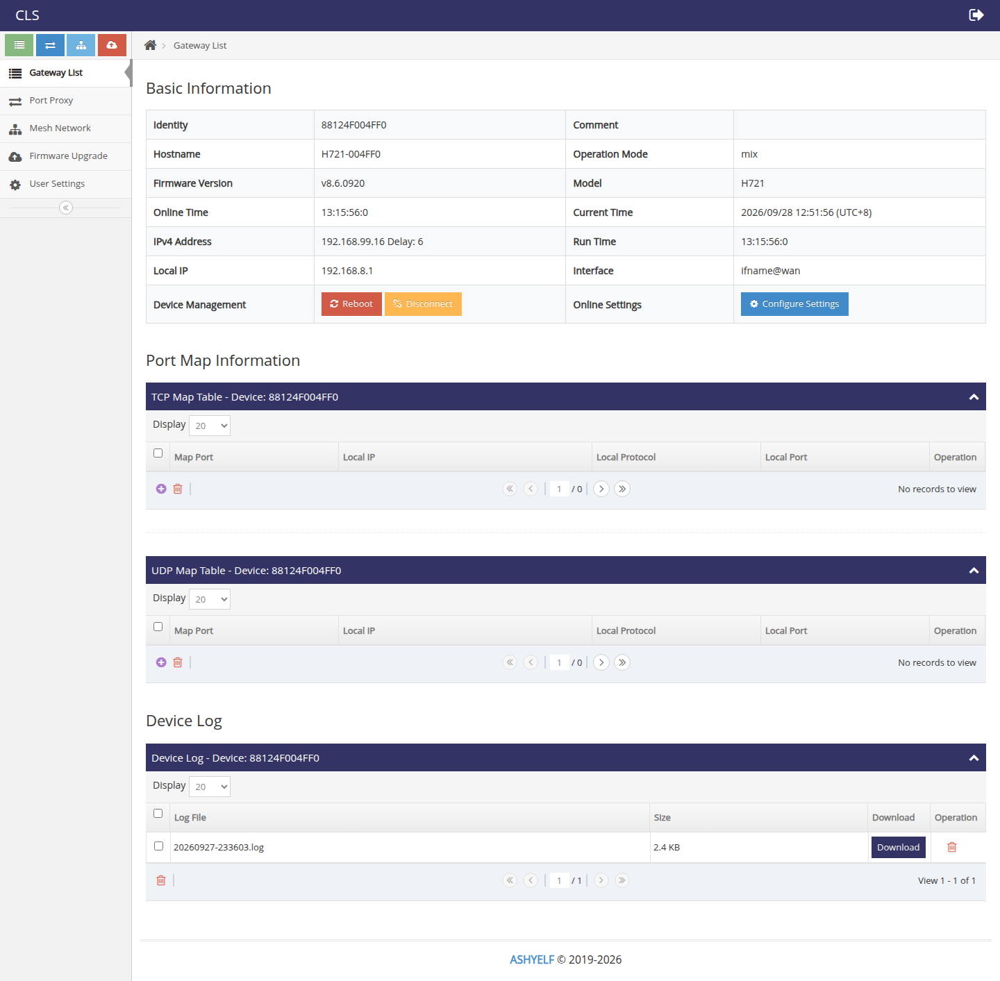

Use **+** under a map table to add a map (public port → local IP/port on the
gateway LAN). Delete with the trash icon. **Device Log** lists
`YYYYMMDD-HHMMSS.log` files with size and **Download**.

**Reboot** and **Disconnect** on this page act on this gateway. They need the
device online to succeed.

### C.5 Port Proxy

**Port Proxy** has two tables: **TCP Map Table** and **UDP Map Table**. Columns are
**Map Port**, **Gateway** (MID), **Local IP**, **Local Protocol**, and **Local Port**.

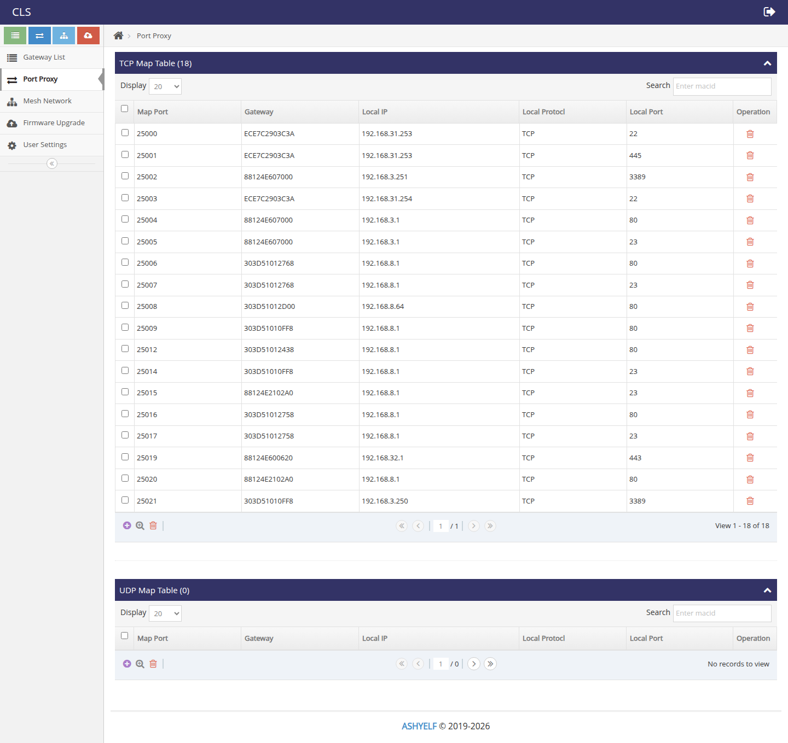

Example: map port `25000`, local port `22`, protocol TCP means
`tcp://<center-host>:25000` reaches SSH on that LAN host through the gateway.

### C.6 Mesh Network

**Mesh Network** lists this account’s networks.

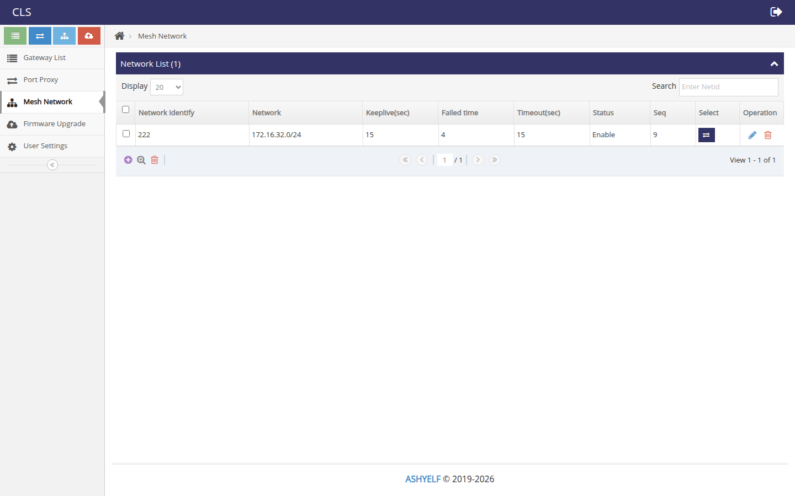

| Column | Meaning |
|--------|---------|
| **Network Identify** | Netid |
| **Network** | VPN CIDR |
| **Keeplive (sec) / Failed time / Timeout (sec)** | Device keepalive |
| **Status** | `Enable` or disable |
| **Seq** | Topology version |
| **Select** | Open the member list |
| **Operation** | Pencil edits the row. Trash deletes it |

Purple **+** adds a network. Search placeholder is **Enter Netid**.

### C.7 Firmware Upgrade

**Firmware Upgrade** keeps `.zz` images for this account.

1. Under **Firmware Upload**, choose a `.zz` file and import it.
2. **Firmware List** shows **Version**, **Custom**, **Scope**, and **File**.
3. Use the row actions to select or remove an image, then upgrade a target gateway
   from the flow that row provides.

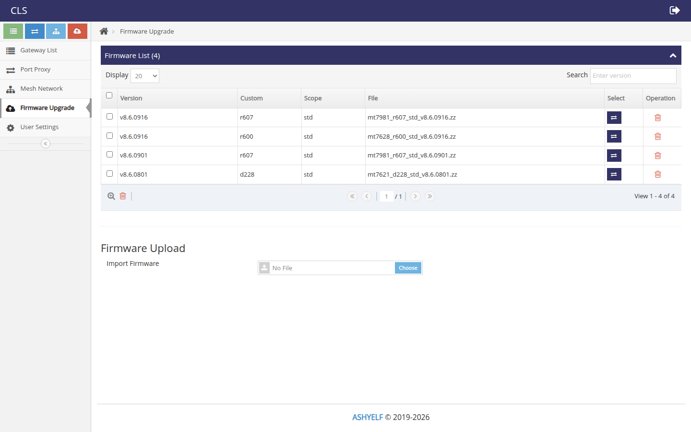

Match **custom/scope** to the target product. A wrong image can be refused or can
brick the device.

### C.8 User Settings

**User Settings** is the cloud user’s own account. **Username** is read-only.

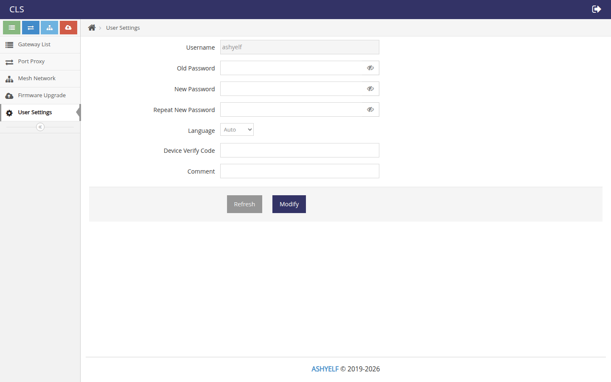

| Field | Purpose |
|-------|---------|
| **Old / New / Repeat New Password** | Change the portal password. The eye shows the text |
| **Language** | `Auto` / `Chinese` / `English` |
| **Device Verify Code** | vcode gateways must use. Change it together with every device |
| **Comment** | Optional note |

Click **Modify** to save. **Refresh** reloads the stored values. This page cannot
change **Relay Max**, **Idle Pond**, or the log file caps. Those stay on the admin
account page.

---

## Quick checklist

**Admin**

1. Admin login → **User List** → add username, password, and vcode → open the wrench
   page for language, comment, and feature gates.
2. **Web Server** ON, port **20000**.
3. **Device Port** ON, **20002**. **Proxy Port** ON when maps are needed.
   **Remote Log** ON, **20004**, when gateways should upload logs.
4. Open firewall paths from gateways to center (at least **20002/tcp**; for logs
   also **20004/tcp**; for maps also **20005/tcp** and the map port range).

**User / device**

1. User portal login with the cloud account.
2. On each gateway: **System → Agent Control → Agent Control** → Server, Port,
   Account, Verification Code → **Apply** → status **Connected**.
3. **Gateway List** shows a duration in **Online Time**. Use the globe and terminal
   on that row, the wrench for maps and logs, **Port Proxy** for the account-wide
   tables, and **Firmware Upgrade** for images.

---

## Reference notes

| Item | Value |
|------|-------|
| Admin URL | `http://<center-host>:20001/login.html` |
| User URL | `http://<center-host>:20000/login.html` |
| HE Client Port | `20002` |
| Log uplink port | `20004` |
| Proxy control port | `20005` |
| HE Client Account | Cloud username bound to the device |

Keep admin, cloud-user, and gateway-local passwords distinct. Change defaults
before production use.
