# Device Management from the Web UI (WUI)

This book is the operator guide for managing a Skinos / landos gateway from the **web interface**. Open the site in a browser, sign in, then use the left sidebar. Each page loads and saves the same settings that eline HE commands use (`device_management_tui.md`).

A given product only shows the menus whose interfaces and packages are present. This book follows the **live menu** of a typical router (Dashboard → Development). If a component is missing on your unit, that sidebar entry is simply not there.

Screenshots in this book are named `device_management_wui_*.png` and live under [`device_management_wui/`](./device_management_wui/).


## Preface — Open the site and sign in

### Address

In the browser address bar, open:

```
http://<device-ip>/
```

or, if the web port was changed or mapped:

```
http://<device-ip>:<port>/
```

Factory HTTP port is **80**. HTTPS, when enabled, is usually **443**. The unit used for these pictures was reached at `http://114.132.219.158:25009/`.

The first page is **login.html**. The heading **Management** and **© Ashyelf** sit above a white sign-in box. The box title is the device name (here `3218-010FF8`).


### Default account

| Field | Default | Notes |
|-------|---------|--------|
| Username | `admin` | Pre-filled on the login page |
| Password | `admin` | Empty until you type it. Click the eye icon to show or hide the characters |

Type the password, then click **Sign In** (or press Enter). A wrong password shows **Incorrect password** and returns you to the login page.

After a successful sign-in the browser opens `index.html` and the sidebar appears. The page language follows **System → Device →** the device language (`en` / `cn`). This book uses the English UI.

Change the password after the first login under **System → Device → Password Manage**.

### How the pages work

| Control | Meaning |
|---------|---------|
| Left sidebar | Main menu. Click a group (Network, Route, …) to expand it |
| Breadcrumb | `Home > …` shows the current page |
| Switch | Grey = off, blue = on |
| **Refresh** | Reload the page from the device (does not save) |
| **Apply** | Write the form. If nothing changed, the UI says **Settings unchanged** |
| Grid **+** | Add a row |
| Pencil / trash | Edit / delete a row |
| **Display** | Rows per page on a table (`10` … `200`) |
| Yellow pause / orange play | Disconnect / Connect on an uplink or VPN |
| Blue wrench | Jump to that interface’s setup page |
| Top-right door icon | Log out |

Do not click **Apply** until the values on the form are what you want. A save restarts the related service.


## 1 Dashboard

Sidebar: **Dashboard**. This is the home page after login.

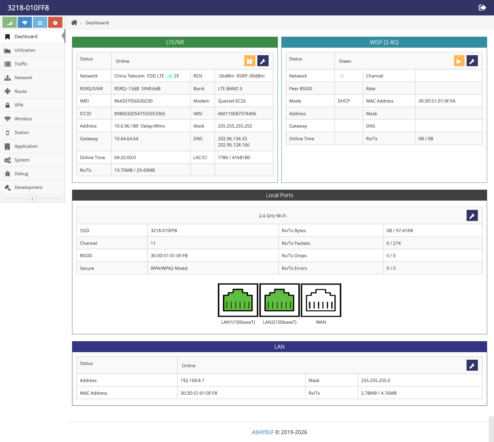

The page polls live status. Cards appear only for interfaces that exist on this unit.

### LTE/NR card

Shows the cellular uplink (green header). Typical fields:

| Field | Meaning |
|-------|---------|
| Status | `Online`, `Down`, or a setup/register state. Yellow **pause** disconnects; orange **play** connects |
| Network | Operator, radio type (FDD LTE / NR), signal bars / CSQ |
| RSSI / RSRP / RSRQ / SINR | Radio quality |
| Band | LTE or NR band |
| IMEI / Modem / ICCID / IMSI | Module and SIM identity |
| Address / Mask / Gateway / DNS | Current IPv4 |
| Delay | ICMP/DNS check latency when the uplink is up |
| Online Time | `hour:minute:second:day` |
| LAC/CI | Cell identity |
| Rx/Tx | Traffic counters |

The blue wrench opens **Network → LTE/NR**.

### WISP (2.4G) card

Wireless WAN as a station. **Status** `Down` means it is not associated. **Mode** is DHCP / PPPoE / Static. Play connects; wrench opens **Network → WISP (2.4G)**.

### Local Ports

| Block | Meaning |
|-------|---------|
| 2.4 GHz Wi-Fi table | SSID, channel, BSSID, security, Rx/Tx bytes and errors. Wrench opens **Wireless → 2.4G SSID** |
| Ethernet icons | Green = link up (for example LAN1/LAN2 100baseT). White/outline = no cable (for example WAN) |

### LAN card

LAN address, mask, MAC, Rx/Tx. Wrench opens **Network → LAN**.

Use Dashboard to see whether the unit is online. Use the play/pause buttons only when you intend to bring an uplink up or down.


## 2 Utilization

Sidebar: **Utilization**.

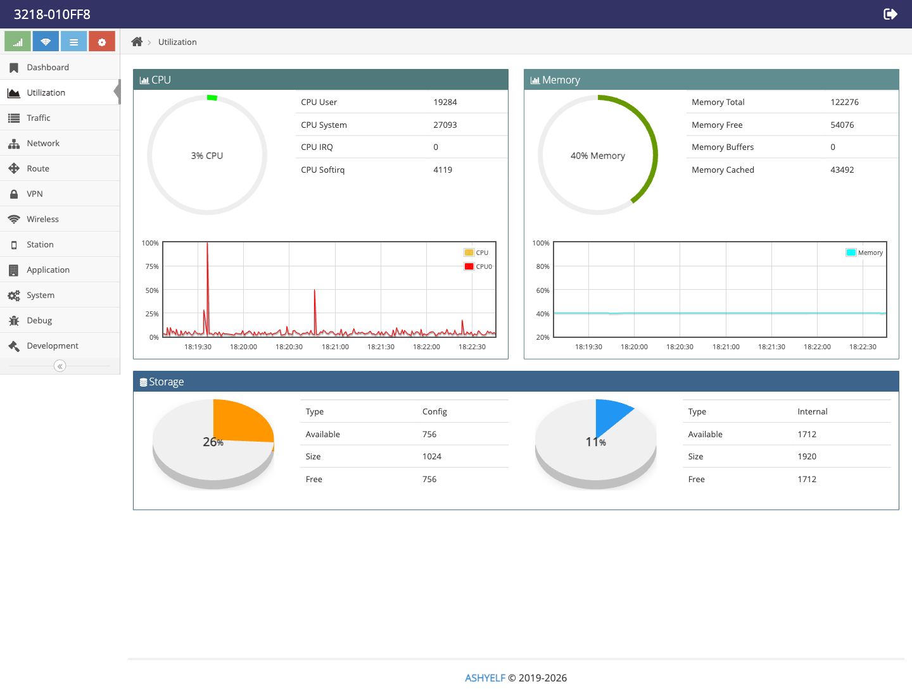

Three charts refresh by themselves. There is no Apply button.

| Section | What you see |
|---------|----------------|
| CPU | Pie of current use; **User / System / IRQ / Softirq**; a line history |
| Memory | Pie of used vs total; **Total / Free / Buffer / Cached** |
| Storage | One pie per volume (config, overlay, …) with **Type**, **Available**, **Size**, **Free** |

High CPU or a full config volume explains slow UI or failed saves. Free space before a firmware upgrade (**System → Device → Software Manage**).


## 3 Traffic

Sidebar: **Traffic**.

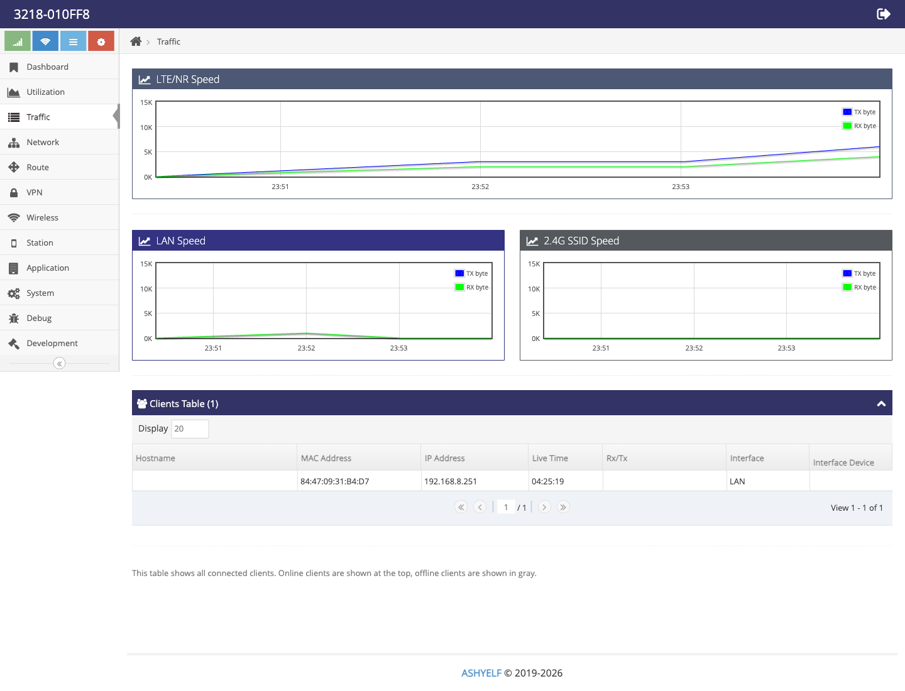

The upper area draws rx/tx rate charts for each uplink, LAN, and Wi-Fi SSID that is up.

The **Clients** table lists stations the gateway has seen:

| Column | Meaning |
|--------|---------|
| Hostname | DHCP / mDNS name when known |
| MAC Address | Client hardware address |
| IP Address | Current IPv4 |
| Live Time | How long this entry has been up |
| Rx / Tx | Bytes |
| Interface | Logical object (`ifname@lan`, `wifi@nssid`, …) |
| Interface Device | Kernel netdev |

**Display** changes how many rows are shown. The same client list is also under **Station → Station List**.


## 4 Network

Sidebar group **Network**. On this unit: Connection, LTE/NR, WISP (2.4G), LAN. Other products may also show WAN, extra LTE/NR slots, or WISP (5.8G).


### 4.1 Connection

Sidebar: **Network → Connection**. Multi-WAN policy (this unit’s working mode is MWM).

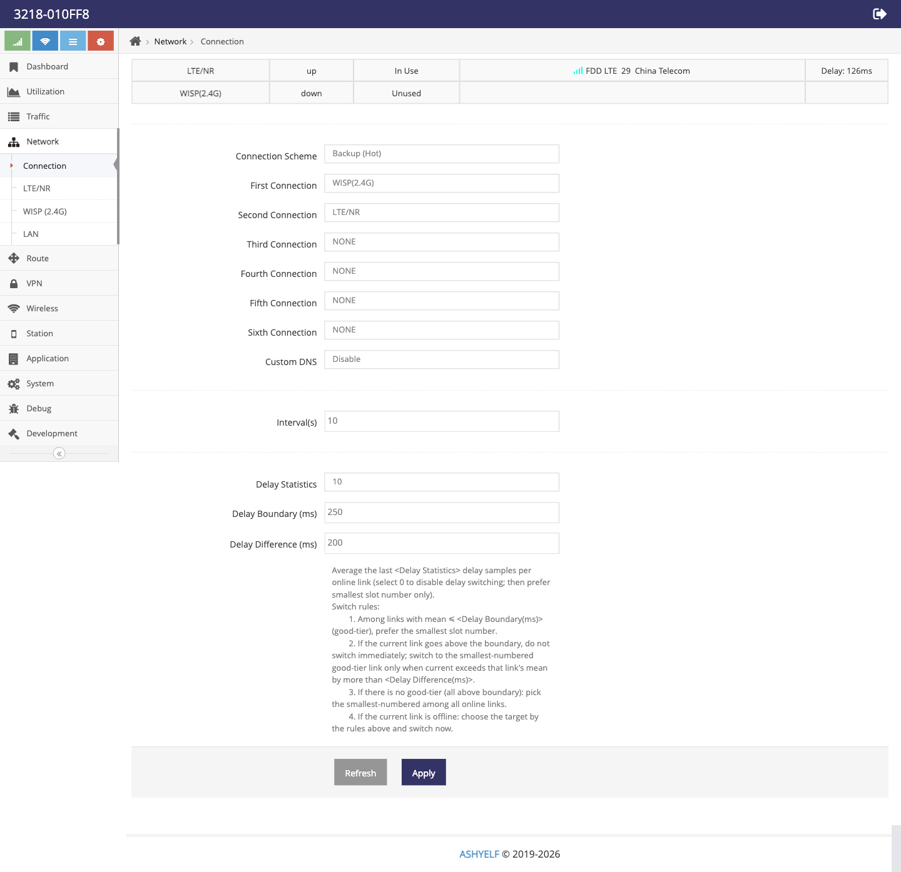

The status table lists each uplink: interface, link state, **In Use** / unused, radio or peer info, and delay.

Then set the policy and click **Apply**.

| Field | Meaning | How to set |
|-------|---------|------------|
| Connection Scheme | How several uplinks work together | **Use First Online** — take the first slot that comes up. **Backup(Cold)** — start the next only after the current one fails. **Backup(Hot)** / **hot2**–**hot5** — keep N backups dialed and fail over quickly. **Backup(Lazy)** / **lazy2**–**lazy5** — slower fail-over. **Balancing** / **dbdc2**–**dbdc5** — ECMP across N links |
| First … Sixth Connection | Priority slots | Pick `ifname@lte`, `ifname@wisp`, `ifname@wan`, … or **NONE**. Do not assign the same interface twice |
| Custom DNS | Override system DNS | **Disable**, a selected uplink, or **Enable** plus manual servers |
| DNS / DNS2 | Servers when Custom DNS is Enable | IPv4 addresses |
| Interval(s) | Recheck period for non-default schemes | Seconds |
| Delay Statistics | Samples used for delay compare | `0 (Disable)` … `60` |
| Delay Boundary(ms) | Absolute delay limit | Shown when statistics > 0 |
| Delay Difference(ms) | How much worse a link must be before fail-over | Shown when statistics > 0 |

Example: keep LTE as the everyday path and WISP as a hot standby.

1. Connection Scheme = **Backup(Hot)**.
2. First Connection = `ifname@lte`.
3. Second Connection = `ifname@wisp`.
4. Leave Third–Sixth as **NONE**.
5. **Apply**.


### 4.2 LTE/NR

Sidebar: **Network → LTE/NR**. Extra modules appear as LTE/NR2 … LTE/NR4.

Tabs: **Basic Info**, **Backup SIM**, **Custom AT**, **SMS Settings**, **Modem Settings**.

#### Basic Info

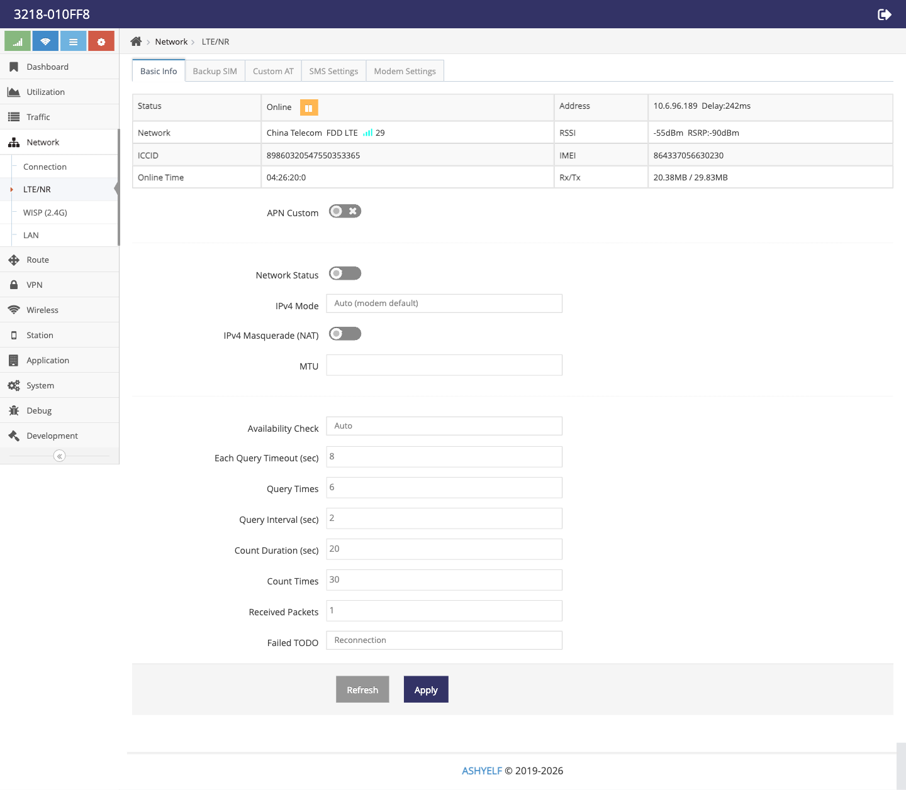

The table at the top is live status (same meaning as the Dashboard LTE card). Yellow pause / orange play connect or disconnect this modem.

| Field | Meaning | How to set |
|-------|---------|------------|
| APN Custom | Use a manual APN profile | On → fill APN / Username / Password / IP Type / Authentication / Dial Number |
| IP Type | PDP type | **IP** (IPv4), **IPv4v6**, **IPv6** |
| Authentication | PDP auth | **Auto**, **None**, **PAP**, **CHAP**, **PAP&CHAP** |
| Dial Number | ATD number | Often `*99#` |
| Network Status | Bring the data session up with the fields below | On to edit IPv4/IPv6 |
| IPv4 Mode | How the modem gets an address | **Advise** (modem default), **PPP**, **DHCP**, **Static IP** |
| Route Options | Accept DHCP routes | DHCP mode |
| IPv4 Address / Subnet Mask / Gateway / DNS / DNS2 | Static IPv4 | Static mode |
| LCP Echo Interval / Times / PPP Option | PPP keep-alive | PPP mode |
| Custom DNS | Override DNS from the operator | On → DNS / DNS2 |
| IPv4 Masquerade(NAT) | NAT LAN toward this uplink | Usually on for Internet sharing |
| MTU | IPv4 MTU | Empty = driver default |
| IPv6 Mode | | **Disable**, **SLAAC**, **Automatic**, **Manual** |
| IPv6 Address / Subnet Prefix / Next Hop / IPv6 DNS | Manual IPv6 | Manual mode |
| Availability Check | Probe used for fail-over | **Disable**, **ICMP**, **Domain**, **Receive Count**, **Auto** |
| Test Address 1–3 | ICMP targets | ICMP mode |
| Each Query Timeout / Query Times / Query Interval | Probe timing | Seconds and counts |
| Count Duration / Count Times / Received Packets | Receive-count probe | Receive Count mode |
| Failed TODO | What to do after the probe fails | **Reconnection**, **Reset Modem**, **Reboot System** |

Typical public-Internet LTE: APN Custom off (or on with the operator APN), Network Status on, IPv4 Mode **Advise**, Masquerade on, Availability Check **Auto**, Failed TODO **Reconnection**. Then **Apply**.

#### Backup SIM

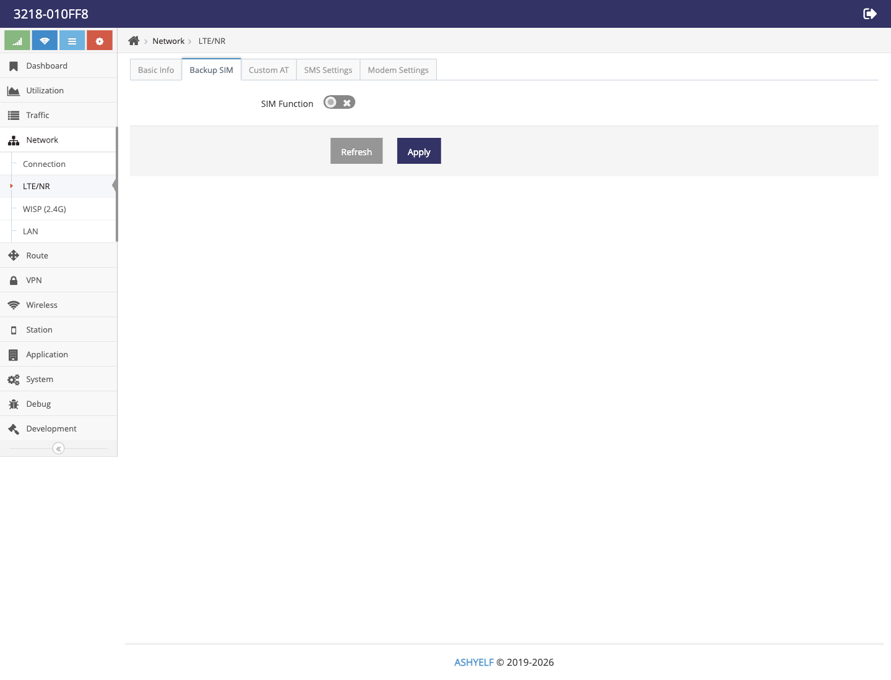

| Field | Meaning |
|-------|---------|
| SIM Function | Enable dual-SIM fail-over |
| Mode | **Auto**, **Main**, **Back**, **Detect** |
| Failover | Seconds to wait before switching |
| Keeplive Fail Switch | Switch SIM when the keep-alive probe fails |
| Simcard / Signal / Attach / Dial thresholds | 1st / 2nd / 3rd fail time and the repeating interval |
| APN Custom (backup) | APN block for the second SIM |
| PIN Code | SIM PIN if the card requires it |

#### Custom AT

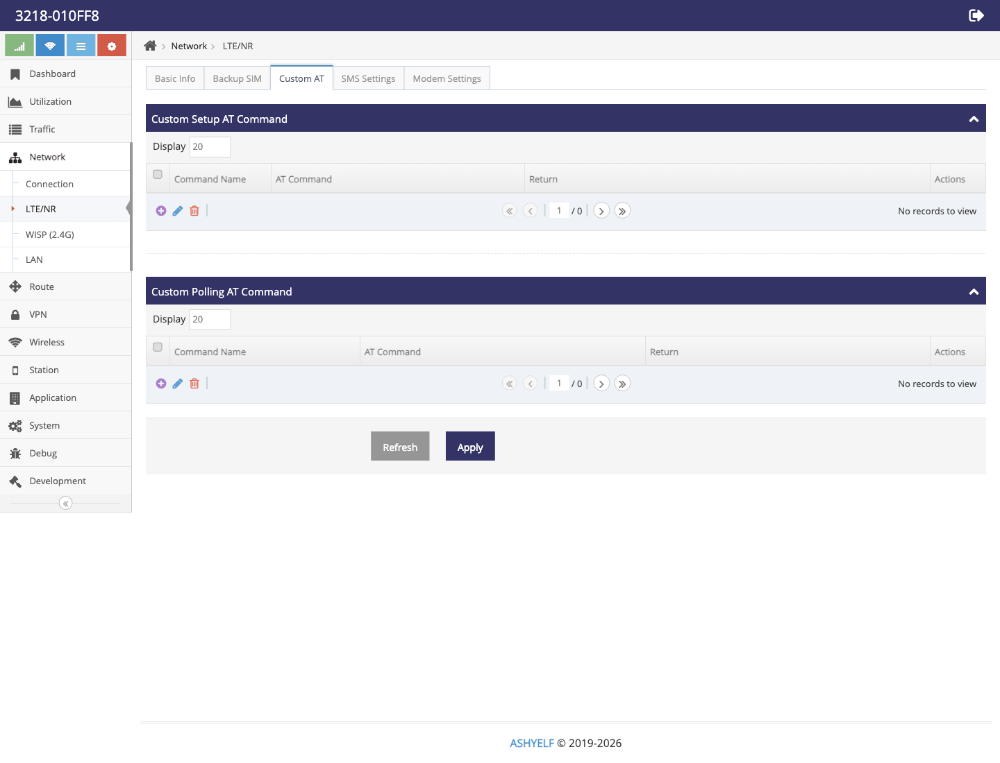

Two grids: commands run at setup, and commands watched periodically. Columns: **Command Name**, **AT Command**, **Return**, Operation. Use **+** to add a row. **Apply** writes the list.

#### SMS Settings

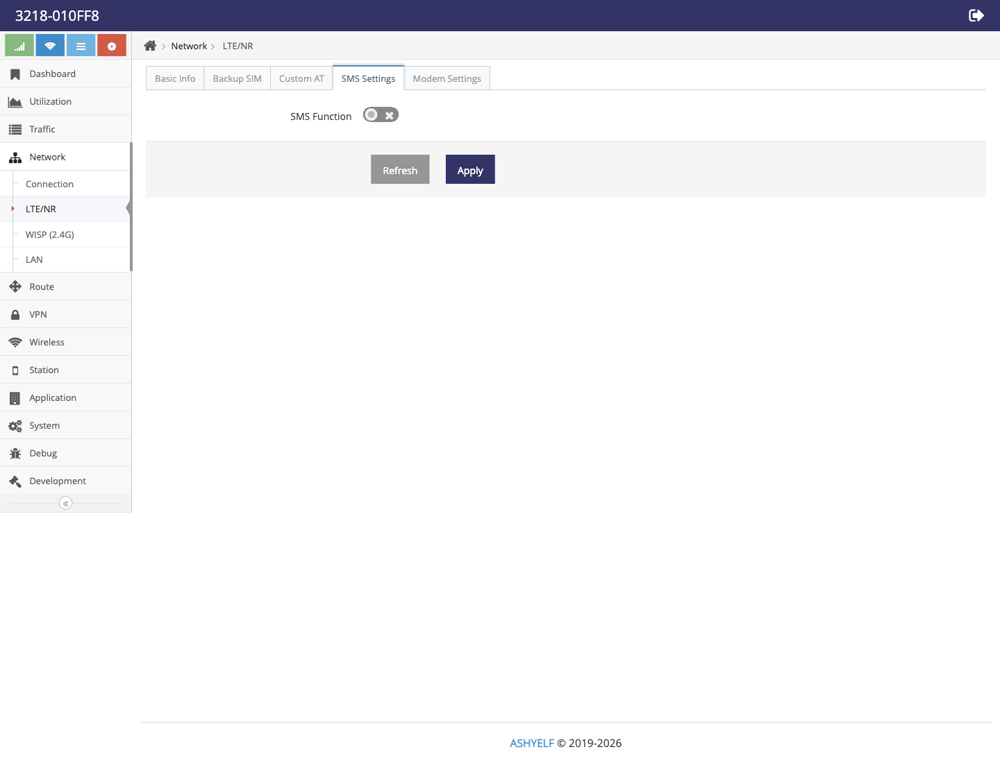

| Field | Meaning |
|-------|---------|
| SMS Function | Enable SMS handling |
| HE Agent | Allow SMS to run HE lines |
| Command Contact | Allowed sender number |
| Command Prefix | Prefix the SMS must start with |

The inbox grid shows Contact, SMS ID, Date, Content.

#### Modem Settings

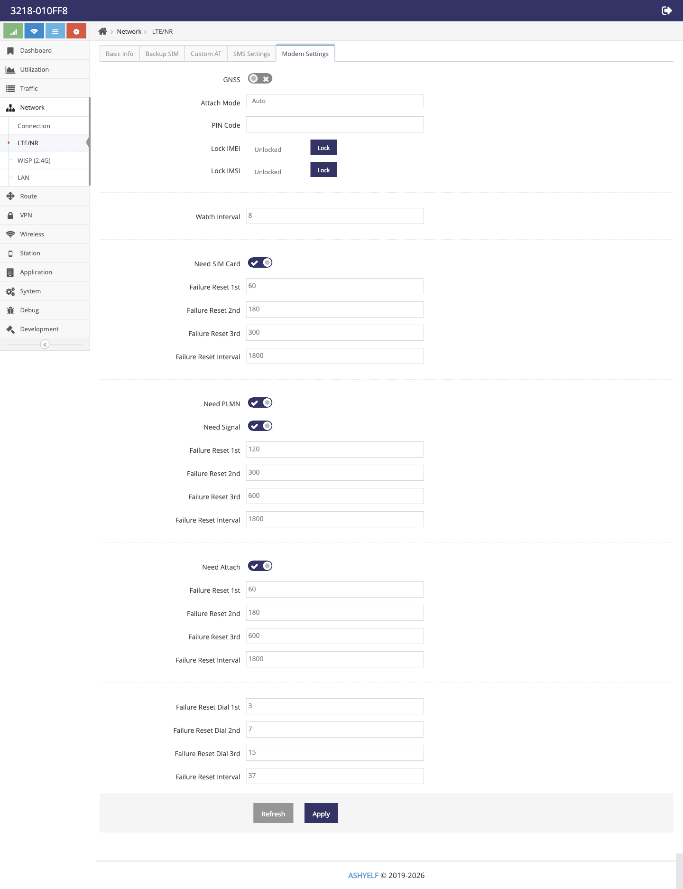

| Field | Meaning |
|-------|---------|
| GNSS | Enable the module GNSS receiver when the hardware has one |
| Attach Mode | **Auto**, **NSA(5G)**, **SA(5G)**, **LTE(4G)**, **WCDMA**, **TDSCDMA**, **EVDO**, **CDMA**, **GSM** |
| PIN | Modem PIN lock |
| Lock IMEI / Lock IMSI | Show current IDs; **Lock** writes a new value (use only when you know the consequence) |
| Watch Interval | Seconds between modem health checks (default 8) |
| Need SIM Card / Need PLMN / Need Signal / Need Attach | Reset the modem when that check fails |
| Failure thresholds | 1st / 2nd / 3rd / interval for SIM, signal, attach, and dial |

Lock the radio to **LTE(4G)** only if the site has no usable 5G and you want to avoid NSA/SA hunting.


### 4.3 WISP (2.4G)

Sidebar: **Network → WISP (2.4G)**. The unit associates to an upstream AP and uses that as a WAN.

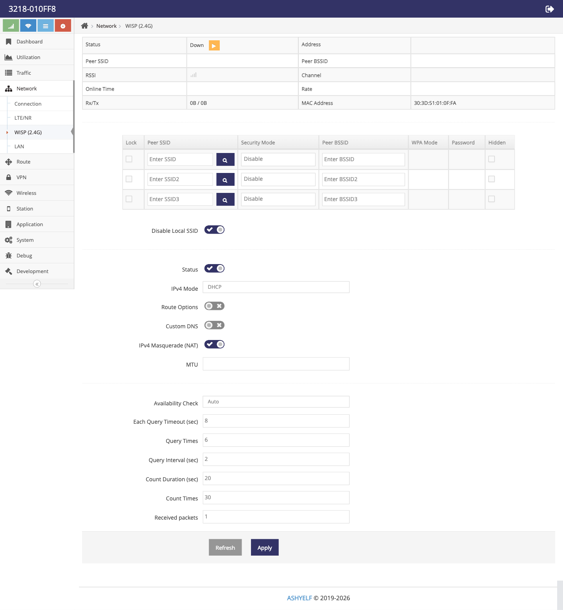

Status row: Status, Address, Delay, Peer SSID/BSSID, RSSI, Channel, Online Time, Rate, Rx/Tx, MAC.

| Field | Meaning | How to set |
|-------|---------|------------|
| Lock (row 1–3) | Pin this peer slot | On to keep SSID/BSSID |
| Peer SSID | Upstream SSID | Type it or pick from the scan grid |
| Security Mode | | **Disable**, **WPA PSK**, **WPA2 PSK**, **WPA/WPA2 Mixed** |
| Peer BSSID | AP MAC | Empty = any BSSID for that SSID |
| WPA Mode | | **TKIP**, **AES**, **TKIP&AES** |
| Password | PSK | 8–63 characters |
| Hidden | Join a hidden SSID | On if the AP does not broadcast |
| Scan grid | Nearby APs | **Rescan**, then click a row to fill the peer |
| Disable Local SSID | Turn off the local 2.4G AP while WISP is up | On in pure CPE mode |
| Status | Enable this WISP object | |
| IPv4 Mode | | **PPPOE**, **DHCP**, **Static IP** |
| IPv4 Address / Mask / Gateway / DNS | Static or PPPoE extras | |
| PPPoE Username / Password | | PPPoE mode |
| Custom DNS / Masquerade / MTU / IPv6 / Availability Check | Same idea as LTE | |

To join a home or shop AP: **Rescan**, select the SSID, enter the PSK, IPv4 Mode **DHCP**, Masquerade on, **Apply**, then use the play button if Status is already on.


### 4.4 LAN

Sidebar: **Network → LAN**. Extra LAN objects appear as LAN2 … LAN4.

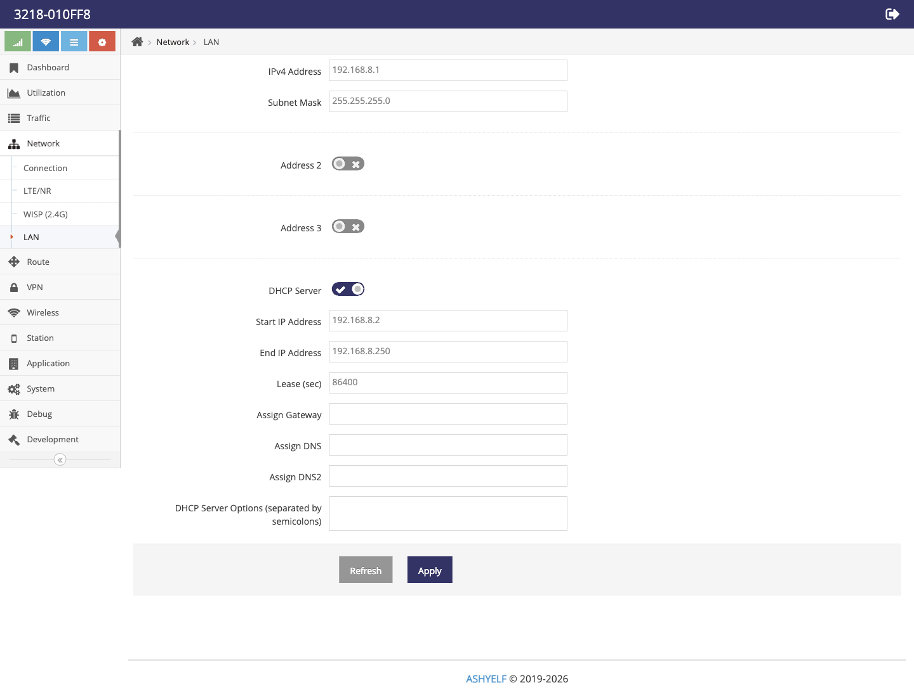

| Field | Meaning | How to set |
|-------|---------|------------|
| IPv4 Address | Gateway address on this LAN | Example `192.168.8.1` |
| Subnet Mask | | Example `255.255.255.0` |
| Address 2 / Address 3 | Extra IPv4 on the same L2 | On → second/third IP and mask (management VLAN, old subnet, …) |
| DHCP Server | Hand out addresses to clients | On for a normal router LAN |
| Start IP Address / End IP Address | Pool | Must sit in the LAN subnet and not include the gateway |
| Lease(Sec) | DHCP lease | `86400` = one day |
| Assign Gateway / Assign DNS / Assign DNS2 | Options sent to clients | Empty gateway = this LAN IP |
| DHCP Server Options | Raw dhcpd options | Advanced |
| IPv6 Mode | | **Disable**, **Relay**, **Manual** |
| IPv6 Address / Prefix | LAN IPv6 | Manual |
| DHCPv6 Server | IPv6 pool, lease, next hop, DNS | When IPv6 is on |

Example home LAN: `192.168.8.1/255.255.255.0`, DHCP on, pool `192.168.8.2`–`192.168.8.250`, lease `86400`, **Apply**. Changing the LAN IP moves the web UI; browse the new address after Apply.


## 5 Route

Sidebar group **Route**.


### 5.1 Hosts

Sidebar: **Route → Hosts**. Static name → IPv4 map used by the device resolver.

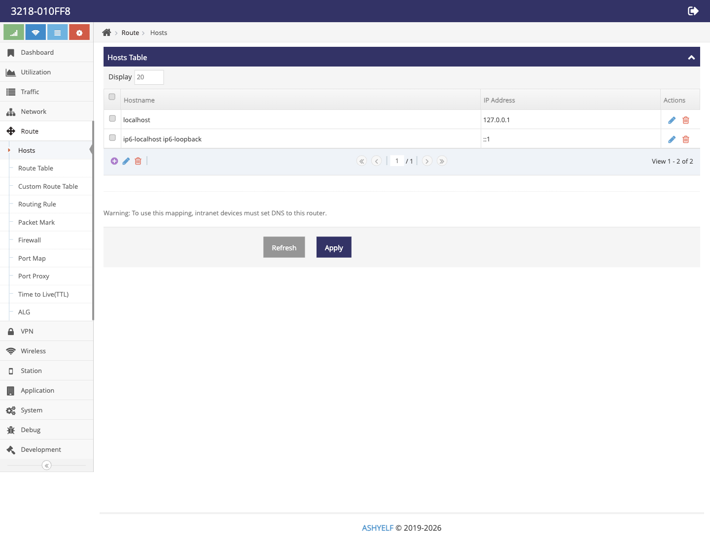

Columns: **Hostname**, **IP Address**, Operation. Click **+**, fill a name and IP, submit. **Apply** writes the file. Use this for local servers that have no DNS.


### 5.2 Route Table

Sidebar: **Route → Route Table**. Read-mostly view of the kernel main table.

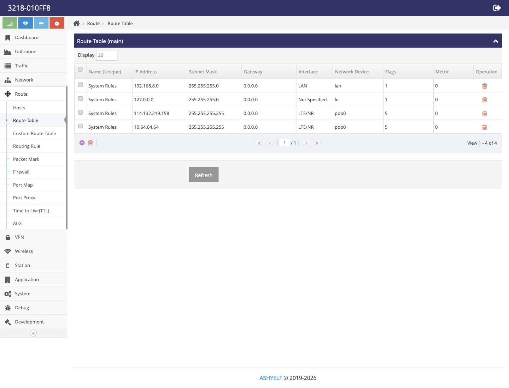

| Column | Meaning |
|--------|---------|
| Name | Route object name |
| IP Address / Subnet Mask / Gateway | Destination and next hop |
| Interface / Network Device | Logical object and netdev |
| Flags / Metric | Kernel flags and metric |

Use this to confirm which uplink is the default route after you change Connection.


### 5.3 Custom Route Table

Sidebar: **Route → Custom Route Table**. Extra tables (policy routing).

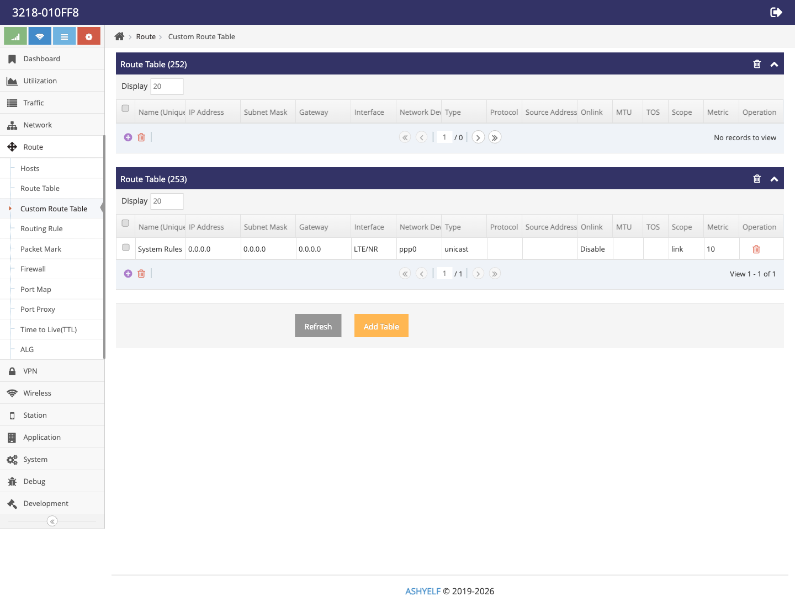

**Add Table** creates a table. Open a table to add destinations, gateways, and outgoing interfaces. Pair this with **Routing Rule**.


### 5.4 Routing Rule

Sidebar: **Route → Routing Rule**. Policy rules (from / to / iif / fwmark → table).

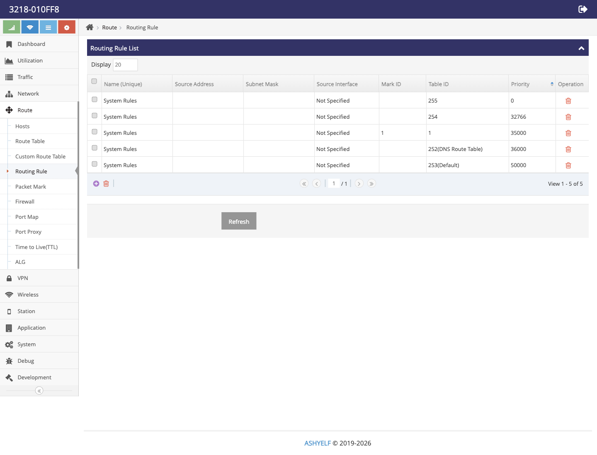

Click **+**. Typical fields: source, destination, incoming interface, mark, lookup table, priority (`pref`; smaller is higher, default 40000). Example: “LAN traffic to 10.0.0.0/8 uses table 100”.


### 5.5 Packet Mark

Sidebar: **Route → Packet Mark**. Mark packets so Routing Rule or QoS can match them.

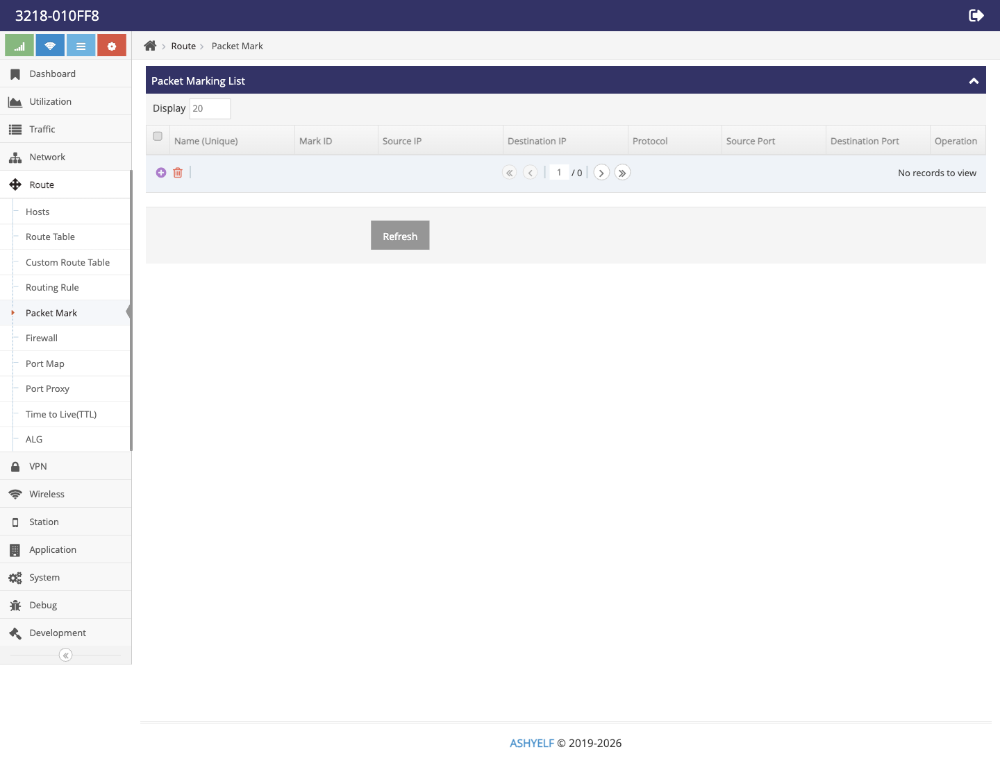

Add matches (address, port, protocol) and a mark value. Then point a Routing Rule at that mark.


### 5.6 Firewall

Sidebar: **Route → Firewall**. One tab per uplink / LAN.

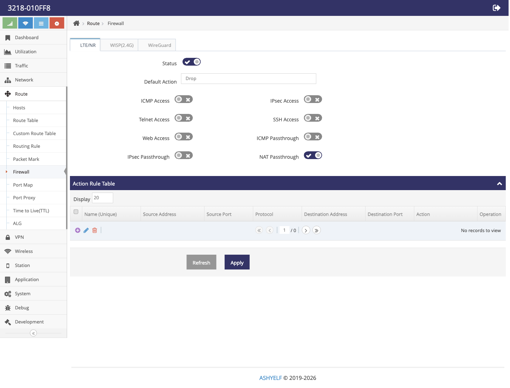

| Field | Meaning | How to set |
|-------|---------|------------|
| Status | Enable this interface’s filter | On to enforce |
| Default Action | What unmatched packets do | **Drop** (whitelist) or **Accept** (blacklist extras) |
| ICMP Access | Ping this interface from outside | |
| IPSEC Access | IKE/ESP to this device | On if this unit is an IPsec peer |
| Telnet / SSH / WEB Access | Management from this interface | Turn WEB off on WAN if you only manage from LAN |
| ICMP / IPSEC / NAT Through | Forward those families | NAT Through for typical Internet NAT |

The rule grid: **Name**, **Src Address**, **Src Port**, **Protocol**, **Dest Address**, **Dest Port**, **Action**. **+** adds an allow or deny. **Apply** per interface tab.

Example: Default **Drop** on LTE, **WEB Access** off, **ICMP Access** on for diagnostics, then add a DNAT-related accept if you use Port Map.


### 5.7 Port Map

Sidebar: **Route → Port Map**. DNAT from an uplink to a LAN host (classic “virtual server”).

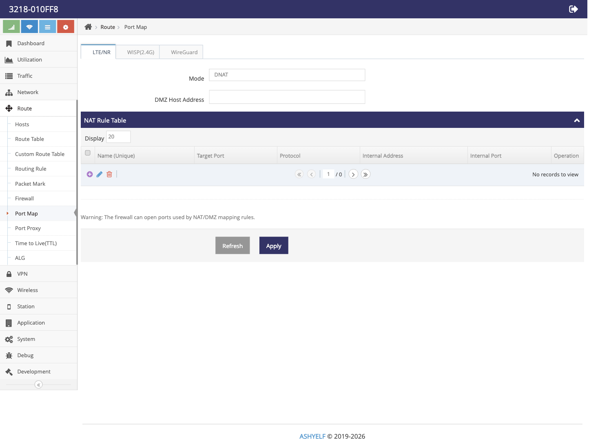

| Field | Meaning |
|-------|---------|
| Interface tabs | Which uplink the public port is on |
| Mode | **DNAT** or **Forward** |
| DMZ Host Address | Send all unmatched inbound to this LAN IP (use with care) |

Grid: **Name**, **Target Port** (public), **Protocol**, **Intranet Address**, **Intranet Port**.

Example: WAN/LTE TCP 8080 → `192.168.8.50:80`. Add the row, **Apply**, and open Firewall for that uplink if Default Action is Drop.


### 5.8 Port Proxy

Sidebar: **Route → Port Proxy**. Proxy a local port to another Internet host (device as a port forwarder).

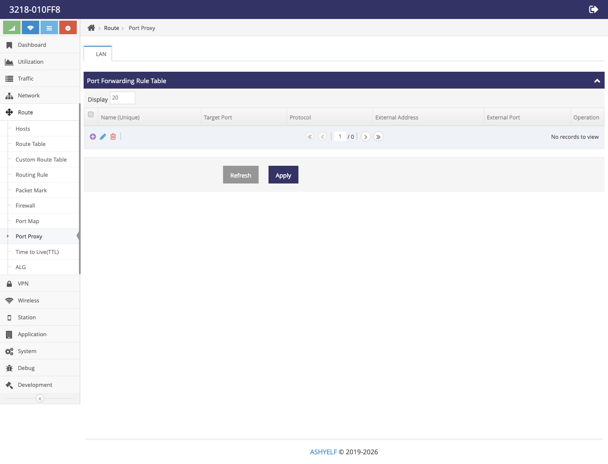

Grid: **Name**, **Target Port** (on this device), **Protocol**, **Internet Address**, **Internet Port**.


### 5.9 Time to Live (TTL)

Sidebar: **Route → Time to Live(TTL)**.

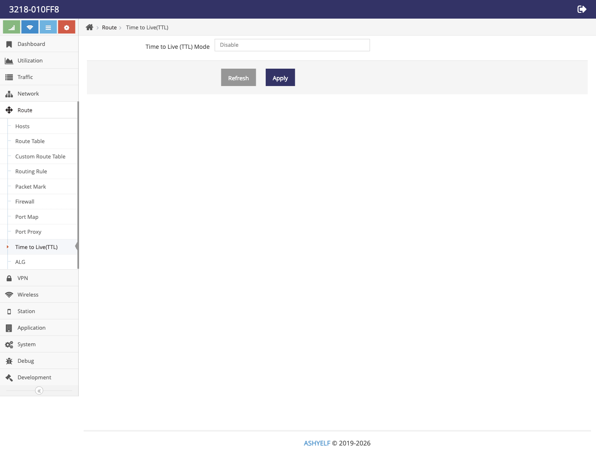

| Field | Meaning |
|-------|---------|
| LAN Interface | Which LAN the rewrite applies to |
| TTL Mode | **Disable**, **Fix TTL**, **Increase TTL**, **Decrease TTL** |
| TTL / Increase / Decrease | Fixed value or delta |

Some upstreams drop traffic that looks like a phone hotspot (TTL 1). **Increase TTL** by 1 is the usual fix. **Apply**.


### 5.10 ALG

Sidebar: **Route → ALG**. Helpers for protocols that embed addresses.

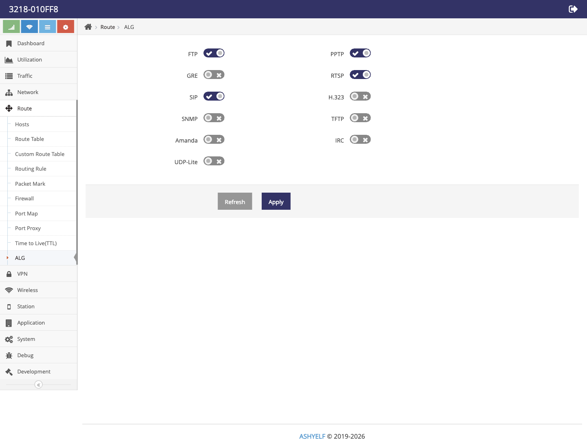

Switches: **FTP**, **PPTP**, **GRE**, **RTSP**, **SIP**, **H323**, **SNMP**, **TFTP**, **Amanda**, **IRC**, **UDP Lite**. Turn on only the protocols you actually pass through NAT. **Apply**.


## 6 VPN

Sidebar group **VPN**. List pages create instances (`vpn@l2tp`, `ipsec@client`, `nvpn@wg`, …). The purple **+** asks for the peer (and port where needed). Pencil opens the instance form. Trash deletes.


### 6.1 IPsec Client

Sidebar: **VPN → IPsec Client**.

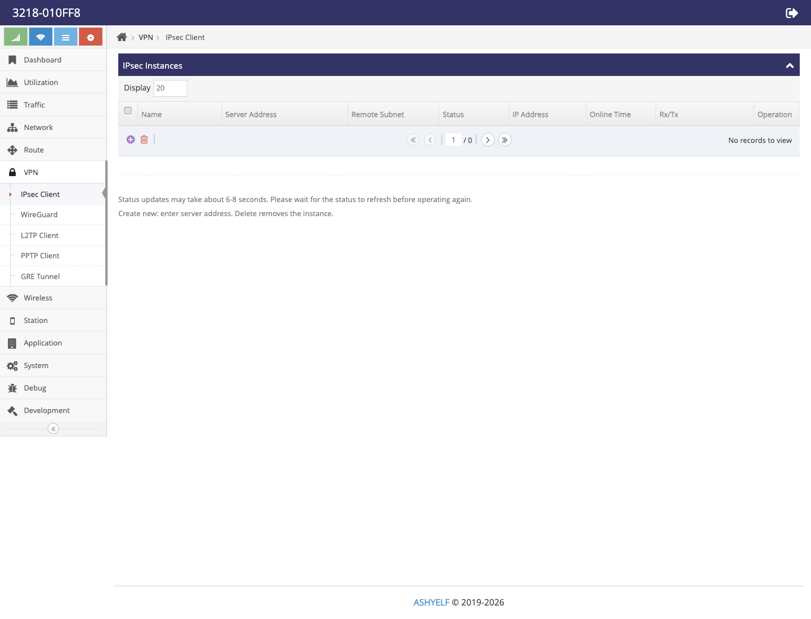

**+** then enter the gateway address. Open the instance to edit:

| Field | Meaning |
|-------|---------|
| Status | Enable the tunnel |
| Extern Interface | `default` or a specific uplink |
| Server Address | Peer IPv4 / DNS |
| IKE Version | `1` or `2` |
| Exchange Mode / NAT Traversal | IKEv1 main/aggressive; NAT-T |
| Auth Method | PSK or certificates |
| PSK | Pre-shared key |
| Local ID / Remote ID | IKE identities (`@name` if the hub uses FQDN IDs) |
| Local Subnet / Remote Subnet | Traffic selectors (`10.1.0.0/24`) |
| Assign IP / VIP | Ask the hub for a virtual IP |
| IKE / ESP proposals, Rekey, DPD | Crypto and timers |
| CA / Cert / Key | Upload / download / delete when not using PSK |

Play/pause on the instance page brings the SA up or down. Status table: IKE/ESP state, proposals, subnets, Rx/Tx.


### 6.2 WireGuard

Sidebar: **VPN → WireGuard**.

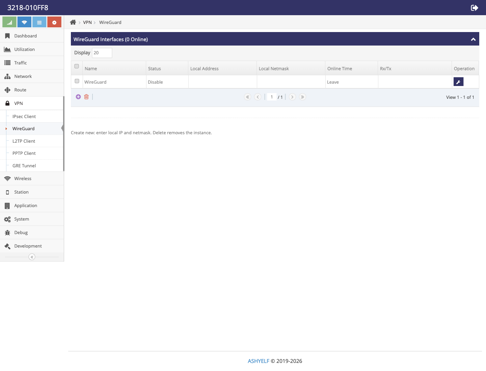

**+** asks for local address and mask (example `10.0.0.2`, `255.255.255.0`). Instance fields: private/public key (**Rekey**), listen port, MTU, peer endpoint, allowed IPs, keepalive, masquerade, default route. **Apply**, then play to bring `wg` up.


### 6.3 L2TP Client

Sidebar: **VPN → L2TP Client**.

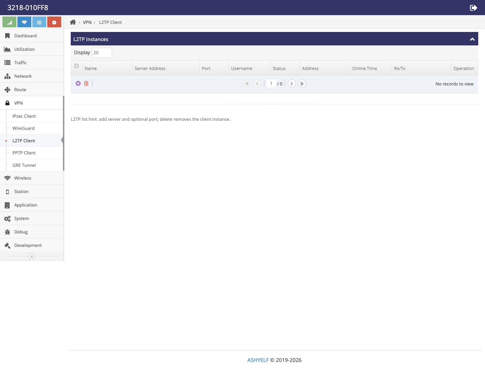

**+** asks for server and port (default 1701). Instance: Status, Extern, Server, Port, Username, Password, auth mode, masquerade, default route. Play/pause controls the PPP.


### 6.4 PPTP Client

Sidebar: **VPN → PPTP Client**.

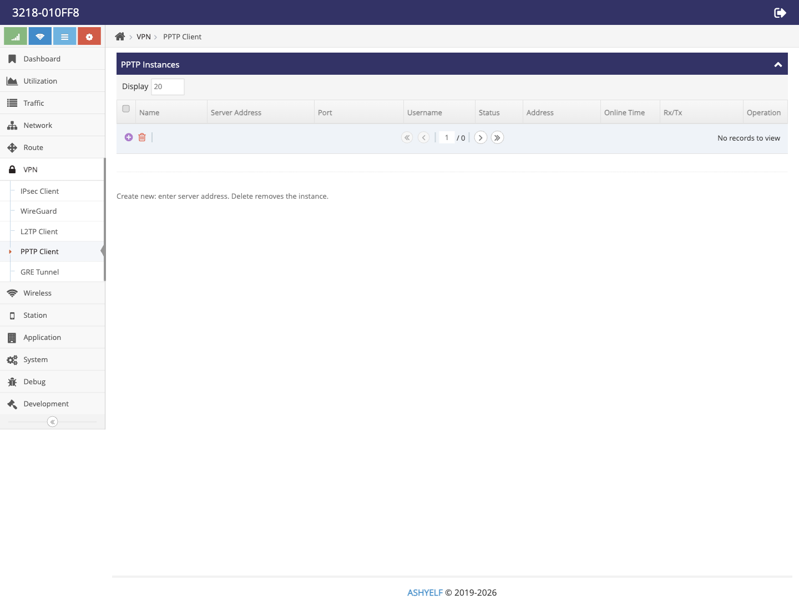

Same pattern as L2TP without a UDP port field. Enable **ALG → PPTP** if the tunnel must pass another NAT.


### 6.5 GRE Tunnel

Sidebar: **VPN → GRE Tunnel**.

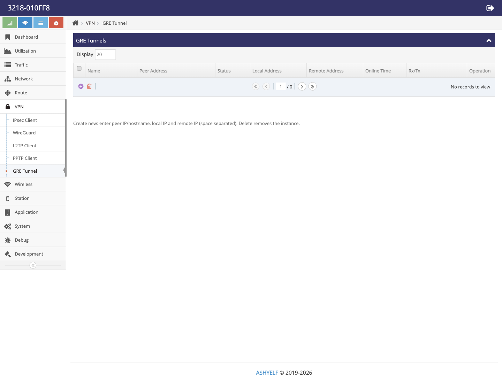

**+** asks for the peer address. Instance: local/remote tunnel IPs, outgoing interface, masquerade. Enable **ALG → GRE** when GRE is NATed.


## 7 Wireless

Sidebar group **Wireless**. This unit has **2.4G SSID** only. Products with a 5.8G radio also show **5.8G SSID** (same form). MSSID / ApClient appear when those objects exist and the working mode allows them.


### 7.1 2.4G SSID — SSID Setup

Sidebar: **Wireless → 2.4G SSID**. Tabs: **SSID Setup**, **Advanced Setup**, **ACL Setup**, **Clients Table**.

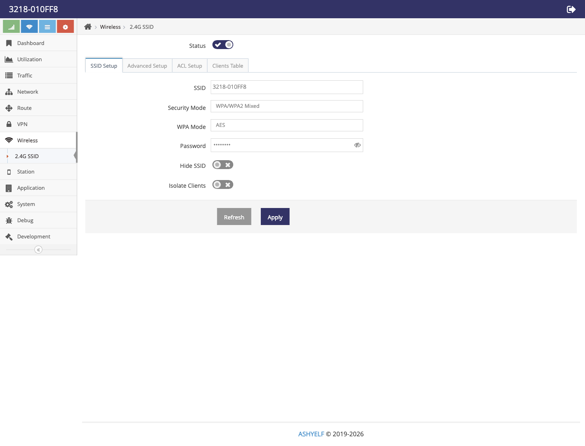

| Field | Meaning | How to set |
|-------|---------|------------|
| Status | Start the AP | On |
| SSID | Broadcast name | Up to 32 characters |
| Security Mode | | **Disable(None)**, **WPA-PSK**, **WPA2-PSK**, **Mixed WPA-PSK** |
| WPA Mode | Cipher | **TKIP**, **AES**, **Auto** (TKIP+AES). Prefer **AES** |
| Password | PSK | 8–63 characters. Eye icon shows it |
| Hide SSID | Do not broadcast the name | Clients must type the SSID |
| Isolate Clients | Stations cannot see each other | On for guest Wi-Fi |

Example: SSID `Office-2G`, Security **Mixed WPA-PSK**, WPA Mode **AES**, a long password, Isolate off, **Apply**.


### 7.2 Advanced Setup

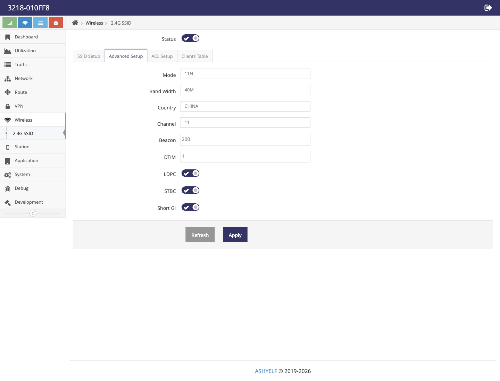

| Field | Meaning |
|-------|---------|
| Mode | Radio PHY (b/g/n mix — options depend on the chip) |
| Band Width | 20 / 40 MHz on 2.4G |
| Country | Regulatory domain. **ALL** is unconstrained |
| Channel | `0` / auto or a fixed channel (1–13 in most regions) |
| Beacon / DTIM | Beacon interval and DTIM period |
| LDPC / STBC / Short GI | PHY extras; leave on unless a client is incompatible |
| Tx Power | Percent or dBm of max (chip-specific) |

Fix **Channel** (for example `11`) if you want to avoid auto-channel jumps. **Apply**.


### 7.3 ACL Setup

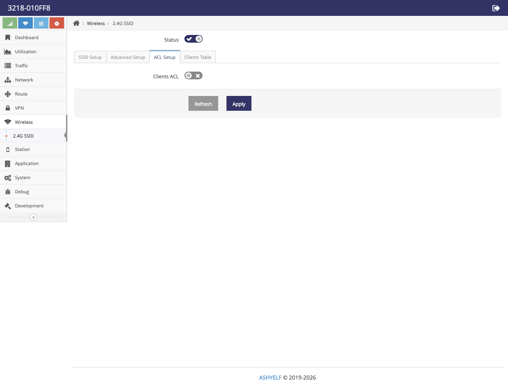

| Field | Meaning |
|-------|---------|
| Clients ACL | Enable MAC filter on this SSID |
| ACL Type | Allow list or deny list (as offered on the page) |

Grid: MAC addresses. **+** adds a station. Use **Station → Access Control List** for IP/port policy across interfaces.


### 7.4 Clients Table

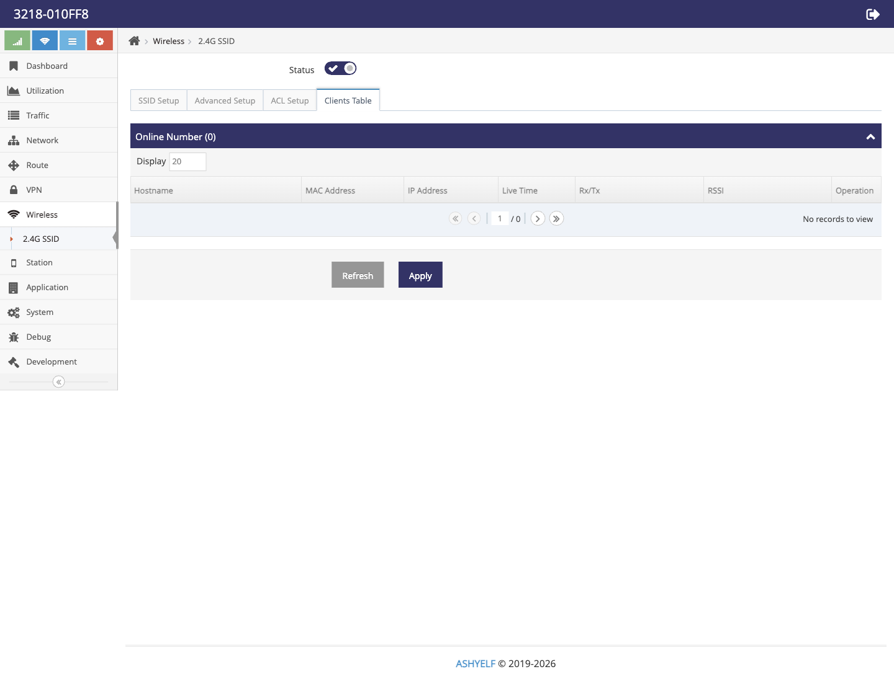

Associated stations: Hostname, MAC, IP, Live Time, RSSI. **Knock** (when shown) drops that client.


## 8 Station

### 8.1 Station List

Sidebar: **Station → Station List**.

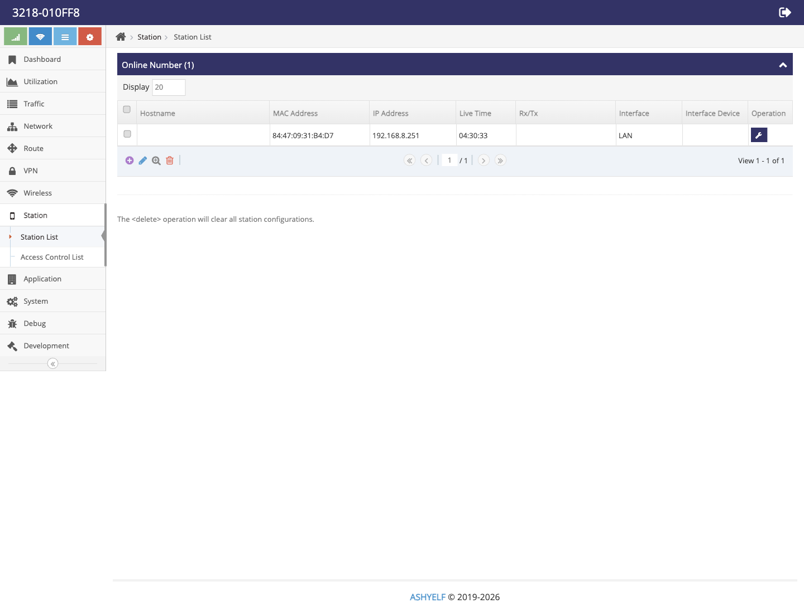

Same columns as Traffic Clients, plus Operation (edit name / forget). Use this to see who is on LAN and Wi-Fi.


### 8.2 Access Control List

Sidebar: **Station → Access Control List**.

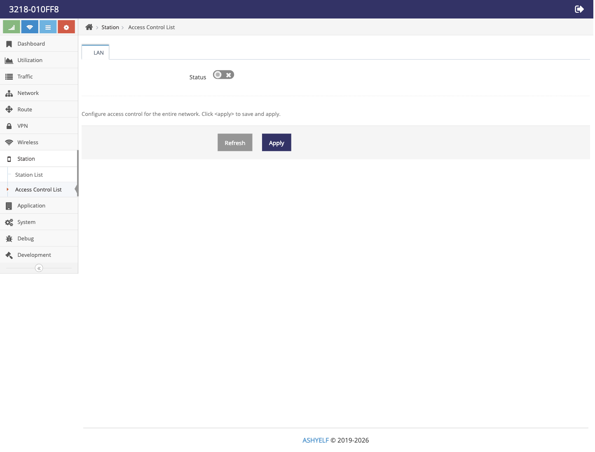

| Field | Meaning |
|-------|---------|
| Status | Enable ACL |
| Interface tabs | Which L3 object the rules bind to |

Rule: **Rule Name**, **Src Address**, **Action**, **Protocol**, **Dest**, **Dest Port**, time window (start/end date, time, week). Example: deny `192.168.8.80` TCP/80 at night.


## 9 Application

Sidebar group **Application**. Pages without a `menu` in their package land here.


### 9.1 IO Control

Sidebar: **Application → IO Control**.

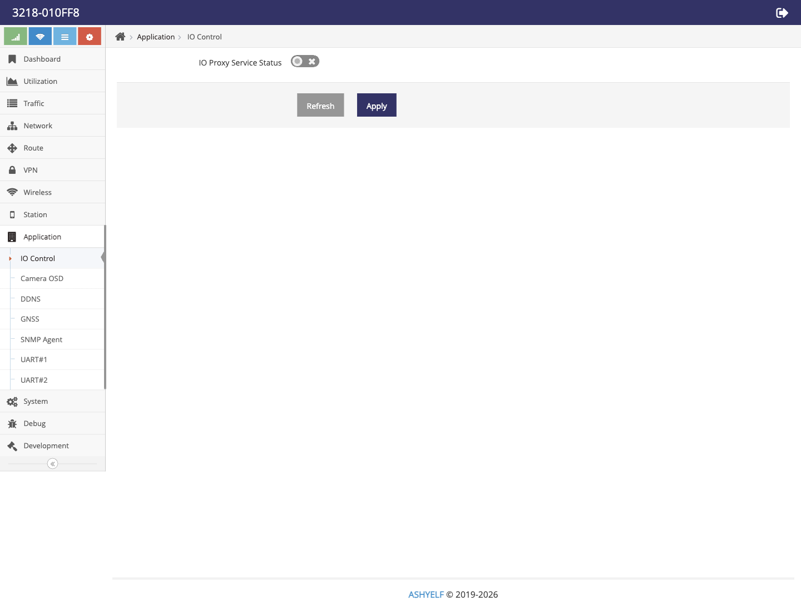

Tabs are one per GPIO instance. Typical blocks:

| Field | Meaning |
|-------|---------|
| IO Proxy Service | Enable remote IO |
| Extern Interface | Which uplink the proxy uses |
| Client / MQTT / Server | Peer address, port, credentials, topics, limits |
| Connections grid | Peer, status, Tx, Rx |

Local levels (`g1` …) use `00` in-low, `01` in-high, `10` out-low, `11` out-high. **Apply** after you set the init map.


### 9.2 Camera OSD

Sidebar: **Application → Camera OSD**.

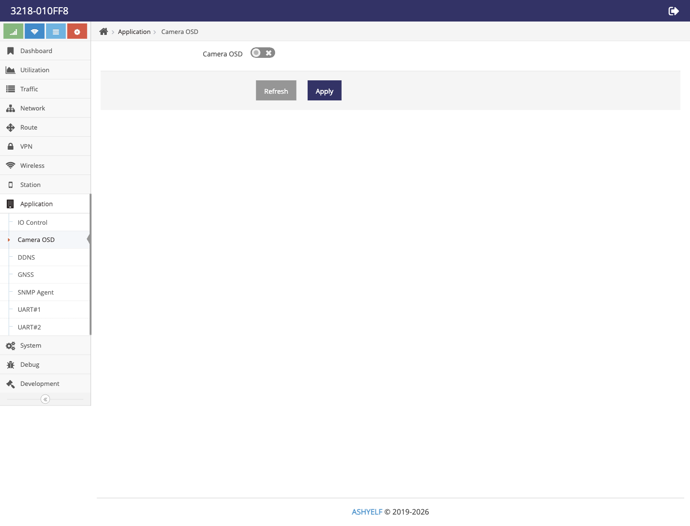

| Field | Meaning |
|-------|---------|
| Camera OSD | Enable overlay push |
| Camera Type | Vendor (for example Hikvision) |
| IP / Username / Password | Camera login |
| Update Interval(ms) | How often to refresh OSD text |
| Mapping rules | Which HE/status fields go on the overlay |

**Add** a rule, **Apply**. The camera must allow the account to write OSD.


### 9.3 DDNS

Sidebar: **Application → DDNS**.

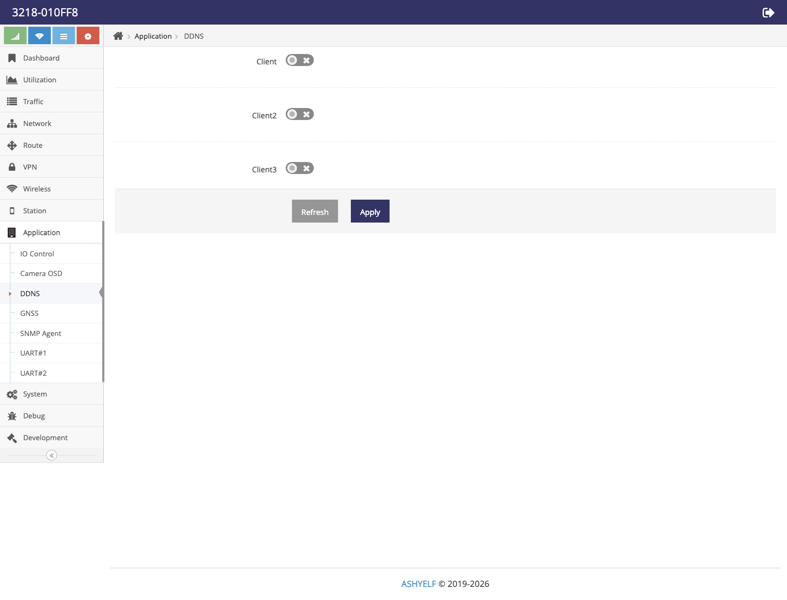

Up to three clients. For each:

| Field | Meaning |
|-------|---------|
| Client switch | Enable this slot |
| State / Domain IP / Extern IP | Live result (`register`, `succeed`, `already`, `deny`, `noneed`) |
| Extern Interface | Which WAN IP to publish; empty = default route |
| Service Provider | Filled from the device ISP list (Oray, …) |
| Domain / Username / Password | Provider account |

Turn Client on, pick the ISP, fill domain and password, **Apply**. Watch **State** until **succeed**.


### 9.4 GNSS

Sidebar: **Application → GNSS**.

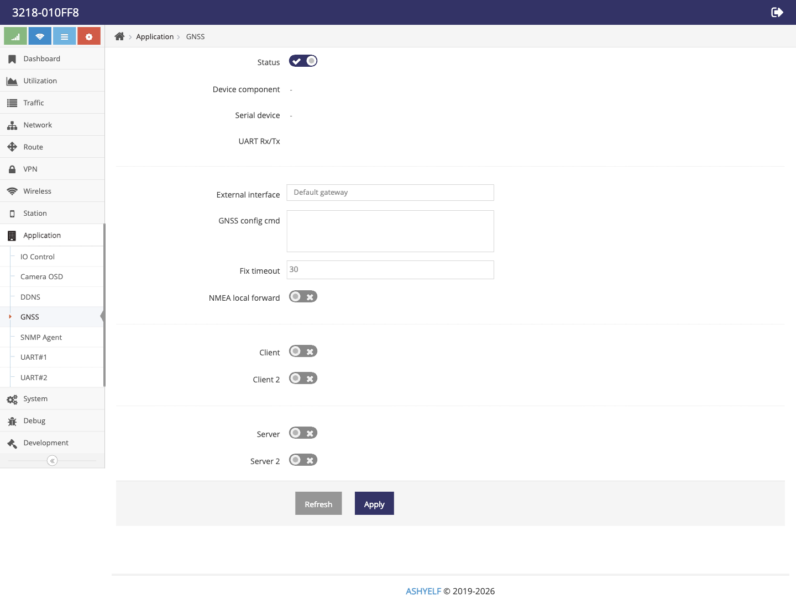

| Field | Meaning |
|-------|---------|
| Status | Enable the NMEA object |
| Device Component / Serial Device | Bound UART (read-only) |
| UART Rx/Tx | Bytes on the serial line |
| Fix Status / UTC / Lat Lon Alt | Live fix |
| Seconds since last fix | Stale-fix watchdog |
| GNSS command / Fix Timeout | Chip setup |
| Client 1–2 / Server 1–2 | Forward filtered NMEA (TCP/UDP, address, port, sentence filter such as `GGA;RMC`) |

Enable Status, set the filter and the server you want to receive GGA/RMC, **Apply**.


### 9.5 SNMP Agent

Sidebar: **Application → SNMP Agent**.

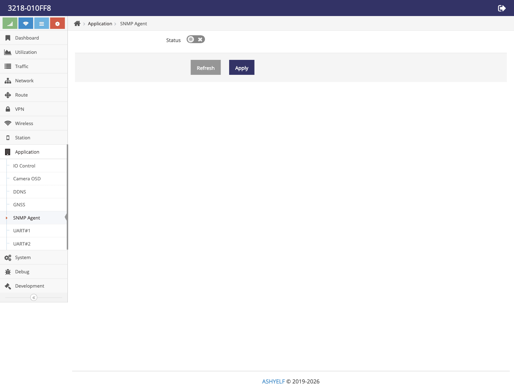

| Field | Meaning |
|-------|---------|
| Status | Enable `snmpd` |
| Port | UDP, default `161` |
| RO / RW Community | SNMPv1/v2c strings |
| SNMPv3 | **Disable**, **None Auth**, **Auth**, **Priv** |
| v3 user / auth / privacy | When v3 is on |
| System Name / Contact / Location | sysName / sysContact / sysLocation |
| Configure Options | Extra snmpd lines |
| OID grid | Extra OIDs |

Factory default is often **disabled**. Turn Status on, set a non-default RO community, **Apply**. Open **Firewall → SNMP** paths if you poll from WAN.


### 9.6 UART#1 / UART#2

Sidebar: **Application → UART#1** and **UART#2**. Same form; objects `uart@tty` and `uart@tty2`.

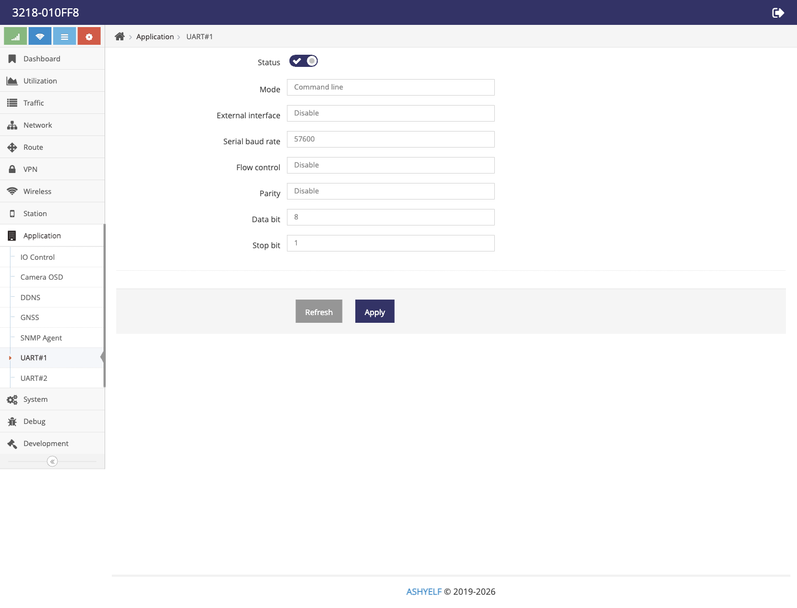

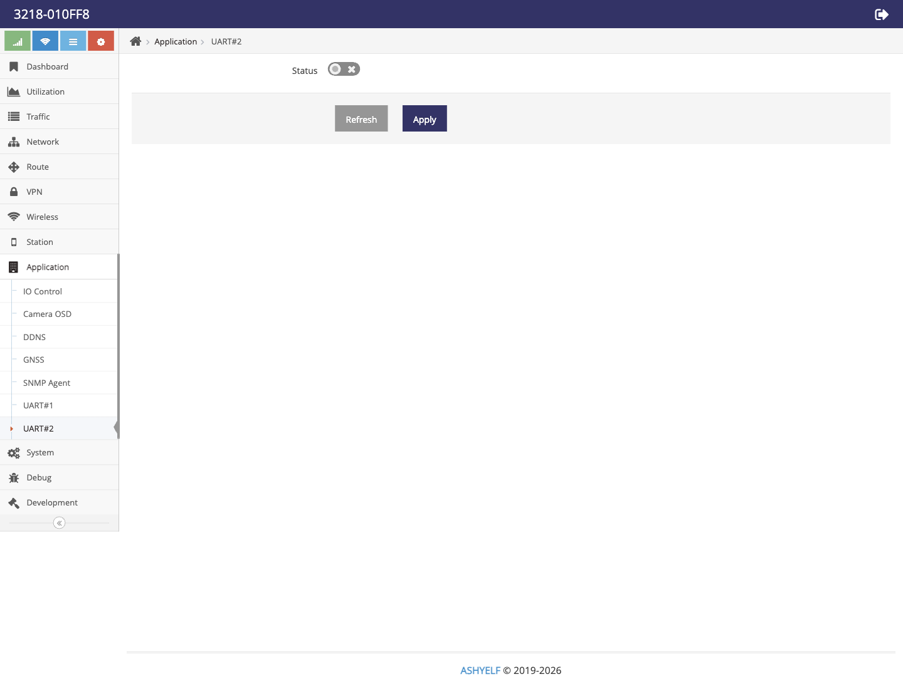

| Field | Meaning | How to set |
|-------|---------|------------|
| Status | Open the port | On |
| Mode | Application | **Command Line** (`uartdrv@tui` — eline on this UART), **Transparent Forwarding** (`uartdrv@dtu`), **RTK(Sixents)** |
| Convert | Protocol convert extras | Mode-dependent |
| Extern Interface | Reset/start when that uplink is up | |
| Serial Baud Rate | | `1200` … `921600` (Command Line is often `57600`) |
| Flow Control / Parity / Data Bit / Stop Bit | Line settings | Match the attached device |
| DTU / TCP / MQTT / TLS blocks | Shown in Transparent mode | Server, port, proto, cert upload/download/delete |

Example Command Line console: Status on, Mode **Command Line**, 57600 8N1, **Apply**. Then a serial client at 57600 8N1 gets the `$ ` prompt.

Example DTU: Mode **Transparent Forwarding**, baud matching the meter, client TCP to `192.168.8.250:800`, **Apply**.


## 10 System

Sidebar group **System**. **Device** is a tabbed page. The other entries are separate pages.


### 10.1 Device — Device Manage

Sidebar: **System → Device**.

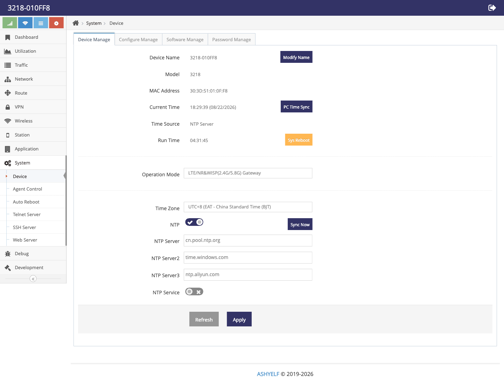

| Field / button | Meaning |
|----------------|---------|
| Device Name + **Modify Name** | Hostname shown on login and in the title |
| MAC Address | Device MAC (read-only) |
| Current Time + **PC Time Sync** | Copy the browser clock to the device |
| Time Source | `ntp` / local |
| Run Time + **Sys Reboot** | Uptime; reboot the whole unit (confirm) |
| Operation Mode | Working mode (`mwm`, `gateway`, `wisp`, …). Hidden when the product locks the mode |
| Time Zone | NTP timezone |
| NTP + **Sync Now** | NTP client |
| NTP Server / Server2 / Server3 | Pool hosts (example `ntp1.aliyun.com`) |
| NTP Service | Serve NTP to the LAN |

Set timezone and at least one NTP server, turn NTP on, **Sync Now**, then **Apply**.


### 10.2 Device — Configure Manage

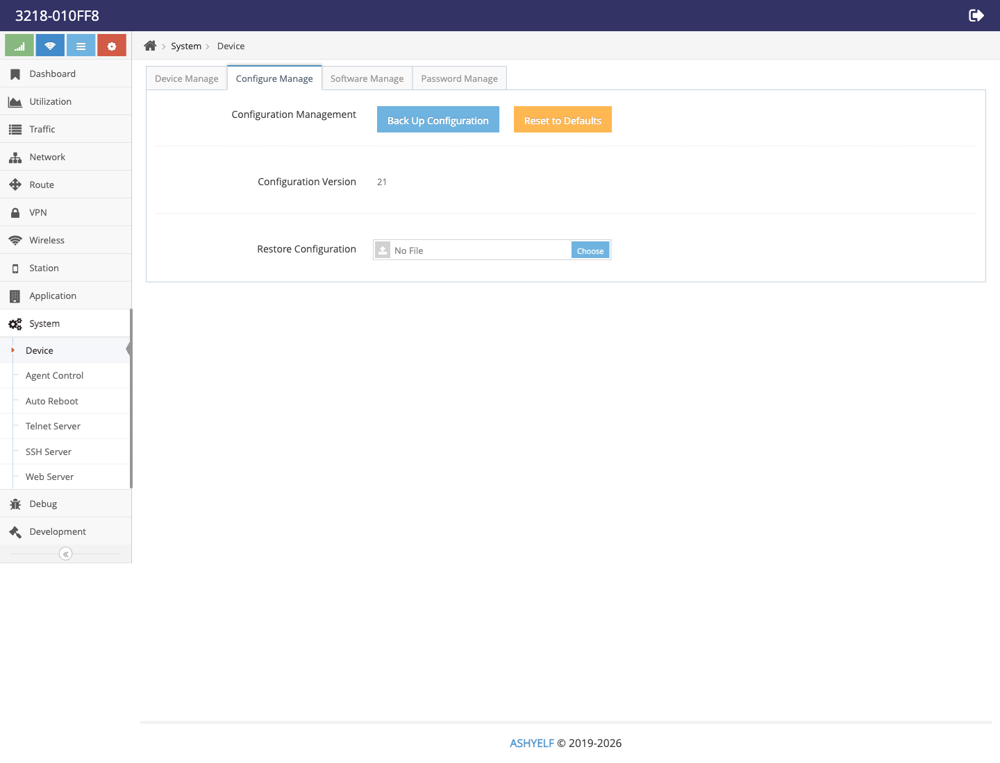

| Control | Meaning |
|---------|---------|
| **Backup Configure** | Download the current config archive |
| **Default Configure** | Factory-reset configuration (confirm; the unit restarts services) |
| Configure Version | `cfgversion` |
| Restore Configure | Upload a previous backup |

Keep a backup before **Default Configure** or a firmware upgrade.


### 10.3 Device — Software Manage

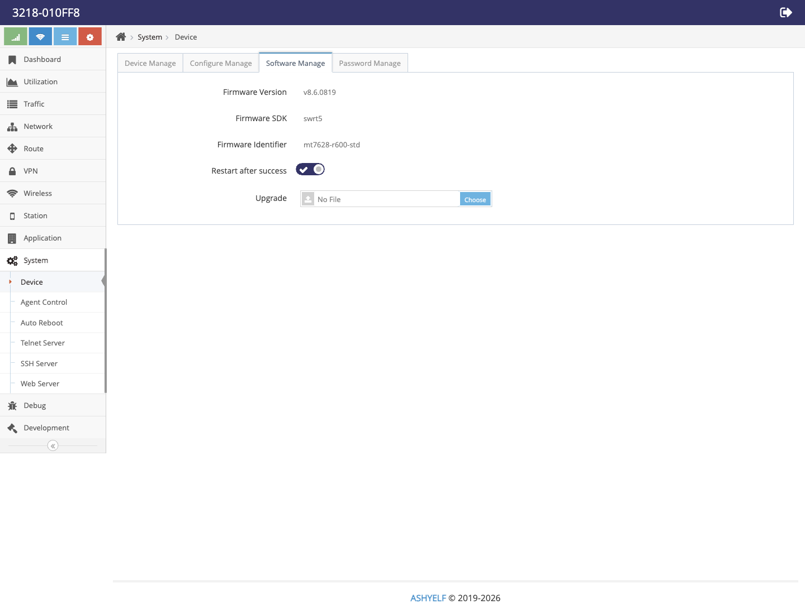

| Control | Meaning |
|---------|---------|
| Firmware Version / SDK / Identifier | Running image |
| Restart after success | Reboot after a `.zz` upgrade |
| Upgrade file | Upload a full firmware `.zz` |
| Check new version / Change Log | Online repository, when configured |
| Project grid | Installed FPK name, size, version, path |
| Enter FPK Repositories | Browse/install packages |
| Default FPK&Configure | Restore packaged defaults |

`.zz` replaces the whole image. FPK updates one project without a reboot (not for `land` / `arch`).


### 10.4 Device — Password Manage

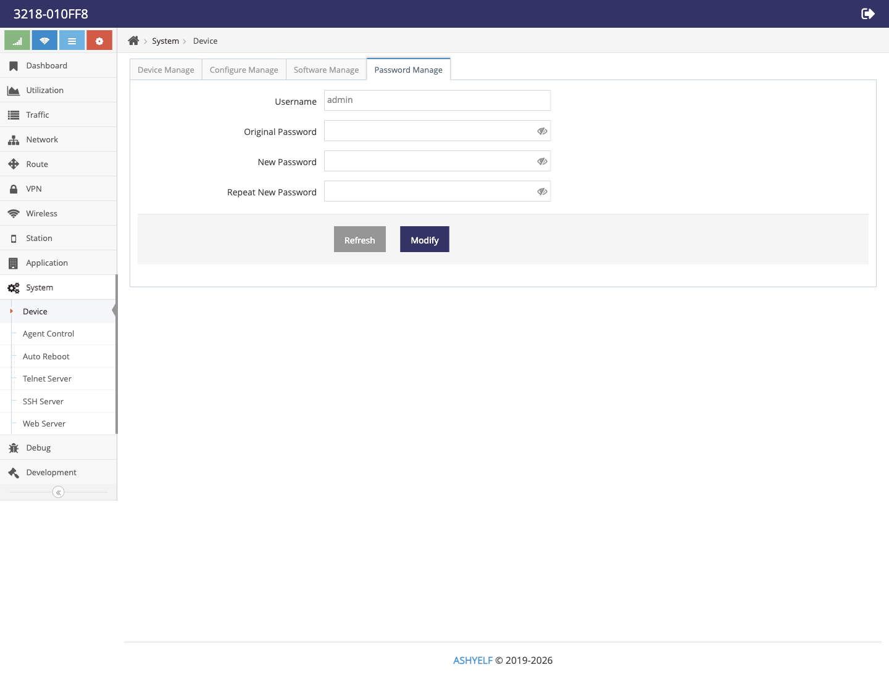

| Field | Meaning |
|-------|---------|
| Username | New login name (default `admin`) |
| Original Password | Current password |
| New Password / Repeat New Password | New secret |

Click **Modify**. The next page load uses the new account. This is the same account as Telnet/SSH.


### 10.5 Agent Control

Sidebar: **System → Agent Control**. Tabs: **Local Control**, **Agent Control**, **MQTT Control**.

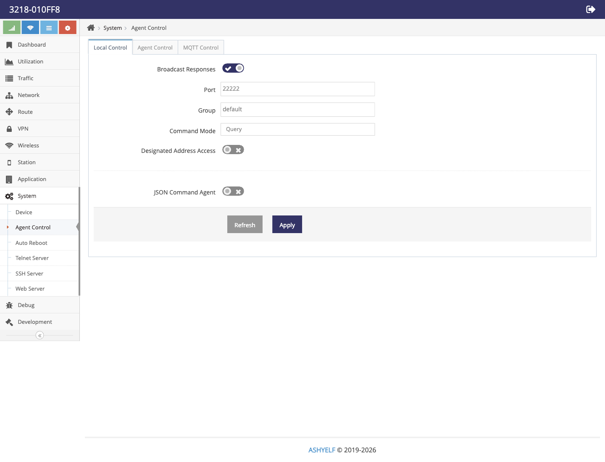

**Local Control** (UDP discovery):

| Field | Meaning |
|-------|---------|
| Broadcast Responses | Answer UDP discovery |
| Port | Default `22222` |
| Group | Discovery group (`default`) |
| Command Mode | **Query**, **ALL**, **Disable** |
| Designated Address Access | Limit who may query; addresses separated by `;` |

**Agent Control** is the TCP JSON/HE bridge (`json` / `json_port`, often `22220`). **MQTT Control** is the MQTT agent (broker, topics, credentials). **Apply** on the tab you edited.


### 10.6 Auto Reboot

Sidebar: **System → Auto Reboot**.

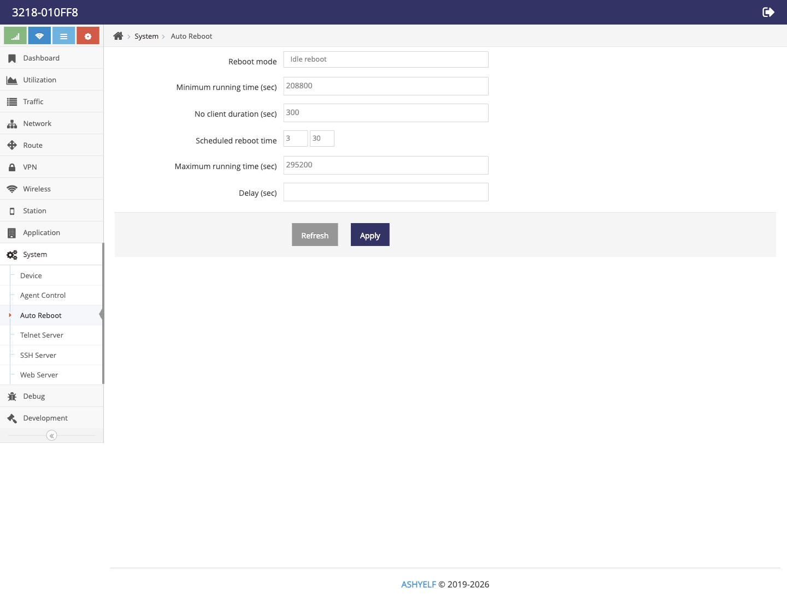

| Field | Meaning |
|-------|---------|
| Reboot Mode | **Disable**, **Idle Reboot**, **Age**, **Point** |
| Minimum running time(sec) | Do not reboot before this uptime (Idle) |
| None Client duration(sec) | Idle: no Wi-Fi/LAN clients for this long |
| Point Reboot Time | Hour and minute |
| Maximum running time(sec) | Force reboot after this uptime |
| Delay(sec) | Wait after the condition matches |
| Reboot time interval(sec) | Age: reboot every N seconds of uptime |

Example weekly hygiene: **Point**, 04:00, Delay `60`, **Apply**.


### 10.7 Telnet Server

Sidebar: **System → Telnet Server**.

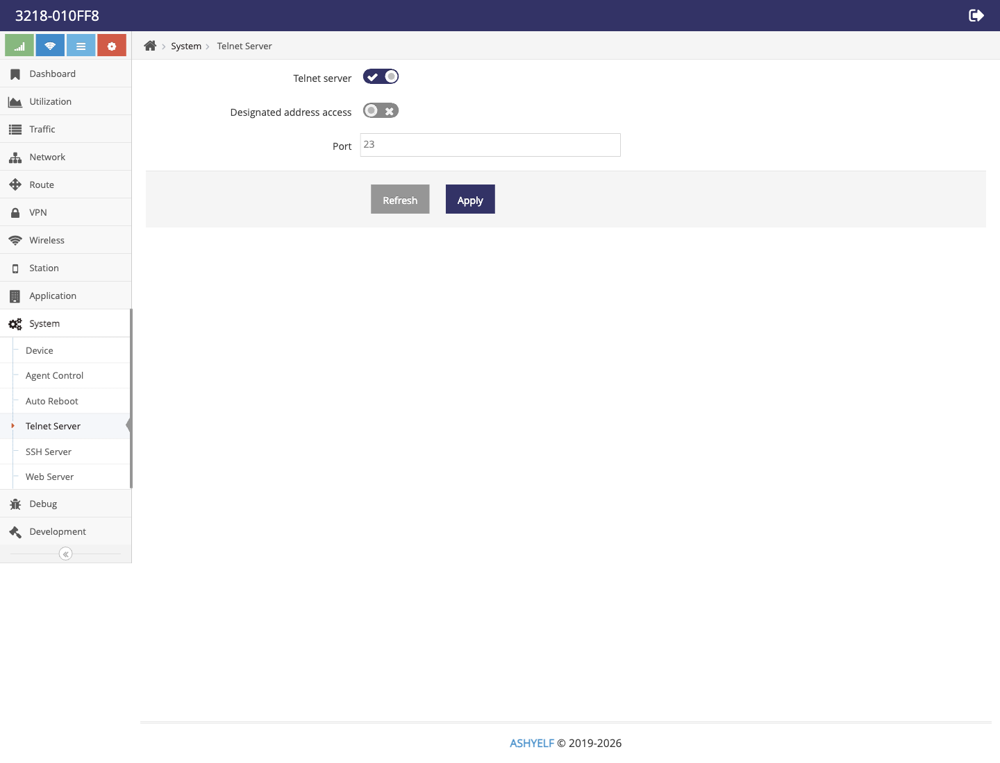

| Field | Meaning |
|-------|---------|
| Telnet Server | Enable `telnetd` |
| Designated Address Access | Limit source IPs (`;` separated) |
| Port | Default `23` |

Same username/password as the web UI. After enable, a client runs `telnet <ip>` and gets the `$ ` eline prompt. Turn this off on WAN if you do not need it. **Apply**.


### 10.8 SSH Server

Sidebar: **System → SSH Server**.

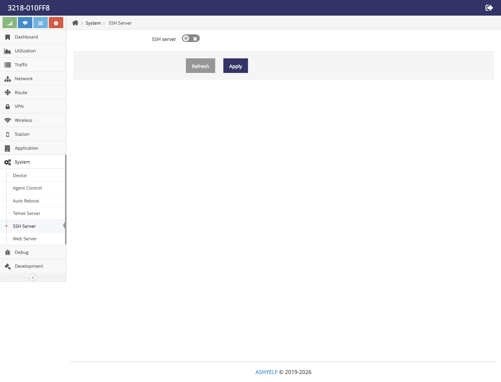

Same fields as Telnet. Default port **22**. `ssh -p <port> admin@<ip>` then eline. **Apply**.


### 10.9 Web Server

Sidebar: **System → Web Server**.

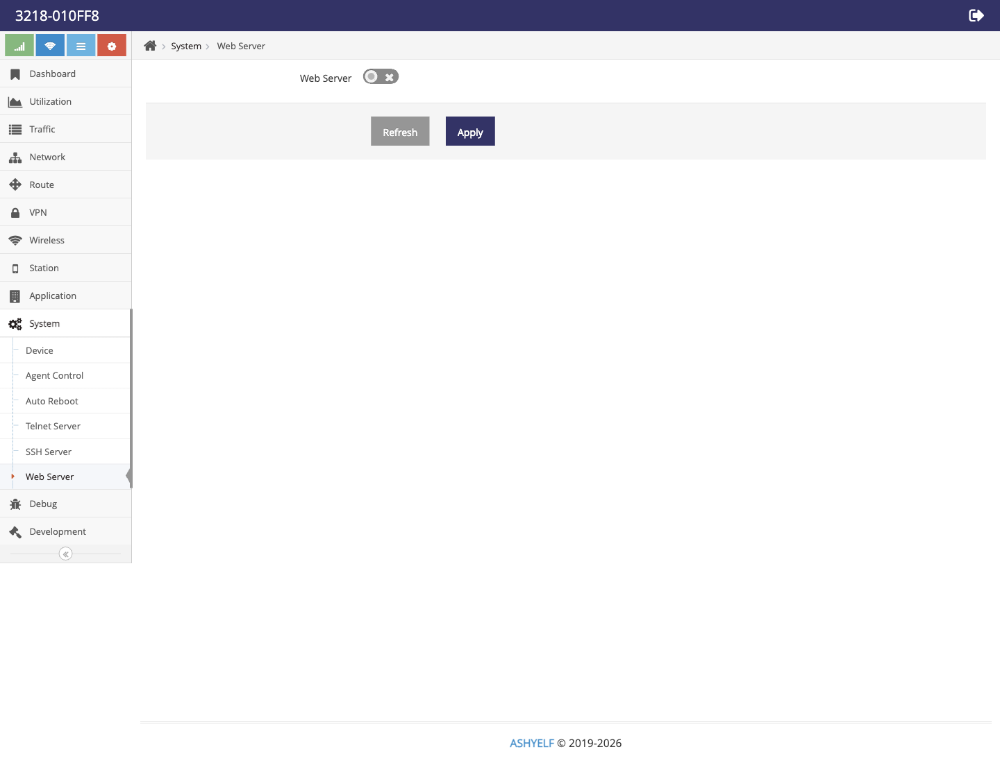

| Field | Meaning |
|-------|---------|
| Web Server | Master switch for the admin site |
| Enable HTTP / Port | Clear-text UI (factory `80`) |
| Enable HTTPS / SSL Port | TLS UI (factory `443`) |
| Designated Address Access | Management ACL (`1.2.3.4;10.0.0.0/8`) |

If you change the HTTP port, browse `http://<ip>:<new-port>/` after Apply. Do not turn both HTTP and HTTPS off or you lose the UI (recover from eline: `wui@admin`).


## 11 Debug

Sidebar group **Debug**.


### 11.1 Syslog

Sidebar: **Debug → Syslog**.

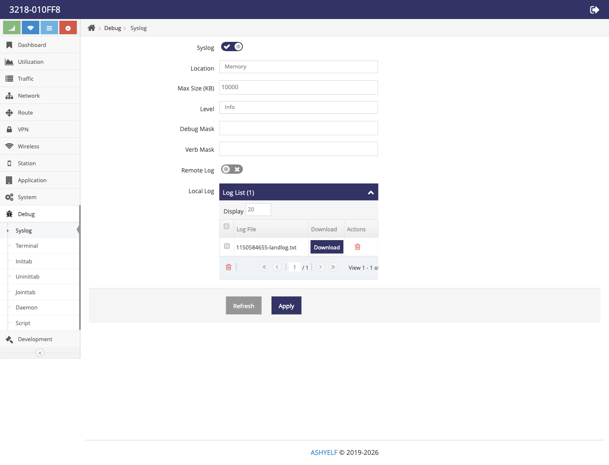

| Field | Meaning |
|-------|---------|
| Syslog | Enable user-space logging |
| Location | **Memory**, **Internal**, **Storage** |
| Max Size(KB) | Rotate size |
| Level | **Fault**, **Warn**, **Info** (more detail as you go down the list in code is `verb`/`debug` via masks) |
| Debug Mask / Verb Mask | Extra module masks |
| Remote Log | Send to a syslog server |
| Remote Server / Port | Host and UDP port (`514`) |

The file grid: download or delete a log. Set Level **Info**, Location **Internal**, **Apply**, reproduce the issue, then download the file.


### 11.2 Terminal

Sidebar: **Debug → Terminal**.

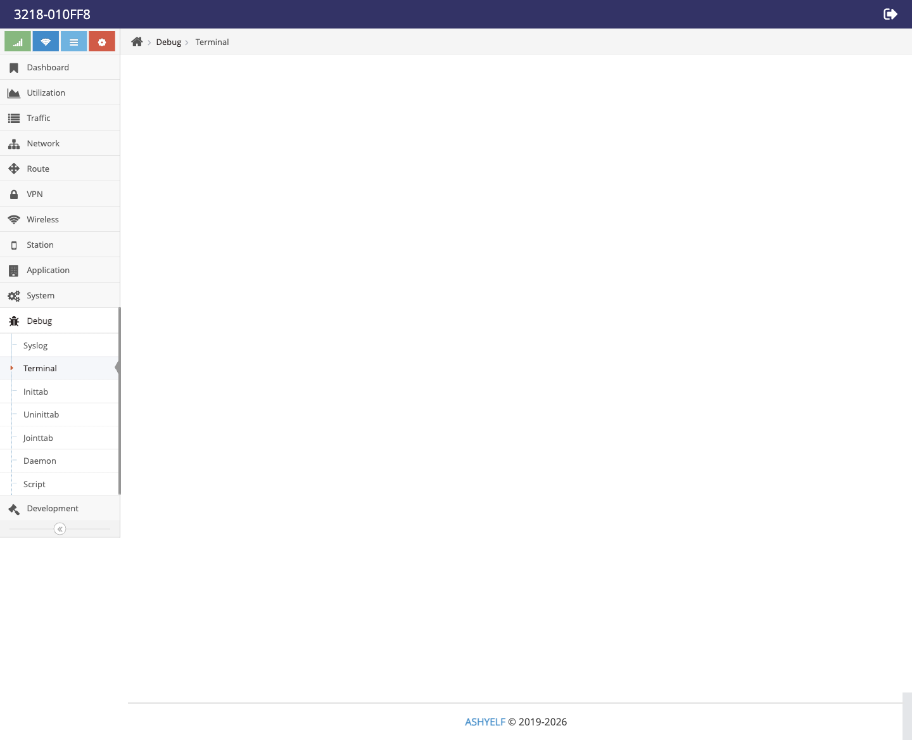

Starts the web ttyd helper and embeds a console. Buttons (when shown): **Close before leave**, **Open HE Terminal**, serial terminals. This is a browser shell, not a replacement for Telnet/SSH eline. Close it before you click LTE **Connect** if the page warns that the AT port is busy.


### 11.3 Inittab

Sidebar: **Debug → Inittab**. Boot call table.

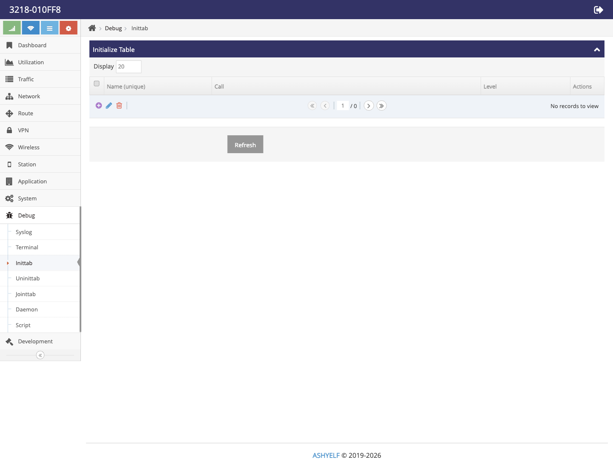

Columns: **Name(unique)**, **Call** (HE line), **Level** (`arch`, `land`, `app`, …), Operation. **+** adds a boot hook. Wrong rows can loop the device — add only HE you have tested.


### 11.4 Uninittab

Sidebar: **Debug → Uninittab**.

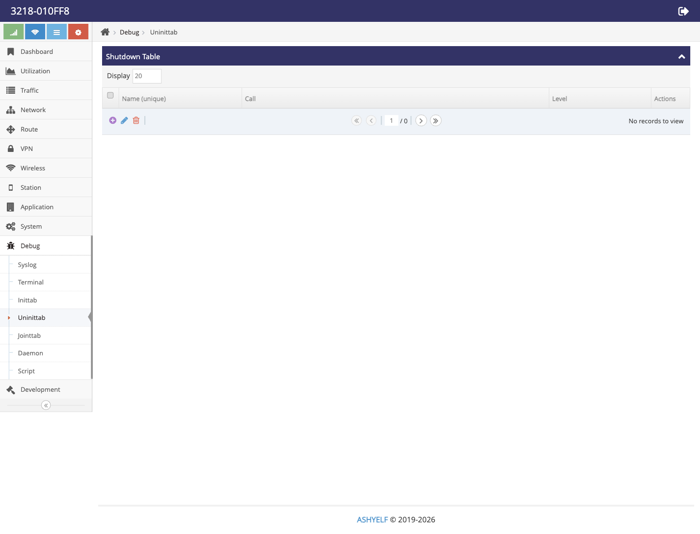

Same shape as Inittab. Runs at shutdown / package unload.


### 11.5 Jointtab

Sidebar: **Debug → Jointtab**.

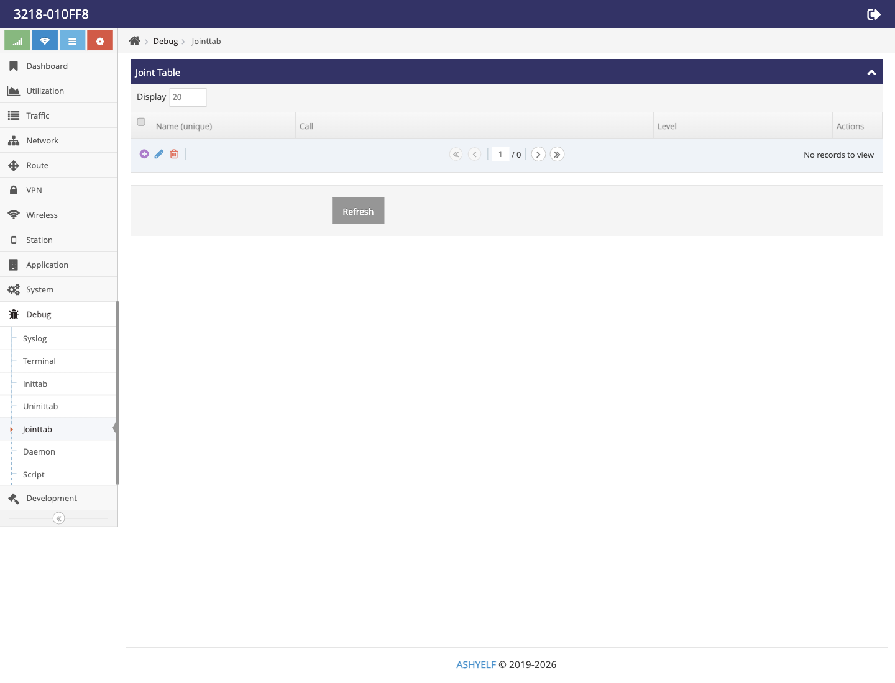

Event → HE call (for example `network/online`). **+** adds a subscriber. Level orders the handlers.


### 11.6 Daemon

Sidebar: **Debug → Daemon**.

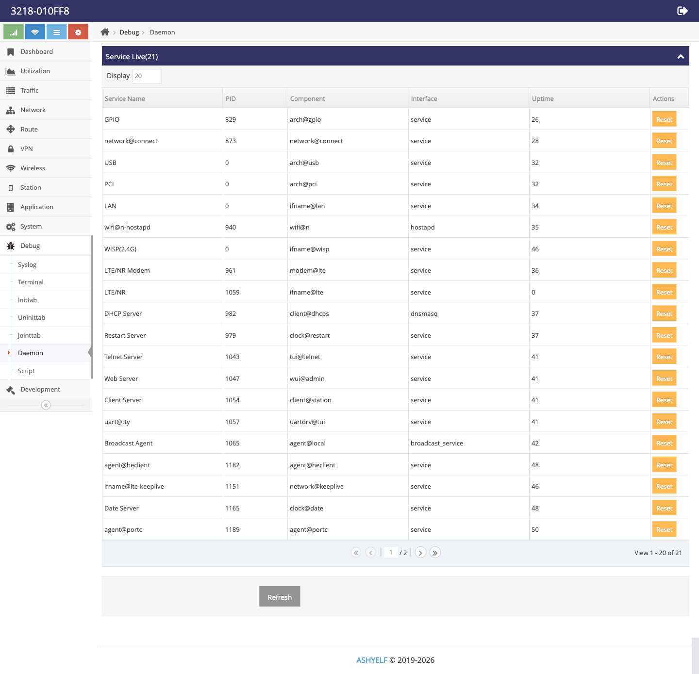

| Column | Meaning |
|--------|---------|
| Service Name / Service ID | Instance and internal id |
| PID | Linux pid |
| Component / Interface | Object and API |
| Uptime | How long this process has run |
| Operation | **Reset** restarts that one service |

Use Reset after a stuck modem or VPN process instead of rebooting the whole unit.


### 11.7 Script

Sidebar: **Debug → Script**.

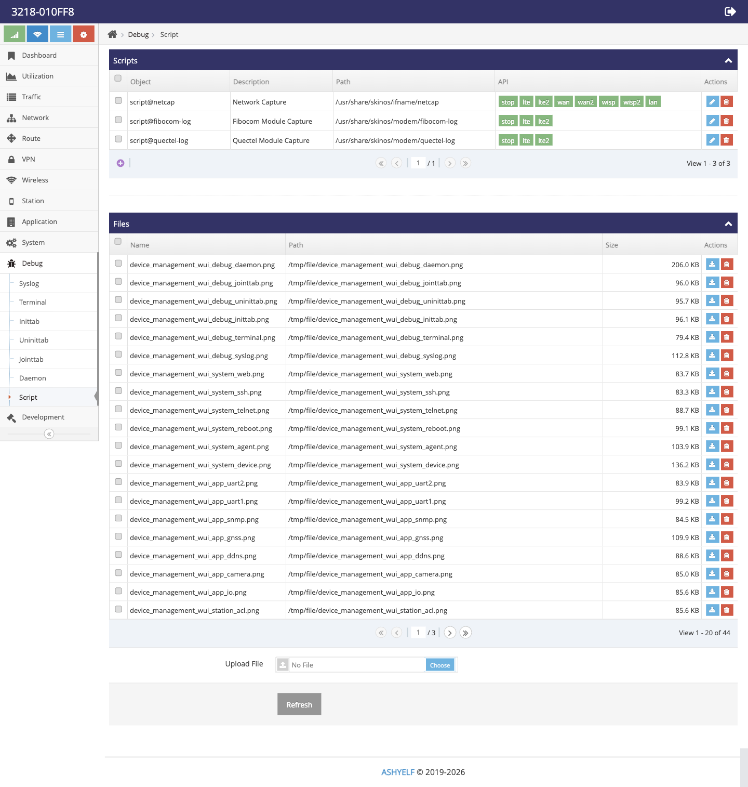

**Scripts** grid: object name, description, path, Run / API buttons, Edit, Delete. **+** asks for a name (`letters`, digits, `_`, `-`). The editor must keep:

```bash
#!/bin/bash
. $cheader
# functions here
cend
```

**Save**, then **Run**. **Files** is `/tmp/file` (cleared on reboot): upload, download, delete. A longer walk-through is `script/web_dev_script.md`.


## 12 Development

Shown when the firmware scope is `std` (or when Development is explicitly enabled).


### 12.1 SDK

Sidebar: **Development → SDK**.

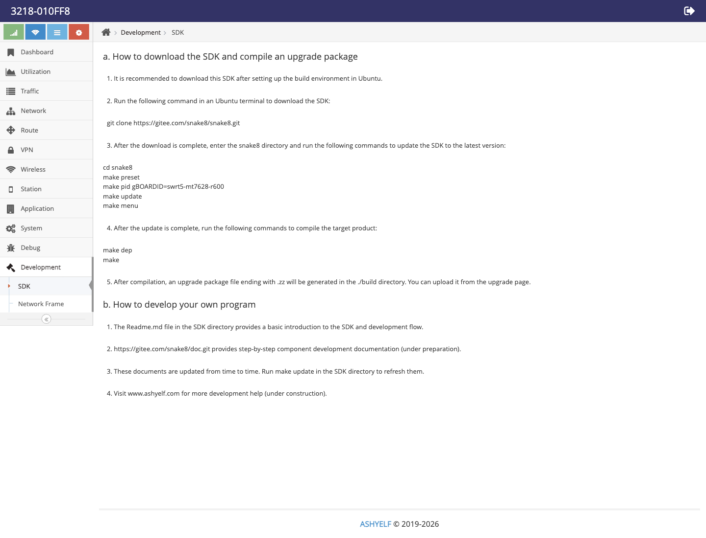

Static build notes (host tools, `make`, `.zz` output). There is no Apply. Operators can skip this page.


### 12.2 Network Frame

Sidebar: **Development → Network Frame**.

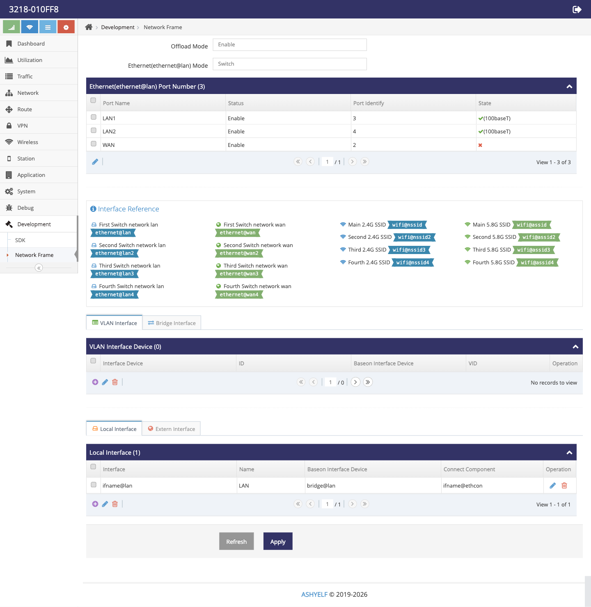

Low-level map of `network@frame` slots, local/extern lists, and mode. The same policy is edited in a friendlier way under **Network → Connection**. Change this page only if you are extending the image.


## Quick recipes

| Goal | Where | What to set |
|------|--------|-------------|
| See if LTE is up | Dashboard | LTE/NR card Status = Online |
| Share LTE to LAN | Network → LTE/NR + LAN | LTE Masquerade on; LAN DHCP on |
| LTE + Wi-Fi WAN backup | Network → Connection | Scheme **Backup(Hot)**; First `ifname@lte`; Second `ifname@wisp` |
| Join a shop AP as WAN | Network → WISP (2.4G) | Rescan, PSK, DHCP, Apply |
| Change LAN to 192.168.10.1 | Network → LAN | Address + DHCP pool, Apply, browse the new IP |
| Open TCP 80 on a PC | Route → Port Map + Firewall | DNAT 80 → PC; allow the port if Default is Drop |
| New Wi-Fi name/password | Wireless → 2.4G SSID | SSID + Mixed WPA-PSK + AES + password, Apply |
| Change web password | System → Device → Password Manage | Old + new, Modify |
| Enable SSH | System → SSH Server | Switch on, port 22, Apply |
| Pull logs | Debug → Syslog | Level Info, Apply, download the file |
| Reboot | System → Device | **Sys Reboot**, or Auto Reboot for a schedule |


## See also

- Command-line form of the same settings: [`device_management_tui.md`](device_management_tui.md)
- Script page walk-through: [`script/web_dev_script.md`](script/web_dev_script.md)
