## IO管理界面

点击1后点击2进入IO管理界面

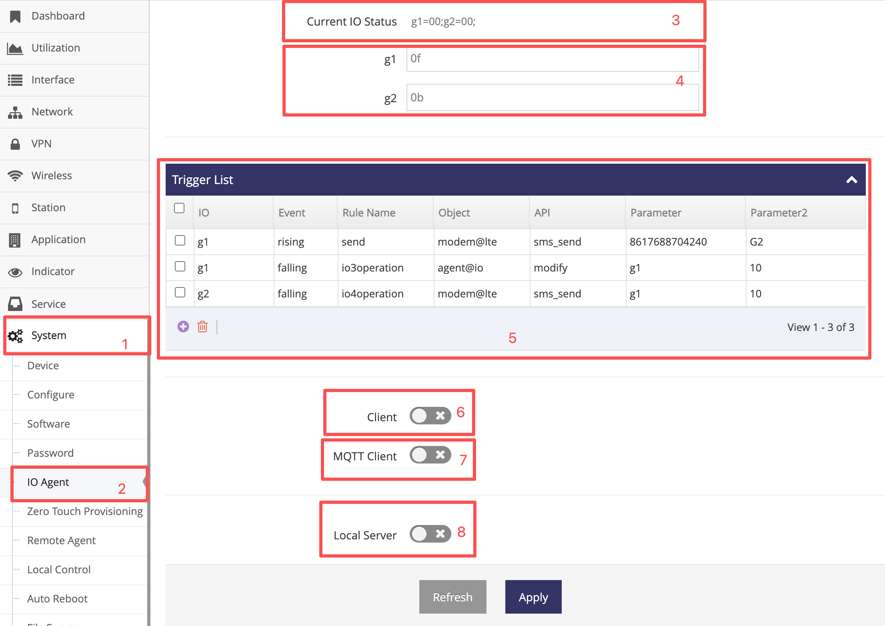  

3. 为当前IO的状态
4. 为IO设置, 在此可以设置IO输出高或低电平, 也可设置IO为输入状态并给出触发条件
5. 为触发列表, 在此可添加在 **4** 中触发条件发生时执行指定的操作
6. 为TCP/UDP客户端设置, 可配置一个TCP/UDP客户端连接指定的服务器, 允许服务器远程控制IO
7. 为MQTT客户端设置, 允许MQTT服务器远程控制IO
8. 为TCP/UDP服务器, 启动后可接受客户端的连接并通过指定协议控制IO


## 当前IO状态介绍

以上图示红框 **3** 为当前IO状态, 红框内容表示设备有g1与g2两个IO口, g1输入低, g2也是输入低, IO当前的状态描述都由以下格式表示, 以分号(;)结尾
```
IO号=状态;
```

多个IO状态可以连接在一起
```
IO号=状态;IO号=状态;IO号=状态;
```

- IO号使用小写, 对应设备的IO号, 比设备的IO口G1在这里就是g1, G2在这里就是g2
- 状态表示当前的状态, 通常为两个字符:
    - 第一个字符表示IO的输入输出状态, 1表示输出, 0表示输入
    - 第二个字符表示IO的值, 1表示高电平, 0表示低电平

- 示例
```
    G1输出高电平:  g1=11;
    G1输出低电平:  g1=10;
    G2输入低电平:  g2=00;
    G2输入高电平:  g2=01;
```

**注意, 当对应的IO口悬空并为输入模式时，电平是不确定的（即可能为高也可能为低)**


## IO设置介绍

以上图示红框 **4** 为当前IO状态, 每个IO可分别设置, 可以设置以下几个选项:
- 11   表示要求此IO输也高电平
- 10   表示要求此IO输出低电平
- 0f   表示要求此IO输入模式, 并且在输入电平从高向低变化时可触发一些操作
- 0r   表示要求此IO输入模式, 并且在输入电平从低向高变化时可触发一些操作
- 0b   表示要求此IO输入模式, 并且在输入电平从高向低或从低向高变化时可触发一些操作


## IO触发操作介绍

以上图示红框 **5** 为触发列表, 在此列表中可为输入模式的IO电平变化时添加触发动作, 以下以示例的方式说明如何添加触发动作

### 以下示例设置当G1的电平由高向低时执行发送短信

a. 因为需要用到短信功能, 需打开设备的短信功能

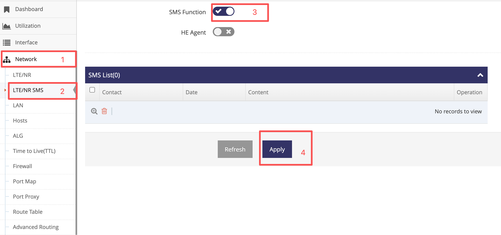  

b. 将G1设置为输入模式, 并指定电压下降时触发

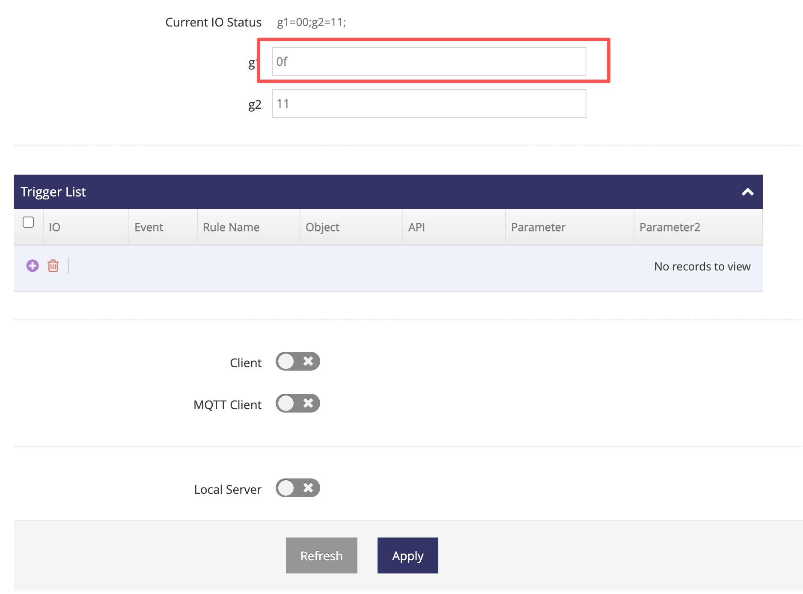  

c. 添加G1电压下降时发送短信

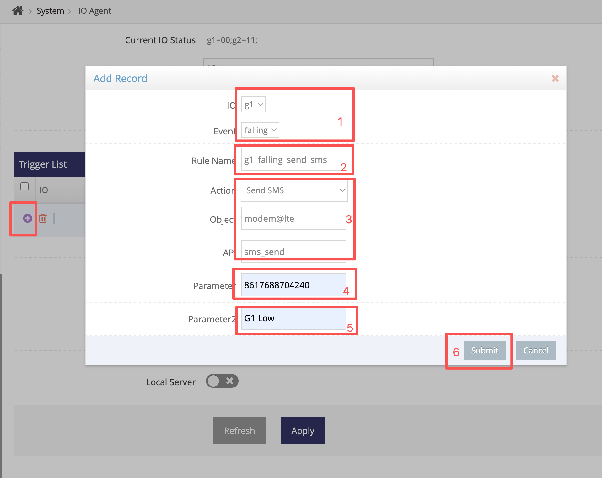  
- 1. 为指定g1电压下降
- 2. 为些规则自定义一个名称, 此名称只允许以字母及数字及下划线组成
- 3. 选项为内置的发送短信的操作
- 4. 发送短信的操作中第一个参数为短信的接收者
- 5. 发送短信的操作中第二个参数短信的内容

因此以上添加的规则表示当g1电压由高向低变化后将向8617688704240发送内容为"G1 Low"的短信

d. 保存以上设置

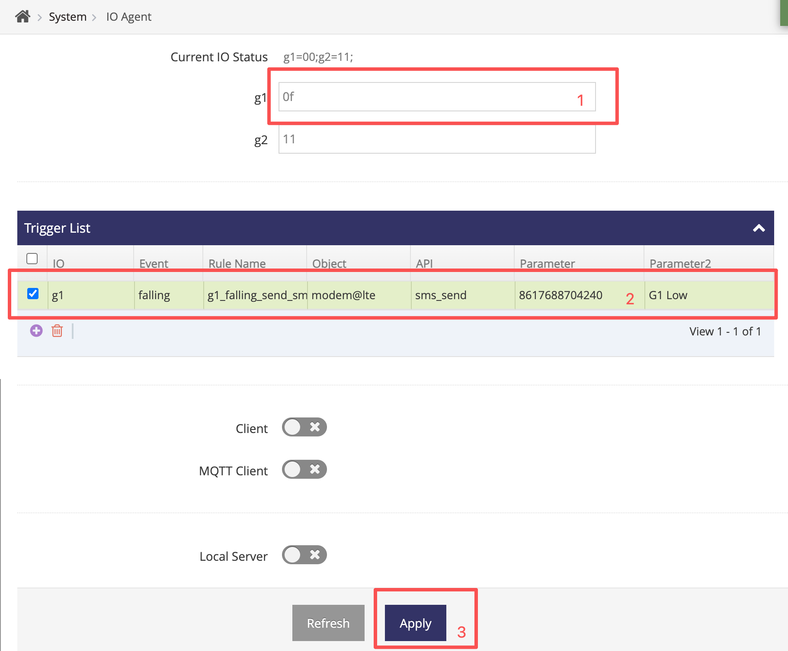  

### 以下示例设置当G2的电平由低向高时将G1设置为输出高

a. 将G2设置为输入模式, 并指定电压上升时触发

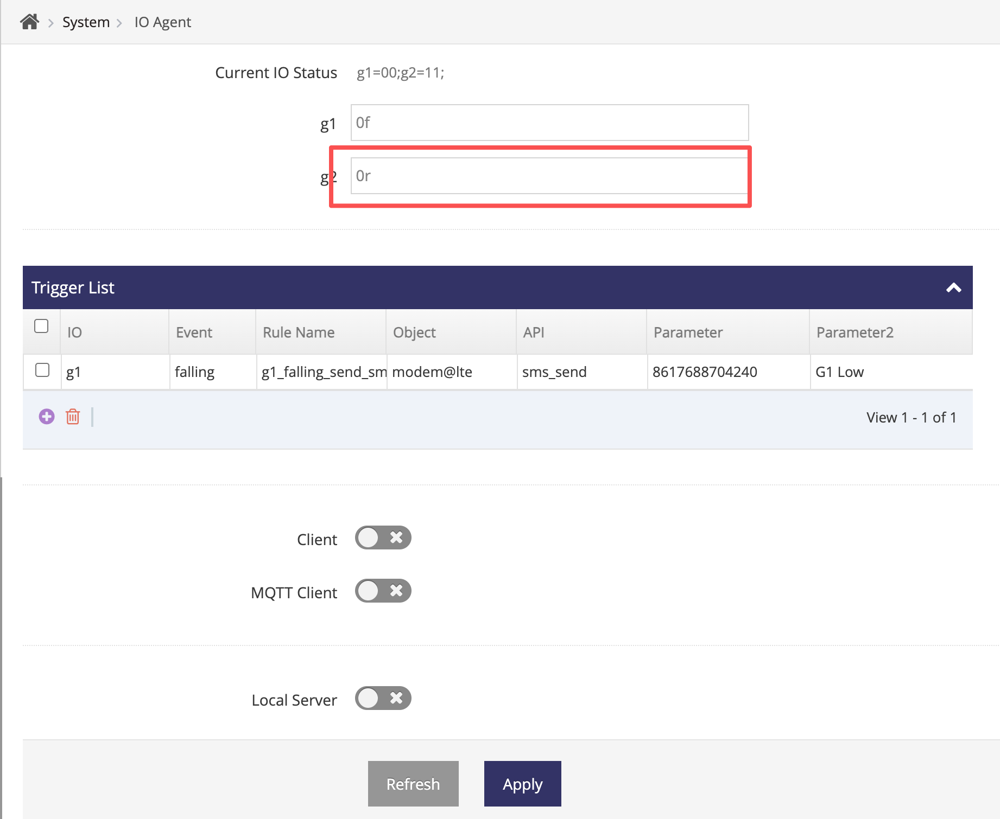  

b. 添加G2电压上升时将G1设置为输出高

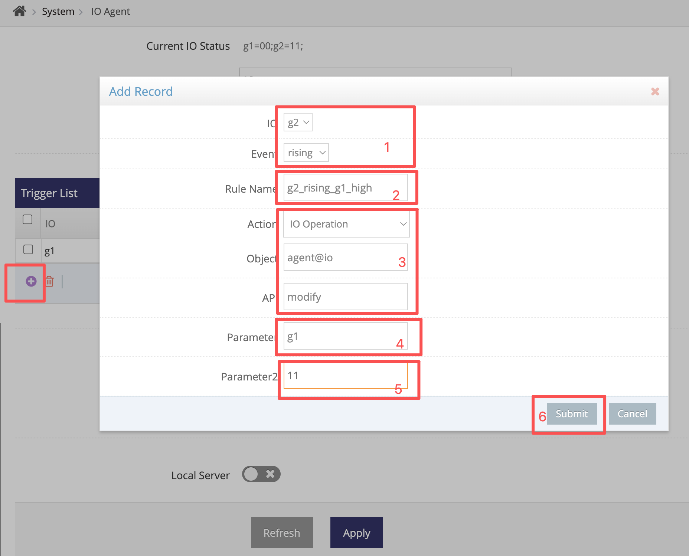  

1. 为指定g2电压上升
2. 为些规则自定义一个名称, 此名称只允许以字母及数字及下划线组成
3. 选项为内置的IO操作
4. IO操作发第一个参数为设置哪个IO
5. IO操作的第二个参数为设置为什么值(见IO设置中的选项)


因此以上添加的规则表示当g2电压由低向高变化后将g1设置为输出高

c. 保存以上设置

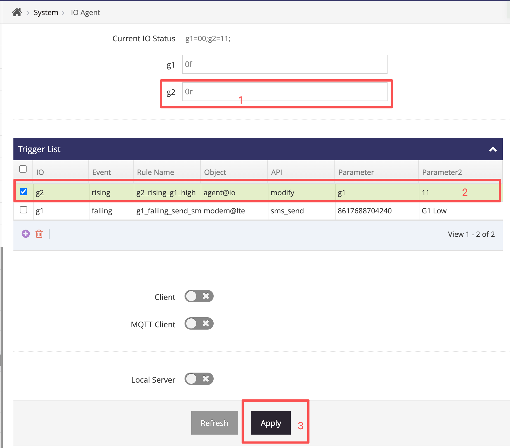  


### 以下示例设置当G2的电平由低向高或由高向低时发送短信

a. 因为需要用到短信功能, 需打开设备的短信功能

  

b. 将G2设置为输入模式, 并指定电压下降或上升时触发

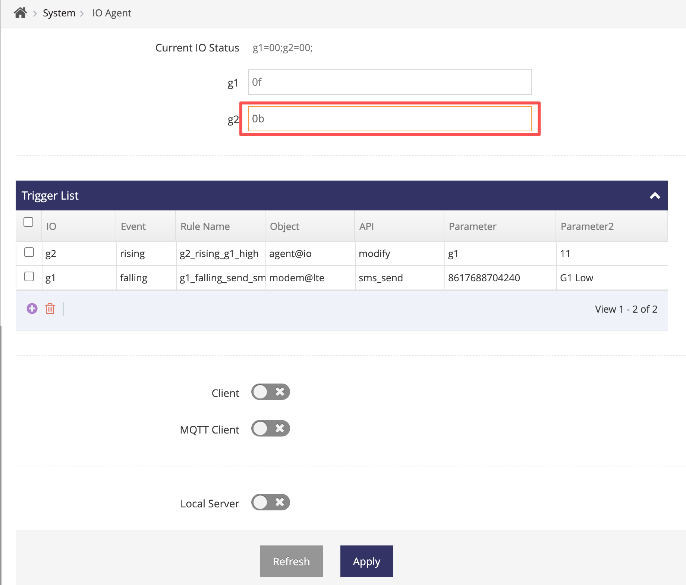  

c. 添加G2电平由低向高或由高向低时发送短信

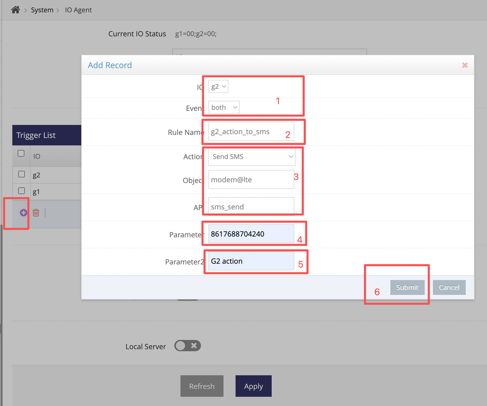  

1. 为指定g2电压下降或电压上升
2. 为些规则自定义一个名称, 此名称只允许以字母及数字及下划线组成
3. 选项为内置的发送短信的操作
4. 发送短信的操作中第一个参数为短信的接收者
5. 发送短信的操作中第二个参数短信的内容

因此以上添加的规则表示当g2电压由高向低或由低向高变化后将向8617688704240发送内容为"G2 action"的短信

d. 保存以上设置

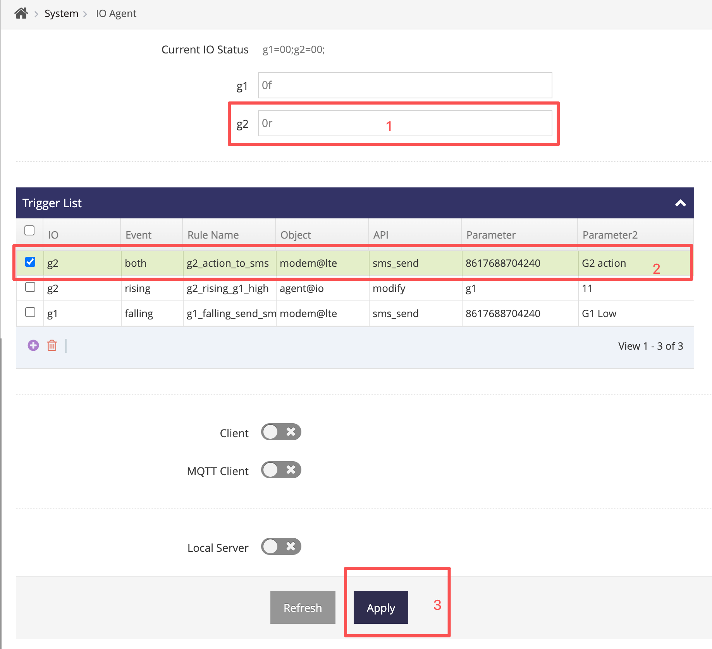  


