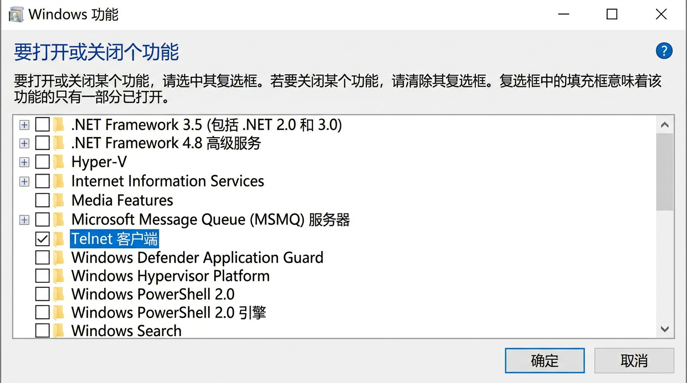
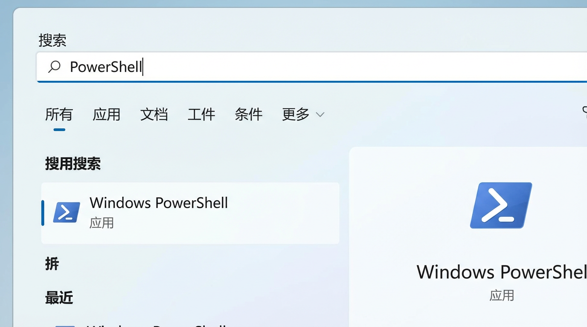
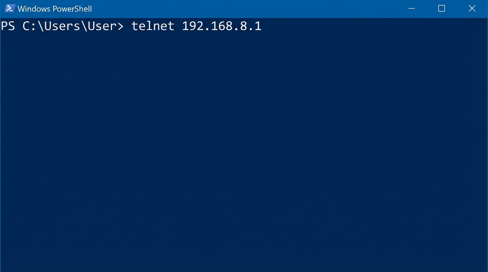
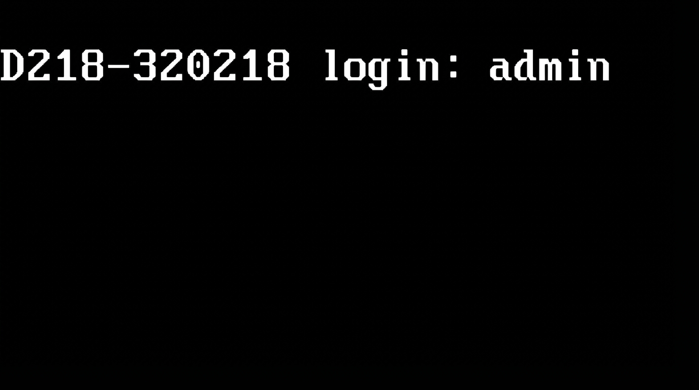
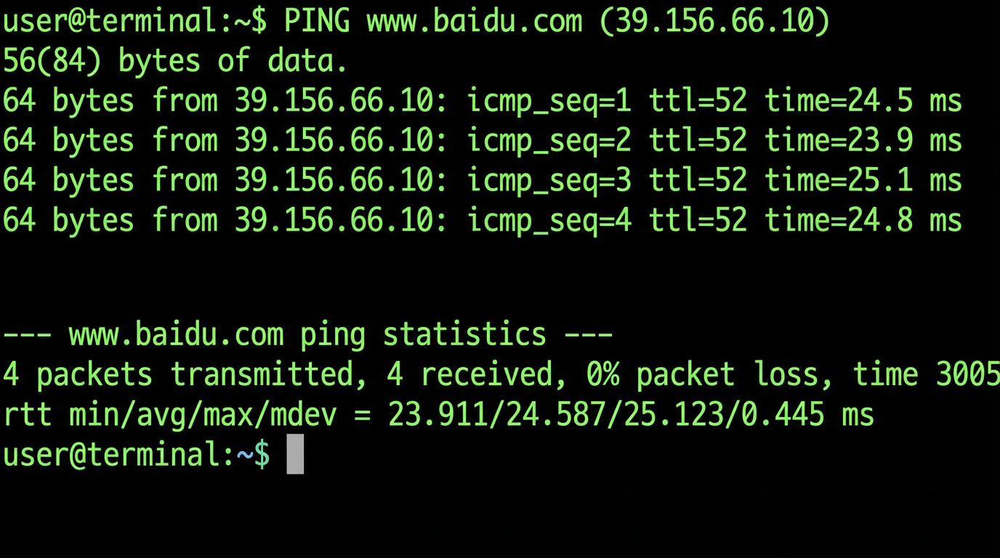
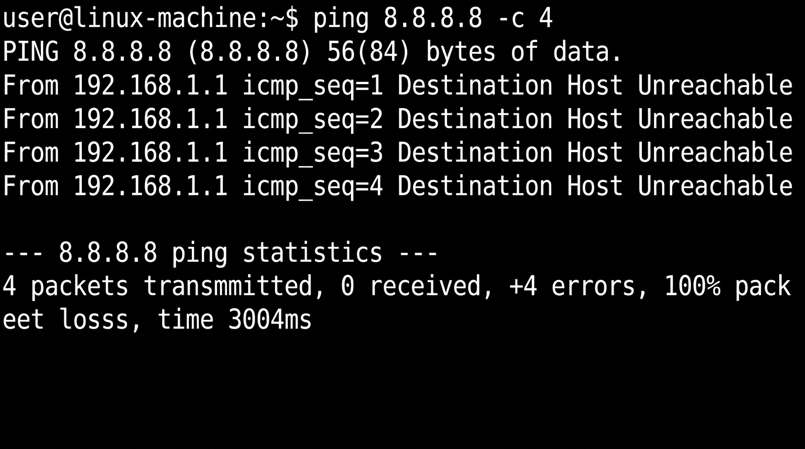

# Windows 11 下通过 Telnet 登录路由器并 Ping 检测外网（以 192.168.8.1 为例）

本文说明在 **Windows 11** 上如何：**启用 Telnet 客户端** → 使用 **Windows PowerShell** 执行 `telnet 192.168.8.1` 连接路由器 → 在出现 **`D218-320218 login:`** 时使用 **`admin` / `admin`** 登录 → 在提示符 **`$`** 下执行 **`ping www.baidu.com`**，并根据回显判断路由器侧是否能访问外网。

> **说明**：配图按 **系统界面截图** 风格制作（**简体中文 Windows 11** 窗口元素；**PowerShell 与 Telnet 终端内文字为英文**），非实拍照片。您电脑上的具体文案、主题色或布局可能因版本略有差异，以本机为准。若需用于正式交付，建议在 **中文语言包的 Windows 11** 上实际操作并截取真机屏幕替换配图。若路由器管理地址、账号密码与本文不同，请按设备说明书修改。

---

## 步骤一：在 Windows 11 上启用 Telnet 客户端

Telnet 默认未安装，需要先打开系统自带的 **Telnet 客户端** 功能。

### 方法一：通过「设置」启用（推荐）

1. 打开 **设置**（快捷键 `Win + I`）。
2. 进入 **应用** → **可选功能**（部分版本为 **应用和功能** 中的相关入口）。
3. 点击 **更多 Windows 功能**（或 **查看功能** / **相关设置** 中指向经典功能列表的链接，具体以您系统显示为准）。
4. 在弹出的 **Windows 功能** 窗口中，找到并 **勾选** **Telnet 客户端**（英文界面为 **Telnet Client**）。
5. 点击 **确定**，等待安装完成，必要时按提示 **重启计算机**。

### 方法二：通过运行对话框快速打开功能列表

1. 按 `Win + R`，输入 **`optionalfeatures.exe`**，回车。
2. 在列表中勾选 **Telnet 客户端**，确定并等待安装完成。

### 如何确认已安装成功

在 **PowerShell** 或 **命令提示符** 中输入：

```text
telnet
```

若不再提示“不是内部或外部命令”，且进入 Telnet 字符界面或显示简要帮助，即表示客户端可用（可用 `quit` 退出 Telnet 再关窗口）。



---

## 步骤二：打开 Windows PowerShell

1. 点击任务栏 **开始** 按钮。
2. 在搜索框输入 **PowerShell** 或 **Windows PowerShell**。
3. 点击打开 **Windows PowerShell**（若需修改系统级网络设置，可右键选择 **以管理员身份运行**；一般仅 Telnet 登录路由器时，普通用户权限通常即可）。



---

## 步骤三：在 PowerShell 中连接路由器

1. 确认电脑已通过网线或 Wi‑Fi 连接到该路由器所在局域网（本例路由器地址为 **`192.168.8.1`**）。
2. 在 PowerShell 中输入以下命令后按 **回车**：

```text
telnet 192.168.8.1
```

3. 若连接成功，窗口通常会变为 **黑底字符界面**（Telnet 会话），与平时蓝底的 PowerShell 不同，这是正常现象。
4. 若长时间无反应或提示无法连接，请检查：IP 是否填写正确、路由器是否开启 Telnet/远程维护、防火墙是否拦截、电脑与路由器是否同一网段。



---

## 步骤四：根据提示登录（D218-320218 login:）

连接成功后，您应看到类似下面的登录提示（型号不同前缀可能略有差异，本例为 **`D218-320218 login:`**）：

```text
D218-320218 login:
```

1. 在 **`login:`** 后输入用户名：**`admin`**（输入时通常可见字符）。
2. 按 **回车**。



---

## 步骤五：输入密码并确认提示符为 `$`

1. 接下来会出现密码提示，常见为 **`Password:`** 或 **`password:`**。
2. 输入密码：**`admin`**。  
   - **注意**：为安全起见，输入密码时 **屏幕上通常不会显示任何字符**（不显示 `*` 也不显示明文），这是正常现象。  
3. 输入完成后按 **回车**。
4. 若账号密码正确，登录成功后会进入路由器的 **Shell**，提示符通常变为 **`$`**（行首只有 `$` 加一个空格，再等待您输入命令）。  
   - 若提示 **Login incorrect**、再次要求输入 `login:`，说明用户名或密码错误，请核对后重试。


---

## 步骤六：在 `$` 提示符下执行 Ping

在 **`$`** 后面输入（注意空格）：

```text
ping www.baidu.com
```

按 **回车**。路由器会向公网目标发送探测包，稍等数秒至十余秒查看完整输出。

> 部分固件上命令可能是 `ping -c 4 www.baidu.com` 等带参数形式；若 `ping www.baidu.com` 报错，可查阅该型号 CLI 说明。本文以常见 BusyBox/Linux 风格为例说明如何判断结果。

---

## 步骤七：如何判断「能 Ping 通」还是「不能 Ping 通」

不同路由器固件文字会略有差别，请抓住 **是否有来自目标的成功应答** 以及 **丢包率** 两点。

### 情况 A：判断为 **能 Ping 通**（外网 DNS 与链路大致正常）

**您通常能看到类似以下内容（满足其一即可倾向判断为通）：**

- 多行 **`64 bytes from …`** 或 **`bytes from www.baidu.com`**，并带有 **`icmp_seq=`**、**`ttl=`**、**`time=… ms`** 等字样。
- 结尾统计类似：**`X packets transmitted, X received, 0% packet loss`**（发送与接收数量一致，**丢包率为 0%**）。

**示例（示意文字，非您设备一字不差）：**

```text
PING www.baidu.com (xxx.xxx.xxx.xxx): 56 data bytes
64 bytes from xxx.xxx.xxx.xxx: seq=0 ttl=52 time=25.123 ms
64 bytes from xxx.xxx.xxx.xxx: seq=1 ttl=52 time=24.891 ms
--- www.baidu.com ping statistics ---
4 packets transmitted, 4 packets received, 0% packet loss
```



---

### 情况 B：判断为 **不能 Ping 通**（需排查 DNS、路由、上游网络或策略）

**若出现以下一类或多类现象，通常表示未通或未能完成探测：**

- 统计为 **`100% packet loss`**（全部丢失），或 **`0 received`**。
- 多行 **`Request timeout`**、**`no answer yet`**、长时间无 **`bytes from`** 成功行。
- **`unknown host`**、**`bad address`**、**`Name or service not known`** 等（可能是 **DNS 无法解析** `www.baidu.com`，也属于“未能成功 Ping 通该域名”）。
- **`Network is unreachable`**、**`Destination Host Unreachable`**（可能是路由或上游链路问题）。

**示例（示意文字）：**

```text
PING www.baidu.com (xxx.xxx.xxx.xxx): 56 data bytes
--- www.baidu.com ping statistics ---
4 packets transmitted, 0 packets received, 100% packet loss
```



---

## 退出 Telnet 与常见问题

- **退出路由器 Shell**：可尝试输入 **`exit`** 或按设备说明书的退出命令；部分设备为 **`logout`**。
- **关闭 Telnet 窗口**：也可直接关闭 PowerShell/Telnet 窗口结束会话。
- **安全提醒**：Telnet **不加密**，仅在受信任的内网中短期排障使用；生产环境建议优先使用 SSH 或路由器 Web 管理提供的诊断工具（若支持）。

---

## 文档与配图文件位置

- 本文档：`Win11-Telnet路由器Ping百度检测指南.md`
- 配图目录：`assets/`（文件名 `win11-step01-…` 至 `win11-step07-…`）

若需打印或分发，请将 **`assets` 文件夹与 Markdown 文件放在同一目录**，避免图片链接失效。
